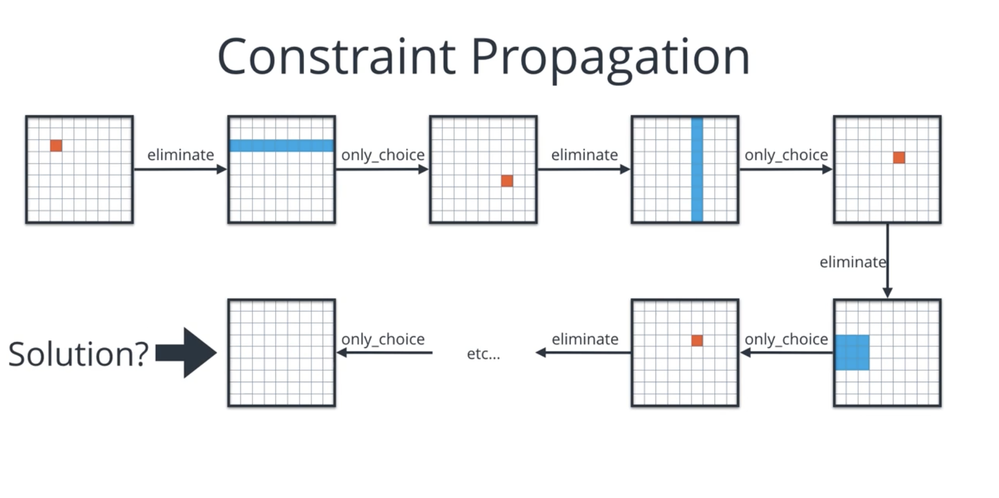
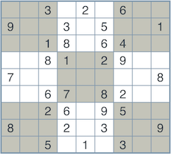

# S-1: Introduction to Artificial Intelligence

# C-1: Fundamentals of AI Search and Reasoning

1. Search Algorithms

    - Dijkstra's Algorithm
    - A\* Search Algorithm
    - Heuristic Functions
    - Mathematical Formulation
    - Applications and Implementation

2. Probabilistic Reasoning

    - Bayes' Rule
    - The Monty Hall Problem
    - Mathematical Proof
    - Conditional Probability Applications

3. Constraint Satisfaction Problems (CSPs)
    - Definition and Mathematical Framework
    - Example Problems
    - Constraint Types and Representation
    - Constraint Graphs

#### Search Algorithms

Search algorithms form the backbone of artificial intelligence systems, allowing computers to navigate complex problem
spaces and find solutions efficiently. These algorithms are fundamental to AI because they provide systematic approaches
to exploring possibilities when direct solutions aren't immediately available.

##### Dijkstra's Algorithm

Dijkstra's algorithm stands as one of the foundational pathfinding algorithms in computer science, developed by Dutch
computer scientist Edsger W. Dijkstra in 1956. While conceptually simpler than A*, it provides the theoretical
underpinning from which A* and many other search algorithms evolved, making it essential to understand in the study of
AI search techniques.

At its core, Dijkstra's algorithm solves the single-source shortest path problem for weighted graphs with non-negative
edge weights. Unlike A\*, which incorporates a heuristic to guide its search, Dijkstra's algorithm relies solely on
accumulated path costs to determine exploration order, making it an uninformed (or blind) search algorithm.

The algorithm operates by maintaining a priority queue of vertices, initially containing only the start vertex with a
distance of zero. It then iteratively selects the vertex with the minimum distance from the queue, explores all its
neighbors, updates their distances if a shorter path is found, and marks the selected vertex as "visited." This process
continues until either the goal vertex is reached or the queue becomes empty.

The fundamental insight of Dijkstra's algorithm lies in its greedy property: at each step, it selects the vertex with
the minimum known distance, which guarantees that when a vertex is removed from the queue, its distance represents the
shortest possible path from the source. This property, known as the "optimality principle," ensures that Dijkstra always
finds the optimal path.

Mathematically, Dijkstra's algorithm maintains an array $d$ where $d[v]$ represents the shortest distance from the
source $s$ to vertex $v$ discovered so far. Initially:

$$d[s] = 0$$ $$d[v] = \infty \text{ for all } v \neq s$$

At each iteration, it selects the unvisited vertex $u$ with the minimum $d[u]$ value and updates the distances to all
its neighbors $v$ according to:

$$d[v] = \min(d[v], d[u] + w(u,v))$$

Where $w(u,v)$ represents the weight of the edge connecting vertices $u$ and $v$.

The time complexity of Dijkstra's algorithm depends on the data structures used. With a binary heap implementation of
the priority queue, the time complexity is $O((V + E) \log V)$, where $V$ is the number of vertices and $E$ is the
number of edges. With a Fibonacci heap, this improves to $O(E + V \log V)$.

Comparing Dijkstra's algorithm to A\* reveals their fundamental relationship:

1. **Exploration strategy**: Dijkstra explores in all directions equally, creating a circular expansion from the
   starting point. A\* directs its search toward the goal using a heuristic.
2. **Evaluation function**: Dijkstra uses only the known path cost $g(n)$, while A\* combines this with a heuristic
   estimate $h(n)$ to form $f(n) = g(n) + h(n)$.
3. **Special case**: When the heuristic function $h(n)$ is uniformly zero, A\* degenerates into Dijkstra's algorithm.
4. **Optimality**: Both algorithms guarantee optimal solutions, but A\* typically explores fewer nodes when provided
   with an admissible heuristic.

Real-world applications of Dijkstra's algorithm include:

1. **Network routing protocols**: The Open Shortest Path First (OSPF) protocol used in internet routing is based on
   Dijkstra's algorithm.
2. **Geographic information systems**: Finding shortest routes between locations on maps.
3. **Robotics**: Path planning in environments where distance is the primary consideration.
4. **Telecommunications**: Designing efficient network topologies and routing data.

Despite being over 60 years old, Dijkstra's algorithm remains critically important both for practical applications and
as the theoretical foundation for more advanced search algorithms. When combined with preprocessing techniques like
contraction hierarchies or landmarks, it can efficiently solve pathfinding problems in massive networks with millions of
nodes, such as continental road networks.

Understanding Dijkstra's algorithm provides crucial insight into the fundamental trade-off in search algorithms between
completeness, optimality, and efficiency—a trade-off that continues to drive research in artificial intelligence
pathfinding techniques today.

##### A\* Search Algorithm

The A* (pronounced "A-star") search algorithm represents one of the most elegant and powerful approaches in AI
pathfinding. Developed in 1968 by Peter Hart, Nils Nilsson, and Bertram Raphael, A* combines the completeness and
optimality of Dijkstra's algorithm with the efficiency of greedy best-first search.

At its core, A* works like an informed explorer that balances what it knows for certain with educated guesses about what
lies ahead. Imagine hiking through a mountain range toward a visible peak—you might choose your next step based both on
how far you've already traveled (known information) and your estimate of the remaining distance (heuristic). This is
precisely how A* operates.

The algorithm maintains two sets of nodes during its execution:

- An "open set" containing nodes that have been discovered but not yet fully evaluated
- A "closed set" holding nodes that have already been evaluated

For each potential path, A\* calculates both the cost incurred so far and an estimated cost to reach the goal. By
combining these values, it prioritizes the most promising paths while guaranteeing it will find the optimal solution if
one exists.

What makes A* particularly valuable is its flexibility across different problem domains. Whether navigating robot
movement, planning game character pathfinding, or optimizing network routing, A* can be adapted by simply changing its
heuristic function to match the specific problem characteristics.

##### Heuristic Functions

Heuristic functions serve as the "intelligent" component of A\*, providing educated estimates about the remaining cost
to reach a goal. A well-designed heuristic dramatically improves search efficiency by guiding exploration toward
promising directions and away from dead ends.

For a heuristic to guarantee finding the optimal solution, it must be admissible—meaning it never overestimates the true
cost to reach the goal. This property ensures A* won't overlook potentially optimal paths. Additionally, a consistent
(or monotonic) heuristic satisfies the triangle inequality, further improving A*'s efficiency.

Common heuristic functions include:

1. **Manhattan distance**: Used in grid environments where movement is limited to four directions (up, down, left,
   right). It calculates the sum of horizontal and vertical distances between points.
2. **Euclidean distance**: Appropriate for spaces allowing movement in any direction, measuring the straight-line
   distance between two points.
3. **Diagonal distance**: Suitable for grid environments permitting eight-directional movement, taking the maximum of
   the absolute horizontal and vertical distances.

The effectiveness of a heuristic can be measured by its informedness—how closely it approximates the true cost. A more
informed heuristic reduces the number of nodes explored but may require more complex calculations. This presents an
important trade-off in heuristic design between computational cost and search efficiency.

##### Mathematical Formulation

The A\* algorithm evaluates nodes using an evaluation function $f(n)$ that represents the estimated total path cost
through node $n$. This function is composed of two parts:

$$f(n) = g(n) + h(n)$$

Where:

- $g(n)$ represents the actual cost of the path from the start node to node $n$ (known information)
- $h(n)$ represents the heuristic estimate of the cost from $n$ to the goal (educated guess)

For grid-based navigation, the common heuristics can be mathematically formulated as:

**Manhattan distance:** $$h(n) = |x_1 - x_2| + |y_1 - y_2|$$

**Euclidean distance:** $$h(n) = \sqrt{(x_1 - x_2)^2 + (y_1 - y_2)^2}$$

**Diagonal distance:** $$h(n) = \max(|x_1 - x_2|, |y_1 - y_2|)$$

The algorithm proceeds by repeatedly selecting the node with the lowest $f(n)$ value from the open set, examining its
neighbors, and updating their $g(n)$ values if a better path is found. This process continues until either the goal is
reached or the open set becomes empty (indicating no solution exists).

The time complexity of A* depends heavily on the heuristic function. With a perfect heuristic, A* would examine only
nodes on the optimal path, achieving linear time complexity. In practice, with admissible heuristics, the complexity is
typically exponential in the length of the solution, but significantly better than uninformed search methods.

##### Applications and Implementation

A\* search finds applications across numerous domains where optimal pathfinding is crucial:

1. **Video game AI**: Characters navigate complex environments with obstacles, seeking the shortest or safest paths
   while maintaining computational efficiency.
2. **Robotics**: Autonomous robots plan movements through physical spaces, balancing path optimality with real-time
   constraints.
3. **GPS navigation systems**: Route planning algorithms often implement variants of A\* to find optimal paths through
   road networks.
4. **Network routing**: Data packets can be routed through networks using A\*-inspired algorithms that consider both
   congestion and distance.
5. **Puzzle solving**: Problems like the 15-puzzle, Rubik's cube, and other state-space puzzles can be approached using
   A\* with appropriate heuristics.

Implementing A\* requires careful data structure choices. Priority queues (typically implemented as binary heaps or
Fibonacci heaps) efficiently manage the open set, allowing quick access to the node with the lowest $f(n)$ value. Hash
tables or sets track the closed set, enabling constant-time lookups to avoid reprocessing nodes.

Modern implementations often include optimizations like tie-breaking (preferring paths that reach the goal faster when
$f(n)$ values are equal) and memory-bounded variations (such as Iterative Deepening A* or Simplified Memory-Bounded A*)
for extremely large state spaces.

A\* remains a foundational algorithm in AI search because it elegantly balances the trade-off between optimality
guarantees and computational efficiency. By understanding its principles, you gain insight into how intelligent systems
can systematically explore possibilities and make optimal decisions even in highly complex problem spaces.

#### Probabilistic Reasoning

Probabilistic reasoning forms a cornerstone of artificial intelligence, enabling systems to make decisions under
uncertainty. Rather than dealing with absolute truths, probabilistic methods acknowledge the inherent uncertainty in
real-world problems and provide frameworks for quantifying and reasoning with degrees of belief.

##### Bayes' Rule

Bayes' rule represents one of the most fundamental principles in probability theory and serves as the mathematical
foundation for many AI systems. Named after Reverend Thomas Bayes (1701-1761), this theorem describes how to update
existing beliefs when new evidence becomes available.

At its core, Bayes' rule provides a way to calculate the probability of a hypothesis given observed evidence, based on
the prior probability of the hypothesis and the likelihood of observing the evidence given the hypothesis.

The rule is formally expressed as:

$$P(H|E) = \frac{P(E|H) \times P(H)}{P(E)}$$

Where:

- $P(H|E)$ is the posterior probability: the probability of hypothesis $H$ given evidence $E$
- $P(E|H)$ is the likelihood: the probability of observing evidence $E$ given hypothesis $H$
- $P(H)$ is the prior probability: the initial belief in hypothesis $H$ before seeing evidence
- $P(E)$ is the marginal likelihood: the total probability of observing evidence $E$ under all possible hypotheses

Let's examine a concrete example to illustrate this principle:

**Example: Medical Diagnosis**

Suppose a test for a certain disease has the following characteristics:

- The disease affects 1% of the population: $P(Disease) = 0.01$
- The test correctly identifies 95% of diseased patients: $P(Positive|Disease) = 0.95$
- The test incorrectly identifies 5% of healthy patients as diseased: $P(Positive|No Disease) = 0.05$

If a patient tests positive, what is the probability they actually have the disease?

Using Bayes' rule:

$$P(Disease|Positive) = \frac{P(Positive|Disease) \times P(Disease)}{P(Positive)}$$

The denominator $P(Positive)$ can be expanded using the law of total probability:

$$P(Positive) = P(Positive|Disease) \times P(Disease) + P(Positive|No Disease) \times P(No Disease)$$
$$P(Positive) = 0.95 \times 0.01 + 0.05 \times 0.99 = 0.0095 + 0.0495 = 0.059$$

Now we can calculate the posterior probability:

$$P(Disease|Positive) = \frac{0.95 \times 0.01}{0.059} \approx 0.161 \text{ or about } 16.1%$$

This result often surprises people. Despite the test being 95% accurate for those with the disease, a positive result
only indicates a 16.1% probability of actually having the disease. This counterintuitive outcome demonstrates the
importance of considering both prior probabilities and likelihoods when interpreting evidence.

###### Calculating Probability with Two Independent Tests

When two tests are completely independent, we need to approach this problem differently. In this case, we're dealing
with two independent positive test results, and we want to find the probability of disease given both positive results.

Let's define our events:

- $D$: Having the disease
- $T_1$: First test is positive
- $T_2$: Second test is positive

Using Bayes' rule:

$$P(D|T_1,T_2) = \frac{P(T_1,T_2|D) \times P(D)}{P(T_1,T_2)}$$

Since the tests are independent (meaning the outcome of one test doesn't influence the other):

$$P(T_1,T_2|D) = P(T_1|D) \times P(T_2|D) = 0.95 \times 0.95 = 0.9025$$

Similarly, for the case of not having the disease:

$$P(T_1,T_2|\neg D) = P(T_1|\neg D) \times P(T_2|\neg D) = 0.05 \times 0.05 = 0.0025$$

Now for the denominator using the law of total probability:

$$P(T_1,T_2) = P(T_1,T_2|D) \times P(D) + P(T_1,T_2|\neg D) \times P(\neg D)$$

$$P(T_1,T_2) = 0.9025 \times 0.01 + 0.0025 \times 0.99$$ [e.g TP+ FP]

$$P(T_1,T_2) = 0.009025 + 0.002475 = 0.0115$$

Finally, we calculate the posterior probability:

$$P(D|T_1,T_2) = \frac{0.9025 \times 0.01}{0.0115} \approx 0.7848 \text{ or about } 78.5%$$

Where,

TP = True positives (both tests positive)

FP= False positives (both tests positive)

##### The Monty Hall Problem

The Monty Hall problem represents one of the most famous probability puzzles that demonstrates how conditional
probability can defy intuition. Named after the host of the game show "Let's Make a Deal," the problem illustrates
subtle aspects of probabilistic reasoning.

The scenario is as follows:

1. You are presented with three doors, behind one of which is a car, while goats are behind the other two
2. You select one door (e.g., Door A), which remains closed
3. The host, who knows what's behind each door, opens another door (e.g., Door B) to reveal a goat
4. The host then offers you the option to switch your selection to the remaining door (Door C)

The question is: Should you switch doors to maximize your chances of winning the car?

Intuitively, many people believe that with two doors remaining, the probability is split evenly at 50/50, making
switching irrelevant. However, a rigorous probability analysis reveals that switching doors actually doubles your
chances of winning, from 1/3 to 2/3.

##### Mathematical Proof

We can analyze the Monty Hall problem using Bayes' rule and conditional probability. Let's define the events:

- Guest selected the door A which remained closed 
- $CarA$: The car is behind Door A
- $CarB$: The car is behind Door B
- $CarC$: The car is behind Door C
- $OpenB$: The host opens Door B to reveal a goat

Assuming you initially choose Door A, we want to determine $P(CarC|OpenB)$ - the probability the car is behind Door C
given that the host opened Door B.

First, we can calculate the probability of the host opening Door B using the law of total probability:

$$P(OpenB) = P(CarA) \times P(OpenB|CarA) + P(CarB) \times P(OpenB|CarB) + P(CarC) \times P(OpenB|CarC)$$

Let's analyze each term:

- $P(CarA) = P(CarB) = P(CarC) = \frac{1}{3}$ (equal initial probabilities)
- $P(OpenB|CarA) = \frac{1}{2}$ (if car is at A, host can open either B or C)
- $P(OpenB|CarB) = 0$ (if car is at B, host cannot open B)
- $P(OpenB|CarC) = 1$ (if car is at C, host must open B)

Therefore:
$$P(OpenB) = \frac{1}{3} \times \frac{1}{2} + \frac{1}{3} \times 0 + \frac{1}{3} \times 1 = \frac{1}{6} + 0 + \frac{1}{3} = \frac{1}{2}$$

Now applying Bayes' rule:

$$P(CarC|OpenB) = \frac{P(OpenB|CarC) \times P(CarC)}{P(OpenB)} = \frac{1 \times \frac{1}{3}}{\frac{1}{2}} = \frac{2}{3}$$

This demonstrates mathematically that switching to Door C gives you a 2/3 probability of winning the car, twice the 1/3
probability of staying with Door A.

The result can also be understood through a different approach by considering all possible outcomes:

1. If the car is behind Door A (1/3 chance), staying wins, switching loses
2. If the car is behind Door B (1/3 chance), staying loses, switching loses
3. If the car is behind Door C (1/3 chance), staying loses, switching wins

Since the host always reveals a goat, if the car is behind Door B, the host must show Door C, eliminating scenario 2.
This leaves scenarios 1 and 3, where switching wins 2/3 of the time.

##### Conditional Probability Applications

Conditional probability and Bayes' rule have numerous important applications in artificial intelligence and machine
learning:

1. **Bayesian Networks**: These graphical models represent random variables and their conditional dependencies. They
   form the foundation for medical diagnosis systems, fault diagnosis, and risk analysis.
2. **Naive Bayes Classifiers**: Despite their simplicity, these classifiers are surprisingly effective for many
   real-world problems, including:
    - Email spam filtering, where features like word frequencies determine message classification
    - Document categorization based on term frequencies
    - Medical diagnosis based on symptom patterns
3. **Bayesian Inference in Machine Learning**: Updating model parameters based on observed data, representing
   uncertainty in estimates, and preventing overfitting.
4. **Speech Recognition**: Determining the most likely sequence of words given acoustic signals.
5. **Computer Vision**: Identifying objects by calculating the probability of specific features appearing in different
   object classes.

Let's examine a simplified spam filter application:

**Example: Naive Bayes Spam Filter**

Suppose we have the following statistics:

- 30% of emails are spam: $P(Spam) = 0.3$
- The word "free" appears in 80% of spam emails: $P(free|Spam) = 0.8$
- The word "free" appears in 10% of legitimate emails: $P(free|Legitimate) = 0.1$

If an email contains the word "free", what's the probability it's spam?

Using Bayes' rule:

$$P(Spam|free) = \frac{P(free|Spam) \times P(Spam)}{P(free)}$$

Where: $$P(free) = P(free|Spam) \times P(Spam) + P(free|Legitimate) \times P(Legitimate)$$
$$P(free) = 0.8 \times 0.3 + 0.1 \times 0.7 = 0.24 + 0.07 = 0.31$$

Therefore: $$P(Spam|free) = \frac{0.8 \times 0.3}{0.31} \approx 0.774 \text{ or about } 77.4%$$

Real-world spam filters would consider many words and their relative frequencies, but this example demonstrates how
Bayesian reasoning can be applied to classification problems.

Conditional probability provides a powerful framework for AI systems to reason with partial information and update
beliefs as new evidence emerges. Understanding these principles is essential for developing systems that can operate
effectively in the uncertain, constantly changing environments that characterize most real-world applications.

#### Constraint Satisfaction Problems (CSPs)

Constraint Satisfaction Problems represent a powerful framework in artificial intelligence for solving a wide range of
complex problems through a declarative approach. Instead of specifying how to find a solution, CSPs allow us to define
what constitutes a valid solution and let specialized algorithms do the work of finding it.

##### Definition and Mathematical Framework

At its core, a Constraint Satisfaction Problem is formally defined as a triple ⟨X, D, C⟩ where:

- X = {X₁, X₂, ..., Xₙ} is a set of variables that need to be assigned values
- D = {D₁, D₂, ..., Dₙ} is a set of domains, where each Dᵢ represents the possible values that can be assigned to
  variable Xᵢ
- C = {C₁, C₂, ..., Cₘ} is a set of constraints that specify allowable combinations of values for subsets of variables

The goal in a CSP is to assign a value to each variable from its domain such that all constraints are satisfied. What
makes CSPs particularly powerful is their ability to represent problems declaratively – we simply state what conditions
must be met rather than prescribing a specific solution method.

For instance, imagine scheduling university courses. Variables might represent different courses, domains could be the
available time slots, and constraints would include requirements like "Professor Smith cannot teach two classes
simultaneously" or "Introductory classes must be held in the morning."

A solution to a CSP is an assignment of values to all variables such that every constraint is satisfied. Depending on
the problem, we might seek:

- Any solution that satisfies all constraints
- All possible solutions
- An optimal solution according to some objective function

The mathematical framework of CSPs provides a common language for expressing and solving diverse problems, from
scheduling and planning to design and configuration tasks.

figure: Constraint Propagation

##### Example Problems

CSPs appear in many forms across numerous domains. Here are several classic examples that illustrate the versatility of
the CSP framework:

**Sudoku**

Sudoku perfectly exemplifies a CSP structure:

- Variables: The 81 cells in the 9×9 grid
- Domains: Each cell can contain digits 1-9
- Constraints: Each row, column, and 3×3 subgrid must contain exactly one instance of each digit 1-9

In a partially filled Sudoku puzzle, some cells have fixed values (reducing their domains to a single value), and the
task is to fill the remaining cells while satisfying all constraints. What makes Sudoku interesting from a CSP
perspective is how the interplay of simple constraints creates a challenging puzzle.

figure: Sudoku Board

**N-Queens Problem**

The N-Queens problem asks: "How can $N$ chess queens be placed on an $N×N$ chessboard so that no queen threatens another?"
As a CSP:

- Variables: The queens to be placed (or alternatively, the queen in each column)
- Domains: Possible board positions (or row positions if using the column-based formulation)
- Constraints: No two queens can share the same row, column, or diagonal

This problem illustrates how CSPs can represent problems with spatial constraints. For the 8-Queens problem, there are
92 distinct solutions (or 12 when accounting for symmetries).

figure: Eight Queens

**Map Coloring**

The map coloring problem involves assigning colors to regions on a map such that no adjacent regions share the same
color. For a map of Australia:

- Variables: Regions such as Western Australia (WA), Northern Territory (NT), South Australia (SA), etc.
- Domains: Available colors (e.g., red, green, blue)
- Constraints: No adjacent regions can have the same color, expressed as binary constraints like SA≠WA, SA≠NT, etc.

The famous Four Color Theorem states that any planar map can be colored using at most four colors, though specific maps
may require fewer.

figure: Map Coloring

**Cryptarithmetic Puzzles**

Consider the classic SEND + MORE = MONEY puzzle, where each letter represents a different digit:

- Variables: The letters S, E, N, D, M, O, R, Y
- Domains: Digits 0-9 (with the constraint that leading digits S and M cannot be 0)
- Constraints: The arithmetic must be correct: 1000S + 100E + 10N + D + 1000M + 100O + 10R + E = 10000M + 1000O + 100N +
  10E + Y

What makes this example interesting is the complexity of the arithmetic constraint, which involves multiple variables in
a specific mathematical relationship.

##### Constraint Types and Representation

Constraints in CSPs can take various forms, and understanding these different types helps in both problem formulation
and solving:

**Unary Constraints**

A unary constraint involves only a single variable and restricts its possible values. For example, in the map coloring
problem, if we decide that Western Australia must be colored blue, we can express this as a unary constraint: ⟨(WA),
WA=blue⟩.

Unary constraints effectively reduce the domain of a variable, sometimes to a single value. They're typically the
simplest to handle in solving algorithms and are often processed as a preprocessing step.

**Binary Constraints**

Binary constraints relate two variables and restrict their combined values. In the map coloring example, the constraint
that adjacent regions must have different colors can be represented as binary constraints like ⟨(SA, WA), SA≠WA⟩.

Binary constraints are particularly important because many CSPs can be reformulated to use only binary constraints, and
specialized algorithms exist for efficiently handling them. The constraint graph (discussed in the next section) is
based on binary constraints.

**Global Constraints**

Global constraints involve three or more variables and often capture higher-level relations that would be cumbersome to
express with multiple binary constraints. Examples include:

- The "all-different" constraint: All variables in a set must have different values (as in Sudoku rows, columns, and
  boxes)
- The "sum" constraint: A set of variables must sum to a specific value
- The "cardinality" constraint: Specifies how many times certain values can appear among a set of variables

Global constraints are powerful for expressing complex relationships succinctly and can often be handled by specialized
filtering algorithms that efficiently prune inconsistent values.

**Constraint Representation**

Constraints can be represented in several ways:

1. **Extension**: Explicitly listing allowed (or disallowed) tuples of values. For example, listing all pairs of
   different colors for adjacent regions.
2. **Intension**: Using a mathematical or logical formula. For instance, X + Y ≤ 10 or X ≠ Y.
3. **Procedural**: Providing a function or procedure that determines whether an assignment satisfies the constraint.

The choice of representation impacts both the clarity of problem formulation and the efficiency of constraint processing
during search.

##### Constraint Graphs

A constraint graph provides a visual and structural representation of a CSP that helps understand problem
characteristics and guides algorithm selection. In a constraint graph:

- Nodes represent variables
- Edges connect pairs of variables that are involved in the same constraint

For binary CSPs (where all constraints involve at most two variables), the constraint graph directly captures all
constraints. For problems with higher-order constraints, a hypergraph can be used where hyperedges connect all variables
involved in a constraint, though these are often converted to binary form for certain algorithms.

The structure of a constraint graph reveals important properties:

**Constraint Density**

The density of connections in a constraint graph indicates how tightly constrained the problem is. Dense graphs (many
constraints) typically mean harder problems with fewer solutions, though very tight constraints can sometimes make a
problem easier by severely limiting the search space.

**Independent Subproblems**

If a constraint graph can be divided into disconnected components, the CSP can be split into independent subproblems
that can be solved separately. This divide-and-conquer approach can dramatically reduce complexity.

For example, if a large CSP with 80 variables can be divided into 4 independent subproblems of 20 variables each, the
complexity might reduce from 2^80 to 4 × 2^20 – an astronomical improvement.

**Tree-Structured CSPs**

A special case occurs when the constraint graph forms a tree (no cycles). Tree-structured CSPs can be solved in O(n·d²)
time, where n is the number of variables and d is the maximum domain size. This linear-time solution uses directional
arc consistency, processing variables in a specific order.

**Nearly-Tree-Structured CSPs**

Many real-world problems have constraint graphs that are "almost" trees, with a small number of edges that could be
removed to create a tree. Techniques like cutset conditioning can exploit this near-tree structure to solve problems
more efficiently than general-purpose algorithms.

The constraint graph not only helps visualize the problem structure but also guides the choice of solution techniques.
For instance, densely connected regions might benefit from different variable ordering heuristics than sparsely
connected ones. Similarly, the recognition of special structures like trees or nearly-tree components can lead to
specialized solution methods that outperform general approaches.

By representing problems as constraint graphs, CSPs provide not just a mathematical formulation but also a structural
visualization that illuminates problem characteristics and suggests efficient solution strategies.
