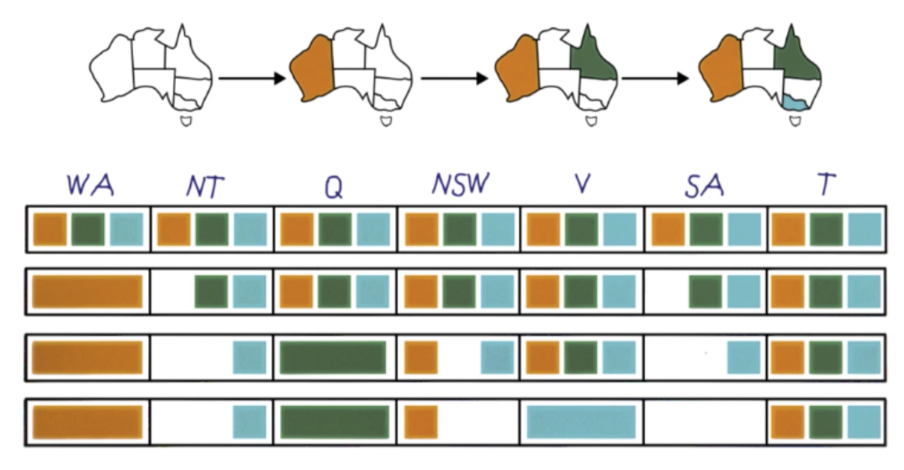

# C-2: CSP Solution Strategies

4. Solving Constraint Satisfaction Problems

    - Backtracking Search Algorithm
    - Depth-First Search vs. Backtracking
    - Local Search Approaches
    - Complexity Analysis

5. Improving CSP Efficiency

    - Variable Selection Strategies
    - Value Ordering Heuristics
    - Forward Checking
    - Constraint Propagation

6. Advanced CSP Concepts
    - Arc Consistency Algorithms
    - Structured CSPs
    - Topological Sorting
    - Complexity Reduction Techniques

#### Solving Constraint Satisfaction Problems

Constraint Satisfaction Problems represent a broad class of computational challenges that require finding variable
assignments satisfying a set of constraints. While the mathematical formulation of CSPs is straightforward, developing
efficient algorithms to solve them requires sophisticated approaches that intelligently navigate the potentially
enormous search space.

##### Backtracking Search Algorithm

Backtracking search stands as the foundational algorithm for solving CSPs. It builds a solution incrementally by
assigning values to variables one at a time and backtracking when it detects that a current partial assignment cannot be
extended to a valid solution.

The backtracking search algorithm follows a recursive depth-first exploration of the assignment space:

```
function BACKTRACKING-SEARCH(csp) returns solution/failure
    return RECURSIVE-BACKTRACK({}, csp)

function RECURSIVE-BACKTRACK(assignment, csp) returns solution/failure
    if assignment is complete then return assignment
    var ← SELECT-UNASSIGNED-VARIABLE(VARIABLES[csp], assignment, csp)
    for each value in ORDER-DOMAIN-VALUES(var, assignment, csp) do
        if value is consistent with assignment given CONSTRAINTS[csp] then
            add {var = value} to assignment
            result ← RECURSIVE-BACKTRACK(assignment, csp)
            if result ≠ failure then return result
            remove {var = value} from assignment
    return failure
```

This algorithm elegantly captures the essence of systematic CSP solving. Let's examine its key components:

1. **Starting Point**: The algorithm begins with an empty assignment and progressively builds toward a complete
   solution.
2. **Variable Selection**: The function `SELECT-UNASSIGNED-VARIABLE` determines which variable to assign next. This is a
   critical decision point that can dramatically affect efficiency.
3. **Value Ordering**: For each selected variable, `ORDER-DOMAIN-VALUES` determines the sequence in which to try
   different values, another crucial efficiency factor.
4. **Consistency Checking**: Before committing to an assignment, the algorithm verifies that it doesn't violate any
   constraints when combined with existing assignments.
5. **Recursive Exploration**: If a consistent assignment is found, the algorithm recursively attempts to complete the
   remaining variables.
6. **Backtracking Mechanism**: If the current path leads to a dead end (no consistent value for some variable), the
   algorithm "backtracks" by removing the most recent assignment and trying a different value.

The beauty of backtracking search lies in its ability to prune large portions of the search space. When it determines
that a partial assignment violates constraints, it immediately abandons that path, avoiding the exploration of numerous
invalid extensions of that assignment.

Consider solving an 8-Queens problem: After placing queens in the first few rows, if we discover that no valid placement
exists for the next row, we can backtrack and try different positions for the previously placed queens, without
exhaustively checking all possible configurations for the remaining rows.

##### Depth-First Search vs. Backtracking

While backtracking is a form of depth-first search (DFS), important distinctions exist between general DFS and
backtracking specifically tailored for CSPs.

**Standard Depth-First Search**:

- Explores the entire state space systematically
- Tries all possible variable orderings (e.g., assigning A before B and B before A)
- Does not inherently check constraints at each step
- Examines potentially redundant states that differ only in assignment order

**Backtracking Search**:

- Uses a fixed variable ordering, eliminating redundant exploration
- Performs constraint checking after each assignment
- Immediately abandons paths that violate constraints
- Focuses exclusively on consistent partial assignments

To visualize this difference, consider a simple CSP with two variables, A and B, each with domain {0, 1, 2}:

A standard DFS would generate a search tree with branches for assigning A first then B, and separately for assigning B
first then A. This creates redundancy since the final state $(A=1, B=2)$ is the same regardless of assignment order.

Backtracking, in contrast, would enforce a single ordering (perhaps A then B) and only explore consistent states. If
$A=0$ conflicts with some constraint, backtracking immediately abandons all states where $A=0$, regardless of B's value.

This focused approach makes backtracking substantially more efficient. For a CSP with n variables, each having d
possible values, standard DFS might explore up to $d^n * n!$ states (accounting for different orderings), while
backtracking explores at most $d^n$ states.

##### Local Search Approaches

While backtracking builds solutions incrementally, local search adopts a different strategy: start with a complete
assignment (possibly violating some constraints) and iteratively improve it until all constraints are satisfied.

The key difference is that local search always maintains a complete assignment to all variables, whereas backtracking
builds partial assignments. This distinction leads to different algorithmic approaches and applications.

**Min-Conflicts Algorithm**:

A prominent local search method for CSPs is the min-conflicts algorithm:

1. Start with a complete assignment of values to variables (random or heuristically chosen)

2. While some constraints are violated:

     a. Select a variable that participates in a constraint violation

     b. Reassign it a value that minimizes the number of conflicts

     c. Repeat until no conflicts remain or a maximum iteration limit is reached

This approach works remarkably well for many problems, particularly when finding any solution is acceptable (rather than
requiring all solutions or an optimal one).

For problems like the n-Queens, min-conflicts often finds solutions in near-linear time, dramatically outperforming
backtracking for large instances. In a famous demonstration, it solved the million-Queens problem in under a minute.

**Hill Climbing and Variants**:

Local search can be viewed as hill climbing in the space of complete assignments, where the objective is to minimize
constraint violations. However, like all hill-climbing approaches, it risks getting trapped in local optima – states
that are better than their neighbors but not globally optimal.

Various strategies address this limitation:

- Random restarts: When stuck, begin again from a new random assignment
- Simulated annealing: Occasionally accept moves that increase conflicts, with decreasing probability over time
- Tabu search: Maintain a "tabu list" of recently tried assignments to avoid cycling

Local search methods shine in several scenarios:

- Very large CSPs where complete backtracking search is impractical
- Problems where "good enough" solutions are acceptable
- Situations where a reasonable starting assignment is available
- Online applications where the system must always maintain a complete (if imperfect) solution

##### Complexity Analysis

Understanding the computational complexity of CSP algorithms helps predict their performance on different problem
instances and guides algorithm selection.

**Worst-Case Time Complexity**:

For a CSP with n variables, each with a domain of size d, and c constraints:

- **Backtracking search**: O(d^n) in the worst case, as it might need to explore every possible assignment combination
- **Forward checking** (an enhanced backtracking variant): Still O(d^n) worst-case, but typically explores far fewer
  nodes
- **Min-conflicts**: O(max_steps × n^2), where max_steps is the maximum number of allowed steps

However, these worst-case bounds rarely reflect practical performance, which depends heavily on:

1. **Problem Structure**: Tree-structured constraint graphs can be solved in O(nd^2) time
2. **Constraint Tightness**: Very tight constraints can make problems easier by quickly eliminating invalid paths
3. **Variable Ordering**: Good variable selection heuristics dramatically reduce the search space
4. **Value Ordering**: Effective value ordering can lead to solutions earlier in the search

**Space Complexity**:

- **Backtracking search**: O(n) space for recursive stack (storing current partial assignment)
- **Local search**: O(n) space to store the current assignment
- **Enhanced backtracking with arc consistency**: O(n^2d) space for storing domain reductions

**Phase Transitions in CSPs**:

An intriguing aspect of CSP complexity is the existence of "phase transitions" – regions where problems shift from
typically easy to typically hard. This occurs when problems have an intermediate number of constraints, creating a
critical balance between constrainedness and freedom.

For random CSPs, this transition often happens around a specific constraint density threshold. Problems with fewer
constraints typically have many solutions and are easy to solve. Problems with many constraints are often easy because
inconsistencies are detected early. The hardest problems lie in between, where enough constraints exist to eliminate
most solutions but not enough to cause early failure detection.

This phase transition phenomenon explains why some seemingly similar CSPs have dramatically different solution times.

**Tractable Subclasses**:

Despite the general NP-completeness of CSPs, several important subclasses can be solved in polynomial time:

1. **Tree-structured CSPs**: Solvable in O(nd^2) time using directional arc consistency
2. **Horn clauses**: A form of propositional logic constraint solvable in linear time
3. **2-SAT**: Boolean satisfaction problems with at most two variables per clause
4. **Convex constraints**: Problems with constraints forming convex regions

Recognizing when a problem falls into these tractable categories allows for the application of specialized, efficient
algorithms instead of general-purpose techniques.

The complexity analysis of CSP algorithms reveals a rich landscape where the choice of algorithm, problem formulation,
and heuristics can make the difference between a solution found in seconds versus one that would take centuries. This
understanding guides both theoretical advances in algorithm design and practical decisions when implementing CSP solvers
for real-world applications.

#### Improving CSP Efficiency

While the basic backtracking algorithm provides a complete framework for solving Constraint Satisfaction Problems, its
performance on complex problems can be prohibitively slow without optimizations. Fortunately, researchers have developed
several powerful techniques that dramatically improve CSP solving efficiency by reducing the search space and detecting
inconsistencies earlier.

##### Variable Selection Strategies

The order in which variables are assigned can have a profound impact on search efficiency. Intuitively, we want to make
the most constrained choices first to detect failures early and reduce backtracking. Three main heuristics guide
variable selection:

**Minimum Remaining Values (MRV)**

The MRV heuristic (also called "fail-first" heuristic) selects the variable with the fewest remaining legal values in
its domain. The rationale is straightforward: a variable with only a few legal values represents a bottleneck in the
search process. By addressing these constrained variables early, we can:

1. Detect dead ends sooner, avoiding wasted exploration
2. Reduce the branching factor for critical choices
3. Make the most constrained decisions while we have maximum flexibility with other variables

Consider a Sudoku example: if one cell has only two possible values while others have five or more, the MRV heuristic
would select that constrained cell first. If that cell's assignment leads to a contradiction, we discover this early and
avoid exploring numerous invalid branches.

In mathematical terms, MRV selects variable $X_i$ such that: $$X_i = \arg\min_{X_j \in unassigned} |D_j|$$ where $|D_j|$
represents the current domain size of variable $X_j$.

**Degree Heuristic**

When multiple variables tie for the minimum domain size, the degree heuristic breaks the tie by selecting the variable
that is involved in the largest number of constraints with other unassigned variables. This variable is likely to have
the most immediate impact on other variables' domains.

The degree heuristic can be expressed as selecting variable $X_i$ such that:
$$X_i = \arg\max_{X_j \in tied_MRV} degree(X_j)$$ where $degree(X_j)$ counts the constraints connecting $X_j$ to
unassigned variables.

For example, in map coloring, a region bordering five uncolored regions would be selected before one bordering only two,
as its assignment will constrain more future choices.

**Least Constraining Value (LCV)**

While MRV and the degree heuristic help select which variable to assign next, the LCV heuristic determines the order in
which to try values from that variable's domain. Unlike the other heuristics that follow a "fail-first" philosophy, LCV
adopts a "succeed-first" approach.

LCV selects the value that rules out the fewest choices for neighboring variables, thus leaving maximum flexibility for
future assignments. For each value in the current variable's domain, LCV counts how many values would be eliminated from
the domains of connected unassigned variables, then tries values in ascending order of this count.

Formally, for variable $X_i$, LCV ranks each value $v$ in domain $D_i$ according to:
$$rank(v) = \sum_{X_j \in neighbors(X_i)} |{a \in D_j : (v,a) \text{ violates a constraint}}|$$

In the Australia map coloring example, if coloring Western Australia red would eliminate red from three neighboring
regions, while coloring it blue would eliminate blue from only two neighboring regions, LCV would try blue before red.

Combining these heuristics—MRV for variable selection, degree heuristic for tie-breaking, and LCV for value
ordering—creates a powerful decision-making framework that can dramatically reduce backtracking and accelerate solution
finding.

##### Value Ordering Heuristics

Once we've selected a variable to assign next, the order in which we try values from its domain can significantly impact
efficiency. A good value ordering increases the likelihood of finding a solution quickly or detecting inconsistencies
early.

**Least Constraining Value (LCV)**

As discussed above, the LCV heuristic tries values that leave maximum flexibility for future assignments. This approach
is particularly effective when we expect a solution to exist and want to find it quickly.

For example, in a university course scheduling problem, if assigning a popular course to Monday morning rules out that
time slot for 20 other courses, while assigning it to Friday afternoon only conflicts with 5 other courses, LCV would
suggest trying Friday afternoon first.

**Fail-Fast Value Ordering**

In some cases, particularly when we want to prove that no solution exists, a "fail-fast" approach might be preferable.
This strategy tries values most likely to lead to contradictions, allowing the algorithm to quickly eliminate large
portions of the search space.

**Dynamic Value Ordering**

Rather than using a static ordering, some advanced CSP solvers dynamically reorder values based on information gathered
during search. These approaches might:

1. Learn from previous failures to prioritize values that haven't led to contradictions
2. Use look-ahead techniques to estimate the impact of each value on future domains
3. Employ conflict-driven heuristics inspired by modern SAT solvers

**Random Value Selection**

For some highly structured problems, deterministic heuristics might consistently make poor choices. Occasionally
introducing randomness in value selection can break out of these patterns and find solutions more efficiently on
average, particularly when combined with restart strategies.

The effectiveness of value ordering heuristics depends on the problem structure and objective (finding any solution, all
solutions, or proving none exist). Modern CSP solvers often combine multiple strategies or switch between them based on
problem characteristics and search progress.

##### Forward Checking

Forward checking represents a fundamental technique for improving CSP solving efficiency by detecting inconsistencies
earlier than basic backtracking. Instead of waiting until variables are assigned to check constraints, forward checking
proactively updates the domains of unassigned variables whenever a new assignment is made.

The process works as follows:

1. When a variable $X$ is assigned value $v$, forward checking examines all unassigned variables $Y$ that share
   constraints with $X$
2. For each such variable, values inconsistent with $X=v$ are temporarily removed from its domain
3. If any variable's domain becomes empty, the current assignment cannot lead to a solution, and the algorithm
   backtracks immediately

<div align="center">

<p>figure: Forward Checking</p>
</div>

Forward checking provides three key advantages:

**Early Detection of Dead Ends**: By maintaining consistent domains for unassigned variables, forward checking
immediately detects when a partial assignment cannot be extended to a solution, without having to explicitly try all
possible values for subsequent variables.

**Reduced Domain Sizes**: By eliminating inconsistent values from domains, forward checking reduces the branching factor
for future variable assignments, accelerating the search even when dead ends aren't immediately encountered.

**Simplified Constraint Checking**: When selecting the next value to try for a variable, forward checking ensures that
all previously assigned variables' constraints are already satisfied, allowing the algorithm to focus only on
constraints among unassigned variables.

To illustrate forward checking, consider the Australia map coloring problem with three colors (red, green, blue). If we
assign Western Australia (WA) the color red, forward checking would:

1. Examine Northern Territory (NT) and South Australia (SA), which share borders with WA
2. Remove red from the domains of NT and SA (as adjacent regions cannot have the same color)
3. The domains would now be: WA={red}, NT={green, blue}, SA={green, blue}

If we then assign NT the color green, forward checking would:

1. Examine SA and Queensland (Q), which share borders with NT
2. Remove green from the domains of SA and Q
3. The domains would now be: WA={red}, NT={green}, SA={blue}, Q={red, blue}

This proactive domain reduction prevents the algorithm from making obviously inconsistent assignments and detects
failures much earlier than basic backtracking.

##### Constraint Propagation

While forward checking catches immediate inconsistencies, constraint propagation takes this idea further by considering
the implications of domain reductions across the entire constraint network. The core insight is that removing a value
from one variable's domain might create new inconsistencies that can be detected without committing to additional
assignments.

**Arc Consistency**

The most common form of constraint propagation is arc consistency (specifically, AC-3). An arc X→Y is consistent if for
every value in X's domain, there exists at least one value in Y's domain that satisfies the constraint between X and Y.

The AC-3 algorithm enforces arc consistency throughout the constraint graph:

```
function AC-3(csp) returns the CSP, possibly with reduced domains
    queue ← all arcs in csp
    while queue is not empty do
        (X_i, X_j) ← REMOVE-FIRST(queue)
        if REVISE(csp, X_i, X_j) then
            if size of D_i = 0 then return false
            for each X_k in NEIGHBORS[X_i] - {X_j} do
                add (X_k, X_i) to queue
    return true

function REVISE(csp, X_i, X_j) returns true iff we revise the domain of X_i
    revised ← false
    for each x in D_i do
        if no value y in D_j allows (x,y) to satisfy the constraint between X_i and X_j then
            delete x from D_i
            revised ← true
    return revised
```

Let's trace this algorithm in our Australia map coloring example:

1. Initially, all variables (regions) have domains {red, green, blue}
2. Consider the arc WA→SA. For each color in WA's domain, is there a color in SA's domain that satisfies the constraint
   (different colors)? Yes, for each color in WA, SA has two other colors available.
3. Consider the arc SA→NT. Similarly, this arc is already consistent.
4. If we were to assign WA=red, domains would update to: WA={red}, NT={green, blue}, SA={green, blue}
5. The arc NT→SA would be checked again. Is every value in NT's domain compatible with at least one value in SA's
   domain? Yes, so this arc remains consistent.

Arc consistency can detect many inconsistencies that forward checking would miss. For instance, if a chain of
constraints forces a variable to have a certain value, arc consistency can detect this without explicit assignments,
while forward checking would require multiple assignment steps.

**Higher Levels of Consistency**

Beyond arc consistency, more powerful forms of constraint propagation exist:

- **Path consistency**: Ensures consistency over triplets of variables
- **i-consistency**: Guarantees that any consistent assignment to i-1 variables can be extended to a consistent
  assignment including any ith variable
- **Global constraint propagation**: Specialized algorithms for common constraint patterns (like "all-different")

**Integration with Backtracking**

The most effective approach combines constraint propagation with backtracking search, leading to algorithms like MAC
(Maintaining Arc Consistency). After each variable assignment, MAC enforces arc consistency before continuing the
search. This integration provides the strongest elimination of inconsistencies without the computational expense of
enforcing higher levels of consistency.

**Complexity and Trade-offs**

While constraint propagation reduces the number of nodes explored in the search tree, it incurs computational cost at
each node. The trade-off is generally worthwhile, as the AC-3 algorithm has a worst-case time complexity of O(e⋅d³),
where e is the number of constraints and d is the maximum domain size—significantly lower than the exponential cost of
exploring unnecessary branches.

For larger or more complex problems, selective application of constraint propagation (focusing on the most constrained
parts of the problem) can provide most of the benefits with reduced overhead.

By combining intelligent variable selection, value ordering, forward checking, and constraint propagation, modern CSP
solvers can efficiently tackle problems that would be intractable with basic backtracking alone. These techniques form
the foundation of commercial constraint programming systems used in industries ranging from manufacturing to
transportation logistics and beyond.

#### Advanced CSP Concepts

The basic principles of Constraint Satisfaction Problems provide a foundation for solving many practical problems.
However, advanced concepts offer additional power and efficiency for tackling more complex or specialized problems.
These techniques transform the way we approach CSPs, often converting seemingly intractable problems into manageable
ones.

##### Arc Consistency Algorithms

Arc consistency represents a fundamental concept in constraint processing that extends beyond simple forward checking.
While forward checking only looks at constraints between the most recently assigned variable and future variables, arc
consistency considers the entire constraint network.

**AC-3: The Standard Algorithm**

The AC-3 algorithm (Arc Consistency Algorithm #3) has become the standard approach for enforcing arc consistency in
CSPs. Let's explore how it works in more detail:

1. The algorithm maintains a queue of arcs (variable pairs connected by constraints) to be checked.
2. For each arc (X,Y), it ensures that every value in X's domain has at least one compatible value in Y's domain.
3. When values are removed from a domain, potentially affected arcs are added back to the queue.

The key insight of AC-3 is that constraint propagation continues until no further domain reductions are possible,
reaching a "fixed point" where all remaining values participate in at least one potential solution.

Let's consider a more detailed example with the Australia map coloring problem. Initially, all regions have the domain
{red, green, blue}. If we assign Western Australia (WA) the color red:

1. The domains update to: WA={red}, NT={green, blue}, SA={green, blue}, Q={red, green, blue}, NSW={red, green, blue},
   V={red, green, blue}, T={red, green, blue}
2. AC-3 would add arcs (NT,SA), (SA,NT), (SA,Q), (Q,SA), etc. to the queue
3. When processing (SA,Q), it checks if each value in SA's domain {green, blue} has a compatible value in Q's domain.
   Since Q still has {red, green, blue}, both green and blue in SA's domain are compatible with at least red in Q's
   domain.
4. If we further assign NT=green, domains update to: WA={red}, NT={green}, SA={blue}, Q={red, blue}, NSW={red, green,
   blue}, V={red, green, blue}, T={red, green, blue}
5. Processing (Q,NSW), both values in Q's domain {red, blue} have compatible values in NSW's domain, so no changes
   occur.

The time complexity of AC-3 is O(e·d³), where e is the number of constraints and d is the maximum domain size. This is
because:

- At most e arcs can be added to the queue
- Each arc can be revised at most d times (as each domain can lose at most d values)
- Each revision takes O(d²) time to check all possible value pairs

**AC-4 and Beyond**

While AC-3 remains popular due to its simplicity and good average-case performance, more sophisticated algorithms like
AC-4, AC-6, and AC-2001 offer theoretical improvements:

- AC-4 achieves O(e·d²) complexity by precomputing and storing support information
- AC-6 maintains similar complexity but uses less space by storing only one supporting value
- AC-2001 combines the simplicity of AC-3 with the optimal complexity of AC-4

The practical choice among these algorithms depends on factors like:

- Domain size (larger domains favor AC-4/AC-6/AC-2001)
- Constraint tightness (tighter constraints often benefit from support-tracking algorithms)
- Memory constraints (AC-3 uses less memory than AC-4)

**Beyond Binary Constraints**

For problems with non-binary constraints (involving three or more variables), specialized consistency algorithms exist:

- Generalized Arc Consistency (GAC) extends arc consistency to non-binary constraints
- Algorithm GAC-Schema provides a framework for enforcing consistency on arbitrary constraints
- Specialized filtering algorithms for common global constraints (like "all-different") can achieve consistency more
  efficiently than general approaches

For instance, the "all-different" constraint on n variables can be handled in O(n²·d) time using specialized algorithms
based on matching theory, rather than the O(n³·d²) that would be required by decomposing it into binary constraints.

##### Structured CSPs

Many real-world CSPs exhibit structure that can be exploited for more efficient solutions. Recognizing and leveraging
problem structure often transforms seemingly intractable problems into ones that can be solved efficiently.

**Tree-Structured CSPs**

The simplest structured CSP is one whose constraint graph forms a tree (a connected graph with no cycles).
Tree-structured CSPs have a remarkable property: they can be solved in O(n·d²) time without backtracking.

The algorithm for solving tree-structured CSPs has two phases:

1. **Directed arc consistency phase**: Choose a root variable and direct all arcs away from it. Process variables in
   topological order (from root to leaves), making each arc consistent.
2. **Assignment phase**: Assign variables in reverse order (from leaves to root), choosing values consistent with
   already-assigned parent variables.

This linear-time algorithm guarantees finding a solution if one exists and can be extended to find all solutions.

The Australia map coloring problem isn't tree-structured due to cycles in its constraint graph. However, if we removed
the constraint between SA and NSW, it would become a tree, allowing this efficient algorithm to apply.

**Nearly-Tree-Structured CSPs**

Most real-world problems aren't perfect trees but may be "almost" trees. Several techniques exploit near-tree structure:

1. **Cycle cutset conditioning**: Identify a small set of variables that, when removed, leave a tree. Assign these
   variables first (trying all combinations), then solve the resulting tree-structured problem for each assignment.

    If the cycle cutset has size c, this approach has complexity O(d^c · n·d²), exponential only in the cutset size
    rather than the total number of variables.

2. **Tree decomposition**: Decompose the constraint graph into interconnected clusters that form a tree structure.
   Within each cluster, solve using standard algorithms; between clusters, enforce consistency on shared variables.

    The efficiency depends on the "tree width" of the constraint graph—smaller tree width means faster solutions.

For a concrete example, consider a scheduling problem with 80 variables. If we can identify a cycle cutset of size 3,
the complexity reduces from 2^80 (intractable) to 2^3 · 80 · 4 (easily solvable).

**Domain-Specific Structure**

Beyond graph structure, other problem-specific structures can be exploited:

- **Symmetry**: Many problems contain symmetrical states that are essentially identical. Symmetry-breaking constraints
  can eliminate redundant search.

    For example, in the N-Queens problem, we can eliminate symmetrical board positions (rotations and reflections) by
    fixing the position of one queen.

- **Decomposable constraints**: Some complex constraints can be decomposed into simpler ones that are easier to process.

- **Hierarchical structure**: Problems with natural hierarchies can often be solved by first making high-level
  assignments, then refining them at lower levels.

Recognizing and exploiting problem structure often requires domain knowledge, but the computational gains can be
enormous, sometimes reducing complexity from exponential to polynomial.

##### Topological Sorting

Topological sorting plays a crucial role in structured CSPs, particularly those with directional or hierarchical
constraints. A topological sort orders variables such that if there's a directed constraint from variable X to Y, X
comes before Y in the ordering.

**Basic Topological Sorting Algorithm**

The standard algorithm for topological sorting uses depth-first search:

1. Perform depth-first search on the directed constraint graph
2. Add each variable to the sorted list after all its descendants have been processed

For tree-structured CSPs, topological sorting provides the optimal variable ordering for both the directed consistency
phase and the assignment phase.

**Application to General CSPs**

Even for CSPs that aren't tree-structured, a topological ordering of a directed version of the constraint graph can
provide a good variable ordering heuristic. This approach:

1. Identifies natural precedence relationships between variables
2. Often correlates well with the "most constrained variable" heuristic
3. Helps propagate constraints efficiently through the network

For example, in a university course scheduling problem, prerequisites create natural directed constraints (Calculus I
must be scheduled before Calculus II). A topological sort would ensure these prerequisites are assigned in a logical
order.

**Strongly Connected Components**

When cycles exist in the constraint graph (as they often do), a true topological sort is impossible. In these cases, we
can first identify strongly connected components (variables that form cycles) and collapse them into "super-nodes." The
resulting graph of components is guaranteed to be acyclic and can be topologically sorted.

This approach leads to:

1. Identification of subproblems that must be solved together
2. A hierarchical solving strategy that tackles strongly constrained components first
3. Efficient constraint propagation between components

**Integration with Backtracking Search**

Topological considerations can enhance variable ordering in backtracking search:

- Variables with many outgoing constraints but few incoming ones are good candidates for early assignment
- Variables in the same strongly connected component should typically be assigned in close succession
- The "root" of a constraint tree is often a natural starting point for assignments

##### Complexity Reduction Techniques

Beyond structured approaches, several general techniques can dramatically reduce the complexity of solving CSPs.

**Problem Reformulation**

Sometimes, reformulating a problem can significantly reduce its complexity:

1. **Dual representations**: Converting a CSP to its dual form (where constraints become variables and vice versa) can
   be more efficient for certain problem structures.
2. **Hidden variable encoding**: Introducing auxiliary variables can sometimes simplify complex constraints.
3. **Global constraint introduction**: Replacing multiple simple constraints with a single global constraint often
   enables more powerful filtering algorithms.

For example, a constraint like "X₁ + X₂ + ... + Xₙ = 10" can be more efficiently handled as a single global "sum"
constraint rather than as multiple binary addition constraints.

**No-Good Learning**

Inspired by modern SAT solvers, no-good learning records combinations of assignments that lead to failures:

1. When backtracking occurs due to a conflict, the algorithm analyzes the cause of failure
2. It generates a "no-good" constraint capturing the conflicting assignment pattern
3. This new constraint is added to the problem, preventing the search from making the same mistake again

No-good learning is particularly effective for highly structured problems where similar patterns of failure recur in
different parts of the search space.

**Randomization and Restarts**

For complex CSPs, deterministic algorithms can get trapped in unproductive regions of the search space. Two techniques
address this:

1. **Random restarts**: Periodically abandon the current search path and start fresh, but with knowledge gained from
   previous attempts.
2. **Randomized value selection**: Occasionally choose values randomly rather than following deterministic heuristics.

The effectiveness of these approaches stems from the "heavy-tailed" distribution of solving times for many CSPs—some
random starting points lead to quick solutions while others lead to extremely long search times.

**Decomposition Methods**

Divide-and-conquer approaches break complex problems into manageable subproblems:

1. **AND/OR search**: Decompose the problem into independent subproblems where possible, solving them separately and
   combining results.
2. **Pseudo-tree decomposition**: Organize variables into a tree-like structure that minimizes connections between
   different branches.
3. **Bounded treewidth techniques**: Exploit the observation that many practical problems have constraint graphs with
   limited "treewidth," enabling polynomial-time solutions.

For large problems, decomposition often provides the only practical approach to finding solutions in reasonable time.

**Approximation Methods**

When finding an optimal solution is too computationally expensive, approximation methods can provide good solutions
efficiently:

1. **Local search with constraints**: Start with a complete assignment and iteratively improve it while trying to
   satisfy constraints.
2. **Constraint optimization**: Relax some constraints, solve the simplified problem, then incrementally reintroduce
   constraints.
3. **Iterative refinement**: Find a solution that violates some constraints, then iteratively repair violations.

For example, in a university course scheduling problem, we might first assign courses to rooms ignoring some capacity
constraints, then iteratively adjust the schedule to minimize capacity violations.

These advanced CSP concepts and techniques have transformed constraint satisfaction from a theoretical framework into a
practical tool for solving complex real-world problems. By recognizing problem structure, applying appropriate
consistency algorithms, and employing complexity reduction techniques, we can tackle problems that would be intractable
using naive approaches. The most effective CSP solvers combine these techniques in sophisticated ways, adapting their
strategies based on problem characteristics detected during the solving process.
