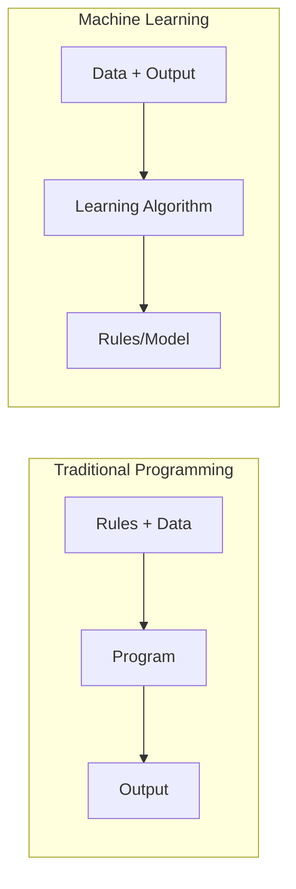
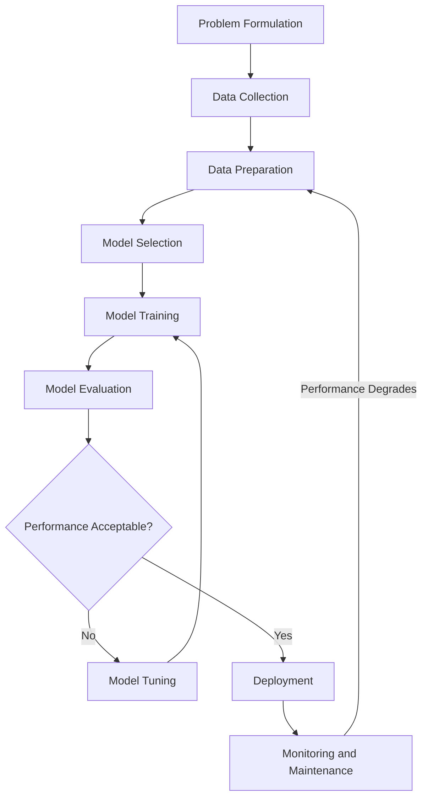
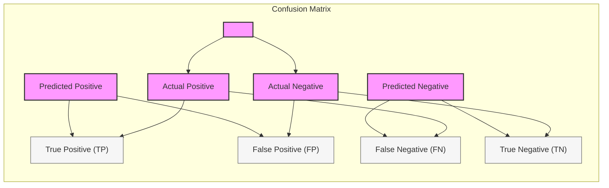

# C-3: Machine Learning Fundamentals

1. Introduction to Machine Learning
    - Machine Learning vs Traditional Programming
    - Types of Machine Learning Systems
    - The Machine Learning Workflow
    - Data Collection and Preparation
    - Evaluating Machine Learning Models
2. Supervised Learning: Regression
    - Linear Regression
    - Polynomial Regression
    - Regularization Techniques (Ridge, Lasso)
    - Gradient Descent Implementation
    - Regression Metrics and Evaluation
3. Supervised Learning: Classification
    - Logistic Regression
    - Decision Trees
    - Support Vector Machines (SVM)
    - Kernel Methods for Non-linear Problems
    - Multi-class Classification Strategies
4. Ensemble Methods
    - Random Forests
    - Bagging and Boosting
    - Gradient Boosting Machines
    - AdaBoost Algorithm
    - Model Combination Strategies
5. Unsupervised Learning
    - Clustering Algorithms (K-means, Hierarchical)
    - Principal Component Analysis (PCA)
    - Dimensionality Reduction Techniques
    - Anomaly Detection
    - Association Rule Learning
6. Model Selection and Validation
    - Cross-Validation Techniques
    - Hyperparameter Tuning
    - Bias-Variance Tradeoff
    - Learning Curves
    - Feature Selection Methods

#### Introduction to Machine Learning

Machine learning represents a paradigm shift in how we approach problem-solving with computers. Unlike traditional
programming where explicit instructions are provided, machine learning algorithms learn patterns from data to make
predictions or decisions without being explicitly programmed for the specific task.

##### Machine Learning vs Traditional Programming

Traditional programming follows a straightforward approach: developers write explicit rules that the computer follows to
transform inputs into outputs. The logic flow is deterministic and entirely defined by the programmer. For example, in a
tax calculation program, specific formulas determine exactly how input values (income, deductions, etc.) produce an
output (tax owed).

Machine learning inverts this relationship. Instead of providing explicit rules, we provide:

1. Data (examples of inputs and corresponding outputs)
2. A learning algorithm
3. An objective function to optimize

The system then discovers the rules or patterns on its own. This is particularly valuable when:

- The rules are too complex to code manually
- The rules change over time
- The rules depend on too many variables
- The exact rules are unknown even to human experts

##### Types of Machine Learning Systems

Machine learning systems can be categorized based on several criteria:

**Based on supervision:**

1. **Supervised Learning**: Algorithms learn from labeled training data. Each example consists of an input object and a
   desired output value. The algorithm learns to map inputs to outputs.
    - Examples: Regression, classification
2. **Unsupervised Learning**: Algorithms learn patterns or structure from unlabeled data without explicit guidance.
    - Examples: Clustering, dimensionality reduction, anomaly detection
3. **Semi-supervised Learning**: Combines a small amount of labeled data with a large amount of unlabeled data during
   training.
    - Examples: Photo archiving, speech analysis
4. **Reinforcement Learning**: Algorithms learn through trial and error, receiving rewards or penalties based on their
   actions.
    - Examples: Game playing, robotics, resource management

**Based on learning capability:**

1. **Batch Learning**: The system trains on all available data at once and then deploys. It cannot learn incrementally.
2. **Online Learning**: The system can be trained incrementally by feeding data instances sequentially or in small
   batches.

**Based on generalization approach:**

1. **Instance-based Learning**: The system learns examples by heart and generalizes using a similarity measure.
2. **Model-based Learning**: The system builds a model from examples and uses that model to make predictions.

##### The Machine Learning Workflow

A typical machine learning project follows these steps:

1. **Problem Formulation**: Define the problem clearly and determine the appropriate type of machine learning approach.
2. **Data Collection**: Gather relevant data from various sources that represent the problem space.
3. **Data Preparation**:
    - Cleaning: Handle missing values, remove outliers
    - Preprocessing: Normalize/standardize features, encode categorical variables
    - Feature engineering: Create new features, select relevant features
4. **Model Selection**: Choose appropriate algorithms based on the problem type, data characteristics, and requirements.
5. **Model Training**: Feed the prepared data into the selected algorithm(s) to build a predictive model.
6. **Model Evaluation**: Assess model performance using appropriate metrics and validation techniques.
7. **Model Tuning**: Optimize hyperparameters to improve model performance.
8. **Deployment**: Integrate the model into production systems.
9. **Monitoring and Maintenance**: Track model performance over time and retrain as necessary.

##### Data Collection and Preparation

**Data Collection Sources**:

- Public datasets (Kaggle, UCI ML Repository, government data)
- Web scraping
- API access
- Database extraction
- Sensors and IoT devices
- User-generated content
- Surveys and experiments

**Data Cleaning**:

- Handling missing values:
    - Remove samples with missing values
    - Fill with statistical measures (mean, median, mode)
    - Predict missing values using models
- Outlier detection and treatment
- Correcting inconsistent data
- Removing duplicates

**Data Preprocessing**:

- Normalization/Standardization: Scaling features to comparable ranges

    - Min-Max scaling: $x' = \frac{x - \min(x)}{\max(x) - \min(x)}$
    - Standardization: $x' = \frac{x - \mu}{\sigma}$ where $\mu$ is the mean and $\sigma$ is the standard deviation

- Encoding categorical variables:

    - One-hot encoding
    - Label encoding
    - Target encoding

- Feature engineering:

    - Creating interaction features
    - Polynomial features
    - Domain-specific transformations

**Data Splitting**:

- Training set (60-80%)
- Validation set (10-20%)
- Test set (10-20%)

**Addressing Imbalanced Data**:

- Oversampling minority class
- Undersampling majority class
- Synthetic data generation (SMOTE)
- Class weighting

##### Evaluating Machine Learning Models

Evaluation metrics differ based on the type of problem:

**Regression Metrics**:

- Mean Absolute Error (MAE): $\frac{1}{n}\sum_{i=1}^{n}|y_i - \hat{y}_i|$
- Mean Squared Error (MSE): $\frac{1}{n}\sum_{i=1}^{n}(y_i - \hat{y}_i)^2$
- Root Mean Squared Error (RMSE): $\sqrt{\frac{1}{n}\sum_{i=1}^{n}(y_i - \hat{y}_i)^2}$
- R-squared (Coefficient of Determination):
  $1 - \frac{\sum_{i=1}^{n}(y_i - \hat{y}*i)^2}{\sum*{i=1}^{n}(y_i - \bar{y})^2}$

**Classification Metrics**:

- Accuracy: $\frac{\text{Number of correct predictions}}{\text{Total number of predictions}}$
- Precision: $\frac{\text{True Positives}}{\text{True Positives + False Positives}}$
- Recall (Sensitivity): $\frac{\text{True Positives}}{\text{True Positives + False Negatives}}$
- F1-Score: $2 \times \frac{\text{Precision} \times \text{Recall}}{\text{Precision} + \text{Recall}}$
- Area Under the ROC Curve (AUC-ROC)
- Confusion Matrix

###### True Positives, False Positives, and False Negatives

In classification problems, particularly in binary classification, we need precise ways to measure how well our model
performs. The fundamental building blocks for these measurements are True Positives, False Positives, and False
Negatives (along with True Negatives). These concepts form the foundation of metrics like precision, recall, and
F1-score.

###### The Confusion Matrix Framework

To understand these terms, imagine we're predicting a binary outcome - for example, whether a patient has a disease
(positive) or not (negative). Our predictions can be correct or incorrect in specific ways:

###### True Positives (TP)

These are cases where we correctly predicted the positive class. In our disease example, a True Positive means:

- The patient actually has the disease
- Our model predicted they have the disease

This represents a correct identification of the positive condition.

###### False Positives (FP) - Type I Error

These are cases where we incorrectly predicted the positive class. In our disease example, a False Positive means:

- The patient does NOT have the disease
- Our model predicted they DO have the disease

This is also called a "Type I error" or a "false alarm." We've incorrectly flagged something as positive when it's
actually negative.

###### False Negatives (FN) - Type II Error

These are cases where we incorrectly predicted the negative class. In our disease example, a False Negative means:

- The patient DOES have the disease
- Our model predicted they do NOT have the disease

This is also called a "Type II error" or a "miss." We've missed identifying something that was actually positive.

###### True Negatives (TN)

These are cases where we correctly predicted the negative class. In our disease example, a True Negative means:

- The patient does NOT have the disease
- Our model predicted they do NOT have the disease

This represents correct identification of the absence of the condition.

###### A Visual Framework: The Confusion Matrix

These four categories can be organized into a 2×2 table called a confusion matrix:

|                        | **Actual Positive** | **Actual Negative** |
| ---------------------- | ------------------- | ------------------- |
| **Predicted Positive** | True Positive (TP)  | False Positive (FP) |
| **Predicted Negative** | False Negative (FN) | True Negative (TN)  |

###### Real-World Example: Medical Testing

Let's revisit our disease testing scenario from earlier:

- Disease prevalence: 1% (P(Disease) = 0.01)
- Test sensitivity: 95% (P(Positive|Disease) = 0.95)
- Test specificity: 95% (P(Negative|No Disease) = 0.95)

If we test 1000 people:

- 10 people will actually have the disease (1%)
- 990 will not have the disease (99%)

Given the test characteristics:

- Of the 10 diseased people, 9.5 ≈ 10 will test positive (TP) and 0.5 ≈ 0 will test negative (FN)
- Of the 990 healthy people, 940.5 ≈ 941 will test negative (TN) and 49.5 ≈ 49 will test positive (FP)

So in this population of 1000 people:

- True Positives: ~10 people (correctly identified as having the disease)
- False Positives: ~49 people (incorrectly identified as having the disease)
- False Negatives: ~0 people (incorrectly identified as not having the disease)
- True Negatives: ~941 people (correctly identified as not having the disease)

This explains why a positive test result only indicates a 16.1% probability of disease - there are many more false
positives (49) than true positives (10).

###### Derived Metrics

From these fundamental values, we calculate important performance metrics:

1. **Precision** = TP/(TP+FP) = 10/(10+49) ≈ 0.169 or 16.9%
    - Measures how many of our positive predictions were correct
    - "When the model predicts positive, how often is it right?"
2. **Recall** (Sensitivity) = TP/(TP+FN) = 10/(10+0) ≈ 1.0 or 100%
    - Measures how many of the actual positives our model captured
    - "Of all the actual positive cases, how many did we correctly identify?"
3. **Specificity** = TN/(TN+FP) = 941/(941+49) ≈ 0.95 or 95%
    - Measures how many of the actual negatives our model captured
    - "Of all the actual negative cases, how many did we correctly identify?"

###### The Trade-offs

In most real-world scenarios, there's a fundamental trade-off between minimizing false positives and minimizing false
negatives. This is often visualized using an ROC curve or precision-recall curve.

The optimal balance depends on the specific application:

- In cancer screening, we might tolerate more false positives to minimize false negatives
- In spam filtering, we might accept some false negatives to ensure important emails aren't mistakenly classified as
  spam

Understanding these basic building blocks allows us to create sophisticated evaluation frameworks for classification
models across various domains from medical diagnostics to fraud detection.

**Validation Techniques**:

- Hold-out validation: Split data into training and validation sets
- K-fold cross-validation: Split data into k subsets, train on k-1 subsets and validate on the remaining one, repeat k
  times
- Stratified k-fold cross-validation: Ensures class proportions are maintained in each fold
- Leave-one-out cross-validation: Extreme case of k-fold where k equals the number of samples

**Learning Curves**:

- Plot training and validation error against training set size
- Helps diagnose underfitting vs. overfitting
- Guides decisions about collecting more data or adding regularization

The evaluation process should be rigorous and aligned with the actual problem objectives. It's crucial to select metrics
that reflect the real-world impact of the model's predictions rather than focusing solely on mathematical metrics that
might not capture the practical implications of model errors.

#### Supervised Learning: Regression

Regression is one of the fundamental supervised learning techniques that predicts continuous numerical values based on
input features. Unlike classification, which predicts discrete categories, regression aims to model relationships
between variables by estimating how one variable changes when others vary.

##### Linear Regression

Linear regression is the simplest and most widely used regression technique. It models the relationship between a
dependent variable and one or more independent variables by fitting a linear equation to the observed data.

In simple linear regression (one independent variable), the model takes the form:

$$y = \beta_0 + \beta_1x + \epsilon$$

Where:

- $y$ is the dependent variable (target)
- $x$ is the independent variable (feature)
- $\beta_0$ is the y-intercept (bias term)
- $\beta_1$ is the slope coefficient
- $\epsilon$ is the error term (residual)

For multiple linear regression (multiple independent variables), the equation extends to:

$$y = \beta_0 + \beta_1x_1 + \beta_2x_2 + ... + \beta_nx_n + \epsilon$$

The goal of linear regression is to find the values of $\beta_0, \beta_1, ..., \beta_n$ that minimize the sum of squared
differences between the observed and predicted values, known as the Ordinary Least Squares (OLS) method.

The cost function (also called the loss function) for linear regression using OLS is:

$$J(\beta) = \frac{1}{2m} \sum_{i=1}^{m} (h_\beta(x^{(i)}) - y^{(i)})^2$$

Where:

- $m$ is the number of training examples
- $h_\beta(x^{(i)})$ is the prediction for the $i$-th example
- $y^{(i)}$ is the actual output for the $i$-th example

Linear regression makes several assumptions:

1. Linearity: The relationship between variables is linear
2. Independence: Observations are independent of each other
3. Homoscedasticity: Constant variance in errors
4. Normality: Error terms are normally distributed
5. No multicollinearity: Independent variables aren't highly correlated

When these assumptions are violated, alternative regression techniques may be more appropriate.

##### Polynomial Regression

Sometimes, the relationship between variables isn't linear. Polynomial regression extends linear regression by including
polynomial terms of the input features:

$$y = \beta_0 + \beta_1x + \beta_2x^2 + ... + \beta_nx^n + \epsilon$$

While polynomial regression can capture more complex relationships, it's important to note that it's still linear in the
parameters $\beta_0, \beta_1, ..., \beta_n$. We're simply transforming our features (creating $x^2, x^3$, etc.) and then
applying linear regression.

The degree of the polynomial significantly affects the model's complexity. Higher degrees can capture more intricate
patterns but risk overfitting, especially with limited data. Consider this progression:

- Degree 1: Straight line (linear regression)
- Degree 2: Parabola (quadratic)
- Degree 3: Cubic function
- Higher degrees: Increasingly flexible curves

Polynomial regression is particularly useful when:

- Data shows clear non-linear trends
- The relationship follows a known physical law with polynomial form
- You need interpretable coefficients while modeling non-linear patterns

However, as we increase the polynomial degree, we introduce more parameters, making the model more prone to overfitting.
This leads us to the need for regularization.

##### Regularization Techniques (Ridge, Lasso)

Regularization addresses overfitting by adding a penalty term to the cost function that discourages complex models with
large coefficients. Two popular regularization techniques for regression are Ridge and Lasso.

**Ridge Regression (L2 regularization)**: Ridge regression adds a penalty term proportional to the square of the
coefficients:

$$J(\beta) = \frac{1}{2m} \sum_{i=1}^{m} (h_\beta(x^{(i)}) - y^{(i)})^2 + \lambda \sum_{j=1}^{n} \beta_j^2$$

Where $\lambda$ is the regularization parameter that controls the trade-off between fitting the data and keeping
coefficients small. Note that $\beta_0$ (the intercept) is typically not regularized.

Ridge regression:

- Shrinks coefficients toward zero but rarely makes them exactly zero
- Works well when many features contribute somewhat to the prediction
- Handles multicollinearity effectively by distributing importance across correlated features

**Lasso Regression (L1 regularization)**: Lasso regression uses the absolute value of coefficients instead of squares:

$$J(\beta) = \frac{1}{2m} \sum_{i=1}^{m} (h_\beta(x^{(i)}) - y^{(i)})^2 + \lambda \sum_{j=1}^{n} |\beta_j|$$

The key difference is that Lasso can drive some coefficients to exactly zero, performing feature selection
automatically. This is because the L1 penalty creates a constraint that often intersects with the cost function at axes,
zeroing out some coefficients.

Lasso regression:

- Produces sparse models with few non-zero coefficients
- Performs feature selection intrinsically
- Works well when a small subset of features strongly influences the prediction

**Elastic Net**: Elastic Net combines Ridge and Lasso by including both L1 and L2 penalties:

$$J(\beta) = \frac{1}{2m} \sum_{i=1}^{m} (h_\beta(x^{(i)}) - y^{(i)})^2 + \lambda_1 \sum_{j=1}^{n} |\beta_j| + \lambda_2 \sum_{j=1}^{n} \beta_j^2$$

This approach leverages the benefits of both regularization techniques and often outperforms either one alone,
particularly when dealing with many correlated features.

##### Gradient Descent Implementation

Gradient descent is an iterative optimization algorithm used to find the values of parameters (coefficients) that
minimize the cost function. For regression problems, we update each parameter by taking steps proportional to the
negative of the gradient (partial derivative) of the cost function.

The update rule for each coefficient $\beta_j$ is:

$$\beta_j := \beta_j - \alpha \frac{\partial}{\partial \beta_j} J(\beta)$$

Where $\alpha$ is the learning rate that determines the step size.

For linear regression with the MSE cost function, the gradient descent update becomes:

$$\beta_j := \beta_j - \alpha \frac{1}{m} \sum_{i=1}^{m} (h_\beta(x^{(i)}) - y^{(i)}) \cdot x_j^{(i)}$$

For the intercept $\beta_0$, we use $x_0^{(i)} = 1$ for all examples.

There are several variants of gradient descent:

**Batch Gradient Descent**:

- Uses all training examples in each iteration
- More stable convergence but computationally expensive for large datasets
- Guaranteed to find the global minimum for convex cost functions like MSE

**Stochastic Gradient Descent (SGD)**:

- Updates parameters using a single randomly chosen training example in each iteration
- Faster per iteration but noisier updates
- Can escape local minima in non-convex problems
- May never converge exactly but oscillate around the minimum

**Mini-Batch Gradient Descent**:

- Compromises between batch and stochastic approaches by using a small random subset of training data
- Reduces variance of parameter updates compared to SGD
- Often the method of choice in practice due to computational efficiency

Important considerations for implementing gradient descent:

1. **Feature scaling**: Normalize features to similar ranges to ensure faster convergence
2. **Learning rate selection**: Too large may cause divergence; too small leads to slow convergence
3. **Convergence criteria**: Define when to stop (e.g., when change in cost is below a threshold)
4. **Learning rate scheduling**: Gradually reducing the learning rate can help fine convergence

##### Regression Metrics and Evaluation

Proper evaluation is crucial for understanding model performance and making improvements. Various metrics help assess
different aspects of regression models:

**Mean Absolute Error (MAE)**: $$\text{MAE} = \frac{1}{m} \sum_{i=1}^{m} |y_i - \hat{y}_i|$$

MAE measures the average magnitude of errors without considering their direction. It's robust to outliers and provides
an easily interpretable metric in the same units as the target variable.

**Mean Squared Error (MSE)**: $$\text{MSE} = \frac{1}{m} \sum_{i=1}^{m} (y_i - \hat{y}_i)^2$$

MSE squares the errors, heavily penalizing large mistakes. It's differentiable everywhere (unlike MAE), making it
suitable as a loss function for optimization algorithms.

**Root Mean Squared Error (RMSE)**: $$\text{RMSE} = \sqrt{\frac{1}{m} \sum_{i=1}^{m} (y_i - \hat{y}_i)^2}$$

RMSE is the square root of MSE, bringing the error metric back to the same scale as the target variable. Like MSE, it
penalizes large errors more than small ones.

**R-squared (Coefficient of Determination)**:
$$R^2 = 1 - \frac{\sum_{i=1}^{m} (y_i - \hat{y}*i)^2}{\sum*{i=1}^{m} (y_i - \bar{y})^2}$$

R-squared represents the proportion of variance in the dependent variable explained by the model. It ranges from 0 to 1,
with higher values indicating better fit. However, R-squared can be misleading as it always increases when more features
are added, even if they're not meaningful.

**Adjusted R-squared**: $$\text{Adjusted } R^2 = 1 - \frac{(1 - R^2)(m - 1)}{m - p - 1}$$

Where $p$ is the number of features. This metric penalizes adding unnecessary features, providing a more realistic
assessment of model quality.

**Mean Absolute Percentage Error (MAPE)**:
$$\text{MAPE} = \frac{100%}{m} \sum_{i=1}^{m} \left| \frac{y_i - \hat{y}_i}{y_i} \right|$$

MAPE expresses accuracy as a percentage, making it easily interpretable. However, it can't be used when target values
include zeros and may give skewed results for small target values.

Beyond metrics, effective evaluation practices include:

1. **Cross-validation**: Use techniques like k-fold cross-validation to ensure your model generalizes well to unseen
   data.
2. **Residual analysis**: Plot residuals (prediction errors) to check for patterns that might indicate model
   inadequacies:
    - Random scatter around zero suggests a good fit
    - Systematic patterns indicate the model is missing important relationships
    - Heteroscedasticity (changing variance) may require transformation
3. **Learning curves**: Plot training and validation errors against training set size to diagnose bias vs. variance
   issues:
    - High training and validation error indicates underfitting (high bias)
    - Low training error but high validation error indicates overfitting (high variance)
4. **Feature importance**: Examine coefficients to understand which features contribute most to predictions, keeping in
   mind that regularization affects coefficient magnitudes.

By combining appropriate metrics with these evaluation techniques, you can develop a comprehensive understanding of your
regression model's strengths and limitations, guiding further improvements in your modeling approach.

#### Supervised Learning: Classification

Classification represents one of the fundamental tasks in supervised learning where we aim to assign input data to
predefined categories or classes. Unlike regression which predicts continuous values, classification predicts discrete
labels—making it suitable for problems like spam detection, medical diagnosis, customer churn prediction, and image
recognition.

##### Logistic Regression

Despite its name, logistic regression is actually a classification algorithm, not a regression technique. It serves as a
natural bridge between regression and classification by modeling the probability that an input belongs to a particular
class.

For binary classification, logistic regression models the probability that an instance belongs to the positive class
(typically labeled as 1) using the logistic function (also called the sigmoid function):

$$P(y=1|x) = \sigma(z) = \frac{1}{1 + e^{-z}}$$

Where $z = \beta_0 + \beta_1 x_1 + \beta_2 x_2 + ... + \beta_n x_n$ is the linear combination of input features and
model parameters, and $\sigma$ is the sigmoid function that transforms any real value into the range [0,1], making it
interpretable as a probability.

The logistic function has an S-shaped curve that asymptotically approaches 0 for large negative values and 1 for large
positive values. This naturally encodes the classification boundary—we typically classify an instance as positive if the
predicted probability exceeds 0.5, which occurs when $z > 0$.

To train a logistic regression model, we can't use the same mean squared error cost function used in linear regression
because the sigmoid function makes this cost function non-convex, leading to optimization difficulties. Instead, we use
the log loss (binary cross-entropy):

$$J(\beta) = -\frac{1}{m} \sum_{i=1}^{m} [y^{(i)} \log(h_\beta(x^{(i)})) + (1 - y^{(i)}) \log(1 - h_\beta(x^{(i)}))]$$

Where $h_\beta(x^{(i)}) = \sigma(\beta^T x^{(i)})$ is the predicted probability for the $i$-th example.

Logistic regression offers several advantages:

- Provides probability estimates rather than just classifications
- Easily interpretable coefficients (log-odds ratios)
- Relatively simple and computationally efficient
- Less prone to overfitting compared to more complex models

However, it also has limitations:

- Assumes a linear decision boundary
- Struggles with highly correlated features
- May underperform with complex non-linear relationships

Like linear regression, logistic regression can be regularized using L1 (Lasso) or L2 (Ridge) penalties to prevent
overfitting and handle multicollinearity.

##### Decision Trees

Decision trees are versatile, intuitive classification models that recursively split the data based on feature values,
creating a tree-like structure of decision rules.

The basic algorithm for building a decision tree follows these steps:

1. Start with all examples at the root node
2. Select the best feature to split the data based on some criterion
3. Create child nodes based on the possible values of the selected feature
4. Recursively repeat the process for each child node
5. Stop when a stopping criterion is met (e.g., maximum depth reached, minimum samples per leaf, or all samples in a
   node belong to the same class)

The key aspect of decision tree learning is determining the best feature to split on at each node. Common splitting
criteria include:

**Gini Impurity**: Measures the probability of misclassifying a randomly chosen element if it was randomly labeled
according to the distribution of classes in the subset.

$$\text{Gini}(D) = 1 - \sum_{i=1}^{C} p_i^2$$

Where $p_i$ is the proportion of examples belonging to class $i$ in dataset $D$, and $C$ is the number of classes.

**Entropy**: Measures the level of uncertainty or impurity in a dataset based on information theory.

$$\text{Entropy}(D) = -\sum_{i=1}^{C} p_i \log_2(p_i)$$

**Information Gain**: Measures the reduction in entropy (or Gini impurity) achieved by splitting on a particular
feature.

$$\text{Gain}(D, a) = \text{Impurity}(D) - \sum_{v \in \text{Values}(a)} \frac{|D_v|}{|D|} \text{Impurity}(D_v)$$

Where $\text{Values}(a)$ represents the possible values of attribute $a$, and $D_v$ is the subset of examples where
attribute $a$ takes value $v$.

Decision trees have several advantages:

- Easy to understand and interpret
- Require minimal data preprocessing (no normalization needed)
- Can handle both numerical and categorical features
- Automatically perform feature selection
- Handle non-linear relationships effectively

Their limitations include:

- Tendency to overfit if not pruned or limited in depth
- Instability (small changes in data can lead to very different trees)
- Difficulty capturing some types of relationships (like XOR problems)
- Bias toward features with more levels when handling categorical variables

These limitations are often addressed by using ensemble methods like Random Forests, which combine multiple decision
trees to improve performance and stability.

##### Support Vector Machines (SVM)

Support Vector Machines are powerful classification algorithms that find the optimal hyperplane to separate different
classes, maximizing the margin between the classes.

For linearly separable data, the SVM algorithm finds the hyperplane defined by $w^T x + b = 0$ that maximizes the
margin—the distance to the nearest data point from either class. The points closest to the hyperplane are called support
vectors, and they define the margin.

The optimization problem for hard-margin SVM (when classes are perfectly separable) is:

$$\text{minimize } \frac{1}{2} ||w||^2$$ $$\text{subject to } y^{(i)}(w^T x^{(i)} + b) \geq 1 \text{ for all } i$$

Where $y^{(i)} \in {-1, 1}$ is the class label for the $i$-th example.

In practice, data is rarely perfectly separable, so we use soft-margin SVM, which allows some misclassifications:

$$\text{minimize } \frac{1}{2} ||w||^2 + C \sum_{i=1}^{m} \xi_i$$
$$\text{subject to } y^{(i)}(w^T x^{(i)} + b) \geq 1 - \xi_i \text{ and } \xi_i \geq 0 \text{ for all } i$$

Here, $\xi_i$ represents the slack variables that allow points to be on the wrong side of the margin or even the wrong
side of the hyperplane, and $C$ is a regularization parameter that controls the trade-off between maximizing the margin
and minimizing the classification error.

This constrained optimization problem is typically solved using the method of Lagrange multipliers, leading to the dual
form of the SVM problem that involves only dot products between data points. This dual formulation allows for the kernel
trick, which we'll discuss next.

SVMs offer several advantages:

- Effective in high-dimensional spaces
- Memory efficient as they use only a subset of training points (support vectors)
- Versatile through different kernel functions
- Robust against overfitting, especially in high-dimensional spaces

Limitations include:

- No direct probability estimates (though extensions like Platt scaling exist)
- Computationally intensive for large datasets
- Sensitivity to feature scaling
- Difficulty in interpreting the model, particularly with non-linear kernels

##### Kernel Methods for Non-linear Problems

While SVMs with linear kernels create linear decision boundaries, many real-world problems require non-linear
classification. Kernel methods provide an elegant solution by implicitly mapping data into higher-dimensional spaces
where linear separation becomes possible, without explicitly computing the mapping.

The key insight is that the SVM algorithm in its dual form only requires computing dot products between data points.
Instead of explicitly mapping data points to a higher-dimensional space and then computing dot products, kernels
directly compute what those dot products would be in the higher-dimensional space.

Formally, a kernel function $K(x, y)$ computes $\langle \phi(x), \phi(y) \rangle$, the dot product of $x$ and $y$ in
some feature space defined by the mapping $\phi$, without explicitly computing $\phi(x)$ or $\phi(y)$.

Common kernel functions include:

**Linear Kernel**: $K(x, y) = x^T y$

- Equivalent to no transformation
- Useful when data is already linearly separable

**Polynomial Kernel**: $K(x, y) = (x^T y + c)^d$

- Creates polynomial boundaries of degree $d$
- Parameters: $c$ (constant), $d$ (degree)
- Good for problems with all features on the same scale

**Radial Basis Function (RBF) / Gaussian Kernel**: $K(x, y) = \exp(-\gamma ||x - y||^2)$

- Creates complex, localized decision boundaries
- Parameter: $\gamma$ controls the influence radius
- Often the default choice for non-linear problems
- Implicitly maps to an infinite-dimensional space

**Sigmoid Kernel**: $K(x, y) = \tanh(a x^T y + b)$

- Creates decision boundaries similar to neural networks
- Parameters: $a$ and $b$ control the mapping

The choice of kernel and its parameters significantly affects SVM performance and should be selected based on the
specific problem and through techniques like cross-validation.

Kernel methods extend beyond SVMs to other algorithms, such as Kernel PCA for non-linear dimensionality reduction,
kernel ridge regression, and kernel k-means clustering.

##### Multi-class Classification Strategies

While some classification algorithms naturally handle multiple classes (like decision trees), others like logistic
regression and SVMs are inherently binary classifiers. Several strategies exist to extend binary classifiers to
multi-class problems:

**One-vs-Rest (OVR) / One-vs-All (OVA)**:

- Train $n$ binary classifiers, one for each class
- Each classifier distinguishes between one class and all others
- During prediction, all classifiers evaluate the instance, and the one with the highest confidence score wins
- Advantages: Simple, only requires $n$ classifiers
- Disadvantages: Potential class imbalance, regions of ambiguity where multiple classifiers or no classifier claim an
  instance

**One-vs-One (OVO)**:

- Train a binary classifier for each pair of classes
- Requires $\frac{n(n-1)}{2}$ classifiers for $n$ classes
- During prediction, each classifier votes for one class, and the class with most votes wins
- Advantages: Each classifier trains on less data, less affected by class imbalance
- Disadvantages: Requires many classifiers, voting schemes can be complex

**Error-Correcting Output Codes (ECOC)**:

- Assign each class a unique binary code
- Train a binary classifier for each bit position
- During prediction, find the class whose code is closest to the predicted bit pattern
- Advantages: Robust to errors in individual classifiers
- Disadvantages: Code design can be complex

**Multinomial Logistic Regression (Softmax Regression)**:

- Direct extension of logistic regression to multiple classes
- Models probability distribution over all classes
- Uses softmax function to ensure probabilities sum to 1:
  $$P(y=j|x) = \frac{e^{\beta_j^T x}}{\sum_{k=1}^{K} e^{\beta_k^T x}}$$
- Advantages: Natural probability interpretation, trains a single model
- Disadvantages: Can be computationally expensive for many classes

Some algorithms have built-in support for multi-class classification:

**Decision Trees and Random Forests**: Naturally handle multiple classes by allowing multiple categories at leaf nodes.

**Naive Bayes**: Inherently multi-class as it models the probability of each class directly.

**Neural Networks**: Can output probabilities for multiple classes through a softmax output layer.

When choosing a multi-class strategy, consider:

- Number of classes: OVO may be impractical for many classes
- Class imbalance: OVR might struggle with highly imbalanced datasets
- Computational resources: Training many binary classifiers can be expensive
- Need for probability estimates: Some strategies provide better probability calibration

In practice, libraries like scikit-learn implement these strategies automatically, allowing you to focus on feature
engineering, hyperparameter tuning, and model evaluation rather than the mechanics of multi-class classification.

#### Ensemble Methods

Ensemble methods combine multiple learning algorithms to obtain better predictive performance than could be obtained
from any of the constituent algorithms alone. These techniques have become extremely popular in machine learning
competitions and practical applications due to their remarkable effectiveness.

##### Random Forests

Random Forests represent one of the most successful ensemble methods, combining multiple decision trees to create a more
powerful and stable model. Developed by Leo Breiman in 2001, Random Forests address the primary limitations of
individual decision trees: their high variance and tendency to overfit.

The algorithm works as follows:

1. **Bootstrap Sampling**: For each tree in the forest, randomly sample the training data with replacement (bootstrap
   sampling). Typically, each sample is the same size as the original training set, but since we're sampling with
   replacement, some instances may appear multiple times while others don't appear at all.
2. **Feature Randomization**: When growing each tree, at each node, only consider a random subset of features for
   splitting. If we have $p$ features, a common practice is to consider $\sqrt{p}$ features at each split for
   classification problems and $p/3$ for regression problems.
3. **Tree Growth**: Grow each decision tree to its maximum depth without pruning. Each tree becomes a high-variance,
   low-bias predictor.
4. **Aggregation**: For classification, the forest predicts the class that receives the majority vote from individual
   trees. For regression, it predicts the average of individual tree predictions.

The two key components that make Random Forests effective are:

**Bagging (Bootstrap Aggregating)**: By training each tree on a different bootstrap sample, we reduce variance.
Approximately one-third of instances are left out of each bootstrap sample (called "out-of-bag" or OOB samples), which
can be used for internal validation.

**Feature Randomization**: By considering only a subset of features at each split, we reduce the correlation between
trees in the forest. If all trees could consider all features, trees would be more similar, as strong predictors would
dominate the splits across all trees.

Random Forests offer several advantages:

- Excellent performance "out of the box" with minimal hyperparameter tuning
- Inherent feature importance measurements based on how much each feature reduces impurity
- Resistance to overfitting, particularly as the number of trees increases
- Ability to handle thousands of input variables without deletion
- Estimation of which samples are difficult to classify (proximity measures)
- Natural handling of both categorical and numerical features

The main limitations include:

- Less interpretability compared to single decision trees
- Computational intensity during both training and prediction
- Tendency to overfit on noisy datasets
- Bias toward features with many levels when handling categorical variables

##### Bagging and Boosting

Bagging and boosting represent two fundamental ensemble approaches that combine multiple models to improve performance,
though they do so in very different ways.

**Bagging (Bootstrap Aggregating)**:

Bagging trains multiple models (typically of the same type) in parallel on different bootstrap samples of the training
data and then aggregates their predictions. The general procedure is:

1. Create $T$ bootstrap samples from the training data by random sampling with replacement
2. Train a separate model on each bootstrap sample
3. For prediction, aggregate results (majority vote for classification, averaging for regression)

The key insights of bagging are:

- Models trained on different subsets of data capture different aspects of the problem
- By averaging multiple high-variance models, we reduce the overall variance
- The effectiveness of bagging increases as the base models become more unstable (high variance)
- Bagging works best with complex models that tend to overfit (like unpruned decision trees)

While Random Forests represent the most common application of bagging, the technique can be applied to virtually any
learning algorithm.

**Boosting**:

Unlike bagging, boosting trains models sequentially, with each new model attempting to correct the errors of previous
models. The general procedure is:

1. Start by training a simple model on the original data
2. Identify instances that were misclassified by the current model
3. Increase the weight/importance of misclassified instances
4. Train the next model with updated weights to focus more on previously misclassified instances
5. Combine all models using a weighted sum, where better-performing models receive higher weights

The key insights of boosting are:

- Each model in the sequence focuses on the mistakes of previous models
- Early models handle "easy" cases, while later models specialize in difficult cases
- Boosting primarily reduces bias (not variance like bagging)
- Boosting typically uses "weak learners" (models slightly better than random guessing)
- The sequential nature means boosting can't be parallelized like bagging

Popular boosting algorithms include AdaBoost, Gradient Boosting, and XGBoost. Boosting generally achieves higher
accuracy than bagging but is more prone to overfitting, especially on noisy data.

##### Gradient Boosting Machines

Gradient Boosting Machines (GBM) represent a powerful boosting approach that frames the ensemble learning process as an
optimization problem, minimizing a differentiable loss function using gradient descent.

The algorithm works as follows:

1. Initialize the model with a simple prediction, typically the average target value for regression or log-odds for
   classification
2. For a specified number of iterations: a. Calculate the negative gradient of the loss function with respect to the
   current model predictions (these are essentially the residuals) b. Fit a new "weak learner" (typically a shallow
   decision tree) to these pseudo-residuals c. Add this new learner to the model, scaled by a learning rate d. Update
   the model predictions

Mathematically, if $F_m(x)$ represents our model after $m$ iterations and $h_m(x)$ is the new tree fitted to the
residuals, the update is:

$$F_m(x) = F_{m-1}(x) + \alpha \cdot h_m(x)$$

Where $\alpha$ is the learning rate (shrinkage parameter).

The key hyperparameters in Gradient Boosting include:

- **Number of trees (iterations)**: More trees generally improve performance until overfitting occurs
- **Learning rate**: Lower rates require more trees but often yield better performance
- **Tree depth**: Controlling the complexity of individual trees affects the model's capacity
- **Subsampling ratio**: Using only a fraction of the training data for each tree (stochastic gradient boosting) can
  improve generalization

Gradient Boosting offers several advantages:

- Often achieves state-of-the-art performance on structured/tabular data
- Handles mixed data types effectively
- Provides feature importance measures
- Robust to outliers through proper choice of loss function
- Versatile, with different loss functions for different problems

Limitations include:

- Sequential nature limits parallelization
- Requires careful tuning to avoid overfitting
- Sensitive to noisy data and outliers with some loss functions
- More computationally intensive than Random Forests
- Less interpretable than simpler models

Popular implementations of Gradient Boosting include:

- **XGBoost**: Adds regularization terms and implements numerous optimizations
- **LightGBM**: Uses histogram-based algorithms and leaf-wise tree growth for efficiency
- **CatBoost**: Handles categorical features automatically and implements ordered boosting

##### AdaBoost Algorithm

AdaBoost (Adaptive Boosting), introduced by Freund and Schapire in 1996, was the first successful boosting algorithm and
laid the foundation for subsequent boosting methods. It focuses explicitly on classification problems by reweighting the
training instances.

The algorithm works as follows:

1. Initialize equal weights for all training instances: $w_i = 1/N$ for each instance $i$
2. For $t = 1$ to $T$ (number of weak learners): a. Train a weak learner $h_t(x)$ on the weighted training data b.
   Calculate the weighted error rate: $\epsilon_t = \sum_{i: h_t(x_i) \neq y_i} w_i / \sum_{i=1}^{N} w_i$ c. Compute the
   learner's weight: $\alpha_t = \frac{1}{2} \ln\left(\frac{1-\epsilon_t}{\epsilon_t}\right)$ d. Update instance
   weights: $w_i = w_i \cdot \exp(-\alpha_t \cdot y_i \cdot h_t(x_i))$ e. Normalize weights to sum to 1
3. Final prediction: $H(x) = \text{sign}\left(\sum_{t=1}^{T} \alpha_t \cdot h_t(x)\right)$

The key elements of AdaBoost are:

**Adaptive Reweighting**: Instances that are misclassified gain weight, while correctly classified instances lose
weight. This forces subsequent weak learners to focus on the hard cases.

**Weighted Voting**: Each weak learner's contribution to the final prediction is weighted by its accuracy.
Better-performing models have more influence on the final decision.

**Theoretical Guarantees**: AdaBoost can achieve zero training error given enough iterations and weak learners that
consistently perform better than random chance.

AdaBoost offers several advantages:

- Simple to implement
- Automatically selects features through the weak learners
- Provides theoretical guarantees on training error
- Less prone to overfitting than originally thought
- Can be used with any classifier as the base learner

Limitations include:

- Sensitivity to noisy data and outliers
- Poor performance if weak learners are too complex
- Sequential nature limits parallelization
- Less versatile than more recent boosting methods like Gradient Boosting

A fascinating property of AdaBoost is that it can be viewed as a special case of Gradient Boosting using an exponential
loss function, creating a conceptual bridge between these boosting approaches.

##### Model Combination Strategies

Beyond the specific algorithms discussed, several general strategies exist for combining models into ensembles. These
approaches can be applied to any set of models, not just trees.

**Voting/Averaging**: The simplest combination strategy is voting for classification or averaging for regression:

- **Hard Voting**: Each model casts one vote for a class, and the class with the most votes wins. This works best when
  individual models are uncorrelated.
- **Soft Voting**: Each model provides a probability distribution over classes, and these probabilities are averaged.
  The class with the highest average probability wins. This typically outperforms hard voting by incorporating
  confidence information.
- **Weighted Voting/Averaging**: Assigns different weights to different models based on their individual performance,
  giving more influence to more accurate models.

**Stacking (Stacked Generalization)**: Stacking uses predictions from multiple models as features for a "meta-learner"
that combines them optimally:

1. Split training data into K folds
2. Train N base models on K-1 folds and predict on the held-out fold
3. Repeat for all folds to get out-of-fold predictions for the entire training set
4. Use these predictions as features to train a meta-model (often a simple linear model)
5. For test data, make predictions with all base models and feed these into the meta-model

Stacking offers several advantages:

- Can combine diverse model types (e.g., neural networks, SVMs, and tree-based models)
- Learns optimal weights for each model's contribution
- Often outperforms individual models or simple averaging
- Can capture complex interactions between models

**Blending**: Similar to stacking but uses a separate validation set instead of cross-validation:

1. Split data into training, validation, and test sets
2. Train base models on the training set and generate predictions for validation and test
3. Train a meta-model on the validation set predictions
4. Apply the meta-model to test set predictions

Blending is simpler and faster than stacking but uses less data for both base models and meta-models.

**Model Selection vs. Model Averaging**:

- **Selection**: Choose the single best model based on validation performance. Simple but discards potentially useful
  information from other models.
- **Averaging**: Use all models with equal weight. Simple and often surprisingly effective.
- **Bayesian Model Averaging**: Weight models by their posterior probabilities given the data, providing a theoretically
  sound framework for model combination.

**Cascading/Waterfall Ensembles**: Rather than combining all model outputs, route examples through models sequentially:

1. Use a simple, fast model for "easy" cases with high confidence
2. Pass "uncertain" cases to more complex models
3. Potentially include human review as the final step for the most difficult cases

This approach optimizes computational efficiency while maintaining accuracy.

When designing ensemble systems, consider:

- **Diversity**: Ensembles work best when individual models make different types of errors. Encourage diversity through:
    - Different algorithms (e.g., trees, neural networks, linear models)
    - Different feature subsets
    - Different hyperparameters
    - Different training data subsets
- **Calibration**: Ensure model probabilities are well-calibrated before combining them, especially for soft voting and
  stacking.
- **Computational resources**: More complex ensembles require more computation. Balance performance gains against
  computational costs.
- **Interpretability**: Ensembles typically sacrifice interpretability. Consider whether this trade-off is acceptable
  for your application.

By thoughtfully combining models, ensemble methods consistently achieve state-of-the-art performance across a wide range
of machine learning tasks, making them an essential tool in any data scientist's toolkit.

#### Unsupervised Learning

Unsupervised learning represents a fundamentally different approach to machine learning compared to supervised methods.
While supervised learning relies on labeled examples to learn mappings from inputs to outputs, unsupervised learning
seeks to discover hidden patterns or intrinsic structures within unlabeled data. These methods are crucial for scenarios
where labeled data is scarce or expensive to obtain, or when we're exploring data without specific predictions in mind.

##### Clustering Algorithms (K-means, Hierarchical)

Clustering algorithms group similar objects together based on their features, creating clusters where objects within
each cluster are more similar to each other than to objects in other clusters. This process helps identify natural
groupings in data without predefined labels.

**K-means Clustering**

K-means is perhaps the most widely used clustering algorithm due to its simplicity and efficiency. The algorithm
partitions the data into K clusters, where each observation belongs to the cluster with the nearest mean (cluster
centroid).

The algorithm works as follows:

1. **Initialization**: Select K initial centroids, either randomly or using methods like k-means++ (which chooses
   initial centroids that are far apart)
2. **Assignment Step**: Assign each data point to the nearest centroid, forming K clusters:
   $$C_i = {x_j : ||x_j - \mu_i||^2 \leq ||x_j - \mu_k||^2 \text{ for all } k \neq i}$$ where $C_i$ is the set of points
   assigned to cluster $i$, and $\mu_i$ is the centroid of cluster $i$.
3. **Update Step**: Recalculate centroids as the mean of all points in each cluster:
   $$\mu_i = \frac{1}{|C_i|} \sum_{x_j \in C_i} x_j$$
4. **Iterate**: Repeat steps 2-3 until convergence (when centroids no longer change significantly or a maximum number of
   iterations is reached)

The objective of K-means is to minimize the within-cluster sum of squares (WCSS):
$$\text{WCSS} = \sum_{i=1}^{K} \sum_{x \in C_i} ||x - \mu_i||^2$$

K-means has several important properties and limitations:

- It requires specifying the number of clusters K in advance, which is often unknown
- The algorithm converges to a local minimum, so results depend on the initial centroids
- It works best with spherical clusters of similar sizes
- It struggles with elongated or irregular cluster shapes
- It's sensitive to outliers, as they can significantly affect centroid positions
- The algorithm doesn't work well with categorical data without appropriate transformations

To address the challenge of choosing K, methods like the Elbow method (plotting WCSS against K) or Silhouette analysis
can help identify appropriate values.

**Hierarchical Clustering**

Unlike K-means, hierarchical clustering doesn't require pre-specifying the number of clusters. Instead, it creates a
hierarchy of clusters, either by starting with individual points and merging them (agglomerative approach) or by
starting with one cluster and recursively dividing it (divisive approach).

Agglomerative hierarchical clustering, the more common approach, proceeds as follows:

1. **Initialization**: Start with each data point as a separate cluster
2. **Merging**: Repeatedly merge the two closest clusters until only one cluster remains
3. **Dendrogram**: Represent the merging process as a tree-like diagram called a dendrogram
4. **Cutting**: Cut the dendrogram at a certain height to obtain the desired number of clusters

The key aspect of hierarchical clustering is measuring the distance between clusters. Common strategies include:

- **Single Linkage**: Distance between closest points in different clusters
- **Complete Linkage**: Distance between farthest points in different clusters
- **Average Linkage**: Average distance between all pairs of points in different clusters
- **Ward's Method**: Minimizes the increase in the sum of squared distances when merging clusters

Hierarchical clustering offers several advantages:

- No need to specify the number of clusters beforehand
- Produces an informative hierarchy visualization (dendrogram)
- Captures nested cluster structures
- Less sensitive to initial conditions than K-means
- Works with any valid distance measure

Limitations include:

- Higher computational complexity ($O(n^3)$ for naive implementations)
- Cannot revise previous merge or split decisions
- Sensitive to noise and outliers with some linkage methods
- Memory intensive for large datasets

Other important clustering algorithms include DBSCAN (density-based), Gaussian Mixture Models (probabilistic), and
OPTICS (ordering points to identify clustering structure), each with particular strengths for different types of data.

##### Principal Component Analysis (PCA)

Principal Component Analysis is a fundamental dimensionality reduction technique that transforms the data into a new
coordinate system where the axes (called principal components) are ordered by the amount of variance they capture in the
data.

The core idea of PCA is to find the directions (principal components) along which the data varies the most, and then
project the data onto these components to obtain a lower-dimensional representation while preserving as much information
as possible.

The PCA algorithm proceeds as follows:

1. **Standardization**: Standardize the data to have zero mean and unit variance (this step is crucial when features
   have different scales)
2. **Covariance Matrix Calculation**: Compute the covariance matrix $\Sigma$ of the standardized data:
   $$\Sigma = \frac{1}{n-1} X^T X$$ where $X$ is the standardized data matrix
3. **Eigendecomposition**: Calculate the eigenvectors and eigenvalues of the covariance matrix. Eigenvectors represent
   the directions of maximum variance (principal components), while eigenvalues indicate how much variance is explained
   by each component.
4. **Sorting Components**: Sort the eigenvectors in descending order of their corresponding eigenvalues
5. **Projection**: Project the original data onto the selected principal components: $$Z = X W$$ where $W$ is the matrix
   of selected eigenvectors (principal components)

PCA offers several benefits:

- **Data compression**: Reduce dimensionality while retaining most of the information
- **Noise reduction**: Lower-ranked components often capture noise, so eliminating them can improve signal-to-noise
  ratio
- **Visualization**: Project high-dimensional data onto 2D or 3D spaces for visualization
- **Feature extraction**: Create uncorrelated features that capture the most variance
- **Multicollinearity removal**: Address highly correlated features that can cause problems in regression

Limitations of PCA include:

- **Linearity**: PCA assumes linear relationships between features
- **Orthogonality**: Principal components must be orthogonal, which may not align with the true underlying structure
- **Sensitivity to scaling**: Results depend heavily on feature scaling
- **Interpretability challenges**: Principal components are combinations of original features, making them potentially
  difficult to interpret

The number of components to retain can be determined by examining the proportion of variance explained by each component
and selecting enough components to capture a desired threshold (often 80-95% of total variance).

##### Dimensionality Reduction Techniques

Beyond PCA, several other dimensionality reduction techniques address different aspects of the challenge, particularly
for non-linear data.

**t-Distributed Stochastic Neighbor Embedding (t-SNE)**

t-SNE is particularly effective for visualizing high-dimensional data in 2D or 3D spaces. It models each
high-dimensional object by a point in lower-dimensional space such that similar objects are modeled by nearby points and
dissimilar objects are modeled by distant points.

The algorithm works by:

1. Converting high-dimensional Euclidean distances between points into conditional probabilities that represent
   similarities
2. Defining a similar probability distribution for the points in the low-dimensional space
3. Minimizing the Kullback-Leibler divergence between these two distributions

t-SNE excels at revealing local structure and clusters in data, but it has limitations:

- Computationally intensive for large datasets
- Non-deterministic results (different runs produce different mappings)
- Cannot be used to project new data points
- Focus on preserving local structure can distort global structure

**Uniform Manifold Approximation and Projection (UMAP)**

UMAP is a more recent dimensionality reduction technique that often outperforms t-SNE in both quality and performance.
It's based on manifold learning techniques and topological data analysis.

Advantages of UMAP include:

- Better preservation of global structure than t-SNE
- Faster computation, scaling better to larger datasets
- Support for supervised dimensionality reduction
- Ability to project new data points

**Autoencoders**

Autoencoders are neural networks designed to learn efficient encodings of input data. They consist of:

- An encoder network that compresses the input to a lower-dimensional representation
- A decoder network that reconstructs the input from this representation

The network is trained to minimize reconstruction error, forcing it to learn a compact representation that captures the
most important features. Unlike PCA, autoencoders can learn non-linear mappings, making them powerful for complex data.

Variations include:

- **Undercomplete autoencoders**: Force compression by having a bottleneck layer
- **Sparse autoencoders**: Encourage sparse activations in the encoding layer
- **Denoising autoencoders**: Train to recover clean inputs from corrupted versions
- **Variational autoencoders (VAEs)**: Learn a probabilistic encoding, enabling generation

**Locally Linear Embedding (LLE)**

LLE preserves the local relationships between points while learning a non-linear mapping to a lower-dimensional space.
It:

1. Finds the K nearest neighbors of each point
2. Computes weights that best reconstruct each point from its neighbors
3. Uses these weights to find low-dimensional coordinates that preserve these relationships

LLE is particularly effective for data that lies on or near a lower-dimensional manifold embedded in a
higher-dimensional space.

When selecting a dimensionality reduction technique, consider:

- Whether linear methods like PCA are sufficient or if non-linear methods are needed
- The relative importance of preserving local versus global structure
- Computational constraints, especially for large datasets
- Whether you need to project new data points after learning the mapping
- Interpretability requirements

##### Anomaly Detection

Anomaly detection (also called outlier detection) identifies data points, events, or observations that deviate
significantly from the dataset's normal behavior. This is crucial in many applications, including fraud detection,
system health monitoring, and quality control.

**Statistical Methods**

Statistical approaches define anomalies as observations that significantly deviate from the expected distribution:

- **Z-score Method**: Identifies points that are more than a certain number of standard deviations from the mean:
  $$z = \frac{x - \mu}{\sigma}$$ Points with |z| > threshold (often 3) are flagged as anomalies.
- **Modified Z-score**: Uses median and median absolute deviation instead of mean and standard deviation, making it more
  robust to outliers.
- **Tukey's Method (Box Plot)**: Defines outliers as points below Q1 - 1.5×IQR or above Q3 + 1.5×IQR, where IQR is the
  interquartile range (Q3-Q1).
- **Probabilistic Models**: Fit probability distributions to the data and identify points with low likelihood. Examples
  include Gaussian Mixture Models and Kernel Density Estimation.

**Distance-Based Methods**

These methods identify anomalies based on their distance to other points:

- **K-Nearest Neighbors (KNN)**: Calculate the average distance to the K nearest neighbors. Points with unusually large
  distances are flagged as anomalies.
- **Local Outlier Factor (LOF)**: Compares the local density of a point with the local densities of its neighbors.
  Points with significantly lower density than their neighbors are considered anomalies.
- **DBSCAN**: Originally a clustering algorithm, DBSCAN naturally identifies outliers as points that don't belong to any
  cluster.

**Machine Learning Approaches**

More sophisticated methods leverage machine learning:

- **One-Class SVM**: Learns a boundary around normal data in feature space, treating points outside this boundary as
  anomalies.
- **Isolation Forest**: Isolates observations by randomly selecting a feature and a split value. Anomalies require fewer
  splits to be isolated, as they often have feature values that differ significantly from normal points.
- **Autoencoders for Anomaly Detection**: Train an autoencoder on normal data. Anomalies will typically have higher
  reconstruction errors because the model hasn't learned to reconstruct them effectively.

**Challenges in Anomaly Detection**:

- **Imbalanced Data**: By definition, anomalies are rare, making evaluation challenging.
- **Normal Behavior Evolution**: What constitutes "normal" may change over time.
- **Contextual Anomalies**: Points may be anomalous in certain contexts but normal in others.
- **Collective Anomalies**: Groups of data points may be anomalous together, even if individual points appear normal.
- **High Dimensionality**: The notion of distance becomes less meaningful in high dimensions.

When implementing anomaly detection systems:

- Consider both unsupervised approaches (when labeled anomalies aren't available) and semi-supervised approaches (when
  some labeled anomalies exist)
- Evaluate using metrics appropriate for imbalanced data, such as precision-recall curves or the area under the ROC
  curve
- Consider domain-specific knowledge to define what constitutes an anomaly
- Establish protocols for investigating and handling detected anomalies

##### Association Rule Learning

Association rule learning discovers interesting relationships or patterns between variables in large databases. It's
widely used in market basket analysis, recommendation systems, and discovering co-occurring events.

The fundamental concept in association rule learning is the identification of "if-then" rules of the form "If A, then B"
(denoted as A → B), where:

- A is the antecedent (the "if" part)
- B is the consequent (the "then" part)

**Key Metrics**:

To evaluate the strength of association rules, several metrics are used:

- **Support**: The frequency of the itemset in the dataset. For a rule A → B:
  $$\text{Support}(A \rightarrow B) = \frac{\text{Number of transactions containing both A and B}}{\text{Total number of transactions}}$$
- **Confidence**: The conditional probability of B given A:
  $$\text{Confidence}(A \rightarrow B) = \frac{\text{Support}(A \cup B)}{\text{Support}(A)}$$
- **Lift**: Measures how much more likely B is purchased when A is purchased, compared to when A is not purchased:
  $$\text{Lift}(A \rightarrow B) = \frac{\text{Confidence}(A \rightarrow B)}{\text{Support}(B)}$$ A lift greater than 1
  indicates that A and B appear together more often than expected by chance.
- **Conviction**: Another measure of rule strength:
  $$\text{Conviction}(A \rightarrow B) = \frac{1 - \text{Support}(B)}{1 - \text{Confidence}(A \rightarrow B)}$$

**Apriori Algorithm**:

The Apriori algorithm is the classic method for association rule mining:

1. **Set minimum support and confidence thresholds**

2. Find frequent itemsets

    :

    - Start with single items and calculate their support
    - Keep only items meeting the minimum support threshold
    - Generate candidate itemsets of larger size by combining frequent itemsets
    - Repeat until no more frequent itemsets can be found

3. **Generate rules** from frequent itemsets that meet the minimum confidence threshold

The Apriori algorithm leverages the "apriori property": if an itemset is frequent, all of its subsets must also be
frequent. This allows pruning of candidate itemsets, improving efficiency.

**FP-Growth Algorithm**:

FP-Growth (Frequent Pattern Growth) addresses the efficiency limitations of Apriori:

1. Construct an FP-tree from the transaction database
2. Extract frequent patterns directly from this tree

FP-Growth avoids the candidate generation step of Apriori, making it significantly faster for large datasets.

**ECLAT Algorithm**:

ECLAT (Equivalence Class Transformation) uses a depth-first search strategy and set intersection operations:

1. Transform the transaction database into a vertical data format
2. Use set intersections to compute supports of itemsets
3. Recursively build frequent itemsets

ECLAT is particularly efficient for sparse datasets.

**Applications of Association Rule Learning**:

- **Market Basket Analysis**: Identifies products frequently purchased together, informing product placement,
  promotions, and cross-selling strategies.
- **Recommendation Systems**: Suggests items based on association patterns in user behavior.
- **Web Usage Mining**: Discovers navigation patterns to optimize website structure and content delivery.
- **Medical Diagnosis**: Identifies symptom and condition co-occurrences for improved diagnoses.
- **Gene Expression Analysis**: Discovers relationships between gene expression patterns and biological conditions.

**Challenges and Considerations**:

- **Combinatorial Explosion**: The number of possible rules grows exponentially with the number of items.
- **Finding Interesting Rules**: Not all statistically valid rules are useful or interesting. Domain knowledge helps
  filter meaningful associations.
- **Computational Efficiency**: Processing large transaction databases requires efficient algorithms and
  implementations.
- **Handling Rare Items**: Items with low support may still form important associations but risk being filtered out by
  minimum support thresholds.
- **Temporal Effects**: Associations may change over time, requiring periodic reanalysis or time-aware methods.

Association rule learning provides valuable insights into co-occurrence patterns, helping organizations understand
complex relationships in their data. While the discovered rules don't necessarily imply causation, they reveal
behavioral patterns that inform strategic decisions and improve system design across various domains.

#### Model Selection and Validation

Model selection and validation form the critical bridge between developing machine learning models and deploying them in
real-world applications. These processes help us identify which models will generalize best to new, unseen data—arguably
the most important characteristic of any practical machine learning system.

##### Cross-Validation Techniques

Cross-validation provides a robust framework for estimating how well our models will perform on unseen data, addressing
the limitations of a simple train-test split which can be sensitive to how the data is divided.

**K-Fold Cross-Validation**

In K-fold cross-validation, we divide our dataset into K equally sized folds. Then, for each of the K iterations:

1. We use K-1 folds as the training set
2. We use the remaining fold as the validation set
3. We train our model and evaluate its performance
4. We record the evaluation metric (accuracy, RMSE, etc.)

After completing all K iterations, we average the K recorded metrics to get a more reliable estimate of the model's
performance. This approach ensures that each data point appears in the validation set exactly once and in the training
set K-1 times.

Typical values for K range from 5 to 10. Higher values of K provide more accurate estimates but increase computational
cost. K=5 or K=10 strikes a good balance for most applications.

Consider the benefits of K-fold cross-validation compared to a single train-test split:

- It uses all available data for both training and validation
- It provides a more reliable performance estimate
- It reveals how sensitive the model is to the specific data used for training

However, standard K-fold cross-validation randomly splits the data, which can be problematic in certain situations.

**Stratified K-Fold Cross-Validation**

When dealing with classification problems, especially with imbalanced classes, stratified K-fold ensures that each fold
maintains approximately the same proportion of class labels as the original dataset. This prevents scenarios where a
fold might contain very few or no examples of a minority class.

**Leave-One-Out Cross-Validation (LOOCV)**

LOOCV represents an extreme case of K-fold cross-validation where K equals the number of data points. For each
iteration, we:

1. Train on all data points except one
2. Validate on the single held-out point
3. Repeat until every point has been used for validation

While LOOCV provides nearly unbiased performance estimates, it becomes computationally expensive for large datasets and
can have high variance. It's most useful for very small datasets where maximizing training data is crucial.

**Time Series Cross-Validation**

Traditional cross-validation assumes that data points are independent and identically distributed, which is often
violated in time series data where temporal dependencies exist. For time series, we use specialized approaches:

- **Forward Chaining**: We start with a small initial training set and gradually increase its size, always validating on
  data points that immediately follow the training data.
- **Rolling Window**: We maintain a fixed-size training window that moves forward in time, validating on data points
  immediately following the window.

These methods respect the temporal order and dependencies in the data, providing more realistic performance estimates
for time series models.

**Group K-Fold Cross-Validation**

When data has a grouped structure (e.g., multiple measurements from the same patient or user), standard cross-validation
can lead to data leakage. Group K-fold ensures that all samples from the same group stay together in either the training
or validation set, preventing the model from "cheating" by learning patterns specific to groups rather than
generalizable relationships.

The choice of cross-validation technique should match your data characteristics and problem structure. Properly
implemented cross-validation gives us confidence in how our models will perform on unseen data—the ultimate test of
their value.

##### Hyperparameter Tuning

Unlike model parameters (like weights in neural networks or coefficients in linear regression) which are learned from
data during training, hyperparameters are configuration settings that govern the training process itself. Finding
optimal hyperparameters is crucial for maximizing model performance.

**Common Hyperparameters Across Models**

Different models have different hyperparameters that require tuning:

- **Decision Trees**: Maximum depth, minimum samples per leaf, splitting criterion
- **Random Forests**: Number of trees, maximum features considered per split
- **Gradient Boosting**: Learning rate, number of estimators, tree depth
- **SVM**: Regularization parameter (C), kernel type, kernel parameters
- **Neural Networks**: Learning rate, layer architecture, activation functions, dropout rate
- **K-Nearest Neighbors**: Number of neighbors (K), distance metric

**Grid Search**

Grid search is a systematic approach that:

1. Takes a set of hyperparameter values for each hyperparameter
2. Evaluates every possible combination of these values
3. Returns the combination with the best cross-validation performance

For example, for an SVM we might define:

- C values: [0.1, 1, 10, 100]
- Kernel types: ['linear', 'rbf', 'poly']
- Gamma values (for non-linear kernels): [0.001, 0.01, 0.1, 1]

Grid search would evaluate 4 × 3 × 4 = 48 different models, using cross-validation for each.

While grid search is thorough and guaranteed to find the best combination among the specified values, it becomes
computationally expensive as the number of hyperparameters and possible values increases. The number of combinations
grows exponentially—a phenomenon known as the "curse of dimensionality."

**Random Search**

Random search offers an efficient alternative by:

1. Defining ranges or distributions for each hyperparameter
2. Randomly sampling a specified number of combinations from these distributions
3. Returning the best-performing combination

Research by Bergstra and Bengio (2012) showed that random search often finds good hyperparameter values with fewer
evaluations than grid search, especially when only a few hyperparameters significantly impact performance.

The efficiency comes from the fact that random search:

- Explores the hyperparameter space more widely
- Can allocate more trials to important hyperparameters
- Allows specifying continuous ranges rather than discrete values

**Bayesian Optimization**

Bayesian optimization takes a more intelligent approach to hyperparameter tuning by:

1. Building a probabilistic model (usually a Gaussian process) of the objective function
2. Using this model to identify promising hyperparameter values to evaluate next
3. Updating the model with each new evaluation
4. Balancing exploration of unknown regions with exploitation of promising areas

This approach:

- Learns from previous evaluations to make increasingly better choices
- Requires fewer evaluations than grid or random search
- Works well for expensive-to-evaluate objective functions
- Handles continuous, discrete, and conditional hyperparameters

Popular implementations include Hyperopt, Optuna, and scikit-optimize.

**Evolutionary Algorithms**

Evolutionary approaches mimic natural selection by:

1. Creating an initial "population" of hyperparameter combinations
2. Evaluating each combination's "fitness" (model performance)
3. Generating new combinations through "mutation" and "crossover" operations
4. Repeating the process for multiple "generations"

These methods excel at exploring complex hyperparameter spaces with interdependencies and can efficiently handle mixed
types of hyperparameters.

**Practical Considerations**

When tuning hyperparameters, remember:

- Always use cross-validation to prevent overfitting to your validation set
- Start with a broad search and then narrow down to promising regions
- Consider the computational cost versus potential performance gain
- Track all experiments and results systematically
- Some parameters interact with each other, so they should be tuned together
- Early stopping criteria can prevent wasting time on unpromising combinations

Effective hyperparameter tuning often makes the difference between mediocre and state-of-the-art model performance. The
right approach depends on your computational resources, the cost of model evaluation, and the complexity of your
hyperparameter space.

##### Bias-Variance Tradeoff

The bias-variance tradeoff represents one of the fundamental concepts in machine learning, helping us understand the
balance between underfitting and overfitting. It decomposes prediction error into three components: bias, variance, and
irreducible error.

**Bias**

Bias refers to the error introduced by approximating a real-world problem with a simplified model. High-bias models make
strong assumptions about the underlying data patterns:

- They tend to underfit the data, missing important relationships
- They have high training and validation errors
- They're too simple to capture the data's complexity

Examples of high-bias models include linear regression on non-linear data or decision stumps (one-level decision trees).

**Variance**

Variance refers to the model's sensitivity to the specific training data used. High-variance models essentially memorize
the training data rather than learning generalizable patterns:

- They tend to overfit, capturing noise along with the signal
- They have low training error but high validation error
- They're too complex relative to the amount of training data

Examples of high-variance models include deep decision trees without pruning or high-degree polynomial regression
models.

**Decomposing Error**

For a given data point, we can mathematically decompose the expected prediction error as:

$$\mathbb{E}[(y - \hat{f}(x))^2] = \text{Bias}[\hat{f}(x)]^2 + \text{Var}[\hat{f}(x)] + \sigma^2$$

Where:

- $\text{Bias}[\hat{f}(x)] = \mathbb{E}[\hat{f}(x)] - f(x)$ is the difference between the expected prediction and the
  true function
- $\text{Var}[\hat{f}(x)] = \mathbb{E}[(\hat{f}(x) - \mathbb{E}[\hat{f}(x)])^2]$ is the variability of predictions
  across different training sets
- $\sigma^2$ is the irreducible error due to noise in the data

**The Tradeoff**

The tradeoff arises because in most cases, decreasing bias increases variance and vice versa. This creates a U-shaped
total error curve when we plot error against model complexity:

- Very simple models have high bias and low variance
- Very complex models have low bias and high variance
- The optimal model complexity minimizes the total error

To navigate this tradeoff effectively:

1. Start with simple models and gradually increase complexity
2. Monitor both training and validation error
3. Stop increasing complexity when validation error begins to increase
4. Use regularization techniques to control effective model complexity
5. Collect more training data if possible (reduces variance without increasing bias)

**Practical Illustrations of the Tradeoff**

We can recognize bias-variance issues through specific patterns:

_High Bias (Underfitting):_

- Both training and validation errors are high
- The errors are similar in magnitude
- Adding more training data doesn't help much
- The model makes consistent but inaccurate predictions

_High Variance (Overfitting):_

- Training error is much lower than validation error
- The model performs well on training data but poorly on new data
- Small changes in training data cause large changes in predictions
- Adding more training data improves performance significantly

Understanding where your model sits on the bias-variance spectrum guides your next steps for improvement. If you're
facing high bias, you need a more complex model or better features. If you're facing high variance, you need
regularization, more training data, or a simpler model.

##### Learning Curves

Learning curves provide a powerful visual tool for diagnosing model performance issues by plotting training and
validation errors against the training set size. They help identify whether a model is suffering from high bias, high
variance, or both.

**Creating Learning Curves**

To generate learning curves:

1. Start with a small subset of your training data
2. Train your model on this subset and evaluate on both the training subset and a validation set
3. Incrementally increase the training subset size
4. Record training and validation errors at each step
5. Plot both error curves against the training set size

**Interpreting Learning Curves**

Different patterns in learning curves reveal different model characteristics:

_High Bias (Underfitting):_

- Both training and validation error curves converge to a high value
- The curves become almost parallel early on
- Adding more training data doesn't significantly improve performance
- The gap between training and validation errors is small

This tells us that the model is too simple to capture the underlying pattern in the data. Even with unlimited data, we
would still have high error because the model lacks the expressiveness to fit the true relationship.

_High Variance (Overfitting):_

- Training error remains consistently low
- Validation error remains significantly higher than training error
- The gap between training and validation errors is large
- The validation error curve continues to decrease as more training data is added

This indicates that the model is too complex relative to the amount of training data. It's fitting the noise in the
training data rather than generalizing. More training data would help narrow the gap between the curves.

_Good Fit:_

- Both curves converge to a low error value
- The gap between training and validation errors is small
- The training error increases with more data (as fitting all points perfectly becomes harder)
- The validation error steadily decreases

This suggests an appropriate balance between bias and variance.

**Practical Applications**

Learning curves help answer crucial questions:

- Would collecting more training data help? (Yes, if validation error is still decreasing)
- Is the model too complex or too simple? (Check the convergence pattern and gap)
- Are we using enough training data for our model complexity? (Look at the gap between curves)

They also guide specific actions:

- If high bias is detected, try a more complex model or better feature engineering
- If high variance is detected, apply regularization, reduce model complexity, or gather more data
- If both errors remain high even with substantial data, consider completely different model architectures or features

**Sample Size Determination**

Learning curves can help determine how much training data is needed. Look for the point where the validation curve
starts to flatten—this indicates diminishing returns from additional data. This insight can save significant data
collection costs in domains where data acquisition is expensive.

**Computational Considerations**

Creating complete learning curves for complex models and large datasets can be computationally expensive. Some practical
approaches:

- Use logarithmically spaced sample sizes rather than linear increments
- Perform cross-validation only at specific sample size checkpoints
- For very large datasets, use a maximum sample size that's reasonable for your computational resources
- For computationally intensive models, consider simpler proxy models for initial diagnosis

Learning curves provide invaluable diagnostic information that complements metrics like accuracy or RMSE. They tell not
just how good your model is, but why it performs that way and what you should do to improve it.

##### Feature Selection Methods

Feature selection involves identifying the subset of input features that are most relevant for predicting the target
variable. Effective feature selection improves model performance, reduces training time, enhances interpretability, and
can help prevent overfitting.

There are three main categories of feature selection methods, each with distinct approaches and trade-offs.

**Filter Methods**

Filter methods assess features independently of the model, ranking them based on statistical measures. They're typically
quick to compute and serve as a preprocessing step before model training.

Common filter methods include:

_Correlation-based Selection:_

- Calculate correlation (Pearson for continuous variables, chi-square for categorical) between each feature and the
  target
- Select features with correlation above a threshold
- Also consider removing highly correlated features to reduce multicollinearity

_Variance Threshold:_

- Remove features with variance below a threshold
- Particularly useful for eliminating near-constant features

_Statistical Tests:_

- ANOVA F-test for numerical features in classification problems
- Chi-square test for categorical features
- Mutual information, which captures non-linear relationships

_Information Gain and Entropy-based Methods:_

- Calculate how much a feature reduces uncertainty about the target
- Particularly useful for decision tree-based models

Filter methods are fast and independent of the learning algorithm, but they evaluate features individually and might
miss feature interactions.

**Wrapper Methods**

Wrapper methods evaluate subsets of features using the target machine learning algorithm itself, directly optimizing for
model performance.

_Recursive Feature Elimination (RFE):_

1. Train the model using all features
2. Rank features based on importance (e.g., coefficients for linear models, feature importance for trees)
3. Remove the least important feature(s)
4. Repeat until the desired number of features remains or performance degrades

_Forward Selection:_

1. Start with an empty feature set
2. Add each remaining feature one at a time, keeping the one that improves performance most
3. Repeat until adding features no longer improves performance or a specified number is reached

_Backward Elimination:_

1. Start with all features
2. Remove each feature one at a time, keeping the subset that maintains or improves performance
3. Continue until removing features degrades performance

_Exhaustive Feature Selection:_

- Evaluate all possible feature subsets (2^n combinations for n features)
- Only feasible for small feature sets due to computational complexity

Wrapper methods excel at finding feature interactions and optimizing for specific models, but they're computationally
expensive and risk overfitting to the validation data used for selection.

**Embedded Methods**

Embedded methods perform feature selection as part of the model training process, balancing computational efficiency and
feature interaction awareness.

_L1 Regularization (Lasso):_

- Adds a penalty term proportional to the absolute values of coefficients
- Shrinks some coefficients exactly to zero, effectively removing those features
- Particularly effective for linear models

_Tree-based Feature Importance:_

- Random Forests and Gradient Boosting models naturally quantify feature importance
- Features can be ranked based on how much they reduce impurity (Gini or entropy) or improve the objective function

_Elastic Net:_

- Combines L1 and L2 regularization
- Handles groups of correlated features better than pure Lasso

Embedded methods offer a good balance between computational efficiency and accounting for feature interactions. They're
particularly valuable when dealing with high-dimensional data.

**Advanced Feature Selection Techniques**

Beyond the three main categories, several advanced approaches address specific challenges:

_Stability Selection:_

- Repeatedly subsample the data and apply a feature selection method
- Select features that appear consistently across subsamples
- Improves robustness against small data variations

_Genetic Algorithms:_

- Use evolutionary approaches to search the feature subset space
- Particularly effective for large feature spaces with complex interactions

_Sequential Feature Selection with Cross-Validation:_

- Incorporate k-fold cross-validation into wrapper methods
- Reduces risk of overfitting to a specific validation split

**Practical Considerations**

When applying feature selection, consider these best practices:

_Domain Knowledge Integration:_

- Incorporate subject matter expertise when possible
- Some features might be theoretically important despite weak statistical signals

_Feature Selection Timing:_

- Perform feature selection within cross-validation loops to prevent data leakage
- The test set should never influence feature selection

_Dimensionality vs. Sample Size:_

- As a rule of thumb, aim for at least 10 samples per feature for stable estimation
- More aggressive feature selection is warranted when sample size is limited

_Interaction Effects:_

- Consider creating interaction features before selection
- Some feature pairs might be powerful together despite being weak individually

_Multicollinearity Handling:_

- Identify and address highly correlated features
- Consider dimensional reduction techniques like PCA before feature selection for highly correlated features

Feature selection represents a critical step in the modeling pipeline, often making the difference between a mediocre
model and an excellent one. The right approach depends on your data characteristics, computational resources, and
modeling goals. In practice, combining multiple feature selection methods often yields the best results.
