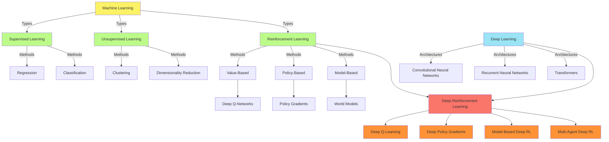
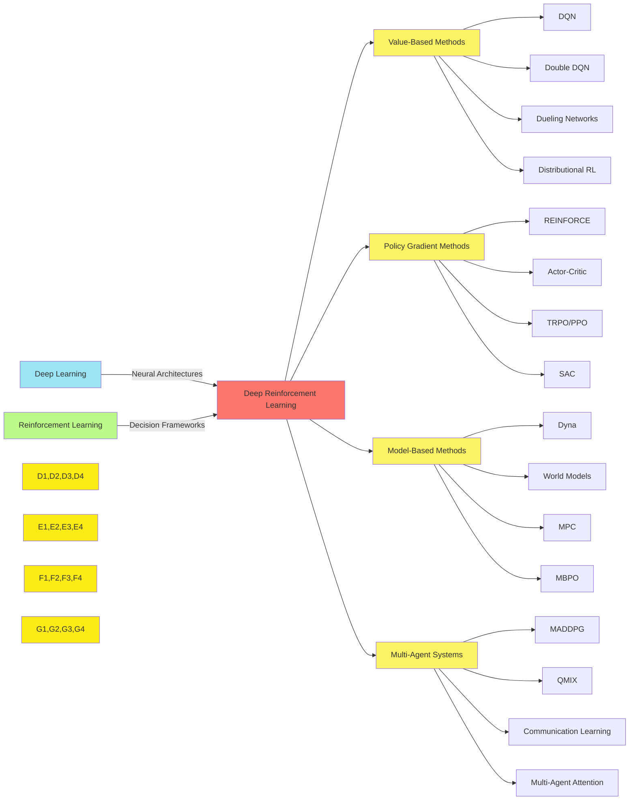

# C-5: Machine Learning Fundamentals

#### Foundations of Machine Learning

##### Core Concepts and Definitions

Machine Learning (ML) represents a paradigm shift from traditional programming approaches. In conventional software
development, humans explicitly encode rules that transform inputs to outputs. In contrast, ML systems derive these
transformation rules autonomously through exposure to data.

At its epistemological core, machine learning concerns knowledge acquisition through experience rather than explicit
instruction. The field addresses fundamental questions: How can computational systems improve with experience? What
constitutes learning in an algorithmic context? What are the theoretical limits of learnability?

Formally, we can define machine learning as follows:

A computer program is said to learn from experience $E$ with respect to some class of tasks $T$ and performance measure
$P$, if its performance at tasks in $T$, as measured by $P$, improves with experience $E$.

This definition, attributed to Tom Mitchell, encapsulates three essential components:

- The task ($T$) defines what the system aims to accomplish
- The experience ($E$) represents the data from which the system learns
- The performance measure ($P$) evaluates the system's efficacy

Machine learning algorithms construct mathematical models based on sample data, known as "training data," to make
predictions or decisions without being explicitly programmed to perform the task.

#### Historical Development

The intellectual lineage of machine learning traces back to multiple disciplines. Its philosophical underpinnings derive
from questions about knowledge acquisition dating to ancient philosophy. Its mathematical foundations emerged from
statistical theory, particularly Bayesian probability and regression analysis developed in the 18th and 19th centuries.

The term "machine learning" was coined by Arthur Samuel in 1959 while at IBM. Early milestones include:

- Frank Rosenblatt's perceptron (1957), which introduced the first trainable neural network model
- The development of decision tree algorithms (1960s)
- The formalization of backpropagation for neural networks (1986)
- The introduction of support vector machines (1992)
- The emergence of deep learning architectures (2006-present)

Each paradigm shift in ML has corresponded to advances in computational capability, data availability, or theoretical
breakthroughs.

#### Mathematical Underpinnings

Machine learning fundamentally relies on multiple mathematical domains:

1. **Linear Algebra**: Vector and matrix operations form the computational backbone of most ML algorithms. Concepts such
   as vector spaces, eigendecomposition, and singular value decomposition are essential for understanding many learning
   methods.
2. **Calculus**: Optimization in ML requires concepts from differential calculus, particularly gradient-based methods.
   The ubiquitous gradient descent algorithm relies on calculating partial derivatives of loss functions with respect to
   model parameters.
3. **Probability Theory**: Uncertainty quantification is central to ML. Probability theory provides the framework for
   modeling uncertainty in data, predictions, and model parameters. Concepts like conditional probability, Bayes'
   theorem, and probabilistic graphical models underpin many ML approaches.
4. **Information Theory**: Concepts such as entropy and mutual information provide ways to quantify information content
   and guide feature selection and model design.
5. **Optimization Theory**: Finding optimal model parameters typically involves minimizing or maximizing objective
   functions, often with constraints.

The confluence of these mathematical domains allows for the theoretical analysis and practical implementation of
learning algorithms.

#### The Learning Problem

From a formal perspective, the learning problem consists of:

- A space of instances $\mathcal{X}$ (inputs)
- A space of labels $\mathcal{Y}$ (outputs)
- A concept class $\mathcal{C}$ (the set of possible functions mapping $\mathcal{X}$ to $\mathcal{Y}$)
- A training set $S = {(x_1, y_1), (x_2, y_2), \ldots, (x_m, y_m)}$ where each
  $(x_i, y_i) \in \mathcal{X} \times \mathcal{Y}$
- A loss function $\ell: \mathcal{Y} \times \mathcal{Y} \rightarrow \mathbb{R}$ that quantifies prediction error

The objective is to find a function $h \in \mathcal{C}$ (the hypothesis) that minimizes the expected loss over the true
data distribution.

This framing highlights several critical challenges:

- The true data distribution is unknown; we only have samples
- The optimal function may not exist within our concept class (approximation error)
- With finite samples, we can only estimate the true expected loss (estimation error)
- Finding the optimal function within our concept class may be computationally intractable
- The learned function must generalize beyond the training examples

#### Statistical Learning Theory Framework

Statistical learning theory, pioneered by Vladimir Vapnik and Alexey Chervonenkis, provides a theoretical framework for
analyzing the generalization capabilities of learning algorithms.

Key concepts include:

1. **Empirical Risk Minimization (ERM)**: The principle of minimizing the average loss on the training data:

    $\hat{R}(h) = \frac{1}{m}\sum_{i=1}^{m}\ell(h(x_i), y_i)$

2. **Structural Risk Minimization (SRM)**: Extends ERM by incorporating model complexity penalties to prevent
   overfitting.

3. **VC (Vapnik-Chervonenkis) Dimension**: A measure of the capacity or complexity of a hypothesis class, which
   influences the sample complexity required for learning.

4. **The Bias-Variance Tradeoff**: Decomposing prediction error into:

    - Bias: Error from incorrect assumptions in the learning algorithm
    - Variance: Error from sensitivity to small fluctuations in the training set
    - Irreducible error: Inherent noise in the problem

This theoretical framework provides bounds on generalization error and informs the design of learning algorithms that
balance model complexity with empirical performance.

## 2. Taxonomy of Machine Learning Paradigms

#### Supervised Learning Methodologies

Supervised learning constitutes the most extensively studied paradigm in machine learning. In this framework, the
algorithm learns from labeled examples, where each training instance comprises input features and a corresponding output
value or category.

Formally, given a dataset $D = {(x_1, y_1), (x_2, y_2), \ldots, (x_n, y_n)}$ where $x_i \in \mathcal{X}$ represents
input features and $y_i \in \mathcal{Y}$ represents the corresponding output, the objective is to learn a function
$f: \mathcal{X} \rightarrow \mathcal{Y}$ that maps inputs to outputs.

Supervised learning problems bifurcate into two principal categories:

1. **Classification**: When the output space $\mathcal{Y}$ is discrete, containing a finite set of categories or
   classes. Examples include:
    - Binary classification ($\mathcal{Y} = {0, 1}$)
    - Multi-class classification ($\mathcal{Y} = {1, 2, \ldots, K}$)
    - Multi-label classification (each instance can belong to multiple classes simultaneously)
2. **Regression**: When the output space $\mathcal{Y}$ is continuous, typically $\mathcal{Y} = \mathbb{R}$ or
   $\mathcal{Y} = \mathbb{R}^d$. The objective is to predict a real-valued quantity.

Key supervised learning algorithms include:

- **Linear Models**: Linear regression, logistic regression, and their regularized variants (Ridge, Lasso)
- **Decision Trees**: Hierarchical models that partition the feature space recursively
- **Ensemble Methods**: Random Forests, Gradient Boosting Machines, AdaBoost
- **Support Vector Machines (SVM)**: Maximum-margin classifiers using kernel methods
- **k-Nearest Neighbors (k-NN)**: Non-parametric, instance-based learning
- **Bayesian Methods**: Naive Bayes, Bayesian networks, Gaussian processes

The supervised learning paradigm relies on several critical assumptions:

- The training and test data are drawn from the same distribution (i.i.d. assumption)
- The labeled examples are representative of the true underlying relationship
- The chosen hypothesis class can reasonably approximate the target function

Learning in this context typically involves optimization of a loss function that quantifies the discrepancy between
predictions and ground truth labels.

#### Unsupervised Learning Approaches

Unsupervised learning confronts the challenge of discovering structure in unlabeled data. Unlike supervised learning,
these algorithms operate without explicit output values, focusing instead on intrinsic patterns, relationships, and
distributions within the data.

Formally, given a dataset $D = {x_1, x_2, \ldots, x_n}$ where $x_i \in \mathcal{X}$, unsupervised learning aims to
identify meaningful patterns without the guidance of labeled responses.

Principal categories within unsupervised learning include:

1. **Clustering**: Partitioning data points into groups (clusters) such that points within the same cluster exhibit
   higher similarity than those in different clusters. Major approaches include:
    - Centroid-based methods (e.g., k-means, k-medoids)
    - Hierarchical clustering (agglomerative and divisive)
    - Density-based clustering (DBSCAN, OPTICS)
    - Probabilistic clustering (Gaussian Mixture Models)
2. **Dimensionality Reduction**: Transforming data from a high-dimensional space to a lower-dimensional representation
   while preserving essential characteristics. Techniques include:
    - Principal Component Analysis (PCA)
    - t-Distributed Stochastic Neighbor Embedding (t-SNE)
    - Uniform Manifold Approximation and Projection (UMAP)
    - Autoencoders (particularly relevant in deep learning)
3. **Density Estimation**: Estimating the probability distribution underlying the observed data. Methods include:
    - Kernel Density Estimation
    - Normalizing Flows
    - Variational Autoencoders (VAEs)
    - Generative Adversarial Networks (GANs)
4. **Anomaly Detection**: Identifying observations that deviate significantly from the majority of the data. Approaches
   include:
    - Statistical methods (z-score, modified z-score)
    - Distance-based methods
    - Density-based methods
    - Isolation Forest
    - One-class SVM

Unsupervised learning presents unique evaluation challenges given the absence of ground truth labels. Evaluation metrics
often rely on intrinsic measures (e.g., silhouette score, Davies-Bouldin index for clustering) or downstream task
performance when the unsupervised learning serves as a precursor to supervised tasks.

The theoretical foundations of unsupervised learning intersect with information theory, particularly concepts of entropy
and mutual information, which provide frameworks for quantifying the information content and relationships within data.

#### Reinforcement Learning Architecture

Reinforcement Learning (RL) presents a distinct paradigm centered on sequential decision-making under uncertainty.
Rather than learning from static datasets, RL agents learn through direct interaction with an environment, receiving
feedback in the form of rewards or penalties.

The fundamental architecture of RL is formalized through the Markov Decision Process (MDP) framework, defined by the
tuple $(\mathcal{S}, \mathcal{A}, P, R, \gamma)$:

- $\mathcal{S}$: The state space representing all possible configurations of the environment
- $\mathcal{A}$: The action space containing available agent actions
- $P(s'|s,a)$: The transition probability function denoting the likelihood of transitioning to state $s'$ when taking
  action $a$ in state $s$
- $R(s,a,s')$: The reward function specifying the immediate reward for transitioning from state $s$ to $s'$ via action
  $a$
- $\gamma \in [0,1]$: The discount factor determining the present value of future rewards

The agent's objective is to learn a policy $\pi: \mathcal{S} \rightarrow \mathcal{A}$ that maximizes the expected
cumulative discounted reward:

$$V^{\pi}(s) = \mathbb{E}*{\pi}\left[\sum*{t=0}^{\infty} \gamma^t R(s_t, a_t, s_{t+1}) | s_0 = s\right]$$

Major approaches in reinforcement learning include:

1. **Value-Based Methods**: These algorithms estimate the value of states or state-action pairs, including:
    - Dynamic Programming (when the MDP model is known)
    - Temporal Difference Learning (Q-learning, SARSA)
    - Value function approximation methods
2. **Policy-Based Methods**: These approaches directly optimize the policy without requiring value functions:
    - Policy Gradient methods (REINFORCE)
    - Actor-Critic architectures
    - Trust Region Policy Optimization (TRPO)
    - Proximal Policy Optimization (PPO)
3. **Model-Based RL**: These methods learn an explicit model of the environment:
    - Dyna architecture
    - Monte Carlo Tree Search (MCTS)
    - Probabilistic ensemble methods

Reinforcement learning confronts several distinctive challenges:

- The exploration-exploitation dilemma: balancing the need to explore unknown options versus exploiting known good
  options
- Credit assignment: determining which actions in a sequence contributed to observed outcomes
- Sample efficiency: learning effectively from limited environment interactions
- Stability and convergence issues, particularly in function approximation settings

RL's theoretical foundations incorporate elements from optimal control theory, dynamic programming, and non-convex
optimization, with convergence guarantees for various algorithms under specific conditions.

#### Semi-Supervised and Self-Supervised Learning

Between the paradigms of supervised and unsupervised learning lie important intermediate approaches that leverage both
labeled and unlabeled data or derive supervision signals from the data itself.

**Semi-Supervised Learning** addresses scenarios where a small quantity of labeled data exists alongside a larger corpus
of unlabeled data. Formally, given a dataset $D = {(x_1, y_1), \ldots, (x_l, y_l), x_{l+1}, \ldots, x_{l+u}}$ where
typically $l \ll u$, semi-supervised methods exploit the unlabeled examples to improve learning beyond what would be
possible using only the labeled subset.

Key approaches include:

- **Self-training**: Using a model trained on labeled data to generate pseudo-labels for unlabeled instances
- **Co-training**: Training multiple models on different views of the data and using their predictions to label
  unlabeled instances for each other
- **Graph-based methods**: Propagating labels through similarity graphs constructed from both labeled and unlabeled
  examples
- **Generative approaches**: Building models of the joint distribution $P(x,y)$ by incorporating unlabeled data through
  constraints on the marginal distribution $P(x)$

The efficacy of semi-supervised learning rests on assumptions about the relationship between data distribution and class
boundaries, particularly:

- The continuity assumption: Points close in the feature space likely share the same label
- The cluster assumption: Data points form clusters, and points in the same cluster likely share labels
- The manifold assumption: The high-dimensional data lies approximately on a lower-dimensional manifold

**Self-Supervised Learning** represents a more recent paradigm that derives supervisory signals from the data itself
without requiring external labels. Instead of predicting labels, self-supervised methods predict parts of the data from
other parts.

Common self-supervised approaches include:

- **Pretext tasks**: Solving artificially created tasks where the "labels" are generated from the data itself (e.g.,
  predicting rotation, solving jigsaw puzzles, colorizing grayscale images)
- **Contrastive learning**: Training encoders to map similar instances closer in the embedding space while pushing
  dissimilar instances apart
- **Masked data modeling**: Predicting masked or corrupted portions of the input (e.g., masked language modeling in
  BERT, masked image modeling in Vision Transformers)
- **Autoregressive modeling**: Predicting future elements in a sequence given past elements

Self-supervised learning has proven particularly transformative in natural language processing and computer vision,
enabling pre-training of large models on vast unlabeled datasets before fine-tuning on specific downstream tasks.

The theoretical advantages of these approaches include improved sample efficiency, better representation learning, and
increased robustness in low-data regimes.

#### Transfer Learning and Meta-Learning

As machine learning applications grow in complexity while labeled data remains costly to acquire, methodologies that
transcend the traditional single-task learning paradigm have become increasingly vital.

**Transfer Learning** addresses the challenge of applying knowledge gained from one problem domain to a different but
related domain. Formally, given a source domain $\mathcal{D}_S$ with task $\mathcal{T}_S$ and a target domain
$\mathcal{D}_T$ with task $\mathcal{T}_T$, transfer learning aims to improve performance on $\mathcal{T}_T$ using
knowledge from $\mathcal{D}_S$ and $\mathcal{T}_S$.

Key transfer learning approaches include:

- **Feature-based Transfer**: Reusing learned feature representations
    - **Inductive transfer**: Source and target tasks differ, but domains may be similar
    - **Transductive transfer**: Tasks are similar, but domains differ
    - **Unsupervised transfer**: Transferring to unsupervised target tasks
- **Model-based Transfer**: Adapting pre-trained models
    - **Fine-tuning**: Adjusting pre-trained model parameters on the target domain
    - **Domain adaptation**: Explicitly addressing domain shift between source and target
    - **Parameter sharing**: Using parts of source models as components in target models

Transfer learning's efficacy depends on several factors:

- The relatedness of source and target domains
- The nature of the transferred knowledge
- The potential for negative transfer when domains are insufficiently related

**Meta-Learning**, or "learning to learn," operates at an even higher level of abstraction. Rather than transferring
knowledge between specific tasks, meta-learning aims to develop algorithms that can efficiently learn new tasks by
extracting generalizable knowledge from a distribution of related tasks.

Formally, given a distribution over tasks $p(\mathcal{T})$, the meta-learning objective is to find learning procedures
that perform well across this task distribution with minimal task-specific adaptation.

Principal meta-learning approaches include:

- **Metric-based methods**: Learning similarity metrics that generalize across tasks (e.g., Prototypical Networks,
  Matching Networks)
- **Model-based methods**: Using recurrent architectures that "remember" how to learn (e.g., Meta Networks)
- **Optimization-based methods**: Learning optimization procedures that rapidly adapt to new tasks (e.g., Model-Agnostic
  Meta-Learning, or MAML)

Meta-learning addresses fundamental questions about the nature of learning itself, and its applications extend from
few-shot learning to hyperparameter optimization and neural architecture search.

The theoretical foundations of these approaches connect to Bayesian inference, multi-task learning, and representations
that capture task-invariant properties—enabling systems that can effectively leverage knowledge across domains and adapt
rapidly to novel challenges.

## 3. Deep Learning Architecture and Applications

#### Neural Network Foundations

Neural networks constitute the bedrock of deep learning architectures, inspired by biological neural systems but
formalized as computational graphs capable of universal function approximation. At their core, neural networks consist
of interconnected units (neurons) organized in layers, with each neuron applying a nonlinear transformation to its
inputs.

The fundamental computational unit, the artificial neuron, computes:

$$y = \sigma\left(\sum_{i=1}^n w_i x_i + b\right) = \sigma(w^T x + b)$$

Where:

- $x$ represents the input vector
- $w$ denotes the weight vector
- $b$ is the bias term
- $\sigma$ is a nonlinear activation function

Common activation functions include:

- Sigmoid: $\sigma(z) = \frac{1}{1 + e^{-z}}$
- Hyperbolic tangent: $\tanh(z) = \frac{e^z - e^{-z}}{e^z + e^{-z}}$
- Rectified Linear Unit (ReLU): $\text{ReLU}(z) = \max(0, z)$
- Leaky ReLU: $\text{LeakyReLU}(z) = \max(\alpha z, z)$ where $\alpha$ is a small positive constant
- Softmax (for multi-class outputs): $\text{softmax}(z_i) = \frac{e^{z_i}}{\sum_j e^{z_j}}$

The multilayer perceptron (MLP), comprising input, hidden, and output layers, forms the canonical neural network
architecture. Learning in neural networks typically employs gradient-based optimization, using the backpropagation
algorithm to efficiently compute parameter gradients through the chain rule of calculus.

The neural computation in an $L$-layer network can be expressed as:

$$z^{(l)} = W^{(l)}a^{(l-1)} + b^{(l)}$$ $$a^{(l)} = \sigma^{(l)}(z^{(l)})$$

Where:

- $a^{(l)}$ represents activations at layer $l$
- $W^{(l)}$ and $b^{(l)}$ are weights and biases for layer $l$
- $\sigma^{(l)}$ is the activation function at layer $l$

Training objective functions vary by task:

- Mean Squared Error for regression: $\mathcal{L}*{MSE} = \frac{1}{N}\sum*{i=1}^N (y_i - \hat{y}_i)^2$
- Cross-Entropy for classification: $\mathcal{L}*{CE} = -\frac{1}{N}\sum*{i=1}^N \sum_{j=1}^C y_{ij} \log(\hat{y}_{ij})$

The theoretical significance of neural networks lies in their universal approximation capabilities: given sufficient
width or depth, they can approximate any continuous function on compact subsets of $\mathbb{R}^n$ to arbitrary
precision, providing a theoretical foundation for their widespread applicability.

#### From Shallow to Deep Architectures

The evolution from shallow to deep neural architectures represents both a quantitative and qualitative shift in machine
learning capabilities. While shallow networks (typically 1-2 hidden layers) dominated early neural network research,
contemporary deep learning leverages architectures with tens, hundreds, or even thousands of layers.

This transition was enabled by several crucial developments:

1. **Computational Advancements**: The emergence of Graphics Processing Units (GPUs) and specialized hardware (TPUs,
   neuromorphic chips) provided the computational capacity for training increasingly deep networks.
2. **Algorithmic Innovations**:
    - More effective weight initialization strategies (e.g., Xavier/Glorot, He initialization)
    - Normalization techniques (Batch Normalization, Layer Normalization)
    - Residual connections that mitigate vanishing gradients
    - More sophisticated optimizers (Adam, RMSProp)
3. **Architectural Innovations**:
    - Skip connections and dense connectivity patterns
    - Inception modules combining multi-scale feature extraction
    - Residual Networks (ResNets) enabling training of networks with hundreds of layers

The theoretical advantages of depth over width have been extensively studied. Key insights include:

- **Hierarchical Representation**: Deep networks learn hierarchical feature representations, with earlier layers
  capturing low-level features (edges, textures) and deeper layers representing increasingly abstract concepts.
- **Exponential Expressivity**: For certain function classes, the number of units required grows exponentially with
  width but only polynomially with depth, demonstrating a theoretical efficiency of deeper architectures.
- **Inductive Bias**: The compositional nature of deep networks aligns with the hierarchical structure found in many
  natural domains (vision, language, audio), creating an advantageous inductive bias.

The mathematical formulation for a residual network exemplifies how architectural innovations enabled increased depth:

$$y^{(l)} = x^{(l)} + \mathcal{F}(x^{(l)}, W^{(l)})$$ $$x^{(l+1)} = \sigma(y^{(l)})$$

Where $\mathcal{F}$ represents a residual function and direct skip connections allow gradients to flow through the
network more effectively.

The progression to deeper architectures has yielded qualitatively different capabilities, with modern architectures
demonstrating emergent behaviors not observed in shallow counterparts, including in-context learning and few-shot
adaptation capabilities.

#### Representational Learning Theory

Representational learning constitutes a fundamental paradigm shift in machine learning, moving from manual feature
engineering to automated discovery of useful representations. Deep learning excels in this domain by learning multiple
levels of representation, each transforming the representation at the previous level into more abstract and composite
forms.

The theoretical foundations of representational learning encompass several key principles:

1. **Distributed Representations**: Unlike symbolic AI systems that use localized representations, neural networks
   encode information in distributed patterns across many units. This offers exponential efficiency in representation
   capacity: with $n$ binary units, a distributed representation can encode $2^n$ different concepts.

2. **Manifold Hypothesis**: High-dimensional data often concentrates near lower-dimensional manifolds. Deep networks
   learn these manifold structures, effectively "unwrapping" them into more separable representations.

3. **Information Bottleneck Theory**: This framework views learning as an information-theoretic optimization problem of
   finding a representation $Z$ of the input $X$ that:

    - Preserves information about the target $Y$: Maximize $I(Z; Y)$
    - Compresses information from the input: Minimize $I(Z; X)$

    The objective becomes minimizing $\mathcal{L} = I(Z; X) - \beta I(Z; Y)$, with $\beta$ controlling the
    compression-prediction tradeoff.

4. **Disentangled Representations**: Ideally, learned representations separate the underlying factors of variation in
   the data. Mathematically, if the data is generated by factors $z_1, z_2, ..., z_k$, a disentangled representation
   would identify these factors independently.

The progression of representations through a deep network can be analyzed through visualization techniques and
mathematical tools:

- **Activation Maximization**: Finding inputs that maximize specific neuron activations
- **Feature Visualization**: Generating images that maximize activations in different network layers
- **t-SNE and UMAP**: Visualizing high-dimensional representations in 2D or 3D
- **Singular Value Decomposition**: Analyzing the dimensionality and structure of representations

Several metrics quantify representation quality:

- **Linear Separability**: How easily classes can be separated by linear boundaries in the representation space
- **Mutual Information**: Information shared between representations and labels
- **Representation Similarity Analysis**: Comparing different representation spaces
- **Disentanglement Metrics**: Measuring independence of representation dimensions

The efficacy of learned representations typically depends on:

- Network depth and width
- Regularization techniques
- Training objectives (supervised, self-supervised, contrastive)
- Inductive biases encoded in the architecture

Recent advances in self-supervised representation learning have demonstrated that powerful representations can be
learned without explicit labels, challenging previous assumptions about the necessity of supervised signals for
effective representation learning.

#### Convolutional and Recurrent Architectures

Deep learning's success in perceptual and sequential domains largely derives from specialized architectures that encode
inductive biases aligned with the structure of the data: Convolutional Neural Networks (CNNs) for spatial data and
Recurrent Neural Networks (RNNs) for sequential data.

**Convolutional Neural Networks** exploit spatial locality, translation invariance, and hierarchical composition in
visual data through specialized layer operations:

1. **Convolutional Layers**: Apply learned filters across the input space using the convolution operation:

    $$z_{i,j,k} = \sum_{m=0}^{F_h-1} \sum_{n=0}^{F_w-1} \sum_{c=0}^{C_{in}-1} x_{i+m,j+n,c} \cdot w_{m,n,c,k} + b_k$$

    Where:

    - $F_h, F_w$ represent filter height and width
    - $C_{in}$ is the number of input channels
    - $w_{m,n,c,k}$ are the weights for the $k$-th filter
    - $b_k$ is the bias for the $k$-th filter

2. **Pooling Layers**: Reduce spatial dimensions through operations like max-pooling:

    $$p_{i,j,k} = \max_{0 \leq m < P_h, 0 \leq n < P_w} x_{i \cdot S_h + m, j \cdot S_w + n, k}$$

    Where $P_h, P_w$ are pooling dimensions and $S_h, S_w$ are stride values.

3. **Architectural Patterns**: Modern CNNs employ sophisticated architectural motifs:

    - Multiple convolutional layers before pooling
    - Skip connections (ResNet)
    - Inception modules with parallel paths
    - Depthwise separable convolutions (MobileNet)
    - Dilated convolutions for expanded receptive fields

Key CNN architectures that defined the evolution of the field include LeNet, AlexNet, VGGNet, GoogLeNet/Inception,
ResNet, DenseNet, and EfficientNet, each introducing innovations that improved performance or efficiency.

**Recurrent Neural Networks** process sequential data by maintaining hidden states that capture temporal dependencies:

1. **Basic RNN Computation**:

    $$h_t = \sigma(W_{xh} x_t + W_{hh} h_{t-1} + b_h)$$ $$y_t = W_{hy} h_t + b_y$$

    Where $h_t$ is the hidden state at time $t$, $x_t$ is the input, and $y_t$ is the output.

2. **Long Short-Term Memory (LSTM)**: Addresses the vanishing gradient problem through gated mechanisms:

    $$f_t = \sigma(W_f \cdot [h_{t-1}, x_t] + b_f)$$ (Forget gate) $$i_t = \sigma(W_i \cdot [h_{t-1}, x_t] + b_i)$$
    (Input gate) $$\tilde{C}*t = \tanh(W_C \cdot [h*{t-1}, x_t] + b_C)$$ (Candidate cell state)
    $$C_t = f_t \odot C_{t-1} + i_t \odot \tilde{C}*t$$ (Cell state update)
    $$o_t = \sigma(W_o \cdot [h*{t-1}, x_t] + b_o)$$ (Output gate) $$h_t = o_t \odot \tanh(C_t)$$ (Hidden state update)

3. **Gated Recurrent Unit (GRU)**: A simplified variant with fewer parameters:

    $$z_t = \sigma(W_z \cdot [h_{t-1}, x_t])$$ (Update gate) $$r_t = \sigma(W_r \cdot [h_{t-1}, x_t])$$ (Reset gate)
    $$\tilde{h}*t = \tanh(W \cdot [r_t \odot h*{t-1}, x_t])$$ (Candidate hidden state)
    $$h_t = (1 - z_t) \odot h_{t-1} + z_t \odot \tilde{h}_t$$ (Hidden state update)

4. **Bidirectional RNNs**: Process sequences in both forward and backward directions

5. **Deep RNNs**: Stack multiple recurrent layers for hierarchical processing

The theoretical advantages of these specialized architectures include:

- Parameter sharing that drastically reduces model complexity
- Inductive biases aligned with data structure (spatial locality for CNNs, temporal dependence for RNNs)
- Invariance to certain transformations (translation for CNNs)
- Ability to process variable-length inputs (RNNs)

Their limitations, including the limited receptive field of CNNs and difficulty in capturing long-range dependencies in
RNNs, have motivated subsequent architectural innovations, particularly attention mechanisms and transformers.

#### Attention Mechanisms and Transformers

Attention mechanisms represent a paradigm shift in neural architecture design, addressing fundamental limitations of
previous approaches by dynamically focusing computational resources on relevant input elements. This innovation has
revolutionized sequence modeling and beyond, with transformers emerging as the dominant architecture for many domains.

**Attention Mechanisms** compute weighted aggregations of input elements based on their relevance to the query:

1. **Basic Attention**: Given a query $q$ and a set of key-value pairs $(k_i, v_i)$, attention computes:

    $$\text{Attention}(q, K, V) = \sum_i \alpha_i v_i$$

    Where weights $\alpha_i$ are computed as:

    $$\alpha_i = \frac{\exp(\text{score}(q, k_i))}{\sum_j \exp(\text{score}(q, k_j))}$$

2. **Scoring Functions**:

    - Dot product: $\text{score}(q, k) = q^T k$
    - Scaled dot product: $\text{score}(q, k) = \frac{q^T k}{\sqrt{d_k}}$
    - Additive: $\text{score}(q, k) = v^T \tanh(W_q q + W_k k)$

3. **Types of Attention**:

    - **Self-attention**: Where queries, keys, and values all derive from the same sequence
    - **Cross-attention**: Where queries come from one sequence, keys and values from another
    - **Multi-head attention**: Performing attention multiple times in parallel with different learned projections

The **Transformer Architecture**, introduced by Vaswani et al. in 2017, eliminated recurrence entirely in favor of
attention mechanisms:

1. **Core Components**:

    - **Multi-Head Attention**:

        $$\text{MultiHead}(Q, K, V) = \text{Concat}(\text{head}_1, \ldots, \text{head}_h)W^O$$

        Where each head computes:

        $$\text{head}_i = \text{Attention}(QW_i^Q, KW_i^K, VW_i^V)$$

    - **Position-wise Feed-Forward Networks**:

        $$\text{FFN}(x) = \max(0, xW_1 + b_1)W_2 + b_2$$

    - **Layer Normalization**: Normalizing activations across feature dimensions

    - **Residual Connections**: Facilitating gradient flow through deep networks

    - **Positional Encodings**: Since attention lacks inherent sequential ordering, positional information is explicitly
      encoded:

        $$\text{PE}*{(pos, 2i)} = \sin(pos/10000^{2i/d*{\text{model}}})$$
        $$\text{PE}*{(pos, 2i+1)} = \cos(pos/10000^{2i/d*{\text{model}}})$$

2. **Architecture Organization**

    - Encoder stack: Self-attention followed by feed-forward layers

    - Decoder stack: Masked self-attention, cross-attention to encoder outputs, and feed-forward layers

    - Final linear projection and softmax for output distribution

The transformer architecture offers several theoretical advantages:

- **Parallelization**: Unlike RNNs, transformers process entire sequences simultaneously
- **Global receptive field**: Each position can attend to all other positions
- **Path length**: Information flows between any two positions with constant path length
- **Inductive bias**: Weaker sequential inductive bias enables learning more flexible patterns

Since their introduction, transformers have evolved into various specialized architectures:

- **BERT**: Bidirectional encoder representations using masked language modeling
- **GPT (Generative Pre-trained Transformer)**: Unidirectional decoder-only architecture for generative tasks
- **T5 (Text-to-Text Transfer Transformer)**: Encoder-decoder framework recasting all NLP tasks as text-to-text problems
- **Vision Transformer (ViT)**: Adapting transformers to image processing by treating image patches as tokens
- **Swin Transformer**: Incorporating hierarchical structure for vision tasks
- **Perceiver**: Addressing scaling issues by attending to a latent bottleneck

The scaling properties of transformers have proven particularly remarkable, with performance continuing to improve with
increased model size, training data, and computation—leading to emergent capabilities not anticipated by earlier scaling
laws. This scaling behavior has driven the development of increasingly large language models with billions to trillions
of parameters, representing a qualitative shift in AI capabilities.

#### Deep Reinforcement Learning

##### Integration of Deep Learning with RL

Deep Reinforcement Learning (Deep RL) represents the synthesis of deep neural networks with reinforcement learning
principles, addressing the fundamental limitations of traditional RL approaches when applied to high-dimensional state
spaces. This integration has transformed the field, enabling agents to learn directly from rich sensory inputs rather
than hand-engineered features.

The canonical integration pattern replaces traditional tabular value functions or linear function approximators with
deep neural networks. Formally, instead of maintaining a table $Q(s,a)$, deep RL employs parameterized functions
$Q(s,a;\theta)$ where $\theta$ represents the neural network parameters.

Several key challenges arise in this integration:

1. **Non-stationarity**: As the policy improves, the distribution of experiences changes, violating the i.i.d.
   assumption underlying standard deep learning
2. **Sample efficiency**: RL typically requires many interactions with the environment
3. **Credit assignment**: Determining which actions in a temporal sequence contributed to observed outcomes
4. **Exploration-exploitation balance**: Managing the tradeoff between exploring new actions and exploiting known good
   actions

To address these challenges, deep RL introduces several architectural and algorithmic innovations:

1. **Experience Replay**: Storing experience tuples $(s_t, a_t, r_t, s_{t+1})$ in a replay buffer and sampling randomly
   during training, improving sample efficiency and reducing correlation between training samples.

2. **Target Networks**: Using separate networks for target value computation, updated less frequently than the online
   network, enhancing training stability:

    $$y_i = r_i + \gamma \max_{a'} Q(s_{i+1}, a'; \theta^-)$$

    Where $\theta^-$ represents parameters of the target network.

3. **Dueling Architectures**: Decomposing the Q-function into value and advantage components:

    $$Q(s,a;\theta,\alpha,\beta) = V(s;\theta,\beta) + \left(A(s,a;\theta,\alpha) - \frac{1}{|\mathcal{A}|}\sum_{a'} A(s,a';\theta,\alpha)\right)$$

4. **Distributional RL**: Modeling the entire distribution of returns rather than just their expectation, capturing
   uncertainty in value estimates.

The theoretical justification for deep RL combines principles from both fields:

- From deep learning: Universal function approximation capabilities of neural networks
- From reinforcement learning: Policy iteration and value function convergence theorems

Despite these theoretical foundations, deep RL often requires careful implementation considerations, including:

- Gradient clipping to prevent exploding gradients
- Appropriate weight initialization and normalization strategies
- Entropy regularization to encourage exploration
- Reward scaling and normalization

The integration of deep learning with RL represents a significant advance in AI capabilities, enabling systems to learn
complex behaviors from high-dimensional inputs and raw sensory data without explicit feature engineering.

#### Value-Based Methods

Value-based methods constitute a fundamental approach in deep reinforcement learning, focusing on estimating the value
of states or state-action pairs to derive optimal policies. The integration of deep neural networks with traditional
value-based algorithms has enabled these methods to scale to complex, high-dimensional problems.

**Deep Q-Networks (DQN)** represent the seminal value-based deep RL algorithm, using a neural network to approximate the
action-value function $Q(s,a)$. DQN's key innovations include:

1. **Experience Replay**: Storing transitions $(s_t, a_t, r_t, s_{t+1})$ in a replay buffer $\mathcal{D}$ and sampling
   mini-batches for training:

    $$\mathcal{L}(\theta) = \mathbb{E}*{(s,a,r,s') \sim \mathcal{D}} \left[ \left( r + \gamma \max*{a'} Q(s', a'; \theta^-) - Q(s, a; \theta) \right)^2 \right]$$

2. **Target Networks**: Using a separate network with parameters $\theta^-$ periodically copied from the online network
   parameters $\theta$ to provide stable targets.

3. **Update Equation**: Minimizing the temporal difference error using gradient descent:

    $$\theta_{t+1} = \theta_t + \alpha \left[ \left( r + \gamma \max_{a'} Q(s', a'; \theta^-*t) - Q(s, a; \theta_t) \right) \nabla*{\theta} Q(s, a; \theta_t) \right]$$

Several significant extensions to DQN have improved performance and stability:

1. **Double DQN**: Addressing overestimation bias by decoupling action selection and evaluation:

    $$y_i^{\text{Double}} = r_i + \gamma Q(s_{i+1}, \arg\max_{a'} Q(s_{i+1}, a'; \theta); \theta^-)$$

2. **Prioritized Experience Replay**: Sampling transitions with probability proportional to their temporal difference
   error:

    $$P(i) = \frac{p_i^{\alpha}}{\sum_k p_k^{\alpha}}$$

    where $p_i = |\delta_i| + \epsilon$ represents the priority based on TD-error $\delta_i$.

3. **Dueling Networks**: Separating state value and action advantage estimation:

    $$Q(s,a) = V(s) + \left( A(s,a) - \frac{1}{|\mathcal{A}|} \sum_{a'} A(s,a') \right)$$

4. **Noisy Networks**: Incorporating parametric noise in the network weights for directed exploration:

    $$y = (b + \sigma_b \odot \epsilon_b) + (W + \sigma_W \odot \epsilon_W)x$$

5. **Distributional RL**: Modeling the distribution of returns rather than just the expectation:

    $$Z_{\theta}(s,a) = \sum_{i=0}^{N-1} p_i(s,a;\theta) \delta_{z_i}$$

    where $p_i(s,a;\theta)$ represents the probability mass associated with atom $z_i$.

Value-based methods face several theoretical and practical challenges:

- Function approximation can lead to instability and divergence
- Bootstrapping can propagate estimation errors
- Discretization of continuous action spaces may be necessary
- The deadly triad: the combination of function approximation, bootstrapping, and off-policy learning can lead to
  instability

Despite these challenges, value-based deep RL methods have achieved remarkable success in domains including:

- Arcade game playing (Atari suite)
- Board games (when combined with search techniques)
- Robotic manipulation tasks with discrete action spaces
- Recommendation systems and dialogue agents

The theoretical understanding of value-based deep RL continues to evolve, with recent advances focusing on convergence
guarantees, sample complexity bounds, and the relationship between approximation architecture and learning performance.

#### Policy Gradient Approaches

Policy gradient methods form a distinct class of reinforcement learning algorithms that directly optimize the policy
parameters without requiring value function estimation as an intermediate step. These approaches have proven
particularly effective for continuous action spaces and problems with stochastic optimal policies.

The fundamental objective in policy gradient methods is to maximize the expected cumulative reward:

$$J(\theta) = \mathbb{E}*{\tau \sim p*{\theta}(\tau)} \left[ \sum_t r(s_t, a_t) \right]$$

Where $\tau$ represents a trajectory $(s_0, a_0, r_0, s_1, a_1, r_1, ...)$ and $p_{\theta}(\tau)$ is the distribution
over trajectories induced by policy $\pi_{\theta}$.

The key insight of policy gradient methods is the Policy Gradient Theorem, which provides an analytical expression for
the gradient of this objective:

$$\nabla_{\theta} J(\theta) = \mathbb{E}*{\tau \sim p*{\theta}(\tau)} \left[ \sum_t \nabla_{\theta} \log \pi_{\theta}(a_t|s_t) \sum_{t'=t} r(s_{t'}, a_{t'}) \right]$$

This leads to the REINFORCE algorithm, a Monte Carlo policy gradient method:

$$\theta_{t+1} = \theta_t + \alpha \sum_{t'=t}^T \nabla_{\theta} \log \pi_{\theta}(a_{t'}|s_{t'}) \sum_{t''=t'}^T r(s_{t''}, a_{t''})$$

Several innovations have improved upon this basic approach:

1. **Baseline Subtraction**: Reducing gradient variance by subtracting a state-dependent baseline $b(s_t)$:

    $$\nabla_{\theta} J(\theta) = \mathbb{E}*{\tau} \left[ \sum_t \nabla*{\theta} \log \pi_{\theta}(a_t|s_t) \left( \sum_{t'=t} r(s_{t'}, a_{t'}) - b(s_t) \right) \right]$$

2. **Actor-Critic Methods**: Combining policy gradient (actor) with value function approximation (critic):

    $$\nabla_{\theta} J(\theta) \approx \mathbb{E}*{s,a} \left[ \nabla*{\theta} \log \pi_{\theta}(a|s) Q^{\pi}(s,a) \right]$$

3. **Natural Policy Gradient**: Using the Fisher information matrix to account for the Riemannian geometry of the
   parameter space:

    $$\theta_{t+1} = \theta_t + \alpha F^{-1} \nabla_{\theta} J(\theta)$$

    Where $F$ is the Fisher information matrix:
    $F = \mathbb{E}*{s,a} [ \nabla*{\theta} \log \pi_{\theta}(a|s) \nabla_{\theta} \log \pi_{\theta}(a|s)^T ]$

4. **Trust Region Policy Optimization (TRPO)**: Constraining policy updates to ensure improvement:

    $$\max_{\theta} \mathbb{E}*{s,a \sim \pi*{\theta_{\text{old}}}} \left[ \frac{\pi_{\theta}(a|s)}{\pi_{\theta_{\text{old}}}(a|s)} A^{\pi_{\theta_{\text{old}}}}(s,a) \right]$$

    Subject to:
    $\mathbb{E}*{s \sim \rho^{\pi*{\theta_{\text{old}}}}} [ D_{KL}(\pi_{\theta_{\text{old}}}(\cdot|s) || \pi_{\theta}(\cdot|s)) ] \leq \delta$

5. **Proximal Policy Optimization (PPO)**: A first-order approximation to TRPO using a clipped objective function:

    $$L^{\text{CLIP}}(\theta) = \mathbb{E}_t \left[ \min(r_t(\theta) A_t, \text{clip}(r_t(\theta), 1-\epsilon, 1+\epsilon) A_t) \right]$$

    Where $r_t(\theta) = \frac{\pi_{\theta}(a_t|s_t)}{\pi_{\theta_{\text{old}}}(a_t|s_t)}$

Deep neural networks in the policy gradient context typically parameterize the policy as:

- Categorical distributions for discrete actions: $\pi_{\theta}(a|s) = \text{softmax}(f_{\theta}(s))_a$
- Gaussian distributions for continuous actions:
  $\pi_{\theta}(a|s) = \mathcal{N}(a | \mu_{\theta}(s), \sigma_{\theta}(s))$

Key theoretical considerations in policy gradient methods include:

- The exploration-exploitation tradeoff, often managed through entropy regularization
- The policy parameterization's impact on the optimization landscape
- The interplay between policy and value function learning in actor-critic methods
- Variance reduction techniques and their effect on bias-variance tradeoff

Recent advances in policy gradient methods have focused on:

- Off-policy training to improve sample efficiency
- Deterministic policy gradients for continuous control
- Hierarchical policies for temporally extended actions
- Multi-agent policy gradients for cooperative and competitive settings

Policy gradient methods have demonstrated remarkable success in continuous control tasks, robotic manipulation, and
simulated physics environments, often outperforming value-based methods in these domains.

#### Model-Based Deep RL

Model-based reinforcement learning represents a distinct paradigm that explicitly constructs a model of the
environment's dynamics, enabling planning, simulation, and more efficient learning. When integrated with deep learning,
these approaches can scale to complex environments while maintaining sample efficiency advantages over model-free
methods.

The core components of model-based deep RL include:

1. **Environment Dynamics Model**: A function $\hat{P}(s_{t+1}|s_t,a_t)$ predicting the next state given the current
   state and action, typically parameterized as a neural network:
    - Deterministic models: $\hat{s}*{t+1} = f*{\theta}(s_t, a_t)$
    - Stochastic models: $\hat{s}*{t+1} \sim \mathcal{N}(\mu*{\theta}(s_t, a_t), \Sigma_{\theta}(s_t, a_t))$
    - Latent dynamics models: $z_{t+1} = g_{\theta}(z_t, a_t)$ where $z$ represents a learned latent state
2. **Reward Model**: A function $\hat{r}(s_t, a_t, s_{t+1})$ predicting the reward for a given transition.
3. **Planning Algorithm**: Methods for using the learned model to select actions, such as:
    - Model Predictive Control (MPC): Optimizing actions over a finite horizon using the model
    - Monte Carlo Tree Search (MCTS): Building a search tree through simulated rollouts
    - Policy optimization through simulated experience

Several key approaches in model-based deep RL include:

1. **Dyna Architecture**: Integrating real experience with simulated experience:

    - Collect real experience from environment interactions
    - Learn a dynamics model from this experience
    - Generate simulated experience from the model
    - Update the policy using both real and simulated data

2. **Probabilistic Ensemble Models**: Managing model uncertainty through ensembles of neural networks:

    $$\hat{P}(s_{t+1}|s_t,a_t) = \frac{1}{B}\sum_{i=1}^B \mathcal{N}(s_{t+1}|\mu_{\theta_i}(s_t,a_t), \Sigma_{\theta_i}(s_t,a_t))$$

    This approach captures both aleatoric uncertainty (inherent stochasticity) and epistemic uncertainty (model
    parameter uncertainty).

3. **Latent Space Models**: Learning compact state representations for more efficient modeling:

    - World Models: Combining a VAE for state encoding, an RNN for dynamics prediction, and a controller trained in the
      latent space
    - PlaNet: Learning continuous latent dynamics from pixels using a recurrent state-space model

4. **Differentiable Planning**: End-to-end optimization through differentiable planning modules:

    - Value Iteration Networks: Embedding differentiable value iteration within a neural network
    - Differentiable MPC: Backpropagating through model predictive control computations

5. **Model-Based Policy Optimization (MBPO)**: Branched rollouts for policy improvement:

    - Short-horizon model-based updates to reduce compounding errors
    - Interleaving model learning with policy optimization

The theoretical advantages of model-based approaches include:

- Sample efficiency: Learning from simulated experience reduces required environment interactions
- Planning capabilities: Explicit modeling enables planning and adaptation to changing goals
- Transfer learning: Models can generalize across tasks with shared dynamics
- Exploration: Model uncertainty can guide principled exploration

Key challenges in model-based deep RL include:

- Model bias: Errors in the learned model can lead to suboptimal policies
- Compounding errors: Small prediction errors compound over multi-step rollouts
- Distributional shift: The model is trained on data from previous policies but used to simulate data for new policies
- Computational complexity: Planning and simulation often require significant computation

Recent advances have focused on:

- Hybrid approaches combining model-based and model-free learning
- Meta-learning for rapid model adaptation
- Learning models that capture only decision-relevant aspects of the environment
- Leveraging causal structure in environment dynamics

Model-based deep RL has shown particular promise in robotics, autonomous vehicles, and other domains where sample
efficiency is critical and environment dynamics follow learnable patterns.

##### Multi-Agent Deep RL Systems

Multi-Agent Reinforcement Learning (MARL) extends the RL paradigm to environments with multiple interacting agents,
introducing strategic considerations, emergent behaviors, and coordination challenges. The integration of deep learning
with MARL has enabled significant advances in this complex domain.

The formal framework for multi-agent RL extends MDPs to include multiple decision-makers:

1. **Markov Games**: A tuple $(S, {A_i}*{i=1}^N, P, {R_i}*{i=1}^N, \gamma)$ where:
    - $S$ is the state space
    - $A_i$ is the action space for agent $i$
    - $P: S \times A_1 \times ... \times A_N \times S \rightarrow [0,1]$ is the transition function
    - $R_i: S \times A_1 \times ... \times A_N \times S \rightarrow \mathbb{R}$ is the reward function for agent $i$
    - $\gamma$ is the discount factor
2. **Partial Observability**: Often, agents observe only a limited portion of the state, formalized as:
    - $\Omega_i$: Observation space for agent $i$
    - $O_i: S \times \Omega_i \rightarrow [0,1]$: Observation function mapping states to observations

The fundamental challenges in multi-agent RL include:

1. **Non-stationarity**: As agents learn, their policies change, making the environment non-stationary from each agent's
   perspective
2. **Scalability**: The joint action space grows exponentially with the number of agents
3. **Credit assignment**: Determining each agent's contribution to team success
4. **Strategic considerations**: Accounting for other agents' behaviors, including cooperation, competition, and
   mixed-motive scenarios

Deep MARL approaches can be categorized into several frameworks:

1. **Independent Learning**: Each agent learns independently, treating other agents as part of the environment:

    $$Q_i(s_i,a_i) \leftarrow Q_i(s_i,a_i) + \alpha [r_i + \gamma \max_{a'_i} Q_i(s'_i,a'_i) - Q_i(s_i,a_i)]$$

    While simple, this approach suffers from non-stationarity and coordination challenges.

2. **Centralized Training with Decentralized Execution (CTDE)**:

    - During training, agents have access to global information

    - During execution, agents act based solely on local observations

    - Examples include QMIX, which learns a monotonic factorization of the joint Q-function:

        $$Q_{tot}(\tau, \mathbf{a}) = f_{\theta}(Q_1(\tau_1, a_1), ..., Q_n(\tau_n, a_n))$$

        where $\frac{\partial Q_{tot}}{\partial Q_i} \geq 0$, ensuring consistency between local and global optima

3. **Value Decomposition Networks (VDN)**: Decomposing the team value function as a sum of individual agent values:

    $$Q_{tot}(\tau, \mathbf{a}) = \sum_{i=1}^n Q_i(\tau_i, a_i)$$

4. **Multi-Agent Actor-Critic**:

    - MADDPG (Multi-Agent Deep Deterministic Policy Gradient): Centralized critics with decentralized actors

        $$\nabla_{\theta_i} J(\theta_i) = \mathbb{E}*{\mathbf{s},\mathbf{a} \sim \mathcal{D}} [\nabla*{\theta_i} \pi_i(a_i|o_i) \nabla_{a_i} Q_i^{\pi}(\mathbf{s}, a_1, ..., a_N)|_{a_i=\pi_i(o_i)}]$$

    - COMA (Counterfactual Multi-Agent Policy Gradients): Using a counterfactual baseline to address credit assignment

        $$A_i(s,\mathbf{a}) = Q(s,\mathbf{a}) - \sum_{a'_i} \pi_i(a'_i|o_i) Q(s, (a'*i, \mathbf{a}*{-i}))$$

5. **Communication Learning**: Protocols for information sharing between agents:

    - DIAL (Differentiable Inter-Agent Learning): End-to-end learning of communication protocols
    - CommNet: A neural architecture for learning agent communication through a shared channel

6. **Multi-Agent Attention**: Using attention mechanisms to selectively focus on relevant agents:

    $$z_i = \sum_{j \in \mathcal{N}*i} \alpha*{ij} W_v h_j$$

    where $\alpha_{ij} = \frac{\exp(e_{ij})}{\sum_{k \in \mathcal{N}*i} \exp(e*{ik})}$ and
    $e_{ij} = f_{\text{attn}}(h_i, h_j)$

Game-theoretic concepts provide a theoretical foundation for multi-agent learning:

1. **Nash Equilibrium**: A joint policy where no agent can improve by unilaterally changing its strategy
2. **Pareto Optimality**: A joint policy where no agent can improve without another agent becoming worse off
3. **Price of Anarchy**: The ratio between the social welfare at equilibrium and at the social optimum

Recent advances in multi-agent deep RL include:

- Population-based training for robust policy learning
- Emergent communication protocols between agents
- Hierarchical approaches with role specialization
- Zero-shot coordination methods for ad-hoc teamwork
- Meta-learning for adaptation to new teammates or opponents

Multi-agent deep RL has demonstrated remarkable results in various domains:

- Strategic games (StarCraft, DOTA 2, Poker)
- Autonomous vehicle coordination
- Distributed robotics and swarm intelligence
- Smart grid management and traffic control
- Market simulation and mechanism design

The integration of multi-agent learning with other AI techniques, including causal reasoning, hierarchical planning, and
social cognition models, represents a frontier for developing more sophisticated collaborative and competitive AI
systems.

#### Current Research Frontiers

Deep reinforcement learning continues to evolve rapidly, with several research frontiers addressing fundamental
challenges and expanding the paradigm's capabilities. These cutting-edge developments shape the trajectory of the field
and point toward future applications and theoretical advances.

1. **Sample Efficiency and Offline RL**:

    - **Conservative Q-Learning (CQL)**: Addressing the distributional shift in offline RL through conservative value
      estimates:

        $$\mathcal{L}*{CQL}(\theta) = \alpha \mathbb{E}*{s \sim \mathcal{D}} \left[ \log \sum_a \exp(Q_{\theta}(s,a)) - \mathbb{E}*{a \sim \mathcal{D}} [Q*{\theta}(s,a)] \right] + \mathcal{L}_{TD}(\theta)$$

    - **Implicit Q-Learning (IQL)**: Learning from static datasets without explicit policy constraints:

        $$Q_{\theta} \leftarrow \arg\min_Q \mathbb{E}*{(s,a,r,s') \sim \mathcal{D}} [(Q(s,a) - (r + \gamma \mathbb{E}*{a' \sim \mu_{\psi}} [Q_{\bar{\theta}}(s',a')]))^2]$$
        $$V_{\phi} \leftarrow \arg\min_V \mathbb{E}*{(s,a) \sim \mathcal{D}} [(V(s) - (\mathbb{E}*{a \sim \mathcal{D}} [Q_{\theta}(s,a) - \alpha \log (\frac{\pi_{\beta}(a|s)}{\mu_{\psi}(a|s)})]))^2]$$

    - **Decision Transformer**: Reformulating RL as a sequence modeling problem:

        $$a_t = \text{Transformer}(R_1, s_1, a_1, ..., R_{t-1}, s_{t-1}, a_{t-1}, R_t, s_t)$$

        where $R_t$ represents the return-to-go at time $t$.

2. **Foundation Models for RL**:

    - **World Models**: Building generative models of the environment for planning and imagination-based reasoning
    - **Pre-trained Representations**: Leveraging self-supervised learning to extract state representations
    - **Large Language Models as Policies**: Using general-purpose language models to generate actions through natural
      language interfaces

3. **Theoretical Advances**:

    - **Distributional Perspective**: Analyzing the full distribution of returns rather than expectations
    - **Information-Theoretic Approaches**: Framing RL as information maximization or compression
    - **Successor Features**: Decomposing value functions into state representations and reward weights for transfer
      learning
    - **Convergence Guarantees**: Establishing theoretical properties of deep RL algorithms under function approximation

4. **Causality and Structure**:

    - **Causal Discovery**: Learning causal graphs from interactions
    - **Structural Causal Models**: Incorporating causal reasoning into policy learning
    - **Counterfactual Learning**: Using counterfactual reasoning for more efficient learning and generalization

5. **Human-Aligned RL**:

    - **Reward Modeling**: Learning reward functions from human feedback
    - **Preference-Based RL**: Learning from pairwise comparisons rather than explicit rewards
    - **Constrained RL**: Incorporating safety constraints and ethical considerations into the optimization objective
    - **Explainable RL**: Developing interpretable policies and decision processes

6. **Multi-Task and Meta-RL**:

    - **Context-Based Meta-RL**: Adapting to new tasks through context encoding

        $$\pi_{\theta}(a_t|s_t, c_t) \text{ where } c_t = \text{Encoder}({(s_1, a_1, r_1), ..., (s_{t-1}, a_{t-1}, r_{t-1})})$$

    - **Gradient-Based Meta-RL**: Learning initialization parameters that enable rapid adaptation

    - **Modular RL**: Composing reusable skills for novel tasks

7. **Scaling Laws and Emergent Behaviors**:

    - **Scaling Hypothesis**: Investigating how performance scales with model size, data, and computation
    - **Emergent Capabilities**: Studying qualitatively different behaviors that emerge beyond certain scale thresholds
    - **Theoretical Foundations**: Developing models to predict and explain scaling phenomena

8. **Hardware Acceleration and Implementation**:

    - **Specialized Hardware**: Developing RL-specific accelerators
    - **Distributed Training Architectures**: Scaling algorithms to leverage massive parallelization
    - **On-Device RL**: Adapting algorithms for resource-constrained environments

9. **Real-World Applications and Challenges**:

    - **Sim-to-Real Transfer**: Bridging the reality gap between simulations and physical environments
    - **Long-Horizon Tasks**: Addressing temporal abstraction for extended decision sequences
    - **Robust RL**: Ensuring policy robustness to distribution shifts and adversarial perturbations
    - **RL in Open-World Environments**: Handling the complexity and uncertainty of unbounded domains

The interconnection of these research directions points toward a future where deep reinforcement learning systems
exhibit greater sample efficiency, generalization capabilities, interpretability, and alignment with human
values—potentially leading to transformative applications across robotics, healthcare, scientific discovery, and
autonomous systems.

This comprehensive exploration of machine learning fundamentals provides a solid theoretical foundation for
understanding the field's key paradigms, with special attention to deep learning and deep reinforcement learning. The
integration of these approaches has led to remarkable advances in AI capabilities, enabling agents to learn directly
from raw sensory inputs without explicit feature engineering and to acquire sophisticated behaviors through experience.
From foundational learning paradigms to advanced optimization techniques, the field continues to evolve rapidly,
addressing fundamental challenges of sample efficiency, generalization, and alignment with human values.

Deep reinforcement learning sits at the intersection of deep learning and reinforcement learning, combining neural
network function approximation with sequential decision-making frameworks. This synthesis has revolutionized
capabilities in domains ranging from game playing to robotics, and continues to advance through innovations in
architectures, algorithms, and theoretical understanding.

The current research frontiers point toward systems with greater autonomy, adaptability, and capability—potentially
leading to transformative applications across scientific discovery, healthcare, autonomous systems, and beyond. As these
methods continue to scale and mature, addressing challenges of reliability, safety, and alignment remains crucial for
their beneficial deployment in real-world contexts.

The above diagram illustrates the relationship between deep learning, reinforcement learning, and their integration in
deep reinforcement learning, showing the major methodological branches and specific algorithms within each approach.

Through this comprehensive exploration of machine learning fundamentals, we've established a solid theoretical
foundation for understanding how deep learning and deep reinforcement learning fit within the broader landscape of
machine learning paradigms. As these approaches continue to evolve and integrate with other AI techniques, they promise
to address increasingly complex challenges and enable more sophisticated intelligent systems in the years ahead.
