# **C-11 | Automated Planning**

1. Definition of Classical Planning
    - PDDL Representation Language and Syntax
    - State Representation as Ground Atomic Fluents
    - Action Schemas with Preconditions and Effects
    - Problem Specification: Initial States and Goals
    - Example Domains: Air Cargo, Spare Tire, Blocks World
2. Algorithms for Classical Planning
    - Forward State-Space Search (Progression Planning)
    - Backward Search and Regression Analysis
    - Planning as Boolean Satisfiability (SATPLAN)
    - Alternative Approaches: Graphplan and Partial-Order Planning
    - Constraint Satisfaction and Situation Calculus Methods
3. Heuristics for Planning
    - Domain-Independent Heuristic Functions
    - Ignore-Preconditions and Ignore-Delete-Lists Heuristics
    - Set-Cover Problem Formulation for Goal Achievement
    - State Abstraction and Pattern Database Construction
    - Symmetry Reduction and Preferred Action Pruning
4. Hierarchical Planning
    - High-Level Actions (HLAs) and Refinement Structures
    - Hierarchical Task Networks (HTN) Framework
    - Searching for Primitive vs Abstract Solutions
    - Angelic Semantics and Reachable Set Analysis
    - Downward Refinement Property and Plan Libraries
5. Planning and Acting in Nondeterministic Domains
    - Sensorless (Conformant) Planning Strategies
    - Contingent Planning for Partially Observable Environments
    - Belief State Representations and Progression
    - Online Planning with Execution Monitoring
    - Action, Plan, and Goal Monitoring Techniques
6. Time, Schedules, and Resources
    - Temporal Constraint Representation in Planning
    - Job-Shop Scheduling Problem Formulation
    - Critical Path Method and Makespan Optimization
    - Resource Management: Consumable vs Reusable Resources
    - Integration of Planning and Scheduling Algorithms
7. Analysis of Planning Approaches
    - Computational Complexity of Planning Problems
    - Comparative Performance of Planning Algorithms
    - Portfolio Planning and Algorithm Selection
    - Real-World Applications and Industrial Deployment
    - Future Directions and Research Challenges

Automated planning represents one of the most intellectually challenging and practically important areas of artificial
intelligence. At its core, planning addresses a fundamental question: how can an intelligent agent systematically
determine a sequence of actions that will transform the current state of the world into a desired goal state? This
challenge extends far beyond simple reactive behavior, requiring sophisticated reasoning about future consequences,
resource constraints, and the complex interplay between multiple objectives.

Consider the difference between a thermostat that simply reacts to temperature changes and a manufacturing robot that
must coordinate dozens of assembly operations while managing limited resources and meeting strict deadlines. The latter
exemplifies the planning challenge—it requires deliberate forethought, systematic exploration of alternatives, and the
ability to reason about actions that haven't yet been executed.

The evolution of planning research has been driven by the recognition that many real-world problems cannot be solved
through ad hoc approaches. Whether we're coordinating the operations of a spacecraft, managing supply chain logistics,
or even planning a complex vacation, we need principled methods for constructing action sequences that achieve our goals
efficiently and reliably.

#### Definition of Classical Planning

Classical planning provides the theoretical foundation for understanding how agents can systematically construct action
sequences. The term "classical" doesn't imply antiquated methods, but rather refers to a specific set of assumptions
that make the planning problem mathematically tractable while remaining practically useful.

The classical planning framework assumes we operate in environments that are deterministic, fully observable, finite,
static, and discrete. These assumptions might seem restrictive, but they allow us to develop powerful algorithms and
representations that can be extended to handle more complex scenarios. Think of classical planning as learning to walk
before attempting to run—it provides the conceptual building blocks for more sophisticated approaches.

##### PDDL Representation Language and Syntax

The Planning Domain Definition Language (PDDL) serves as the lingua franca of automated planning research. PDDL provides
a standardized way to describe planning problems that separates the domain-specific knowledge from the planning
algorithms themselves. This separation is crucial because it allows us to develop general-purpose planning algorithms
that can be applied across diverse domains without modification.

The elegance of PDDL lies in its factored representation approach. Rather than enumerating every possible state
explicitly, PDDL describes states as combinations of atomic propositions called fluents. A fluent represents an aspect
of the world that can change over time, such as the location of an object or the status of a switch.

Consider how we might represent the state of a simple logistics domain. Instead of trying to enumerate every possible
configuration of packages, vehicles, and locations, we use fluents like $At(Package_1, Location_A)$ or
$In(Package_1, Truck_2)$. This factored approach scales exponentially better than explicit state enumeration—with $n$
binary fluents, we can represent up to $2^n$ distinct states using only $O(n)$ space.

##### State Representation as Ground Atomic Fluents

States in PDDL are represented as conjunctions of ground atomic fluents, where "ground" means containing no variables
and "atomic" means indivisible propositions. This representation follows the closed-world assumption: any fluent not
explicitly mentioned in a state description is assumed to be false. This assumption dramatically reduces the size of
state descriptions while maintaining logical consistency.

The mathematical foundation rests on propositional logic. A state $s$ can be formally represented as:

$$s = \bigwedge_{i=1}^{k} f_i$$

where each $f_i$ is a ground atomic fluent. The closed-world assumption means that for any fluent $f$ not appearing in
this conjunction, we assume $\neg f$ holds in state $s$.

The unique names assumption complements the closed-world assumption by ensuring that different constant symbols refer to
different objects. If we have constants $Truck_1$ and $Truck_2$, they necessarily refer to distinct entities. This
assumption prevents logical contradictions and simplifies reasoning about object identity.

##### Action Schemas with Preconditions and Effects

Action schemas provide the mechanism for describing how the world can change. Unlike ground actions that specify exactly
which objects are involved, action schemas use variables to represent families of related actions. This abstraction
allows a single schema to represent potentially thousands of ground actions.

An action schema consists of three main components: the action signature (name and parameters), preconditions that must
hold for the action to be applicable, and effects that describe how the action changes the world state.

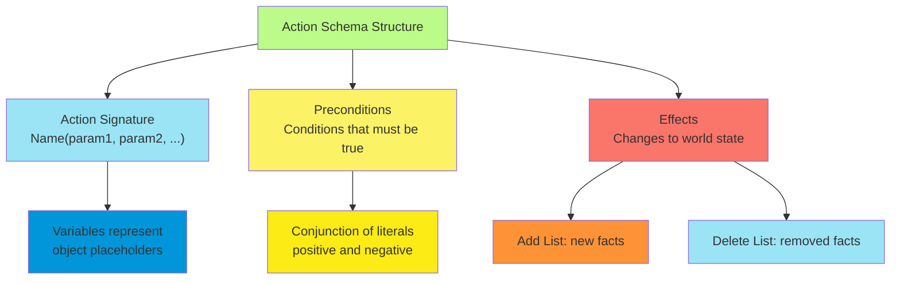

Consider the action of flying a plane from one airport to another. The schema captures the essential structure while
remaining general enough to apply to any plane and any pair of airports:

$$Action(Fly(p, from, to))$$ $$PRECOND: At(p, from) \land Plane(p) \land Airport(from) \land Airport(to)$$
$$EFFECT: \neg At(p, from) \land At(p, to)$$

The preconditions ensure logical consistency—we can only fly a plane that exists and is currently at the departure
airport. The effects capture the fundamental change: the plane is no longer at its origin and is now at its destination.

##### Problem Specification: Initial States and Goals

A complete planning problem specification requires three components: a domain description (the action schemas), an
initial state, and a goal specification. The initial state provides the starting point for planning, while the goal
describes the desired outcome.

Initial states in PDDL are typically specified as conjunctions of ground fluents. For example, in an air cargo domain:

$$Init: At(Cargo_1, SFO) \land At(Cargo_2, JFK) \land At(Plane_1, SFO) \land Plane(Plane_1) \land Cargo(Cargo_1)$$

Goals can be more flexible than states, allowing for partial specifications that focus only on the aspects of the world
state that matter for the planning objective. A goal might specify that certain cargo should reach specific destinations
without constraining other aspects of the final state:

$$Goal: At(Cargo_1, JFK) \land At(Cargo_2, SFO)$$

This flexibility is crucial for practical planning because it allows the planner to focus computational resources on
achieving what matters while ignoring irrelevant details.

##### Example Domains: Air Cargo, Spare Tire, Blocks World

The air cargo transportation domain provides an excellent illustration of classical planning principles. This domain
involves moving cargo between airports using aircraft, requiring coordination of loading, flying, and unloading
operations. The domain captures essential logistics challenges while remaining simple enough for pedagogical purposes.

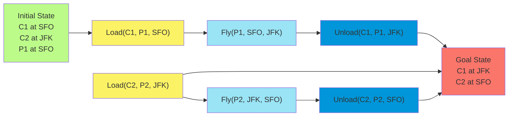

The spare tire domain offers a different perspective on planning challenges. Here, the goal is to replace a flat tire
with a spare, but the domain includes an interesting twist—leaving the car unattended overnight causes all tires to
disappear. This seemingly whimsical addition illustrates how planning domains can capture real-world uncertainties and
constraints.

The blocks world domain has become the quintessential planning benchmark. Despite its apparent simplicity—moving blocks
on a table—it captures fundamental challenges in planning such as goal ordering, resource conflicts, and the need for
intermediate states that don't directly contribute to the final goal.

The blocks world's enduring popularity stems from its ability to illustrate complex planning phenomena with minimal
cognitive overhead. Consider the challenge of building a tower where block A must be on block B, which must be on block
C. If the initial state has C on top of A, the planner must first move C to create space, even though this move doesn't
directly contribute to the final goal configuration.

#### Algorithms for Classical Planning

The diversity of approaches to classical planning reflects the field's rich theoretical foundations and practical
ambitions. Each algorithmic approach offers different trade-offs between computational efficiency, solution quality, and
implementation complexity. Understanding these approaches provides insight into the fundamental computational challenges
of planning and the creative solutions researchers have developed.

##### Forward State-Space Search (Progression Planning)

Forward state-space search, also known as progression planning, represents perhaps the most intuitive approach to
automated planning. This method mirrors human problem-solving by starting from the current situation and systematically
exploring sequences of actions that lead toward the goal.

The fundamental idea involves treating planning as a search problem in the space of world states. Each state represents
a complete description of the world at a particular point in time, and each action represents a transition between
states. The search algorithm explores this state space systematically, looking for a path from the initial state to any
goal state.

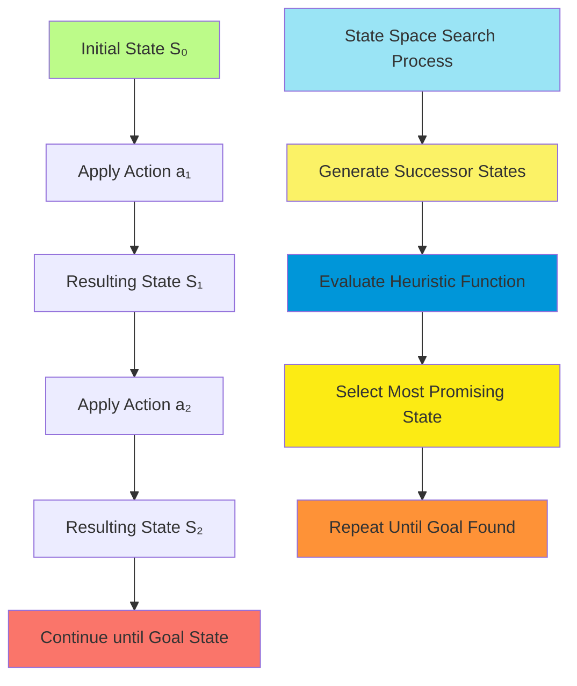

The mathematical formulation of forward search builds on the state transition function. Given a state $s$ and an
applicable action $a$, the result of executing $a$ in $s$ is computed using the action's effects:

$$RESULT(s, a) = (s \setminus DEL(a)) \cup ADD(a)$$

where $DEL(a)$ represents the delete list (fluents removed by the action) and $ADD(a)$ represents the add list (fluents
added by the action).

The challenge in forward search lies in the enormous size of the state space. Even modest domains can have millions or
billions of reachable states, making exhaustive search computationally intractable. This is where heuristic functions
become essential—they provide guidance about which states are most promising to explore.

Consider the air cargo domain with ten airports, fifty planes, and two hundred packages. The branching factor (number of
applicable actions in each state) can exceed ten thousand, while the solution length might be forty or more actions.
Without effective heuristics, the search space becomes unmanageably large.

The success of modern forward search planners like FF (FastForward) demonstrates that sophisticated heuristics can tame
this complexity. These systems can solve problems with thousands of objects and actions by focusing search on the most
promising regions of the state space.

##### Backward Search and Regression Analysis

Backward search, or regression planning, approaches the planning problem from the opposite direction. Instead of
starting from the initial state and working toward the goal, regression begins with the goal and works backward to find
a sequence of actions that could achieve it.

The key insight behind regression is that many planning problems have highly specific goals but very general initial
conditions. In such cases, working backward from the goal can dramatically reduce the search space by focusing only on
actions that could potentially contribute to achieving the objective.

The regression operation takes a goal description $g$ and an action $a$, producing a new goal description $g'$ that
represents what must have been true before executing $a$ in order for $g$ to hold afterward:

$$POS(g') = (POS(g) \setminus ADD(a)) \cup POS(Precond(a))$$
$$NEG(g') = (NEG(g) \setminus DEL(a)) \cup NEG(Precond(a))$$

where $POS(g')$ and $NEG(g')$ represent the positive and negative literals in the regressed goal, respectively.

The concept of relevant actions is crucial for regression search. An action is relevant to a goal if it has an effect
that unifies with one of the goal literals and doesn't negate any part of the goal. This relevance criterion
dramatically reduces the branching factor compared to forward search, particularly in domains with many available
actions.

Consider a goal of owning a specific book with ISBN 9780134610993. In forward search, we might need to consider billions
of possible purchase actions. In backward search, we immediately focus on the single relevant action of buying that
specific book, then regress to determine what conditions must hold to make that purchase possible.

##### Planning as Boolean Satisfiability (SATPLAN)

The SATPLAN approach represents a fundamentally different perspective on planning, transforming the sequential search
problem into a constraint satisfaction problem. This transformation leverages the considerable advances in Boolean
satisfiability (SAT) solving to tackle planning problems.

The key insight is that a planning problem can be encoded as a propositional logic formula whose satisfying assignments
correspond to valid plans. The encoding process involves several steps that transform the PDDL representation into
Boolean clauses.

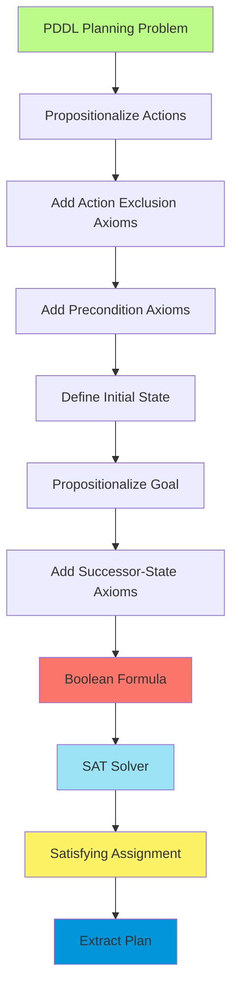

The propositionalizing step creates ground propositions for each action schema by substituting constants for variables.
For each time step $t$ and each possible ground action $A$, we create a proposition $A^t$ that is true if and only if
action $A$ is executed at time $t$.

Action exclusion axioms ensure that no two actions can occur simultaneously: $$\neg(A_i^t \land A_j^t)$$ for all
distinct actions $A_i$ and $A_j$ and all time steps $t$.

Precondition axioms capture the logical requirement that an action can only be executed if its preconditions are
satisfied: $$A^t \rightarrow PRE(A)^t$$

The successor-state axioms are perhaps the most sophisticated component of the encoding. For each fluent $F$ and time
step $t$, we need to specify when $F$ is true at time $t+1$:

$$F^{t+1} \leftrightarrow ActionCausesF^t \lor (F^t \land \neg ActionCausesNotF^t)$$

This axiom captures the frame problem solution—a fluent remains true unless something causes it to become false, and it
becomes true if something causes it to be true.

The elegance of the SATPLAN approach lies in its ability to leverage highly optimized SAT solvers that incorporate
decades of algorithmic improvements. Modern SAT solvers use sophisticated techniques like conflict-driven clause
learning and intelligent backtracking that can be far more efficient than traditional search methods for certain types
of planning problems.

##### Alternative Approaches: Graphplan and Partial-Order Planning

Graphplan introduced a revolutionary data structure called the planning graph that compactly represents relationships
between actions and propositions across multiple time steps. The planning graph alternates between proposition levels
(representing possible world states) and action levels (representing applicable actions).

The construction of a planning graph proceeds iteratively. Starting from the initial state, we determine which actions
are applicable and what effects they might have. This creates the first action level and the subsequent proposition
level. The process continues until either the goal is achieved or the graph reaches a fixed point where no new
information can be added.

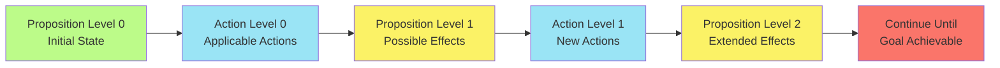

The planning graph captures important constraint information through mutex (mutual exclusion) relationships. Two actions
are mutex if they interfere with each other—for example, if one action deletes a precondition of the other. Two
propositions are mutex if all ways of achieving them are mutex.

Partial-order planning takes a fundamentally different approach by representing plans as partially ordered sets of
actions rather than linear sequences. This representation naturally captures the independence relationships between
actions, avoiding the artificial sequencing constraints imposed by total-order planners.

The elegance of partial-order planning lies in its commitment strategy. Rather than making arbitrary ordering decisions
early in the search process, partial-order planners defer such commitments until they become necessary to resolve
conflicts. This lazy commitment strategy can dramatically reduce the search space for problems with significant
parallelism.

A partial-order plan consists of a set of actions, a set of ordering constraints, and a set of causal links. Causal
links explicitly represent the producer-consumer relationships between actions, making the plan's logic structure
transparent. When action $A$ produces a condition needed by action $B$, we establish both a causal link and an ordering
constraint ensuring $A$ occurs before $B$.

#### Heuristics for Planning

The exponential nature of planning problems makes heuristic guidance essential for practical planning systems. Unlike
domain-specific heuristics that require human expertise for each new application, domain-independent heuristics can be
derived automatically from the problem representation itself. This capability represents one of the most significant
advantages of factored planning representations over atomic state spaces.

##### Domain-Independent Heuristic Functions

The development of effective domain-independent heuristics has been one of the most significant advances in automated
planning. These heuristics exploit the structure inherent in factored representations to provide guidance without
requiring domain-specific knowledge.

The fundamental principle underlying domain-independent heuristics is the creation of relaxed problems that are easier
to solve than the original. By removing certain constraints or restrictions, we create simplified versions of the
planning problem whose optimal solutions provide admissible heuristic estimates for the original problem.

Consider the relationship between the original planning problem and its relaxations. If $P$ is the original problem and
$P'$ is a relaxation where every solution to $P$ is also a solution to $P'$, then the optimal cost of solving $P'$
provides an admissible heuristic for $P$:

$$h^*(P) \geq h^*(P')$$

where $h^*(P)$ represents the optimal cost of solving problem $P$.

The challenge lies in finding relaxations that are both easy to solve and provide tight bounds on the original problem's
complexity. Too much relaxation produces trivial heuristics that provide little guidance, while too little relaxation
fails to achieve the computational savings necessary for practical application.

##### Ignore-Preconditions and Ignore-Delete-Lists Heuristics

The ignore-preconditions heuristic represents one of the simplest yet most effective approaches to heuristic generation.
This heuristic creates a relaxed problem by removing all preconditions from actions, making every action applicable in
every state.

Under this relaxation, any goal fluent can be achieved in a single step (assuming some action adds it). This observation
leads to a natural heuristic: count the number of unsatisfied goal fluents. However, this simple counting approach
ignores two important considerations: some actions might achieve multiple goals simultaneously, and some actions might
undo the effects of others.

A more sophisticated version addresses the first consideration by formulating the relaxed planning problem as a set
cover problem. We want to find the minimum number of actions whose combined effects cover all goal fluents:

$$\min \sum_{a \in Actions} x_a$$

subject to: $$\sum_{a: f \in ADD(a)} x_a \geq 1 \quad \forall f \in Goals$$
$$x_a \in {0, 1} \quad \forall a \in Actions$$

where $x_a = 1$ if action $a$ is selected and $0$ otherwise.

The ignore-delete-lists heuristic addresses the second consideration by removing all negative effects from actions. This
relaxation ensures that progress toward goals can never be undone—once a fluent becomes true, it remains true throughout
the rest of the plan.

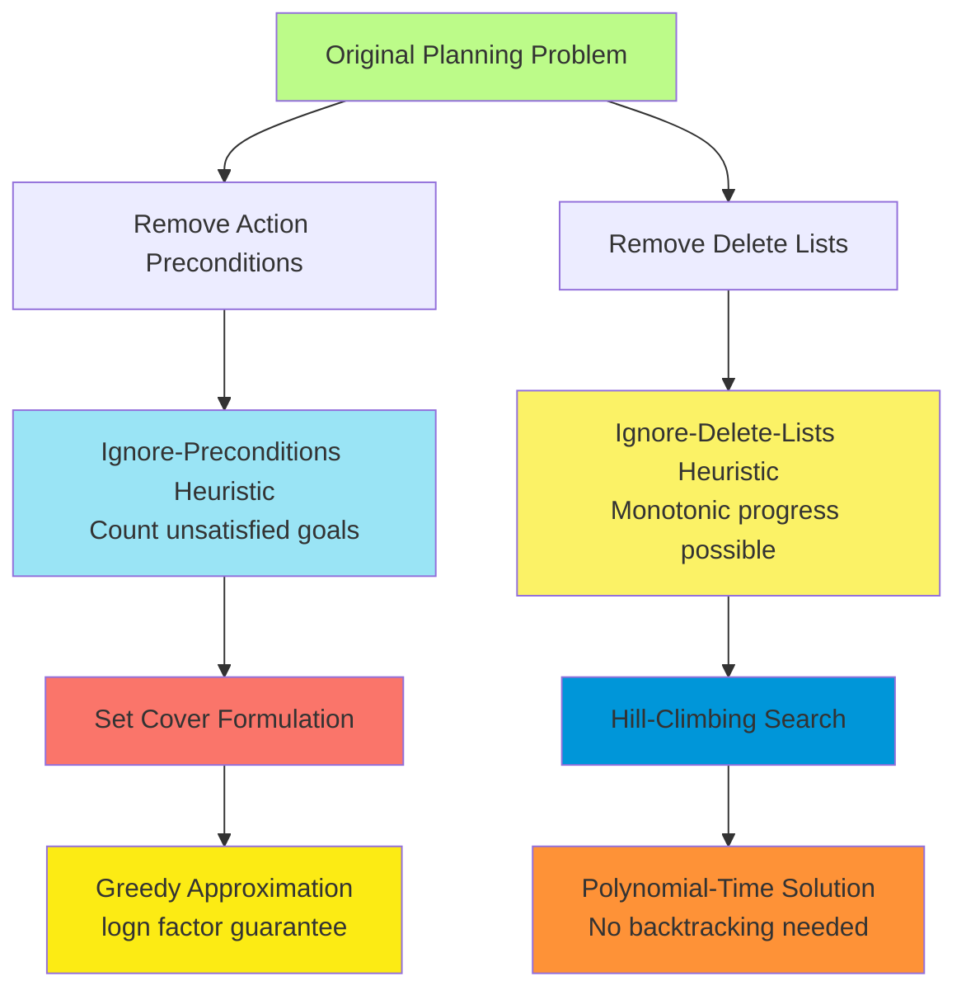

The ignore-delete-lists heuristic creates planning problems where simple hill-climbing search suffices. Since no action
can undo progress, we can greedily select actions that make the most progress toward the goal without fear of future
complications. This property makes the heuristic particularly attractive for implementation.

The mathematical foundation of the ignore-delete-lists heuristic rests on the concept of monotonic progress. In the
relaxed problem, the set of true fluents can only grow over time:

$$Fluents_{true}(t) \subseteq Fluents_{true}(t+1)$$

This monotonicity property eliminates the need for backtracking in the relaxed problem, making it solvable in polynomial
time despite the original problem's PSPACE-completeness.

##### Set-Cover Problem Formulation for Goal Achievement

The connection between planning and set cover reveals deep structural insights about the heuristic estimation problem.
When we remove preconditions and delete lists from actions, the planning problem reduces to finding the minimum number
of actions whose effects cover all goal fluents.

This reduction transforms a complex sequential decision problem into a well-studied combinatorial optimization problem.
The set cover formulation provides both theoretical guarantees and practical algorithms for heuristic computation.

The greedy algorithm for set cover provides an approximation guarantee: the solution cost is at most $\ln(n)$ times the
optimal cost, where $n$ is the number of goal fluents. While this approximation factor might seem large, it often
provides reasonable guidance in practice because planning problems typically have modest numbers of goal fluents.

The greedy algorithm iteratively selects the action that covers the most uncovered goal fluents:

1. Initialize $Uncovered = Goals$ and $SelectedActions = \emptyset$
2. While $Uncovered \neq \emptyset$:
    - Select action $a$ that maximizes $|ADD(a) \cap Uncovered|$
    - Add $a$ to $SelectedActions$
    - Remove $ADD(a)$ from $Uncovered$
3. Return $|SelectedActions|$

This algorithm runs in polynomial time and provides the logarithmic approximation guarantee, making it practical for
heuristic computation during search.

##### State Abstraction and Pattern Database Construction

State abstraction represents a powerful technique for creating heuristic functions by mapping the original state space
to a smaller abstract space. The key insight is that solving planning problems in abstract spaces often provides good
lower bounds on the cost of solving the original problem.

The most common form of abstraction involves projecting the state space onto a subset of the fluents. For example, in
the blocks world, we might abstract by considering only the positions of a few important blocks while ignoring others.
This projection creates an abstract state space that is exponentially smaller than the original.

Pattern databases extend this idea by precomputing optimal solutions for all abstract states. During search, we can
perform constant-time lookups to obtain heuristic estimates. The preprocessing cost is amortized over multiple problem
instances that share the same domain structure.

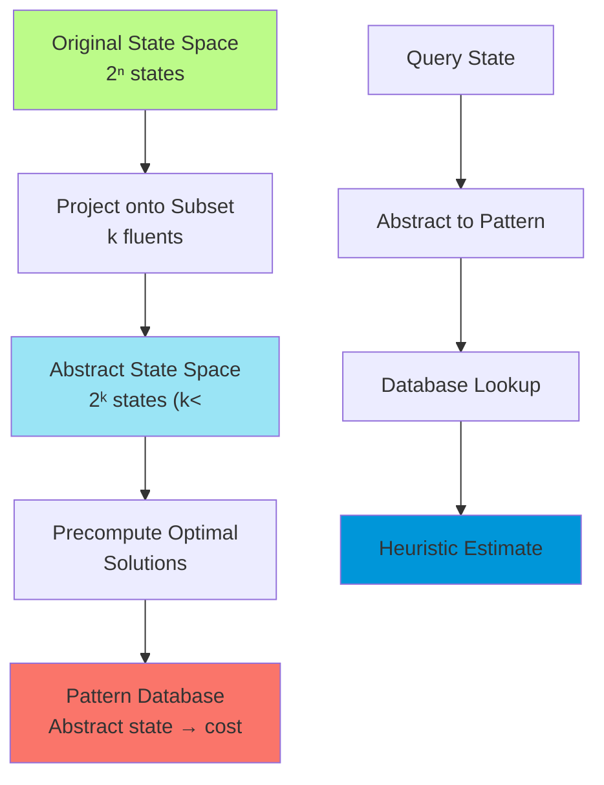

The mathematical foundation of pattern database heuristics relies on the abstraction property. If $\phi$ is an
abstraction mapping from concrete states to abstract states, then for any concrete state $s$:

$$h^*(s) \geq h^*(\phi(s))$$

This inequality holds because any solution in the concrete space corresponds to a solution in the abstract space, but
not vice versa. The abstract space may have solutions that are impossible in the concrete space due to ignored
constraints.

The challenge in pattern database construction lies in selecting appropriate abstractions. The abstraction should be
small enough for exhaustive precomputation but large enough to provide meaningful guidance. This trade-off often
requires domain-specific insights or automated abstraction selection methods.

##### Symmetry Reduction and Preferred Action Pruning

Many planning domains exhibit significant symmetry—configurations that are essentially equivalent from a planning
perspective. Recognizing and exploiting these symmetries can dramatically reduce the search space without sacrificing
solution quality.

Consider the blocks world with a dozen blocks on a table, where the goal requires building a three-block tower with
specific blocks. The first step might involve placing any block on any other block (excluding the specific blocks
mentioned in the goal). There might be 110 such possibilities, but they are all symmetric—choosing one over another
makes no fundamental difference to the solution structure.

Symmetry reduction techniques automatically identify these equivalent choices and explore only one representative from
each equivalence class. This pruning can reduce the search space by orders of magnitude while maintaining completeness
guarantees.

The mathematical formalization involves defining equivalence relations on states and actions. Two states $s_1$ and $s_2$
are symmetric if there exists a bijection $\sigma$ on objects such that applying $\sigma$ to $s_1$ yields $s_2$, and the
goal is invariant under $\sigma$.

Preferred action techniques provide another form of search space pruning. The idea is to identify actions that are
likely to be part of good solutions and give them priority during search. These preferences can be derived from the
solution to relaxed problems or from domain-independent patterns.

For example, if a relaxed planning problem suggests that action $A$ should be executed, then $A$ becomes a preferred
action in the original search. Similarly, actions that achieve preconditions of preferred actions also receive
preference, creating a propagation effect that guides search toward promising regions.

#### Hierarchical Planning

Real-world planning problems often involve reasoning at multiple levels of abstraction simultaneously. Consider planning
a vacation to Hawaii: you might begin with high-level decisions about flights and accommodations, then progressively
refine these into specific actions like choosing seats and arranging ground transportation. This natural hierarchical
structure of human planning has inspired sophisticated computational approaches that can handle problems far beyond the
reach of classical planning methods.

Hierarchical planning addresses one of the fundamental limitations of classical approaches: the exponential explosion
that occurs when planning problems involve many actions or long solution sequences. By organizing actions into
hierarchical structures, we can often reduce exponential complexity to polynomial or even linear complexity in the best
cases.

##### High-Level Actions (HLAs) and Refinement Structures

High-level actions provide the fundamental abstraction mechanism for hierarchical planning. Unlike primitive actions
that directly change the world state, HLAs represent complex behaviors that can be implemented in multiple ways through
sequences of lower-level actions.

The power of HLAs lies in their ability to encapsulate domain knowledge about how complex tasks are typically
accomplished. Consider the HLA "Go to San Francisco Airport" which might have refinements involving driving personal
vehicles, taking ride-sharing services, or using public transportation. Each refinement represents a different
implementation strategy, but all achieve the same high-level objective.

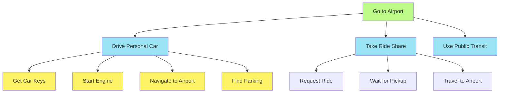

The mathematical formalization of HLAs involves defining refinement relationships. An HLA $h$ has a set of possible
refinements $R(h) = {r_1, r_2, \ldots, r_k}$, where each refinement $r_i$ is a sequence of actions that can be either
HLAs or primitive actions.

The key insight is that HLAs represent angelic choice points—the planning agent gets to choose which refinement to use
when executing the HLA. This contrasts with nondeterministic actions where an adversarial environment chooses the
outcome. The mathematical distinction is crucial:

For nondeterministic actions: A plan succeeds if it works for **all** possible outcomes For HLAs: A plan succeeds if it
works for **some** choice of refinements

This distinction allows hierarchical planners to be much more optimistic when reasoning about HLAs, leading to more
efficient search algorithms.

##### Hierarchical Task Networks (HTN) Framework

The Hierarchical Task Network framework provides a systematic approach to hierarchical planning that has found
widespread application in real-world systems. HTN planning views the planning problem as one of decomposing a high-level
task into a network of subtasks, continuing recursively until all tasks are primitive actions.

The HTN approach typically begins with a single root task called "Act" that represents the overall planning objective.
The planning process involves repeatedly selecting non-primitive tasks in the current task network and replacing them
with their refinements, continuing until all tasks are primitive and the resulting sequence achieves the goal.

The elegance of HTN planning lies in its ability to incorporate rich domain knowledge through the task hierarchy. Expert
knowledge about how complex operations are typically performed can be encoded in the refinement structures, allowing the
planner to leverage human expertise while maintaining systematic search procedures.

Consider a manufacturing domain where the high-level task "Assemble Product" might be refined into subtasks like
"Prepare Components," "Execute Assembly Sequence," and "Quality Check." Each of these subtasks can be further refined
based on the specific product type and available resources.

The computational advantages of HTN planning can be dramatic. In the best case, where the hierarchy provides strong
guidance about task decomposition, the search complexity can drop from exponential in the solution length to linear.
This improvement stems from the hierarchy's ability to eliminate large portions of the search space that are
inconsistent with expert knowledge about task structure.

##### Searching for Primitive vs Abstract Solutions

HTN planning systems face a fundamental choice between two search strategies: searching for primitive solutions that
fully specify all action details, or searching for abstract solutions that reason directly about HLAs without
considering their implementations.

The primitive solution approach follows the principle of "plan first, then refine." The planner searches through the
space of task networks, replacing HLAs with their refinements until a complete primitive solution is found. This
approach ensures that any solution found is immediately executable, but it may require considering many refinement
possibilities before finding a working combination.

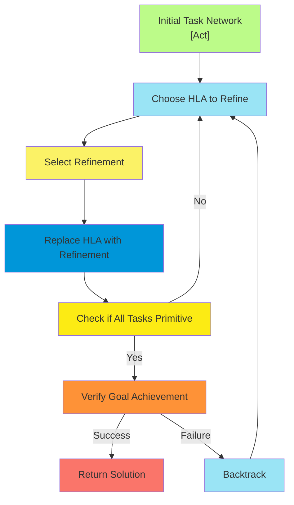

The abstract solution approach takes a different perspective, attempting to reason about HLAs directly without
considering their specific implementations. This approach can be much more efficient when it works, but it requires
sophisticated methods for representing and reasoning about the effects of HLAs that might have multiple implementations.

The key challenge in abstract solution search is determining what effects an HLA will have when its implementation is
chosen optimally. This requires moving beyond simple precondition-effect descriptions toward more sophisticated
representations that capture the range of possible outcomes.

##### Angelic Semantics and Reachable Set Analysis

Angelic semantics provides the theoretical foundation for reasoning about HLAs with multiple implementations. The core
insight is that an HLA with multiple refinements is more "powerful" than any single refinement because the agent can
choose which implementation to use when executing the plan.

The mathematical formalization centers on the concept of reachable sets. Given a state $s$ and an HLA $h$, the reachable
set $REACH(s, h)$ represents all states that could be reached by executing some implementation of $h$ starting from $s$:

$$REACH(s, h) = \bigcup_{r \in R(h)} REACH(s, r)$$

where $R(h)$ is the set of possible refinements for HLA $h$.

This definition extends naturally to sequences of HLAs. For a sequence $[h_1, h_2]$, the reachable set is:

$$REACH(s, [h_1, h_2]) = \bigcup_{s' \in REACH(s, h_1)} REACH(s', h_2)$$

The crucial property of angelic semantics is that a high-level plan achieves the goal if its reachable set intersects
the set of goal states. This is much weaker than the requirement for nondeterministic actions, where every reachable
state must satisfy the goal.

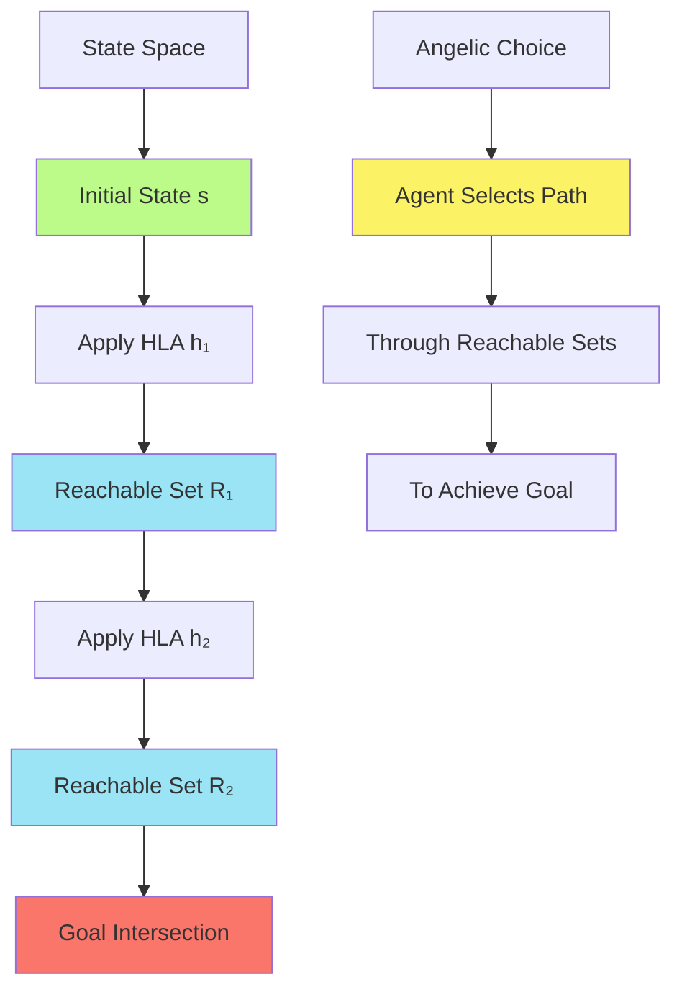

The practical challenge lies in computing or approximating reachable sets efficiently. Exact computation is often
intractable, leading to the development of optimistic and pessimistic approximations:

$$REACH^-(s, h) \subseteq REACH(s, h) \subseteq REACH^+(s, h)$$

The optimistic approximation $REACH^+(s, h)$ overstates what the HLA can achieve, while the pessimistic approximation
$REACH^-(s, h)$ understates it. These approximations enable efficient reasoning about plan feasibility:

- If $REACH^+(s, plan) \cap Goals = \emptyset$, the plan definitely fails
- If $REACH^-(s, plan) \cap Goals \neq \emptyset$, the plan definitely succeeds
- Otherwise, further refinement is needed to determine feasibility

##### Downward Refinement Property and Plan Libraries

The downward refinement property ensures that hierarchical planning systems maintain correctness when reasoning at
abstract levels. This property states that any high-level plan that appears to achieve the goal (based on HLA
descriptions) must have at least one implementation that actually does achieve the goal.

Formally, if a high-level plan $\pi$ consisting of HLAs appears to transform initial state $s_0$ to a goal state
according to the HLA descriptions, then there exists a sequence of refinement choices such that the resulting primitive
plan actually achieves the goal when executed from $s_0$.

This property is not automatically satisfied—it depends critically on how HLA effects are described. The challenge lies
in writing HLA descriptions that are both useful for abstract reasoning and guaranteed to satisfy the downward
refinement property.

For HLAs with single implementations, the downward refinement property is easy to ensure: simply compute the HLA's
preconditions and effects from its implementation. The challenge arises with multiple implementations that might have
different preconditions and effects.

One conservative approach defines an HLA's effects as the intersection of effects guaranteed by all implementations.
While this ensures correctness, it often produces overly conservative descriptions that provide little guidance for
abstract planning.

Plan libraries represent the knowledge engineering aspect of hierarchical planning. A well-designed plan library
captures expert knowledge about how complex tasks are typically decomposed and implemented. The library serves as both a
repository of proven solution strategies and a constraint on the search space.

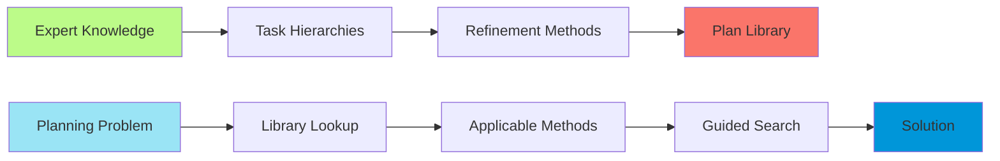

The construction of effective plan libraries requires careful balance between generality and specificity. Overly general
methods provide little guidance, while overly specific methods fail to transfer across problem instances. The most
effective libraries often evolve through iterative refinement based on experience with multiple problem instances.

Learning mechanisms can automatically acquire new methods by generalizing from successful solution experiences. When a
planner constructs a solution from scratch, it can extract the essential structure and store it as a new method for
future use. This capability allows planning systems to become more competent over time.

#### Planning and Acting in Nondeterministic Domains

Real-world environments rarely conform to the idealized assumptions of classical planning. Actions may have uncertain
outcomes, sensors may provide incomplete information, and unexpected events may disrupt carefully laid plans. Planning
systems must therefore be capable of reasoning about uncertainty and adapting to unexpected circumstances.

The transition from classical to nondeterministic planning involves fundamental changes in both representation and
reasoning. Rather than dealing with single states, we must reason about sets of possible states. Rather than
deterministic action outcomes, we must consider multiple possible results. And rather than assuming complete
information, we must plan with partial knowledge about the world.

##### Sensorless (Conformant) Planning Strategies

Sensorless planning, also known as conformant planning, addresses scenarios where the agent has no sensors to observe
the world during execution. Despite this severe limitation, conformant planning can solve many practical problems by
constructing plans that work regardless of the specific initial conditions or action outcomes within the expected range.

The key insight behind conformant planning is that many planning problems have solutions that succeed across a range of
possible initial states and action outcomes. Consider painting two pieces of furniture to match colors: even without
knowing the initial colors, we can paint both pieces with the same color paint to guarantee they match.

The mathematical foundation of conformant planning builds on belief state representations. A belief state $b$ represents
the set of possible world states the agent considers possible given its knowledge and observations. The initial belief
state $b_0$ captures the agent's initial uncertainty about the world.

For the painting problem, the initial belief state might be represented as: $$b_0 = \text{Color}(x, C(x))$$

This formula uses Skolem functions to represent the fact that each object has some color, but the specific colors are
unknown. The closed-world assumption is replaced by an open-world assumption where unknown facts are truly unknown
rather than assumed false.

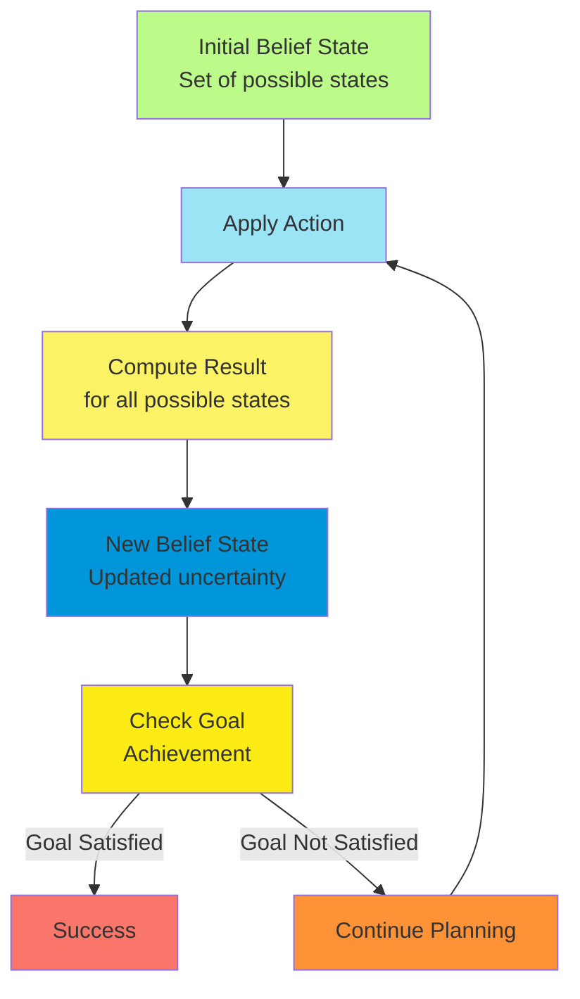

The belief state update operation extends the classical state transition function to handle sets of states. Given a
belief state $b$ and action $a$, the resulting belief state is:

$$b' = RESULT(b, a) = {s' : s' = RESULT_P(s, a) \text{ and } s \in b}$$

where $RESULT_P$ represents the physical state transition function.

For actions represented in PDDL with unconditional effects, the belief state update simplifies to:
$$b' = (b \setminus DEL(a)) \cup ADD(a)$$

This remarkable result shows that belief states represented as conjunctions of literals remain in the same
representational class under action application. This closure property is crucial for computational efficiency.

The complexity challenges arise when actions have conditional effects that depend on the current state. Such effects can
introduce dependencies between fluents that break the simple conjunctive representation, potentially leading to
exponentially large belief states.

##### Contingent Planning for Partially Observable Environments

Contingent planning extends conformant planning by allowing the agent to gather information through sensing actions
during plan execution. This capability enables much more flexible and efficient solutions by allowing the plan to adapt
based on observed conditions.

The fundamental difference lies in the plan representation. While conformant plans are linear sequences of actions,
contingent plans are tree-structured or graph-structured, with branching points corresponding to possible sensor
outcomes.

A contingent plan can be represented formally as:

- Linear action sequences: $[a_1, a_2, \ldots, a_n]$
- Conditional branches: $\text{if } condition \text{ then } plan_1 \text{ else } plan_2$
- Sensor actions: actions that update the belief state based on observations

Consider the painting problem with sensing capabilities. A contingent plan might look like:

```
[LookAt(Table), LookAt(Chair),
 if Color(Table,c) ∧ Color(Chair,c) then NoOp
 else [RemoveLid(Can1), LookAt(Can1),
       if Color(Table,c) ∧ Color(Can1,c) then Paint(Chair,Can1)
       else Paint(Chair,Can1), Paint(Table,Can1)]]
```

The belief state update for contingent planning involves two phases corresponding to action execution and observation
processing. The action phase follows the conformant planning update: $$\hat{b} = (b \setminus DEL(a)) \cup ADD(a)$$

The observation phase incorporates sensory information. If percepts $p_1, \ldots, p_k$ are received, they are added to
the belief state along with the conditions that enabled sensing:
$$b' = \hat{b} \cup {p_1, \ldots, p_k} \cup {preconditions}$$

The challenge arises when multiple percept schemas could explain the same observation, leading to disjunctive belief
states that complicate representation and reasoning.

##### Belief State Representations and Progression

The choice of belief state representation fundamentally impacts the efficiency and capabilities of planning under
uncertainty. The ideal representation should be compact, support efficient updates, and enable effective reasoning about
goal achievement and action applicability.

The conjunctive representation (1-CNF) works well for many problems and supports polynomial-time updates and queries.
However, it cannot represent all belief states that arise in practice, particularly those involving conditional effects
or complex sensor models.

More general representations include:

- **Disjunctive Normal Form (DNF)**: Can represent arbitrary belief states but may require exponential space
- **Binary Decision Diagrams (BDDs)**: Provide compact representations for many structured belief states
- **Propositional formulas**: Most general but may require satisfiability solving for queries

The choice often involves trade-offs between representational power and computational efficiency. Systems like HSCP use
BDDs to balance these concerns, while others use lazy evaluation to avoid computing full belief states explicitly.

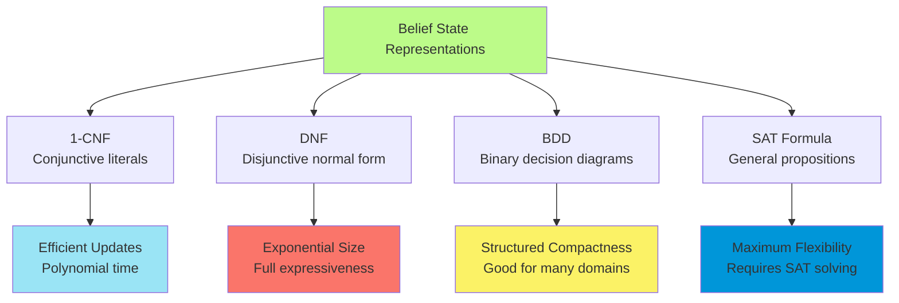

##### Online Planning with Execution Monitoring

Online planning systems interleave planning and execution, adapting their behavior based on observed outcomes and
changing circumstances. This approach acknowledges that complete planning in advance is often impossible or inefficient,
particularly in dynamic environments where conditions change rapidly.

The core components of online planning include:

- **Execution monitoring**: Detecting when plans fail or conditions change
- **Replanning**: Generating new plans when necessary
- **Plan repair**: Modifying existing plans to address failures

Execution monitoring can operate at different levels of granularity:

**Action Monitoring**: Verify that action preconditions hold before execution
$$\text{Execute}(a) \text{ only if } b \models PRECOND(a)$$

**Plan Monitoring**: Verify that the remaining plan can still succeed
$$\text{Continue plan } \pi \text{ only if } REACH(b, \pi) \cap Goals \neq \emptyset$$

**Goal Monitoring**: Check for opportunities to achieve better goals
$$\text{Consider new goals } G' \text{ if } \text{Cost}(G') < \text{Cost}(G)$$

The replanning process must balance computational efficiency with solution quality. Aggressive replanning can waste
computational resources on minor environmental changes, while conservative approaches may miss opportunities for
significant improvements.

Plan repair techniques attempt to modify existing plans minimally to address failures. The typical approach involves
finding a "repair point" in the original plan where the agent can reconnect after addressing the failure:

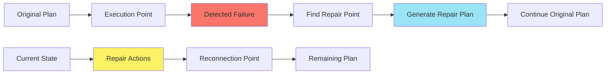

#### Time, Schedules, and Resources

Classical planning abstracts away temporal and resource considerations, focusing solely on the logical prerequisites and
effects of actions. However, real-world applications invariably involve time constraints, limited resources, and
scheduling considerations that can dominate the planning complexity.

The integration of temporal and resource reasoning with classical planning creates rich problem formulations that more
accurately capture practical planning challenges. Manufacturing systems must coordinate machine utilization, healthcare
systems must schedule staff and equipment, and logistics systems must optimize delivery routes within time windows.

##### Temporal Constraint Representation in Planning

Temporal planning extends classical planning by associating durations with actions and reasoning about when actions
occur, not just their ordering. This extension requires new representational mechanisms and algorithmic approaches that
can handle the continuous nature of time while maintaining computational tractability.

Actions in temporal planning have durations, which can be fixed constants or variables constrained by domain conditions.
The temporal extent of an action is represented by its start time $t_s$ and end time $t_e$, with duration
$d = t_e - t_s$.

The temporal constraint network captures relationships between action times. Basic temporal constraints include:

- **Precedence**: Action $A$ must complete before action $B$ starts: $t_{e,A} \leq t_{s,B}$
- **Simultaneity**: Actions must start together: $t_{s,A} = t_{s,B}$
- **Bounded delay**: Action $B$ must start within time window after $A$:
  $t_{s,A} + d_{min} \leq t_{s,B} \leq t_{s,A} + d_{max}$

More complex constraints can express resource availability windows, deadline requirements, and synchronization needs
across multiple actions.

##### Job-Shop Scheduling Problem Formulation

The job-shop scheduling problem provides a canonical framework for understanding resource-constrained temporal planning.
In this formulation, we have a set of jobs, each consisting of a sequence of operations that must be performed in a
specific order using designated resources.

Formally, a job-shop scheduling problem consists of:

- **Jobs**: $J = {J_1, J_2, \ldots, J_n}$, each with a sequence of operations
- **Resources**: $R = {R_1, R_2, \ldots, R_m}$, each with limited capacity
- **Operations**: Each operation has duration, resource requirements, and precedence constraints

The mathematical formulation involves decision variables for operation start times:
$$t_{i,j} = \text{start time of operation } j \text{ in job } i$$

Subject to constraints:

- **Precedence within jobs**: $t_{i,j} + d_{i,j} \leq t_{i,j+1}$
- **Resource capacity**: $\sum_{(i,j): \text{uses } R_k} x_{i,j,t} \leq \text{capacity}(R_k)$
- **Non-negative times**: $t_{i,j} \geq 0$

where $x_{i,j,t}$ is a binary variable indicating whether operation $(i,j)$ is active at time $t$.

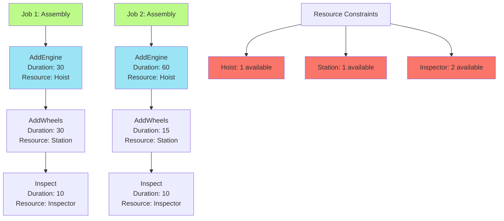

##### Critical Path Method and Makespan Optimization

The Critical Path Method (CPM) provides a fundamental algorithm for temporal planning when resource constraints are
ignored. CPM computes the earliest and latest possible start times for each action, identifying the critical path that
determines the overall project duration.

For each action $A$, CPM computes:

- **Earliest Start Time (ES)**: $ES(A) = \max_{B \prec A} (ES(B) + \text{Duration}(B))$
- **Latest Start Time (LS)**: $LS(A) = \min_{C \succ A} (LS(C) - \text{Duration}(A))$
- **Slack**: $\text{Slack}(A) = LS(A) - ES(A)$

Actions with zero slack lie on the critical path and cannot be delayed without extending the overall project duration.
The critical path identifies the bottleneck sequence that determines the minimum possible completion time.

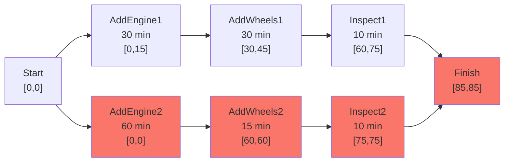

The complexity of CPM is $O(V + E)$ where $V$ is the number of actions and $E$ is the number of precedence constraints.
This linear complexity makes CPM extremely efficient for problems without resource constraints.

When resource constraints are introduced, the problem becomes NP-hard because action scheduling decisions become
interdependent. The "cannot overlap" constraint between actions requiring the same resource introduces disjunctive
constraints that complicate the mathematical structure.

##### Resource Management: Consumable vs Reusable Resources

Resource modeling distinguishes between fundamentally different types of constraints:

**Consumable Resources**: Used up during action execution and not available afterward

- Examples: raw materials, fuel, money
- Constraint: $\sum \text{consumption} \leq \text{available supply}$
- Representation: $CONSUME(action, resource, quantity)$

**Reusable Resources**: Occupied during action execution but available afterward

- Examples: machines, personnel, tools
- Constraint: $\sum \text{concurrent usage} \leq \text{capacity}$
- Representation: $USE(action, resource, quantity)$

The mathematical formulation requires different constraint types for each resource category. Consumable resources
involve cumulative constraints over the entire time horizon, while reusable resources involve capacity constraints at
each time point.

For reusable resources, the constraint at time $t$ is:
$$\sum_{a: t \in [start(a), end(a)]} \text{usage}(a, r) \leq \text{capacity}(r)$$

For consumable resources, the constraint over the entire horizon is:
$$\sum_{a} \text{consumption}(a, r) \leq \text{supply}(r)$$

Resource aggregation techniques group individual resource instances into quantities when the instances are
indistinguishable. Rather than reasoning about individual inspectors $I_1, I_2, \ldots$, we can reason about the
aggregate quantity $\text{Inspectors}(n)$. This aggregation dramatically reduces the combinatorial complexity of
resource allocation decisions.

##### Integration of Planning and Scheduling Algorithms

The integration of planning and scheduling can follow several architectural patterns:

**Sequential Approach**: Plan first, then schedule

1. Generate a partially ordered plan ignoring resource constraints
2. Add temporal information and resource allocation
3. Resolve resource conflicts through rescheduling

**Interleaved Approach**: Alternate between planning and scheduling

1. Make partial planning decisions
2. Check resource feasibility
3. Backtrack if conflicts arise
4. Continue until complete solution found

**Unified Approach**: Simultaneous planning and scheduling

1. Search space includes both action selection and timing decisions
2. Constraints from both planning and scheduling guide search
3. More complex but potentially more effective

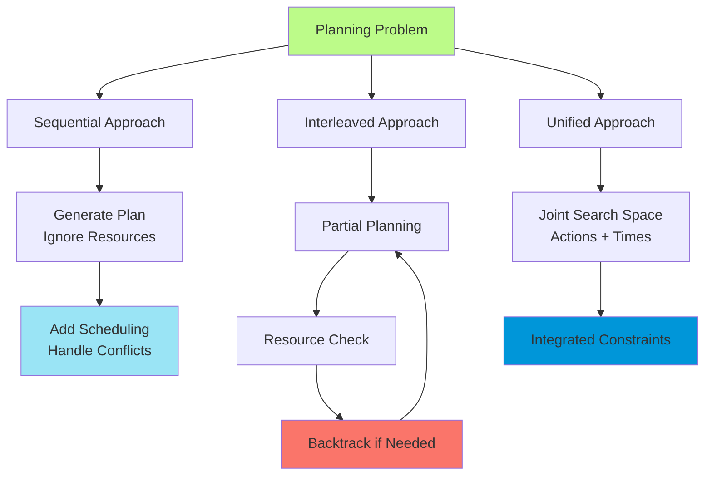

#### Analysis of Planning Approaches

The evolution of automated planning has produced a rich ecosystem of algorithms, representations, and techniques.
Understanding the relative strengths and limitations of different approaches provides crucial insight for selecting
appropriate methods for specific applications and for identifying promising directions for future research.

##### Computational Complexity of Planning Problems

The theoretical complexity of planning problems provides important bounds on what we can expect from any planning
algorithm. Classical planning problems are PSPACE-complete, meaning they belong to a complexity class that is believed
to be strictly harder than NP-complete problems.

The PSPACE-completeness result has several important implications:

- No polynomial-time algorithm exists for planning (unless P = PSPACE)
- Planning problems can require exponential time in the worst case
- Space-efficient algorithms may still require exponential time
- Approximation algorithms cannot guarantee constant-factor approximations

However, these worst-case complexity results don't necessarily reflect the difficulty of practical planning problems.
Many real-world domains have special structure that can be exploited by appropriate algorithms.

The complexity landscape changes significantly when we consider restricted classes of planning problems:

**Polynomially Solvable Classes**:

- Planning with serializable subgoals
- Planning with a fixed number of goal fluents
- Planning where all actions are reversible

**Exponentially Hard Classes**:

- Planning with conditional effects
- Planning with partial observability
- Multi-agent planning with communication

Understanding these complexity boundaries helps explain why certain algorithmic approaches work well for some domains
but poorly for others.

##### Comparative Algorithm Performance

Empirical evaluation reveals that no single planning approach dominates across all domains and problem instances. The
performance landscape is complex, with different algorithms excelling in different circumstances:

**State-Space Search**: Excels when good heuristics are available and branching factors are manageable

- Strengths: Conceptual simplicity, good heuristic guidance
- Weaknesses: Exponential space requirements, sensitivity to heuristic quality

**SATPLAN**: Performs well on problems with complex logical structure and moderate time horizons

- Strengths: Leverages powerful SAT solver technology, handles complex constraints
- Weaknesses: Grounding explosion with many objects, difficulty with long plans

**Hierarchical Planning**: Dominates on problems with natural task structure and expert knowledge

- Strengths: Exponential complexity reduction, incorporation of domain knowledge
- Weaknesses: Requires careful hierarchy design, limited to structured domains

**Partial-Order Planning**: Effective for problems with significant parallelism and few ordering constraints

- Strengths: Natural handling of concurrent actions, flexible plan structures
- Weaknesses: Complex search space, superseded by modern approaches

The International Planning Competition has provided valuable benchmark data showing how different approaches perform
across standardized problem sets. Key insights include:

- Forward search with sophisticated heuristics consistently performs well
- Portfolio approaches that combine multiple algorithms often outperform individual methods
- Domain-specific optimizations can provide orders of magnitude improvements

##### Portfolio Planning and Algorithm Selection

Portfolio planning systems maintain collections of different planning algorithms and intelligently select which
algorithm(s) to apply to each problem instance. This approach acknowledges that no single algorithm excels across all
problem types while leveraging the complementary strengths of different methods.

The portfolio approach can be implemented in several ways:

- **Sequential**: Try algorithms in priority order until one succeeds
- **Parallel**: Run multiple algorithms simultaneously and take the first solution
- **Adaptive**: Use machine learning to predict the best algorithm for each problem

Algorithm selection techniques use problem features to predict which algorithms are likely to perform well:

- **Syntactic features**: Number of actions, objects, goal conditions
- **Structural features**: Graph connectivity, symmetry measures
- **Dynamic features**: Search space characteristics discovered during initial exploration

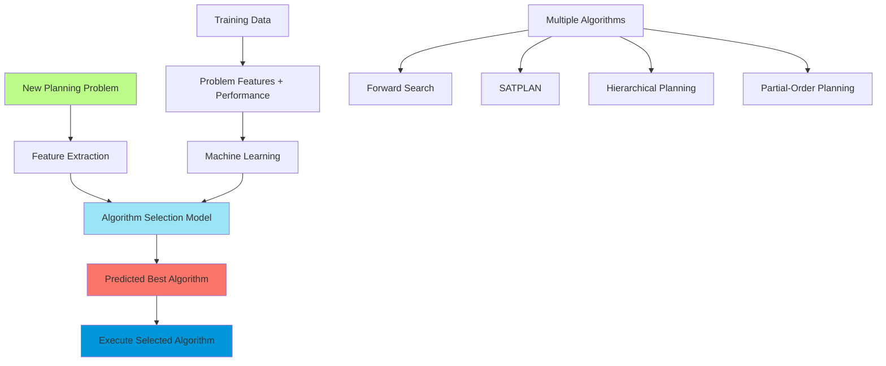

Recent portfolio systems like Fast Downward Stone Soup have demonstrated significant performance improvements by
combining the strengths of multiple planning approaches. These systems represent a maturation of the field, moving
beyond competition between individual algorithms toward collaborative approaches that leverage diverse techniques.

##### Real-World Applications and Industrial Deployment

The practical impact of planning research is demonstrated through numerous successful industrial applications spanning
diverse domains:

**Space Applications**:

- Remote Agent controlled NASA's Deep Space One spacecraft
- Timeline-based planning for Mars rover operations
- Satellite observation scheduling for Hubble Space Telescope

**Manufacturing**:

- O-PLAN generated production schedules for Hitachi assembly lines
- Job-shop scheduling for automotive manufacturing
- Supply chain optimization for global logistics

**Healthcare**:

- Staff scheduling in hospitals and clinics
- Treatment planning for radiation therapy
- Resource allocation in emergency response

These applications share several common characteristics that have enabled successful deployment:

- Well-defined domains with clear objectives
- Availability of domain expertise for knowledge engineering
- Tolerance for suboptimal solutions with acceptable quality bounds
- Integration with existing enterprise systems and workflows

The key lessons from successful deployments include:

- Domain knowledge is crucial for practical success
- Hybrid approaches often outperform pure algorithmic solutions
- User interfaces and explanation capabilities are essential
- Robustness and reliability matter more than theoretical optimality

##### Future Directions and Research Challenges

Contemporary planning research addresses several fundamental challenges that limit the applicability of current
approaches:

**Scalability**: Despite significant advances, planning systems still struggle with very large problems involving
thousands of objects and complex interdependencies. Promising directions include:

- Abstraction hierarchies that preserve correctness guarantees
- Decomposition methods that identify independent subproblems automatically
- Distributed planning algorithms for multi-agent coordination

**Integration with Learning**: Modern AI systems increasingly rely on learning from data, but traditional planning
approaches require explicit domain models. Research directions include:

- Learning action models from demonstration or exploration
- Combining planning with reinforcement learning
- Transfer learning across related planning domains

**Handling Uncertainty**: Real-world environments involve multiple sources of uncertainty that challenge classical
planning assumptions:

- Probabilistic planning with quantified uncertainty
- Robust planning for worst-case guarantees
- Online adaptation to changing environments

**Human-AI Collaboration**: Planning systems must increasingly work alongside human decision-makers:

- Explainable planning for human understanding
- Interactive planning with human-in-the-loop guidance
- Mixed-initiative systems that combine human and AI capabilities

The convergence of planning with other AI areas—machine learning, natural language processing, computer vision—promises
new capabilities and applications. As these integration challenges are addressed, planning systems will become
increasingly central to intelligent autonomous systems operating in complex, dynamic environments.

The field's trajectory suggests a future where planning capabilities are seamlessly integrated into intelligent systems
across diverse domains, providing the reasoning foundations for autonomous vehicles, personal assistants, smart cities,
and other applications that require sophisticated decision-making under uncertainty.
