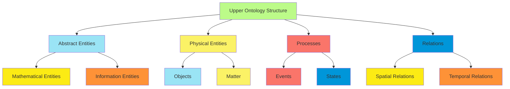
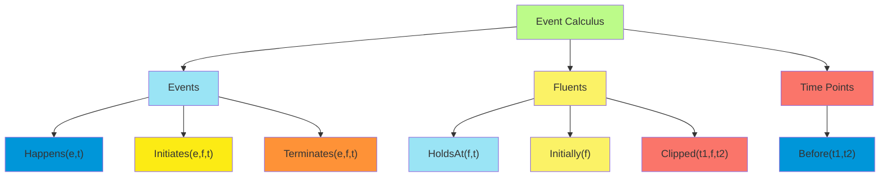
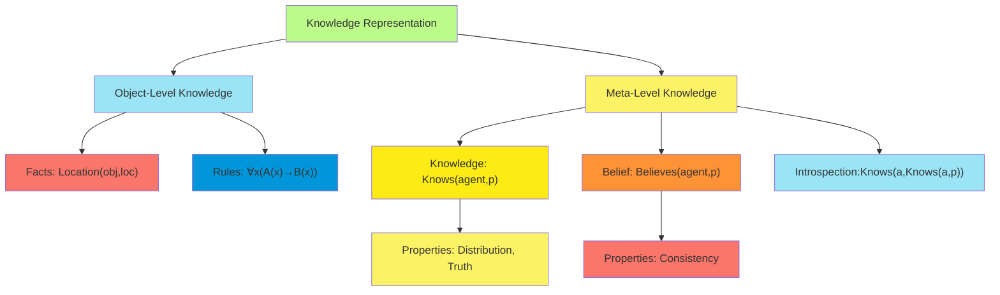
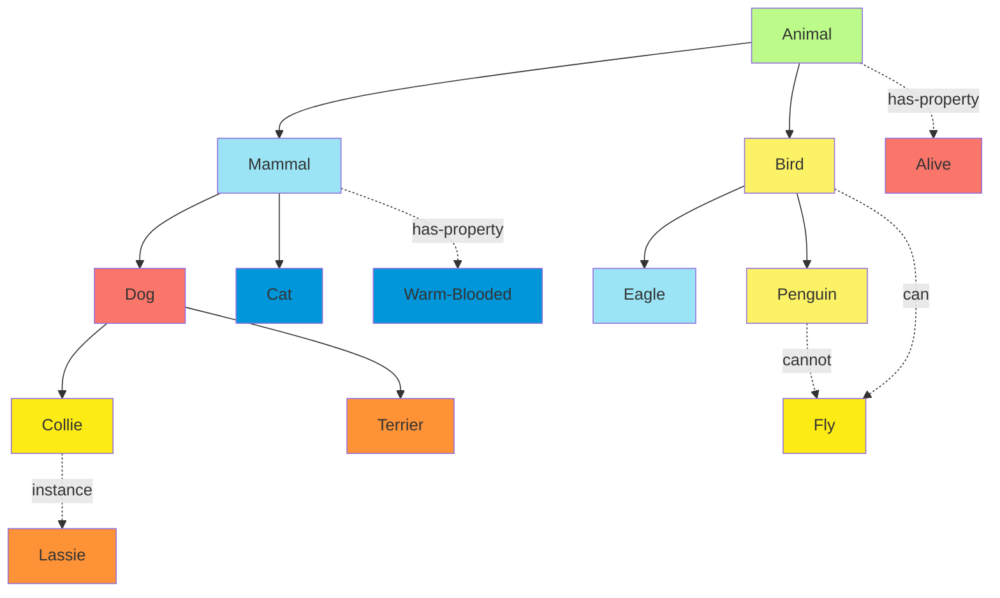
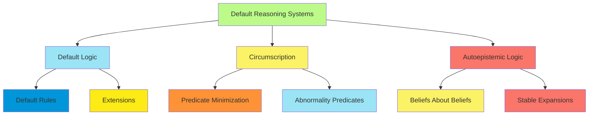

# C-10 | S-3: Knowledge Representation

1. Ontological Engineering
    - Upper Ontologies and Knowledge Organization
    - Categories and Objects
    - Physical Composition and Measurements
    - Distinguishing Things and Stuff
2. Events and Time
    - The Event Calculus
    - Interval Algebra and Temporal Relations
    - Fluents and Objects
    - Representing Actions and Their Effects
3. Mental Objects and Modal Logic
    - Representing Knowledge About Knowledge
    - Modal Operators for Knowledge and Belief
    - Reasoning About Knowledge and Belief
    - Limitations of Logical Omniscience
4. Reasoning Systems for Categories
    - Semantic Networks
    - Description Logics
    - Default Reasoning
    - Truth Maintenance Systems

#### Ontological Engineering

##### Upper Ontologies and Knowledge Organization

Ontological engineering concerns the systematic development of representations that capture the fundamental categories
and relationships in a domain of knowledge. Upper ontologies provide a foundation for more specific knowledge
representations by establishing broad conceptual frameworks.

An **upper ontology** (or foundational ontology) defines the most general categories of entities and their
relationships, serving as a shared conceptual framework across multiple domains. Key examples include:

1. **Cyc**: Developed by Cycorp, it contains over 500,000 concepts organized in a complex hierarchy with millions of
   assertions about common sense knowledge.
2. **SUMO** (Suggested Upper Merged Ontology): An open-source upper ontology that provides definitions for
   general-purpose terms and serves as a foundation for more domain-specific ontologies.
3. **BFO** (Basic Formal Ontology): Focuses on representing entities in reality rather than concepts in the mind, with
   an emphasis on biological and biomedical domains.
4. **DOLCE** (Descriptive Ontology for Linguistic and Cognitive Engineering): Designed with a cognitive bias, capturing
   categories that underlie natural language and human common sense.

Upper ontologies are structured around several organizational principles:

- **Taxonomic Relations**: "is-a" hierarchies connecting more specific concepts to more general ones
- **Partonomic Relations**: "part-of" relationships representing composition structures
- **Attributive Relations**: Properties and qualities associated with entities
- **Causal Relations**: Connections between causes and effects
- **Functional Relations**: Roles, purposes, and uses of entities

The development of upper ontologies faces several challenges:

1. **Philosophical Differences**: Competing ontological commitments (e.g., realism vs. conceptualism)
2. **Integration Difficulties**: Merging different ontological perspectives
3. **Cognitive Adequacy**: Ensuring compatibility with human conceptualization
4. **Computational Tractability**: Maintaining efficiency for reasoning systems



##### Categories and Objects

The systematic organization of categories and objects forms the foundation of knowledge representation. Categories
provide cognitive economy by grouping similar entities and supporting inference about new instances.

**Categorical Representation**:

Categories can be conceptualized in several ways:

1. **Classical View**: Categories defined by necessary and sufficient conditions
    - Example: A triangle is a polygon with exactly three sides and three angles
2. **Prototype Theory**: Categories defined by similarity to prototypical examples
    - Example: A robin is more representative of the bird category than a penguin
3. **Exemplar Theory**: Categories represented by collection of specific instances
    - Example: Understanding "chair" by remembering specific chairs encountered
4. **Theory-Based View**: Categories structured by explanatory theories
    - Example: Living things categorized based on biological theories of function

Representation of categories in formal systems typically involves:

- **Class Membership**: $Instance(x, Category)$
- **Subclass Relations**: $SubClass(Category1, Category2)$
- **Property Inheritance**: If $SubClass(C1, C2)$ and $Property(C2, P)$, then $Property(C1, P)$

**Object Representation**:

Objects possess several key characteristics in knowledge representation:

1. **Identity**: Objects maintain identity despite changes in properties
    - $\forall t_1, t_2 \ SameObject(x, t_1, x, t_2)$
2. **Attributes and Values**: Objects have properties with associated values
    - $AttributeValue(Object, Attribute, Value)$
3. **Compositional Structure**: Objects may have parts and be parts of larger wholes
    - $PartOf(Part, Whole)$
4. **Taxonomic Position**: Objects belong to categories in taxonomic hierarchies
    - $Instance(Object, Category)$
5. **Functional Role**: Objects fulfill functional roles in various contexts
    - $FunctionalRole(Object, Role, Context)$

##### Physical Composition and Measurements

Physical composition concerns the part-whole relationships between objects and the ways in which objects are composed of
material substances.

**Mereology** (the theory of part-whole relations) includes several fundamental relations:

1. **Part-Of**: The basic partonomic relation
    - $PartOf(x, y)$: $x$ is a part of $y$
2. **Proper-Part-Of**: A part that is not identical to the whole
    - $ProperPartOf(x, y) \Leftrightarrow PartOf(x, y) \wedge x \neq y$
3. **Overlaps-With**: Entities sharing at least one common part
    - $OverlapsWith(x, y) \Leftrightarrow \exists z (PartOf(z, x) \wedge PartOf(z, y))$

These relations typically satisfy axioms such as:

- **Transitivity**: $PartOf(x, y) \wedge PartOf(y, z) \Rightarrow PartOf(x, z)$
- **Antisymmetry**: $PartOf(x, y) \wedge PartOf(y, x) \Rightarrow x = y$
- **Reflexivity**: $PartOf(x, x)$ (for some mereological systems)

**Measurements and Quantities**:

Measurements provide quantitative descriptions of physical properties:

1. **Dimensional Analysis**: Representing quantities using fundamental dimensions
    - Length, Mass, Time, Temperature, etc.
    - Derived dimensions (e.g., velocity as length/time)
2. **Units of Measurement**: Standardized reference quantities
    - $Measure(Object, Property, Value, Unit)$
    - Example: $Measure(Table1, Length, 2, Meter)$
3. **Qualitative Abstractions**: Discretizing continuous values
    - $QualitativeValue(Temperature, Hot)$ abstracted from precise measurements
4. **Uncertainty Representation**: Handling imprecise measurements
    - $Measurement(Property, Value, ErrorMargin)$
    - Fuzzy values: $FuzzyMembership(Value, Category, Degree)$

##### Distinguishing Things and Stuff

Knowledge representation must distinguish between countable objects ("things") and uncountable substances ("stuff"), as
they exhibit different logical behaviors.

**Things (Countable Objects)**:

- Can be counted: one chair, two chairs
- Have definite boundaries and identity
- Represented with individual constants: $Chair(c1)$
- Support counting queries: $Count(x, Chair(x)) = 5$

**Stuff (Mass Nouns/Substances)**:

- Cannot be directly counted: water, gold
- Measured by amount rather than counted
- Represented with mass terms: $Water(w)$
- Support measurement queries: $Amount(x, Water(x), 5, Liter)$

**Relationships Between Things and Stuff**:

1. **Constitution**: Objects constituted by materials
    - $ConstitutedBy(Statue, Clay)$
2. **Portions**: Individuated amounts of stuff
    - $Portion(w, Water)$
    - $Amount(w, 250, Milliliter)$
3. **Transformation**: Changes between thing and stuff categories
    - $Transforms(ChoppingEvent, Tree, Lumber)$
4. **Aggregates**: Collections that behave as stuff-like
    - $Aggregate(Swarm, Bee)$

The representation of the thing/stuff distinction impacts inference patterns:

- Things support identity over time: $SameObject(Car1, t1, Car1, t2)$
- Stuff supports conservation principles: $Amount(w1, Water, a) \wedge Poured(w1, w2) \Rightarrow Amount(w2, Water, a)$
- Mixed cases require specialized reasoning:
  $PortionOf(slice, cake) \wedge Eaten(slice) \Rightarrow \neg Exists(slice) \wedge Exists(cake)$

#### Events and Time

##### The Event Calculus

The Event Calculus provides a logical framework for representing and reasoning about events, actions, and their effects
over time. Developed by Kowalski and Sergot, it addresses the frame problem and supports commonsense reasoning about
dynamic worlds.

**Core Predicates of the Event Calculus**:

1. **Happens(e, t)**: Event $e$ occurs at time point $t$
2. **Initiates(e, f, t)**: Event $e$ initiates fluent $f$ at time $t$
3. **Terminates(e, f, t)**: Event $e$ terminates fluent $f$ at time $t$
4. **HoldsAt(f, t)**: Fluent $f$ is true at time point $t$
5. **Initially(f)**: Fluent $f$ is true at the initial time point
6. **Clipped(t1, f, t2)**: Fluent $f$ is terminated between times $t1$ and $t2$

**Axioms of the Event Calculus**:

The core axiom relating these predicates:

$HoldsAt(f, t2) \Leftarrow Initially(f) \wedge \neg Clipped(0, f, t2)$

$HoldsAt(f, t2) \Leftarrow Happens(e, t1) \wedge Initiates(e, f, t1) \wedge t1 < t2 \wedge \neg Clipped(t1, f, t2)$

$Clipped(t1, f, t2) \Leftrightarrow \exists e,t (Happens(e, t) \wedge t1 < t < t2 \wedge Terminates(e, f, t))$

**Example Application**:

For a light switch scenario:

```
Initially(¬On)
Initiates(TurnOn, On, t)
Terminates(TurnOn, ¬On, t)
Initiates(TurnOff, ¬On, t)
Terminates(TurnOff, On, t)
Happens(TurnOn, 5)
```

From these axioms, we can infer $HoldsAt(On, 10)$ if no intervening $TurnOff$ event occurred between times 5 and 10.

The Event Calculus provides a solution to the **frame problem** (determining which properties remain unchanged after
actions) through its axioms about the persistence of fluents until explicitly terminated.



##### Interval Algebra and Temporal Relations

Allen's Interval Algebra provides a qualitative framework for representing and reasoning about temporal intervals and
their relationships.

**Basic Temporal Entities**:

- **Time points**: Instantaneous moments
- **Time intervals**: Periods with duration, defined by start and end points

**Allen's 13 Interval Relations**: Allen identified 13 mutually exclusive relations that can hold between two time
intervals:

1. **Before(i, j)**: Interval $i$ ends before interval $j$ begins
2. **Meets(i, j)**: Interval $i$ ends exactly when interval $j$ begins
3. **Overlaps(i, j)**: Interval $i$ starts before interval $j$ and ends during interval $j$
4. **Starts(i, j)**: Intervals $i$ and $j$ start at the same time, but $i$ ends before $j$
5. **During(i, j)**: Interval $i$ is contained within interval $j$
6. **Finishes(i, j)**: Intervals $i$ and $j$ end at the same time, but $i$ starts after $j$
7. **Equals(i, j)**: Intervals $i$ and $j$ start and end at the same times

Plus the inverses of relations 1-6: After, MetBy, OverlappedBy, StartedBy, Contains, FinishedBy

**Reasoning with Interval Algebra**:

Allen developed a transitivity table that enables temporal reasoning:

- If $Before(i, j)$ and $Before(j, k)$, then $Before(i, k)$
- If $During(i, j)$ and $During(j, k)$, then $During(i, k)$
- If $Meets(i, j)$ and $During(j, k)$, then possible relations between $i$ and $k$ include $Before$, $Meets$, and
  $Overlaps$

Interval networks can be constructed to represent and reason about multiple temporal constraints:

- Nodes represent intervals
- Edges represent disjunctions of possible Allen relations
- Constraint propagation algorithms determine consistency and entailed relations

Applications include:

- Planning and scheduling
- Natural language understanding of temporal expressions
- Medical and historical event reasoning
- Process monitoring and diagnosis

##### Fluents and Objects

Fluents represent time-varying properties or relations in dynamic domains. They provide a foundational element for
representing change in knowledge representation systems.

**Types of Fluents**:

1. **Propositional Fluents**: Time-varying truth values
    - $HoldsAt(Raining, t)$
    - $HoldsAt(OnTable(Block1), t)$
2. **Functional Fluents**: Time-varying functions that map to values
    - $Value(Location(Robot), t) = (3, 4)$
    - $Value(Temperature(Room101), t) = 22.5$

**Fluent Calculus** extends the Event Calculus by representing states explicitly as collections of fluents:

- States are represented as multisets of fluents
- The result of an action is a transformation on these states
- Frame axioms are replaced by state update axioms

For example, the effect of moving an object can be represented as:
$State(s + Holding(robot, obj), t) \wedge Happens(PutDown(robot, obj, loc), t) \Rightarrow$
$State(s + At(obj, loc) + HandEmpty(robot) - Holding(robot, obj), t+1)$

where $+$ and $-$ represent addition and removal from the state multiset.

**Objects in Dynamic Domains**:

Objects interact with fluents in several ways:

1. **Object Identity**: Persisting through property changes
    - $SameObject(car, t1, car, t2) \wedge Value(Color(car), t1) = red \wedge Value(Color(car), t2) = blue$
2. **Object Creation and Destruction**:
    - $Happens(Manufacture(car), t1) \Rightarrow Exists(car, t1+1) \wedge \neg Exists(car, t1)$
    - $Happens(Destroy(car), t2) \Rightarrow \neg Exists(car, t2+1) \wedge Exists(car, t2)$
3. **Object Configuration**: Relations between multiple objects
    - $HoldsAt(On(block1, block2), t)$
    - $HoldsAt(Connected(comp1, comp2), t)$
4. **Object Transformation**: Changes in object type or identity
    - $Happens(Bake(dough), t) \Rightarrow \neg Exists(dough, t+1) \wedge Exists(bread, t+1)$

##### Representing Actions and Their Effects

Representing actions and their effects is a central challenge in knowledge representation, with several established
frameworks addressing the complexities of causality and change.

**The STRIPS Representation**:

STRIPS (Stanford Research Institute Problem Solver) represents actions using:

- **Preconditions**: Conditions that must hold for an action to be applicable
- **Add List**: Fluents that become true after the action
- **Delete List**: Fluents that cease to be true after the action

Example STRIPS operator for moving a block:

```
Action: Move(block, from, to)
Preconditions: On(block, from), Clear(block), Clear(to)
Add: On(block, to), Clear(from)
Delete: On(block, from), Clear(to)
```

**The Situation Calculus**:

Situation Calculus represents actions and their effects using situations (complete world states):

- **Situations**: Terms representing world history, e.g., $Result(PutDown(Block1), S0)$
- **Fluents**: Relations or functions that take situations as arguments, e.g., $On(Block1, Table, s)$
- **Action Possibility**: $Poss(a, s)$ means action $a$ is possible in situation $s$
- **Effect Axioms**: Specify how actions change fluents, e.g.,
  $Poss(Move(b, l), s) \Rightarrow At(b, l, Result(Move(b, l), s))$

**Successor State Axioms** in Situation Calculus address the frame problem by providing complete specifications of when
fluents change:

$F(Result(a, s)) \Leftrightarrow \gamma_F^+(a, s) \vee (F(s) \wedge \neg \gamma_F^-(a, s))$

where $\gamma_F^+$ specifies when action $a$ makes fluent $F$ true, and $\gamma_F^-$ specifies when it makes $F$ false.

**Action Description Language (ADL)**:

ADL extends STRIPS with:

- Conditional effects: Effects that depend on the state
- Universally quantified effects: Effects applying to multiple objects
- Negative preconditions: Conditions that must not hold

Example ADL operator:

```
Action: PourWater(container, plant)
Preconditions: Contains(container, water), Alive(plant)
Effects:
  ¬Contains(container, water)
  if Thirsty(plant) then ¬Thirsty(plant)
  if ¬Thirsty(plant) then Overwatered(plant)
```

**Handling Action Complexity**:

Modern representations address additional challenges:

1. **Concurrent Actions**: Multiple actions occurring simultaneously
    - $ConcurrentPossible(a1, a2, s)$ specifies when actions can occur together
    - Joint effects must account for interactions between actions
2. **Continuous Change**: Properties changing continuously over time
    - Differential equations: $\frac{d}{dt}Height(ball, t) = Velocity(ball, t)$
    - Qualitative models for threshold-based effects
3. **Stochastic Effects**: Actions with probabilistic outcomes
    - $P(F(Result(a, s)) | a, s) = 0.8$ specifies that fluent $F$ becomes true with 0.8 probability
    - Markov Decision Processes formalize sequential decision-making under uncertainty
4. **Exogenous Events**: Changes not resulting from agent actions
    - Event calculus distinguishes agent actions from external events
    - Trigger axioms: $Condition(s) \Rightarrow Happens(Event, s)$

#### Mental Objects and Modal Logic

##### Representing Knowledge About Knowledge

Representing agents' knowledge and beliefs requires meta-level representational capabilities. These representations
address what agents know about the world and about other agents' mental states.

**Knowledge Representation Levels**:

1. **Object Level**: Representing facts about the world
    - $Location(Robot, Room3)$
    - $Color(Box, Red)$
2. **Meta Level**: Representing knowledge about knowledge
    - $Knows(Agent1, Location(Robot, Room3))$
    - $Believes(Agent2, Color(Box, Blue))$

**Knowledge Representation Approaches**:

1. **Syntactic Approach**: Treats knowledge as relationships to sentences
    - $Knows(Agent, "Location(Robot, Room3)")$
    - Advantages: Handles partial knowledge, avoids logical omniscience
    - Disadvantages: Struggles with equivalent expressions, intensionality issues
2. **Semantic Approach**: Treats knowledge as relationships to propositions or possible worlds
    - $Knows(Agent, Location(Robot, Room3))$
    - Advantages: Handles equivalence naturally, fits with modal logic
    - Disadvantages: Can lead to logical omniscience problems
3. **Hybrid Approaches**: Combine syntactic and semantic elements
    - $Knows(Agent, \phi, Level)$ where $Level$ indicates depth or certainty
    - Awareness-based models: $Knows(Agent, \phi) \wedge Aware(Agent, \phi)$

**Introspection Properties**:

Knowledge representations must address introspection capabilities:

1. **Positive Introspection**: Knowing that one knows
    - $Knows(Agent, \phi) \Rightarrow Knows(Agent, Knows(Agent, \phi))$
2. **Negative Introspection**: Knowing that one doesn't know
    - $\neg Knows(Agent, \phi) \Rightarrow Knows(Agent, \neg Knows(Agent, \phi))$
3. **Limited Introspection**: More realistic models with limitations
    - $MayKnow(Agent, \phi)$: Uncertainty about one's knowledge
    - $DeeplyKnows(Agent, \phi, n)$: Knowledge with bounded introspection depth



##### Modal Operators for Knowledge and Belief

Modal logic extends classical logic with operators for possibility and necessity, providing a formal framework for
representing knowledge and belief.

**Basic Modal Operators**:

1. **Knowledge Operator** $K_i$: Agent $i$ knows that...
    - $K_i \phi$ means "Agent $i$ knows $\phi$"
    - Example: $K_{John}Location(Keys, Drawer)$
2. **Belief Operator** $B_i$: Agent $i$ believes that...
    - $B_i \phi$ means "Agent $i$ believes $\phi$"
    - Example: $B_{Mary}Raining$
3. **Possibility Operators**:
    - $P_i \phi$ means "Agent $i$ considers $\phi$ possible"
    - Definable as $P_i \phi \equiv \neg K_i \neg \phi$

**Semantic Models**:

Kripke semantics provides a formal foundation using possible worlds:

- **Possible Worlds**: Complete states of affairs

- **Accessibility Relations**: $R_i(w, w')$ means "world $w'$ is accessible from world $w$ for agent $i$"

- Truth Conditions

    :

    - $w \models K_i \phi$ iff for all $w'$ such that $R_i(w, w')$, $w' \models \phi$
    - $w \models B_i \phi$ iff for all $w'$ such that $R_i(w, w')$, $w' \models \phi$

The properties of the accessibility relation determine the properties of knowledge or belief:

1. **Reflexivity** ($R_i(w, w)$ for all $w$): Knowledge is true (known things are actually true)
2. **Transitivity** ($R_i(w, w')$ and $R_i(w', w'')$ implies $R_i(w, w'')$): Positive introspection
3. **Euclidean** ($R_i(w, w')$ and $R_i(w, w'')$ implies $R_i(w', w'')$): Negative introspection
4. **Serial** (for each $w$, there exists $w'$ such that $R_i(w, w')$): Consistency of beliefs

**Modal System Correspondence**:

Different combinations of these properties yield different modal systems:

- **K**: Basic modal logic (no special properties)
- **T**: Knowledge logic (reflexive)
- **S4**: Knowledge with positive introspection (reflexive, transitive)
- **S5**: Knowledge with positive and negative introspection (reflexive, transitive, Euclidean)
- **KD45**: Belief logic (serial, transitive, Euclidean)

##### Reasoning About Knowledge and Belief

Reasoning about knowledge and belief involves inferring what agents know or believe based on observations,
communications, and logical consequences.

**Inference Rules for Knowledge**:

1. **Knowledge Distribution**:
    - $K_i(\phi \Rightarrow \psi) \Rightarrow (K_i\phi \Rightarrow K_i\psi)$
    - If an agent knows an implication and knows the antecedent, they know the consequent
2. **Knowledge Generalization**:
    - If $\vdash \phi$ (i.e., $\phi$ is a tautology), then $\vdash K_i\phi$
    - Agents know all logical truths
3. **Truth Axiom** (for knowledge):
    - $K_i\phi \Rightarrow \phi$
    - What is known is true
4. **Positive Introspection**:
    - $K_i\phi \Rightarrow K_iK_i\phi$
    - If an agent knows something, they know that they know it
5. **Negative Introspection**:
    - $\neg K_i\phi \Rightarrow K_i\neg K_i\phi$
    - If an agent doesn't know something, they know that they don't know it

**Multi-Agent Knowledge Reasoning**:

1. **Common Knowledge**:
    - $C_G\phi$ means proposition $\phi$ is common knowledge among group $G$
    - Everyone knows $\phi$, everyone knows everyone knows $\phi$, and so on
    - Formally: $C_G\phi \equiv E_G\phi \wedge E_GE_G\phi \wedge E_GE_GE_G\phi \wedge \ldots$
    - Where $E_G\phi \equiv \bigwedge_{i \in G} K_i\phi$ (everyone in $G$ knows $\phi$)
2. **Distributed Knowledge**:
    - $D_G\phi$ means the group $G$ collectively knows $\phi$
    - Knowledge distributed across the group that could be assembled
    - Intuitively: what a hypothetical agent with the combined knowledge of all agents in $G$ would know

**Reasoning About Belief Change**:

1. **Belief Revision**: Incorporating new information that may contradict existing beliefs
    - AGM postulates formalize rational belief revision
    - $B_i * \phi$ represents belief state after revising with $\phi$
2. **Belief Update**: Changing beliefs to reflect changes in the world
    - $B_i \diamond \phi$ represents belief state after updating with $\phi$
3. **Public Announcements**: Effects of publicly revealing information
    - $[\phi!]K_i\psi$ means "after $\phi$ is publicly announced, agent $i$ knows $\psi$"

##### Limitations of Logical Omniscience

Modal logics for knowledge and belief face the problem of logical omniscience—the assumption that agents know or believe
all logical consequences of their knowledge or beliefs.

**Manifestations of Logical Omniscience**:

1. **Knowledge of All Valid Formulas**:
    - If $\vdash \phi$, then $\vdash K_i\phi$
    - Agents know all tautologies and mathematical truths
2. **Closure Under Implication**:
    - $K_i(\phi \Rightarrow \psi) \Rightarrow (K_i\phi \Rightarrow K_i\psi)$
    - Agents know all implications of what they know
3. **Closure Under Logical Equivalence**:
    - If $\phi \equiv \psi$, then $K_i\phi \equiv K_i\psi$
    - Agents cannot distinguish logically equivalent statements

These assumptions are unrealistic for actual agents with computational and cognitive limitations.

**Approaches to Addressing Logical Omniscience**:

1. **Syntactic Approaches**:
    - Treat knowledge as a relation to syntactic expressions rather than propositions
    - $Knows(Agent, "\phi")$ rather than $K_i\phi$
    - Allows for distinctions between logically equivalent formulations
2. **Awareness Models**:
    - Introduce an explicit awareness predicate
    - $K_i\phi \wedge Aware_i(\phi)$ means agent $i$ knows and is aware of $\phi$
    - Knowledge without awareness doesn't imply explicit knowledge
3. **Impossible Worlds**:
    - Extend possible worlds semantics with "impossible worlds" where logical laws may not hold
    - $K_i\phi$ holds if $\phi$ is true in all accessible possible and impossible worlds
4. **Resource-Bounded Reasoning**:
    - $K_i^t\phi$ means agent $i$ can derive $\phi$ within $t$ steps of computation
    - Explicitly models computational limitations of agents
5. **Non-Standard Logics**:
    - Relevant logic: Requires relevance between premises and conclusions
    - Paraconsistent logic: Allows for inconsistent beliefs without trivializing inference

These approaches create more realistic models of limited agents while maintaining formal rigor.

#### Reasoning Systems for Categories

##### Semantic Networks

Semantic networks provide a graph-based representation for capturing categorical knowledge and relationships between
concepts. They enable intuitive visualization and support inheritance-based reasoning.

**Core Components**:

1. **Nodes**: Represent concepts, entities, or categories

    - Concept nodes: $Animal$, $Mammal$, $Dog$
    - Individual nodes: $Fido$, $Lassie$

2. **Links**: Represent relationships between nodes

    - IS-A links

        : Represent category membership or subcategory relationships

        - $Dog \xrightarrow{IS-A} Mammal$
        - $Fido \xrightarrow{IS-A} Dog$

    - Property links

        : Represent attributes of concepts

        - $Dog \xrightarrow{has-part} Tail$
        - $Mammal \xrightarrow{has-property} WarmBlooded$

    - Role links

        : Represent relational properties

        - $Dog \xrightarrow{eats} Meat$
        - $Owner \xrightarrow{owns} Pet$

**Inheritance in Semantic Networks**:

Properties propagate along IS-A links from more general to more specific concepts:

- If $Mammal \xrightarrow{has-property} WarmBlooded$ and $Dog \xrightarrow{IS-A} Mammal$, then
  $Dog \xrightarrow{has-property} WarmBlooded$
- If $Dog \xrightarrow{has-part} Tail$ and $Collie \xrightarrow{IS-A} Dog$, then $Collie \xrightarrow{has-part} Tail$

**Inference in Semantic Networks**:

1. **Inheritance Reasoning**:
    - Following IS-A links to determine properties
    - Example: "Is Fido warm-blooded?" → Follow
      $Fido \xrightarrow{IS-A} Dog \xrightarrow{IS-A} Mammal \xrightarrow{has-property} WarmBlooded$
2. **Exception Handling**:
    - Overriding inherited properties with specific values
    - Example: $Bird \xrightarrow{can} Fly$, but $Penguin \xrightarrow{IS-A} Bird$ and
      $Penguin \xrightarrow{cannot} Fly$
3. **Transitive Relations**:
    - Propagating certain relationships across multiple links
    - Example: If $A \xrightarrow{part-of} B$ and $B \xrightarrow{part-of} C$, then $A \xrightarrow{part-of} C$



**Limitations of Semantic Networks**:

1. Lack of formal semantics in early implementations
2. Difficulty representing quantified statements
3. Limited expressiveness for complex logical relationships
4. Challenges in representing negation and disjunction

Modern semantic networks address these limitations through formal semantics and integration with logic-based systems.

##### Description Logics

Description Logics (DLs) provide a family of knowledge representation formalisms that balance expressivity with
computational tractability. They serve as the formal foundation for ontology languages like OWL (Web Ontology Language).

**Basic Components**:

1. **Concepts**: Represent sets or classes of individuals
    - Atomic concepts: $Person$, $Animal$
    - Complex concepts: $Person \sqcap Female$ (female person), $\exists hasChild.Doctor$ (someone with a child who is a
      doctor)
2. **Roles**: Represent binary relationships between individuals
    - $hasChild$, $worksFor$, $partOf$
3. **Individuals**: Represent specific entities
    - $john$, $mary$, $acme_corp$

**Constructors for Complex Concepts**:

1. **Conjunction** ($\sqcap$): $C \sqcap D$ represents the intersection of concepts $C$ and $D$
2. **Disjunction** ($\sqcup$): $C \sqcup D$ represents the union of concepts $C$ and $D$
3. **Negation** ($\neg$): $\neg C$ represents the complement of concept $C$
4. **Existential Restriction** ($\exists$): $\exists R.C$ represents individuals with at least one $R$-relationship to
   an individual in $C$
5. **Universal Restriction** ($\forall$): $\forall R.C$ represents individuals that are $R$-related only to individuals
   in $C$
6. **Number Restrictions**: $\geq n R.C$ and $\leq n R.C$ constrain the number of $R$-relationships to individuals in
   $C$

**Knowledge Base Components**:

1. **TBox** (Terminological Box): Defines concepts and their relationships
    - $Woman \equiv Person \sqcap Female$ (definitional axiom)
    - $Mother \sqsubseteq Woman \sqcap \exists hasChild.Person$ (inclusion axiom)
2. **ABox** (Assertional Box): Contains facts about individuals
    - $Woman(mary)$ (concept assertion)
    - $hasChild(mary, john)$ (role assertion)
3. **RBox** (Role Box): Specifies role hierarchies and properties
    - $hasParent \equiv hasChild^{-}$ (inverse roles)
    - $ancestorOf \circ parentOf \sqsubseteq ancestorOf$ (role composition)

**Reasoning Services in Description Logics**:

1. **Subsumption checking**: Determining if one concept is a subconcept of another
    - $Mother \sqsubseteq Parent$?
2. **Instance checking**: Determining if an individual belongs to a concept
    - $Mother(mary)$?
3. **Consistency checking**: Determining if a knowledge base is satisfiable
    - Is there a model satisfying all axioms?
4. **Classification**: Computing the complete concept hierarchy
    - Organizing all concepts into a subsumption lattice

Different DL variants offer different trade-offs between expressivity and computational complexity:

- **$\mathcal{ALC}$**: Basic DL with concept conjunction, disjunction, negation, and quantifiers
- **$\mathcal{SHIQ}$**: Extends $\mathcal{ALC}$ with role hierarchies, inverse roles, and qualified number restrictions
- **$\mathcal{SROIQ}$**: The basis for OWL 2, adding complex role axioms and other features

##### Default Reasoning

Default reasoning addresses the challenge of drawing plausible inferences in the absence of complete information,
allowing systems to make provisional conclusions that may be retracted when new information becomes available.

**Motivation and Challenges**:

1. **The Qualification Problem**: The impossibility of explicitly listing all prerequisites for an action or conclusion
    - Example: Birds fly, but what about penguins, injured birds, birds in cages, etc.?
2. **The Frame Problem**: Determining which aspects of the world remain unchanged after an action
    - Example: After moving a book, its color remains the same, but its location changes
3. **Nonmonotonic Reasoning**: In contrast to classical logic, adding new information may invalidate previously derived
   conclusions
    - Example: "Tweety is a bird" ⟹ "Tweety can fly"; adding "Tweety is a penguin" ⟹ "Tweety cannot fly"

**Default Logic (Reiter)**:

Reiter's default logic extends classical logic with default rules:

$\frac{\alpha : \beta_1, \beta_2, ..., \beta_n}{\gamma}$

Interpretation: If $\alpha$ is known, and each $\beta_i$ is consistent with what is known, then conclude $\gamma$.

Example: The bird-flight default $\frac{Bird(x) : Flies(x)}{Flies(x)}$

"If $x$ is a bird, and it's consistent to assume $x$ flies, then conclude $x$ flies."

**Extensions**: Sets of beliefs derivable from a default theory

- Multiple extensions can exist (representing different plausible belief sets)
- Skeptical reasoning: Accept conclusions in all extensions
- Credulous reasoning: Accept conclusions in at least one extension

**Circumscription (McCarthy)**:

Circumscription formalizes the assumption that things are normal unless explicitly stated otherwise:

1. **Predicate Circumscription**: Minimizing the extension of a predicate
    - $CIRC[T; P]$: The theory resulting from minimizing predicate $P$ in theory $T$
    - Example: $CIRC[Bird(tweety) \wedge Bird(x) \wedge \neg Ab(x) \Rightarrow Flies(x); Ab]$ concludes $Flies(tweety)$
      by minimizing abnormality
2. **Domain Circumscription**: Minimizing the domain of discourse
    - Assume only the objects that must exist
3. **Formula Circumscription**: Minimizing the extension of an entire formula



**Applications of Default Reasoning**:

1. **Stereotypical Knowledge**: Representing typical properties of categories
    - "Doctors typically have medical degrees"
    - "Libraries normally contain books"
2. **Diagnosis and Troubleshooting**: Assuming components work normally unless evidence suggests otherwise
    - "If the power is on and the screen is dark, the display may be faulty"
3. **Planning with Incomplete Information**: Making reasonable assumptions about unspecified conditions
    - "Planning a picnic assumes it won't rain unless the forecast says otherwise"
4. **Natural Language Understanding**: Resolving ambiguities based on typical interpretations
    - "The trophy wouldn't fit in the suitcase because it was too big" (the trophy is big, not the suitcase)

##### Truth Maintenance Systems

Truth Maintenance Systems (TMS) provide mechanisms for managing beliefs and their justifications, supporting belief
revision when contradictions are discovered or new information becomes available.

**Core Functions of TMS**:

1. **Recording Justifications**: Tracking the reasons for beliefs
    - Direct evidence justifications
    - Inference-based justifications
    - Default assumption justifications
2. **Dependency Tracking**: Maintaining links between beliefs and their justifications
    - Justification networks
    - Dependency graphs
    - Support links
3. **Belief Revision**: Updating beliefs when contradictions arise
    - Identifying minimal inconsistent sets
    - Retracting beliefs to restore consistency
    - Tracking cascading effects of belief changes

**Types of Truth Maintenance Systems**:

1. **Justification-based TMS (JTMS)**:
    - Maintains justifications for each belief
    - Beliefs are either IN (accepted) or OUT (rejected)
    - Justification structure: $Support(belief) = {j_1, j_2, ..., j_n}$
    - Justification form: $j_i = \langle in_i, out_i, conclusion \rangle$
    - Belief is IN if at least one justification is valid
2. **Assumption-based TMS (ATMS)**:
    - Associates beliefs with sets of assumptions
    - Label of node $n$: $L(n) = {E_1, E_2, ..., E_k}$ where each $E_i$ is a set of assumptions
    - Maintains multiple context-specific belief sets simultaneously
    - More efficient for exploring multiple hypothetical scenarios
3. **Logic-based TMS (LTMS)**:
    - Uses propositional logic to represent beliefs
    - Employs unit propagation for efficient consistency checking
    - Assigns TRUE, FALSE, or UNKNOWN status to propositions
    - Maintains well-founded supports for truth assignments

**Belief Revision Strategies**:

1. **Dependency-directed Backtracking**:
    - Identifies the source of contradictions
    - Backtracks to critical choice points
    - Changes assumptions to avoid contradictions
2. **Minimal Conflict Sets**:
    - Identifies minimal sets of beliefs that lead to contradictions
    - $CS = {b_1, b_2, ..., b_n}$ such that $CS$ implies a contradiction
    - At least one belief in each conflict set must be retracted
3. **Belief Prioritization**:
    - Assigns priorities or degrees of entrenchment to beliefs
    - Retracts lower-priority beliefs when conflicts arise
    - Preserves core beliefs when possible

**Integration with Inference Systems**:

TMS typically operates alongside an inference engine:

1. The inference engine derives new conclusions
2. The TMS records the justifications for these conclusions
3. When contradictions are found, the TMS identifies beliefs to retract
4. The inference engine updates its conclusions based on the revised belief set

This integration enables nonmonotonic reasoning in practical knowledge-based systems, supporting default reasoning,
diagnosis, planning, and configuration tasks.
