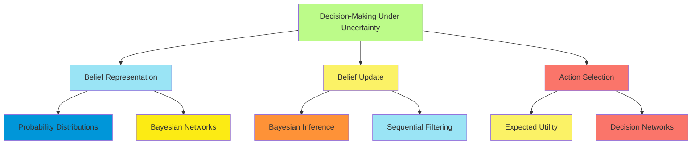
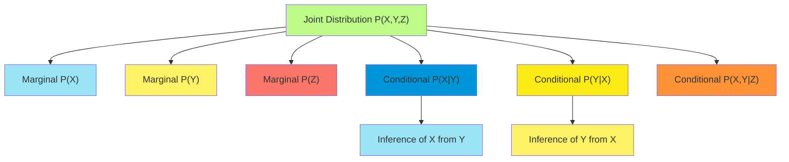
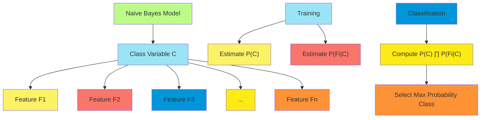
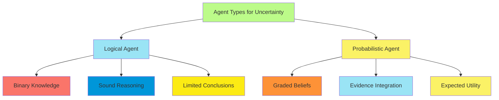

# C-11 | S-4: Quantifying Uncertainty

1. Acting under Uncertainty
    - Sources of Uncertainty in AI Systems
    - Logical vs. Probabilistic Approaches
    - The Qualification Problem
    - Decision Making Under Uncertainty
2. Basic Probability Notation
    - Sample Spaces and Events
    - Prior and Conditional Probabilities
    - Random Variables and Distributions
    - The Chain Rule and Marginalization
3. Inference Using Full Joint Distributions
    - Computing Posterior Probabilities
    - Summing Out Variables
    - Normalization Techniques
    - Computational Complexity of Joint Inference
4. Independence
    - Absolute Independence Between Variables
    - Factoring the Joint Distribution
    - Compactness Through Independence
    - Independence Assertions in Real-World Domains
5. Bayes' Rule and Its Use
    - Diagnostic and Causal Reasoning
    - Applying Bayes' Rule with Multiple Pieces of Evidence
    - Naive Bayes Models
    - Text Classification with Naive Bayes
6. The Wumpus World Revisited
    - Probabilistic Reasoning in the Wumpus World
    - Computing Posterior Probabilities for Pits
    - Using Independence in Wumpus Inference
    - Performance of Probabilistic vs. Logical Agents

#### Acting under Uncertainty

##### Sources of Uncertainty in AI Systems

Intelligent agents operating in real-world environments inevitably face uncertainty stemming from multiple sources:

1. **Partial Observability**: Agents rarely have access to complete information about their environment. Sensors provide
   limited, often noisy data about the current state.
    - Example: A robot's camera can only observe what's in its field of view, not what's behind walls or objects.
2. **Non-Deterministic Actions**: The effects of actions may not be fully predictable, even with complete knowledge of
   the current state.
    - Example: A robotic gripper may successfully grasp an object 95% of the time under identical conditions.
3. **Unknown Environments**: Agents often operate in environments for which they lack complete models.
    - Example: An autonomous vehicle entering a new city with unfamiliar road layouts and traffic patterns.
4. **Adversarial Components**: Many environments include other agents with competing objectives.
    - Example: A poker-playing AI faces uncertainty about opponents' cards and strategies.
5. **Computational Limitations**: Even with theoretical access to all relevant information, practical computational
   constraints may force approximations.
    - Example: Chess-playing programs cannot exhaustively search the entire game tree.
6. **Measurement Errors**: Sensory data often contains errors due to instrumental limitations.
    - Example: GPS readings have inherent margins of error in position estimates.
7. **Ambiguous Representations**: The mapping between the agent's internal representation and the external world is
   often imperfect.
    - Example: Natural language understanding systems must deal with ambiguous phrases.

These sources of uncertainty necessitate frameworks that explicitly represent and reason with uncertain information.

##### Logical vs. Probabilistic Approaches

The limitations of purely logical approaches for handling uncertainty led to the development of probabilistic methods:

**Logical Approaches**:

- Represent knowledge using logical assertions that are either true or false
- Use deductive inference to derive definite conclusions
- Strengths: Clear semantics, sound inference rules
- Weaknesses:
    - Binary nature (propositions are either true or false)
    - Inability to represent degrees of belief
    - Difficulty handling contradictory or incomplete information

**Probabilistic Approaches**:

- Represent knowledge using probability distributions over possible worlds
- Use probabilistic inference to compute degrees of belief
- Strengths:
    - Ability to represent graded beliefs (from 0 to 1)
    - Principled handling of uncertainty
    - Integration of multiple, potentially conflicting sources of evidence
- Weaknesses:
    - Higher computational complexity
    - Potential difficulty in knowledge elicitation
    - Challenges in causal reasoning

**Hybrid Approaches**:

- First-order probabilistic languages combine logical structure with probabilistic semantics
- Markov Logic Networks represent uncertainty using weighted first-order formulas
- Strengths: Combine expressiveness of logic with probabilistic uncertainty handling

The transition from logical to probabilistic approaches represents an evolution from categorical to graduated certainty,
allowing more nuanced reasoning about uncertain worlds.

##### The Qualification Problem

The qualification problem, identified by John McCarthy, highlights a fundamental challenge in knowledge representation:
the practical impossibility of enumerating all preconditions for an action to succeed.

**Definition**: The qualification problem refers to the impossibility of listing all the qualifications (preconditions)
that must be true for an action to have its intended effect.

**Examples**:

- For a car to start when the key is turned, numerous implicit conditions must hold: the battery must be charged, the
  starter motor must be functional, the fuel tank must not be empty, etc.
- For a person to enter a room through a door, the door must be unlocked, not blocked, large enough, the person must
  have the physical ability to open it, etc.

**Logical Approaches to the Qualification Problem**:

1. **Default Logic**: Assume actions succeed unless there's explicit information to the contrary
2. **Circumscription**: Minimize abnormality predicates to handle expected outcomes
3. **Nonmonotonic Logics**: Allow retraction of conclusions when new information arrives

**Probabilistic Treatment**: Probabilistic approaches address the qualification problem by:

- Assigning probabilities to action outcomes rather than making binary success/failure predictions
- Naturally incorporating the uncertainty about whether all preconditions are satisfied
- Allowing reasoning about the most likely outcomes without requiring exhaustive enumeration of all possible
  qualifications

For example, instead of stating "turning the key starts the car if the battery is charged AND the starter works AND...",
a probabilistic approach might state "turning the key starts the car with 0.99 probability given the car's current
condition."

##### Decision Making Under Uncertainty

When facing uncertainty, rational agents must make decisions based on their beliefs about possible states and the
expected utility of actions.

**Components of Decision Making Under Uncertainty**:

1. **Beliefs about the world**: Probability distributions over possible states
2. **Preferences over outcomes**: Utility functions mapping states to real numbers
3. **Available actions**: Options the agent can choose from
4. **Decision policy**: Mapping from beliefs to actions

**Expected Utility Theory**: The principle of maximum expected utility (MEU) states that a rational agent should choose
the action that maximizes the expected utility:

$a^* = \arg\max_a \sum_{s} P(s|a) \cdot U(s)$

Where:

- $a^*$ is the optimal action
- $P(s|a)$ is the probability of outcome state $s$ given action $a$
- $U(s)$ is the utility of state $s$

**Decision-Theoretic Agents**:

1. Maintain a belief state represented as a probability distribution
2. Update beliefs based on evidence using Bayes' rule
3. Compute expected utilities for available actions
4. Select the action with highest expected utility

**Advantages of Decision-Theoretic Approaches**:

1. **Flexibility**: Can handle partial observability and stochastic environments
2. **Optimality**: Provides principled framework for optimal decision making
3. **Adaptivity**: Naturally incorporates learning and belief updating

**Challenges**:

1. **Computational Complexity**: Exact inference is often intractable for complex domains
2. **Knowledge Acquisition**: Obtaining accurate probabilities and utilities
3. **Preference Elicitation**: Determining appropriate utility functions
4. **Time Horizons**: Balancing short-term and long-term utilities

#### Basic Probability Notation

##### Sample Spaces and Events

Probability theory provides the mathematical foundation for reasoning under uncertainty, beginning with the concepts of
sample spaces and events.

**Sample Space (Ω)**:

- The sample space represents the set of all possible outcomes of a random process
- Each element $\omega \in \Omega$ is a complete, possible world state
- Example: For a six-sided die roll, $\Omega = {1, 2, 3, 4, 5, 6}$

**Events**:

- An event is a subset of the sample space, $A \subseteq \Omega$
- Events represent propositions of interest about the world
- Example: "The die roll is even" is the event ${2, 4, 6}$

**Probability Function (P)**:

- A function mapping events to real numbers: $P: 2^\Omega \rightarrow [0, 1]$
- Must satisfy the Kolmogorov axioms:
    1. Non-negativity: $P(A) \geq 0$ for any event $A$
    2. Normalization: $P(\Omega) = 1$
    3. Additivity: For disjoint events $A$ and $B$, $P(A \cup B) = P(A) + P(B)$

**Operations on Events**:

- Complement: $\neg A$ or $A^c$ is the set of outcomes not in $A$
    - $P(\neg A) = 1 - P(A)$
- Intersection: $A \cap B$ is the set of outcomes in both $A$ and $B$
- Union: $A \cup B$ is the set of outcomes in either $A$ or $B$
    - $P(A \cup B) = P(A) + P(B) - P(A \cap B)$

**Probability Distributions**:

- For discrete sample spaces, a probability distribution assigns probabilities to individual outcomes
- For a fair die: $P(\omega) = 1/6$ for each $\omega \in {1, 2, 3, 4, 5, 6}$
- The probability of an event is the sum of probabilities of its constituent outcomes:
  $P(A) = \sum_{\omega \in A} P(\omega)$

In AI contexts, the sample space typically represents possible states of the world, and probabilities encode degrees of
belief about which state is the actual one.

##### Prior and Conditional Probabilities

Probabilistic reasoning involves both unconditional (prior) and conditional probabilities, which relate to beliefs
before and after observing evidence.

**Prior Probability (P(A))**:

- The probability of event $A$ occurring, without considering any other information
- Represents initial belief before observing evidence
- Example: $P(Rain) = 0.3$ means there's a 30% chance of rain based on general climate data

**Conditional Probability (P(A|B))**:

- The probability of event $A$ given that event $B$ has occurred
- Defined as: $P(A|B) = \frac{P(A \cap B)}{P(B)}$ when $P(B) > 0$
- Represents updated belief after observing evidence
- Example: $P(Rain|Cloudy) = 0.8$ means there's an 80% chance of rain given that it's cloudy

**Properties of Conditional Probability**:

1. $0 \leq P(A|B) \leq 1$ for any events $A$ and $B$ where $P(B) > 0$
2. $P(\Omega|B) = 1$ for any event $B$ where $P(B) > 0$
3. For disjoint events $A_1$ and $A_2$: $P(A_1 \cup A_2|B) = P(A_1|B) + P(A_2|B)$

**Relationship to Joint Probability**:

- Joint probability $P(A \cap B)$ can be expressed as:
    - $P(A \cap B) = P(A|B) \cdot P(B)$
    - $P(A \cap B) = P(B|A) \cdot P(A)$

**Conditional Independence**:

- Events $A$ and $B$ are conditionally independent given $C$ if: $P(A \cap B|C) = P(A|C) \cdot P(B|C)$
- Equivalently: $P(A|B \cap C) = P(A|C)$
- This means once we know $C$, learning $B$ provides no additional information about $A$

**Example**: Medical Diagnosis

- $P(Disease) = 0.01$ (prior probability)
- $P(PositiveTest|Disease) = 0.95$ (test sensitivity)
- $P(PositiveTest|\neg Disease) = 0.05$ (false positive rate)
- To calculate $P(Disease|PositiveTest)$ (the probability of having the disease given a positive test result), we apply
  Bayes' rule (discussed in detail later)

##### Random Variables and Distributions

Random variables provide a convenient way to represent uncertain quantities in probabilistic models.

**Random Variables**:

- A random variable $X$ is a function mapping outcomes in a sample space to values (typically numbers)
- Examples:
    - $Temperature$ might map world states to degrees Celsius
    - $RainTomorrow$ might map world states to {true, false}

**Types of Random Variables**:

1. **Discrete**: Take on values from a countable set
    - Example: $DieRoll \in {1, 2, 3, 4, 5, 6}$
    - Example: $EmailClass \in {spam, notSpam}$
2. **Continuous**: Take on values from an uncountable set (typically real numbers)
    - Example: $Height \in \mathbb{R}^+$
    - Example: $LocationX \in \mathbb{R}$

**Probability Distributions for Discrete Random Variables**:

- **Probability Mass Function (PMF)**: $P(X = x)$ specifies the probability that random variable $X$ takes on value $x$
- Properties:
    - $P(X = x) \geq 0$ for all $x$
    - $\sum_x P(X = x) = 1$

**Common Discrete Distributions**:

1. **Bernoulli Distribution**: Models a binary outcome (success/failure)
    - $P(X = 1) = p$, $P(X = 0) = 1-p$
    - Example: Success of a single coin flip
2. **Binomial Distribution**: Models number of successes in $n$ independent Bernoulli trials
    - $P(X = k) = \binom{n}{k} p^k (1-p)^{n-k}$
    - Example: Number of heads in 10 coin flips
3. **Categorical Distribution**: Generalization of Bernoulli to multiple categories
    - $P(X = x_i) = p_i$ where $\sum_i p_i = 1$
    - Example: Outcome of rolling a die

**Probability Distributions for Continuous Random Variables**:

- **Probability Density Function (PDF)**: $f(x)$ such that $P(a \leq X \leq b) = \int_a^b f(x) dx$
- Properties:
    - $f(x) \geq 0$ for all $x$
    - $\int_{-\infty}^{\infty} f(x) dx = 1$

**Common Continuous Distributions**:

1. **Uniform Distribution**: Equal probability density over an interval $[a, b]$
    - $f(x) = \frac{1}{b-a}$ for $a \leq x \leq b$, 0 otherwise
2. **Normal (Gaussian) Distribution**: Bell-shaped distribution defined by mean $\mu$ and variance $\sigma^2$
    - $f(x) = \frac{1}{\sigma\sqrt{2\pi}} e^{-\frac{(x-\mu)^2}{2\sigma^2}}$
    - Important due to the Central Limit Theorem

**Joint Distributions**:

- Joint probability distribution over multiple random variables: $P(X=x, Y=y)$ or $f(x, y)$
- Represents the probability of specific combinations of values

**Conditional Distributions**:

- Probability distribution of one variable given the value of another: $P(X=x|Y=y)$ or $f(x|y)$
- For discrete variables: $P(X=x|Y=y) = \frac{P(X=x, Y=y)}{P(Y=y)}$

##### The Chain Rule and Marginalization

The chain rule and marginalization are fundamental tools for manipulating joint probability distributions.

**The Chain Rule (Product Rule)**:

- Decomposes a joint probability into a product of conditionals
- For two variables: $P(X, Y) = P(X|Y) \cdot P(Y) = P(Y|X) \cdot P(X)$
- For multiple variables:
  $P(X_1, X_2, ..., X_n) = P(X_1) \cdot P(X_2|X_1) \cdot P(X_3|X_1, X_2) \cdot ... \cdot P(X_n|X_1, X_2, ..., X_{n-1})$

**Applications of the Chain Rule**:

1. Breaking complex joint distributions into simpler conditional distributions
2. Enabling more efficient probability calculations
3. Providing the foundation for Bayesian network representations

**Example**: For variables $Weather$, $Forecast$, and $TrafficJam$:
$P(Weather, Forecast, TrafficJam) = P(Weather) \cdot P(Forecast|Weather) \cdot P(TrafficJam|Weather, Forecast)$

**Marginalization (Sum Rule)**:

- Method for eliminating variables from a joint distribution
- For discrete variables $X$ and $Y$: $P(X) = \sum_y P(X, Y=y)$
- For continuous variables: $P(X) = \int P(X, Y=y) dy$

**Properties of Marginalization**:

1. Produces a valid probability distribution over the remaining variables
2. Represents "summing out" or "integrating out" variables of no interest
3. Essential for computing prior and posterior probabilities

**Example**: From a joint distribution $P(Disease, Symptom)$, we can compute:

- $P(Disease) = \sum_{symptom} P(Disease, Symptom=symptom)$
- $P(Symptom) = \sum_{disease} P(Disease=disease, Symptom)$

**Combining Chain Rule and Marginalization**: For variables $X$, $Y$, and $Z$:
$P(X|Z) = \sum_y P(X, Y=y|Z) = \sum_y P(X|Y=y, Z) \cdot P(Y=y|Z)$

This provides the foundation for inferential reasoning in complex probabilistic models.

#### Inference Using Full Joint Distributions

##### Computing Posterior Probabilities

Posterior probability calculations represent a fundamental inference task in probabilistic reasoning, allowing agents to
update their beliefs based on observed evidence.

**Definition of Posterior Probability**:

- The probability of a query variable $X$ taking value $x$ given observed evidence $E=e$: $P(X=x|E=e)$

**Computing Posteriors from Joint Distributions**: For any query $X$ and evidence $E$:

$P(X|E) = \frac{P(X, E)}{P(E)} = \frac{P(X, E)}{\sum_x P(X=x, E)}$

The calculation involves two steps:

1. Obtain relevant entries from the joint distribution $P(X, E, Y_1, Y_2, ..., Y_n)$
2. Normalize to ensure the resulting distribution sums to 1

**Example Calculation**: Consider a simple medical diagnosis with variables:

- $Fever \in {true, false}$
- $Disease \in {flu, cold, none}$

To compute $P(Disease|Fever=true)$:

1. Extract joint probabilities $P(Disease, Fever=true)$ for all values of $Disease$
2. Normalize: $P(Disease|Fever=true) = \frac{P(Disease, Fever=true)}{\sum_{d} P(Disease=d, Fever=true)}$

If the joint distribution gives:

- $P(Disease=flu, Fever=true) = 0.05$
- $P(Disease=cold, Fever=true) = 0.02$
- $P(Disease=none, Fever=true) = 0.01$

Then: $P(Disease=flu|Fever=true) = \frac{0.05}{0.05 + 0.02 + 0.01} = \frac{0.05}{0.08} = 0.625$

**Queries with Multiple Evidence Variables**: For evidence $E_1=e_1, E_2=e_2, ..., E_m=e_m$:

$P(X|e_1, e_2, ..., e_m) = \frac{P(X, e_1, e_2, ..., e_m)}{P(e_1, e_2, ..., e_m)}$

The denominator $P(e_1, e_2, ..., e_m)$ serves as a normalization constant to ensure the resulting distribution sums
to 1.

##### Summing Out Variables

Summing out (also called marginalization) is a key operation for computing probabilities over a subset of variables in a
joint distribution.

**Definition**: Summing out a variable $Y$ from a joint distribution $P(X, Y, Z)$ means computing $P(X, Z)$ by summing
over all possible values of $Y$:

$P(X, Z) = \sum_y P(X, Y=y, Z)$

**Procedure for Inference with Marginalization**:

1. Identify variables to sum out (those not in the query or evidence)
2. For each combination of values for query and evidence variables, sum over all possible values of the summed-out
   variables
3. Normalize the resulting distribution if computing a conditional probability

**Example**: Computing $P(Disease|Symptom=present)$ from $P(Disease, Symptom, Age)$:

1. Sum out $Age$: $P(Disease, Symptom=present) = \sum_{age} P(Disease, Symptom=present, Age=age)$
2. Normalize: $P(Disease|Symptom=present) = \frac{P(Disease, Symptom=present)}{\sum_{d} P(Disease=d, Symptom=present)}$

**Efficiency Considerations**:

- The order of summation can significantly affect computational efficiency
- When possible, push summations inward to minimize intermediate distribution sizes
- For a distribution over $n$ binary variables, there are $2^n$ entries in the full joint distribution

**Summing Out Multiple Variables**: For variables $Y_1, Y_2, ..., Y_k$ to be summed out from
$P(X, Y_1, Y_2, ..., Y_k, Z)$:

$P(X, Z) = \sum_{y_1} \sum_{y_2} ... \sum_{y_k} P(X, Y_1=y_1, Y_2=y_2, ..., Y_k=y_k, Z)$

The order of summation does not affect the final result but can impact computational efficiency.

##### Normalization Techniques

Normalization ensures that probability distributions sum to 1, and is a critical step in computing conditional
probabilities.

**Basic Normalization**: For a distribution $P'(X)$ that is proportional to the desired distribution $P(X)$:
$P(X) = \frac{P'(X)}{\sum_x P'(X=x)}$

The term $\alpha = \frac{1}{\sum_x P'(X=x)}$ is called the normalization constant.

**Normalization in Conditional Probabilities**: For computing $P(X|E)$ where $E$ is evidence:
$P(X|E) = \frac{P(X, E)}{P(E)} = \frac{P(X, E)}{\sum_x P(X=x, E)} = \alpha \cdot P(X, E)$

Where $\alpha = \frac{1}{P(E)} = \frac{1}{\sum_x P(X=x, E)}$

**Lazy Evaluation**: Often, we use the proportionality symbol $\propto$ to defer normalization: $P(X|E) \propto P(X, E)$

This allows us to compute unnormalized values first and normalize only when needed, saving computation.

**Example**: Computing $P(Disease|Symptom=present)$:

1. Calculate unnormalized values: $P'(Disease=d) = P(Disease=d, Symptom=present)$ for each value $d$
2. Compute normalization constant: $\alpha = \frac{1}{\sum_d P(Disease=d, Symptom=present)}$
3. Normalize: $P(Disease=d|Symptom=present) = \alpha \cdot P'(Disease=d)$

**Numerical Stability**: For computational implementations, direct normalization can lead to numerical underflow when
probabilities are very small.

Techniques to address this include:

1. **Log-space computations**: Work with log probabilities to avoid underflow
2. **Incremental normalization**: Update normalizing constants as computation proceeds
3. **Scaling**: Multiply all values by a constant factor before normalization

##### Computational Complexity of Joint Inference

The computational complexity of inference using full joint distributions presents a significant challenge for practical
applications.

**Space Complexity**:

- For $n$ binary variables, the joint distribution requires $O(2^n)$ space
- For $n$ variables with $d$ values each, space complexity is $O(d^n)$
- Example: A model with 30 binary variables would require over 1 billion entries

**Time Complexity for Exact Inference**:

1. **Query answering**: $O(d^n)$ in the worst case
2. **Marginalization**: $O(d^{n-k})$ where $k$ is the number of query variables
3. **Conditioning**: $O(d^{n-e})$ where $e$ is the number of evidence variables

**Exponential Growth Problem**: The exponential growth of complexity with the number of variables makes naive inference
using full joint distributions impractical for all but the smallest problems.

For example, adding just one variable to a model doubles the size of the joint distribution (for binary variables).

**Approaches to Address Complexity**:

1. **Structured representations**: Use Bayesian networks and factored representations
2. **Independence assumptions**: Exploit conditional independence to reduce dimensionality
3. **Approximate inference**: Monte Carlo methods, variational inference
4. **Deterministic approximations**: Mini-buckets, loopy belief propagation

**Complexity Classes**:

- Exact inference in general Bayesian networks is #P-complete
- Even approximate inference within guaranteed error bounds is NP-hard
- For specific network structures (e.g., polytrees), efficient algorithms exist

The computational complexity of inference drives much of the research in probabilistic AI, including the development of
specialized representations like Bayesian networks that exploit problem structure.

#### Independence

##### Absolute Independence Between Variables

Independence is a fundamental concept that enables the creation of tractable probabilistic models by reducing the number
of parameters required.

**Definition of Independence**: Random variables $X$ and $Y$ are independent (denoted $X \perp Y$) if and only if:

$P(X, Y) = P(X) \cdot P(Y)$

Equivalently: $P(X|Y) = P(X)$ for all values of $Y$ with $P(Y) > 0$

This means knowing the value of $Y$ provides no information about the value of $X$.

**Properties of Independence**:

1. Symmetry: If $X \perp Y$, then $Y \perp X$
2. If $X \perp Y$, then $f(X) \perp g(Y)$ for any functions $f$ and $g$
3. Independence does not imply correlation = 0 for non-linear relationships

**Testing for Independence**: To determine if variables $X$ and $Y$ are independent:

1. Check if $P(X, Y) = P(X) \cdot P(Y)$ for all values of $X$ and $Y$
2. Alternatively, check if $P(X|Y) = P(X)$ for all values of $Y$

**Example**: Consider weather in two distant cities

- If $Weather_{London}$ and $Weather_{Tokyo}$ are independent:
    - $P(Weather_{London}=rain, Weather_{Tokyo}=sun) = P(Weather_{London}=rain) \cdot P(Weather_{Tokyo}=sun)$
    - Learning it's raining in London provides no information about the weather in Tokyo

**Conditional Independence**: Variables $X$ and $Y$ are conditionally independent given $Z$ (denoted $X \perp Y | Z$) if
and only if:

$P(X, Y|Z) = P(X|Z) \cdot P(Y|Z)$

Equivalently: $P(X|Y, Z) = P(X|Z)$ for all values of $Y$ and $Z$ where $P(Y, Z) > 0$

**Example**: Conditional independence in medical diagnosis

- Fever and Rash may not be independent (both more likely with certain diseases)
- But they may be conditionally independent given Disease:
    - $P(Fever, Rash|Disease) = P(Fever|Disease) \cdot P(Rash|Disease)$
    - Once we know the disease, learning about the presence of fever provides no additional information about the
      likelihood of a rash

Identifying independence and conditional independence relationships is crucial for building efficient probabilistic
models.

##### Factoring the Joint Distribution

Factorization exploits independence relationships to represent joint distributions more compactly.

**Basic Factorization**: If variables $X$ and $Y$ are independent ($X \perp Y$), then: $P(X, Y) = P(X) \cdot P(Y)$

This reduces the number of parameters from $|X| \cdot |Y|$ to $|X| + |Y|$, where $|X|$ denotes the number of possible
values of $X$.

**Example**: For binary variables $X$ and $Y$, factorization reduces parameters from 4 to 2.

**Chain Rule Factorization**: For any set of variables $X_1, X_2, ..., X_n$:
$P(X_1, X_2, ..., X_n) = P(X_1) \cdot P(X_2|X_1) \cdot P(X_3|X_1, X_2) \cdot ... \cdot P(X_n|X_1, X_2, ..., X_{n-1})$

**Exploiting Conditional Independence**: If $X_3 \perp X_1 | X_2$ (i.e., $X_3$ is conditionally independent of $X_1$
given $X_2$), then: $P(X_1, X_2, X_3) = P(X_1) \cdot P(X_2|X_1) \cdot P(X_3|X_2)$

This eliminates the need to represent the full conditional distribution $P(X_3|X_1, X_2)$.

**Bayesian Network Factorization**: A Bayesian network encodes a specific factorization of the joint distribution:

$P(X_1, X_2, ..., X_n) = \prod_{i=1}^{n} P(X_i|Parents(X_i))$

where $Parents(X_i)$ are the parent nodes of $X_i$ in the network.

**Example**: For a three-variable network with structure $A \rightarrow B \rightarrow C$:
$P(A, B, C) = P(A) \cdot P(B|A) \cdot P(C|B)$

This factorization exploits the conditional independence $C \perp A | B$.

**Comparing Representations**: For $n$ binary variables:

- Full joint distribution: $2^n - 1$ parameters
- Completely independent variables: $n$ parameters
- Bayesian network: At most $n \cdot 2^{k}$ parameters, where $k$ is the maximum number of parents for any node

Factorization based on independence assumptions is the key to making probabilistic reasoning tractable in
high-dimensional spaces.

##### Compactness Through Independence

Independence and conditional independence relationships allow for exponential reductions in model complexity.

**Parameter Reduction**: For $n$ variables, each with $d$ possible values:

- Full joint distribution: $d^n - 1$ parameters
- With complete independence: $n(d-1)$ parameters
- With appropriate conditional independence: Often $O(n)$ or $O(n^2)$ parameters

**Sparse Parameterization Example**: Consider a medical diagnosis system with 10 diseases and 50 symptoms, each binary:

- Full joint distribution: $2^{60} - 1 \approx 10^{18}$ parameters (infeasible)
- With conditional independence (symptoms independent given disease):
    - Disease prior: $2^{10} - 1 = 1,023$ parameters
    - Symptom likelihoods: $10 \times 50 = 500$ parameters
    - Total: ~1,500 parameters (feasible)

**Structural Representations**:

1. **Bayesian Networks**: Directed acyclic graphs representing conditional independence relationships
    - Each variable conditionally independent of non-descendants given parents
    - Parameters grow linearly with number of variables if bounded in-degree
2. **Markov Networks**: Undirected graphs representing conditional independence patterns
    - Variables conditionally independent given separating sets
    - Parameters grow with clique size in the graph

**Quantifying the Savings**: If each node in a Bayesian network has at most $k$ parents, the number of parameters is
$O(n \cdot d^{k+1})$ rather than $O(d^n)$.

For example, with 50 binary variables:

- Full joint: $2^{50} \approx 10^{15}$ parameters
- Bayesian network (max 3 parents): $50 \cdot 2^4 = 800$ parameters

**Approximating Distributions**: Even when perfect independence doesn't hold, assuming independence can provide useful
approximations:

- Naive Bayes: Assumes features are conditionally independent given the class
- Mean field approximations: Approximate complex distributions with independent factors
- Factor graphs: Decompose distributions into local factors

The vast reduction in model complexity through independence assumptions makes probabilistic reasoning practical in
real-world AI applications.

```mermaid
flowchart TD
    A["Parameter Complexity"] --> B["Full Joint Distribution O(d^n)"]
    A --> C["Independent Variables O(nd)"]
    A --> D["Bayesian Network O(nd^k)"]

    E["Independence Types"] --> F["Absolute Independence"]
    E --> G["Conditional Independence"]
    E --> H["Context-Specific Independence"]

    I["Model Structures"] --> J["Directed Models (Bayesian Networks)"]
    I --> K["Undirected Models (Markov Networks)"]
    I --> L["Factor Graphs"]

    style A fill:#BCFB89
    style B fill:#9AE4F5
    style C fill:#FBF266
    style D fill:#FA756A
    style E fill:#0096D9
    style F fill:#FCEB14
    style G fill:#FE9237
    style H fill:#9AE4F5
    style I fill:#FBF266
    style J fill:#FA756A
    style K fill:#0096D9
    style L fill:#FCEB14
```

##### Independence Assertions in Real-World Domains

Real-world domains exhibit various patterns of independence that can be exploited in probabilistic models.

**Causal Independence**: When multiple causes independently influence an effect:

- Noisy-OR: If any cause is present, the effect is likely (with some probability)
- Noisy-AND: All causes must be present for the effect to be likely
- Example: Multiple risk factors independently contributing to disease probability

**Temporal Independence**: In temporal processes, often:

- Future states depend only on the current state, not all past states (Markov property)
- $P(X_{t+1}|X_t, X_{t-1}, ..., X_1) = P(X_{t+1}|X_t)$
- Example: Weather prediction models often assume the Markov property

**Spatial Independence**: In spatial domains:

- Variables may be conditionally independent given their local neighborhoods
- Often modeled using Markov Random Fields or Conditional Random Fields
- Example: In image processing, a pixel's value often depends mostly on neighboring pixels

**Functional Independence**: When variables represent different functional aspects of a system:

- Subsystems may operate independently or with limited interactions
- Example: In a car, the radio system functions independently of the braking system

**Empirical Methods for Detecting Independence**:

1. **Statistical tests**: Chi-squared tests for discrete variables, correlation analysis for continuous variables
2. **Information-theoretic measures**: Mutual information, conditional mutual information
3. **Causal discovery algorithms**: PC algorithm, FCI algorithm, GES

**Challenges in Real-World Independence Modeling**:

1. **Approximate independence**: Few real-world variables are perfectly independent
2. **Context-specific independence**: Independence may hold only in specific contexts
3. **Changing independence patterns**: Relationships may evolve over time
4. **Limited data**: Detecting independence reliably requires sufficient data

**Engineering Independence**: In some cases, systems can be designed to enforce independence:

- Modular software design
- Fault-tolerant systems with independent components
- Redundant sensors with independent failure modes

Properly identifying and modeling independence relationships is both an art and a science in building effective
probabilistic models for complex domains.

#### Bayes' Rule and Its Use

##### Diagnostic and Causal Reasoning

Bayes' rule enables two complementary forms of reasoning: diagnostic (from effects to causes) and causal (from causes to
effects).

**Bayes' Rule**: The fundamental equation for updating beliefs based on evidence:

$P(Cause|Effect) = \frac{P(Effect|Cause) \cdot P(Cause)}{P(Effect)}$

More generally:

$P(A|B) = \frac{P(B|A) \cdot P(A)}{P(B)}$

**Causal Reasoning**:

- Direction: From causes to effects (prediction)
- Involves computing $P(Effect|Cause)$
- Typically easier to quantify based on domain knowledge
- Example: Computing probability of symptoms given a disease
    - $P(Fever|Flu) = 0.8$ (80% of flu cases cause fever)

**Diagnostic Reasoning**:

- Direction: From effects to causes (explanation)
- Involves computing $P(Cause|Effect)$
- Often more relevant for decision-making
- Example: Computing probability of disease given symptoms
    - $P(Flu|Fever) = \frac{P(Fever|Flu) \cdot P(Flu)}{P(Fever)}$

**The Importance of Priors**: Bayes' rule explicitly incorporates prior probabilities, which are crucial for accurate
inference:

- $P(Cause)$ represents our belief before observing evidence
- Ignoring priors can lead to the base rate fallacy
- Example: Even with a highly accurate medical test, a positive result for a rare disease may still indicate a low
  probability of having the disease

**Example**: Medical Diagnosis

- Prior: $P(Disease) = 0.01$ (1% of population has the disease)
- Likelihood: $P(PositiveTest|Disease) = 0.95$ (95% test sensitivity)
- False positive rate: $P(PositiveTest|\neg Disease) = 0.05$ (5% false positive rate)

Using Bayes' rule: $P(Disease|PositiveTest) = \frac{P(PositiveTest|Disease) \cdot P(Disease)}{P(PositiveTest)}$

$= \frac{0.95 \times 0.01}{P(PositiveTest)}$

$= \frac{0.0095}{P(PositiveTest)}$

Computing the denominator:
$P(PositiveTest) = P(PositiveTest|Disease) \cdot P(Disease) + P(PositiveTest|\neg Disease) \cdot P(\neg Disease)$
$= 0.95 \times 0.01 + 0.05 \times 0.99 = 0.0095 + 0.0495 = 0.059$

Therefore: $P(Disease|PositiveTest) = \frac{0.0095}{0.059} \approx 0.16$

Despite the test being 95% accurate, the probability of disease given a positive test is only about 16% due to the low
base rate.

##### Applying Bayes' Rule with Multiple Pieces of Evidence

When multiple pieces of evidence are available, Bayes' rule can be extended to incorporate all evidence simultaneously
or sequentially.

**Joint Evidence Application**: For evidence $E_1, E_2, ..., E_n$ and hypothesis $H$:

$P(H|E_1, E_2, ..., E_n) = \frac{P(E_1, E_2, ..., E_n|H) \cdot P(H)}{P(E_1, E_2, ..., E_n)}$

If the evidence variables are conditionally independent given $H$ (naive Bayes assumption):

$P(E_1, E_2, ..., E_n|H) = P(E_1|H) \cdot P(E_2|H) \cdot ... \cdot P(E_n|H)$

**Sequential Updating**: Bayes' rule can be applied iteratively, using the posterior from one step as the prior for the
next:

1. Start with prior $P(H)$
2. Update with first evidence: $P(H|E_1) = \frac{P(E_1|H) \cdot P(H)}{P(E_1)}$
3. Use this as the new prior: $P(H|E_1)$
4. Update with second evidence: $P(H|E_1, E_2) = \frac{P(E_2|H, E_1) \cdot P(H|E_1)}{P(E_2|E_1)}$

If $E_2$ is conditionally independent of $E_1$ given $H$, then $P(E_2|H, E_1) = P(E_2|H)$, simplifying to:

$P(H|E_1, E_2) = \frac{P(E_2|H) \cdot P(H|E_1)}{P(E_2|E_1)}$

**Example**: Medical Diagnosis with Multiple Symptoms

- Diagnosis for disease given fever and rash
- Step 1: $P(Disease|Fever) = \frac{P(Fever|Disease) \cdot P(Disease)}{P(Fever)}$
- Step 2: $P(Disease|Fever, Rash) = \frac{P(Rash|Disease) \cdot P(Disease|Fever)}{P(Rash|Fever)}$

This sequential updating is equivalent to joint updating if the conditional independence assumption holds.

**Likelihood Ratios**: The impact of evidence can be quantified by the likelihood ratio:

$L(E) = \frac{P(E|H)}{P(E|\neg H)}$

- If $L(E) > 1$, evidence supports hypothesis $H$
- If $L(E) < 1$, evidence supports $\neg H$
- If $L(E) = 1$, evidence is neutral

Using likelihood ratios, Bayes' rule can be rewritten in terms of odds:

$O(H|E) = L(E) \cdot O(H)$

where $O(H) = \frac{P(H)}{P(\neg H)}$ are the prior odds and $O(H|E) = \frac{P(H|E)}{P(\neg H|E)}$ are the posterior
odds.

This form highlights how evidence directly multiplies the odds of the hypothesis.

##### Naive Bayes Models

Naive Bayes models apply Bayes' rule with a strong independence assumption to create simple yet effective classifiers.

**The Naive Bayes Assumption**: Features (evidence variables) are conditionally independent given the class:

$P(F_1, F_2, ..., F_n|C) = \prod_{i=1}^{n} P(F_i|C)$

This simplifies the joint probability of features given the class into a product of individual feature probabilities.

**Classification with Naive Bayes**: To classify an instance with features $f_1, f_2, ..., f_n$:

$C^* = \arg\max_c P(C=c|F_1=f_1, F_2=f_2, ..., F_n=f_n)$

$= \arg\max_c \frac{P(F_1=f_1, F_2=f_2, ..., F_n=f_n|C=c) \cdot P(C=c)}{P(F_1=f_1, F_2=f_2, ..., F_n=f_n)}$

$= \arg\max_c P(F_1=f_1, F_2=f_2, ..., F_n=f_n|C=c) \cdot P(C=c)$

$= \arg\max_c P(C=c) \prod_{i=1}^{n} P(F_i=f_i|C=c)$

The denominator is dropped as it's constant across all classes.

**Parameter Estimation**: Parameters in Naive Bayes are estimated from training data:

- Class priors: $P(C=c) = \frac{Count(C=c)}{TotalInstances}$
- Feature likelihoods: $P(F_i=f_i|C=c) = \frac{Count(F_i=f_i, C=c)}{Count(C=c)}$

**Handling Zero Probabilities**: To avoid zero probabilities that would eliminate all evidence, smoothing techniques are
used:

- Laplace (add-one) smoothing: $P(F_i=f_i|C=c) = \frac{Count(F_i=f_i, C=c) + 1}{Count(C=c) + |F_i|}$
- More generally, add-$\alpha$ smoothing with $\alpha > 0$

**Advantages of Naive Bayes**:

1. Simple to implement and understand
2. Fast training and prediction
3. Requires relatively little training data
4. Robust to irrelevant features
5. Performs surprisingly well even when independence assumption is violated

**Limitations**:

1. Independence assumption rarely holds in practice
2. Cannot learn interactions between features
3. Probability estimates may be poorly calibrated

**Variants of Naive Bayes**:

1. **Multinomial Naive Bayes**: For discrete counts (e.g., word frequencies)
2. **Gaussian Naive Bayes**: For continuous features (assuming normal distribution)
3. **Bernoulli Naive Bayes**: For binary features
4. **TAN (Tree Augmented Naive Bayes)**: Relaxes independence by allowing a tree of dependencies

##### Text Classification with Naive Bayes

Text classification provides a practical application of Naive Bayes models, particularly for tasks like spam filtering,
sentiment analysis, and document categorization.

**The Text Classification Task**:

- Input: A document (e.g., email, review, article)
- Output: A class label (e.g., spam/not spam, positive/negative sentiment, topic category)

**Document Representation**: Documents are typically represented as bags of words (unordered collections of words with
counts):

- Each word position is a feature
- Each word is a possible value for the feature

**Multinomial Naive Bayes Model**: In this model:

- $P(c)$ represents the prior probability of class $c$
- $P(w|c)$ represents the probability of word $w$ appearing in a document of class $c$
- Document probability: $P(d|c) = \prod_{i=1}^{n_d} P(w_i|c)$, where $n_d$ is the document length
- Classification: $c^* = \arg\max_c P(c) \prod_{i=1}^{n_d} P(w_i|c)$

**Parameter Estimation**:

- Class prior: $P(c) = \frac{N_c}{N}$ where $N_c$ is the number of documents in class $c$
- Word likelihoods: $P(w|c) = \frac{count(w,c) + \alpha}{(\sum_{w'} count(w',c)) + \alpha|V|}$ where $|V|$ is the
  vocabulary size and $\alpha$ is the smoothing parameter

**Practical Considerations**:

1. **Log Probabilities**: To avoid numerical underflow, computations are performed in log space:
   $\log P(c|d) \propto \log P(c) + \sum_{i=1}^{n_d} \log P(w_i|c)$
2. **Feature Selection**: Not all words are equally informative; feature selection methods include:
    - Removing stop words (common words like "the", "and")
    - Chi-squared test for independence
    - Mutual information
    - Information gain
3. **Unknown Words**: Words in test documents may not appear in training data
    - Add special "UNK" token during training
    - Apply smoothing

**Example Application: Spam Filtering**:

- Classes: spam, not-spam
- Features: Words in emails
- Training: Estimate $P(spam)$, $P(not\text{-}spam)$, $P(word|spam)$, $P(word|not\text{-}spam)$
- Classification: Compare $P(spam|email)$ vs $P(not\text{-}spam|email)$

**Performance Considerations**:

- Advantages:
    - Fast training and classification
    - Works well with limited training data
    - Naturally handles large feature spaces
    - Interpretable (which words contribute to classification)
- Theoretical limitations:
    - Ignores word order and context
    - Assumes conditional independence
- Practical performance:
    - Despite theoretical limitations, often performs competitively with more complex models
    - The independence assumption, while violated, still allows for effective classification

**Extensions**:

1. **N-grams**: Capture limited word context using sequences of N consecutive words
2. **TF-IDF weighting**: Weight terms by their document frequency and corpus rarity
3. **Character-level models**: Use character sequences instead of words
4. **Semi-supervised learning**: Leverage unlabeled documents to improve classification

#### The Wumpus World Revisited

##### Probabilistic Reasoning in the Wumpus World

The Wumpus World, originally framed as a logical reasoning problem, can be reformulated using probabilistic reasoning to
handle uncertainty more effectively.

**Probabilistic Wumpus World Setup**:

- Grid-based environment with hidden pits and a Wumpus
- Sensor evidence: Breezes near pits, stenches near the Wumpus
- Goal: Infer pit and Wumpus locations from sensor evidence

**Key Differences from Logical Formulation**:

1. Agent maintains probability distributions over pit and Wumpus locations
2. Sensor readings may be noisy (unlike the logical version)
3. Prior probabilities of pits and Wumpus can be specified
4. Agent can reason about expected utility of actions given uncertain beliefs

**Random Variables in Probabilistic Wumpus World**:

- $P_{x,y}$: Whether location $(x,y)$ contains a pit (boolean)
- $W_{x,y}$: Whether location $(x,y)$ contains the Wumpus (boolean)
- $B_{x,y}$: Whether location $(x,y)$ has a breeze (boolean)
- $S_{x,y}$: Whether location $(x,y)$ has a stench (boolean)

**Conditional Probability Tables**:

- $P(B_{x,y}|P_{x-1,y}, P_{x+1,y}, P_{x,y-1}, P_{x,y+1})$: Probability of breeze given neighboring pits
- $P(S_{x,y}|W_{x-1,y}, W_{x+1,y}, W_{x,y-1}, W_{x,y+1})$: Probability of stench given neighboring Wumpus

In the deterministic case:

- $P(B_{x,y}|P_{x-1,y}, P_{x+1,y}, P_{x,y-1}, P_{x,y+1}) = 1$ if any neighboring square has a pit, 0 otherwise
- $P(S_{x,y}|W_{x-1,y}, W_{x+1,y}, W_{x,y-1}, W_{x,y+1}) = 1$ if any neighboring square has the Wumpus, 0 otherwise

In the noisy sensor case:

- $P(B_{x,y}|P_{x-1,y}, P_{x+1,y}, P_{x,y-1}, P_{x,y+1}) = 0.9$ if any neighboring square has a pit, 0.2 otherwise
- $P(S_{x,y}|W_{x-1,y}, W_{x+1,y}, W_{x,y-1}, W_{x,y+1}) = 0.9$ if any neighboring square has the Wumpus, 0.1 otherwise

**Prior Probabilities**:

- $P(P_{x,y}) = 0.2$: 20% chance of a pit in each unknown location
- $P(W_{x,y}) = 1/n$ where $n$ is the number of unknown squares (exactly one Wumpus)

##### Computing Posterior Probabilities for Pits

As the agent explores the Wumpus World, it updates its beliefs about pit locations based on breeze evidence using Bayes'
rule.

**Basic Inference Task**: Compute $P(P_{x,y}|evidence)$ for each unvisited location $(x,y)$, where evidence consists of
breeze perceptions at visited locations.

**Single Evidence Update**: For a single breeze observation at $(i,j)$:

$P(P_{x,y}|B_{i,j}) = \frac{P(B_{i,j}|P_{x,y}) \cdot P(P_{x,y})}{P(B_{i,j})}$

Computing $P(B_{i,j}|P_{x,y})$ requires considering all possible pit configurations in other neighboring cells.

**Multiple Evidence Updates**: For multiple breeze observations $E = {B_{i_1,j_1}, B_{i_2,j_2}, ...}$:

$P(P_{x,y}|E) = \frac{P(E|P_{x,y}) \cdot P(P_{x,y})}{P(E)}$

Computing $P(E|P_{x,y})$ requires considering how $P_{x,y}$ influences each observation, accounting for dependencies
introduced by overlapping neighborhoods

**Exact Inference Example**: Consider a 2×2 grid where the agent is at (1,1) and detects a breeze. We want to compute
the probability of a pit at (1,2) and (2,1).

Given:

- Prior probability of pit at any location: $P(P_{x,y}) = 0.2$
- The agent observes a breeze at (1,1): $B_{1,1} = true$
- The breeze is deterministically caused by adjacent pits

Step 1: Enumerate possible worlds consistent with evidence:

- World 1: Pit at (1,2), no pit at (2,1) - consistent with breeze
- World 2: No pit at (1,2), pit at (2,1) - consistent with breeze
- World 3: Pit at (1,2), pit at (2,1) - consistent with breeze
- World 4: No pit at (1,2), no pit at (2,1) - inconsistent with breeze

Step 2: Compute prior probabilities for each world:

- $P(W1) = 0.2 \times 0.8 = 0.16$
- $P(W2) = 0.8 \times 0.2 = 0.16$
- $P(W3) = 0.2 \times 0.2 = 0.04$
- $P(W4) = 0.8 \times 0.8 = 0.64$

Step 3: Compute posterior probabilities given breeze evidence:

- $P(W1|B_{1,1}) = \frac{P(B_{1,1}|W1) \times P(W1)}{P(B_{1,1})} = \frac{1 \times 0.16}{P(B_{1,1})}$
- $P(W2|B_{1,1}) = \frac{1 \times 0.16}{P(B_{1,1})}$
- $P(W3|B_{1,1}) = \frac{1 \times 0.04}{P(B_{1,1})}$
- $P(W4|B_{1,1}) = \frac{0 \times 0.64}{P(B_{1,1})} = 0$

Step 4: Compute normalization constant:

- $P(B_{1,1}) = 1 \times 0.16 + 1 \times 0.16 + 1 \times 0.04 + 0 \times 0.64 = 0.36$

Step 5: Compute normalized posterior probabilities:

- $P(W1|B_{1,1}) = \frac{0.16}{0.36} \approx 0.44$
- $P(W2|B_{1,1}) = \frac{0.16}{0.36} \approx 0.44$
- $P(W3|B_{1,1}) = \frac{0.04}{0.36} \approx 0.11$
- $P(W4|B_{1,1}) = 0$

Step 6: Compute posterior probability for each location:

- $P(P_{1,2}|B_{1,1}) = P(W1|B_{1,1}) + P(W3|B_{1,1}) \approx 0.44 + 0.11 = 0.55$
- $P(P_{2,1}|B_{1,1}) = P(W2|B_{1,1}) + P(W3|B_{1,1}) \approx 0.44 + 0.11 = 0.55$

The agent now believes there's a 55% chance of a pit at each adjacent unvisited location.

**Approximate Inference**: For larger grids, exact inference becomes intractable due to the exponential number of
possible worlds. Approximate methods include:

1. **Monte Carlo sampling**: Generate random pit configurations and filter those consistent with evidence
2. **Markov Chain Monte Carlo**: Use Metropolis-Hastings or Gibbs sampling to explore possible worlds
3. **Belief propagation**: Pass messages between variables in a factor graph representation

##### Using Independence in Wumpus Inference

Independence assumptions can simplify probabilistic inference in the Wumpus World, making computation more tractable for
larger environments.

**Exploiting Local Structure**: The Wumpus World has a natural locality structure:

- A breeze at location $(i,j)$ depends only on pits in adjacent squares
- A stench at location $(i,j)$ depends only on Wumpus locations in adjacent squares

This locality can be represented using a Bayesian network where:

- Pit variables are root nodes (with prior probabilities)
- Breeze variables depend only on adjacent pit variables
- Similar structure for Wumpus and stench variables

**Conditional Independence in Wumpus World**:

- $P(B_{i,j}|P_{i+1,j}, P_{i-1,j}, P_{i,j+1}, P_{i,j-1}, \text{all other variables}) = P(B_{i,j}|P_{i+1,j}, P_{i-1,j}, P_{i,j+1}, P_{i,j-1})$
- Breeze at $(i,j)$ is conditionally independent of all non-adjacent pits given adjacent pits

**Factoring the Joint Distribution**: Using the conditional independence properties:

$P(\text{all variables}) = \prod_{i,j} P(P_{i,j}) \cdot \prod_{i,j} P(B_{i,j}|Pa(B_{i,j})) \cdot P(W) \cdot \prod_{i,j} P(S_{i,j}|Pa(S_{i,j}))$

where:

- $Pa(B_{i,j})$ are the parent pit variables of breeze at $(i,j)$
- $Pa(S_{i,j})$ are the parent Wumpus variables of stench at $(i,j)$
- $P(W)$ is the joint distribution over all Wumpus locations (constrained to have exactly one Wumpus)

**Inference Algorithms for Bayesian Networks**: Several algorithms can exploit this structure:

1. **Variable elimination**: Eliminate variables one by one by summing out
2. **Junction tree algorithm**: Exact inference for arbitrary Bayesian networks
3. **Loopy belief propagation**: Approximate inference by message passing
4. **Sampling methods**: Generate samples from the posterior distribution

**Example**: Inference with Independence For a 4×4 grid, the agent visits (1,1), (1,2), and (2,1) without detecting any
breezes.

- Without independence analysis: Must consider $2^{13}$ possible configurations of the 13 unvisited squares
- With independence analysis: Can determine that squares adjacent to visited locations have 0 probability of containing
  pits
- Other locations maintain their prior probability of 0.2

This dramatically reduces the computational complexity while maintaining correct inference.

##### Performance of Probabilistic vs. Logical Agents

Comparing probabilistic and logical approaches to the Wumpus World reveals important trade-offs in handling uncertainty.

**Logical Agent Characteristics**:

1. **Binary knowledge**: Squares are definitely safe or definitely unsafe
2. **Limited conclusions**: Can only mark squares as safe if logically proven
3. **Deterministic reasoning**: No ability to quantify uncertainty
4. **Handling noise**: Breaks down with even small sensor error rates
5. **Decision making**: Must rely on worst-case reasoning for safety

**Probabilistic Agent Characteristics**:

1. **Graded beliefs**: Maintains probabilities between 0 and 1
2. **Risk quantification**: Can evaluate trade-offs in risky situations
3. **Noise handling**: Naturally accommodates sensor errors
4. **Evidence integration**: Combines multiple pieces of evidence optimally
5. **Decision theory**: Can maximize expected utility

**Comparative Performance Advantages**:

1. **Exploration efficiency**: Probabilistic agents can make informed risk-benefit analyses
    - Example: Might cross a square with 1% pit probability to access valuable regions
    - Logical agent would avoid unless absolutely safe
2. **Dealing with contradictions**:
    - Logical agents may reach contradictions with noisy sensors, requiring backtracking
    - Probabilistic agents adjust beliefs continuously as sensor evidence accumulates
3. **Information utilization**:
    - Logical agents make binary decisions, potentially ignoring useful partial information
    - Probabilistic agents use all available information, weighted by reliability
4. **Computational requirements**:
    - Logical reasoning can be more efficient in deterministic domains
    - Probabilistic reasoning handles complexity better in uncertain domains

**Real-World Applications**: The advantages of probabilistic reasoning extend beyond the Wumpus World to:

1. Robotics and autonomous vehicles (sensor fusion, navigation)
2. Medical diagnosis (combining multiple symptoms and test results)
3. Natural language processing (handling ambiguity)
4. Computer vision (dealing with noisy or partial visual data)
5. Financial decision-making (quantifying and managing risk)

While logical reasoning still has an important role in AI systems, probabilistic approaches provide a more robust
framework for operating in the uncertain, noisy environments that characterize most real-world domains. The Wumpus World
example illustrates how even in a simple domain, the ability to reason quantitatively about uncertainty leads to more
capable and effective agents.
