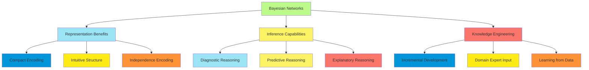
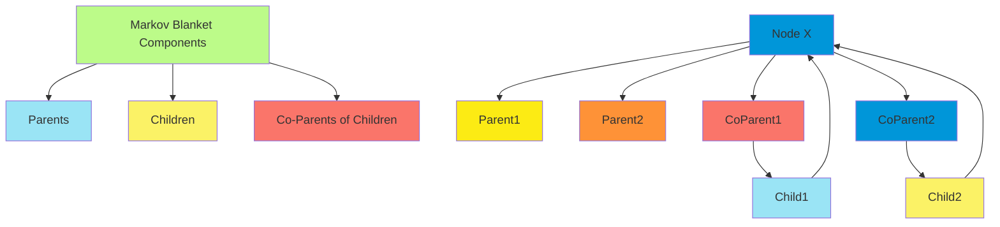
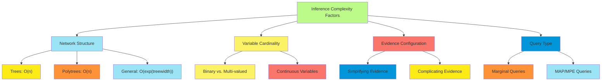
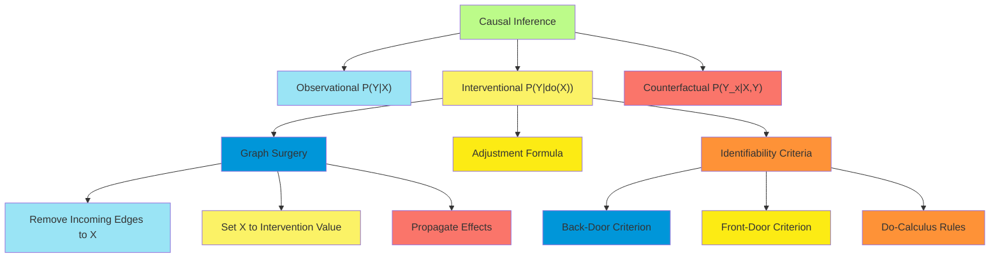

# C-12 | S-4: Probabilistic Reasoning

1. Representing Knowledge in an Uncertain Domain
    - Limitations of Propositional Approaches
    - Bayesian Networks as Knowledge Representation
    - Nodes, Arcs, and Conditional Probability Tables
    - Constructing Bayesian Networks from Causal Knowledge
2. The Semantics of Bayesian Networks
    - Representing the Full Joint Distribution
    - Conditional Independence in Bayesian Networks
    - D-Separation and Markov Blankets
    - Compact Representations of Conditional Distributions
3. Exact Inference in Bayesian Networks
    - Variable Elimination Algorithm
    - Factors and Factor Operations
    - Complexity of Exact Inference
    - Clustering Algorithms and Junction Trees
4. Approximate Inference for Bayesian Networks
    - Direct Sampling Methods
    - Rejection Sampling
    - Likelihood Weighting
    - Markov Chain Monte Carlo Methods
5. Causal Networks
    - Representing Actions with the Do-Operator
    - Interventions vs. Observations
    - The Back-Door Criterion
    - Counterfactual Reasoning

#### Representing Knowledge in an Uncertain Domain

##### Limitations of Propositional Approaches

Traditional propositional and first-order logic face significant limitations when representing knowledge in uncertain
domains. These limitations stem from their binary nature and inability to naturally represent degrees of belief.

The primary limitations include:

1. **Binary Truth Values**: Propositional logic constrains statements to be either true or false, without intermediate
   values. This binary approach fails to capture the nuanced uncertainty present in real-world situations where our
   knowledge is incomplete or imprecise.
2. **Monotonicity**: In classical logic, adding new information never invalidates previous conclusions. This property,
   while mathematically elegant, does not align with human reasoning where new evidence frequently causes belief
   revision.
3. **Handling Exceptions**: Logical approaches struggle with exceptions to general rules. While default reasoning and
   nonmonotonic logics attempt to address this issue, they lack the systematic quantitative framework that probability
   theory provides.
4. **Practical Inference**: For large-scale problems, the computational complexity of maintaining consistency in logical
   knowledge bases becomes prohibitive, especially when faced with noisy or incomplete data.
5. **Evidence Combination**: Propositional approaches lack natural mechanisms for combining multiple pieces of evidence,
   each with different degrees of reliability.

Consider a medical diagnosis example:

- Logical approach: "If fever AND cough, then possibly flu"
- Probabilistic approach: "P(flu | fever, cough) = 0.7"

The probabilistic statement naturally captures the inherent uncertainty in medical diagnosis, allowing for the
combination of symptoms with varying predictive power and the integration of prior knowledge about disease prevalence.

##### Bayesian Networks as Knowledge Representation

Bayesian networks (belief networks or Bayes nets) provide a powerful framework for representing probabilistic knowledge
that addresses the limitations of propositional approaches.

A Bayesian network is a directed acyclic graph (DAG) where:

- Nodes represent random variables
- Edges represent direct probabilistic influences between variables
- The network captures conditional independence relationships in the domain

Key advantages of Bayesian networks include:

1. **Intuitive Structure**: The graph structure often mirrors human understanding of causal relationships in the domain,
   making knowledge engineering more intuitive than specifying the full joint distribution directly.
2. **Compact Representation**: Rather than explicitly representing the full joint distribution requiring exponentially
   many parameters, Bayesian networks factorize the joint distribution using conditional probabilities, often requiring
   far fewer parameters.
3. **Modularity**: Local probability models can be modified without affecting the entire network, allowing for
   incremental knowledge base development and maintenance.
4. **Causal Interpretation**: The directional arcs often (though not necessarily) represent causal relationships,
   enabling the model to answer not just associational queries but also interventional and counterfactual questions.
5. **Transparent Reasoning**: The explicit representation of variables and their relationships allows for explanations
   of the reasoning process, unlike black-box approaches.



##### Nodes, Arcs, and Conditional Probability Tables

A Bayesian network consists of three fundamental components that together encode a complete probability distribution:

**Nodes (Variables):**

- Each node represents a random variable in the domain
- Variables can be discrete or continuous
- Examples: Disease (present/absent), Temperature (numeric), BloodType (A/B/AB/O)

**Arcs (Edges):**

- Directed edges between nodes indicate direct probabilistic influence
- An arc from X to Y indicates that X is a parent of Y (X directly influences Y)
- The absence of an arc encodes conditional independence assumptions
- Important: The graph must be acyclic (no directed cycles)

**Conditional Probability Tables (CPTs):**

- Each node contains a conditional probability table that quantifies the effect of parent nodes
- For a node X with parents Parents(X), the CPT specifies P(X | Parents(X))
- For discrete variables, the CPT contains a probability distribution over X for each possible combination of parent
  values
- Root nodes (those without parents) contain prior probability distributions P(X)

Example of a CPT for variable Fever with parent Disease:

| Disease | P(Fever=true | Disease) | P(Fever=false | Disease) |
|---------|------------------------|-------------------------| | Present | 0.9 | 0.1 | | Absent | 0.2 | 0.8 |

For a node with n binary parents, the CPT contains $2^n$ probability distributions, each with 2 values (that must sum to
1), leading to $2^n$ independent parameters.

The size of CPTs grows exponentially with the number of parents, which can be a limitation. However, various techniques
exist to represent CPTs compactly when there are specific patterns:

- Noisy-OR for multiple independent causes
- Context-specific independence
- Continuous parametric distributions
- Decision trees or rules

##### Constructing Bayesian Networks from Causal Knowledge

Constructing a Bayesian network involves determining the structure (variables and arcs) and the parameters (conditional
probabilities). The process typically follows these steps:

**1. Variable Identification:**

- Determine the relevant variables for the domain
- Define the state space for each variable (possible values)
- Consider observability and measurability of variables

**2. Structure Determination:**

- Identify dependencies between variables
- Establish a causal ordering of variables when possible
- Add arcs from causes to direct effects

A common approach for structure creation follows the causal ordering principle:

1. Order variables such that causes precede their effects
2. For each variable Xi, select parents as the minimal set of earlier variables that render Xi conditionally independent
   of all other earlier variables
3. Connect each variable to its parents and specify its CPT

**3. Parameter Specification:**

- For each variable, specify the conditional probability table given its parents
- Sources for parameter values include:
    - Expert knowledge
    - Statistical data
    - Machine learning from datasets
    - Literature and existing models

**Example: Medical Diagnosis Network Construction**

Consider constructing a simple network for diagnosing pneumonia:

1. Identify variables:
    - Disease (Pneumonia: present/absent)
    - Symptoms (Fever: high/normal, Cough: present/absent)
    - Test Results (X-ray: positive/negative)
    - Risk Factors (Age: young/adult/elderly, Smoking: yes/no)
2. Establish causal ordering:
    - Risk factors can cause disease
    - Disease causes symptoms and test results
    - Risk factors → Disease → Symptoms, Tests
3. Create structure:
    - Add arcs from Risk Factors (Age, Smoking) to Disease
    - Add arcs from Disease to Symptoms (Fever, Cough) and Tests (X-ray)
4. Specify CPTs:
    - P(Age), P(Smoking) - prior distributions
    - P(Disease | Age, Smoking) - disease probability given risk factors
    - P(Fever | Disease), P(Cough | Disease), P(X-ray | Disease) - manifestation probabilities

**Advantages of Causal Construction:**

- Intuitive for domain experts who understand cause-effect relationships
- Often results in more compact networks (fewer arcs)
- Supports answering interventional queries (what if we change X?)
- Generally more robust to changes in the population distribution

**Challenges in Network Construction:**

- Incomplete causal knowledge
- Hidden variables
- Cyclic causality (requires temporal unfolding)
- Subjective probability assessment
- Trade-off between model complexity and accuracy

A well-constructed Bayesian network provides a foundation for efficient probabilistic inference and decision-making
under uncertainty.

#### The Semantics of Bayesian Networks

##### Representing the Full Joint Distribution

A Bayesian network provides a compact representation of the full joint probability distribution over all variables in
the domain. This joint distribution can be reconstructed from the network using the chain rule for Bayesian networks.

**The Chain Rule for Bayesian Networks:**

For a Bayesian network with variables $X_1, X_2, ..., X_n$, the full joint distribution is given by:

$P(X_1, X_2, ..., X_n) = \prod_{i=1}^{n} P(X_i | Parents(X_i))$

This factorization is the fundamental property that enables Bayesian networks to represent complex probability
distributions compactly.

**Example Calculation:**

Consider a simple network with three variables: Cloudy (C), Sprinkler (S), and Wet Grass (W), with structure C → S, C →
W, S → W.

The full joint distribution would be: $P(C, S, W) = P(C) \times P(S|C) \times P(W|C,S)$

To compute the probability of a specific scenario, such as P(C=true, S=false, W=true), we simply substitute the values
from the CPTs: $P(C=true, S=false, W=true) = P(C=true) \times P(S=false|C=true) \times P(W=true|C=true, S=false)$

**Parameter Savings:**

The full joint distribution for n binary variables requires $2^n - 1$ independent parameters (one probability for each
possible combination of values, minus one because probabilities must sum to 1).

In contrast, a Bayesian network requires:

$\sum_{i=1}^{n} 2^{k_i} - 1$ parameters

where $k_i$ is the number of parents for variable $X_i$.

For a sparsely connected network where each node has at most k parents (k << n), this reduces to O(n·2^k) parameters
instead of O(2^n), an exponential reduction.

**Global Semantics vs. Local Semantics:**

Bayesian networks have dual interpretations:

1. **Global semantics**: The network specifies a complete joint probability distribution through factorization
2. **Local semantics**: Each node's CPT represents the causal or probabilistic influence of parent variables

This dual nature allows both global probabilistic reasoning and local causal interpretation, making Bayesian networks
powerful for both predictive and diagnostic reasoning.

##### Conditional Independence in Bayesian Networks

Conditional independence relationships are the core efficiency mechanism of Bayesian networks, reducing the number of
parameters needed and enabling efficient inference.

**Definition of Conditional Independence:**

Variables A and B are conditionally independent given C (denoted A ⊥ B | C) if:

$P(A, B | C) = P(A | C) \times P(B | C)$

Equivalently: $P(A | B, C) = P(A | C)$

This means once we know C, learning B provides no additional information about A.

**Conditional Independence in Bayesian Networks:**

The structure of a Bayesian network encodes conditional independence assumptions through what's known as the Markov
condition:

**Markov Condition:** Each variable Xi is conditionally independent of its non-descendants given its parents.

Formally, for any variable Xi in the network: Xi ⊥ NonDescendants(Xi) | Parents(Xi)

This means once we know the values of a variable's parents, the probability of that variable is not affected by any
other variables except possibly its descendants.

**Types of Conditional Independence Patterns:**

1. **Causal Chain:** X → Y → Z
    - X and Z are conditionally independent given Y
    - P(X, Z | Y) = P(X | Y) × P(Z | Y)
    - Example: Disease → Symptom → Treatment (knowing the symptom, the disease doesn't influence treatment choice)
2. **Common Cause:** X ← Y → Z
    - X and Z are conditionally independent given Y
    - P(X, Z | Y) = P(X | Y) × P(Z | Y)
    - Example: Flu → Fever, Flu → Fatigue (fever and fatigue are independent once we know about flu)
3. **Common Effect (v-structure):** X → Y ← Z
    - X and Z are marginally independent but become dependent when Y or any of Y's descendants are observed
    - This pattern is sometimes called "explaining away"
    - Example: Rain → WetGrass ← Sprinkler (rain and sprinkler are independent until we observe wet grass)

**Inferring Independence from Network Structure:**

The conditional independence relationships encoded in a Bayesian network go beyond those directly expressed by the
Markov condition. The complete set of independence relationships can be derived using d-separation (discussed in the
next section).

Understanding conditional independence is crucial for both constructing appropriate network structures and for
developing efficient inference algorithms that exploit these independence properties.

##### D-Separation and Markov Blankets

D-separation (directional separation) provides a graphical criterion for determining conditional independence
relationships from a Bayesian network structure, without analyzing the numerical probabilities.

**D-Separation Definition:**

Two sets of variables X and Y are d-separated by a third set Z if every path between X and Y is blocked given Z. A path
is blocked if it includes a node such that either:

1. The node is in Z and has one arrow on the path entering it and one leaving it (causal chain) or both arriving at it
   (common cause), or
2. The node is not in Z nor has any descendants in Z, and both arrows on the path leave it (common effect or
   v-structure)

If X and Y are d-separated by Z, then X and Y are conditionally independent given Z.

**Path Blocking Rules:**

1. **Causal Chain:** X → Z → Y
    - Path is blocked if Z is observed
    - X ⊥ Y | Z
2. **Common Cause:** X ← Z → Y
    - Path is blocked if Z is observed
    - X ⊥ Y | Z
3. **Common Effect (v-structure):** X → Z ← Y
    - Path is blocked if neither Z nor any of Z's descendants are observed
    - Path is unblocked if Z or any descendant of Z is observed
    - X and Y are dependent given Z even if they were independent before

**Determining D-Separation:**

To determine if sets X and Y are d-separated by set Z:

1. Enumerate all undirected paths between any node in X and any node in Y
2. Check if each path is blocked according to the rules above
3. If all paths are blocked, X and Y are d-separated by Z

**Markov Blanket:**

The Markov blanket of a node X is the minimal set of variables that, when observed, make X conditionally independent of
all other variables in the network.

For a node X, its Markov blanket consists of:

1. X's parents
2. X's children
3. The other parents of X's children (co-parents)

Formally, if MB(X) is the Markov blanket of X: X ⊥ (V - MB(X) - {X}) | MB(X)

Where V is the set of all variables in the network.



**Importance of D-Separation and Markov Blankets:**

1. **Efficiency in Inference:** Knowledge of d-separation allows inference algorithms to ignore irrelevant variables
2. **Localized Reasoning:** The Markov blanket defines the local neighborhood relevant for predictions about a variable
3. **Feature Selection:** In machine learning, the Markov blanket provides a principled approach to selecting relevant
   features
4. **Modular Network Construction:** Understanding d-separation helps in designing networks with appropriate
   independence properties

D-separation provides the theoretical foundation for determining all conditional independence relationships entailed by
a Bayesian network structure, forming the basis for efficient inference algorithms.

##### Compact Representations of Conditional Distributions

As the number of parents of a node increases, the size of its conditional probability table (CPT) grows exponentially.
Several compact representations address this challenge by exploiting patterns in the probability distributions.

**Noisy-OR Model:**

The noisy-OR model applies when multiple causes independently contribute to a binary effect. If each cause Xi has
probability qi of being "sufficient" to produce effect Y when all other causes are absent, then:

$P(Y = false | X_1, X_2, ..., X_n) = \prod_{i: X_i = true} (1 - q_i)$

This reduces the number of parameters from 2^n to n, representing each cause's individual strength.

Example: Disease can be caused by multiple independent factors (Genetics, Environment, Lifestyle). Instead of specifying
probabilities for all 2^3 combinations, noisy-OR requires only 3 parameters.

**Noisy-AND Model:**

The noisy-AND model applies when multiple conditions must be simultaneously satisfied for an effect to occur, but each
condition can be "bypassed" with some probability:

$P(Y = true | X_1, X_2, ..., X_n) = \prod_{i: X_i = true} q_i$

**Context-Specific Independence:**

Context-specific independence occurs when variables become independent in specific contexts (specific values of other
variables).

Example: In a car diagnostic network, the relationship between battery age and starter function may depend on whether
the ignition circuit is intact:

- If circuit intact: P(StarterWorks | BatteryAge, CircuitIntact=true) = P(StarterWorks | BatteryAge)
- If circuit broken: P(StarterWorks | BatteryAge, CircuitIntact=false) = 0

**Canonical Distributions for Continuous Variables:**

For continuous variables, compact parametric forms include:

1. **Linear Gaussian:** $P(Y | X_1, X_2, ..., X_n) = \mathcal{N}(w_0 + w_1X_1 + ... + w_nX_n, \sigma^2)$

    The mean of Y is a linear function of the parents, with constant variance.

2. **Conditional Linear Gaussian:** For discrete parents D and continuous parents C:
   $P(Y | D=d, C) = \mathcal{N}(w_{0,d} + w_{1,d}C_1 + ... + w_{n,d}C_n, \sigma_d^2)$

    Different linear models apply for different values of discrete parents.

**Decision Trees and Rule-Based Representations:**

Decision trees can represent CPTs by partitioning the parent configuration space:

- Each path in the tree represents a specific context
- Leaves contain probability distributions for that context
- Enables capturing context-specific independencies efficiently

**Parametric Models:**

Specialized parametric models for specific domains include:

- Sigmoid functions for threshold effects
- Softmax functions for competitive inhibition
- Dirichlet distributions for multinomial parameters

**Benefits of Compact Representations:**

1. **Reduced Parameter Space:** Fewer parameters to specify or learn
2. **Improved Generalization:** Less prone to overfitting when learning from data
3. **Computational Efficiency:** More efficient inference algorithms
4. **Interpretability:** Often more understandable for domain experts
5. **Knowledge Engineering:** Easier to elicit from experts in terms of causal mechanisms

These compact representations significantly extend the practical applicability of Bayesian networks to domains with
complex dependency structures.

#### Exact Inference in Bayesian Networks

##### Variable Elimination Algorithm

Variable elimination is a fundamental algorithm for exact inference in Bayesian networks, efficiently computing
conditional probabilities by eliminating variables one by one.

**Query Types in Bayesian Networks:**

1. **Conditional Probability Queries:** P(X | E=e) - probability distribution of query variables X given evidence E=e
2. **Most Probable Explanation (MPE):** argmax_y P(Y=y | E=e) - most likely assignment to variables Y given evidence
3. **Maximum a Posteriori (MAP):** argmax_y P(Y=y | E=e) - most likely assignment to a subset of variables Y

Variable elimination addresses the first type: computing conditional probabilities.

**The Basic Algorithm:**

1. Express the query in terms of the joint distribution
2. Use the factorization provided by the Bayesian network
3. For each non-query, non-evidence variable Z (hidden variables): a. Push summations inward as far as possible b.
   Compute new factors by multiplying factors containing Z c. Sum out Z from the resulting factor
4. Multiply remaining factors and normalize

**Key Steps in Detail:**

For computing P(X | E=e):

1. **Express as joint probability:** $P(X | E=e) = \alpha P(X, E=e) = \alpha \sum_Y P(X, Y, E=e)$

    where Y represents all non-query, non-evidence variables and α is a normalization constant.

2. **Apply factorization:** $P(X, Y, E=e) = \prod_i P(Z_i | Parents(Z_i))$

    where each Z_i is instantiated according to its value in X, Y, or E=e.

3. **Variable elimination process:** For each variable Y_j to be eliminated:

    - Identify all factors containing Y_j
    - Multiply these factors to create a new factor
    - Sum out Y_j from this factor
    - Replace the original factors with this new reduced factor

4. **Finalize:**

    - Multiply all remaining factors
    - Normalize to get P(X | E=e)

**Example Application:**

For a simple network Cloudy → Sprinkler → WetGrass ← Rain, to compute P(Sprinkler | WetGrass=true):

1. Express as joint probability: $P(S | W=true) = \alpha \sum_{C,R} P(C, S, R, W=true)$
2. Apply factorization: $P(C, S, R, W=true) = P(C) \times P(S|C) \times P(R|C) \times P(W=true|S,R)$
3. Eliminate variables:
    - Eliminate R: Create $f_1(C,S) = \sum_R P(R|C) \times P(W=true|S,R)$
    - Eliminate C: Create $f_2(S) = \sum_C P(C) \times P(S|C) \times f_1(C,S)$
4. Result: $P(S | W=true) = \alpha f_2(S)$

**Optimization: Variable Elimination Ordering:**

The order in which variables are eliminated significantly affects computational efficiency. Finding the optimal ordering
is NP-hard, but heuristics include:

- Min-neighbors: Eliminate the variable that appears in the fewest factors
- Min-fill: Eliminate the variable that adds the fewest new edges to the graph
- Weighted min-fill: Consider the size of the resulting factors

A good elimination ordering can make the difference between practical and impractical inference for complex networks.

##### Factors and Factor Operations

Factors provide a flexible framework for representing and manipulating probability distributions during inference in
Bayesian networks.

**Definition of Factors:**

A factor φ is a function that maps from a set of variables to real numbers: φ(X₁, X₂, ..., Xₙ) → ℝ

Factors generalize probability distributions, conditional probability tables, and intermediate results during inference.

**Types of Factors in Bayesian Networks:**

1. **Prior Factors:** Represent prior probabilities P(X) for root nodes
2. **Conditional Factors:** Represent conditional probabilities P(X | Parents(X))
3. **Joint Factors:** Represent joint distributions over multiple variables
4. **Intermediate Factors:** Created during inference by operations on other factors

**Basic Factor Operations:**

1. **Factor Restriction (Evidence Application):**
    - Reduces a factor by fixing specific variables to observed values
    - If φ(X,Y) is a factor and Y=y is observed, the restriction is φ(X,Y=y)
    - Effectively "slices" the factor table, reducing its dimensionality
2. **Factor Multiplication:**
    - Combines information from multiple factors
    - If φ₁(X,Y) and φ₂(Y,Z) are factors, their product is φ₃(X,Y,Z) = φ₁(X,Y) × φ₂(Y,Z)
    - For each assignment to X,Y,Z, multiply the corresponding values from φ₁ and φ₂
    - Creates a factor over the union of variables in the input factors
3. **Factor Marginalization (Summing Out):**
    - Eliminates a variable by summing over all its values
    - If φ(X,Y) is a factor, summing out Y gives φ'(X) = ∑ᵧ φ(X,Y)
    - Reduces dimensionality by removing the summed-out variable
4. **Factor Normalization:**
    - Scales factor values to sum to 1 (for probability distributions)
    - If φ(X) is a factor, its normalized version is φ'(X) = φ(X) / ∑ₓ φ(X)
    - Applied at the end of inference to obtain proper conditional probabilities

**Example of Factor Operations:**

Consider factors φ₁(A,B) and φ₂(B,C) with binary variables:

Factor φ₁(A,B):

| A   | B   | φ₁(A,B) |
| --- | --- | ------- |
| 0   | 0   | 0.3     |
| 0   | 1   | 0.2     |
| 1   | 0   | 0.1     |
| 1   | 1   | 0.4     |

Factor φ₂(B,C):

| B   | C   | φ₂(B,C) |
| --- | --- | ------- |
| 0   | 0   | 0.2     |
| 0   | 1   | 0.3     |
| 1   | 0   | 0.4     |
| 1   | 1   | 0.1     |

1. **Multiplication** φ₃(A,B,C) = φ₁(A,B) × φ₂(B,C):

    | A   | B   | C   | φ₃(A,B,C) |
    | --- | --- | --- | --------- |
    | 0   | 0   | 0   | 0.06      |
    | 0   | 0   | 1   | 0.09      |
    | 0   | 1   | 0   | 0.08      |
    | 0   | 1   | 1   | 0.02      |
    | 1   | 0   | 0   | 0.02      |
    | 1   | 0   | 1   | 0.03      |
    | 1   | 1   | 0   | 0.16      |
    | 1   | 1   | 1   | 0.04      |

2. **Summing out B** φ₄(A,C) = ∑ᵦ φ₃(A,B,C):

    | A   | C   | φ₄(A,C) |
    | --- | --- | ------- |
    | 0   | 0   | 0.14    |
    | 0   | 1   | 0.11    |
    | 1   | 0   | 0.18    |
    | 1   | 1   | 0.07    |

3. **Normalization** φ₅(A,C) = φ₄(A,C) / ∑ₐ,ₖ φ₄(A,C): Normalization constant: 0.14 + 0.11 + 0.18 + 0.07 = 0.5

    | A   | C   | φ₅(A,C) |
    | --- | --- | ------- |
    | 0   | 0   | 0.28    |
    | 0   | 1   | 0.22    |
    | 1   | 0   | 0.36    |
    | 1   | 1   | 0.14    |

**Factor Implementation Considerations:**

1. **Representation:** Factors can be implemented as multi-dimensional arrays, sparse tables, or algebraic decision
   diagrams
2. **Computational Optimization:** Lazy evaluation, caching, and exploiting symmetries to reduce computation
3. **Numerical Stability:** Using log-space computations to avoid numerical underflow with very small probabilities

Factors provide the computational foundation for exact inference algorithms in Bayesian networks, enabling systematic
manipulation of probability distributions during variable elimination and other inference methods.

##### Complexity of Exact Inference

The computational complexity of exact inference in Bayesian networks is a critical consideration that determines the
practical applicability of these models to real-world problems.

**Theoretical Complexity Results:**

1. **General Hardness:** Exact inference in Bayesian networks is #P-complete in the general case, making it intractable
   for arbitrary networks.
2. **Worst-Case Complexity:** For a network with n variables each with at most k values, and where each variable has at
   most p parents, naive inference requires O(k^n) time.
3. **Variable Elimination Complexity:** The complexity of variable elimination is determined by the size of the largest
   factor created during inference, which depends on:
    - Network structure
    - Evidence configuration
    - Variable elimination ordering

**Treewidth as a Complexity Measure:**

The complexity of exact inference is fundamentally tied to a graph-theoretical property called treewidth:

- **Definition:** The treewidth of a graph is the size of the largest clique in an optimal tree decomposition minus one.
- **Significance:** Inference complexity is exponential in the treewidth.
- **Bounded Treewidth:** Networks with bounded treewidth (regardless of the number of nodes) allow inference in linear
  time.

**Factors Affecting Computational Complexity:**

1. **Network Structure:**
    - Tree-structured networks: Linear complexity O(n)
    - Polytrees (singly-connected networks): Linear complexity O(n)
    - Multiply-connected networks: Complexity depends on treewidth
    - Densely connected networks: Potentially exponential complexity
2. **Variable Cardinality:**
    - Binary variables vs. high-cardinality variables
    - Continuous variables requiring discretization or special handling
3. **Evidence Configuration:**
    - Some evidence patterns can simplify inference (d-separation)
    - Other patterns can make inference harder (explaining away)
4. **Query Type:**
    - Single variable marginal queries vs. joint distribution queries
    - MAP/MPE queries (finding most probable explanations) are typically harder

**Strategies for Managing Complexity:**

1. **Network Structure Engineering:**
    - Design networks with lower treewidth when possible
    - Introduce additional independence assumptions to simplify structure
2. **Variable Elimination Ordering Optimization:**
    - Use heuristics like min-fill, min-weight, or min-neighbors
    - Pre-compute good elimination orderings for repeated queries
3. **Exploiting Local Structure:**
    - Use compact factor representations (noisy-OR, decision trees)
    - Leverage context-specific independence
4. **Approximate Inference:**
    - When exact inference is infeasible, switch to sampling-based methods
    - Accept bounded error in exchange for tractability

**Example Complexity Analysis:**

Consider a simple chain A → B → C → D:

- Variable elimination requires only local computations
- Largest factor involves just two variables at a time
- Time complexity: O(n·k²) where n is the number of variables and k is the maximum domain size

Now consider a fully connected network A ↔ B ↔ C ↔ D (all nodes connected to each other):

- Variable elimination creates factors over all variables
- Time complexity: O(k^n)
- The difference between O(n·k²) and O(k^n) is the difference between tractable and intractable

Understanding these complexity considerations is essential for designing practical Bayesian network applications and
choosing appropriate inference methods based on the problem structure.



##### Clustering Algorithms and Junction Trees

Clustering algorithms provide a systematic approach to exact inference in Bayesian networks by transforming the original
network into a secondary structure called a junction tree (or clique tree) that supports efficient computations.

**The Junction Tree Algorithm:**

The algorithm proceeds in four main phases:

1. **Moralization:** Convert the directed graph to an undirected graph by connecting parents and removing directionality
2. **Triangulation:** Add edges to ensure the graph has no cycles of length greater than three without chords
3. **Junction Tree Construction:** Build a tree where nodes are maximal cliques of the triangulated graph
4. **Message Passing:** Perform belief propagation on the junction tree to compute marginals

**Phase 1: Moralization**

- Create an undirected graph by dropping edge directions
- For each node, add undirected edges between all pairs of its parents (if not already present)
- This step ensures that each node and its parents form a complete subgraph

**Phase 2: Triangulation**

- Add edges to the moral graph to ensure it is chordal (every cycle of length > 3 has a chord)
- Finding the optimal triangulation (minimizing clique size) is NP-hard
- Heuristics include minimum fill-in and minimum degree ordering
- The quality of triangulation directly impacts computational efficiency

**Phase 3: Junction Tree Construction**

- Identify all maximal cliques in the triangulated graph
- Create a tree where nodes are these maximal cliques
- The edges must satisfy the running intersection property: if a variable appears in two cliques, it must appear in all
  cliques on the path between them
- This property ensures consistent beliefs can be maintained across the tree

**Phase 4: Message Passing (Belief Propagation)**

- Initialize clique potentials from the original Bayesian network factors
- Perform message passing between adjacent cliques until convergence
- The message from clique $C_i$ to $C_j$ is:
  $\mu_{i→j}(S_{ij}) = \sum_{C_i \setminus S_{ij}} \phi_i(C_i) \prod_{k \in N(i) \setminus j} \mu_{k→i}(S_{ik})$ where
  $S_{ij}$ is the separator set between cliques $i$ and $j$
- After convergence, the marginal for any variable can be computed from any clique containing it

**Advantages of Junction Tree Algorithm:**

1. **Generality:** Works for any Bayesian network structure
2. **Efficiency:** Polynomial in the size of the largest clique
3. **Multiple Queries:** After initialization, can efficiently answer multiple queries
4. **Message Reuse:** Updates can be localized when evidence changes

**Complexity Analysis:**

- Time complexity: $O(n \cdot k^w)$ where $n$ is the number of variables, $k$ is the maximum domain size, and $w$ is the
  width of the junction tree (size of largest clique minus 1)
- Space complexity: $O(n \cdot k^w)$ to store all clique potentials

**Variants and Optimizations:**

1. **Lazy Propagation:** Delays combination of potentials until needed
2. **Hugin Architecture:** Uses a different message passing scheme with separator potentials
3. **Variable Elimination with Cliques:** Uses cliques to guide variable elimination ordering
4. **Incremental Junction Tree:** Efficiently updates beliefs when evidence changes

The junction tree algorithm represents a systematic approach to exact inference that exploits the graphical structure of
the network to minimize computational complexity, making it a foundational technique for practical Bayesian network
systems.

#### Approximate Inference for Bayesian Networks

##### Direct Sampling Methods

When exact inference becomes computationally intractable, approximate inference methods provide practical alternatives.
Direct sampling is the simplest form of approximate inference based on generating random samples from the joint
distribution.

**Basic Principles of Sampling:**

Sampling methods approximate probabilities by generating random instances from the joint distribution and counting the
frequency of events of interest:

$P(X=x | e) \approx \frac{Count(X=x, e)}{Count(e)}$

Where $Count(X=x, e)$ is the number of samples where $X=x$ and evidence $e$ holds, and $Count(e)$ is the number of
samples consistent with evidence $e$.

**Prior Sampling (Forward Sampling):**

The simplest sampling algorithm follows these steps:

1. Order the variables according to the network topology (parents before children)
2. For each variable in order:
    - Sample its value based on its conditional probability given the already-sampled values of its parents
3. Count the frequency of the query configuration in the generated samples

**Algorithm:**

```
function PRIOR-SAMPLE(bn) returns a sample event
  x ← an event with n empty values
  for i = 1 to n do
    x[i] ← a random sample from P(Xi | parents(Xi))
  return x
```

**Estimating Probabilities:** To estimate $P(X|e)$ using N samples:

1. Generate N random samples from the network
2. Count $N_{X,e}$ (samples matching both X and e) and $N_e$ (samples matching evidence e)
3. Return the estimate: $P(X|e) \approx N_{X,e} / N_e$

**Theoretical Properties:**

1. **Unbiasedness:** The expected value of the estimate equals the true probability
2. **Consistency:** As the number of samples approaches infinity, the estimate converges to the true probability
3. **Variance:** Proportional to $1/N$ where N is the number of samples
4. **Confidence Intervals:** Can be computed using binomial distribution properties

**Practical Limitations:**

1. **Evidence Rejection:** When evidence has low probability, most samples will be rejected, leading to inefficient
   estimation
2. **Rare Events:** Probabilities of rare events require many samples for accurate estimation
3. **Deterministic Relationships:** Zero-probability configurations can cause problems
4. **Complex Posterior Distributions:** Multimodal or strongly peaked posteriors can be difficult to sample effectively

**Sample Complexity:**

The number of samples required for a given accuracy depends on:

- Desired error bound $\epsilon$
- Confidence level $(1-\delta)$
- Probability being estimated $p$

Using Hoeffding's inequality, with probability at least $(1-\delta)$, the error is at most $\epsilon$ if:

$N \geq \frac{1}{2\epsilon^2} \ln \frac{2}{\delta}$

This shows that sample complexity scales as $O(1/\epsilon^2)$, independent of the network size but dependent on the
accuracy requirements.

Direct sampling provides the foundation for more sophisticated sampling methods that address its limitations,
particularly when dealing with evidence.

##### Rejection Sampling

Rejection sampling improves upon direct sampling by focusing on samples consistent with observed evidence, though it can
still be inefficient when evidence has low probability.

**Basic Approach:**

1. Generate samples from the prior distribution as in direct sampling
2. Reject any samples inconsistent with the observed evidence
3. Use only the accepted samples to estimate the query probability

**Algorithm:**

```
function REJECTION-SAMPLING(X, e, bn, N) returns an estimate of P(X|e)
  counts ← a vector of zeros for each value of X
  for j = 1 to N do
    x ← PRIOR-SAMPLE(bn)
    if x is consistent with e then
      counts[x[X]] ← counts[x[X]] + 1
  return NORMALIZE(counts)
```

**Estimation Formula:** $P(X=x|e) \approx \frac{Count(X=x, e)}{Count(e)}$

where Count(e) is the number of samples consistent with evidence e.

**Advantages:**

1. **Simplicity:** Easy to implement and understand
2. **Correctness:** Provides unbiased estimates of the conditional probability
3. **Anytime Algorithm:** Can provide estimates after any number of samples, with accuracy improving over time

**Efficiency Analysis:**

The efficiency of rejection sampling depends critically on the probability of the evidence:

- If P(e) is small, most samples will be rejected
- Expected number of samples needed: N/P(e)
- For evidence with probability 0.01, approximately 100 times more samples are needed compared to direct sampling

**Example Application:**

Consider a simple network: Cloudy(C) → Sprinkler(S), Cloudy(C) → Rain(R), Sprinkler(S) → WetGrass(W), Rain(R) →
WetGrass(W)

To estimate P(Rain|WetGrass=true):

1. Generate samples for C, S, R, W in topological order
2. Reject samples where W ≠ true
3. Count the frequency of R=true in the remaining samples

**Rejection Handling:**

In practice, two approaches handle rejected samples:

1. **Generate until accept:** Continue generating samples until N valid samples are collected
2. **Fixed total samples:** Generate a fixed number of total samples and use whatever valid samples result

The first approach ensures a fixed number of valid samples but has unbounded runtime, while the second has fixed runtime
but variable accuracy.

**Practical Considerations:**

1. **Multiple Evidence Variables:** The rejection rate increases exponentially with the number of evidence variables
2. **Zero Probability Evidence:** If evidence has zero probability in the model, all samples will be rejected
3. **Adaptive Sampling:** Sample size can be increased until desired confidence intervals are achieved
4. **Early Rejection:** Reject samples as soon as they violate evidence constraints

Rejection sampling works well when evidence probability is not too low, but becomes impractical for rare evidence
configurations, motivating more sophisticated methods like likelihood weighting and MCMC.

##### Likelihood Weighting

Likelihood weighting addresses the inefficiency of rejection sampling by generating only samples consistent with the
evidence, then adjusting their weight to ensure unbiased probability estimates.

**Basic Approach:**

1. Fix evidence variables to their observed values (no rejection needed)
2. Sample only the non-evidence variables
3. Weight each sample by the likelihood of the evidence given the sampled variables
4. Use the weighted samples to estimate the query probability

**Algorithm:**

```
function LIKELIHOOD-WEIGHTING(X, e, bn, N) returns an estimate of P(X|e)
  W ← a vector of zeros for each value of X
  for j = 1 to N do
    (x, w) ← WEIGHTED-SAMPLE(bn, e)
    W[x[X]] ← W[x[X]] + w
  return NORMALIZE(W)

function WEIGHTED-SAMPLE(bn, e) returns an event and a weight
  x ← an event with n empty values
  w ← 1
  for i = 1 to n do
    if Xi is an evidence variable with value ei in e then
      x[i] ← ei
      w ← w × P(Xi=ei | parents(Xi))
    else
      x[i] ← a random sample from P(Xi | parents(Xi))
  return (x, w)
```

**Weight Calculation:**

The weight of a sample is the product of conditional probabilities of the evidence variables given their parents:

$w = \prod_{i: X_i \in E} P(X_i = e_i | parents(X_i))$

This weight represents how likely the evidence would be given the sampled values of the non-evidence variables.

**Estimation Formula:**

$P(X=x|e) \approx \frac{\sum_{j: x_j[X]=x} w_j}{\sum_j w_j}$

where $w_j$ is the weight of the j-th sample.

**Advantages:**

1. **No Rejection:** Every sample contributes to the estimate
2. **Efficiency:** More efficient than rejection sampling, especially when evidence has low probability
3. **Simplicity:** Relatively easy to implement
4. **Adaptive:** Can focus computational resources on important regions of the distribution

**Theoretical Properties:**

1. **Unbiasedness:** The expected value of the estimate equals the true probability
2. **Consistency:** As the number of samples approaches infinity, the estimate converges to the true probability
3. **Variance Reduction:** Generally provides lower variance estimates than rejection sampling for the same number of
   samples

**Limitations:**

1. **Evidence Ordering:** Performance depends on the position of evidence variables in the network
2. **Weight Degeneracy:** Can produce a few samples with very high weights dominating the estimate
3. **Sequential Effects:** Evidence variables far down in the sampling order receive limited benefit
4. **Deterministic CPTs:** Cannot handle deterministic relationships effectively

**Practical Considerations:**

1. **Effective Sample Size (ESS):** Measure of the quality of weighted samples
   $ESS = \frac{(\sum_i w_i)^2}{\sum_i w_i^2}$ Lower ESS indicates more weight concentrated in fewer samples
2. **Optimization:** Order the network to sample evidence variables later when possible
3. **Combining with Other Methods:** Can be used as a proposal distribution for more advanced methods
4. **Incremental Computation:** Estimates can be updated incrementally as new samples arrive

Likelihood weighting represents a middle ground between the simplicity of rejection sampling and the power of MCMC
methods, making it a popular choice for many practical applications.

##### Markov Chain Monte Carlo Methods

Markov Chain Monte Carlo (MCMC) methods provide powerful techniques for sampling from complex probability distributions,
overcoming many limitations of simpler sampling methods.

**Basic Principle:**

MCMC generates samples by constructing a Markov chain whose stationary distribution is the desired posterior
distribution. After the chain "mixes" (reaches its stationary distribution), the states visited by the chain serve as
samples from the target distribution.

**Gibbs Sampling:**

Gibbs sampling is a popular MCMC method for Bayesian networks:

1. Start with arbitrary values for non-evidence variables (consistent with evidence)
2. Repeatedly resample each non-evidence variable conditioned on the current values of all other variables
3. After a "burn-in" period, use the states as samples from the posterior distribution

**Algorithm:**

```
function GIBBS-SAMPLING(X, e, bn, N) returns an estimate of P(X|e)
  Z ← non-evidence variables in bn
  x ← an event with values for all variables, consistent with e
  counts ← a vector of zeros for each value of X
  for j = 1 to N do
    for each Zi in Z do
      sample value for Zi from P(Zi | mb(Zi)) given current values of MB(Zi)
    counts[x[X]] ← counts[x[X]] + 1
  return NORMALIZE(counts)
```

where MB(Zi) is the Markov blanket of variable Zi (its parents, children, and the other parents of its children).

**Markov Blanket Sampling:**

A key insight enabling efficient Gibbs sampling is that:

$P(Z_i | Z_{-i}, e) = P(Z_i | MB(Z_i), e)$

This means each variable can be resampled based only on its Markov blanket, not the entire network.

**Properties of MCMC Methods:**

1. **Irreducibility:** The Markov chain must be able to reach any state from any other state
2. **Aperiodicity:** The chain should not cycle through states in a fixed pattern
3. **Detailed Balance:** Satisfying detailed balance ensures the desired distribution is stationary
4. **Ergodicity:** As sampling time increases, the distribution of samples approaches the target distribution

**Metropolis-Hastings Algorithm:**

A more general MCMC approach that can be applied to arbitrary distributions:

1. Start with an initial state x
2. Propose a new state x' from a proposal distribution Q(x'|x)
3. Accept the new state with probability: $a = \min(1, \frac{P(x')Q(x|x')}{P(x)Q(x'|x)})$
4. If accepted, move to x'; otherwise, stay at x
5. Repeat steps 2-4

Gibbs sampling is a special case of Metropolis-Hastings with a specific proposal distribution.

**Practical Considerations:**

1. **Burn-in Period:** Initial samples are discarded until the chain approaches the stationary distribution

2. **Thinning:** Taking every k-th sample to reduce autocorrelation between samples

3. Convergence Diagnostics:

    Methods to determine if the chain has mixed properly

    - Gelman-Rubin statistic (multiple chains)
    - Autocorrelation analysis
    - Visual inspection of trace plots

4. **Multi-Chain Approaches:** Running multiple chains from different starting points

**Advantages of MCMC:**

1. **Handles Complex Posteriors:** Effective for multimodal, high-dimensional, or strongly correlated distributions
2. **Evidence Handling:** No explicit rejection of samples due to evidence
3. **Scalability:** Performance often scales well with network size and complexity
4. **Adaptivity:** Can concentrate samples in high-probability regions

**Limitations:**

1. **Convergence Assessment:** Difficult to determine when the chain has converged
2. **Correlation Between Samples:** Successive samples are not independent
3. **Parameter Tuning:** May require careful tuning of proposal distributions
4. **Trapped Modes:** Can get stuck in local modes for multimodal distributions

MCMC methods represent the most powerful and flexible approaches to approximate inference in Bayesian networks, though
they require more careful implementation and monitoring than simpler sampling techniques.

#### Causal Networks

##### Representing Actions with the Do-Operator

Causal Bayesian networks extend standard Bayesian networks by explicitly representing causal relationships, allowing
reasoning about interventions (actions) rather than just observations.

**Causal vs. Associational Bayesian Networks:**

- **Associational (Standard) BNs:** Encode joint probability distributions and support reasoning about observations
- **Causal BNs:** Additionally support reasoning about interventions that change the system being modeled

**The Do-Operator:**

Introduced by Judea Pearl, the do-operator formalizes interventions in causal networks:

- $P(Y|do(X=x))$ represents the probability of Y when X is forcibly set to value x
- This differs from the observational conditional probability $P(Y|X=x)$
- The do-operator represents an external intervention that breaks the normal causal mechanisms determining X

**Mathematical Representation:**

The effect of do(X=x) is modeled by:

1. Removing all incoming arrows to X in the graph
2. Setting X to the value x
3. Keeping all other causal mechanisms (conditional probabilities) unchanged

This operation generates a "mutilated" graph representing the post-intervention world.

**Calculating Intervention Effects:**

For a causal Bayesian network, the probability distribution after intervention do(X=x) is:

$P(Y_1, Y_2, ..., Y_n | do(X=x)) = \prod_{i: Y_i \neq X} P(Y_i | Parents(Y_i))$ with X set to x

This formula is known as the **truncated factorization**, representing the causal mechanisms that remain in effect after
the intervention.

**Example Application:**

Consider a causal network for a medical domain: Smoking → Cancer → Cough

To calculate the effect of stopping smoking:

- $P(Cough|do(Smoking=false))$ requires removing incoming edges to Smoking
- This differs from $P(Cough|Smoking=false)$, which might be affected by confounders

**Identifiability:**

An important question is whether causal effects can be identified from observational data:

- An effect is identifiable if it can be computed from the observed probability distribution
- Some effects require additional assumptions or experimental data
- The field of causal inference provides rules and algorithms for determining identifiability

**Back-Door and Front-Door Criteria:**

Pearl developed criteria for identifying when causal effects can be computed from observational data:

- The back-door criterion identifies sets of variables that block "back-door paths" between treatment and outcome
- The front-door criterion provides an alternative when back-door adjustment is not possible

**Implementation in Inference:**

To compute $P(Y|do(X=x))$ using a Bayesian network inference engine:

1. Create a modified network by removing incoming edges to X
2. Set X to value x as evidence
3. Perform standard Bayesian network inference to calculate the distribution of Y



##### Interventions vs. Observations

Understanding the distinction between interventions and observations is crucial for correct causal reasoning, as they
lead to fundamentally different probability updates.

**Fundamental Distinction:**

- **Observation (Seeing):** Learning that a variable X takes value x
    - Updates beliefs according to Bayes' rule
    - Evidence propagates both forward and backward in the network
    - Represented by standard conditional probability: $P(Y|X=x)$
- **Intervention (Doing):** Forcing a variable X to take value x
    - Breaks the causal mechanisms determining X
    - Evidence propagates only forward from the intervention
    - Represented by do-operator: $P(Y|do(X=x))$

**Example Illustration:**

Consider a simple causal chain: Rain → Sprinkler → WetGrass

1. **Observation scenario:** You observe that the sprinkler is on.
    - Updates beliefs about Rain (backward inference): $P(Rain|Sprinkler=on)$
    - Updates beliefs about WetGrass (forward inference): $P(WetGrass|Sprinkler=on)$
2. **Intervention scenario:** You manually turn the sprinkler on.
    - Does not update beliefs about Rain: $P(Rain|do(Sprinkler=on)) = P(Rain)$
    - Updates beliefs about WetGrass (forward inference): $P(WetGrass|do(Sprinkler=on))$

**The Adjustment Formula:**

In many cases, interventional probabilities can be computed from observational probabilities using the adjustment
formula:

$P(Y|do(X=x)) = \sum_z P(Y|X=x, Z=z) P(Z=z)$

Where Z is a set of variables satisfying the back-door criterion (blocking all back-door paths from X to Y).

**Simpson's Paradox:**

A classic example showing the importance of distinguishing interventions from observations:

- Treatment might appear beneficial in the overall population: $P(Recovery|Treatment=yes) > P(Recovery|Treatment=no)$
- But harmful in each subpopulation: $P(Recovery|Treatment=yes, Severity=low) < P(Recovery|Treatment=no, Severity=low)$
  and similarly for high severity
- The paradox occurs when treatment assignment is influenced by a confounder (severity)
- The causal effect $P(Recovery|do(Treatment=yes))$ correctly represents the treatment's actual efficacy

**Practical Implications:**

1. **Policy Decisions:** Should be based on interventional probabilities, not just observational associations
2. **Experimental Design:** Randomized controlled trials provide direct measurements of interventional probabilities
3. **Predictive vs. Causal Models:** Predictive models based on associations may not correctly predict intervention
   outcomes
4. **Automatic Control Systems:** Must model the effects of their actions as interventions, not observations

**Common Pitfalls:**

1. **Confounding Bias:** Failing to adjust for common causes
2. **Selection Bias:** Conditioning on colliders (common effects)
3. **Ecological Fallacy:** Inferring individual-level causal effects from group-level associations
4. **Retrospective Analysis:** Inferring causal effects from non-randomized historical data

Understanding when to use observational vs. interventional reasoning is essential for correct decision-making in
medicine, policy, business, and any domain where causal questions arise.

##### The Back-Door Criterion

The back-door criterion provides a graphical test for identifying sets of variables that, when adjusted for, allow the
estimation of causal effects from observational data.

**Definition:**

A set of variables Z satisfies the back-door criterion relative to an ordered pair of variables (X, Y) in a directed
acyclic graph G if:

1. No node in Z is a descendant of X
2. Z blocks every path between X and Y that contains an arrow into X (back-door paths)

If a set Z satisfies the back-door criterion, then the causal effect of X on Y can be computed by:

$P(Y|do(X=x)) = \sum_z P(Y|X=x, Z=z) P(Z=z)$

This is known as the back-door adjustment formula.

**Intuition Behind Back-Door Paths:**

- Back-door paths represent non-causal associations between X and Y
- Such paths create spurious correlations that confound the causal relationship
- Adjusting for variables on these paths blocks the non-causal influence
- The resulting estimate represents the true causal effect

**Example Application:**

Consider a causal graph: Smoking ← SocialClass → Exercise ← Smoking → LungCancer

To estimate the causal effect $P(LungCancer|do(Smoking))$:

1. Identify back-door paths: Smoking ← SocialClass → Exercise ← Smoking
2. Determine variables that block these paths: {SocialClass}
3. Apply the adjustment formula:
   $P(LungCancer|do(Smoking=s)) = \sum_{sc} P(LungCancer|Smoking=s, SocialClass=sc) P(SocialClass=sc)$

**Minimal Adjustment Sets:**

Often multiple sets satisfy the back-door criterion. A minimal adjustment set contains no redundant variables, reducing
estimation complexity and variance.

Finding all minimal adjustment sets is NP-hard, but various algorithms provide practical solutions:

- Brute-force checking of all subsets
- Branch-and-bound algorithms
- Graphical criteria for identifying candidate sets

**Limitations and Extensions:**

1. **Unobserved Confounders:** The back-door criterion relies on all relevant confounders being observed
2. **Model Misspecification:** Incorrect causal structure leads to incorrect adjustments
3. **Instrumental Variables:** Alternative approach when back-door adjustment is not possible
4. **Front-Door Criterion:** Provides identification when some confounders are unobserved

**Practical Considerations:**

1. **Variable Selection:** Including irrelevant variables in Z may increase variance without reducing bias
2. **Measurement Error:** Imperfect measurement of adjustment variables reduces effectiveness
3. **Categorical vs. Continuous:** Different statistical adjustments apply depending on variable types
4. Estimation Methods:
    - Stratification: Compute effect within strata and average
    - Regression adjustment: Include Z as covariates
    - Inverse probability weighting: Weight observations by 1/P(X|Z)
    - Matching: Compare units with similar Z but different X

The back-door criterion provides a principled approach to causal inference from observational data, forming the
foundation for many practical techniques in epidemiology, economics, and social sciences.

##### Counterfactual Reasoning

Counterfactual reasoning addresses questions about what would have happened had circumstances been different,
representing the highest rung on Pearl's "ladder of causation" and the most sophisticated form of causal inference.

**The Counterfactual Framework:**

Counterfactuals are statements of the form: "Given that we observed X=x and Y=y, what would Y have been if X had been x'
instead?"

This is denoted as $Y_{x'}(u)$, which reads "the value Y would have taken if X had been set to x' in situation u."

**Three-Step Process for Counterfactual Inference:**

1. **Abduction:** Update the prior distribution P(U) to obtain P(U|X=x, Y=y), where U represents exogenous variables
2. **Action:** Modify the causal model by replacing the mechanism for X with X=x'
3. **Prediction:** Use the modified model and updated exogenous variables to compute the distribution of Y

**Structural Equation Models:**

Counterfactuals are often formalized using structural equation models (SEMs):

- Each variable has an equation determining its value
- Exogenous variables (U) represent external influences
- Counterfactuals involve modifying specific equations

Example SEM:

- X = f_X(U_X)
- Y = f_Y(X, U_Y)

The counterfactual Y_x' is computed by replacing the equation for X with X=x'.

**Types of Counterfactual Queries:**

1. **Effect of Treatment on the Treated (ETT):** $P(Y_{x'} = y' | X = x, Y = y)$ "What would Y have been had X been x'
   instead of x, given that we observed X=x and Y=y?"
2. **Probability of Necessity (PN):** $P(Y_{x'} = false | X = x, Y = true)$ "Given that X=x occurred and Y=true
   resulted, would Y have been false had X been x' instead?"
3. **Probability of Sufficiency (PS):** $P(Y_{x} = true | X = x', Y = false)$ "Given that X=x' occurred and Y=false
   resulted, would Y have been true had X been x instead?"

**Identification of Counterfactuals:**

Not all counterfactual queries are identifiable from observational or even experimental data. Identification depends on:

- Causal structure
- Available data (observational, experimental, or both)
- Specific counterfactual query

**Applications of Counterfactual Reasoning:**

1. **Legal Responsibility:** "Would the accident have occurred had the defendant not been negligent?"
2. **Medical Decision Making:** "Would this patient have recovered had they received the treatment?"
3. **Policy Evaluation:** "Would unemployment have decreased had the policy not been implemented?"
4. **Fairness in AI:** "Would the algorithm's decision have been different if the individual belonged to a different
   demographic group?"

**Limitations and Challenges:**

1. **Strong Assumptions:** Counterfactual inference requires stronger assumptions than interventional inference
2. **Unidentifiability:** Many counterfactual quantities cannot be uniquely determined from data
3. **Model Sensitivity:** Results are highly sensitive to model specification
4. **Validation Difficulty:** Counterfactual predictions cannot be directly validated through observation

Counterfactual reasoning represents the frontier of causal inference, enabling the most sophisticated forms of "what if"
reasoning. Despite its challenges, it provides essential tools for addressing complex questions in decision-making,
ethics, and scientific understanding.
