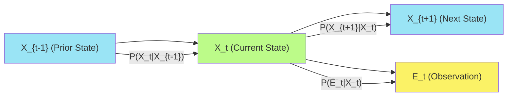
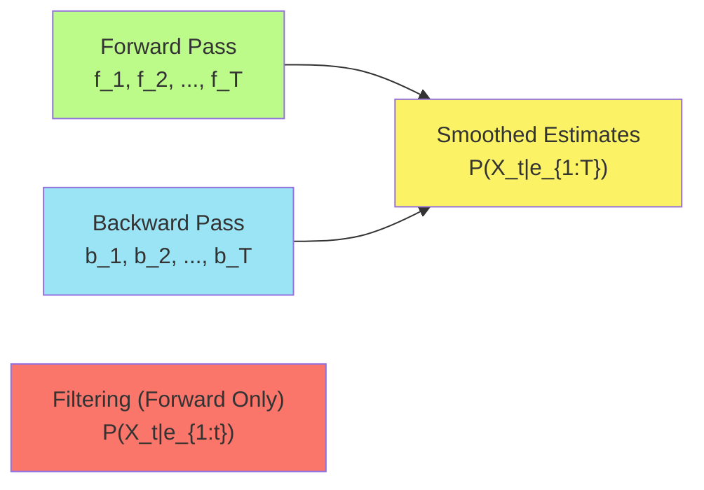
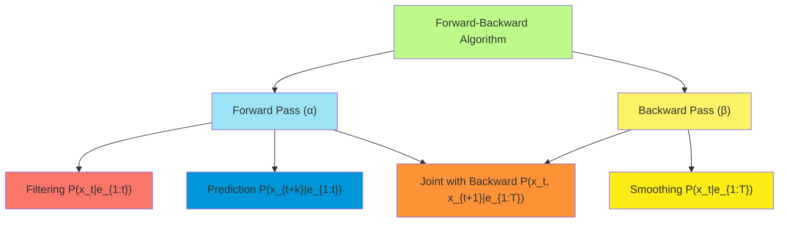
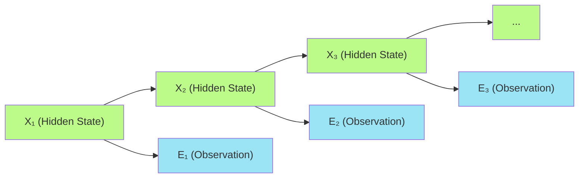
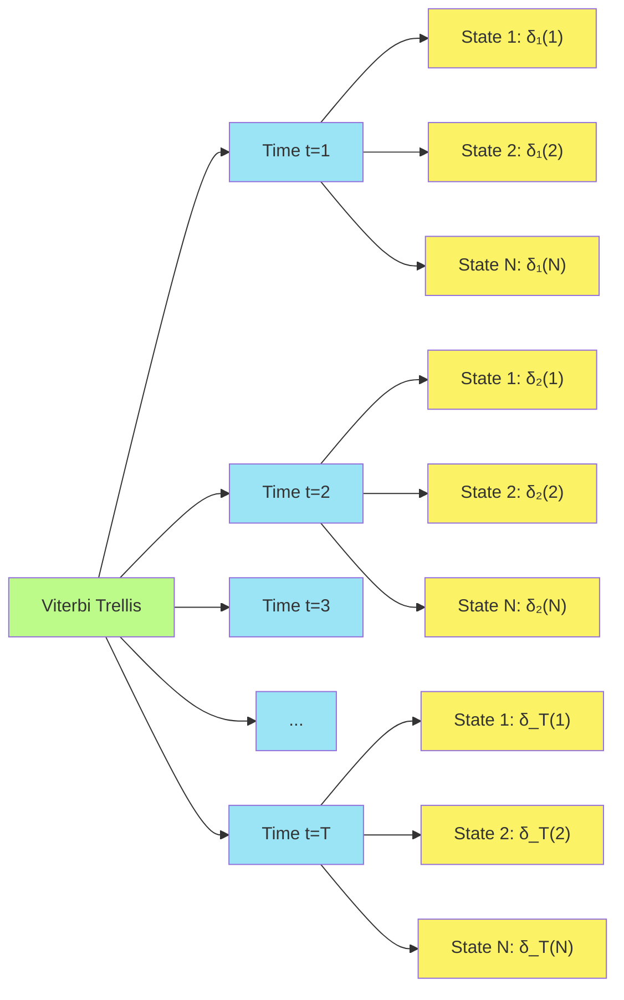
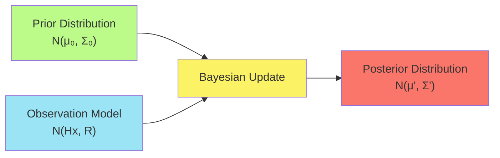
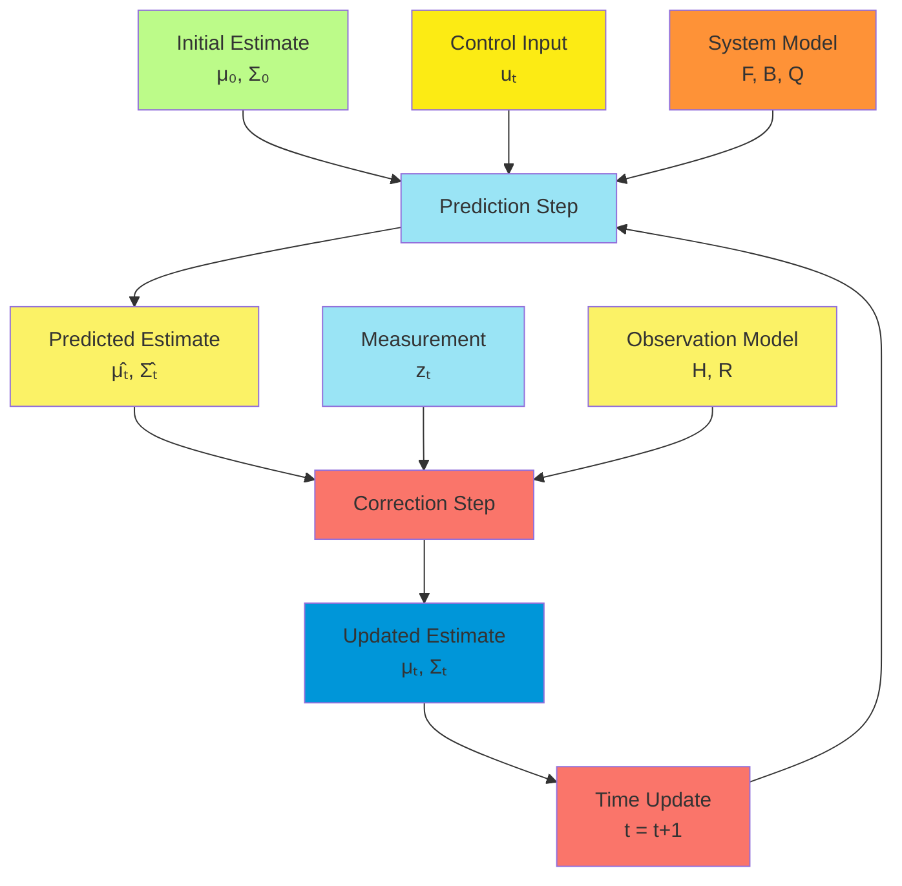
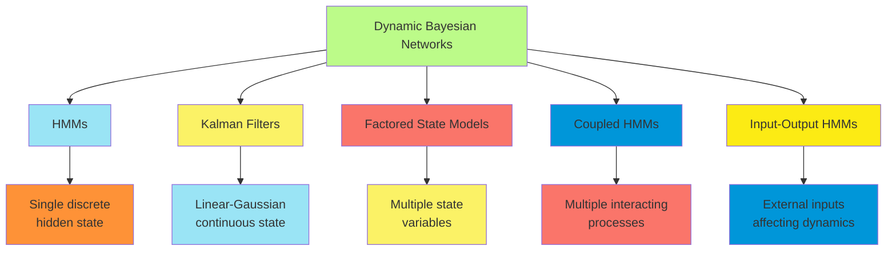
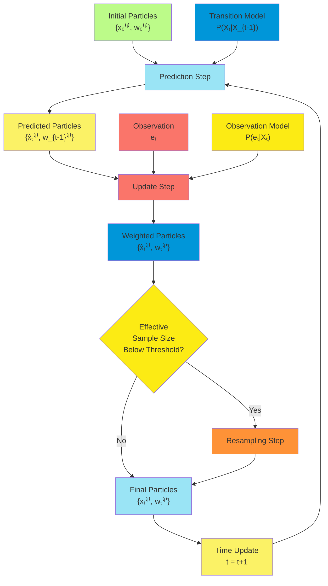

# C-13 | S-4: Probabilistic Reasoning over Time

1. Time and Uncertainty
    - States and Observations
    - Transition and Sensor Models
    - Markov Assumptions
    - Stationarity and Time Homogeneity
2. Inference in Temporal Models
    - Filtering and Prediction
    - Smoothing
    - Finding the Most Likely Sequence
    - The Forward-Backward Algorithm
3. Hidden Markov Models
    - Definition and Structure
    - Matrix Implementation of HMM Algorithms
    - The Viterbi Algorithm
    - Applications of HMMs to Localization
4. Kalman Filters
    - Linear Dynamical Systems
    - Gaussian Distributions and Updates
    - Prediction and Correction Steps
    - Extended Kalman Filters for Nonlinear Systems
5. Dynamic Bayesian Networks
    - DBNs as Generalizations of HMMs and Kalman Filters
    - Constructing DBNs
    - Exact Inference in DBNs
    - Particle Filtering and Sequential Importance Sampling

#### Time and Uncertainty

##### States and Observations

Probabilistic reasoning over time addresses the fundamental challenge of maintaining beliefs about a dynamic world given
imperfect observations. This requires precise formulations of how the world evolves and how observations relate to
underlying states.

**State Representation:**

The state of the world at time $t$ is represented by a random variable $X_t$, which can be:

- A single random variable (e.g., position of a robot)
- A vector of variables (e.g., position, velocity, and orientation)
- A complete assignment to all variables relevant to the domain

States can be:

1. **Discrete**: Finite or countably infinite set of values
    - Example: Robot location in a grid world with positions like (1,2), (3,4), etc.
    - Example: Operational status of a machine (working, degraded, failed)
2. **Continuous**: Uncountably infinite set of values
    - Example: Precise robot position $(x, y, \theta)$ in 2D space with orientation
    - Example: Temperature and pressure readings in a physical system

The complete history of states from the beginning of time is denoted as $X_{0:t} = {X_0, X_1, ..., X_t}$.

**Observations (Evidence):**

Observations at time $t$ are represented by random variable $E_t$ (or sometimes $Z_t$ or $O_t$), which can be:

- Direct but noisy readings of state variables
- Indirect measurements related to the state
- Partial information about the state

Like states, observations can be discrete or continuous:

- Discrete: Binary sensors, categorical classifications
- Continuous: Range finders, accelerometers, thermometers

The complete history of observations is denoted as $E_{1:t} = {E_1, E_2, ..., E_t}$.

**State-Observation Relationship:**

The relationship between states and observations is central to temporal reasoning:

1. **States are typically not directly observable** (hence "hidden")
2. **Observations provide evidence** about the underlying state
3. **The state is a sufficient statistic** for predicting future observations

This relationship is formalized through the sensor model $P(E_t|X_t)$, which specifies the probability of observations
given the current state.

**Temporal Process Structure:**

The structure of a temporal probabilistic model is represented as a joint distribution:

$P(X_{0:t}, E_{1:t}) = P(X_0) \prod_{i=1}^{t} P(X_i|X_{0:i-1}) \prod_{i=1}^{t} P(E_i|X_{0:i}, E_{1:i-1})$

This general form captures arbitrary dependencies across time, but practical models introduce simplifying assumptions to
make inference tractable.

##### Transition and Sensor Models

The dynamics of temporal systems are captured through transition and sensor models, which define how states evolve and
relate to observations.

**Transition Model:**

The transition model $P(X_t|X_{0:t-1})$ defines how the state at time $t$ depends on previous states. This model
describes the dynamics of the system, including:

- Deterministic changes (e.g., physics-based motion)
- Random disturbances (e.g., process noise)
- Exogenous events (e.g., human interventions)

In many practical applications, the transition model has a particularly simple form:

$P(X_t|X_{t-1})$

This is known as a first-order Markov model, where the current state depends only on the immediately preceding state.

**Types of Transition Models:**

1. **Discrete Transitions**: Represented by a conditional probability table
    - Example: Robot movement in a grid with probabilities for each possible next location
    - Formally: $P(X_t = x'|X_{t-1} = x)$ for all states $x$ and $x'$
2. **Continuous Transitions**: Typically represented by probability density functions
    - Example: Robot motion with Gaussian noise around expected position
    - Formally: $X_t = f(X_{t-1}) + w_t$ where $w_t$ is random noise
3. **Mixed Transitions**: Combinations of discrete and continuous variables
    - Example: Robot position (continuous) and operational mode (discrete)

**Sensor Model:**

The sensor model $P(E_t|X_t)$ defines the relationship between the current state and observations. This model captures:

- Sensor accuracy and limitations
- Measurement noise
- Environmental effects on sensing

The sensor model is sometimes called the observation model or measurement model.

**Types of Sensor Models:**

1. **Discrete Observations**: Probability tables relating states to discrete readings
    - Example: $P(Sensor=\text{"high"}|Temperature>100) = 0.95$
    - Used for categorical sensors or discretized continuous readings
2. **Continuous Observations**: Typically modeled with probability densities
    - Example: $E_t = h(X_t) + v_t$ where $v_t$ is measurement noise
    - Often Gaussian: $P(E_t|X_t) = \mathcal{N}(E_t; h(X_t), \Sigma)$
3. **Complex Sensor Models**: For multi-modal or non-linear sensors
    - Example: Camera images related to 3D scene state
    - May require sophisticated models like neural networks

**Model Specification:**

Transition and sensor models can be specified through:

1. **Expert Knowledge**: Physics equations, domain expertise
2. **Learning from Data**: Parameter estimation, system identification
3. **Simulation**: Physics engines, synthetic data generation

The quality of these models directly impacts the accuracy of inference in temporal reasoning.



##### Markov Assumptions

Markov assumptions significantly simplify temporal reasoning by limiting dependencies across time, making inference
computationally tractable while still capturing essential dynamics.

**First-Order Markov Assumption for States:**

The first-order Markov assumption states that the current state depends only on the immediately preceding state:

$P(X_t|X_{0:t-1}) = P(X_t|X_{t-1})$

This means:

1. The future is independent of the past given the present
2. $X_{t-1}$ contains all relevant information for predicting $X_t$
3. We don't need to maintain the entire history to predict future states

**Observation Independence Assumption:**

Observations at time $t$ depend only on the current state at time $t$:

$P(E_t|X_{0:t}, E_{1:t-1}) = P(E_t|X_t)$

This implies:

1. Sensor readings depend only on the current state
2. Measurement noise is independent across time steps
3. Observations are conditionally independent given the states

**Complete Markov Assumption:**

Combining both assumptions, we get the complete Markov assumption:

$P(X_{0:t}, E_{1:t}) = P(X_0) \prod_{i=1}^{t} P(X_i|X_{i-1}) \prod_{i=1}^{t} P(E_i|X_i)$

This structure defines a **Hidden Markov Model (HMM)** when states are discrete and a **Linear Dynamical System (LDS)**
when states and observations are continuous with linear Gaussian dynamics.

**Higher-Order Markov Models:**

When the first-order assumption is insufficient, we can use higher-order models:

$P(X_t|X_{0:t-1}) = P(X_t|X_{t-k:t-1})$

This $k$-th order Markov model includes dependencies on $k$ previous states.

A higher-order model can always be converted to a first-order model by redefining the state space:

- Define a new state variable $Y_t = (X_t, X_{t-1}, ..., X_{t-k+1})$
- The transition becomes $P(Y_t|Y_{t-1})$, which is first-order Markov

**Conditional Independence in Markov Models:**

The Markov assumption implies important conditional independence properties:

1. Future states are independent of past states given the present state
2. Future observations are independent of past states and observations given the present state
3. States form a Markov chain: $X_0 \rightarrow X_1 \rightarrow X_2 \rightarrow \cdots$

**Violations of Markov Assumptions:**

Real-world processes sometimes violate Markov assumptions due to:

1. **Long-term dependencies**: Effects that persist beyond immediate state transitions
2. **Hidden influences**: Unmodeled factors affecting both states and observations
3. **Correlations in sensor noise**: When observation errors are not independent

When Markov assumptions are violated but still used, the resulting inference may be suboptimal but often remains
practically useful.

##### Stationarity and Time Homogeneity

Stationarity and time homogeneity address whether the probabilistic relationships in temporal models remain constant
over time, further simplifying representation and inference.

**Time Homogeneity (Stationary Transition Model):**

A process has stationary transitions if the transition probabilities do not change with time:

$P(X_t|X_{t-1}) = P(X_2|X_1)$ for all $t > 1$

This means:

1. The same transition model applies at all time steps
2. System dynamics don't change over time
3. A single transition function can be learned and applied repeatedly

In stationary models, we can simplify notation to: $P(X'|X)$ for the transition from any state $X$ to next state $X'$

**Stationary Sensor Model:**

Similarly, a sensor model is stationary if:

$P(E_t|X_t) = P(E_2|X_2)$ for all $t > 1$

This implies:

1. Sensor characteristics don't change over time
2. The relationship between states and observations remains constant
3. A single sensor model applies at all time steps

**Advantages of Stationarity:**

1. **Compact Representation**: Only need to store one transition matrix and one sensor model
2. **Efficient Learning**: More data available to estimate a single model versus time-varying models
3. **Predictable Long-term Behavior**: Can analyze equilibrium distributions and steady-state properties

**Non-stationary Models:**

Some processes require non-stationary models:

1. **Time-dependent transitions**: $P(X_t|X_{t-1}, t)$
2. **Scheduled changes**: Different models for day/night or seasonal effects
3. **Aging or wearing**: Systems whose dynamics change as components age

**Piecewise Stationarity:**

A practical middle ground is piecewise stationarity, where:

1. The model is stationary over specific time intervals
2. Transitions between different stationary regimes occur at specific points
3. A finite set of models applies in different contexts

Example: A robot's motion model might be different on carpet versus tile, but stationary within each surface type.

**Equilibrium Distribution:**

For a stationary Markov process, if a distribution $\pi(X)$ satisfies:

$\pi(X') = \sum_X \pi(X)P(X'|X)$ for all states $X'$

then $\pi$ is called the equilibrium (or stationary) distribution.

Properties of the equilibrium distribution:

1. If the process starts in distribution $\pi$, it remains in that distribution
2. Under certain conditions (ergodicity), the process converges to $\pi$ regardless of initial state
3. For finite state spaces, $\pi$ can be computed as the principal eigenvector of the transition matrix

**Practical Considerations:**

1. **Testing for Stationarity**: Statistical tests can determine if observed data supports stationarity

2. Handling Non-stationarity

    :

    - Explicit time-dependent models
    - State augmentation to include time or phase
    - Adaptive models that track parameter changes

3. **Model Selection**: Trade-off between richer non-stationary models and simpler stationary ones

Stationarity assumptions, when valid, substantially simplify temporal reasoning while still capturing the essential
dynamics of many real-world processes.

#### Inference in Temporal Models

##### Filtering and Prediction

Filtering and prediction are fundamental inference tasks in temporal probabilistic models, allowing agents to maintain
beliefs about the current state and forecast future states.

**Filtering (State Estimation):**

Filtering computes the belief state—the posterior distribution over the current state given all evidence so far:

$P(X_t|e_{1:t})$

This distribution summarizes all information about the current state contained in the observation history.

**Recursive Filtering:**

Filtering can be performed recursively, with two steps:

1. **Prediction Step**: Project the previous belief state forward using the transition model
2. **Update Step**: Incorporate the new evidence using the sensor model

Mathematically:

$P(X_t|e_{1:t}) = \alpha P(e_t|X_t) \sum_{x_{t-1}} P(X_t|x_{t-1})P(x_{t-1}|e_{1:t-1})$

where $\alpha$ is a normalization constant.

This recursive structure is crucial for efficiency, as it allows filtering without storing the entire history of states
and observations.

**Initial Belief State:**

The filtering process starts with a prior distribution $P(X_0)$ representing initial beliefs before any observations.
This could be:

- A uniform distribution (maximum entropy) when no prior information exists
- A focused distribution based on initialization procedures
- A previously computed posterior from earlier operation

**Filtering Algorithm:**

```
function FORWARD(f_{1:t}, e_{1:t}) returns a distribution over states
    inputs: f_{1:t}, the forward probabilities at time t-1
            e_{1:t}, the evidence sequence

    if t = 0 then return P(X_0)  // Initial state distribution

    // Prediction step: compute P(X_t|e_{1:t-1})
    predict ← vector of zeros
    for each x_t do
        predict[x_t] ← ∑_{x_{t-1}} P(x_t|x_{t-1}) * f_{t-1}[x_{t-1}]

    // Update step: include new evidence
    f_t ← vector of zeros
    for each x_t do
        f_t[x_t] ← P(e_t|x_t) * predict[x_t]

    return NORMALIZE(f_t)
```

**Prediction:**

Prediction extends filtering to estimate future states:

$P(X_{t+k}|e_{1:t})$ for $k > 0$

This is computed by projecting the current belief state forward without incorporating additional evidence:

$P(X_{t+k}|e_{1:t}) = \sum_{x_{t+k-1}} P(X_{t+k}|x_{t+k-1}) P(x_{t+k-1}|e_{1:t})$

As $k$ increases, predictions typically become less certain, converging toward the equilibrium distribution in
stationary systems.

**Lookahead for Decision-Making:**

Prediction enables planning and decision-making by evaluating potential future states:

1. Agents can assess the consequences of different actions
2. Warning systems can anticipate problematic conditions
3. Resource allocation can prepare for predicted demands

**Practical Considerations:**

1. **Computational Efficiency**:
    - For discrete states with $n$ values, filtering requires $O(n^2)$ operations per time step
    - Specialized algorithms for specific models can reduce this complexity
2. **Approximate Filtering**:
    - When state spaces are large, exact filtering becomes intractable
    - Approximate methods include particle filters, Gaussian approximations, and discretization
3. **Information Decay**:
    - Old observations have diminishing influence on current state estimates
    - In exponentially forgetting processes, the effective history length is bounded

Filtering and prediction form the foundation for online decision-making in uncertain, dynamic environments, allowing
agents to maintain up-to-date beliefs about unobservable aspects of the world.

##### Smoothing

Smoothing computes improved state estimates by incorporating both past and future observations, producing more accurate
results than filtering when historical analysis is needed.

**Definition:**

Smoothing computes the posterior distribution of a past state given all evidence up to the current time:

$P(X_k|e_{1:t})$ for $0 \leq k < t$

Unlike filtering, which only uses observations up to the current state, smoothing incorporates "future" observations
(from the perspective of $X_k$) to refine the estimate.

**Types of Smoothing:**

1. **Fixed-lag Smoothing**: Compute $P(X_{t-L}|e_{1:t})$ with a fixed lag $L$
    - Provides improved estimates with a constant delay
    - Useful for applications that can tolerate a small processing delay
2. **Fixed-interval Smoothing**: Compute $P(X_k|e_{1:T})$ for all $k = 1,2,...,T-1$
    - Processes the entire observation sequence of length $T$
    - Used for offline analysis of complete data sets
3. **Fixed-point Smoothing**: Compute $P(X_k|e_{1:t})$ for a fixed $k$ as $t$ increases
    - Progressively refines the estimate of a specific past state
    - Useful for diagnosing the cause of a particular event

**Forward-Backward Algorithm:**

The most common smoothing approach is the forward-backward algorithm:

1. **Forward Pass**: Compute forward probabilities $f_{1:T}$ using filtering $f_t(x_t) = P(X_t=x_t|e_{1:t})$
2. **Backward Pass**: Compute backward probabilities $b_{1:T}$ $b_t(x_t) = P(e_{t+1:T}|X_t=x_t)$
3. **Combine**: Multiply and normalize to get smoothed estimates
   $P(X_t=x_t|e_{1:T}) = \alpha \cdot f_t(x_t) \cdot b_t(x_t)$

**Backward Recursion:**

The backward probabilities can be computed recursively:

$b_t(x_t) = \sum_{x_{t+1}} P(e_{t+1}|x_{t+1}) P(x_{t+1}|x_t) b_{t+1}(x_{t+1})$

Starting with $b_T(x_T) = 1$ for all $x_T$.

**Computational Considerations:**

1. **Time Complexity**: $O(n^2 T)$ for discrete state spaces with $n$ values over $T$ time steps
2. **Space Complexity**: $O(nT)$ to store forward and backward probabilities
3. **Numerical Stability**: Implementations often work in log space to prevent underflow

**Applications of Smoothing:**

1. **Data Analysis**: Processing historical sensor data for scientific analysis
2. **Anomaly Detection**: Identifying unusual past events with the benefit of hindsight
3. **Speech Recognition**: Refining phoneme identifications using context from entire utterances
4. **Trajectory Estimation**: Reconstructing the path of objects from noisy measurements

**Smoothing vs. Filtering Trade-offs:**

1. **Accuracy**: Smoothing generally provides more accurate estimates than filtering
2. **Latency**: Smoothing introduces delays as it requires future observations
3. **Computational Cost**: Smoothing requires both forward and backward passes
4. **Online vs. Offline**: Filtering is suitable for online applications, while full smoothing is inherently offline



##### Finding the Most Likely Sequence

Finding the most likely sequence of states differs from computing the marginal distributions at each time step,
addressing the need to maintain temporal consistency in state estimates.

**The Maximum A Posteriori (MAP) Sequence:**

The goal is to find the most probable sequence of states given all observations:

$x^**{1:T} = \arg\max*{x_{1:T}} P(x_{1:T}|e_{1:T})$

This differs from simply selecting the most likely state at each time step independently, which might result in an
inconsistent or even impossible sequence.

**Comparing MAP Sequence with Marginal Filtering:**

- **Filtering/Smoothing**: Computes $P(X_t|e_{1:T})$ for each $t$ independently
- **MAP Sequence**: Finds $\arg\max_{x_{1:T}} P(x_{1:T}|e_{1:T})$ as a complete sequence

Example of the difference:

- Marginal estimates might show: $P(X_1=A|e_{1:T}) = 0.6$, $P(X_2=B|e_{1:T}) = 0.7$
- But the probability of the sequence $A \rightarrow B$ might be lower than another sequence like $C \rightarrow D$
- This can occur when transitions between certain states are unlikely or impossible

**Brute Force Approach:**

A naive approach would enumerate all possible state sequences:

- For a sequence of length $T$ with $n$ possible states at each step
- There are $n^T$ possible sequences
- Evaluate $P(x_{1:T}|e_{1:T})$ for each sequence
- Select the highest probability sequence

This is computationally infeasible for all but the smallest problems.

**The Viterbi Algorithm:**

The Viterbi algorithm efficiently finds the MAP sequence using dynamic programming:

1. Define $\delta_t(x_t)$ as the probability of the most likely sequence ending in state $x_t$ at time $t$:
   $\delta_t(x_t) = \max_{x_{1:t-1}} P(x_{1:t-1}, x_t, e_{1:t})$
2. Recursively compute: $\delta_t(x_t) = P(e_t|x_t) \max_{x_{t-1}} P(x_t|x_{t-1}) \delta_{t-1}(x_{t-1})$
3. Track the maximizing arguments in a backpointer array $\psi_t(x_t)$:
   $\psi_t(x_t) = \arg\max_{x_{t-1}} P(x_t|x_{t-1}) \delta_{t-1}(x_{t-1})$
4. After computing $\delta_T$ for all final states, trace back through the backpointers to reconstruct the MAP sequence.

**Viterbi Algorithm Pseudocode:**

```bash
function VITERBI(e_{1:T}, P(X_0), P(X'|X), P(E|X)) returns a state sequence
    inputs: e_{1:T}, the evidence sequence
            P(X_0), the initial state distribution
            P(X'|X), the transition model
            P(E|X), the sensor model

    δ_0[x_0] ← P(x_0) for all x_0
    for t = 1 to T do
        for each state x_t do
            δ_t[x_t] ← P(e_t|x_t) × max_{x_{t-1}} P(x_t|x_{t-1}) × δ_{t-1}[x_{t-1}]
            ψ_t[x_t] ← argmax_{x_{t-1}} P(x_t|x_{t-1}) × δ_{t-1}[x_{t-1}]

    // Backtrack to find the MAP sequence
    x*_T ← argmax_{x_T} δ_T[x_T]
    for t = T-1 down to 0 do
        x*_t ← ψ_{t+1}[x*_{t+1}]

    return x*_{0:T}
```

**Complexity Analysis:**

- **Time Complexity**: $O(n^2 T)$ where $n$ is the number of states and $T$ is the sequence length
- **Space Complexity**: $O(nT)$ to store the $\delta$ and $\psi$ arrays

**Applications:**

1. **Speech Recognition**: Finding the most likely sequence of phonemes or words
2. **Natural Language Processing**: Part-of-speech tagging and entity recognition
3. **Bioinformatics**: Gene finding and protein sequence alignment
4. **Robotics**: Reconstructing the most likely path taken by a robot

**Variations and Extensions:**

1. **Log Space Implementation**: Working in log space to prevent numerical underflow
2. **Beam Search**: Limiting the search to only the most promising states at each step
3. **List Viterbi Algorithm**: Finding the N-best sequences instead of just the best one
4. **Constrained Viterbi**: Incorporating domain-specific constraints on valid sequences

The Viterbi algorithm provides an efficient solution to the important problem of finding the most likely sequence,
supporting applications where temporal consistency is essential.

##### The Forward-Backward Algorithm

The Forward-Backward algorithm is a comprehensive approach for inference in Hidden Markov Models, enabling computation
of both filtering/smoothing distributions and most likely sequences.

**Overview:**

The Forward-Backward algorithm computes:

1. **Forward Probabilities**: $\alpha_t(x_t) = P(x_t, e_{1:t})$
2. **Backward Probabilities**: $\beta_t(x_t) = P(e_{t+1:T}|x_t)$

These can be combined to answer various inference queries:

- Filtering: $P(x_t|e_{1:t}) \propto \alpha_t(x_t)$
- Smoothing: $P(x_t|e_{1:T}) \propto \alpha_t(x_t) \cdot \beta_t(x_t)$
- Prediction: $P(x_{t+k}|e_{1:t})$ computed from $\alpha_t$ and the transition model
- Most likely sequence: Computed using the Viterbi algorithm (a variation of the forward pass)

**Forward Recursion:**

1. **Initialization**: $\alpha_1(x_1) = P(x_1) \cdot P(e_1|x_1)$
2. **Recursion** (for $t = 2, 3, ..., T$):
   $\alpha_t(x_t) = P(e_t|x_t) \sum_{x_{t-1}} P(x_t|x_{t-1}) \alpha_{t-1}(x_{t-1})$
3. **Termination**: $P(e_{1:T}) = \sum_{x_T} \alpha_T(x_T)$

**Backward Recursion:**

1. **Initialization**: $\beta_T(x_T) = 1$ for all $x_T$
2. **Recursion** (for $t = T-1, T-2, ..., 1$):
   $\beta_t(x_t) = \sum_{x_{t+1}} P(e_{t+1}|x_{t+1}) P(x_{t+1}|x_t) \beta_{t+1}(x_{t+1})$

**Computing Posterior Marginals:**

The joint probability of being in state $x_t$ at time $t$ and in state $x_{t+1}$ at time $t+1$, given all evidence:

$P(x_t, x_{t+1}|e_{1:T}) = \frac{\alpha_t(x_t) \cdot P(x_{t+1}|x_t) \cdot P(e_{t+1}|x_{t+1}) \cdot \beta_{t+1}(x_{t+1})}{P(e_{1:T})}$

The marginal probability of being in state $x_t$ at time $t$, given all evidence:

$P(x_t|e_{1:T}) = \frac{\alpha_t(x_t) \cdot \beta_t(x_t)}{P(e_{1:T})}$

**Implementation Considerations:**

1. **Numerical Stability**:
    - Forward and backward probabilities tend to become very small with long sequences
    - Log-space implementations prevent numerical underflow
    - Scaling techniques normalize probabilities at each step
2. **Computational Complexity**:
    - Time: $O(n^2 T)$ where $n$ is the number of states and $T$ is the sequence length
    - Space: $O(nT)$ for storing all forward and backward probabilities
    - Can be reduced to $O(n)$ space if only the current time slice is needed

**Parameter Learning:**

The Forward-Backward algorithm is a key component of the Baum-Welch algorithm (a special case of
Expectation-Maximization) for learning HMM parameters:

1. **E-Step**: Compute expected state occupancy and transition counts using forward-backward
2. **M-Step**: Update model parameters based on these expectations
3. **Iterate** until convergence

**Applications:**

1. **Speech Recognition**: Computing phoneme probabilities given acoustic input
2. **Biological Sequence Analysis**: Protein secondary structure prediction
3. **Natural Language Processing**: Part-of-speech tagging
4. **Activity Recognition**: Inferring human activities from sensor data



The Forward-Backward algorithm provides a comprehensive framework for inference in HMMs, supporting both online
applications (filtering, prediction) and offline analysis (smoothing, parameter learning).

#### Hidden Markov Models

##### Definition and Structure

Hidden Markov Models (HMMs) provide a principled framework for modeling sequential data with unobservable (hidden)
states and observable outputs or emissions.

**Formal Definition:**

A Hidden Markov Model is defined by a 5-tuple $(S, O, \pi, A, B)$ where:

- $S = {s_1, s_2, ..., s_N}$ is a set of $N$ possible hidden states
- $O = {o_1, o_2, ..., o_M}$ is a set of $M$ possible observation symbols (for discrete observations)
- $\pi = {\pi_i}$ is the initial state distribution, where $\pi_i = P(X_1 = s_i)$
- $A = {a_{ij}}$ is the state transition probability matrix, where $a_{ij} = P(X_{t+1} = s_j | X_t = s_i)$
- $B = {b_j(o_k)}$ is the observation probability distribution, where $b_j(o_k) = P(E_t = o_k | X_t = s_j)$

For continuous observations, $B$ consists of probability density functions rather than discrete probabilities.

**Key Assumptions**:

1. **First-Order Markov Assumption**: The next state depends only on the current state
   $P(X_{t+1} | X_1, X_2, ..., X_t) = P(X_{t+1} | X_t)$
2. **Output Independence**: The current observation depends only on the current state
   $P(E_t | X_1, X_2, ..., X_t, E_1, E_2, ..., E_{t-1}) = P(E_t | X_t)$
3. **Stationarity**: Transition and observation probabilities don't change over time

**Generative Process:**

An HMM generates sequences through the following process:

1. Select an initial state $X_1$ according to the initial distribution $\pi$
2. Generate an observation $E_1$ based on the observation model $B$ for state $X_1$
3. Transition to a new state $X_2$ based on the transition model $A$ from state $X_1$
4. Generate an observation $E_2$ based on the observation model for state $X_2$
5. Continue this process to generate the desired sequence length

**Fundamental Problems in HMMs:**

1. **Evaluation Problem**: Given a model $\lambda = (A, B, \pi)$ and an observation sequence $E_{1:T}$, compute the
   probability $P(E_{1:T} | \lambda)$ that the model generated the observations
    - Solution: Forward algorithm
2. **Decoding Problem**: Given a model $\lambda$ and an observation sequence $E_{1:T}$, find the most likely state
   sequence $X_{1:T}^*$ that could have generated the observations
    - Solution: Viterbi algorithm
3. **Learning Problem**: Given an observation sequence $E_{1:T}$ (or a set of sequences), estimate the model parameters
   $\lambda = (A, B, \pi)$ that maximize the probability of generating the observed data
    - Solution: Baum-Welch algorithm (EM algorithm for HMMs)

**Representation as a Dynamic Bayesian Network:**

An HMM can be represented as a simple dynamic Bayesian network with:

- A single hidden state variable at each time step
- A single observation variable at each time step
- Connections from each state to the next state
- Connections from each state to its corresponding observation



**Extensions and Variations:**

1. **Input-Output HMM**: Includes additional input variables that affect state transitions
2. **Hierarchical HMM**: States themselves can emit sequences through sub-HMMs
3. **Factorial HMM**: Multiple independent state sequences generate observations jointly
4. **Coupled HMM**: Multiple HMMs with interactions between their state sequences
5. **Semi-Markov Models**: State durations follow explicit duration distributions

HMMs provide a foundational probabilistic framework for sequential data modeling, enabling principled solutions to a
wide range of temporal inference problems.

##### Matrix Implementation of HMM Algorithms

Matrix implementations of HMM algorithms provide computationally efficient formulations of the fundamental inference
operations, particularly important for large state spaces and long sequences.

**Matrix Notation:**

- $\pi$: Initial state distribution vector of size $N$ (where $N$ is the number of states)
- $A$: State transition matrix of size $N \times N$
- $B_t$: Diagonal observation matrix at time $t$ of size $N \times N$, where $B_t(i,i) = P(E_t|X_t=i)$
- $\alpha_t$: Forward probability vector at time $t$ of size $N$
- $\beta_t$: Backward probability vector at time $t$ of size $N$
- $\mathbf{1}$: All-ones vector of size $N$

**Forward Algorithm in Matrix Form:**

1. **Initialization**: $\alpha_1 = \pi \circ B_1$, where $\circ$ denotes element-wise multiplication
2. **Recursion**: $\alpha_t = ((\alpha_{t-1})^T A)^T \circ B_t$ for $t = 2, 3, ..., T$
3. **Termination**: $P(E_{1:T}) = \alpha_T^T \mathbf{1}$ (sum of all elements in $\alpha_T$)

**Backward Algorithm in Matrix Form:**

1. **Initialization**: $\beta_T = \mathbf{1}$ (all elements set to 1)
2. **Recursion**: $\beta_t = A (B_{t+1} \circ \beta_{t+1})$ for $t = T-1, T-2, ..., 1$

**Smoothed State Probabilities:**

The probability of being in state $i$ at time $t$ given all evidence:
$\gamma_t(i) = P(X_t = i | E_{1:T}) = \frac{\alpha_t(i) \beta_t(i)}{P(E_{1:T})}$

In vector form: $\gamma_t = \frac{\alpha_t \circ \beta_t}{\alpha_T^T \mathbf{1}}$

**Joint State Probabilities:**

The probability of being in state $i$ at time $t$ and state $j$ at time $t+1$:
$\xi_t(i,j) = P(X_t = i, X_{t+1} = j | E_{1:T})$

In matrix form: $\Xi_t = \frac{diag(\alpha_t) \cdot A \cdot diag(B_{t+1} \circ \beta_{t+1})}{\alpha_T^T \mathbf{1}}$

**Viterbi Algorithm in Matrix Form:**

1. **Initialization**: $\delta_1 = \pi \circ B_1$ (element-wise) Initialize backpointer matrix $\psi$ of size
   $T \times N$
2. **Recursion**: For $t = 2, 3, ..., T$:
    - For each state $j$: $\delta_t(j) = \max_i[\delta_{t-1}(i) \cdot A(i,j)] \cdot B_t(j,j)$
    - For each state $j$: $\psi_t(j) = \arg\max_i[\delta_{t-1}(i) \cdot A(i,j)]$
3. **Termination and Backtracking**:
    - Find the final state: $x_T^* = \arg\max_i \delta_T(i)$
    - Backtrack: $x_t^* = \psi_{t+1}(x_{t+1}^*)$ for $t = T-1, T-2, ..., 1$

**Baum-Welch Algorithm in Matrix Form:**

For the E-step, compute the expected counts:

- State occupancy: $\gamma_t$ as defined above
- State transitions: $\Xi_t$ as defined above

For the M-step, update the parameters:

- Initial distribution: $\pi_i^{new} = \gamma_1(i)$
- Transition probabilities: $A_{ij}^{new} = \frac{\sum_{t=1}^{T-1} \Xi_t(i,j)}{\sum_{t=1}^{T-1} \gamma_t(i)}$
- Observation probabilities: $B_j(o_k)^{new} = \frac{\sum_{t=1, E_t=o_k}^T \gamma_t(j)}{\sum_{t=1}^T \gamma_t(j)}$

**Computational Advantages:**

1. **Vectorization**: Matrix operations can be highly optimized on modern hardware
2. **Parallelization**: Many matrix operations can be parallelized on GPUs
3. **Library Support**: Extensive numerical libraries for efficient matrix computation
4. **Cache Efficiency**: Better memory access patterns for large state spaces

**Implementation Considerations:**

1. **Numerical Stability**:
    - Log-space implementation: Replace multiplications with additions of logarithms
    - Scaling: Normalize forward/backward variables at each step
2. **Sparse Matrices**:
    - When transition matrices are sparse, specialized sparse matrix operations can reduce computation
    - Particularly useful for large state spaces with limited transitions
3. **Computational Complexity**:
    - Time: Still $O(N^2T)$ for most algorithms
    - Space: $O(NT)$ for storing all time steps, can be reduced for certain algorithms
4. **Precision Issues**:
    - Double precision is often necessary for longer sequences
    - Special care needed for very small probability values

Matrix implementations of HMM algorithms provide both conceptual clarity and computational efficiency, making them the
standard approach in most practical applications of HMMs.

##### The Viterbi Algorithm

The Viterbi algorithm efficiently finds the most likely sequence of hidden states in an HMM given a sequence of
observations, with applications in speech recognition, natural language processing, and communications.

**Problem Definition:**

Given an HMM $\lambda = (A, B, \pi)$ and an observation sequence $E_{1:T}$, find the most likely state sequence:

$X_{1:T}^* = \arg\max_{X_{1:T}} P(X_{1:T} | E_{1:T}, \lambda)$

This is equivalent to:

$X_{1:T}^* = \arg\max_{X_{1:T}} P(X_{1:T}, E_{1:T} | \lambda)$

**Algorithm Structure:**

The Viterbi algorithm uses dynamic programming to efficiently compute the most likely path:

1. **Define** $\delta_t(i)$ as the probability of the most likely state sequence ending in state $i$ at time $t$ that
   explains observations $E_{1:t}$:

    $\delta_t(i) = \max_{X_{1:t-1}} P(X_{1:t-1}, X_t=i, E_{1:t} | \lambda)$

2. **Recursively compute** $\delta_t(i)$ using:

    $\delta_t(j) = [\max_i \delta_{t-1}(i) a_{ij}] \cdot b_j(E_t)$

3. **Track backpointers** $\psi_t(j)$ to record the previous state in the most likely path:

    $\psi_t(j) = \arg\max_i [\delta_{t-1}(i) a_{ij}]$

4. **Reconstruct** the most likely path by following backpointers from the end.

**Detailed Algorithm:**

```
function VITERBI(observations E_{1:T}, hmm λ = (A, B, π)) returns state sequence
    # Initialization
    for each state i do
        δ_1[i] ← π_i * b_i(E_1)
        ψ_1[i] ← 0  # No previous state at t=1

    # Recursion
    for t = 2 to T do
        for each state j do
            δ_t[j] ← max_i(δ_{t-1}[i] * a_ij) * b_j(E_t)
            ψ_t[j] ← argmax_i(δ_{t-1}[i] * a_ij)

    # Termination
    x*_T ← argmax_i(δ_T[i])
    P* ← max_i(δ_T[i])  # Probability of the most likely path

    # Path backtracking
    for t = T-1 down to 1 do
        x*_t ← ψ_{t+1}[x*_{t+1}]

    return x*_{1:T}
```

**Log-Space Implementation:**

To prevent numerical underflow with long sequences, the algorithm is often implemented in log space:

- Replace multiplications with additions of logarithms
- Replace max operations with max operations (unchanged)
- Initial values: $\log \delta_1(i) = \log \pi_i + \log b_i(E_1)$
- Recursion: $\log \delta_t(j) = \max_i [\log \delta_{t-1}(i) + \log a_{ij}] + \log b_j(E_t)$

**Complexity Analysis:**

- **Time Complexity**: $O(N^2T)$ where $N$ is the number of states and $T$ is the sequence length
- **Space Complexity**: $O(NT)$ to store all $\delta$ and $\psi$ values, can be reduced to $O(N)$ if only the final path
  is needed

**Differences from Forward-Backward:**

- Forward algorithm computes the sum over all possible paths
- Viterbi computes the maximum over all possible paths
- Structurally similar but using max operations instead of sums

**Applications of the Viterbi Algorithm:**

1. **Speech Recognition**: Finding the most likely sequence of words or phonemes
2. **Part-of-speech Tagging**: Determining the grammatical tags of words in a sentence
3. **Gesture Recognition**: Identifying sequences of gestures from sensor data
4. **Biological Sequence Analysis**: Gene finding and protein structure prediction
5. **Digital Communications**: Decoding convolutional codes in noisy channels

**Variations and Extensions:**

1. **Beam Search Viterbi**: Limits the number of states considered at each step to improve efficiency
2. **List Viterbi**: Returns the N-best state sequences instead of just the most likely one
3. **Parallel Viterbi**: Distributes computation across multiple processors
4. **Continuous Viterbi**: Adapted for continuous observation densities
5. **Segmental Viterbi**: Handles variable-duration states



The Viterbi algorithm is a cornerstone technique in sequence modeling, providing an efficient solution to the problem of
finding the most likely hidden state sequence in a wide range of applications.

##### Applications of HMMs to Localization

Hidden Markov Models provide a powerful framework for robot localization, the process of determining a robot's position
and orientation in an environment using uncertain sensor data.

**The Localization Problem:**

Localization involves estimating a robot's pose (position and orientation) given:

1. A map of the environment
2. A sequence of sensor readings
3. A sequence of control actions

This can be naturally formulated as an HMM problem where:

- Hidden states $X_t$ represent the robot's true locations
- Observations $E_t$ represent sensor readings
- Actions (controls) provide information about state transitions

**HMM Components in Localization:**

1. **State Space**:
    - Discrete: Grid cells or topological nodes
    - Continuous: $(x, y, \theta)$ coordinates (requiring adaptations of standard HMM algorithms)
2. **Transition Model** $P(X_t | X_{t-1}, U_{t-1})$:
    - Incorporates robot motion model
    - Accounts for motion uncertainty (wheel slippage, uneven terrain)
    - May depend on control actions $U_{t-1}$
3. **Observation Model** $P(E_t | X_t)$:
    - Models sensor characteristics
    - Accounts for sensor noise and limitations
    - Examples: Laser scan likelihood, camera image probability, landmark detection

**Types of Localization Problems:**

1. **Position Tracking**:
    - Initial position is known
    - Track position as robot moves
    - Corresponds to HMM filtering $P(X_t | E_{1:t}, U_{1:t-1})$
2. **Global Localization**:
    - Initial position is unknown
    - Determine position from scratch
    - Initially uniform belief over all possible locations
3. **Kidnapped Robot Problem**:
    - Robot is teleported to an unknown location
    - Must recover from catastrophic localization failure
    - Tests robustness of localization algorithms

**HMM Algorithms for Localization:**

1. **Filtering** (Forward Algorithm):
    - Computes $P(X_t | E_{1:t}, U_{1:t-1})$
    - Maintains belief state as robot moves and senses
    - Recursive update as new observations arrive
2. **Most Likely Path** (Viterbi Algorithm):
    - Computes the most likely trajectory $X_{1:t}^*$
    - Useful for retrospective analysis of robot paths
    - Provides consistent trajectory estimates
3. **Smoothing**:
    - Refines position estimates using future observations
    - Particularly useful for offline mapping applications
    - Computes $P(X_t | E_{1:T}, U_{1:T-1})$ for $t < T$

**Practical Implementation Approaches:**

1. **Discrete Grid-Based Localization**:
    - Environment divided into grid cells
    - Direct application of standard HMM algorithms
    - Computationally expensive for fine-grained grids
2. **Topological Localization**:
    - State space consists of significant places and connections
    - Reduced state space compared to metric approaches
    - Well-suited for standard HMM algorithms
3. **Monte Carlo Localization** (Particle Filter):
    - Approximates continuous state space with weighted particles
    - Adapts sample-based inference to localization
    - Effectively handles non-Gaussian distributions and multi-modal beliefs

**Challenges and Extensions:**

1. **Scalability**:
    - State space grows exponentially with map size
    - Efficient representations and approximations needed for large environments
2. **Dynamic Environments**:
    - Standard HMMs assume static environments
    - Extensions needed to handle moving objects and changes
3. **Active Localization**:
    - Selecting actions to minimize localization uncertainty
    - Combines HMM inference with decision theory
4. **Simultaneous Localization and Mapping (SLAM)**:
    - Building a map while simultaneously localizing
    - Extends HMM to include map as part of the state

**Example: Mobile Robot Corridor Navigation**

Consider a robot navigating in a corridor with several offices:

- States: Discrete positions along the corridor
- Observations: Door detectors, distance sensors
- Transition model: Probabilistic motion with uncertainty
- Observation model: Probability of detecting doors based on position

The robot can use HMM filtering to maintain a belief distribution over possible locations, gradually localizing itself
as it observes doors and corridor features.

HMM-based localization approaches have proven highly effective for robotic systems, providing a principled framework for
handling the fundamental uncertainties in robot sensing and actuation.

#### Kalman Filters

##### Linear Dynamical Systems

Linear Dynamical Systems (LDS) provide a powerful mathematical framework for modeling continuous-state temporal
processes, forming the foundation for Kalman filtering.

**Formal Definition:**

A Linear Dynamical System is a state-space model with linear state transition and observation functions:

State Transition Equation: $X_t = F X_{t-1} + B u_t + w_t$

Observation Equation: $Z_t = H X_t + v_t$

Where:

- $X_t$ is the state vector at time $t$
- $F$ is the state transition matrix
- $B$ is the control input matrix
- $u_t$ is the control input vector
- $w_t$ is the process noise, typically $w_t \sim \mathcal{N}(0, Q)$
- $Z_t$ is the observation vector
- $H$ is the observation matrix
- $v_t$ is the observation noise, typically $v_t \sim \mathcal{N}(0, R)$

**Properties of Linear Dynamical Systems:**

1. **Linearity**: Both state transition and observation functions are linear transformations
2. **Time-Invariance** (for stationary LDS): The matrices $F$, $B$, $H$, $Q$, and $R$ do not change over time
3. **Markovian Dynamics**: The state at time $t$ depends only on the state at time $t-1$
4. **Gaussian Noise**: Process and observation noise are typically assumed to be Gaussian

**Example: Object Tracking**

Consider tracking a moving object in 2D space:

- State vector: $X_t = [x_t, y_t, \dot{x}_t, \dot{y}_t]^T$ (position and velocity)
- Transition matrix (constant velocity model):
  $F = \begin{bmatrix} 1 & 0 & \Delta t & 0 \ 0 & 1 & 0 & \Delta t \ 0 & 0 & 1 & 0 \ 0 & 0 & 0 & 1 \end{bmatrix}$
- Observation matrix (measuring only position): $H = \begin{bmatrix} 1 & 0 & 0 & 0 \ 0 & 1 & 0 & 0 \end{bmatrix}$
- Process noise: Accounts for unpredictable changes in velocity
- Observation noise: Accounts for measurement errors in position

**State-Space Representation:**

The state-space representation uses matrices to compactly represent the system dynamics:

- Allows for multi-dimensional states and observations
- Facilitates mathematical analysis and computation
- Enables efficient implementation of inference algorithms

**Key Properties of LDS:**

1. **Closed-Form Solutions**: Linear systems with Gaussian noise admit closed-form solutions for inference
2. **Stability Analysis**: Well-developed mathematical tools for analyzing stability properties
3. **Optimality of Estimators**: Kalman filter provides the optimal state estimate for LDS with Gaussian noise
4. **Computational Efficiency**: Matrix operations enable efficient implementation

**Limitations of Basic LDS:**

1. **Linearity Assumption**: Many real systems have nonlinear dynamics
2. **Gaussian Noise Assumption**: Real noise may not be Gaussian (e.g., outliers, multi-modal distributions)
3. **Fixed Dimensionality**: Standard LDS doesn't handle changing state or observation dimensions
4. **Fully Observable State Components**: All state components must be directly or indirectly observable

**Extensions to Basic LDS:**

1. **Time-Varying LDS**: Allows matrices to change over time $X_t = F_t X_{t-1} + B_t u_t + w_t$ $Z_t = H_t X_t + v_t$
2. **Switched Linear Dynamical Systems**: Switches between multiple linear models
   $X_t = F_{s_t} X_{t-1} + B_{s_t} u_t + w_t$ Where $s_t$ is a discrete switching variable
3. **Controlled LDS**: Emphasizes the role of control inputs in driving the system $X_t = F X_{t-1} + B u_t + w_t$ With
   explicit design of control law $u_t = g(X_t)$

Linear Dynamical Systems provide the mathematical foundation for Kalman filtering, offering a principled approach to
modeling continuous-state temporal processes with uncertainty.

##### Gaussian Distributions and Updates

Gaussian (normal) distributions play a central role in Kalman filtering due to their mathematical properties that enable
closed-form inference in linear dynamical systems.

**Multivariate Gaussian Distribution:**

A multivariate Gaussian distribution for an $n$-dimensional random vector $X$ is defined by:

- Mean vector $\mu$ of size $n$
- Covariance matrix $\Sigma$ of size $n \times n$ (symmetric positive definite)

The probability density function is:

$p(x) = \frac{1}{(2\pi)^{n/2}|\Sigma|^{1/2}} \exp\left(-\frac{1}{2}(x-\mu)^T\Sigma^{-1}(x-\mu)\right)$

Notation: $X \sim \mathcal{N}(\mu, \Sigma)$

**Key Properties of Gaussian Distributions:**

1. **Closure Under Linear Transformations**: If $X \sim \mathcal{N}(\mu, \Sigma)$ and $Y = AX + b$, then
   $Y \sim \mathcal{N}(A\mu + b, A\Sigma A^T)$
2. **Closure Under Conditioning**: If $X$ and $Y$ are jointly Gaussian, then the conditional distribution $p(X|Y)$ is
   also Gaussian
3. **Closure Under Marginalization**: If subsets of jointly Gaussian variables are marginalized out, the result is still
   Gaussian
4. **Maximum Entropy**: Among all distributions with the same mean and covariance, the Gaussian has maximum entropy
5. **Minimizing Mean Squared Error**: The mean of a Gaussian minimizes the expected squared error

**Joint Distributions and Conditioning:**

For jointly Gaussian random vectors $X$ and $Y$:

$\begin{bmatrix} X \ Y \end{bmatrix} \sim \mathcal{N}\left(\begin{bmatrix} \mu_X \ \mu_Y \end{bmatrix}, \begin{bmatrix} \Sigma_{XX} & \Sigma_{XY} \ \Sigma_{YX} & \Sigma_{YY} \end{bmatrix}\right)$

The conditional distribution $p(X|Y=y)$ is Gaussian with:

- Mean: $\mu_{X|Y} = \mu_X + \Sigma_{XY}\Sigma_{YY}^{-1}(y - \mu_Y)$
- Covariance: $\Sigma_{X|Y} = \Sigma_{XX} - \Sigma_{XY}\Sigma_{YY}^{-1}\Sigma_{YX}$

**Bayesian Updates with Gaussian Distributions:**

In Bayesian terms:

- Prior: $p(X)$ is the initial belief about the state
- Likelihood: $p(Z|X)$ is the observation model
- Posterior: $p(X|Z)$ is the updated belief after incorporating the observation

For Gaussian distributions:

- Prior: $X \sim \mathcal{N}(\mu_0, \Sigma_0)$
- Likelihood: $Z|X \sim \mathcal{N}(HX, R)$ where $H$ is the observation matrix and $R$ is the observation noise
  covariance
- Posterior: $X|Z \sim \mathcal{N}(\mu', \Sigma')$ with:
    - $\mu' = \mu_0 + K(z - H\mu_0)$
    - $\Sigma' = (I - KH)\Sigma_0$
    - $K = \Sigma_0H^T(H\Sigma_0H^T + R)^{-1}$ (Kalman gain)

This update is the core of the Kalman filter measurement update step.

**Information Form:**

An alternative representation uses precision (information) matrices:

- Information matrix: $\Lambda = \Sigma^{-1}$
- Information vector: $\eta = \Lambda\mu$

Updates in information form:

- Prior: $\Lambda_0, \eta_0$
- Measurement update: $\Lambda' = \Lambda_0 + H^TR^{-1}H$ and $\eta' = \eta_0 + H^TR^{-1}z$
- Advantages: Simpler updates for certain problems, numerical stability benefits

**Computational Considerations:**

1. **Positive Definiteness**: Ensuring covariance matrices remain positive definite through numerical errors
2. **Symmetry Preservation**: Enforcing symmetry of covariance matrices during updates
3. **Efficiency**: Using matrix factorizations (Cholesky) for more stable and efficient computation
4. **Sparsity**: Exploiting sparsity patterns in large covariance matrices



The mathematical properties of Gaussian distributions enable closed-form Bayesian updates in linear systems, forming the
theoretical foundation for the Kalman filter's elegance and efficiency.

##### Prediction and Correction Steps

The Kalman filter operates through alternating prediction and correction steps, maintaining a Gaussian belief state that
is updated as new information becomes available.

**The Kalman Filter Cycle:**

The Kalman filter maintains the state estimate as a Gaussian distribution $p(X_t|Z_{1:t}) = \mathcal{N}(\hat{X}_t, P_t)$
where:

- $\hat{X}_t$ is the mean state estimate
- $P_t$ is the covariance matrix representing uncertainty

The algorithm alternates between two key steps:

1. **Prediction Step**: Project the state estimate forward in time
2. **Correction Step**: Update the estimate using new measurements

**Prediction Step (Time Update):**

The prediction step projects the current state estimate ahead in time using the system dynamics model:

$\hat{X}*{t|t-1} = F\hat{X}*{t-1|t-1} + Bu_t$ $P_{t|t-1} = FP_{t-1|t-1}F^T + Q$

Where:

- $\hat{X}_{t|t-1}$ is the predicted state estimate at time $t$ given measurements up to $t-1$
- $P_{t|t-1}$ is the predicted error covariance matrix
- $F$ is the state transition matrix
- $B$ is the control input matrix
- $u_t$ is the control input
- $Q$ is the process noise covariance

The prediction step corresponds to the Chapman-Kolmogorov equation in the Bayesian framework, propagating the belief
state through the transition model.

**Correction Step (Measurement Update)**:

1. Compute the Kalman gain: $K_t = P_{t|t-1}H^T(HP_{t|t-1}H^T + R)^{-1}$
2. Update the state estimate with the measurement: $\hat{X}*{t|t} = \hat{X}*{t|t-1} + K_t(Z_t - H\hat{X}_{t|t-1})$
3. Update the error covariance: $P_{t|t} = (I - K_tH)P_{t|t-1}$

Where:

- $\hat{X}_{t|t}$ is the updated state estimate incorporating measurement $Z_t$
- $P_{t|t}$ is the updated error covariance matrix
- $K_t$ is the Kalman gain, which determines how much to trust the measurement versus the prediction
- $Z_t$ is the actual measurement
- $H$ is the observation matrix
- $R$ is the measurement noise covariance

The correction step corresponds to Bayes' rule in the probabilistic framework, incorporating new evidence to update
beliefs.

**The Kalman Gain:**

The Kalman gain $K_t$ is a critical component that weights the relative influence of the prediction and the measurement:

- High gain: Measurements are trusted more than predictions
- Low gain: Predictions are trusted more than measurements

The gain automatically accounts for the relative uncertainties in the prediction and measurement:

- It increases when prediction uncertainty ($P_{t|t-1}$) is high
- It decreases when measurement uncertainty ($R$) is high
- It adapts over time as uncertainties change

**Complete Kalman Filter Algorithm:**

```
function KALMAN_FILTER(μ_{t-1}, Σ_{t-1}, u_t, z_t) returns (μ_t, Σ_t)
    # Prediction Step
    μ̂_t = F μ_{t-1} + B u_t
    Σ̂_t = F Σ_{t-1} F^T + Q

    # Measurement Update Step
    K = Σ̂_t H^T (H Σ̂_t H^T + R)^{-1}
    μ_t = μ̂_t + K (z_t - H μ̂_t)
    Σ_t = (I - K H) Σ̂_t

    return μ_t, Σ_t
```

**Steady-State Behavior:**

For time-invariant systems (constant $F$, $H$, $Q$, $R$), the Kalman filter often converges to a steady state:

- The Kalman gain approaches a constant value $K_\infty$
- The error covariance approaches a constant $P_\infty$
- This steady-state gain can be precomputed for computational efficiency

**Practical Implementation Considerations:**

1. **Numerical Stability**:
    - Joseph form of covariance update: $P_{t|t} = (I - K_tH)P_{t|t-1}(I - K_tH)^T + K_tRK_t^T$
    - Square root filtering: Work with Cholesky factors of covariance matrices
    - Sequential processing of measurement components for better conditioning
2. **Initialization**:
    - Setting initial state estimate $\hat{X}_{0|0}$
    - Setting initial covariance matrix $P_{0|0}$ (large values for high initial uncertainty)
3. **Tuning**:
    - Process noise covariance $Q$ (higher values model more unpredictable dynamics)
    - Measurement noise covariance $R$ (based on sensor characteristics)
    - Often adjusted empirically for best performance



The prediction and correction steps form the core of the Kalman filter, providing an elegant and computationally
efficient recursive solution for state estimation in linear dynamical systems with Gaussian noise.

##### Extended Kalman Filters for Nonlinear Systems

The Extended Kalman Filter (EKF) extends the standard Kalman filter to nonlinear systems by linearizing around the
current state estimate, enabling approximate filtering for a broader class of problems.

**Nonlinear System Model:**

A nonlinear dynamical system is described by:

State Transition Equation: $X_t = f(X_{t-1}, u_t, w_t)$

Observation Equation: $Z_t = h(X_t, v_t)$

Where:

- $f(\cdot)$ is the nonlinear state transition function
- $h(\cdot)$ is the nonlinear observation function
- $w_t$ is the process noise, typically $w_t \sim \mathcal{N}(0, Q)$
- $v_t$ is the observation noise, typically $v_t \sim \mathcal{N}(0, R)$

**Linearization Through Taylor Series Expansion:**

The EKF linearizes the nonlinear functions around the current estimate using first-order Taylor series expansion:

For the state transition function:
$f(X, u, w) \approx f(\hat{X}, u, 0) + \frac{\partial f}{\partial X}|*{\hat{X}, u, 0} (X - \hat{X}) + \frac{\partial f}{\partial w}|*{\hat{X}, u, 0} w$

For the observation function:
$h(X, v) \approx h(\hat{X}, 0) + \frac{\partial h}{\partial X}|*{\hat{X}, 0} (X - \hat{X}) + \frac{\partial h}{\partial v}|*{\hat{X}, 0} v$

**Jacobian Matrices:**

The EKF uses Jacobian matrices to represent the linearized system:

$F_t = \frac{\partial f}{\partial X}|*{\hat{X}*{t-1|t-1}, u_t, 0}$ (State transition Jacobian)

$H_t = \frac{\partial h}{\partial X}|*{\hat{X}*{t|t-1}, 0}$ (Observation Jacobian)

$W_t = \frac{\partial f}{\partial w}|*{\hat{X}*{t-1|t-1}, u_t, 0}$ (Process noise Jacobian)

$V_t = \frac{\partial h}{\partial v}|*{\hat{X}*{t|t-1}, 0}$ (Observation noise Jacobian)

**Extended Kalman Filter Algorithm:**

**Prediction Step:**

1. State prediction: $\hat{X}*{t|t-1} = f(\hat{X}*{t-1|t-1}, u_t, 0)$
2. Covariance prediction: $P_{t|t-1} = F_t P_{t-1|t-1} F_t^T + W_t Q W_t^T$

**Correction Step:**

1. Compute the Kalman gain: $K_t = P_{t|t-1} H_t^T (H_t P_{t|t-1} H_t^T + V_t R V_t^T)^{-1}$
2. Update the state estimate: $\hat{X}*{t|t} = \hat{X}*{t|t-1} + K_t (Z_t - h(\hat{X}_{t|t-1}, 0))$
3. Update the error covariance: $P_{t|t} = (I - K_t H_t) P_{t|t-1}$

**Example: Robot Localization with Range-Bearing Measurements**

A mobile robot with state $X_t = [x_t, y_t, \theta_t]^T$ (position and heading) moves according to:
$x_t = x_{t-1} + v_t \Delta t \cos(\theta_{t-1})$ $y_t = y_{t-1} + v_t \Delta t \sin(\theta_{t-1})$
$\theta_t = \theta_{t-1} + \omega_t \Delta t$

With range-bearing measurements to landmarks: $r_t = \sqrt{(x_t - x_L)^2 + (y_t - y_L)^2} + v_r$
$\phi_t = \text{atan2}(y_L - y_t, x_L - x_t) - \theta_t + v_\phi$

Where $(x_L, y_L)$ is the landmark position and $v_r, v_\phi$ are measurement noises.

This nonlinear system requires the EKF for accurate state estimation.

**Limitations of the EKF:**

1. **Linearization Error**: The first-order Taylor approximation may be insufficient for highly nonlinear systems
2. **Jacobian Calculation**: Requires analytical or numerical derivatives, which can be complex or computationally
   expensive
3. **Gaussian Assumption**: Still assumes Gaussian noise and maintains a Gaussian belief state
4. **Consistency Issues**: Linearization can lead to inconsistent (overconfident) state estimates
5. **Divergence**: Can diverge when initial estimate is far from the true state or linearization is poor

**Variants and Extensions:**

1. **Iterated Extended Kalman Filter (IEKF)**:
    - Repeatedly linearizes around improved state estimates within a single time step
    - Iteratively refines the linear approximation to reduce linearization error
2. **Second-Order Extended Kalman Filter**:
    - Includes second-order terms in the Taylor series expansion
    - More accurate but computationally more expensive
3. **Unscented Kalman Filter (UKF)**:
    - Uses deterministic sampling (sigma points) instead of linearization
    - Generally more accurate than EKF for highly nonlinear systems
    - Avoids the need to compute Jacobians
4. **Ensemble Kalman Filter (EnKF)**:
    - Uses Monte Carlo sampling to represent and propagate the state distribution
    - Particularly useful for high-dimensional states in geophysical applications

The Extended Kalman Filter significantly broadens the applicability of Kalman filtering to realistic nonlinear systems,
making it one of the most widely used state estimation techniques in robotics, navigation, tracking, and control
applications.

#### Dynamic Bayesian Networks

##### DBNs as Generalizations of HMMs and Kalman Filters

Dynamic Bayesian Networks (DBNs) provide a general framework that subsumes both Hidden Markov Models and Kalman Filters
while offering greater representational flexibility.

**Definition of Dynamic Bayesian Networks:**

A Dynamic Bayesian Network is a Bayesian network that represents a temporal probability model by:

1. Defining a "slice" for each time step, containing a set of random variables
2. Specifying the probabilistic relationships within each slice
3. Specifying the temporal relationships between variables in different slices

Formally, a DBN is defined by:

- A prior distribution $P(X_0)$ over the initial state
- A two-slice temporal Bayesian network (2TBN) that defines $P(X_t|X_{t-1})$ for all $t > 0$

**Relationship to HMMs:**

Hidden Markov Models are a special case of DBNs where:

- Each slice contains exactly two variables: a hidden state variable and an observation variable
- The hidden state follows a first-order Markov process
- Observations depend only on the current state

In DBN notation, an HMM has:

- A single state variable $X_t$ with $P(X_t|X_{t-1})$
- A single observation variable $E_t$ with $P(E_t|X_t)$

**Relationship to Kalman Filters:**

Kalman Filters correspond to DBNs where:

- Each slice contains continuous state and observation variables
- Transition and observation functions are linear with Gaussian noise
- The conditional distributions are Gaussian with means that are linear functions of parents

In DBN notation, a Kalman Filter has:

- Continuous state variables $X_t$ with $P(X_t|X_{t-1}) = \mathcal{N}(FX_{t-1} + Bu_t, Q)$
- Continuous observation variables $Z_t$ with $P(Z_t|X_t) = \mathcal{N}(HX_t, R)$

**Advantages of the DBN Framework:**

1. **Representational Flexibility**:
    - Can model multiple interacting state variables with complex dependency structures
    - Can mix discrete and continuous variables
    - Can represent higher-order Markov processes
2. **Factored State Representation**:
    - State is represented as a vector of variables rather than a single monolithic variable
    - Exploits conditional independence between state components
    - Reduces parameter space and computational complexity
3. **Non-homogeneous Processes**:
    - Can model processes where transition or observation models change over time
    - Supports context-specific independence
4. **Partial Observability**:
    - Can model systems where only some components are observed
    - Allows for different sensors observing different aspects of the state



**Example: Robot Navigation DBN**

Consider a robot navigating in an environment:

- In an HMM: Single state variable representing position
- In a Kalman Filter: Continuous state vector for position and velocity with linear dynamics
- In a general DBN:
    - Multiple state variables: Position, velocity, battery level, terrain type
    - Complex dependencies: Battery discharge rate depends on terrain and velocity
    - Mixed variables: Continuous position, discrete terrain type
    - Multiple observations: GPS, wheel encoders, battery voltage

The DBN can capture the rich interdependencies between these variables that simpler models cannot represent.

**Temporal Expressiveness:**

DBNs can express different kinds of temporal processes:

1. **First-order Markov**: Variables at time $t$ depend only on variables at time $t-1$
2. **Higher-order Markov**: Dependencies span multiple time steps
3. **Mixed-order Markov**: Different variables have different temporal dependencies
4. **Variable Duration**: Explicitly model how long a process remains in each state

This flexibility makes DBNs applicable to a wide range of temporal modeling problems beyond the capabilities of simpler
models.

##### Constructing DBNs

Constructing Dynamic Bayesian Networks involves defining the network structure, parameterization, and learning from
data, balancing model complexity with computational tractability.

**Design Process:**

1. **Variable Identification**:
    - Determine the relevant state variables that evolve over time
    - Identify observable variables (sensors, measurements)
    - Define auxiliary variables that help model the process
2. **Intra-slice Structure**:
    - Define dependencies between variables within the same time slice
    - Represent instantaneous causal relationships
    - Example: In a robot model, sensor readings depend on position within the current time step
3. **Inter-slice Structure**:
    - Define temporal dependencies between variables across time slices
    - Typically focus on t to t+1 relationships for Markovian processes
    - Example: Position at time t+1 depends on position and velocity at time t
4. **Parameterization**:
    - Specify conditional probability distributions (CPDs) for each variable
    - Options include tables, trees, neural networks, or parametric distributions

**Modeling Techniques:**

1. **Factored State Representation**: Model the state $X_t$ as a vector of variables $X_t = [X_t^1, X_t^2, ..., X_t^n]$
   with:
    - Variables may be discrete or continuous
    - Not all variables need to directly connect to the next time slice
    - Variables may have different dependency structures
2. **Sparse Connectivity**:
    - Limit connections to represent true causal dependencies
    - Avoid fully connected models that don't exploit conditional independence
    - Use domain knowledge to identify meaningful connections
3. **Plate Notation**:
    - Use compact notation to represent repeating structure across time
    - Define a 2TBN (two-time-slice Bayesian network) that gets replicated
    - Specify interfaces between consecutive time slices

**Example Construction: Driver Monitoring System**

State variables:

- $Driver_Fatigue_t$: Level of driver fatigue (discrete)
- $Road_Complexity_t$: Current road complexity (discrete)
- $Driving_Quality_t$: Quality of driving (continuous)

Observation variables:

- $Steering_Pattern_t$: Steering wheel movement patterns
- $Eye_Blink_Rate_t$: Frequency of eye blinks
- $Lane_Position_t$: Position within the driving lane

Intra-slice dependencies:

- $Steering_Pattern_t$ depends on $Driving_Quality_t$
- $Eye_Blink_Rate_t$ depends on $Driver_Fatigue_t$
- $Lane_Position_t$ depends on $Driving_Quality_t$

Inter-slice dependencies:

- $Driver_Fatigue_{t+1}$ depends on $Driver_Fatigue_t$
- $Driving_Quality_{t+1}$ depends on $Driver_Fatigue_t$, $Road_Complexity_t$, and $Driving_Quality_t$
- $Road_Complexity_{t+1}$ depends on $Road_Complexity_t$

**Parameter Learning:**

DBN parameters can be learned from data using various approaches:

1. **Maximum Likelihood Estimation**: Find parameters that maximize the probability of observed data
2. **Bayesian Approaches**: Incorporate prior knowledge about parameters
3. **EM Algorithm**: Handle cases with missing data or hidden variables
4. **Gradient-based Methods**: Optimize parameters using gradient descent
5. **Structure Learning**: Automatically discover the network structure from data

**Practical Considerations:**

1. **Complexity Management**:
    - Balance model expressiveness with computational tractability
    - Consider sparse parameterizations for large models
    - Use context-specific independence to reduce parameter count
2. **Domain Knowledge Integration**:
    - Incorporate expert knowledge about system dynamics
    - Use physical laws and constraints when available
    - Combine data-driven and knowledge-based approaches
3. **Model Validation**:
    - Cross-validation with held-out data
    - Simulation studies to verify expected behavior
    - Sensitivity analysis to identify critical parameters
4. **Software Tools**:
    - Specialized DBN software (e.g., BNT, GENIE)
    - General Bayesian network packages with temporal extensions
    - Custom implementations for specific applications

Constructing effective DBNs requires balancing model fidelity with computational constraints, often leading to iterative
refinement as more data becomes available or as modeling needs evolve.

##### Exact Inference in DBNs

Exact inference in Dynamic Bayesian Networks extends the algorithms used for static Bayesian networks to handle the
temporal dimension, adapting to the specific structure of temporal models.

**Inference Tasks in DBNs:**

1. **Filtering**: Compute $P(X_t|e_{1:t})$ - current state given evidence so far
2. **Prediction**: Compute $P(X_{t+k}|e_{1:t})$ - future state given evidence so far
3. **Smoothing**: Compute $P(X_k|e_{1:t})$ for $k < t$ - past state given evidence up to present
4. **MAP Sequence Estimation**: Find $\arg\max_{X_{1:t}} P(X_{1:t}|e_{1:t})$ - most likely state sequence

**Unrolling Approach:**

The conceptually simplest approach to DBN inference:

1. Unroll the DBN for the required number of time steps
2. Convert to a static Bayesian network
3. Apply standard inference algorithms (e.g., variable elimination, junction tree)

Limitations:

- Memory requirements grow with sequence length
- Computational complexity becomes prohibitive for long sequences
- Doesn't leverage the repeating structure of the DBN

**Forward-Backward Algorithm for DBNs:**

An extension of the HMM forward-backward algorithm to factored state representations:

1. **Forward Pass** (for filtering):
    - Maintain belief state $\alpha_t(X_t) = P(X_t|e_{1:t})$
    - Recursively compute: $\alpha_t(X_t) = \alpha \cdot P(e_t|X_t) \sum_{X_{t-1}} P(X_t|X_{t-1}) \alpha_{t-1}(X_{t-1})$
    - For factored states, the computation is more complex but follows the same principle
2. **Backward Pass** (for smoothing):
    - Maintain backward message $\beta_t(X_t) = P(e_{t+1:T}|X_t)$
    - Recursively compute: $\beta_t(X_t) = \sum_{X_{t+1}} P(e_{t+1}|X_{t+1}) P(X_{t+1}|X_t) \beta_{t+1}(X_{t+1})$
3. **Smoothed Estimate**:
    - Combine forward and backward messages: $P(X_t|e_{1:T}) \propto \alpha_t(X_t) \cdot \beta_t(X_t)$

**Interface Algorithm:**

Leverages the fact that variables in slice $t-1$ and $t+1$ are conditionally independent given slice $t$:

1. Define the "interface" $I_t$ as the subset of variables in $X_t$ that have children in $X_{t+1}$
2. For filtering, maintain $P(I_t|e_{1:t})$ instead of the full state
3. Update:
    - Prediction: $P(I_{t+1}|e_{1:t}) = \sum_{I_t} P(I_{t+1}|I_t) P(I_t|e_{1:t})$
    - Correction: $P(I_{t+1}|e_{1:t+1}) \propto P(e_{t+1}|I_{t+1}) P(I_{t+1}|e_{1:t})$

This approach can significantly reduce computational complexity when the interface is smaller than the full state.

**Junction Tree for DBNs:**

1. **Rolling Junction Tree**:
    - Maintain a junction tree over two consecutive time slices
    - "Roll" the tree forward by adding a new slice and removing the oldest
    - Efficient for filtering in models with limited inter-slice connections
2. **Structured Variational Approximations**:
    - Approximate the joint distribution with a simpler factored form
    - Minimize the KL divergence between approximate and true distributions
    - Can be combined with exact methods for hybrid inference

**Computational Complexity:**

For a DBN with factored state representation:

- The state space grows exponentially with the number of state variables
- Exact inference is exponential in the tree width of the unrolled network
- Practical exact inference is limited to DBNs with:
    - Small state spaces
    - Sparse connectivity
    - Limited temporal dependencies

**Special Cases and Optimizations:**

1. **Linear-Gaussian Models**:
    - When all variables are continuous with linear-Gaussian CPDs
    - Exact inference possible via Kalman filtering and smoothing
    - Complexity is cubic in the number of state variables
2. **Discrete Models with Tree Structure**:
    - When the dependency graph within each slice forms a tree
    - Forward-backward algorithm has complexity linear in state variables
    - Useful for many speech and language applications
3. **Boyen-Koller Algorithm**:
    - Approximates the joint distribution by factoring it into independent clusters
    - Performs exact inference within clusters
    - Provides a controlled approximation with bounded error

Exact inference in DBNs provides the foundation for many applications, but practical implementations often require
exploiting special structure or resorting to approximate methods for complex models.

##### Particle Filtering and Sequential Importance Sampling

Particle filtering is a powerful approximate inference technique for DBNs, using a set of weighted samples (particles)
to represent complex probability distributions that arise in nonlinear and non-Gaussian systems.

**Motivation for Sampling-Based Inference:**

Exact inference becomes intractable in DBNs with:

- Large or continuous state spaces
- Complex nonlinear dynamics
- Non-Gaussian probability distributions
- High-dimensional state representations

Particle filters address these challenges by approximating distributions with weighted samples.

**Basic Particle Filtering (Sequential Importance Sampling):**

The core idea:

- Represent the belief state $P(X_t|e_{1:t})$ by a set of weighted particles ${(x_t^{(i)}, w_t^{(i)})}_{i=1}^N$
- Each particle $x_t^{(i)}$ is a sample from the state space
- Weights $w_t^{(i)}$ represent the relative probability of each particle
- The distribution is approximated as $P(X_t|e_{1:t}) \approx \sum_{i=1}^N w_t^{(i)} \delta(X_t - x_t^{(i)})$

**Particle Filter Algorithm:**

1. **Initialization**:

    - Generate $N$ particles from the prior distribution $P(X_0)$
    - Set all weights to $1/N$

2. **Recursive Update**: For each time step $t$:

    a. **Prediction Step** (Propagation):

    - For each particle $i$, sample new state $x_t^{(i)} \sim P(X_t|x_{t-1}^{(i)})$
    - This step uses the transition model to project particles forward

    b. **Update Step** (Weighting):

    - Update weights based on the observation: $w_t^{(i)} \propto w_{t-1}^{(i)} \cdot P(e_t|x_t^{(i)})$
    - Normalize weights to sum to 1: $w_t^{(i)} = w_t^{(i)} / \sum_j w_t^{(j)}$

    c. **Resampling Step**:

    - If effective sample size $N_{eff} = 1/\sum_i (w_t^{(i)})^2$ is too low:
        - Resample $N$ particles with replacement according to weights
        - Reset all weights to $1/N$
    - This step prevents weight degeneracy (few particles with significant weight)

3. **Inference**:

    - Filtering estimate: $\hat{P}(X_t|e_{1:t}) \approx \sum_{i=1}^N w_t^{(i)} \delta(X_t - x_t^{(i)})$
    - Expected value: $E[f(X_t)] \approx \sum_{i=1}^N w_t^{(i)} f(x_t^{(i)})$
    - MAP estimate: $\hat{x}*t = \arg\max*{x_t^{(i)}} w_t^{(i)}$

**Sequential Importance Sampling with Resampling (SIR):**

SIR adds systematic resampling to address the problem of particle degeneracy:

- Without resampling, many particles eventually get negligible weights
- Resampling focuses computational resources on high-probability regions
- Introduces sample impoverishment (loss of diversity) as a trade-off

Variants include:

- **Systematic Resampling**: Deterministic selection using a single random number
- **Stratified Resampling**: Divides the cumulative weight into equal strata
- **Residual Resampling**: Combines deterministic and random selection

**Advanced Particle Filtering Techniques:**

1. **Auxiliary Particle Filter (APF)**:
    - Looks ahead to the next observation before resampling
    - Preferentially selects particles likely to be consistent with future evidence
    - Reduces the variance of the estimator
2. **Rao-Blackwellized Particle Filter (RBPF)**:
    - Applies particle filtering only to a subset of variables
    - Uses exact inference for the remaining variables
    - Leverages conditional linear-Gaussian structure when available
3. **Regularized Particle Filter (RPF)**:
    - Adds small noise to resampled particles
    - Prevents sample impoverishment
    - Maintains diversity in the particle population
4. **Markov Chain Monte Carlo (MCMC) Particle Filter**:
    - Uses MCMC moves to improve the distribution of particles
    - Can escape from local optima
    - Especially useful for high-dimensional state spaces



**Applications in DBNs:**

Particle filtering is particularly well-suited for DBNs with:

1. **Nonlinear Dynamics**: Robot motion, spacecraft tracking, weather prediction
2. **Multi-modal Distributions**: Localization with ambiguous landmarks
3. **Non-Gaussian Noise**: Outliers, heavy-tailed distributions
4. **Discrete-Continuous Hybrid Models**: Switching dynamical systems

**Practical Considerations**:

1. **Number of Particles**:
    - Trade-off between accuracy and computational cost
    - Rule of thumb: Use enough particles to adequately represent multimodal distributions
    - Adaptive schemes can dynamically adjust particle count based on uncertainty
2. **Proposal Distribution**:
    - The transition model $P(X_t|X_{t-1})$ is the default proposal
    - Better proposals incorporate current observation: $q(X_t|X_{t-1}, e_t)$
    - Importance weights adjusted accordingly:
      $w_t^{(i)} \propto w_{t-1}^{(i)} \cdot \frac{P(e_t|x_t^{(i)})P(x_t^{(i)}|x_{t-1}^{(i)})}{q(x_t^{(i)}|x_{t-1}^{(i)}, e_t)}$
3. **Resampling Strategy**:
    - Resampling too frequently reduces diversity
    - Resampling too rarely leads to weight degeneracy
    - Adaptive resampling based on effective sample size balances these concerns
4. **Parallelization**:
    - Particle filters are naturally parallelizable (each particle can be processed independently)
    - GPU implementations can handle thousands or millions of particles
    - Special care needed for random number generation and resampling steps

**Theoretical Properties:**

1. **Convergence**:
    - As the number of particles $N \to \infty$, the approximation converges to the true posterior
    - Convergence rate is typically $O(1/\sqrt{N})$, independent of state dimension
2. **Bias-Variance Trade-off**:
    - Fewer particles introduce bias but require less computation
    - Resampling reduces variance but introduces correlation between particles
3. **Curse of Dimensionality**:
    - Standard particle filters degrade in high-dimensional spaces
    - Number of particles needed may grow exponentially with state dimension
    - Specialized approaches (e.g., Rao-Blackwellization) mitigate this issue

**Example: Robot Localization with Particle Filter**

A mobile robot uses particle filtering for localization:

- State: Robot position and orientation $(x, y, \theta)$
- Transition model: Motion commands with noise
- Observation model: Distance to walls/landmarks with noise
- Particles: Samples of possible robot poses
- Weights: Based on how well observations match expected measurements from each pose

The particle filter maintains a diverse set of hypotheses about the robot's location, naturally representing the
uncertainty in localization and handling the non-linear, non-Gaussian nature of the problem.

**Application to General DBNs:**

Particle filtering extends naturally to general DBNs:

1. Each particle represents a complete assignment to all state variables
2. Transition model reflects the DBN structure
3. Factorization can be exploited for more efficient sampling
4. Structured proposals can target high-probability regions

Particle filtering and sequential importance sampling provide flexible, widely applicable approaches to approximate
inference in complex Dynamic Bayesian Networks, particularly those with nonlinear dynamics or non-Gaussian distributions
that challenge traditional methods like the Kalman filter.
