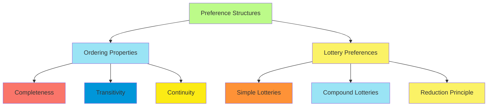
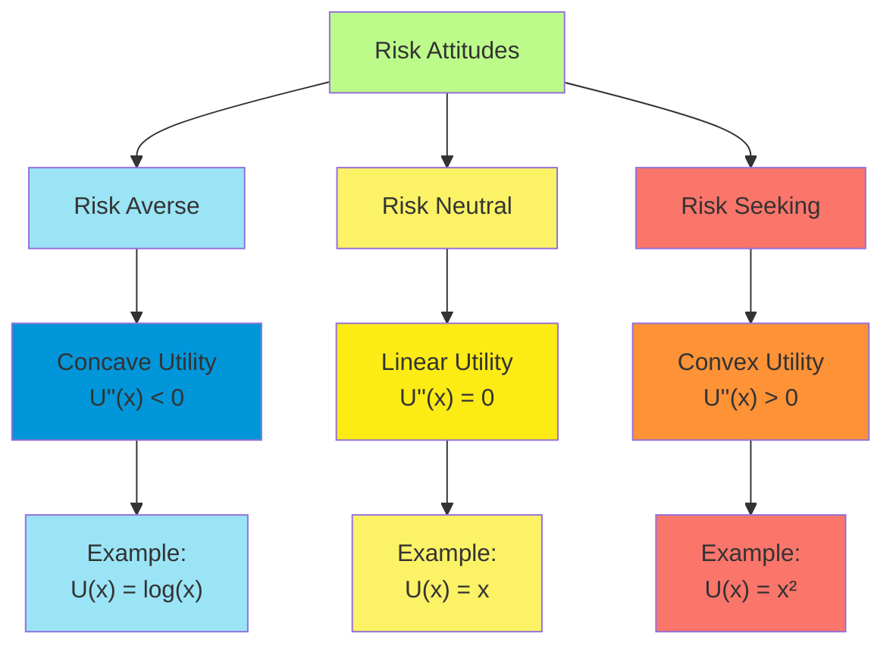
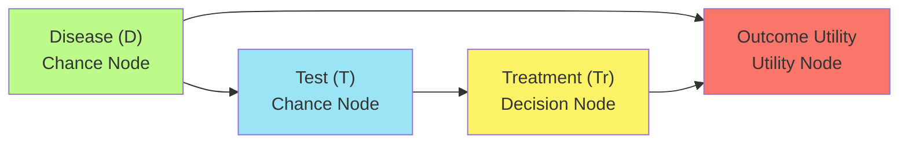
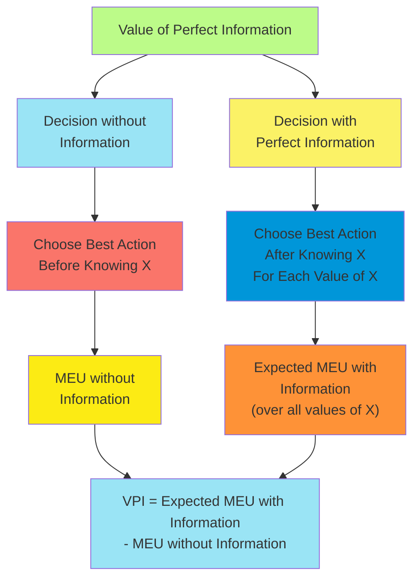
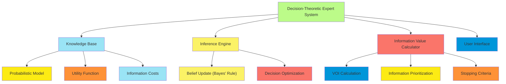

# C-14 | S-4: Making Simple Decisions

1. Combining Beliefs and Desires Under Uncertainty
    - Utility Theory Basics
    - Preference Orderings
    - Axioms of Utility Theory
    - Maximum Expected Utility Principle
2. Utility Functions
    - Properties of Utility Functions
    - Risk Aversion and Risk Seeking
    - The Utility of Money
    - Multiattribute Utility Functions
3. Decision Networks
    - Representing Decision Problems
    - Influence Diagrams
    - Computing the Value of Perfect Information
    - Sequential Decision Problems
4. The Value of Information
    - Definition and Properties
    - Computing Value of Information
    - Applications to Expert Systems
    - Information Gathering Agents

#### Combining Beliefs and Desires Under Uncertainty

##### Utility Theory Basics

Decision theory combines probability theory (beliefs about the world) with utility theory (desires or preferences) to
determine optimal actions under uncertainty. This framework formalizes how a rational agent should make decisions when
faced with incomplete information.

The fundamental insight of decision theory is that rational agents should choose actions that maximize their expected
utility—the average utility of an outcome, weighted by the probability of that outcome occurring. This provides a
normative model for decision-making under uncertainty.

Utility is a measure of the desirability of outcomes, and it addresses several limitations of simplistic goal-based
approaches:

1. **Multiple Goals**: In real-world scenarios, agents often have multiple, potentially conflicting goals. Utility
   functions provide a principled way to quantify trade-offs between different objectives.
2. **Uncertainty of Success**: When outcomes are uncertain, reaching a goal isn't binary but probabilistic. Utility
   theory allows reasoning about degrees of success.
3. **Sequential Decisions**: Many decision problems involve sequences of actions where earlier choices affect later
   options. Utility enables consistent evaluation across sequential choices.

A complete decision-theoretic agent has several key components:

- A set of possible actions the agent can take
- A model of how actions influence the world (transition model)
- A probability distribution representing the agent's beliefs about the current state
- A utility function mapping states to real numbers indicating desirability

The expected utility of an action is calculated as:

$EU(a|e) = \sum_{s} P(s|e, a) \times U(s)$

Where:

- $EU(a|e)$ is the expected utility of action $a$ given evidence $e$
- $P(s|e, a)$ is the probability of reaching state $s$ given evidence $e$ and action $a$
- $U(s)$ is the utility of state $s$

This formula integrates the agent's beliefs (represented by probabilities) with its desires (represented by utilities)
to guide action selection.

##### Preference Orderings

Preference orderings provide the foundation for utility theory by formalizing how agents rank possible outcomes. These
orderings must satisfy certain properties to ensure rational decision-making.

**Basic Concepts of Preference Orderings:**

1. **Strict Preference**: If an agent strictly prefers outcome A to outcome B, we write A ≻ B.
2. **Indifference**: If the agent is indifferent between outcomes A and B, we write A ∼ B.
3. **Weak Preference**: If the agent either prefers A to B or is indifferent between them, we write A ⪰ B.

A rational preference ordering should be:

- **Complete**: For any two outcomes A and B, either A ⪰ B, B ⪰ A, or both (if indifferent).
- **Transitive**: If A ⪰ B and B ⪰ C, then A ⪰ C.

Transitivity is particularly important for rational decision-making, as intransitive preferences can lead to circular
reasoning and exploitation. For example, if an agent prefers A > B > C > A (a cycle), it could be manipulated to give up
resources through repeated trades.

**Lotteries and Probabilistic Outcomes:**

Decision theory extends preference orderings to uncertain situations using lotteries. A lottery L is a probabilistic
outcome where:

L = [p₁, S₁; p₂, S₂; ...; pₙ, Sₙ]

This represents a situation where outcome Sᵢ occurs with probability pᵢ, where Σpᵢ = 1.

Preference orderings over lotteries allow us to reason about choices involving risk and uncertainty. If we can establish
an agent's preferences over lotteries, we can derive a utility function that represents these preferences.

**Compound Lotteries:**

Compound lotteries are lotteries whose outcomes can themselves be lotteries. A key principle is that rational agents
should be indifferent between a compound lottery and its equivalent simple lottery, where probabilities are
appropriately multiplied (known as the "reduction of compound lotteries" principle).

For example, if lottery L₁ gives [0.3, L₂; 0.7, S₃] and L₂ gives [0.6, S₁; 0.4, S₂], then L₁ is equivalent to: [0.3 ×
0.6, S₁; 0.3 × 0.4, S₂; 0.7, S₃] = [0.18, S₁; 0.12, S₂; 0.7, S₃]

This principle simplifies decision analysis by allowing compound choices to be reduced to simple probability
distributions over ultimate outcomes.

##### Axioms of Utility Theory

The axioms of utility theory, developed by von Neumann and Morgenstern, establish the conditions under which a rational
agent's preferences can be represented by a utility function. These axioms define what it means to be rational in the
context of decision-making under uncertainty.

**Six Fundamental Axioms:**

1. **Orderability (Completeness)**: Given any two outcomes or lotteries A and B, either A ⪰ B, B ⪰ A, or both (A ∼ B).
    - A rational agent can always express a preference or indifference between any outcomes.
    - There are no outcomes that cannot be compared.
2. **Transitivity**: If A ⪰ B and B ⪰ C, then A ⪰ C.
    - Preferences must be logically consistent.
    - Prevents preference cycles that could lead to irrational behavior.
3. **Continuity**: If A ≻ B ≻ C, then there exists a probability p where the agent is indifferent between B and the
   lottery [p, A; 1-p, C].
    - For any three outcomes, there's always a probability that makes the middle outcome equivalent to a lottery between
      the best and worst outcomes.
    - Ensures that preferences vary smoothly and no outcome is infinitely better than another.
4. **Substitutability (Independence)**: If A ∼ B, then [p, A; 1-p, C] ∼ [p, B; 1-p, C] for any outcome C and probability
   p.
    - If you're indifferent between two outcomes, you should be indifferent between lotteries that differ only in those
      outcomes with equal probabilities.
    - The value of a lottery component depends only on that component, not on what it's combined with.
5. **Monotonicity**: If A ≻ B, then [p, A; 1-p, B] ≻ [q, A; 1-q, B] if and only if p > q.
    - Given a choice between two lotteries involving the same outcomes, prefer the one that assigns higher probability
      to the preferred outcome.
    - More of a good thing is better.
6. **Decomposability**: Compound lotteries can be reduced to equivalent simple lotteries by multiplying probabilities.
    - Agents care only about final probabilities of outcomes, not the particular sequence of uncertain events leading to
      them.

**Utility Function Existence Theorem:**

von Neumann and Morgenstern proved that if an agent's preferences satisfy these axioms, then:

1. There exists a utility function U that assigns a real number to each outcome.
2. This function has the property that U(A) > U(B) if and only if A ≻ B.
3. The expected utility of a lottery [p₁, S₁; p₂, S₂; ...; pₙ, Sₙ] is: EU = p₁U(S₁) + p₂U(S₂) + ... + pₙU(Sₙ).
4. The utility function is unique up to a positive linear transformation (i.e., U' = aU + b for a > 0 represents the
   same preferences).

This theorem is profound because it shows that any agent with preferences satisfying these basic rationality axioms will
act as if it is maximizing the expected value of some utility function. This gives formal justification for the expected
utility framework.

**Implications and Controversies:**

While these axioms provide a compelling normative model for decision-making, there are ongoing debates about whether
they fully capture human rationality:

- **Descriptive Adequacy**: Empirical studies show that humans sometimes violate these axioms, leading to fields like
  behavioral economics.
- **Alternative Frameworks**: Some researchers advocate for generalizations of expected utility theory that relax
  certain axioms to better match observed decision-making patterns.
- **Bounded Rationality**: The axioms assume unlimited computational capacity, while real agents face constraints.

Nevertheless, the von Neumann-Morgenstern utility theory remains the cornerstone of decision theory and provides the
theoretical foundation for rational choice under uncertainty.

##### Maximum Expected Utility Principle

The Maximum Expected Utility (MEU) principle states that a rational agent should choose the action that maximizes the
expected utility of the outcome. This principle serves as the cornerstone of decision theory, providing a clear
criterion for optimal decision-making under uncertainty.

**Formal Definition:**

Given a set of possible actions {a₁, a₂, ..., aₙ}, the rational choice is the action aᵢ that maximizes:

$EU(a_i) = \sum_{j} P(O_j|a_i) \times U(O_j)$

Where:

- $EU(a_i)$ is the expected utility of action aᵢ
- $O_j$ are the possible outcome states
- $P(O_j|a_i)$ is the probability of outcome Oⱼ given action aᵢ
- $U(O_j)$ is the utility of outcome Oⱼ

**Example Application:**

Consider a medical diagnosis scenario:

- The doctor can choose between two treatments (a₁, a₂) for a patient
- There are two possible patient states: disease present (D) or absent (¬D)
- The probability of disease is P(D) = 0.7
- Treatment a₁ works well for D but has side effects for ¬D: U(a₁, D) = 0.8, U(a₁, ¬D) = -0.2
- Treatment a₂ is mild but less effective for D: U(a₂, D) = 0.4, U(a₂, ¬D) = 0.1

The expected utility calculations:

- EU(a₁) = 0.7 × 0.8 + 0.3 × (-0.2) = 0.56 - 0.06 = 0.5
- EU(a₂) = 0.7 × 0.4 + 0.3 × 0.1 = 0.28 + 0.03 = 0.31

Since EU(a₁) > EU(a₂), the MEU principle recommends treatment a₁.

**Properties of MEU:**

1. **Rationality**: The MEU principle is consistent with the axioms of utility theory—an agent that follows it will not
   exhibit preference reversals or other irrational behaviors.
2. **Optimality**: Under conditions of uncertainty, no other decision rule can consistently lead to higher expected
   utility. This can be proven mathematically from the utility axioms.
3. **Flexibility**: The MEU principle accommodates a wide variety of preferences and risk attitudes through different
   utility functions. It doesn't commit to specific values, only to the structure of rational decision-making.
4. **Computational Framework**: MEU provides a clear formulation for algorithms that implement rational decision-making
   in AI systems.

**Limitations and Extensions:**

1. **Computational Complexity**: Computing expected utilities can be intractable for large state spaces or complex
   probability distributions.
2. **Bounded Resources**: In practice, agents may need to make decisions with incomplete information or limited
   computational resources, leading to bounded rationality approaches.
3. **Risk-Sensitive Variants**: Extensions like risk-sensitive decision theory modify the standard MEU to better handle
   extreme outcomes or catastrophic risks.
4. **Partial Observability**: In partially observable environments, agents must reason about their future information
   states when making decisions, leading to extensions like POMDPs (Partially Observable Markov Decision Processes).

The MEU principle forms the theoretical foundation for rational decision-making under uncertainty and underlies many
sophisticated decision-making systems in AI, from expert systems to reinforcement learning agents.

#### Utility Functions

##### Properties of Utility Functions

Utility functions translate outcomes into numerical values that represent an agent's preferences. These functions have
several important properties that affect how they represent preferences and how they should be constructed.

**Ordinal vs. Cardinal Utility:**

1. **Ordinal Utility**: Represents only the order of preferences (A is preferred to B).
    - Invariant under strictly increasing transformations (any transformation that preserves order).
    - Sufficient for deterministic decision-making.
2. **Cardinal Utility**: Represents both order and strength of preferences.
    - Needed for decisions under uncertainty.
    - Invariant only under positive linear transformations: U'(s) = aU(s) + b where a > 0.
    - The expected utility hypothesis requires cardinal utility.

**Normalization:**

Utility functions can be normalized to convenient ranges without changing the implied preferences:

- Common normalizations include [0, 1] or [-1, 1]
- The "standard gamble" method often sets U(best) = 1 and U(worst) = 0
- Normalization simplifies comparisons and calculations

**Marginal Utility:**

Marginal utility is the change in utility from gaining or losing a small amount of a resource:

- Formally: MU(x) = dU(x)/dx, the derivative of the utility function
- Typically decreases as resource quantity increases (diminishing marginal utility)
- Example: The utility of gaining $1,000 is usually higher for someone with $10,000 than for someone with $1,000,000

**Utility Independence:**

When preferences over one attribute don't depend on the value of another attribute, we have utility independence:

- Formally: U(X, Y) can be written as f(X) + g(Y) when X and Y are utility independent
- Simplifies utility function construction
- Often only approximately true in real-world preferences

**Monotonicity:**

Utility functions are typically monotonic with respect to inherently desirable attributes:

- More money, health, safety, etc., leads to higher utility (positive monotonicity)
- More pollution, risk, work, etc., leads to lower utility (negative monotonicity)
- Monotonicity provides useful constraints for utility elicitation and verification

**Continuity:**

Most utility functions are continuous, meaning small changes in outcomes produce small changes in utility:

- Ensures that preferences vary smoothly rather than abruptly
- Allows for mathematical techniques like differentiation and optimization
- Discontinuities may occur at threshold points (e.g., bankruptcy)

**Domain-Specific Properties:**

Depending on the application domain, utility functions may have additional properties:

- **Time preferences**: Discount factors for future utilities
- **Social welfare**: Aggregation of individual utilities
- **Stationarity**: Unchanging preferences over time
- **Context-sensitivity**: Utility dependent on reference points

Understanding these properties is crucial for constructing appropriate utility functions that accurately represent an
agent's preferences and lead to rational decisions under the MEU principle.

##### Risk Aversion and Risk Seeking

Risk attitudes are fundamental aspects of decision-making under uncertainty, determining how agents evaluate gambles or
lotteries with the same expected monetary value but different risk profiles. Utility functions can represent these
attitudes mathematically.

**Defining Risk Attitudes:**

1. **Risk Neutral**: An agent who values a lottery at exactly its expected monetary value (EMV).
    - Utility function is linear: U(x) = ax + b
    - Expected utility equals expected monetary value: EU([p, $x; (1-p), $y]) = p·x + (1-p)·y
2. **Risk Averse**: An agent who prefers a guaranteed payoff to a risky gamble with the same expected value.
    - Utility function is concave (second derivative negative): U''(x) < 0
    - The certain equivalent of a lottery is less than its expected monetary value
    - Example: Preferring $50 with certainty to a 50% chance of $100 and 50% chance of $0
3. **Risk Seeking**: An agent who prefers a risky gamble to a guaranteed payoff with the same expected value.
    - Utility function is convex (second derivative positive): U''(x) > 0
    - The certain equivalent of a lottery is greater than its expected monetary value
    - Example: Preferring a 50% chance of $100 and 50% chance of $0 to $50 with certainty

**Mathematical Representation:**

Risk aversion can be quantified using the Arrow-Pratt measure of absolute risk aversion:

$A(x) = -\frac{U''(x)}{U'(x)}$

Where:

- U'(x) is the first derivative of the utility function (marginal utility)
- U''(x) is the second derivative
- Higher values of A(x) indicate greater risk aversion

**Common Utility Functions for Different Risk Attitudes:**

1. **Risk Neutral**: U(x) = x
2. **Risk Averse**:
    - Logarithmic: U(x) = log(x)
    - Exponential: U(x) = 1 - e^(-ax) where a > 0
    - Power: U(x) = x^b where 0 < b < 1
3. **Risk Seeking**:
    - Exponential: U(x) = e^(ax) where a > 0
    - Power: U(x) = x^b where b > 1

**The Insurance Principle:**

Risk aversion explains why people buy insurance. Consider a house valued at $100,000 with a 1% chance of burning down:

- Expected monetary loss: 0.01 × $100,000 = $1,000
- A risk-averse homeowner would pay more than $1,000 for insurance
- The difference between the fair premium ($1,000) and what people are willing to pay is the risk premium
- Insurance companies profit from this risk premium while pooling risks

**The Gambling Principle:**

Conversely, risk seeking explains why people gamble despite negative expected monetary value:

- A lottery ticket might cost $1 with a 1 in 10 million chance of winning $5 million
- Expected monetary value: (1/10,000,000) × $5,000,000 - $1 = -$0.50
- A risk-seeking individual derives utility from the possibility of winning that exceeds the negative expected value

**Mixed Risk Attitudes:**

Many people exhibit mixed risk attitudes:

- Risk aversion for large stakes (investments, insurance)
- Risk seeking for small stakes (lottery tickets, gambling)
- This can be modeled with utility functions that change curvature across different wealth levels

**Prospect Theory:**

Daniel Kahneman and Amos Tversky's Prospect Theory extends this framework by noting that:

- People evaluate outcomes relative to a reference point, not absolute wealth
- People are typically risk-averse for gains but risk-seeking for losses
- People overweight low probabilities and underweight high probabilities
- These empirical findings help explain observed deviations from expected utility theory

Understanding risk attitudes is essential for modeling realistic decision-makers and designing systems that make
appropriate decisions under uncertainty.

##### The Utility of Money

Money is a central consideration in many decision problems, and understanding its utility characteristics is crucial for
modeling economic decisions accurately. The relationship between money and utility has several important aspects.

**Diminishing Marginal Utility of Wealth:**

One of the most important principles is that the utility of money typically exhibits diminishing marginal returns:

- Each additional dollar provides less utility than the previous one
- This principle explains risk aversion and many economic behaviors
- Mathematically: U''(x) < 0, where x represents wealth

**Common Utility Functions for Money:**

Several utility functions are commonly used to model the utility of money:

1. **Logarithmic Utility**: U(x) = log(x)
    - Simple model with constant relative risk aversion
    - Implies that utility scales with the logarithm of wealth
    - Example: Doubling wealth adds the same utility regardless of starting amount
2. **Power Utility**: U(x) = x^a, where 0 < a < 1
    - Provides flexible risk aversion through parameter a
    - Lower values of a indicate higher risk aversion
    - Special case: Square root utility (a = 0.5)
3. **Exponential Utility**: U(x) = -e^(-ax), where a > 0
    - Exhibits constant absolute risk aversion
    - Parameter a controls the degree of risk aversion
    - Convenient for certain mathematical analyses
4. **Isoelastic Utility**: U(x) = (x^(1-η) - 1)/(1-η), where η > 0, η ≠ 1
    - Generalizes log utility (which is the limiting case as η → 1)
    - Constant relative risk aversion of η
    - Widely used in economics and finance

**Measuring the Marginal Utility of Money:**

The marginal utility of money can be inferred from observed decisions under risk:

- Standard gamble method: Find indifference points between certain amounts and lotteries
- Revealed preference: Analyze actual financial decisions like insurance purchases
- Experimental economics: Controlled experiments testing monetary choices

**Wealth Effects:**

The utility of money is significantly affected by an individual's existing wealth:

- A $1,000 gain means more to someone with $10,000 than to someone with $1,000,000
- Losses often have larger utility impacts than gains of the same magnitude
- Utility functions should account for total wealth, not just changes in wealth

**Example Calculation:**

Consider a person with a logarithmic utility function U(x) = log(x) and current wealth of $100,000:

- Utility of current wealth: U($100,000) = log(100,000) ≈ 11.51
- Utility after gaining $10,000: U($110,000) = log(110,000) ≈ 11.61
- Utility after losing $10,000: U($90,000) = log(90,000) ≈ 11.41
- Notice that the loss of $10,000 reduces utility more than the gain of $10,000 increases it

**Practical Implications:**

Understanding the utility of money has practical implications for decision-making:

1. **Investment Strategies**: Optimal portfolio allocation depends on the investor's utility function
2. **Insurance Pricing**: Determining fair premiums requires modeling customers' risk aversion
3. **Public Policy**: Cost-benefit analyses should account for diminishing marginal utility
4. **Incentive Design**: Effectiveness of monetary incentives varies with wealth levels
5. **AI Systems**: Economic decision-making agents need realistic utility models for money

The utility of money is rarely linear, and this non-linearity is essential for modeling realistic economic decisions
under uncertainty.

##### Multiattribute Utility Functions

Most real-world decisions involve multiple objectives or attributes that must be traded off against each other.
Multiattribute utility theory provides a framework for representing preferences over outcomes with multiple dimensions.

**Challenges of Multiple Attributes:**

When decisions involve multiple attributes (e.g., cost, time, quality, safety), several challenges arise:

- Attributes often have different units and scales
- Preferences over one attribute may depend on values of others
- Trade-offs between attributes must be quantified
- The dimensionality of the decision space grows exponentially

**Key Concepts in Multiattribute Utility:**

1. **Dominance**: Outcome A dominates outcome B if A is at least as good as B in all attributes and strictly better in
   at least one.
    - Dominated options can be eliminated from consideration
    - Nondominated options form the Pareto frontier
2. **Preference Independence**: Attributes X and Y are preferentially independent if preferences over X values don't
   depend on the value of Y.
    - Simplifies utility function construction
    - Allows separate evaluation of individual attributes
3. **Utility Independence**: Attribute X is utility independent of Y if the utility function over X (with Y fixed) has
   the same form regardless of the value of Y.
    - Weaker condition than preference independence
    - Important for determining the form of multiattribute utility functions

**Forms of Multiattribute Utility Functions:**

1. **Additive Utility**: $U(x_1, x_2, ..., x_n) = \sum_{i=1}^{n} w_i U_i(x_i)$
    - Requires mutual preferential independence between all attributes
    - w_i are scaling constants (weights) and U_i are single-attribute utility functions
    - Simplest form, but requires strong independence assumptions
2. **Multiplicative Utility**:
   $U(x_1, x_2, ..., x_n) = \frac{1}{k} \left[ \prod_{i=1}^{n} (1 + k w_i U_i(x_i)) - 1 \right]$
    - Applies when attributes are utility independent but not additively independent
    - Parameter k measures the degree of interaction between attributes
    - Reduces to additive form when k = 0
3. **Multilinear Utility**: More general form incorporating interaction terms between attributes
    - Used when some attributes exhibit utility interactions
    - Includes terms for pairs, triplets, etc., of attributes

**Construction Methods:**

Several techniques exist for constructing multiattribute utility functions:

1. **Direct Assessment**: Directly elicit preferences over multiattribute outcomes
    - Challenging due to the high-dimensional space
    - Often requires many assessment questions
2. **Decomposition Approaches**: Assess single-attribute utilities and then combine them
    - Verify independence conditions
    - Determine single-attribute utility functions
    - Assess scaling constants (weights)
    - Determine the appropriate functional form
3. **Swing Weighting**: Method for determining attribute weights
    - Consider swinging each attribute from its worst to best value
    - Rank these swings in order of preference
    - Assign proportional values to each swing

**Example Application: Medical Treatment Decision**

Consider choosing a treatment with three attributes: efficacy (E), side effects (S), and cost (C):

1. Check independence conditions (assume they're satisfied)
2. Construct single-attribute utility functions:
    - U_E(e) = efficacy utility (increasing function)
    - U_S(s) = side effect utility (decreasing function)
    - U_C(c) = cost utility (decreasing function)
3. Determine weights through preference elicitation (e.g., w_E = 0.5, w_S = 0.3, w_C = 0.2)
4. Apply additive formula: U(e,s,c) = 0.5×U_E(e) + 0.3×U_S(s) + 0.2×U_C(c)
5. Evaluate and compare treatments using this function

**Practical Considerations:**

1. **Attribute Identification**: Ensuring all relevant attributes are included
2. **Verification of Independence**: Testing independence assumptions
3. **Sensitivity Analysis**: Examining how robust decisions are to changes in weights
4. **Stakeholder Involvement**: Incorporating multiple perspectives in utility assessment
5. **Computational Complexity**: Managing the exponential growth in complexity with additional attributes

Multiattribute utility functions provide a principled approach to complex decision problems, allowing systematic
consideration of trade-offs between competing objectives.

#### Decision Networks

##### Representing Decision Problems

Decision networks (also called influence diagrams) provide a graphical representation of decision problems under
uncertainty, extending Bayesian networks to include decision variables and utility functions.

**Basic Components of Decision Networks:**

A decision network consists of three types of nodes:

1. **Chance Nodes** (Ovals/Circles):
    - Represent random variables (events not under the agent's control)
    - Function identically to nodes in Bayesian networks
    - Quantified by conditional probability tables (CPTs)
2. **Decision Nodes** (Rectangles):
    - Represent points where the agent must make a choice
    - The possible actions are the values of the decision variable
    - No associated probability distribution (the agent chooses deterministically)
3. **Utility Nodes** (Diamonds):
    - Represent the agent's utility function
    - Typically depend on both chance and decision nodes
    - Quantified by utility tables specifying utility for each combination of parent values

**Arcs in Decision Networks:**

The arcs in a decision network have specific interpretations:

1. **Arcs into Chance Nodes**:
    - Represent probabilistic dependence (as in Bayesian networks)
    - The chance node has a CPT conditioned on all parent nodes
2. **Arcs into Decision Nodes**:
    - Represent information available at the time of decision
    - Called "information links" or "relevance arcs"
    - Indicate that the value of the parent node will be known when making the decision
3. **Arcs into Utility Nodes**:
    - Indicate that utility depends on the values of the parent nodes
    - Both chance and decision nodes can point to utility nodes

**Example: Medical Treatment Decision**

Consider a doctor deciding whether to treat a patient who may or may not have a disease:

- Chance Nodes:
    - Disease (D): Whether the patient has the disease (true/false)
    - Test (T): Result of a diagnostic test (positive/negative)
- Decision Node:
    - Treatment (Tr): Whether to administer treatment (treat/don't treat)
- Utility Node:
    - Outcome Utility: Depends on disease status and treatment decision

In this network:

- An arc from Disease to Test indicates the test result depends on disease presence
- An arc from Test to Treatment indicates the test result is known when deciding on treatment
- Arcs from Disease and Treatment to the Utility node show that utility depends on both the disease status and treatment
  choice

**Time Sequence in Decision Networks:**

Decision networks implicitly represent a temporal sequence:

1. Chance nodes with no predecessors represent prior knowledge
2. Decision nodes are ordered according to when decisions must be made
3. Chance nodes between decisions represent intervening events
4. The utility node represents the final outcome value

This temporal structure is essential for properly representing sequential decision problems.

**Advantages of Decision Networks:**

1. **Visual Clarity**: Graphically displays the relationships between variables, decisions, and outcomes
2. **Compact Representation**: Efficiently represents complex decision problems
3. **Explicit Information Structure**: Clearly shows what information is available for each decision
4. **Integration with Probabilistic Reasoning**: Leverages Bayesian network machinery for uncertainty handling
5. **Modularity**: Components can be developed and modified independently

Decision networks provide a powerful framework for representing and analyzing decision problems under uncertainty,
combining the expressive power of Bayesian networks with decision-theoretic principles.

##### Influence Diagrams

Influence diagrams (another name for decision networks) provide both a representation of decision problems and a
framework for solving them. This section focuses on the structural properties and evaluation methods for influence
diagrams.

**Structural Properties of Influence Diagrams:**

1. **No-forgetting Condition**:

    - If a variable is known when making decision D1, it should also be known when making any subsequent decision D2
    - Graphically: Any node that is a parent of decision D1 should also be a parent of any later decision D2, either
      directly or through intermediate decision nodes
    - Represents the assumption that the agent remembers previous information

2. **Regularity**:

    - There must be a directed path that includes all decision nodes

    - This path determines the temporal ordering of decisions

    - No cycles are allowed (the diagram must be acyclic)

3. **Relevance Arcs**:

    - Arcs into decision nodes represent available information

    - Only include arcs if the information is relevant to the decision

    - Omitting irrelevant arcs simplifies the diagram and analysis

4. **Single Utility Node**:

    - Standard influence diagrams contain a single utility node

    - Multiple utility considerations can be combined into this node

    - Alternative formulations may use multiple utility nodes with combination rules

**Evaluating Influence Diagrams:**

The goal of evaluating an influence diagram is to determine the optimal decision strategy—a mapping from information
states to actions for each decision node. The evaluation process includes:

1. **Variable Elimination Method**:
    - Similar to variable elimination in Bayesian networks
    - Eliminates chance and decision nodes in reverse topological order
    - For decision nodes, maximizes expected utility
    - For chance nodes, computes expectations (sums out)
2. **Message-Passing Algorithm**:
    - Computes the maximum expected utility (MEU) for each decision
    - Backward induction from the utility node to decision nodes
    - Calculates optimal policies at each decision point
3. **Conversion to Decision Tree**:
    - Influence diagrams can be converted to equivalent decision trees
    - Decision trees explicitly enumerate all possible scenarios
    - Exponentially larger representation, but conceptually simpler evaluation

**Example Evaluation Process**:

For a simple medical diagnosis influence diagram:

1. Start with the utility function U(D, Tr) giving utility for each combination of disease state and treatment
2. Consider the treatment decision: For each possible test result t, compute optimal treatment: Tr\*(t) = argmax_Tr ∑_d
   P(d|t) × U(d, Tr)
3. Calculate the expected utility of the optimal treatment strategy: EU(t) = max_Tr ∑_d P(d|t) × U(d, Tr)
4. Compute the expected utility of the testing strategy by weighting over possible test results: EU(test) = ∑_t P(t) ×
   EU(t)
5. Compare with the expected utility without testing to determine whether testing is worthwhile

**Extensions to Basic Influence Diagrams:**

1. **Limited Memory Influence Diagrams (LIMIDs)**:
    - Relax the no-forgetting assumption
    - Explicitly represent what information is remembered for each decision
    - Can model bounded rationality or partial observability
2. **Multi-attribute Utility Nodes**:
    - Use multiple utility nodes for different objectives
    - Combine with aggregation rules (additive, multiplicative, etc.)
    - Enables more explicit representation of trade-offs
3. **Dynamic Influence Diagrams**:
    - Extend to multi-stage decision problems
    - Use templates that repeat over time periods
    - Similar to dynamic Bayesian networks, but with decision nodes
4. **Team Decision Analysis**:
    - Multiple agents making decisions
    - Shared or individual utility functions
    - Communication and coordination constraints

Influence diagrams provide a powerful and flexible framework for modeling and solving decision problems under
uncertainty, combining the graphical clarity of Bayesian networks with the normative principles of decision theory.

##### Computing the Value of Perfect Information

The Value of Perfect Information (VPI) quantifies how much a decision-maker should be willing to pay to obtain
additional information before making a decision. This concept is fundamental to rational information gathering in
decision-making under uncertainty.

**Definition of VPI:**

The value of perfect information about a random variable X is the expected increase in maximum utility when knowing the
value of X before making a decision:

$VPI(X) = E_X[max_a U(a, X)] - max_a E_X[U(a, X)]$

Where:

- $E_X[max_a U(a, X)]$ is the expected utility with perfect information (decide after knowing X)
- $max_a E_X[U(a, X)]$ is the expected utility without the information (decide before knowing X)

**Key Properties of VPI:**

1. **Non-negativity**: VPI is always greater than or equal to zero
    - Perfect information never reduces expected utility
    - At worst, the agent ignores the information and chooses the same action
2. **Non-additivity**: The VPI of multiple variables can be less than the sum of individual VPIs
    - Information value can overlap when variables are correlated
    - $VPI(X,Y) \leq VPI(X) + VPI(Y)$ (with equality only when X and Y are independent in a specific sense)
3. **Order-dependence**: The VPI of X after learning Y may differ from the VPI of X before learning Y
    - Formally: $VPI(X|Y) \neq VPI(X)$ in general
    - Learning one piece of information can increase or decrease the value of another

**Computing VPI in Influence Diagrams:**

To compute VPI within an influence diagram:

1. Create two versions of the diagram:
    - Original diagram (decision made without knowing X)
    - Modified diagram with an information link from X to the decision node
2. Evaluate both diagrams to find the maximum expected utility in each case
3. The difference in expected utility is the VPI for X

**Example: Medical Testing Decision**

Consider a doctor deciding whether to treat a patient who may have a disease:

- Prior probability of disease: P(Disease) = 0.1
- Treatment utility: U(Treat, Disease) = 0.7, U(Treat, No Disease) = -0.1
- No treatment utility: U(No Treat, Disease) = -0.9, U(No Treat, No Disease) = 0.0

Without testing:

- EU(Treat) = 0.1 × 0.7 + 0.9 × (-0.1) = 0.07 - 0.09 = -0.02
- EU(No Treat) = 0.1 × (-0.9) + 0.9 × 0.0 = -0.09
- Best action is Treat with EU = -0.02

With perfect testing:

- If test shows Disease (prob 0.1): Best action is Treat with U = 0.7
- If test shows No Disease (prob 0.9): Best action is No Treat with U = 0.0
- Expected utility = 0.1 × 0.7 + 0.9 × 0.0 = 0.07

Thus, VPI = 0.07 - (-0.02) = 0.09

The doctor should be willing to pay up to 0.09 utility units for the perfect test.

**Applications of VPI:**

1. **Test Selection**: Determining which medical tests to perform
2. **Sensor Placement**: Deciding where to place sensors in monitoring systems
3. **Information Purchase**: Valuing market research or expert consultations
4. **Experimental Design**: Prioritizing experiments that provide the most valuable information
5. **Active Learning**: Selecting the most informative training examples in machine learning

**Practical Considerations:**

1. **Myopic Assumption**: Standard VPI calculation is myopic (considers one variable at a time)
2. **Computation Challenges**: Exact VPI calculation can be expensive for complex models
3. **Imperfect Information**: Real tests are rarely perfect, requiring more complex valuation
4. **Multiple Decisions**: VPI calculations become more complex with sequential decisions
5. **Cost-Benefit Analysis**: Information value must be compared with acquisition costs

The concept of VPI provides a theoretically sound basis for rational information gathering, guiding agents to collect
only information that can potentially improve their decisions by a sufficient amount.

##### Sequential Decision Problems

Sequential decision problems involve making a series of decisions over time, where earlier decisions can affect the
options available and outcomes achieved in later stages. These problems require specialized techniques beyond
single-decision analysis.

**Characteristics of Sequential Decision Problems:**

1. **Temporal Structure**: Decisions are made at multiple points in time
2. **State Transitions**: The world state changes between decision points
3. **Information Acquisition**: New information becomes available over time
4. **Path Dependence**: Earlier decisions constrain or influence later options
5. **Delayed Rewards**: Benefits may not be immediate but accumulate over time

**Representation Methods:**

Sequential decision problems can be represented through several formalisms:

1. **Multi-stage Influence Diagrams**:
    - Extended influence diagrams with multiple decision nodes
    - Temporal ordering indicated by diagram structure
    - Explicitly shows information available at each stage
2. **Decision Trees**:
    - Explicit enumeration of all possible decision sequences
    - Alternating decision and chance nodes
    - Complete representation but grows exponentially with problem size
3. **Markov Decision Processes (MDPs)**:
    - States, actions, transition model, and reward function
    - Assumes full observability of states
    - Efficient representation for large problems
4. **Partially Observable MDPs (POMDPs)**:
    - Extends MDPs to partial observability settings
    - Maintains belief states over possible world states
    - More realistic but computationally challenging

**Solution Methods: Backward Induction**

The standard solution approach for finite-horizon sequential decision problems is backward induction:

1. Start at the final decision stage
2. For each possible state, compute the optimal action and its expected utility
3. Move to the preceding stage
4. For each state, compute the optimal action considering both immediate rewards and future expected utility
5. Continue backward until reaching the initial stage

This produces a contingent plan or policy mapping states to optimal actions at each stage.

**Example: Stock Investment Problem**

Consider a two-stage investment problem:

- Initial capital: $1,000
- Decision 1: How much to invest in a risky stock vs. safe bond
- Market moves: Stock either rises (60% chance) or falls (40% chance)
- Decision 2: Adjust investment after observing market move
- Final payoff: Total wealth after second market move

Solving this requires:

1. Calculating optimal second-stage decisions for each possible state
2. Determining expected future value for each first-stage action
3. Selecting the first-stage action that maximizes expected utility

**Value Functions and Optimal Policies:**

For sequential problems, we define:

- **Value function** V(s): Expected utility achievable from state s
- **Q-function** Q(s,a): Expected utility of taking action a in state s
- **Optimal policy** π\*(s): Mapping from states to optimal actions

The Bellman equation captures the recursive nature of the value function: V*(s) = max_a [R(s,a) + γ·∑_s'
P(s'|s,a)·V*(s')]

Where:

- R(s,a) is the immediate reward
- γ is a discount factor for future rewards
- P(s'|s,a) is the transition probability to state s'
- V\*(s') is the optimal value of future state s'

**Key Challenges in Sequential Decision Problems:**

1. **Exponential Growth**: The number of possible scenarios grows exponentially
2. **Value Function Representation**: Representing value functions over large state spaces
3. **Infinite Horizons**: Decision problems with no fixed end point
4. **Partial Observability**: Dealing with hidden state variables
5. **Non-stationarity**: Handling changing dynamics or preferences

**Approximation Techniques:**

For large sequential decision problems, approximation methods include:

1. **Value Function Approximation**: Representing value functions using function approximators
2. **Monte Carlo Tree Search**: Selective exploration of decision paths
3. **Rolling Horizon Planning**: Solving for a limited future horizon and repeating
4. **Reinforcement Learning**: Learning optimal policies from experience
5. **State Abstraction**: Grouping similar states to reduce problem size

Sequential decision problems represent a significant extension beyond simple single-stage decisions, capturing the
complexity of real-world planning scenarios where agents must reason about long-term consequences and adapt to new
information.

#### The Value of Information

##### Definition and Properties

The Value of Information (VOI) generalizes the concept of perfect information to any information source that might
reduce uncertainty and potentially improve decision-making. It provides a principled way to assess whether gathering
additional information is worthwhile.

**Formal Definition:**

The Value of Information for observation O before making decision D is the difference between the expected utility when
optimizing with observation O and the expected utility when optimizing without it:

$VOI(O) = E_O[max_d EU(d|O)] - max_d EU(d)$

Where:

- $E_O[max_d EU(d|O)]$ is the expected utility when observing O and then deciding optimally
- $max_d EU(d)$ is the expected utility of the best decision without observing O

**Fundamental Properties of VOI:**

1. **Non-negativity**: VOI is always greater than or equal to zero
    - Additional information cannot decrease expected utility for a rational agent
    - The agent can always ignore useless information
2. **Upper Bound by VPI**: The value of any imperfect information source is bounded by the value of perfect information
    - $VOI(O) \leq VPI(X)$ where X is the variable of interest
    - Equality holds only when O perfectly reveals X
3. **Diminishing Returns**: The marginal value of information typically decreases as more is acquired
    - $VOI(O_2|O_1) \leq VOI(O_2)$ (value of O₂ after seeing O₁ is less than its original value)
    - Important for sequential information gathering
4. **Context Dependence**: VOI depends on:
    - Prior knowledge
    - Available actions
    - Utility function
    - Information gathering costs

**Calculations for Different Information Types:**

1. **Perfect Information**: As described in the previous section
    - Observes exact value of a variable
    - Highest possible information value
2. **Noisy Information**:
    - Observation O is probabilistically related to variable X
    - Requires modeling P(O|X) (the observation model)
    - Compute posterior P(X|O) using Bayes' rule
    - Evaluate decisions based on this posterior for each possible observation
3. **Partial Information**:
    - Reveals some aspects of a variable but not others
    - Example: Learning the range but not exact value
    - Requires appropriate partitioning of the state space

**VOI as a Measure of Information Sensitivity:**

VOI can be used to analyze how sensitive a decision is to specific uncertainties:

- High VOI indicates critical uncertainties that should be resolved
- Low VOI indicates robustness to particular uncertainties
- Zero VOI occurs when:
    - The same decision is optimal regardless of the variable's value
    - The variable doesn't affect the outcomes of concern
    - The prior information is already sufficient

**Example: Product Development Decision**

A company is deciding whether to launch a new product:

- Launch costs: $1M
- Success revenue: $5M (30% prior probability)
- Failure revenue: $0 (70% prior probability)
- Expected value without information: 0.3 × ($5M - $1M) + 0.7 × (−$1M) = $0.5M

A market study provides noisy information about potential success:

- P(Positive result | Success) = 0.8
- P(Positive result | Failure) = 0.3

Calculating VOI requires:

1. Computing the posterior probabilities after each possible test result using Bayes' rule
2. Determining the optimal decision for each result
3. Weighting by the probability of each result
4. Comparing to the expected value without testing

**Relation to Information Theory:**

VOI connects to information theory concepts:

- Shannon entropy measures uncertainty reduction
- VOI measures decision utility of uncertainty reduction
- Two information sources might reduce entropy equally but have different VOI based on decision relevance

Understanding the value of information provides a principled framework for deciding when to gather more information
before acting, balancing the benefits of reduced uncertainty against the costs of information acquisition.

##### Computing Value of Information

Computing the Value of Information (VOI) requires systematically analyzing how new information would affect decisions
and their expected outcomes. This section details practical approaches to VOI calculation.

**General Computation Procedure:**

The VOI calculation involves these key steps:

1. **Determine the optimal decision without information**:
    - Compute $EU(d)$ for each possible decision d
    - Identify $d^* = \arg\max_d EU(d)$ and its expected utility $EU(d^*)$
2. **For each possible observation value**:
    - Update probabilities using Bayes' rule: $P(s|o) = \frac{P(o|s) \times P(s)}{P(o)}$
    - Recalculate expected utilities: $EU(d|o) = \sum_s P(s|o) \times U(d,s)$
    - Find the new optimal decision: $d_o^* = \arg\max_d EU(d|o)$
    - Calculate the conditional expected utility: $EU(d_o^*|o)$
3. **Weight by observation probabilities**:
    - Compute the marginal probability of each observation: $P(o) = \sum_s P(o|s) \times P(s)$
    - Calculate the expected utility with information: $EU_{info} = \sum_o P(o) \times EU(d_o^*|o)$
4. **Compute the difference**:
    - VOI = $EU_{info} - EU(d^*)$

**Computation in Influence Diagrams:**

Within an influence diagram framework:

1. Create two diagrams:
    - Original diagram without the information link from the observation
    - Modified diagram with the information link added
2. Solve both diagrams for maximum expected utility
3. The difference in expected utility is the VOI

**Efficient VOI Algorithms:**

For complex models, several techniques improve computational efficiency:

1. **Relevance-Based Pruning**:
    - Identify variables that cannot affect the VOI calculation
    - Eliminate them from consideration using d-separation properties
2. **Factored Computation**:
    - Exploit conditional independence structure
    - Avoid recomputing probabilities that don't change
3. **Monte Carlo Estimation**:
    - Sample possible states and observations
    - Estimate VOI from samples
    - Useful for continuous or high-dimensional problems

**Example: Medical Decision with Diagnostic Test**

A doctor is deciding whether to administer a treatment:

- The patient either has disease D (20% prior) or not (80% prior)
- Treatment utility: U(Treat, D) = 70, U(Treat, ¬D) = -20
- No treatment utility: U(No Treat, D) = -100, U(No Treat, ¬D) = 0

Step 1: Optimal decision without test

- EU(Treat) = 0.2 × 70 + 0.8 × (-20) = 14 - 16 = -2
- EU(No Treat) = 0.2 × (-100) + 0.8 × 0 = -20
- Best decision: Treat with EU = -2

Step 2: Analysis with test results

- Test accuracy: P(Positive|D) = 0.9, P(Negative|¬D) = 0.85

For positive result:

- P(Positive) = 0.9 × 0.2 + 0.15 × 0.8 = 0.18 + 0.12 = 0.3
- P(D|Positive) = (0.9 × 0.2) ÷ 0.3 = 0.6
- P(¬D|Positive) = (0.15 × 0.8) ÷ 0.3 = 0.4
- EU(Treat|Positive) = 0.6 × 70 + 0.4 × (-20) = 42 - 8 = 34
- EU(No Treat|Positive) = 0.6 × (-100) + 0.4 × 0 = -60
- Best decision: Treat with EU = 34

For negative result:

- P(Negative) = 0.1 × 0.2 + 0.85 × 0.8 = 0.02 + 0.68 = 0.7
- P(D|Negative) = (0.1 × 0.2) ÷ 0.7 ≈ 0.029
- P(¬D|Negative) = (0.85 × 0.8) ÷ 0.7 ≈ 0.971
- EU(Treat|Negative) = 0.029 × 70 + 0.971 × (-20) ≈ 2.03 - 19.42 = -17.39
- EU(No Treat|Negative) = 0.029 × (-100) + 0.971 × 0 ≈ -2.9
- Best decision: No Treat with EU = -2.9

Step 3: Expected utility with test

- EU_info = 0.3 × 34 + 0.7 × (-2.9) = 10.2 - 2.03 = 8.17

Step 4: Value of information

- VOI = 8.17 - (-2) = 10.17

The test has significant value and should be performed if it costs less than 10.17 utility units.

**Computational Challenges:**

1. **State Space Explosion**: As the number of state variables increases, computation becomes intractable
2. **Continuous Variables**: Require approximation or discretization
3. **Multiple Information Sources**: Evaluating combinations is exponentially complex
4. **Limited Computational Resources**: Often requires approximation in real-time settings

VOI computation provides a principled approach to information valuation, though practical applications often require
approximations and domain-specific optimizations.

##### Applications to Expert Systems

Expert systems that incorporate decision-theoretic principles use the Value of Information to intelligently gather data
and make recommendations. This approach has revolutionized how these systems interact with users and domain experts.

**Decision-Theoretic Expert Systems:**

Unlike traditional rule-based expert systems, decision-theoretic expert systems:

- Represent uncertainty explicitly using probabilities
- Quantify preferences using utility functions
- Value information based on its decision impact
- Balance information gathering costs against benefits

**Key Applications in Healthcare:**

1. **Medical Diagnosis Systems**:
    - Pathfinder: Diagnostic system for lymph node pathology
    - DXplain: Interactive diagnosis tool that suggests additional tests
    - QMR-DT: Decision-theoretic version of Quick Medical Reference
2. **Treatment Planning**:
    - TERAPIA: System for cancer treatment planning
    - TREAT: Antibiotic selection based on infection information
    - MLDS: Liver transplant decision support

These systems apply VOI to prioritize questions, tests, and observations, focusing on information that has the highest
potential to improve treatment decisions.

**Intelligent Information Gathering:**

VOI enables expert systems to:

1. **Prioritize Questions**: Ask about symptoms or features with highest decision impact
    - Skip irrelevant or low-value questions
    - Adapt questioning based on previous answers
2. **Recommend Tests**: Suggest diagnostic procedures based on their expected value
    - Consider test costs, risks, and diagnostic power
    - Provide personalized recommendations based on patient-specific factors
3. **Stop Information Gathering**: Determine when sufficient information exists
    - Recognize when additional data won't change recommendations
    - Balance the cost of delay against improved decision quality

**Example: Diagnostic Sequence Optimization**

A medical expert system might:

1. Start with history questions (low cost, moderate information)
2. Update disease probabilities after each answer
3. Compute VOI for potential tests and examinations
4. Recommend highest-value tests first
5. Terminate when remaining tests have VOI less than their cost

**Real-World Implementation Challenges:**

1. **Preference Elicitation**: Quantifying patient and physician utilities
2. **Knowledge Base Construction**: Building accurate probabilistic models
3. **Computational Complexity**: Managing real-time VOI calculations
4. **Integration with Workflow**: Fitting into clinical processes
5. **Trust and Acceptance**: Building user confidence in recommendations

**Beyond Healthcare:**

VOI-based expert systems have been applied in:

1. **Environmental Monitoring**: Optimizing sensor placement and sampling strategies
2. **Equipment Diagnosis**: Troubleshooting complex machinery with minimal testing
3. **Financial Advising**: Determining which financial information to gather from clients
4. **Oil Exploration**: Valuing geological surveys and test wells
5. **Agricultural Decision Support**: Optimizing soil testing and crop monitoring

**Impact on Expert System Design:**

VOI has fundamentally changed expert system architecture:

- From rigid rule-based question sequences to adaptive information gathering
- From deterministic reasoning to probabilistic inference
- From binary diagnoses to probability distributions over possibilities
- From fixed protocols to personalized recommendations

These systems demonstrate the practical value of decision theory in creating more intelligent, efficient systems that
maximize the utility of information gathering.

##### Information Gathering Agents

Information gathering agents use the Value of Information principle to autonomously collect data in service of their
goals. These agents must balance exploration (gathering information) with exploitation (acting on current knowledge) to
maximize overall utility.

**Types of Information Gathering Agents:**

1. **Active Sensing Agents**:
    - Control their sensors to gather specific information
    - Example: A robot that actively moves its camera to observe key features
    - VOI guides where to point sensors and when to switch modes
2. **Information Acquisition Agents**:
    - Seek out information from external sources
    - Example: Web crawlers that prioritize which pages to visit
    - VOI determines which sources to query and in what order
3. **Experimental Agents**:
    - Design and conduct experiments to reduce uncertainty
    - Example: Scientific discovery systems that propose experiments
    - VOI helps design experiments with maximum expected information gain
4. **Query Selection Agents**:
    - Formulate questions to ask humans or other systems
    - Example: Interactive troubleshooting assistants
    - VOI guides question selection to minimize total questions needed

**VOI-Based Information Gathering Strategies:**

1. **Myopic Approach**:
    - Selects information source with highest immediate VOI
    - Computes VOI for each available information source
    - Chooses the highest-value source, then reevaluates after observing
    - Computationally tractable but potentially suboptimal for sequential gathering
2. **Look-ahead Planning**:
    - Considers sequences of information gathering actions
    - Models the problem as a Partially Observable Markov Decision Process (POMDP)
    - Plans multiple steps ahead to account for information interdependencies
    - More computationally intensive but captures sequential value
3. **Adaptive Strategies**:
    - Adjust information gathering based on observations
    - Update beliefs and recompute VOI after each observation
    - May completely change strategy based on unexpected findings
    - Balance computational cost of replanning against improved decisions

**Applications in Autonomous Systems:**

1. **Robotic Exploration**:
    - Planetary rovers deciding which terrain to investigate
    - Underwater vehicles mapping ocean floors
    - Search and rescue robots locating survivors
2. **Autonomous Vehicles**:
    - Optimizing sensor usage in different driving conditions
    - Active perception for obstacle detection
    - Determining when to request human intervention
3. **Monitoring Systems**:
    - Environmental monitoring networks
    - Industrial process monitoring
    - Infrastructure health monitoring
4. **Intelligent Tutoring Systems**:
    - Assessing student knowledge through adaptive questioning
    - Personalizing learning paths based on uncertainty reduction
    - Optimizing test item selection

**Handling Resource Constraints:**

Real-world information gathering agents face multiple constraints:

1. **Time Constraints**:
    - Limited time for gathering information before decisions are required
    - Time-dependent utility functions
    - Trading off information quality against timeliness
2. **Cost Constraints**:
    - Different information sources have varied acquisition costs
    - Budget-limited information gathering
    - Return on investment calculations for information
3. **Computational Constraints**:
    - Limited processing capacity for VOI calculations
    - Approximate VOI computations
    - Meta-reasoning about when to compute VOI
4. **Access Constraints**:
    - Limited or intermittent access to information sources
    - Privacy and security restrictions
    - Bandwidth limitations

**Example: Sensor Network Management**

A sensor network monitoring air quality must decide which sensors to activate:

- Each sensor has energy costs and provides readings about local pollutant levels
- VOI calculations consider:
    - Current belief about pollution distribution
    - Decision thresholds for issuing warnings
    - Energy constraints of battery-powered sensors
    - Correlated information between nearby sensors

The agent activates the subset of sensors that maximizes expected decision quality while respecting energy budgets.

**Advanced Techniques:**

1. **Information-Theoretic Approaches**:
    - Using entropy reduction as a proxy for VOI
    - Maximum information gain strategies
    - Kullback-Leibler divergence as an information metric
2. **Machine Learning Integration**:
    - Learning value functions for information gathering
    - Reinforcement learning for adaptive information acquisition
    - Transfer learning across similar information gathering tasks
3. **Multi-agent Information Gathering**:
    - Coordinated information gathering across agent teams
    - Information sharing protocols based on VOI
    - Market-based approaches to information valuation

Information gathering agents demonstrate the practical application of decision theory to the problem of intelligent,
resource-efficient data collection, enabling autonomous systems to focus their attention on what matters most.
