# C-15 | S-4: Probabilistic Programming

1. Properties of Multiagent Environments
    - Agents vs. Counterparts
    - Benevolent Agent Assumption
    - Cooperative vs. Non-cooperative Settings
    - Strategic vs. Coordinated Decision Making
    - Information Sharing and Communication Protocols
2. Relational Probability Models
    - Syntax and Semantics of RPMs
    - Basic Random Variables
    - Dependency Statements and Context-Specific Independence
    - Example: Rating Player Skill Levels
    - Inference in Relational Probability Models
3. Open-Universe Probability Models
    - Syntax and Semantics of OUPMs
    - Existence and Identity Uncertainty
    - Number Statements and Origin Functions
    - Examples: Citation Matching and Treaty Monitoring
    - Algorithms for OUPM Inference
4. Keeping Track of a Complex World
    - Multitarget Tracking Problem
    - Data Association and Identity Uncertainty
    - Tracking with False Alarms and Detection Failures
    - Example: Traffic Monitoring
    - Computational Approaches to Identity Management
5. Programs as Probability Models
    - Generative Programs and Execution Traces
    - Example: Reading Degraded Text
    - Syntax and Semantics of Probabilistic Programs
    - Improving Models with Markov Processes
    - Inference in Generative Programs

#### Properties of Multiagent Environments

##### Agents vs. Counterparts

In multiagent environments, the distinction between agents and their counterparts is fundamental to understanding system
dynamics and designing effective agent strategies. This distinction shapes how agents perceive, interact with, and
reason about other entities in their environment.

**Defining Agents and Counterparts:**

An **agent** is an autonomous entity that perceives its environment through sensors, makes decisions based on these
perceptions, and acts upon the environment through effectors. In multiagent systems, a counterpart is another agent that
shares the same environment and potentially interacts with the first agent.

The agent-counterpart relationship introduces several key considerations:

1. **Autonomy Spectrum**: Agents and counterparts may exhibit varying degrees of autonomy:
    - Fully autonomous agents make independent decisions
    - Semi-autonomous agents might follow directives from other agents
    - Non-autonomous entities (not true agents) follow fixed rules without decision-making capability
2. **Modeling Requirements**: Agents need models of their counterparts for effective interaction:
    - Zero-order models assume counterparts act randomly or according to fixed patterns
    - First-order models represent counterparts' goals and capabilities
    - Higher-order models include counterparts' models of other agents (including the first agent)
3. **Identity Recognition**: Agents must distinguish between different counterparts:
    - Individual identification allows for targeted interactions
    - Role recognition enables appropriate behavior toward counterparts in specific positions
    - History tracking maintains memory of past interactions with specific counterparts

The relationship between agents and counterparts can take various forms:

**Competitive Relationships:**

- Agents and counterparts have conflicting goals
- Resources or rewards gained by one come at the expense of others
- Examples: Adversarial games, market competition, security scenarios

**Cooperative Relationships:**

- Agents and counterparts share complementary or identical goals
- Success depends on coordinated actions
- Examples: Team sports, emergency response teams, collaborative filtering

**Mixed Relationships:**

- Combination of competitive and cooperative elements
- Agents may cooperate on some goals while competing on others
- Examples: Trading partnerships, coalition formation, co-opetition scenarios

**Agent vs. Environment Distinction:**

A critical conceptual issue is determining what constitutes another agent versus a complex part of the environment:

- **Agent recognition**: Entities that exhibit goal-directed behavior, adaptability, and learning are typically viewed
  as agents
- **Intentional stance**: Attributing beliefs, desires, and intentions to counterparts can be a useful abstraction even
  when their true nature is uncertain
- **Pragmatic approach**: Treating an entity as an agent if doing so improves prediction and interaction success

The way agents model their counterparts significantly influences both individual performance and system-level outcomes,
making this distinction a cornerstone of multiagent systems design and analysis.

##### Benevolent Agent Assumption

The benevolent agent assumption is a foundational concept in multiagent systems that significantly influences system
design, agent architecture, and coordination mechanisms. This assumption concerns whether agents can be expected to help
each other achieve their goals.

**Definition and Implications:**

Under the benevolent agent assumption, agents are presumed to be cooperative and willing to help other agents achieve
their goals, even potentially at the expense of their own immediate objectives. Specifically, benevolent agents:

1. Prioritize system-wide goals over individual goals when conflicts arise
2. Provide requested information or services to other agents when asked
3. Avoid actions that would hinder other agents' progress
4. Accept task allocations that contribute to global utility rather than maximizing personal utility

This assumption creates a stark contrast with self-interested agents, who make decisions solely to maximize their own
utility functions without inherent concern for other agents' goals.

**Domains Where the Assumption Applies:**

The benevolent agent assumption is most appropriate in:

1. **Single-designer systems**: When all agents are created by the same designer for a common purpose
    - Example: Multiple robots in a warehouse operated by a single company
    - Example: Distributed software agents managing different aspects of a power grid
2. **Team environments**: When agents explicitly represent parts of a coordinated team
    - Example: Search and rescue robot teams
    - Example: Cooperative multi-agent reinforcement learning systems
3. **Altruistic settings**: When agents are explicitly designed to help others
    - Example: Personal assistant agents sharing information to better serve their users
    - Example: Public service robotics

**Limitations and Challenges:**

Even when the benevolent agent assumption is theoretically valid, several practical challenges emerge:

1. **Resource constraints**: Even benevolent agents must manage limited resources
    - Computational resources for planning and reasoning
    - Physical resources like battery power, bandwidth, or actuator usage
    - Time constraints in dynamic environments
2. **Incompatible goals**: Benevolent intentions don't guarantee goal alignment
    - Different interpretation of global objectives
    - Incomplete information about other agents' needs
    - Emergent conflicts from local optimization
3. **Bounded rationality**: Cognitive limitations affect cooperation
    - Limited ability to predict effects of actions on other agents
    - Difficulty in tracking complex interdependencies
    - Information processing constraints
4. **Trust issues**: System vulnerabilities if the assumption is misplaced
    - Security risks from assuming all agents are benevolent
    - Exploitation by non-benevolent agents introduced to the system
    - Unintentional harmful behavior due to errors or corrupted data

**Design Implications:**

Systems designed under the benevolent agent assumption typically incorporate:

1. **Joint utility functions**: Rewards based on team performance rather than individual achievement
2. **Centralized planning mechanisms**: Coordination structures that optimize for global objectives
3. **Liberal information sharing**: Low barriers to information exchange between agents
4. **Task allocation mechanisms**: Procedures that assign tasks based on system-wide efficiency

**Moving Beyond Pure Benevolence:**

Modern multiagent systems often adopt more nuanced approaches:

1. **Conditional benevolence**: Agents help others when costs are below certain thresholds
2. **Reciprocal benevolence**: Agents track and reciprocate helpful behavior
3. **Role-based benevolence**: Benevolence determined by organizational roles and responsibilities
4. **Hybrid systems**: Combining benevolent and self-interested agents with appropriate safeguards

The benevolent agent assumption provides a useful simplification for certain multiagent systems but must be thoughtfully
evaluated for each application context to ensure appropriate system design and performance expectations.

##### Cooperative vs. Non-cooperative Settings

The distinction between cooperative and non-cooperative settings is fundamental to multiagent systems, influencing agent
design, interaction protocols, and system performance expectations. These different settings frame how agents interact
and what objectives they pursue.

**Cooperative Settings:**

In cooperative multiagent environments, agents work together toward shared or complementary goals. Key characteristics
include:

1. **Shared Objective Function**: Agents optimize a common utility function or set of compatible goals
    - Team reward structures where all agents receive identical rewards
    - Complementary objectives that naturally align individual and collective interests
2. **Information Sharing**: Agents typically communicate truthfully and completely
    - Voluntary sharing of observations, beliefs, and intentions
    - Absence of deception or strategic information withholding
3. **Resource Allocation**: Resources are distributed based on team needs
    - Agents relinquish resources when others can use them more effectively
    - Load balancing and task sharing to optimize global performance
4. **Coordination Mechanisms**: Explicit protocols for alignment
    - Joint planning for optimal collective action
    - Commitment to team strategies even when individually suboptimal

**Examples of cooperative settings:**

- Search and rescue robot teams coordinating to find survivors
- Distributed computing systems sharing processor load
- Scientific research agents collaborating on data analysis
- Cooperative multi-player games with shared team scores

**Non-cooperative Settings:**

In non-cooperative environments, agents pursue individual objectives that may conflict with others'. Key characteristics
include:

1. **Individual Utility Maximization**: Each agent optimizes its own objective function
    - Personal rewards that may be inversely related to others' rewards
    - Zero-sum or competitive reward structures
2. **Strategic Information Exchange**: Communication is calculated and potentially deceptive
    - Information shared only when individually beneficial
    - Potential for misinformation or selective disclosure
3. **Competitive Resource Utilization**: Agents compete for limited resources
    - Preemptive resource acquisition
    - Defensive resource protection strategies
4. **Strategic Decision Making**: Actions chosen with awareness of counterparts' incentives
    - Game-theoretic reasoning about others' likely responses
    - Exploitation of weaknesses in other agents' strategies

**Examples of non-cooperative settings:**

- Automated trading agents in financial markets
- Adversarial scenarios like cyber defense/offense
- Competitive games with individual winners
- Auction systems with multiple bidding agents

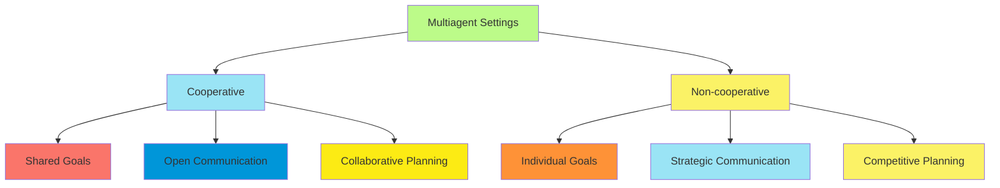

**Mixed and Transitional Settings:**

Many real-world scenarios involve elements of both cooperative and non-cooperative interaction:

1. **Coalitional Settings**: Cooperation within groups, competition between groups
    - Political coalition formation
    - Business alliances in competitive markets
2. **Cooperation with Self-Interest**: Agents cooperate when incentives align
    - Ride-sharing platforms where drivers and passengers have partially aligned interests
    - Open-source software development communities
3. **Mechanism Design Approaches**: Creating incentives for cooperation
    - Reputation systems that reward cooperative behavior
    - Market mechanisms aligning individual incentives with efficient outcomes

**Analytical Frameworks:**

Different mathematical frameworks apply to these settings:

1. **Cooperative Settings**:
    - Distributed constraint optimization
    - Team Markov decision processes
    - Cooperative game theory (coalitional games)
2. **Non-cooperative Settings**:
    - Non-cooperative game theory (strategic form, extensive form games)
    - Mechanism design
    - Auction theory

The distinction between cooperative and non-cooperative settings significantly impacts the appropriate techniques for
agent design, coordination, and analysis, making this categorization essential for understanding multiagent system
dynamics.

##### Strategic vs. Coordinated Decision Making

Strategic and coordinated decision making represent two fundamental approaches to multiagent interaction, each with
distinct assumptions, mechanisms, and outcomes. Understanding the differences between these paradigms is crucial for
designing effective multiagent systems.

**Strategic Decision Making:**

In strategic decision making, agents reason individually about their actions while considering how other agents might
react. This approach is characterized by:

1. **Independent Decision Processes**: Each agent makes decisions autonomously
    - Individual utility maximization as the primary objective
    - Decisions based on predicted responses of other agents
2. **Game-Theoretic Reasoning**: Analysis of strategic interactions
    - Identification of dominant strategies when available
    - Calculation of best responses to others' anticipated actions
    - Equilibrium concepts (Nash, Bayesian, perfect) as solution concepts
3. **Limited Communication**: Information exchange is often restricted
    - Communication viewed as strategic signaling
    - Potential for deception or information withholding
    - Credibility and commitment problems
4. **Focus on Stability**: Solutions emphasize equilibrium properties
    - No agent has incentive to unilaterally deviate
    - Self-enforcing agreements without external enforcement

**Example**: Automated negotiation agents in e-commerce platforms each pursue their own price preferences while
strategically analyzing counterparts' behavior patterns to maximize individual advantage.

**Coordinated Decision Making:**

In coordinated decision making, agents explicitly organize their actions to achieve coherent joint behavior. This
approach features:

1. **Collaborative Planning Processes**: Joint decision procedures
    - Shared plan formation
    - Explicit assignment of complementary roles
    - Synchronized execution of interdependent actions
2. **Coordination Mechanisms**: Structures ensuring coherent behavior
    - Commitments and conventions governing agent interactions
    - Joint intentions and shared mental models
    - Organizational structures defining roles and responsibilities
3. **Rich Communication**: Extensive information sharing
    - Explicit coordination messages
    - Shared vocabularies and ontologies
    - Meta-communication about the coordination process itself
4. **Focus on Efficiency**: Solutions emphasize optimality
    - Pareto efficiency in resource allocation
    - Minimizing redundant efforts
    - Maximizing synergistic interactions

**Example**: Warehouse robots explicitly coordinate picking and delivery tasks through a shared task allocation system,
communicating their positions and statuses to ensure efficient coverage without conflicts.

**Comparing Approaches:**

The key differences between strategic and coordinated decision making include:

1. **Underlying Assumptions**:
    - Strategic: Other agents act rationally in their self-interest
    - Coordinated: Other agents will adhere to agreed coordination protocols
2. **Success Metrics**:
    - Strategic: Individual payoff optimization, equilibrium achievement
    - Coordinated: Joint goal achievement, team performance metrics
3. **Failure Modes**:
    - Strategic: Inefficient equilibria (Prisoner's Dilemma), coordination failures
    - Coordinated: Protocol violations, synchronization failures, scalability issues
4. **Computational Requirements**:
    - Strategic: Game-theoretic reasoning, opponent modeling
    - Coordinated: Distributed planning, commitment tracking

**Hybrid Approaches:**

Many practical multiagent systems incorporate elements of both paradigms:

1. **Negotiated Coordination**: Strategic negotiation to establish coordination mechanisms
    - Contract-based task allocation
    - Coalition formation through strategic bargaining
2. **Incentive-Aligned Coordination**: Coordinated structures with incentive guarantees
    - Mechanism design to ensure participation and truthful reporting
    - Reward structures aligning individual and team objectives
3. **Adaptive Mechanisms**: Systems that transition between approaches
    - Strategic reasoning during negotiation phases
    - Coordinated execution once agreements are reached
    - Fallback strategies when coordination breaks down

Understanding when to apply strategic versus coordinated decision making approaches—or how to effectively blend them—is
essential for designing multiagent systems that balance individual autonomy with collective effectiveness in their
target domains.

##### Information Sharing and Communication Protocols

Information sharing and communication protocols form the backbone of interaction in multiagent systems, determining what
information is exchanged, how it's structured, and under what circumstances agents communicate. Effective protocols are
crucial for coordinating activities, updating beliefs, and achieving system goals.

**Key Dimensions of Information Sharing:**

1. **Content**: What information is communicated
    - **Observations**: Sensor data and environmental percepts
    - **Beliefs**: Probabilistic estimates of world states
    - **Intentions**: Planned actions and goals
    - **Knowledge**: Domain facts and learned models
    - **Meta-information**: Communication about communication processes
2. **Timing**: When information is shared
    - **Periodic**: Regular updates at fixed intervals
    - **Event-driven**: Communication triggered by specific events or thresholds
    - **On-demand**: Information provided when explicitly requested
    - **Anticipatory**: Shared before explicitly requested, based on predicted needs
3. **Selectivity**: Who receives the information
    - **Broadcast**: Information sent to all agents
    - **Multicast**: Sent to a relevant subset of agents
    - **Targeted**: Directed to specific individual agents
    - **Role-based**: Distributed based on functional roles
4. **Fidelity**: How completely and accurately information is shared
    - **Complete transparency**: All known information shared unfiltered
    - **Abstraction**: Higher-level summaries rather than raw data
    - **Prioritized**: Most critical information shared first
    - **Strategic disclosure**: Information selectively shared based on utility

**Formal Communication Protocols:**

Communication protocols provide structured frameworks for agent interaction, typically specifying:

1. **Message Types and Formats**:
    - Speech act categories (inform, request, propose, accept, reject)
    - Content languages and ontologies
    - Metadata and message identifiers
2. **Conversation Policies**:
    - Sequencing rules for message exchanges
    - Commitment and obligation tracking
    - Termination conditions
3. **Error Handling**:
    - Message loss detection and recovery
    - Misunderstanding resolution
    - Timeout and deadlock prevention

**Standard Protocol Frameworks:**

Several established frameworks offer foundations for multiagent communication:

1. **FIPA Agent Communication Language (FIPA-ACL)**:
    - Comprehensive speech act classification
    - Interaction protocol specifications
    - Content language flexibility
2. **Knowledge Query and Manipulation Language (KQML)**:
    - Performative-based messaging
    - Knowledge sharing focus
    - Extensible framework
3. **Distributed Constraint Satisfaction Protocols**:
    - Structured message passing for constraint reasoning
    - Asynchronous backtracking and forward checking
    - Optimization-oriented variants

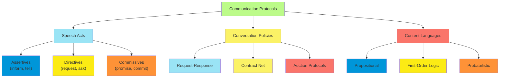

**Protocol Design Considerations:**

Effective communication protocols must balance several competing factors:

1. **Expressiveness vs. Efficiency**:
    - More expressive languages allow richer communication but require more bandwidth
    - Compact representations reduce overhead but may sacrifice detail
    - Context-sensitive compression based on shared knowledge
2. **Synchronization Requirements**:
    - Synchronous protocols ensure coordinated understanding but may cause delays
    - Asynchronous approaches improve responsiveness but complicate coordination
    - Hybrid models with synchronized checkpoints
3. **Robustness to Communication Failures**:
    - Acknowledgment mechanisms to confirm message receipt
    - Redundancy and error correction coding
    - Degradation strategies when communication is impaired
4. **Scalability with System Size**:
    - Communication complexity as agent population grows
    - Hierarchical communication structures to manage scale
    - Locality-based filtering to reduce global message traffic

**Information Sharing in Different Multiagent Settings:**

Communication protocols vary significantly based on the nature of the multiagent system:

1. **Cooperative Settings**:
    - Emphasis on completeness and accuracy of shared information
    - Open communication with minimal strategic filtering
    - Joint attention mechanisms for critical information
2. **Competitive Settings**:
    - Strategic information revelation
    - Credibility mechanisms for claims and commitments
    - Verification protocols for shared information
3. **Mixed Settings**:
    - Conditional information sharing based on trust or reciprocity
    - Reputation systems to encourage honest communication
    - Third-party verification mechanisms

**Emerging Approaches:**

Recent advances in multiagent communication include:

1. **Learned Communication Protocols**:
    - Emergent communication through reinforcement learning
    - Adaptable languages that evolve with task requirements
    - Meta-learning for communication strategies
2. **Implicit Communication**:
    - Signaling through environmental modification
    - Observable behavior as communication
    - Attention direction through demonstrable actions
3. **Uncertainty-Aware Protocols**:
    - Explicit representation of confidence in communicated information
    - Probabilistic content languages
    - Bayesian update mechanisms for belief integration

Effective information sharing and communication protocols are essential for coordinating multiagent behavior, forming
the connective tissue that enables agents to function as a coherent system rather than merely a collection of individual
actors.

#### Relational Probability Models

##### Syntax and Semantics of RPMs

Relational Probability Models (RPMs) extend traditional probabilistic graphical models to handle domains with complex
relational structure. By incorporating first-order logic capabilities, RPMs can compactly represent probability
distributions over relational domains with repeating structures and varying numbers of entities.

**Core Concepts and Motivation:**

Traditional Bayesian networks and Markov networks are designed for propositional domains with a fixed set of random
variables. However, many real-world domains involve:

- Multiple entities of the same type (e.g., people, products, locations)
- Relationships between entities (e.g., friendships, transactions, containment)
- Varying numbers of entities and relationships
- Probabilistic dependencies that follow repeating patterns

RPMs address these challenges by combining relational logic with probabilistic reasoning, allowing compact
representation of complex domains through templating and parameterization.

**Formal Definition:**

A Relational Probability Model consists of:

1. **Schema**: Defines the types of entities and relationships
    - **Entity Classes**: Categories of objects (e.g., Person, Movie, Location)
    - **Attributes**: Properties associated with entities (e.g., Age, Genre, Temperature)
    - **Relations**: Connections between entities (e.g., Likes, ActedIn, Contains)
2. **Skeleton**: Specific entities and their relationships in a particular domain instance
    - Specifies which entity instances exist
    - Defines the relationship structure between them
    - Does not assign values to attributes
3. **Probabilistic Model**: Defines distributions over attributes
    - **Attribute Distributions**: Probability distribution for each attribute
    - **Dependency Structure**: How attributes influence each other
    - **Parameter Sharing**: Same parameters for similar patterns

**Syntax Components:**

1. **Class Declarations**:

    ```
    class Person {
      attribute Age: Integer;
      attribute Gender: {male, female};
      attribute Occupation: {student, professional, retired};
    }

    class Movie {
      attribute Genre: {comedy, drama, action, horror};
      attribute Rating: Real[1,5];
    }
    ```

2. **Relationship Declarations**:

    ```
    relationship Likes(Person, Movie) {
      attribute Strength: Real[0,1];
    }

    relationship Friends(Person, Person) {
      attribute Duration: Integer;
    }
    ```

3. **Probabilistic Dependency Statements**:

    ```
    P(Person.Age) = PriorDistribution(...);
    P(Movie.Rating | Movie.Genre) = ConditionalDistribution(...);
    P(Likes.Strength | Person.Age, Movie.Genre) = ConditionalDistribution(...);
    ```

**Semantics:**

The semantics of an RPM define how it generates a probability distribution over possible worlds:

1. **Ground Bayesian Network Generation**:
    - For a given skeleton, the RPM expands into a ground Bayesian network
    - Each entity instance generates random variables for its attributes
    - Probabilistic dependencies are instantiated according to the model specification
2. **Parameter Tying**:
    - Identical parameters are used for structurally equivalent dependencies
    - Enables statistical strength sharing across similar patterns
3. **Distribution Semantics**:
    - The probability of a complete world assignment is the product of conditional probabilities in the ground network
    - $P(X_1=x_1, X_2=x_2, ..., X_n=x_n) = \prod_{i=1}^{n} P(X_i=x_i | Parents(X_i))$

**Key Features and Capabilities:**

1. **Relational Abstraction**: Represent patterns that apply across many entity instances
2. **Structural Uncertainty**: Handle domains with varying numbers of entities
3. **Context-Specific Dependencies**: Express dependencies that only apply in specific contexts
4. **Aggregation**: Summarize properties across sets of related entities
5. **Recursive Dependencies**: Model influence propagation through relationship networks

RPMs provide a powerful framework for representing probabilistic knowledge in complex relational domains, enabling
compact model specifications that can generate expansive ground networks tailored to specific domain instances.

##### Basic Random Variables

In Relational Probability Models (RPMs), basic random variables serve as the fundamental components that capture
uncertainty about entity attributes and relationships. Understanding how these variables are defined, referenced, and
manipulated is essential for building effective relational probabilistic models.

**Types of Basic Random Variables:**

1. **Entity Attribute Variables**: Represent properties of individual entities

    - **Notation**: `Class.Attribute` or `e.Attribute` (for specific entity instance e)

    - Examples

        :

        - `Person.Age`: Age attribute of a person
        - `Movie.Rating`: Rating attribute of a movie
        - `john.Height`: Height attribute of the specific person John

2. **Relationship Attribute Variables**: Represent properties of relationships between entities

    - **Notation**: `Relationship.Attribute` or `r(e1, e2).Attribute`

    - Examples

        :

        - `Friendship.Duration`: Duration attribute of a friendship
        - `Likes(john, matrix).Strength`: Strength of John's liking for "The Matrix"

3. **Existence Variables**: Represent uncertainty about whether entities or relationships exist

    - **Notation**: `Exists(Class, conditions)` or `Exists(Relationship, conditions)`

    - Examples

        :

        - `Exists(Person, name="John")`: Whether a person named John exists
        - `Exists(Friendship, person1=john, person2=mary)`: Whether John and Mary are friends

**Property and Function References:**

RPMs allow structured navigation through the relational domain using several reference types:

1. **Attribute References**: Direct access to attribute values

    ```
    Person.Age
    Movie.Duration
    ```

2. **Slot Chain References**: Navigate through relationships to access related entities

    ```
    Person.Friends.Age  // Ages of a person's friends
    Movie.Director.Nationality  // Nationality of a movie's director
    ```

3. **Aggregation References**: Summarize values across sets of related entities

    ```
    COUNT(Person.Friends)  // Number of friends a person has
    AVG(Movie.Actors.Age)  // Average age of actors in a movie
    MAX(Person.Authored.Citations)  // Maximum citations of papers authored by a person
    ```

4. **Selection References**: Filter related entities based on conditions

    ```
    Person.Friends[Gender="female"].Age  // Ages of female friends
    Movie.Actors[Nationality="French"]  // French actors in a movie
    ```

**Parameterization and Variables:**

Basic random variables in RPMs can be parameterized by quantified variables to express general patterns:

```
// The rating a person p gives to a movie m depends on the movie's genre
// and the average rating given by p's friends
P(Rating(p,m) | m.Genre, AVG(p.Friends.Rating(m))) = ...

// The probability that two people become friends depends on
// how many interests they share
P(Exists(Friendship(p1,p2)) | COUNT(p1.Interests ∩ p2.Interests)) = ...
```

**Uncertainty in RPMs:**

Basic random variables capture several forms of uncertainty:

1. **Attribute Uncertainty**: Uncertainty about property values
    - Example: A person's exact income is unknown but follows a distribution
2. **Relational Uncertainty**: Uncertainty about relationships between entities
    - Example: Whether two researchers will collaborate on a paper
3. **Existence Uncertainty**: Uncertainty about which entities exist
    - Example: Whether a student will drop a course
4. **Reference Uncertainty**: Uncertainty about which entity is referenced
    - Example: Which specific restaurant a review refers to

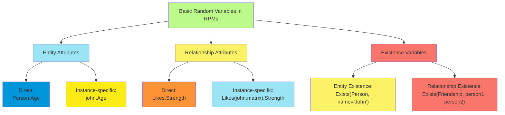

**Domain Constraints:**

Basic random variables can be subject to domain constraints that restrict their possible values:

1. **Type Constraints**: Restrict the domain of variables

    ```
    Person.Age: Integer[0,120]  // Age is an integer between 0 and 120
    Movie.Rating: Real[1,5]  // Rating is a real number between 1 and 5
    ```

2. **Deterministic Constraints**: Enforce relationships between variables

    ```
    Person.RetirementAge = Person.CareerStartAge + Person.CareerDuration
    ```

3. **Uniqueness Constraints**: Ensure certain attributes are unique identifiers

    ```
    UNIQUE(Person.SSN)  // No two persons have the same SSN
    ```

**Probability Distributions for Basic Variables:**

The probability distributions over basic random variables can be specified in several ways:

1. **Parametric Distributions**: Standard probability distributions with parameters

    ```
    Person.Age ~ Gaussian(mean=35, stddev=12)
    Movie.Budget ~ LogNormal(mean=7, stddev=1.2)
    ```

2. **Conditional Probability Tables**: For discrete variables with discrete parents

    ```
    P(Movie.Success | Movie.Budget, Movie.StarPower) = CPT(...)
    ```

3. **Conditional Linear Gaussian**: For continuous variables with continuous and discrete parents

    ```
    Person.Income | Person.Education, Person.Experience ~
      Gaussian(mean = β₀ + β₁*Education + β₂*Experience, stddev=σ)
    ```

4. **Density Estimation**: Non-parametric approaches using kernel density or mixture models

    ```
    Movie.BoxOffice | Movie.Budget ~ KernelDensity(...)
    ```

Basic random variables in RPMs provide the foundation for representing uncertainty in relational domains, offering a
rich language for expressing probabilistic models over interconnected entities with varying attributes and
relationships.

##### Dependency Statements and Context-Specific Independence

In Relational Probability Models (RPMs), dependency statements define the probabilistic relationships between random
variables, while context-specific independence captures how these dependencies may vary based on specific conditions.
These mechanisms enable precise and compact representation of complex conditional independence patterns in relational
domains.

**Dependency Statement Structure:**

Dependency statements in RPMs specify how the distribution of a random variable depends on other variables. They
typically take the form:

```
P(Variable | Parents) = Distribution(Parameters)
```

Where:

- `Variable` is the target random variable
- `Parents` are the conditioning variables that influence the target
- `Distribution` specifies the probability distribution family
- `Parameters` define the specific parameterization, potentially as functions of the parents

**Types of Dependency Statements:**

1. **Unconditional Statements**: Specify prior distributions for variables without parents

    ```
    P(Person.Age) = Gaussian(mean=35, stddev=12)
    P(Movie.Genre) = Categorical({comedy: 0.3, drama: 0.25, action: 0.2, horror: 0.15, other: 0.1})
    ```

2. **Conditional Statements**: Define how variables depend on parent variables

    ```
    P(Movie.Success | Movie.Budget, Director.Experience) =
      Sigmoid(α + β₁*Budget + β₂*Experience)
    ```

3. **Aggregation Dependencies**: Express how variables depend on properties of sets of related entities

    ```
    P(Person.Income | AVG(Person.Friends.Income)) =
      Gaussian(mean = γ₀ + γ₁*AVG(Friends.Income), stddev=σ)
    ```

4. **Recursive Dependencies**: Capture how variables depend on the same variable type through relationships

    ```
    P(Person.PoliticalLeaning | AVG(Person.Friends.PoliticalLeaning)) =
      ConditionalDistribution(...)
    ```

**Context-Specific Independence:**

Context-specific independence (CSI) occurs when variables that are generally dependent become independent in specific
contexts. In RPMs, CSI is expressed through conditional dependency statements that vary based on context:

1. **Definition**: Variables X and Y are contextually independent given Z in context C if: P(X | Y, Z, C) = P(X | Z, C)
2. **Representation in RPMs**: CSI can be represented through:
    - **Decision trees**: Branches specify different dependency structures
    - **Rules**: If-then statements that activate different models
    - **Gates**: Dependency connections that open or close based on conditions

**Example of Context-Specific Independence in RPMs:**

```
// Movie rating depends on different factors depending on genre
P(Movie.Rating | Movie.Genre, Movie.Budget, Movie.StarPower) =
  if (Movie.Genre == "Action") {
    Gaussian(mean = α₁ + β₁*StarPower + γ₁*Budget, stddev=σ₁)
  } else if (Movie.Genre == "Drama") {
    Gaussian(mean = α₂ + β₂*StarPower, stddev=σ₂)  // Budget independent in this context
  } else if (Movie.Genre == "Comedy") {
    Gaussian(mean = α₃ + γ₃*Budget, stddev=σ₃)  // StarPower independent in this context
  } else {
    Gaussian(mean = α₄, stddev=σ₄)  // Both independent in this context
  }
```

In this example, Movie.Rating is generally dependent on both Movie.Budget and Movie.StarPower, but:

- For dramas, Rating is independent of Budget given Genre
- For comedies, Rating is independent of StarPower given Genre
- For other genres, Rating is independent of both Budget and StarPower

**Benefits of Context-Specific Independence:**

1. **Model Accuracy**: Better captures domain realities where dependencies vary by context
2. **Parameter Efficiency**: Reduces the number of parameters needed to specify the model
3. **Inference Efficiency**: Enables more efficient inference by exploiting dynamic independence
4. **Interpretability**: Makes the model more understandable by explicitly representing when and why dependencies exist

**Formal Representation Mechanisms:**

Several formal structures can represent context-specific independence in RPMs:

1. Tree-Structured CPDs (Conditional Probability Distributions)

    :

    - Decision trees where each path specifies a context
    - Leaf nodes contain probability distributions for that specific context
    - Internal nodes split on parent variable values

```
P(Student.Grade | Student.StudyHours, Student.Aptitude, Course.Difficulty) =
  Tree:
    if (Course.Difficulty == "Easy") {
      if (Student.StudyHours > 10) {
        Categorical({A: 0.8, B: 0.15, C: 0.05, D: 0, F: 0})
      } else {
        Categorical({A: 0.4, B: 0.3, C: 0.2, D: 0.07, F: 0.03})
      }
    } else if (Course.Difficulty == "Hard") {
      if (Student.Aptitude == "High") {
        if (Student.StudyHours > 20) {
          Categorical({A: 0.7, B: 0.2, C: 0.07, D: 0.02, F: 0.01})
        } else {
          Categorical({A: 0.3, B: 0.4, C: 0.2, D: 0.07, F: 0.03})
        }
      } else {
        if (Student.StudyHours > 30) {
          Categorical({A: 0.3, B: 0.4, C: 0.2, D: 0.07, F: 0.03})
        } else {
          Categorical({A: 0.05, B: 0.15, C: 0.3, D: 0.3, F: 0.2})
        }
      }
    }
```

1. Rule-Based Representation

    :

    - Collection of if-then rules specifying different models for different contexts
    - Rules can overlap with priorities for conflict resolution
    - Allows for compact representation of complex context-specific dependencies

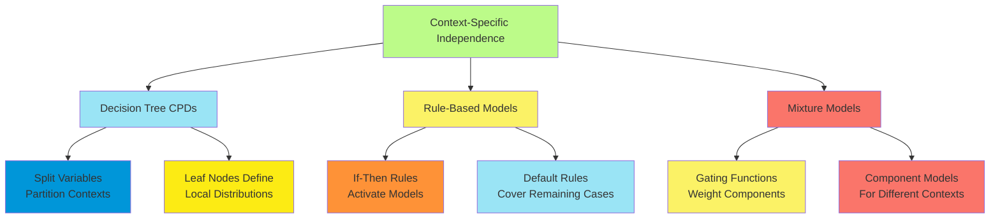

1. Conditional Mixture Models

    :

    - Multiple component distributions combined through mixing weights
    - Weights depend on context variables
    - Each component can have different independence assumptions

```
P(Employee.Productivity | Employee.Experience, Employee.Training, Department.Resources) =
  MixtureModel:
    weights = SoftmaxRegression(Department.Resources)
    components = [
      Gaussian(mean = α₁ + β₁*Experience, stddev=σ₁),  // Training-independent component
      Gaussian(mean = α₂ + γ₂*Training, stddev=σ₂),    // Experience-independent component
      Gaussian(mean = α₃ + β₃*Experience + γ₃*Training, stddev=σ₃)  // Fully dependent component
    ]
```

**Relational Context-Specific Independence:**

RPMs extend context-specific independence to relational settings where contexts can involve:

1. **Relationship Existence**: Dependencies that only apply when certain relationships exist

    ```
    P(Paper.Quality | EXISTS(AuthorOf(Person, Paper), Person.Expertise == "High")) = ...
    ```

2. **Relationship Cardinality**: Dependencies that vary based on the number of relationships

    ```
    P(Movie.BoxOffice | Movie.Budget, COUNT(StarredIn(Actor, Movie))) =
      if (COUNT(StarredIn(Actor, Movie)) > 3) {
        // Model for ensemble cast movies
      } else {
        // Model for movies with few stars
      }
    ```

3. **Relationship Properties**: Dependencies that depend on properties of relationships

    ```
    P(Person.Influence | AVG(Person.Friends[Friendship.Strength > 0.7].Influence)) = ...
    ```

By combining dependency statements with context-specific independence, RPMs provide a flexible and expressive framework
for capturing the complex, context-dependent probabilistic relationships that characterize relational domains, enabling
more accurate modeling with fewer parameters.

##### Example: Rating Player Skill Levels

A classic application of Relational Probability Models (RPMs) is modeling player skill levels in competitive games,
where the outcome of matches provides evidence about the latent skill of players. This example demonstrates how RPMs can
effectively capture the relational structure and uncertainty in skill assessment.

**Domain Description:**

Consider a setting where:

- Multiple players compete in head-to-head matches
- Each player has an unobserved skill level
- Match outcomes depend probabilistically on the relative skill of the players
- The goal is to infer player skills from observed match results

**RPM Specification:**

1. **Schema Definition:**

    ```
    class Player {
      attribute Skill: Real;  // Latent variable representing player ability
      attribute Experience: Integer;  // Number of previous matches
    }

    relationship Match(Player p1, Player p2) {
      attribute Outcome: {p1Win, p2Win, draw};  // Result of the match
      attribute Tournament: {friendly, league, championship};  // Match context
    }
    ```

2. **Probabilistic Model:**

    ```
    // Prior distribution over player skill
    P(Player.Skill) = Gaussian(mean=25, stddev=8.3);

    // Match outcome depends on the skill difference and context
    P(Match(p1, p2).Outcome | p1.Skill, p2.Skill, Match.Tournament) =
      if (Tournament == "championship") {
        // Championship matches have less randomness
        BradleyTerryModel(skillDiff = p1.Skill - p2.Skill, variance=3.0)
      } else if (Tournament == "league") {
        // League matches have moderate randomness
        BradleyTerryModel(skillDiff = p1.Skill - p2.Skill, variance=5.0)
      } else {
        // Friendly matches have high randomness
        BradleyTerryModel(skillDiff = p1.Skill - p2.Skill, variance=8.0)
      }
    ```

Where the Bradley-Terry model gives the probability of a p1 win as:

```
P(p1Win) = 1 / (1 + exp(-(p1.Skill - p2.Skill)/variance))
```

1. Skill Dynamics Model:

    ```
    // Player skill evolves over time (optional temporal component)P(Player.Skill[t+1] | Player.Skill[t], Player.Experience) =  Gaussian(mean = Player.Skill[t] + LearningRate(Player.Experience),           stddev = TimeVariance(Player.Experience))
    ```

**Inference Tasks:**

1. **Skill Rating**: Infer the posterior distribution of each player's skill

    ```
    P(Player.Skill | observed Match outcomes)
    ```

2. **Match Prediction**: Predict the outcome of future matches

    ```
    P(Match(playerA, playerB).Outcome | observed Match outcomes)
    ```

3. **Player Ranking**: Determine the relative ranking of all players

    ```
    RANK(Player, Player.Skill | observed Match outcomes)
    ```

**Methodological Advantages of RPMs:**

1. **Parameter Sharing**: All players share the same skill distribution parameters
2. **Relational Structure**: The model naturally handles varying numbers of players and matches
3. **Transitive Information Flow**: A player's skill estimate is informed by all matches in the network
4. **Context-Specific Modeling**: Different types of matches can be modeled with different parameters

**Real-World Implementation: TrueSkill™ System**

Microsoft's TrueSkill™ rating system, used in Xbox matchmaking, implements concepts similar to this RPM example:

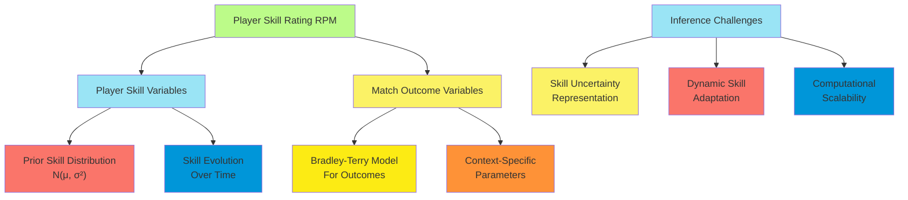

Key aspects of TrueSkill™ include:

- Representing skill as a Gaussian distribution (mean μ and variance σ²)
- Updating player ratings based on match outcomes
- Adjusting update magnitude based on outcome surprise
- Accounting for team games through skill composition

**Extensions to the Basic Model:**

1. **Team Competitions**:

    ```
    relationship TeamMatch(Team t1, Team t2) {
      attribute Outcome: {t1Win, t2Win, draw};
    }

    P(TeamMatch(t1, t2).Outcome | AVG(t1.Players.Skill), AVG(t2.Players.Skill)) = ...
    ```

2. **Position-Specific Skills**:

    ```
    relationship PlayerPosition(Player, Position) {
      attribute PositionSkill: Real;
    }

    P(Match.Outcome | PlayerPosition(p1, Match.Position).PositionSkill,
                      PlayerPosition(p2, Match.Position).PositionSkill) = ...
    ```

3. **Match Features**:

    ```
    P(Match.Outcome | p1.Skill, p2.Skill, p1.PlayStyle, p2.PlayStyle,
                      Match.Conditions) = ...
    ```

4. **Bayesian Skill Learning**:

    ```
    P(Player.ImprovementRate | Player.Experience, Player.TrainingHours) = ...
    P(Player.Skill[t+1] | Player.Skill[t], Player.ImprovementRate) = ...
    ```

**Inference Approaches:**

Several inference methods can be applied to skill rating RPMs:

1. **Expectation Maximization (EM)**: Alternating between skill estimation and parameter optimization
2. **Gibbs Sampling**: MCMC approach to sample from the posterior skill distribution
3. **Approximate Message Passing**: Propagate skill beliefs through the match graph
4. **Variational Inference**: Approximate the posterior with simpler distributions

The player skill rating example demonstrates how RPMs can effectively model domains with:

- Latent variables (unobserved skills)
- Complex relational structure (network of matches)
- Context-specific dependencies (tournament types)
- Temporal dynamics (skill evolution)

This provides a probabilistically sound framework for ranking and matchmaking systems used in competitive games, sports
analytics, and other domains requiring skill assessment from observed performance.

##### Inference in Relational Probability Models

Inference in Relational Probability Models (RPMs) presents unique challenges and opportunities compared to traditional
probabilistic graphical models. The relational structure introduces additional complexity but also enables more
efficient inference algorithms that exploit the repeated patterns and parameter sharing in the model.

**Inference Tasks in RPMs:**

1. **Conditional Probability Queries**:
    - Compute probability distributions over query variables given evidence
    - Example: Probability that a specific student will pass a course given their grades in prerequisite courses
2. **Maximum A Posteriori (MAP) Queries**:
    - Find the most likely assignment to query variables given evidence
    - Example: Most likely set of authors for an anonymous paper given its content and citation patterns
3. **Marginal Probability Queries**:
    - Compute probability distributions over variables by summing out others
    - Example: Probability distribution over player skill levels given match outcomes
4. **Most Probable Explanation (MPE)**:
    - Find the most likely complete assignment to all unobserved variables
    - Example: Most likely configuration of all student skills and course difficulties given observed grades

**Inference Approaches for RPMs:**

Inference algorithms for RPMs can be categorized into several approaches:

1. **Ground-and-Solve Approaches**: These methods first instantiate the RPM into a ground graphical model and then apply
   standard inference algorithms:

    a. **Model Grounding**:

    - Create a node for each random variable in the specific domain instance
    - Instantiate dependencies according to RPM specifications
    - Apply parameter sharing as specified in the model

    b. **Standard Inference**:

    - Apply junction tree algorithm, variable elimination, or belief propagation
    - Use sampling methods like Gibbs sampling or Metropolis-Hastings
    - Apply variational inference techniques

    **Advantages**: Conceptual simplicity, leverages existing inference algorithms **Disadvantages**: Can be inefficient
    for large domains, may create enormous ground networks

2. **Lifted Inference**: These methods operate directly at the relational level, avoiding full grounding when possible:

    a. **First-Order Variable Elimination**:

    - Eliminate entire sets of random variables simultaneously
    - Exploit symmetries in the model to avoid redundant computation
    - Maintain compact representation of intermediate factors

    b. **Lifted Belief Propagation**:

    - Pass messages between groups of similar nodes
    - Identify and process identical sub-structures just once
    - Automatically group nodes with identical local structure

    c. **Lifted MCMC**:

    - Sample groups of exchangeable variables together
    - Create Markov chain transitions that respect symmetries
    - Achieve faster mixing by making coordinated changes

    **Advantages**: Can be exponentially more efficient than ground inference **Disadvantages**: More complex
    implementation, not all models admit efficient lifting

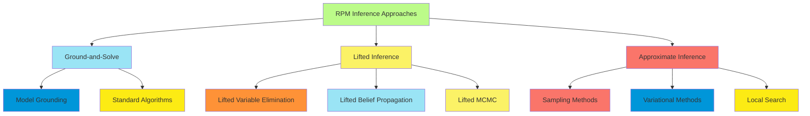

1. **Hybrid Approaches**: These methods combine ground and lifted techniques:

    a. **Partially Lifted Inference**:

    - Lift portions of the model that admit efficient lifting
    - Ground only the portions that require it
    - Combine results from lifted and ground inference

    b. **Approximate Lifting**:

    - Group similar but not identical variables
    - Accept small approximation errors for efficiency gains
    - Adaptively refine approximation as needed

    **Advantages**: Balances efficiency and applicability **Disadvantages**: Requires sophisticated algorithms to
    determine what to lift

**Challenges Specific to RPM Inference:**

1. **Domain Size Dependency**:
    - Inference complexity can grow with the number of entities
    - Need to handle domains too large for complete grounding
    - Techniques for identifying relevant subsets of the domain
2. **Aggregation Operations**:
    - Handling dependencies through aggregation functions (COUNT, SUM, AVG, etc.)
    - Efficient representation of distributions over aggregate values
    - Specialized algorithms for common aggregation patterns
3. **Structural Uncertainty**:
    - Reasoning about existence uncertainty and reference uncertainty
    - Handling varying relational structures during inference
    - Incorporating uncertainty about the domain itself
4. **Context-Specific Independence**:
    - Exploiting independence that holds only in specific contexts
    - Dynamic adaptation of inference structure based on evidence
    - Specialized data structures for context-dependent factors

**Example Inference Algorithms:**

1. **Probabilistic Relational Inference with First-Order Logic**:

    ```
    function LiftedVarElim(RPM, query, evidence):
      factors = ConvertRPMToFactors(RPM, evidence)
      order = ChooseEliminationOrder(factors, query)
      for var in order:
        if CanLift(var, factors):
          factors = LiftedEliminate(var, factors)
        else:
          factors = GroundAndEliminate(var, factors)
      return Normalize(CombineFactors(factors))
    ```

2. **Lifted Belief Propagation**:

    ```
    function LiftedBP(RPM, query, evidence):
      clusterGraph = CreateLiftedClusterGraph(RPM, evidence)
      InitializeMessages(clusterGraph)
      repeat:
        for cluster in clusterGraph:
          for neighbor in cluster.neighbors:
            message = ComputeLiftedMessage(cluster, neighbor)
            SendMessage(cluster, neighbor, message)
      until convergence
      return ComputeMarginals(clusterGraph, query)
    ```

3. **Relational MCMC**:

    ```
    function RelationalMCMC(RPM, query, evidence, numSamples):
      state = InitializeState(RPM, evidence)
      samples = []
      for i = 1 to numSamples:
        blockPattern = ChooseRelationalBlock(RPM)
        blockInstances = IdentifyBlockInstances(blockPattern, state)
        for block in blockInstances:
          ProposalDist = GetProposalDistribution(block, state)
          newValues = Sample(ProposalDist)
          if AcceptanceProbability(state, newValues, block):
            UpdateState(state, block, newValues)
        samples.add(ExtractQueryValues(state, query))
      return ComputeDistribution(samples, query)
    ```

**Performance Considerations:**

1. **Exploiting Exchangeability**:
    - Entities with identical relational patterns can be treated as a group
    - Particularly important in domains with many similar entities
    - Provides exponential speedups in appropriate domains
2. **Adaptive Inference**:
    - Dynamically choose between lifted and ground approaches
    - Focus computational effort on parts of the model with highest uncertainty
    - Balance precision and efficiency based on query requirements
3. **Approximate Inference Guarantees**:
    - Bounds on approximation error for lifted methods
    - Convergence properties for lifted sampling approaches
    - Trade-offs between lifting and approximation quality

Inference in RPMs continues to be an active research area, with ongoing development of algorithms that can efficiently
handle increasingly complex relational domains while maintaining accurate probabilistic reasoning.

#### Open-Universe Probability Models

##### Syntax and Semantics of OUPMs

Open-Universe Probability Models (OUPMs) extend Relational Probability Models to handle domains where the set of
entities is not fixed or known in advance. This powerful framework allows reasoning about unknown objects, identity
uncertainty, and varying domain sizes within a coherent probabilistic model.

**Core Concepts and Motivation:**

Traditional probabilistic models (including standard RPMs) operate in a "closed universe" where:

- All entities are known in advance
- The number of entities is fixed
- Each entity has a unique, known identity

However, many real-world scenarios involve uncertainty about:

- How many entities exist
- Which observations correspond to which entities
- Whether observed features refer to the same or different entities

OUPMs address these challenges by explicitly modeling the generative process that produces both entities and
observations, allowing inference about the underlying domain structure.

**Formal Definition:**

An Open-Universe Probability Model consists of:

1. **Entity Types**: Categories of objects that may exist (e.g., Person, Document, Event)
2. **Entity Generation Processes**: Probabilistic mechanisms for generating entities
    - Number models: Distributions over how many entities exist
    - Attribute models: Distributions over entity properties
3. **Observation Processes**: How entities give rise to observations
    - Detection models: Probability of observing an entity
    - Observation models: Distribution over observed features given entity attributes
4. **Identity Models**: How observations relate to underlying entities
    - Origin functions: Mapping from observations to source entities
    - Co-reference models: Probability that multiple observations refer to the same entity

**Syntax Components:**

1. **Type Declarations**:

    ```
    type Person;
    type Document;
    type Citation;
    ```

2. **Number Statements**:

    ```
    #Person ~ Poisson(lambda=100);  // Number of persons follows Poisson distribution
    #Document(author=p) ~ Poisson(lambda=5) for Person p;  // Documents per author
    ```

3. **Entity Attribute Declarations**:

    ```
    Person.name ~ NameDistribution();
    Person.expertise ~ Categorical({AI: 0.3, ML: 0.2, NLP: 0.15, ...});
    Document.title ~ TitleGenerator(Document.topic);
    ```

4. **Observation Models**:

    ```
    obs Citation.text ~ TextDistortion(Citation.document.title);
    obs Citation.authorName ~ NameDistortion(Citation.document.author.name);
    ```

5. **Origin Functions**:

    ```
    origin(Citation.document) ~ DocumentSelector(Citation.text);
    origin(Citation.author) ~ AuthorSelector(Citation.authorName);
    ```

**Semantics of OUPMs:**

The semantics of an OUPM define a probability distribution over possible worlds, where a world consists of:

1. **Entity Set**: Which entities exist and their attributes
2. **Observation Set**: What is observed about these entities
3. **Origin Mapping**: Which entity generated each observation

The joint probability of a world configuration is determined by:

$P(World) = P(Entities) \times P(Observations | Entities) \times P(Origins | Entities, Observations)$

Where:

- $P(Entities)$ is the probability of the specific set of entities and their attributes
- $P(Observations | Entities)$ is the probability of generating the observations given the entities
- $P(Origins | Entities, Observations)$ is the probability of the specific mapping between observations and entities

**Distinguishing Features of OUPMs:**

1. **Unknown Objects**: OUPMs can reason about entities that have not been directly observed
2. **Identity Uncertainty**: The same entity may generate multiple observations with uncertain correspondence
3. **Existence Uncertainty**: Whether a particular entity exists is a random variable in the model
4. **Number Uncertainty**: The total number of entities is unknown and inferred from observations
5. **Exchangeability**: OUPMs typically assume that entity ordering doesn't matter, allowing for more efficient
   inference

**Example OUPM Specification:**

Consider a citation matching problem:

```
// Entity type declarations
type Author;
type Paper;
type Citation;

// Number distributions
#Author ~ Poisson(lambda=1000);
#Paper(author=a) ~ Poisson(lambda=10) for Author a;
#Citation(paper=p) ~ Poisson(lambda=20) for Paper p;

// Attribute models
Author.name ~ NameDistribution();
Author.affiliation ~ AffiliationDistribution();
Paper.title ~ TitleDistribution(Paper.topic);
Paper.year ~ YearDistribution();
Paper.topic ~ TopicDistribution();

// Observation models
obs Citation.authorText ~ NameCorruption(Citation.paper.author.name);
obs Citation.titleText ~ TitleCorruption(Citation.paper.title);
obs Citation.yearText ~ YearCorruption(Citation.paper.year);

// Origin functions
origin(Citation.paper) ~ PaperSelector(Citation.titleText, Citation.yearText);
```

This OUPM defines a generative process for authors, papers, and citations, along with the noisy observation process that
produces citation text. It can be used to solve the citation matching problem: determining which citations refer to the
same underlying papers.

OUPMs provide a powerful framework for reasoning in domains with unknown objects and identity uncertainty, extending
probabilistic modeling to more realistic open-universe scenarios encountered in entity resolution, perception, and
knowledge base construction.

##### Existence and Identity Uncertainty

Existence and identity uncertainty are central challenges in open-universe probabilistic reasoning, requiring models
that can handle fundamental questions about what entities exist and how observations relate to these entities.

**Existence Uncertainty:**

Existence uncertainty concerns whether a particular entity exists in the domain. In OUPMs, the existence of entities is
treated probabilistically, rather than assumed as given.

**Key Aspects of Existence Uncertainty:**

1. **Entity Generation Processes**: OUPMs model how entities come into existence
    - **Prior Distributions**: Probability distributions over the number of entities
    - **Conditional Generation**: Entities that depend on the existence of others
    - **Hierarchical Generation**: Nested entity generation processes
2. **Existence Variables**: Random variables representing whether an entity exists
    - **Notation**: $Exists(Entity)$ or $E(Entity)$
    - **Conditioning**: Other variables may depend on existence variables
    - **Joint Inference**: Simultaneously reasoning about existence and attributes
3. **Entity Attributes Conditioned on Existence**:
    - Attributes are only meaningful if an entity exists
    - $P(Entity.attribute | Exists(Entity))$
    - Non-existence often represented by special "null" values

**Example of Existence Uncertainty:**

In a document analysis system:

```
// Number of sections in a document
#Section(document=d) ~ Poisson(lambda=5) for Document d;

// Existence of specific section types
Exists(Abstract(document=d)) ~ Bernoulli(p=0.9) for Document d;
Exists(Conclusion(document=d)) ~ Bernoulli(p=0.85) for Document d;

// Content depends on existence
Abstract.content | Exists(Abstract) ~ ContentModel(...);
```

**Identity Uncertainty:**

Identity uncertainty concerns which entity an observation refers to, or whether multiple observations refer to the same
entity. This is also known as the data association problem.

**Key Aspects of Identity Uncertainty:**

1. **Origin Functions**: Mappings from observations to the entities that generated them
    - **Notation**: $origin(Observation)$ or $O(Observation)$
    - **Probabilistic Origins**: $P(origin(obs) = entity)$
    - **Joint Origins**: Dependencies between origin assignments
2. **Co-reference Resolution**: Determining when multiple observations refer to the same entity
    - **Transitivity**: If obs1 and obs2 refer to the same entity, and obs2 and obs3 refer to the same entity, then obs1
      and obs3 must refer to the same entity
    - **Clustering**: Grouping observations by their underlying entity
    - **Pairwise Models**: $P(SameEntity(obs1, obs2) | Features(obs1, obs2))$
3. **Reference Uncertainty**: Uncertainty about which entity a reference designates
    - **Referring Expressions**: Names, pronouns, descriptions
    - **Ambiguity Resolution**: Resolving ambiguous references
    - **Context Dependence**: How context affects reference resolution

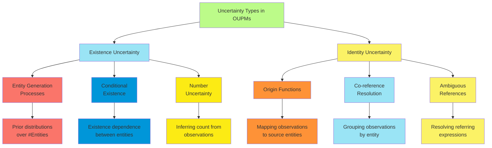

**Modeling Approaches for Identity Uncertainty:**

1. **Generative Models**:
    - Explicitly model how entities generate observations
    - Example: $P(Observation.name | origin(Observation).name)$ models how a person's true name gives rise to possibly
      corrupted observed names
2. **Discriminative Models**:
    - Directly model the probability of identity given features
    - Example: $P(SameEntity(obs1, obs2) | SimilarityFeatures(obs1, obs2))$
3. **Distance-Based Models**:
    - Define distance metrics between observations
    - Cluster observations based on these distances
    - Example: $P(SameEntity(obs1, obs2)) = f(Distance(obs1, obs2))$

**Example: Author Coreference in Citation Data**

```bash
// Entity generation
#Author ~ Poisson(lambda=1000);
Author.name ~ NameDistribution();
Author.topics ~ TopicDistribution();

// Observation generation
#AuthorMention(author=a) ~ Poisson(lambda=20) for Author a;
obs AuthorMention.text ~ NameCorruption(origin(AuthorMention).name);
obs AuthorMention.contextTopics ~ TopicDistribution(origin(AuthorMention).topics);

// Identity model
P(origin(am) = a | Author a, AuthorMention am) ∝
   NameSimilarity(am.text, a.name) × TopicOverlap(am.contextTopics, a.topics);
```

This model represents both existence uncertainty (the number and attributes of authors) and identity uncertainty (which
author mentions refer to which underlying authors).

**Challenges in Handling Existence and Identity Uncertainty**:

1. **Combinatorial Explosion**:
    - The number of possible entity configurations grows exponentially
    - The number of possible origin assignments grows factorially
    - Requires specialized inference algorithms to manage complexity
2. **Interdependence**:
    - Existence and identity uncertainties are often coupled
    - Evidence about identity affects inferences about existence and vice versa
    - Requires joint reasoning rather than separate treatment
3. **Open-World Semantics**:
    - The set of entities is not fixed in advance
    - New entities can be hypothesized during inference
    - Traditional closed-world inference algorithms must be adapted
4. **Relational Consistency**:
    - Identity decisions must respect relational constraints
    - E.g., if paper1 = paper2 and paper1.author ≠ paper2.author, there's an inconsistency
    - Requires consistency checking during inference

**Inference Approaches:**

1. **Data Association Methods**:
    - Explicitly reason about the mapping from observations to entities
    - Methods include Multiple Hypothesis Tracking and Joint Probabilistic Data Association
    - Handle identity uncertainty directly while managing computational complexity
2. **Entity-Based Sampling**:
    - Sample possible worlds with different numbers of entities
    - Use Markov Chain Monte Carlo methods with special moves for:
        - Creating new entities
        - Deleting existing entities
        - Merging or splitting entities
        - Reassigning observations to entities
3. **Probabilistic Programs for Existence/Identity**:
    - Express the full generative model including existence and identity
    - Use generic probabilistic programming inference techniques
    - Leverage special-purpose inference optimizations for identity uncertainty

**Applications of Existence and Identity Uncertainty:**

1. **Entity Resolution**:
    - Determining when records from different databases refer to the same entity
    - Resolving bibliographic references to unique publications
    - Linking mentions across documents to the same real-world entity
2. **Computer Vision**:
    - Object detection with unknown number of objects
    - Multi-object tracking across video frames
    - Scene understanding with occlusion and partial observation
3. **Natural Language Understanding**:
    - Coreference resolution in text (determining when different mentions refer to the same entity)
    - Reading comprehension with implicit entities
    - Dialogue systems with ambiguous references
4. **Sensor Fusion**:
    - Integrating observations from multiple sensors with unknown correspondence
    - Simultaneous Localization and Mapping (SLAM) in robotics
    - Multi-target tracking in radar and sonar systems

Existence and identity uncertainty represent fundamental challenges in open-universe probabilistic reasoning, requiring
sophisticated modeling and inference techniques to effectively manage the inherent combinatorial complexity while
maintaining accurate probabilistic semantics.

##### Number Statements and Origin Functions

Number statements and origin functions are key components of Open-Universe Probability Models (OUPMs) that formally
capture uncertainty about how many entities exist and how observations relate to these entities.

**Number Statements:**

Number statements specify probability distributions over the number of entities of different types in the domain. They
formalize the process by which entities come into existence.

**Syntax and Semantics of Number Statements:**

1. **Unconditional Number Statements**:

    ```
    #Person ~ Poisson(lambda=100);
    ```

    This states that the number of Person entities follows a Poisson distribution with mean 100.

2. **Conditional Number Statements**:

    ```
    #Student(school=s) ~ Poisson(lambda=500) for School s;
    ```

    This states that for each school s, the number of students at that school follows a Poisson distribution with
    mean 500.

3. **Complex Dependencies**:

    ```
    #Employee(department=d) ~ Poisson(lambda=d.size * 10) for Department d;
    ```

    The expected number of employees depends on a department attribute.

4. **Deterministic Constraints**:

    ```
    #Author(paper=p) >= 1 for Paper p;
    ```

    Every paper must have at least one author.

**Common Probability Distributions for Number Statements:**

1. **Poisson Distribution**:
    - Models count data with a single parameter (mean)
    - Appropriate when events occur independently at a constant rate
    - Example: Number of typos per page in a document
2. **Binomial Distribution**:
    - Models number of successes in fixed number of trials
    - Example: Number of accepted papers out of submissions
3. **Negative Binomial**:
    - Models number of failures before a specified number of successes
    - More flexible than Poisson (allows overdispersion)
    - Example: Number of citation attempts before correct citation
4. **Deterministic**:
    - Fixed, known number of entities
    - Example: Exactly one CEO per company

**Origin Functions:**

Origin functions specify the mapping from observations to the entities that generated them. They formalize the process
by which observations are associated with their underlying sources.

**Syntax and Semantics of Origin Functions:**

1. **Basic Origin Functions**:

    ```
    origin(Citation.paper) ~ UniformChoice(Paper);
    ```

    This states that each citation refers to a paper selected uniformly from all papers.

2. **Conditional Origin Functions**:

    ```
    origin(Citation.paper) ~ PaperSelector(Citation.text, Paper.title);
    ```

    The probability of a citation referring to a paper depends on the similarity between the citation text and paper
    title.

3. **Constrained Origins**:

    ```
    origin(AuthorMention.author) in Paper.authors where AuthorMention.paper = Paper;
    ```

    An author mention must refer to one of the authors of the paper being mentioned.

4. **Deterministic Origins**:

    ```
    origin(Measurement.object) = Measurement.sensor.target;
    ```

    A measurement definitely refers to the target of the sensor that produced it.

**Probability Models for Origins:**

1. **Uniform Selection**:
    - Each entity is equally likely to be the origin
    - Simple but often unrealistic baseline
2. **Feature-Based Models**:
    - Probability depends on similarity between observation and entity features
    - Example: $P(origin(obs) = entity) \propto e^{-Distance(obs.features, entity.features)}$
3. **Context-Dependent Models**:
    - Probability depends on surrounding observations and their origins
    - Example: Citations in the same paragraph are more likely to refer to related papers
4. **Sequential Models**:
    - Probability depends on previous origin assignments
    - Example: Consecutive mentions are more likely to refer to the same entity

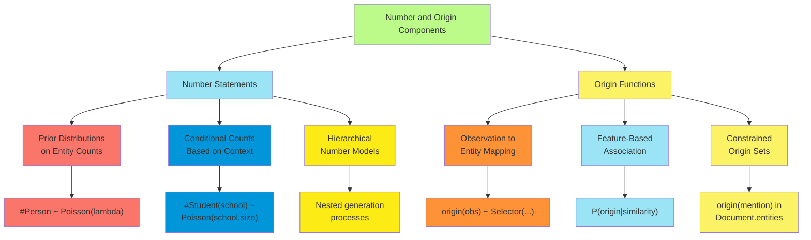

**Interplay Between Number Statements and Origin Functions:**

Number statements and origin functions interact in several important ways:

1. **Origin Constraints on Numbers**: The number of entities constrains the possible origin assignments:
    - Cannot assign more observations to an entity than permitted by its generation model
    - Must satisfy cardinality constraints in the number model
2. **Number Inference from Origins**: Origin assignments provide evidence about the number of entities:
    - If observations cluster into k groups based on their features, suggests k entities
    - Contradictory feature evidence may suggest the existence of additional entities
3. **Joint Inference**: Effective OUPM inference requires joint reasoning about:
    - How many entities exist
    - Which observations correspond to which entities
    - What attributes these entities have

**Example: Citation Matching System**

Consider a system for matching bibliographic citations:

```
// Number models
#Paper ~ Poisson(lambda=10000);
#Citation(paper=p) ~ Poisson(lambda=5) for Paper p;

// Entity attributes
Paper.title ~ TitleDistribution();
Paper.year ~ YearDistribution();
Paper.authors ~ AuthorListDistribution();

// Observation models
obs Citation.titleText ~ TextCorruption(origin(Citation).title);
obs Citation.yearText ~ YearCorruption(origin(Citation).year);
obs Citation.authorText ~ AuthorListCorruption(origin(Citation).authors);

// Origin function
origin(Citation) ~ PaperSelector(Citation.titleText, Citation.yearText, Citation.authorText);

// Origin model detailed
PaperSelector(cText, cYear, cAuthor)(p) ∝
   TitleSimilarity(cText, p.title) ×
   YearSimilarity(cYear, p.year) ×
   AuthorSimilarity(cAuthor, p.authors);
```

This OUPM specifies both:

- How many papers exist and how many citations each generates
- How citations are mapped to the papers they reference
- How paper attributes give rise to potentially corrupted citation text

**Inference Challenges:**

1. **Computational Complexity**:
    - Number of possible origin assignments grows factorially with number of observations
    - Requires approximate inference techniques for realistic domains
2. **Identifiability Issues**:
    - Multiple combinations of number statements and origin assignments may explain the data equally well
    - May need additional constraints or prior knowledge
3. **Model Specification**:
    - Defining appropriate number distributions
    - Designing effective origin functions that capture similarity patterns
    - Balancing model complexity against inference tractability
4. **Adaptive Inference**:
    - Dynamically exploring possible worlds with different numbers of entities
    - Efficiently proposing and evaluating origin reassignments

Number statements and origin functions form the core of OUPMs, enabling them to represent and reason about domains with
unknown objects and uncertain correspondences between observations and entities.

##### Examples: Citation Matching and Treaty Monitoring

Open-Universe Probability Models (OUPMs) have been applied to various real-world problems that involve reasoning about
unknown objects and identity uncertainty. Two illustrative examples are citation matching and treaty monitoring systems.

**Example 1: Citation Matching**

Citation matching involves determining which bibliographic citations refer to the same underlying publications, a
fundamental task in academic search engines and bibliometric analysis.

**Problem Description:**

- Citations appear in various formats and styles
- The same paper may be cited with different abbreviations, orderings, and even errors
- The true set of underlying papers is unknown
- Multiple citations may refer to the same paper

**OUPM Formulation:**

1. **Entity Types and Number Models**:

    ```
    type Paper;
    type Author;
    type Venue;

    #Paper ~ Poisson(lambda=100000);  // Prior on number of papers
    #Author ~ Poisson(lambda=50000);  // Prior on number of authors
    #Venue ~ Poisson(lambda=5000);    // Prior on number of venues

    #Author(paper=p) ~ TruncatedPoisson(lambda=3, min=1) for Paper p;  // Authors per paper
    ```

2. **Entity Attributes**:

    ```
    Paper.title ~ TitleDistribution();
    Paper.year ~ YearDistribution();
    Paper.venue ~ UniformChoice(Venue);

    Author.name ~ NameDistribution();
    Author.affiliation ~ AffiliationDistribution();

    Venue.name ~ VenueNameDistribution();
    Venue.type ~ Categorical({journal: 0.6, conference: 0.3, workshop: 0.1});
    ```

3. **Observation Model**:

    ```
    type Citation;
    #Citation ~ Poisson(lambda=500000);  // Total observed citations

    obs Citation.titleText ~ TitleCorruption(origin(Citation).title);
    obs Citation.authorText ~ AuthorListCorruption(origin(Citation).authors.name);
    obs Citation.venueText ~ VenueCorruption(origin(Citation).venue.name);
    obs Citation.yearText ~ YearCorruption(origin(Citation).year);
    ```

4. **Origin Function**:

    ```
    origin(Citation) ~ PaperSelector(Citation.titleText, Citation.authorText,
                                      Citation.venueText, Citation.yearText);

    // Detailed origin model
    PaperSelector(cTitle, cAuthor, cVenue, cYear)(p) ∝
      exp(-StringDistance(cTitle, p.title)) *
      exp(-AuthorListDistance(cAuthor, p.authors.name)) *
      exp(-StringDistance(cVenue, p.venue.name)) *
      exp(-YearDistance(cYear, p.year));
    ```

**Inference Tasks:**

1. Determine how many distinct papers exist in the corpus
2. Group citations that refer to the same paper
3. Reconstruct the canonical information for each paper
4. Identify and correct errors in citations

**Results and Benefits:**

- Automatically detects duplicate citations despite textual variations
- Reconstructs more accurate publication metadata by combining information across citations
- Handles ambiguous cases probabilistically rather than making hard decisions
- Improves with more citations as the model gains evidence about the underlying papers

**Example 2: Treaty Monitoring**

Treaty monitoring involves analyzing sensor data and intelligence reports to detect violations of international
agreements, such as nuclear test ban treaties.

**Problem Description:**

- Multiple sensors (seismic, atmospheric, satellite) produce observations
- Unknown number of potential treaty-violating events
- Uncertainty about which observations correspond to which events
- Need to distinguish legitimate activities from violations

**OUPM Formulation:**

1. **Entity Types and Number Models**:

    ```
    type Event;
    type Location;

    // Different types of events
    type NuclearTest extends Event;
    type Earthquake extends Event;
    type MiningExplosion extends Event;

    #NuclearTest ~ Poisson(lambda=0.5);  // Rare but possible
    #Earthquake ~ Poisson(lambda=50);    // More common
    #MiningExplosion ~ Poisson(lambda=20);  // Moderately common

    #Location ~ FixedNumber(100);  // Discretized monitoring regions
    ```

2. **Entity Attributes**:

    ```
    Event.time ~ TimeDistribution();
    Event.location ~ UniformChoice(Location);
    Event.magnitude ~ MagnitudeDistribution(Event.type);

    NuclearTest.depth ~ Gaussian(mean=500, stddev=200);  // Meters
    Earthquake.depth ~ DepthDistribution();  // Typically deeper
    MiningExplosion.depth ~ Gaussian(mean=100, stddev=50);  // Shallow

    Location.coordinates ~ SpatialDistribution();
    Location.countryCode ~ CountryDistribution();
    ```

3. **Observation Models**:

    ```
    type SeismicReading;
    type RadioisotopeDetection;
    type SatelliteImage;

    // Detection probabilities depend on event type and magnitude
    #SeismicReading(event=e) ~ BernoulliDistribution(
      p=DetectionProbability(e.magnitude, e.location.coordinates)) for Event e;

    #RadioisotopeDetection(event=e) ~
      if (e.type == NuclearTest) BernoulliDistribution(p=0.7)
      else BernoulliDistribution(p=0.01) for Event e;

    obs SeismicReading.signalCharacteristics ~
      SeismicSignalDistribution(origin(SeismicReading).type,
                                origin(SeismicReading).magnitude,
                                origin(SeismicReading).depth);

    obs SeismicReading.arrivalTime ~
      TimeCorruption(origin(SeismicReading).time,
                     Distance(SeismicReading.sensorLocation,
                              origin(SeismicReading).location));

    obs RadioisotopeDetection.isotopicProfile ~
      if (origin(RadioisotopeDetection).type == NuclearTest)
        NuclearIsotopeDistribution()
      else BackgroundIsotopeDistribution();
    ```

4. **Origin Functions**:

    ```
    origin(SeismicReading) ~ EventSelector(SeismicReading.arrivalTime,
                                           SeismicReading.signalCharacteristics,
                                           SeismicReading.sensorLocation);

    origin(RadioisotopeDetection) ~ EventSelector(RadioisotopeDetection.detectionTime,
                                                 RadioisotopeDetection.isotopicProfile,
                                                 RadioisotopeDetection.sensorLocation);

    // Detailed origin model considers temporal and spatial consistency
    EventSelector(obsTime, obsSignal, sensorLoc)(event) ∝
      TemporalConsistency(obsTime, event.time, sensorLoc, event.location) *
      SignalConsistency(obsSignal, event.type, event.magnitude);
    ```

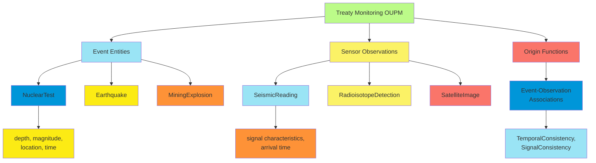

**Inference Tasks:**

1. Detect potential treaty violations (nuclear tests)
2. Distinguish violations from legitimate activities (earthquakes, mining)
3. Estimate event properties (location, time, magnitude)
4. Assess confidence in violation detections

**Results and Benefits:**

- Explicitly models alternative explanations for observed signals
- Integrates evidence across multiple sensor types
- Provides probabilistic assessments of treaty compliance
- Quantifies uncertainty in the number, type, and properties of events
- Supports decision-making with appropriate confidence levels

**Common Elements Across Applications:**

Both citation matching and treaty monitoring examples demonstrate key OUPM capabilities:

1. **Unknown Object Reasoning**:
    - Citation matching: Unknown number of true papers
    - Treaty monitoring: Unknown number and types of events
2. **Identity Uncertainty**:
    - Citation matching: Which citations refer to the same paper
    - Treaty monitoring: Which sensor readings correspond to the same event
3. **Multi-Entity Types**:
    - Citation matching: Papers, authors, venues
    - Treaty monitoring: Different event types, sensor readings
4. **Feature-Based Identity Resolution**:
    - Citation matching: Text similarity metrics
    - Treaty monitoring: Temporal and signal consistency

These examples highlight how OUPMs provide a unified framework for modeling complex domains where both the number of
entities and their relationship to observations are uncertain, enabling probabilistic reasoning in open-universe
settings that would be difficult or impossible with traditional closed-universe models.

##### Algorithms for OUPM Inference

Inference in Open-Universe Probability Models (OUPMs) presents unique challenges due to the uncertainty about both
entity existence and identity. Specialized algorithms have been developed to handle these challenges while maintaining
computational tractability.

**Core Inference Tasks in OUPMs:**

1. **Number Inference**: Determining how many entities exist
2. **Identity Resolution**: Mapping observations to underlying entities
3. **Attribute Inference**: Estimating entity properties
4. **Structure Learning**: Discovering dependency patterns in the domain

**Key Challenges:**

1. **Unbounded State Space**: The number of possible entity configurations is infinite
2. **Combinatorial Association**: The number of possible observation-to-entity mappings grows factorially
3. **Joint Inference**: Entity attributes, existence, and identity must be reasoned about together
4. **Structural Constraints**: Identity decisions must maintain logical consistency

**Major Algorithm Categories:**

1. **Markov Chain Monte Carlo (MCMC) Methods**

    MCMC methods generate samples from the posterior distribution over possible worlds. For OUPMs, these require
    specialized moves to handle entity creation, deletion, and identity reassignment.

    **Key MCMC Algorithms for OUPMs:**

    a. **Metropolis-Hastings with Custom Moves**:

    - **Split/Merge Moves**: Propose splitting one entity into two, or merging two entities
    - **Birth/Death Moves**: Propose creating a new entity or removing an existing entity
    - **Reassignment Moves**: Propose changing the origin of an observation

    b. **Reversible Jump MCMC**:

    - Handles transitions between models with different numbers of entities
    - Ensures proper probability calculation when the dimension changes
    - Requires careful design of proposal distributions

    c. **Gibbs Sampling**:

    - Sample origin assignments one at a time conditioned on others
    - Sample entity attributes conditioned on origin assignments
    - Sample number of entities conditioned on observations and origins

    **Example MCMC Algorithm for Citation Matching**:

    ```
    function OUPM_MCMC(observations, iterations):
      world = InitializeWorld(observations)  // Initial entity set and origins

      for i = 1 to iterations:
        // Choose move type probabilistically
        moveType = ChooseMoveType(world)

        if moveType == "SPLIT":
          entity = SelectRandomEntity(world)
          newWorld = SplitEntity(world, entity)
        else if moveType == "MERGE":
          entities = SelectRandomEntityPair(world)
          newWorld = MergeEntities(world, entities)
        else if moveType == "REASSIGN":
          obs = SelectRandomObservation(world)
          newEntity = ProposeNewOrigin(world, obs)
          newWorld = ReassignOrigin(world, obs, newEntity)

        // Accept or reject proposal
        acceptProb = min(1, (P(newWorld) * Q(world|newWorld)) /
                             (P(world) * Q(newWorld|world)))
        if Random() < acceptProb:
          world = newWorld

      return world
    ```

2. **Particle Filtering and Sequential Monte Carlo**

    These methods process observations sequentially, maintaining a population of "particles" (possible worlds) that are
    updated as new observations arrive.

    **Key SMC Algorithms for OUPMs:**

    a. **Particle Filtering with Identity Management**:

    - Extend classical particle filters to handle identity uncertainty
    - Update particle weights based on observation likelihoods
    - Resample particles to focus on high-probability configurations

    b. **Rao-Blackwellized Particle Filtering**:

    - Analytically integrate out certain variables
    - Sample only discrete variables like identity and existence
    - Reduces variance and improves sample efficiency

    **Example Particle Filtering Algorithm**:

    ```
    function OUPM_ParticleFilter(observations, numParticles):
      particles = InitializeParticles(numParticles)  // Multiple possible worlds

      for obs in observations:
        for p in particles:
          // Propose how to incorporate the new observation
          options = [
            AssignToExistingEntity(p, obs, entity) for entity in p.entities
          ] + [CreateNewEntity(p, obs)]

          // Weight each option by its probability
          weights = [OptionProbability(p, obs, option) for option in options]

          // Select an option and update the particle
          selectedOption = SampleFromDistribution(options, weights)
          ApplyOption(p, selectedOption)

          // Update particle weight
          p.weight *= OptionLikelihood(selectedOption)

        // Resample particles if effective sample size is too low
        if EffectiveSampleSize(particles) < threshold:
          particles = ResampleParticles(particles)

      return particles
    ```

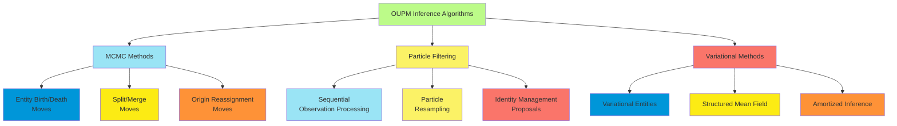

1. **Variational Inference Methods**

    Variational methods approximate the posterior distribution with a simpler distribution, optimizing the parameters to
    minimize the approximation error.

    **Key Variational Approaches for OUPMs:**

    a. **Variational Entity Models**:

    - Represent uncertainty over entity existence with variational parameters
    - Optimize entity parameters jointly with existence probabilities
    - Handle varying numbers of entities through sparse representations

    b. **Structured Mean Field**:

    - Factorize the distribution while preserving key dependencies
    - Maintain explicit distributions over origin assignments
    - Iteratively update entity and origin distributions

    c. **Amortized Variational Inference**:

    - Use neural networks to predict variational parameters
    - Train on simulated data from the generative model
    - Enables fast approximate inference for new observations

2. **Lifted Inference Methods**

    Lifted methods exploit the symmetries and repeated patterns in OUPMs to perform more efficient inference.

    **Key Lifted Approaches:**

    a. **Probabilistic Theorem Proving**:

    - Extend first-order logic reasoning to probabilistic setting
    - Reason about entire groups of similar entities simultaneously
    - Avoid grounding when possible to reduce computational complexity

    b. **Lifted Belief Propagation**:

    - Identify groups of entities and observations with identical local structure
    - Perform message passing at the group level
    - Significantly reduce computation for domains with many similar entities

    c. **Relational Clustering**:

    - Cluster observations based on their features and relations
    - Perform inference at the cluster level rather than individual entities
    - Dynamically refine clusters as needed

**Practical Implementations and Optimizations:**

1. **Blocking/Canopy Formation**:
    - Pre-process observations to form groups that might refer to the same entity
    - Only consider identity resolution within these groups
    - Dramatically reduces the search space for large domains
2. **Incremental Inference**:
    - Process observations in batches rather than all at once
    - Update entity estimates as new observations arrive
    - Particularly useful for streaming data settings
3. **Hybrid Methods**:
    - Combine multiple inference approaches for different parts of the model
    - Use deterministic methods for initialization
    - Follow with probabilistic refinement
4. **Parallelization Strategies**:
    - Parallelize proposal generation and evaluation in MCMC
    - Distribute particles across multiple processors
    - Process independent observation blocks concurrently

**Evaluation Metrics:**

To assess OUPM inference algorithms, several specialized metrics have been developed:

1. **Entity Recovery**:
    - F1 score between true and inferred entity sets
    - Adjusted for existence uncertainty
2. **Cluster Evaluation**:
    - Pairwise precision/recall for co-reference decisions
    - Adjusted Rand Index for clustering quality
3. **Oracle Evaluation**:
    - Performance assuming perfect knowledge of certain aspects
    - Helps isolate sources of error
4. **Posterior Predictive Checks**:
    - Generate new data from the inferred model
    - Compare statistics with the original observations

OUPM inference remains an active research area, with ongoing developments to improve scalability, accuracy, and
applicability to increasingly complex open-universe domains. The most effective approaches typically combine multiple
techniques, leveraging the strengths of different algorithms while mitigating their individual weaknesses.

#### Keeping Track of a Complex World

##### Multitarget Tracking Problem

The multitarget tracking problem is a fundamental challenge in open-universe probabilistic reasoning, involving the
detection and tracking of an unknown number of objects moving through an environment based on noisy, incomplete sensor
observations.

**Problem Definition:**

Multitarget tracking involves:

1. Estimating the number of targets present
2. Associating observations with the correct targets
3. Estimating the state (position, velocity, etc.) of each target
4. Maintaining target identities over time
5. Handling target appearance and disappearance

**Formal Framework:**

At each time step $t$:

- An unknown number $N_t$ of targets exist
- Each target $i$ has state $X_t^i$ (e.g., position, velocity)
- Targets can enter or leave the scene according to birth/death processes
- Targets move according to a motion model $P(X_t^i | X_{t-1}^i)$
- Sensors generate observations $Z_t = {z_t^1, z_t^2, ..., z_t^{M_t}}$
- Observations are generated by targets according to $P(z_t^j | X_t^i)$
- Not all targets are necessarily detected (missed detections)
- Some observations may not correspond to real targets (false alarms)

**Key Challenges:**

1. **Unknown Data Association**: Which observation corresponds to which target?
2. **Varying Target Number**: Targets can appear and disappear
3. **False Alarms**: Observations not corresponding to any real target
4. **Missed Detections**: Targets that generate no observations
5. **Measurement Uncertainty**: Noisy and imprecise observations
6. **Scalability**: Computational complexity grows with the number of targets and observations

**Historical Evolution:**

1. **Single-Target Approaches**: Kalman filtering (1960s)
2. **Association-Based Methods**: Nearest neighbor, JPDA (1970s-1980s)
3. **Multiple Hypothesis Tracking**: Enumeration of possible associations (1980s-1990s)
4. **Random Finite Set Methods**: FISST, PHD filters (1990s-2000s)
5. **MCMC Data Association**: Sampling-based methods (2000s)
6. **Probabilistic Programming Approaches**: Generative model-based (2010s)

**Target Motion Models:**

Common models for target dynamics include:

1. **Constant Velocity Model**:
    - State vector: $[x, y, \dot{x}, \dot{y}]^T$ (position and velocity)
    - Assumes targets move with constant velocity plus random perturbations
    - State transition: $X_t = FX_{t-1} + w_t$ where $F$ is the transition matrix and $w_t$ is process noise
2. **Constant Acceleration Model**:

    - State vector: $[x, y, \dot{x}, \dot{y}, \ddot{x}, \ddot{y}]^T$ (adding acceleration)
    - Assumes approximately constant acceleration
    - More suitable for maneuvering targets

3. **Coordinated Turn Model**:

    - State vector: $[x, y, \dot{x}, \dot{y}, \omega]^T$ (adding turn rate $\omega$)

    - Models curved trajectories with approximately constant turn rate

    - Suitable for aircraft and other turning vehicles

4. **Jump Markov Models**:

    - Switches between different motion models according to a Markov process

    - Handles complex maneuvers by combining simpler motion patterns

    - Example: Switching between constant velocity and coordinated turn

**Observation Models:**

Several observation models are commonly used:

1. **Position-Only Measurements**:
    - Observations directly relate to target positions
    - $z_t^j = H X_t^i + v_t$ where $H$ extracts position components and $v_t$ is measurement noise
    - Simplest case, but lacks velocity information
2. **Range-Bearing Measurements**:
    - Observations consist of distance and angle to target
    - Common in radar and sonar applications
    - Nonlinear relationship between state and measurements
3. **Feature-Based Observations**:
    - Targets generate multiple features (e.g., size, shape, color)
    - Richer information but more complex association problem
    - Common in computer vision applications

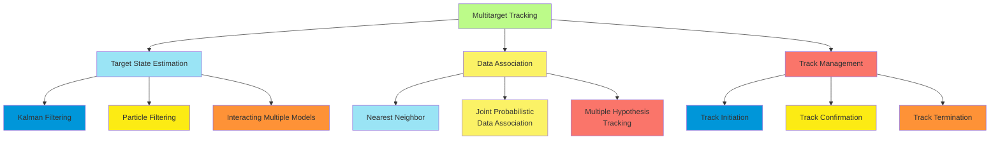

**Solution Approaches:**

1. **Global Nearest Neighbor (GNN)**:
    - Assigns each observation to the closest predicted target position
    - Enforces one-to-one assignments between targets and observations
    - Fast but prone to errors in cluttered environments
    - Formulated as an assignment problem solvable via the Hungarian algorithm
2. **Joint Probabilistic Data Association Filter (JPDAF)**:
    - Considers all possible observation-to-target associations
    - Computes association probabilities based on measurement likelihoods
    - Updates target state estimates using weighted average of all possibilities
    - Works well for fixed, known number of targets
3. **Multiple Hypothesis Tracking (MHT)**:
    - Maintains multiple hypotheses about observation-to-target associations
    - Propagates these hypotheses over time, pruning unlikely ones
    - Handles target appearance/disappearance explicitly
    - Computationally expensive but can recover from association errors
4. **Probability Hypothesis Density (PHD) Filter**:
    - Based on Random Finite Set theory
    - Propagates the first-order statistical moment of the multi-target state
    - Avoids explicit data association
    - Computationally efficient but doesn't maintain target identities
5. **Markov Chain Monte Carlo Data Association (MCMCDA)**:
    - Uses MCMC sampling to explore the space of possible associations
    - Handles varying numbers of targets naturally
    - Scales better than MHT for large problems
    - Converges to optimal solution with sufficient samples

**Performance Metrics:**

Several metrics evaluate multitarget tracking performance:

1. **OSPA (Optimal Subpattern Assignment) Distance**:
    - Combines errors in cardinality (number of targets) and state estimation
    - Provides a single metric for overall tracking quality
2. **CLEAR MOT Metrics**:
    - Multiple Object Tracking Precision (MOTP): Measures position estimation accuracy
    - Multiple Object Tracking Accuracy (MOTA): Accounts for missed targets, false alarms, and ID switches
3. **Track Continuity Metrics**:
    - Track fragmentation: How often tracks break and restart
    - ID switches: How often target identities are swapped
    - Track purity: Percentage of a track belonging to the same true target

**Applications:**

Multitarget tracking is used in numerous domains:

1. **Surveillance and Security**:
    - Tracking people in crowded spaces
    - Monitoring vehicle movements in sensitive areas
    - Maritime vessel tracking
2. **Military Applications**:
    - Air defense systems tracking multiple aircraft
    - Missile defense tracking warheads and decoys
    - Battlefield awareness systems
3. **Autonomous Systems**:
    - Self-driving cars tracking surrounding vehicles and pedestrians
    - Robotic systems navigating dynamic environments
    - Drone swarm coordination
4. **Scientific Applications**:
    - Cell tracking in microscopy
    - Animal group behavior analysis
    - Particle tracking in physics experiments

The multitarget tracking problem represents a canonical example of open-universe probabilistic reasoning, requiring
simultaneous inference about the number of objects, their identities, and their states from noisy, incomplete
observations.

##### Data Association and Identity Uncertainty

Data association and identity uncertainty form the core challenges in multitarget tracking and other open-universe
reasoning problems. These concepts address the fundamental question: Which observation corresponds to which entity?

**The Data Association Problem:**

Data association involves determining the mapping between observations and the entities that generated them. The
complexity arises because:

1. **Multiple Potential Mappings**: Any observation could potentially have been generated by any entity
2. **Combinatorial Explosion**: The number of possible global associations grows factorially with the number of
   observations and entities
3. **Temporal Dependency**: Association decisions at one time step affect future associations
4. **Observation Uncertainty**: Noise and measurement errors complicate association decisions

**Formal Representation:**

Let $Z_t = {z_t^1, z_t^2, ..., z_t^{M_t}}$ be the set of observations at time $t$, and
$X_t = {X_t^1, X_t^2, ..., X_t^{N_t}}$ be the states of entities.

The data association variable $A_t$ specifies which entity (if any) generated each observation:

- $A_t(j) = i$ means observation $z_t^j$ was generated by entity $X_t^i$
- $A_t(j) = 0$ indicates a false alarm (no corresponding entity)

**Types of Data Association Uncertainty:**

1. **One-to-One Association**: Each entity generates at most one observation, and each observation comes from at most
   one entity
    - Enforces mutual exclusivity in associations
    - Appropriate for many tracking applications
2. **Many-to-One Association**: Multiple observations may come from the same entity
    - Relevant when entities can generate multiple measurements
    - Common in extended target tracking
3. **One-to-Many Association**: One observation may correspond to multiple entities
    - Occurs with merged measurements
    - Common in low-resolution sensors
4. **Hierarchical Association**: Structured relationships between observations and entities
    - Example: Parts of an object generating different observations
    - Requires modeling compositional structure

**Approaches to Data Association:**

1. **Hard Assignment Methods**:
    - Make a single, definitive assignment of observations to entities
    - Examples: Global Nearest Neighbor, Hungarian algorithm
    - Advantages: Computational efficiency, simplicity
    - Disadvantages: Cannot represent association uncertainty
2. **Soft Assignment Methods**:
    - Maintain probabilities over possible associations
    - Examples: Joint Probabilistic Data Association Filter (JPDAF)
    - Advantages: Represents uncertainty, more robust to noise
    - Disadvantages: Exponential complexity, identity diffusion
3. **Multiple Hypothesis Methods**:
    - Maintain multiple explicit association hypotheses
    - Examples: Multiple Hypothesis Tracking (MHT)
    - Advantages: Can recover from errors, handles complex scenarios
    - Disadvantages: Computational complexity, requires pruning
4. **Sampling-Based Methods**:
    - Use Monte Carlo techniques to sample from association space
    - Examples: MCMC Data Association, Particle Filtering
    - Advantages: Handles complex models, scales to many targets
    - Disadvantages: Approximate inference, may require many samples

**Identity Uncertainty Across Time:**

Identity uncertainty becomes particularly challenging when tracking entities over time:

1. **Track Formation**: Determining which observations across time steps belong to the same entity
    - Requires temporal consistency in associations
    - Affected by detection failures and false alarms
2. **Identity Switches**: Incorrectly changing the identity assignment of an entity
    - Often occurs when entities pass close to each other
    - Major source of tracking errors
3. **Identity Merging/Splitting**: Incorrectly merging two entities or splitting one entity into multiple tracks
    - Results in underestimating or overestimating the number of entities
    - Particularly common in crowded scenes
4. **Long-term Identity Preservation**: Maintaining consistent identity despite temporary occlusions or missed
   detections
    - Requires reasoning about entity appearance and disappearance
    - May leverage appearance features beyond kinematic state

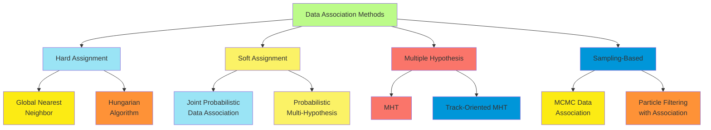

**Feature-Based Identity Resolution:**

Beyond spatial-temporal consistency, identity resolution often leverages distinguishing features:

1. **Appearance Models**:
    - Visual characteristics: color, texture, shape
    - Biometric features: face, gait, fingerprint
    - Helps disambiguate physically close entities
2. **Kinematic Constraints**:
    - Physical limitations on movement and behavior
    - Continuity of motion, maximum acceleration
    - Helps filter implausible associations
3. **Contextual Information**:
    - Environmental constraints: roads, walkways, obstacles
    - Social behaviors: group movements, interaction patterns
    - Improves association accuracy in structured environments

**Mathematical Formulation of Association Likelihood:**

The likelihood of an association $A_t(j) = i$ typically depends on multiple factors:

$P(A_t(j) = i | Z_t, X_t) \propto P(z_t^j | X_t^i) \cdot P(A_t(j) = i | A_{1:t-1})$

Where:

- $P(z_t^j | X_t^i)$ is the measurement likelihood (how well observation matches entity state)
- $P(A_t(j) = i | A_{1:t-1})$ captures association priors and temporal consistency

For feature-rich observations, the likelihood may include multiple components:

$P(z_t^j | X_t^i) = P(z_{pos}^j | X_{pos}^i) \cdot P(z_{app}^j | X_{app}^i) \cdot P(z_{size}^j | X_{size}^i)$

Where subscripts indicate position, appearance, and size components.

**Challenges in Complex Scenarios:**

1. **Group Tracking**:
    - Entities moving together as cohesive groups
    - Requires modeling both individual and group behavior
    - Association becomes hierarchical (observation → individual → group)
2. **Extended and Structured Targets**:
    - Targets that generate multiple observations from different parts
    - Requires modeling target extent and structure
    - Association must respect spatial relationships between observations
3. **Heterogeneous Sensors**:
    - Different sensor types with varied measurement characteristics
    - Requires sensor-specific observation models
    - Association across sensors needs careful alignment
4. **Dense Scenes**:
    - Many closely-spaced entities generating numerous observations
    - Association ambiguity increases dramatically
    - May require considering joint movement patterns

Data association and identity uncertainty represent the core theoretical challenges in open-universe probabilistic
models, requiring sophisticated algorithms to effectively manage the combinatorial complexity while maintaining accurate
tracking performance. The solutions to these challenges have applications far beyond multitarget tracking, extending to
database record linkage, citation matching, computer vision, and many other domains involving identity resolution.

##### Tracking with False Alarms and Detection Failures

In real-world tracking scenarios, perfect detection cannot be assumed. Systems must contend with both false alarms
(spurious observations not corresponding to actual entities) and detection failures (entities that generate no
observations). These complications significantly increase the complexity of multitarget tracking.

**False Alarms (False Positives):**

False alarms are observations that do not correspond to any real target entity. They arise from:

1. **Sensor Noise**: Random fluctuations in sensor readings
2. **Clutter**: Environmental objects generating spurious detections
3. **Algorithmic Artifacts**: Errors in detection algorithms
4. **Adversarial Deception**: Deliberately created false signals

**Modeling False Alarms:**

False alarms are typically modeled using:

1. **Uniform Spatial Distribution**: False alarms occur randomly throughout the observation space
    - $p(z|false\ alarm) = \frac{1}{V}$ where $V$ is the volume of the surveillance region
2. **Poisson Point Process**: The number of false alarms follows a Poisson distribution
    - $P(n_{FA}) = \frac{\lambda^{n_{FA}} e^{-\lambda}}{n_{FA}!}$ where $\lambda$ is the expected number of false alarms
3. **Intensity-Dependent Models**: False alarm probability depends on sensor-specific characteristics
    - $\lambda(x,y) = f(background(x,y))$ where false alarm rate varies spatially

**Detection Failures (False Negatives):**

Detection failures occur when existing targets are not observed. They result from:

1. **Occlusion**: Targets hidden by other objects
2. **Sensor Limitations**: Range constraints, blind spots, resolution limits
3. **Environmental Factors**: Weather, lighting, interference
4. **Target Characteristics**: Low reflectivity, stealth features

**Modeling Detection Failures:**

Detection probability is typically modeled as:

1. **Constant Detection Probability**: Each target has the same probability of detection
    - $P_D(X) = p_d$ (constant for all targets)
2. **State-Dependent Detection**: Detection probability depends on target state
    - $P_D(X) = g(distance, angle, size)$ decreasing with range, etc.
3. **Occlusion-Aware Models**: Detection probability accounts for line-of-sight obstructions
    - $P_D(X) = P_D^{base} \cdot P(not\ occluded|X)$

**Joint Tracking and Association Framework:**

To handle both false alarms and detection failures, tracking algorithms must:

1. **Extend Association Space**: Include null associations in both directions
    - Observations can be associated with "no target" (false alarm)
    - Targets can be associated with "no observation" (missed detection)
2. **Probabilistic Assignment Evaluation**: Evaluate each potential assignment considering:
    - Observation likelihood given target state
    - Prior probability of detection/false alarm
    - Track continuity and dynamics
3. **Track Management**: Explicit policies for:
    - **Track Initiation**: When to create a new track from an observation
    - **Track Confirmation**: When to confirm a tentative track as valid
    - **Track Deletion**: When to terminate a track with consistent missed detections

**Mathematical Formulation:**

The posterior probability of a specific global association $A$ given observations $Z$ becomes:

$P(A|Z) \propto P(Z|A) \cdot P(A)$

Where:

- $P(Z|A) = \prod_{j:A(j)>0} p(z_j|X_{A(j)}) \cdot \prod_{j:A(j)=0} p(z_j|false\ alarm)$
- $P(A)$ incorporates detection probability: $\prod_{i:detected} P_D(X_i) \cdot \prod_{i:not\ detected} (1-P_D(X_i))$

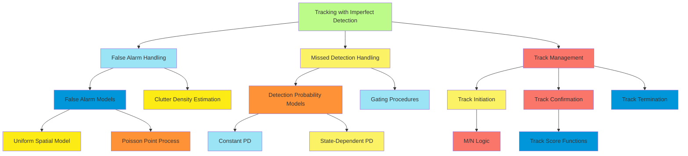

**Key Algorithms for Tracking with Imperfect Detection:**

1. **Probabilistic Multiple Hypothesis Tracking (PMHT)**:
    - Maintains multiple hypotheses about target-observation associations
    - Explicitly models detection probability and false alarm rate
    - Uses EM algorithm for parameter estimation
2. **Probability Hypothesis Density (PHD) Filter**:
    - Avoids explicit data association by tracking target density
    - Directly incorporates detection probability and clutter model
    - Computationally efficient even with many targets
3. **Joint Integrated Probabilistic Data Association (JIPDA)**:
    - Extends JPDA to include target existence estimation
    - Computes association probabilities considering detection uncertainty
    - Propagates target existence probability over time
4. **Multi-Bernoulli Filters**:
    - Models each potential target as a Bernoulli random variable (exists or not)
    - Propagates existence probability and state distribution
    - Handles birth and death of targets naturally

**Track Management Strategies:**

1. **M/N Logic**:
    - Initialize tentative track after one detection
    - Confirm track after M detections in N frames
    - Delete track after P consecutive missed detections
2. **Track Score Functions**:
    - Maintain numerical score for each track
    - Increment score with detections, decrement with misses
    - Apply thresholds for confirmation and deletion
3. **Probabilistic Track Management**:
    - Maintain explicit probability of track existence
    - Update based on Bayes' rule with detection/miss evidence
    - Make decisions based on existence probability thresholds
4. **Multi-Model Approaches**:
    - Different motion/observation models for tentative vs. confirmed tracks
    - Transition between models based on track status
    - Allows for specialized handling at different track stages

**Practical Implementation Considerations:**

1. **Gating**:
    - Restrict potential associations to observations within validation gates
    - Reduces computational complexity by eliminating unlikely associations
    - Gates typically based on Mahalanobis distance between predicted position and observation
2. **Track Initiation Strategies**:
    - Two-point differencing: Create track after two consecutive detections
    - Multi-frame initialization: Require consistent motion over several frames
    - IPDA approach: Initialize with low existence probability, update based on subsequent data
3. **False Track Discrimination**:
    - Features beyond kinematics to identify true vs. false tracks
    - Track motion consistency, observation quality metrics
    - Environment-specific constraints (e.g., road networks for vehicles)
4. **Adaptive Parameter Tuning**:
    - Estimate false alarm density and detection probability online
    - Adjust track management thresholds based on current conditions
    - Sensor fusion to improve detection reliability

Tracking with false alarms and detection failures represents a more realistic and challenging version of the multitarget
tracking problem. Effective solutions must balance sensitivity (avoiding missed targets) with specificity (avoiding
false tracks), while maintaining computational tractability in the face of combinatorial association possibilities.

##### Example: Traffic Monitoring

Traffic monitoring provides an excellent real-world example of multitarget tracking with identity uncertainty, false
alarms, and detection failures. This domain illustrates the practical application of open-universe probabilistic models
to a complex, dynamic environment.

**System Overview:**

A typical traffic monitoring system includes:

1. **Sensors**: Cameras, radar, inductive loops, or LiDAR
2. **Detection Module**: Identifies potential vehicles in sensor data
3. **Tracking Module**: Associates detections across time and maintains vehicle trajectories
4. **Analysis Module**: Extracts traffic statistics and detects incidents

**Domain Characteristics:**

Several aspects make traffic monitoring an ideal example of open-universe reasoning:

1. **Unknown Number of Targets**: The number of vehicles varies over time as they enter and exit the monitored area
2. **Complex Dynamics**: Vehicles follow traffic rules but with individual variations and interactions
3. **Occlusion**: Vehicles frequently occlude each other, especially in dense traffic
4. **Detection Challenges**: Weather, lighting, and perspective affect detection reliability
5. **Identity Preservation**: Maintaining consistent vehicle identities through intersections and merges

**OUPM Formulation for Traffic Monitoring:**

```
// Entity types
type Vehicle;
type Detection;

// Number of vehicles varies with time, traffic conditions
#Vehicle(t) ~ PoissonProcess(entryRate=λ(t, trafficConditions));

// Vehicle attributes
Vehicle.type ~ Categorical({car: 0.7, truck: 0.15, motorcycle: 0.1, bus: 0.05});
Vehicle.size ~ SizeDistribution(Vehicle.type);
Vehicle.color ~ ColorDistribution();
Vehicle.position(t=0) ~ EntryPointDistribution();

// Vehicle motion model - depends on road structure and traffic
Vehicle.position(t) ~
  MotionModel(Vehicle.position(t-1),
              Vehicle.velocity(t-1),
              RoadNetwork,
              NearbyVehicles.position(t-1));

// Detection model with imperfect detection
#Detection(vehicle=v, t) ~ Bernoulli(p=DetectionProbability(v.position(t),
                                                            v.size,
                                                            Occlusion(v, t)))
                            for Vehicle v at time t;

// False alarm model
#Detection(vehicle=null, t) ~ Poisson(λ=FalseAlarmRate(t));

// Observation model
obs Detection.position ~
  GaussianNoise(mean=origin(Detection).position,
                cov=PositionUncertainty);

obs Detection.size ~
  if (origin(Detection) != null)
    GaussianNoise(mean=origin(Detection).size,
                  cov=SizeUncertainty)
  else
    FalseDetectionSizeDistribution();

obs Detection.appearance ~
  if (origin(Detection) != null)
    AppearanceModel(origin(Detection).type,
                   origin(Detection).color,
                   ViewpointEffect(origin(Detection).position))
  else
    FalseDetectionAppearanceModel();

// Origin function - which vehicle generated which detection
origin(Detection) ~
  VehicleSelector(Detection.position,
                  Detection.size,
                  Detection.appearance);
```

This OUPM captures the core probabilistic structure of the traffic monitoring problem, including vehicle dynamics,
detection uncertainty, and data association.

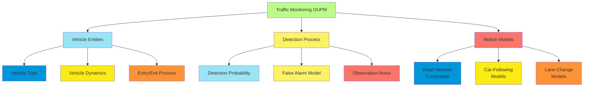

**Specialized Tracking Approaches for Traffic:**

1. **Road-Constrained Tracking**:
    - Vehicles predominantly follow road networks
    - Motion models incorporate map information
    - Reduces state uncertainty to primarily along-road components
2. **Multiple Motion Models**:
    - Different motion patterns for different scenarios:
        - Constant velocity for straight roads
        - Coordinated turn for intersections
        - Stop-and-go for congested traffic
    - Model switching based on location and traffic conditions
3. **Behavior-Based Prediction**:
    - Incorporating driver intention prediction
    - Lane-change detection and prediction
    - Turn signal and brake light detection
4. **Appearance Models**:
    - Vehicle type classification
    - Color and texture features
    - License plate recognition (when resolution permits)
    - Helps maintain identity through occlusions

**Practical Implementation Challenges:**

1. **Camera Calibration**:
    - Converting pixel coordinates to world coordinates
    - Accounting for perspective distortion
    - Handling pan-tilt-zoom cameras
2. **Illumination Variation**:
    - Day/night transitions
    - Shadows and reflections
    - Headlights and brake lights
    - Weather effects (rain, snow, fog)
3. **Real-time Processing Requirements**:
    - Low-latency detection and tracking
    - Resource constraints on embedded systems
    - Balancing accuracy with computational efficiency
4. **Large-Scale Deployment**:
    - Maintaining consistent vehicle identities across multiple cameras
    - Handoff between adjacent monitoring zones
    - Network constraints for distributed processing

**Example Use Cases and Analytics:**

1. **Traffic Flow Analysis**:
    - Vehicle counts and classifications
    - Speed distributions
    - Origin-destination mapping
    - Travel time estimation
2. **Incident Detection**:
    - Stopped vehicles
    - Wrong-way driving
    - Abnormal traffic patterns
    - Accidents and near-misses
3. **Infrastructure Planning**:
    - Identifying congestion patterns
    - Measuring intersection efficiency
    - Evaluating signal timing effectiveness
    - Before/after studies for road modifications
4. **Law Enforcement**:
    - Speed monitoring
    - Red light violation detection
    - HOV/carpool lane compliance
    - Identifying vehicles of interest

**Performance Evaluation:**

Traffic monitoring systems are typically evaluated on:

1. **Detection Performance**:
    - True positive rate (detection recall)
    - False alarm rate
    - Classification accuracy by vehicle type
2. **Tracking Performance**:
    - ID switches (identity preservation)
    - Track fragmentation (continuity)
    - Position accuracy
    - Trajectory smoothness
3. **Traffic Metrics Accuracy**:
    - Comparison with ground truth counts
    - Speed measurement accuracy
    - Queue length estimation
    - Density measurement
4. **Operational Robustness**:
    - Performance in adverse weather
    - Day/night consistency
    - Recovery from temporary sensor failures

Traffic monitoring exemplifies the practical application of open-universe probabilistic models, demonstrating how
theoretical approaches to existence uncertainty and identity resolution translate into real-world systems that maintain
situation awareness in complex, dynamic environments. The lessons learned from this domain transfer to other tracking
applications, from pedestrian monitoring to wildlife tracking and beyond.

##### Computational Approaches to Identity Management

Identity management in multitarget tracking and other open-universe scenarios presents significant computational
challenges. This section explores algorithmic approaches for efficiently handling identity uncertainty across time and
space.

**Core Identity Management Functions:**

1. **Identity Initialization**: Establishing new entities in the tracking system
2. **Identity Propagation**: Maintaining entity identities over time
3. **Identity Resolution**: Resolving ambiguities when tracks interact
4. **Identity Recovery**: Recovering identities after occlusions or missed detections

**Computational Representations of Identity:**

1. **Deterministic Identity**:
    - Each observation assigned to exactly one track
    - Track ID maintained as discrete label
    - Simple but cannot represent uncertainty
2. **Probabilistic Identity**:
    - Probability distribution over possible identities
    - Soft assignment of observations to tracks
    - Represents uncertainty but can lead to "identity diffusion"
3. **Multi-hypothesis Identity**:
    - Maintain multiple discrete identity hypotheses
    - Each hypothesis contains deterministic assignments
    - Tree structure with branching at ambiguous points
4. **Hybrid Approaches**:
    - Deterministic tracking with probabilistic appearance models
    - Multi-hypothesis for interacting targets, deterministic otherwise
    - Context-dependent identity representation

**Algorithmic Approaches to Identity Management:**

1. **Multiple Hypothesis Tracking (MHT)**:

    - Creates new hypotheses for each possible association
    - Maintains hypothesis tree with history of associations
    - Pruning and merging to control computational complexity

    **Advantages**: Maintains association history, can recover from errors **Limitations**: Exponential growth of
    hypotheses, requires sophisticated pruning

2. **Joint Probabilistic Data Association Filter (JPDAF) Extensions**:

    - JIPDA: Incorporates existence probability
    - JPDA\* and Set JPDA: Addressing identity diffusion
    - JPDA with hypothesis clustering

    **Advantages**: Computationally efficient, handles association uncertainty **Limitations**: Identity diffusion,
    independence assumptions

3. **MCMC Data Association**:

    - Samples from the space of possible association histories
    - Specialized moves for identity management:
        - Track extension/reduction
        - Track merging/splitting
        - Identity swap between tracks

    **Advantages**: Handles complex scenarios, avoids explicit enumeration **Limitations**: Approximate inference,
    convergence challenges

4. **Random Finite Set Methods**:

    - Labeled Multi-Bernoulli (LMB) filters
    - Generalized Labeled Multi-Bernoulli (GLMB) filters
    - δ-GLMB filter with explicit track labels

    **Advantages**: Rigorous mathematical foundation, integrated track management **Limitations**: Implementation
    complexity, computational demands

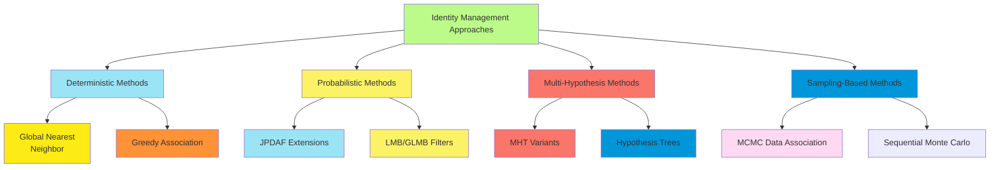

**Optimization Techniques for Scalability:**

1. **Gating and Clustering**:
    - Spatial gating to limit potential associations
    - Clustering independent assignment problems
    - Hierarchical association in multiple stages
2. **Parallel Processing Strategies**:
    - Hypothesis-level parallelization in MHT
    - Particle-level parallelization in MCMC/SMC
    - GPU acceleration for association likelihood evaluation
3. **Approximation Methods**:
    - k-best assignments instead of all possible associations
    - Pruning unlikely hypotheses early
    - Fixed-lag smoothing with limited history
4. **Sparse Representations**:
    - Exploit sparsity in association matrices
    - Efficient data structures for hypothesis management
    - Factored representations of joint distributions

**Identity Management in Complex Scenarios:**

1. **Group Tracking**:
    - Identity management for both individuals and groups
    - Hierarchical association: observation → individual → group
    - Entry/exit of individuals from groups
2. **Extended Object Tracking**:
    - Multiple detections per object
    - Shape/extent as part of identity
    - Part-to-whole association
3. **Track Handover Between Sensors**:
    - Maintaining identity across non-overlapping sensor views
    - Re-identification based on appearance and kinematics
    - Global vs. local identity management

**Feature-Enhanced Identity Management:**

Identity management can be significantly improved by incorporating distinguishing features beyond kinematic state:

1. **Appearance Models**:
    - Visual descriptors: color histograms, texture patterns
    - Deep learning features from neural networks
    - Updated recursively as new observations arrive
2. **Motion Patterns**:
    - Characteristic movement profiles
    - Learned behavioral models
    - Intention prediction
3. **Physical Constraints**:
    - Maximum velocity/acceleration limits
    - Environmental constraints (roads, walkways)
    - Physical impossibility of teleportation

**Identity Management Cost Functions:**

Identity management algorithms optimize various cost functions:

1. **Association Likelihood**: Probability of observation given target state
    - $\log P(z|x) = -\frac{1}{2}(z-h(x))^T R^{-1} (z-h(x)) + \text{const}$ for Gaussian measurement models
2. **Track Continuation Cost**: Penalty for track fragmentation
    - $C_{cont} = \alpha \cdot \text{number of track switches}$
3. **Global Assignment Cost**: Overall cost for a complete assignment
    - $C_{global} = \sum_{i,j} c_{i,j} \cdot a_{i,j}$ where $a_{i,j}$ is a binary assignment variable
4. **Identity Preservation Metrics**: How well correct identities are maintained
    - MOTA (Multiple Object Tracking Accuracy) includes identity switch cost
    - IDF1 (ID F1 score) measures identity consistency

**Real-Time Identity Management Algorithms:**

For time-critical applications, specialized approaches include:

1. **Sliding Window Methods**:
    - Maintain identity only within recent time window
    - Optimize assignments within window
    - Fixed computational budget regardless of scenario duration
2. **Anytime Algorithms**:
    - Provide valid solution at any interruption point
    - Progressive refinement with additional computation time
    - Quality-runtime tradeoff control
3. **Incremental Computation**:
    - Reuse previous results when new observations arrive
    - Update only affected components of the solution
    - Efficient handling of streaming data

**Practical Implementation Example: Person Re-identification**

Consider a surveillance system tracking people across multiple cameras:

```
function IdentityManagement(observations, trackDatabase):
    // Pre-processing and gating
    validAssociations = SpatioTemporalGating(observations, trackDatabase)

    // Feature extraction
    for each observation in observations:
        observation.features = ExtractFeatures(observation)

    // Identity association
    for each validPair in validAssociations:
        obs = validPair.observation
        track = validPair.track

        // Calculate association costs
        kinematicCost = MahalanobisDistance(obs.state, track.predictedState)
        appearanceCost = FeatureDistance(obs.features, track.features)
        timeConsistencyCost = TemporalGapPenalty(obs.time, track.lastUpdateTime)

        // Combined cost with weights
        totalCost = w₁*kinematicCost + w₂*appearanceCost + w₃*timeConsistencyCost
        costMatrix[obs.id, track.id] = totalCost

    // Solve global assignment problem
    assignments = HungarianAlgorithm(costMatrix)

    // Handle unassigned observations and tracks
    for each assignment in assignments:
        if assignment.cost < threshold:
            // Update track with new observation
            UpdateTrack(assignment.track, assignment.observation)
            // Update appearance model incrementally
            UpdateAppearanceModel(assignment.track, assignment.observation.features)
        else:
            // Create new track or temporary suspension
            HandleUnassignedPair(assignment)

    // Identity recovery for suspended tracks
    for each suspendedTrack in trackDatabase.suspended:
        if RecoveryCondition(suspendedTrack):
            AttemptIdentityRecovery(suspendedTrack, observations)

    return updatedTrackDatabase
```

**Recent Advances in Identity Management:**

1. **Deep Learning Approaches**:
    - End-to-end tracking networks that jointly handle detection and identity
    - Learned association metrics from data
    - Attention mechanisms for feature matching across time
2. **Graph Neural Networks**:
    - Representing tracking as a graph problem
    - Message passing between observations and tracks
    - Learning optimal association strategies
3. **Adversarial Identity Preservation**:
    - Training discriminative networks to distinguish identity switches
    - Generator networks that produce identity-consistent trajectories
    - Robust to occlusion and appearance changes
4. **Reinforcement Learning for Identity Decisions**:
    - Framing identity management as sequential decision making
    - Learning policies that optimize long-term identity preservation
    - Adaptive thresholds based on scenario complexity

Computational approaches to identity management continue to evolve, with increasing focus on scalability to large
numbers of targets, robustness to challenging scenarios, and integration of multiple information sources to maintain
consistent identities over extended durations and complex interactions.

#### Programs as Probability Models

##### Generative Programs and Execution Traces

Generative programs provide a powerful paradigm for defining rich probability models through algorithmic processes that
generate data. This approach merges programming with probabilistic modeling, enabling the specification of complex
distributions through computational procedures.

**Generative Programs as Probability Models:**

A generative program implicitly defines a probability distribution through its execution:

1. The program's stochastic elements introduce randomness
2. Running the program produces samples from the distribution
3. The program's logic encodes dependencies and constraints
4. The resulting distribution may be too complex to express in closed form

**Key Components of Generative Programs:**

1. **Random Primitives**: Fundamental sources of randomness
    - Discrete distributions (Bernoulli, categorical, Poisson)
    - Continuous distributions (Gaussian, uniform, exponential)
    - Random choices that determine program execution paths
2. **Deterministic Computation**: Transformations of random values
    - Mathematical operations on random variables
    - Conditional logic based on random outcomes
    - Complex functions producing structured outputs
3. **Repeated Structure**: Mechanisms for repetition and aggregation
    - Loops with random iteration counts
    - Recursion with stochastic termination
    - Collection generation with varying sizes
4. **Conditioning Mechanisms**: Constraining generated values
    - Rejection of samples that violate constraints
    - Probabilistic assertions that filter execution traces
    - Explicit conditioning on observed data

**Execution Traces:**

An execution trace records the sequence of random choices and their outcomes during a single run of a generative
program. Formally, a trace consists of:

1. **Random Choice Points**: Locations in the program where randomness is introduced
2. **Values**: Specific outcomes of each random choice
3. **Execution Path**: The control flow path taken through the program
4. **Dependencies**: How later choices depend on earlier ones

Execution traces are central to inference in probabilistic programming:

- The probability of a trace is the product of probabilities of all random choices
- Inference algorithms explore the space of possible traces
- Conditioning restricts traces to those consistent with observations

**Example Generative Program for Text Analysis:**

```python
def generate_document():
    # Choose document topic
    topic = sample("topic", categorical({"politics": 0.3, "sports": 0.4, "tech": 0.3}))

    # Determine document length based on topic
    if topic == "politics":
        length = sample("length", poisson(lambda=500))
    elif topic == "sports":
        length = sample("length", poisson(lambda=300))
    else:  # tech
        length = sample("length", poisson(lambda=400))

    # Generate words
    words = []
    for i in range(length):
        # Word choice depends on topic
        if topic == "politics":
            word = sample(f"word_{i}", categorical(politics_word_dist))
        elif topic == "sports":
            word = sample(f"word_{i}", categorical(sports_word_dist))
        else:  # tech
            word = sample(f"word_{i}", categorical(tech_word_dist))

        words.append(word)

    return {"topic": topic, "words": words}
```

A possible execution trace for this program might record:

- sample("topic") = "sports"
- sample("length") = 325
- sample("word_0") = "team"
- sample("word_1") = "player"
- ...and so on

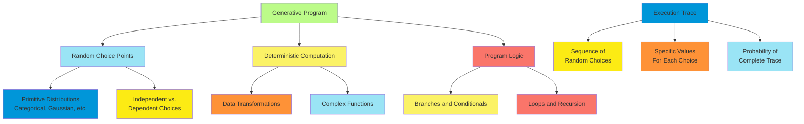

**Advantages of Generative Programs:**

1. **Expressiveness**: Can represent complex, structured probability distributions
2. **Modularity**: Programs can be composed from reusable components
3. **Interpretability**: Generation process often aligns with domain understanding
4. **Extensibility**: Easy to modify and enhance the generative process

**Relationship to Traditional Probability Models:**

Generative programs generalize and subsume many traditional model classes:

1. **Graphical Models**: Program structure implicitly defines dependencies
    - Variables correspond to random choices
    - Variable dependencies follow program execution flow
    - Bayesian networks emerge from sequential random choices
2. **Hierarchical Models**: Naturally expressed through nested function calls
    - Parameters can be drawn from hyperprior distributions
    - Multi-level hierarchies through recursive program structure
    - Group-level and individual-level variation
3. **Mixture Models**: Implemented via conditional branching
    - Component selection as a discrete random choice
    - Component-specific parameters and generation logic
    - Flexible mixture components beyond common distributions

**Types of Generative Programs:**

1. **Forward Simulation Models**: Program directly simulates the data generation process
    - Physical simulations with random inputs
    - Agent-based models with stochastic behavior
    - Growth processes with random perturbations
2. **Procedural Generation**: Programs that generate structured content
    - Synthetic images, text, or audio
    - Generative art with controlled randomness
    - Procedural terrain or environment generation
3. **Stochastic Grammars**: Rules for generating structured objects
    - Probabilistic context-free grammars for language
    - Scene grammars for image generation
    - Molecule grammars for chemical structures
4. **Recursive Generative Processes**: Self-similar structures through recursion
    - Probabilistic fractal generation
    - Hierarchical topic models
    - Nested entity relationships

**Conditioning Generative Programs:**

Generative programs become powerful inference tools when conditioned on observations:

1. **Rejection Sampling**: Run program repeatedly, keeping only traces consistent with observations
2. **Importance Sampling**: Weight traces by their consistency with observations
3. **Markov Chain Monte Carlo**: Explore trace space via local modifications
4. **Variational Methods**: Approximate posterior over traces with simpler distributions

The generative program framework unifies simulation, modeling, and inference, providing a flexible foundation for
probabilistic reasoning that scales to complex, structured domains beyond the reach of traditional statistical models.

##### Example: Reading Degraded Text

Reading degraded text exemplifies the power of generative programs for modeling complex processes with uncertainty. This
problem involves inferring the original text from noisy, corrupted, or partially obscured documents—a task humans
perform remarkably well by reasoning about both language structure and the degradation process.

**The Degraded Text Problem:**

The task involves:

1. Observing text that has been corrupted by various noise processes
2. Inferring the original, uncorrupted text
3. Quantifying uncertainty about possible interpretations

Common degradation types include:

- Character substitution, insertion, or deletion errors
- OCR (Optical Character Recognition) mistakes
- Physical document damage (tears, stains, fading)
- Handwriting variability and illegibility

**Generative Program Approach:**

A generative program for degraded text models both the text generation process and the degradation process:

```python
def generate_degraded_text():
    # Generate original text using language model
    text_length = sample("length", poisson(lambda=20))  # Words in document
    original_text = []

    # Language model for word sequence
    previous_word = None
    for i in range(text_length):
        if previous_word is None:
            # Initial word distribution
            word = sample(f"word_{i}", categorical(initial_word_dist))
        else:
            # Conditional word distribution given previous word
            word = sample(f"word_{i}", categorical(transition_probs[previous_word]))

        original_text.append(word)
        previous_word = word

    # Apply degradation process to original text
    degraded_text = []
    for word in original_text:
        # Model character-level degradation
        degraded_word = ""
        for char in word:
            degradation_type = sample(f"deg_{word}_{char}",
                                      categorical({
                                          "correct": 0.8,
                                          "substitute": 0.1,
                                          "delete": 0.05,
                                          "insert": 0.05
                                      }))

            if degradation_type == "correct":
                degraded_word += char
            elif degradation_type == "substitute":
                similar_char = sample(f"sub_{word}_{char}",
                                      categorical(char_confusion_matrix[char]))
                degraded_word += similar_char
            elif degradation_type == "delete":
                pass  # Skip this character
            elif degradation_type == "insert":
                insert_char = sample(f"ins_{word}_{char}",
                                     categorical(char_freq_dist))
                degraded_word += insert_char + char

        # Add document-level noise like stains or tears
        if sample(f"word_visible_{word}", bernoulli(p=0.95)):
            degraded_text.append(degraded_word)
        else:
            degraded_text.append("*****")  # Completely obscured

    return {"original": original_text, "degraded": degraded_text}
```

This program defines a joint distribution over original and degraded text, where:

- The prior distribution for original text comes from a language model
- The likelihood of degraded text given original text is defined by the degradation model
- The posterior distribution over original text given degraded text is the inference target

**Execution Traces and Inference:**

An execution trace for this program records all random choices:

- Word selections for the original text
- Degradation decisions for each character
- Document-level noise effects

When we observe degraded text, inference involves:

1. Finding execution traces that produce the observed degraded text
2. Sampling from or approximating the posterior distribution over these traces
3. Extracting the original text from sampled traces

**OCR Correction as Inference:**

For OCR correction, we condition the generative program on the observed OCR output and infer the most likely original
text:

```python
def infer_original_text(observed_degraded_text):
    # Run inference on the generative model
    posterior_traces = infer(generate_degraded_text,
                             condition={"degraded": observed_degraded_text})

    # Extract and return the original text from these traces
    reconstructed_texts = [trace["original"] for trace in posterior_traces]
    confidence_scores = [trace_probability(trace) for trace in posterior_traces]

    return reconstructed_texts, confidence_scores
flowchart TD
    A["Degraded Text Model"] --> B["Language Model<br>(Prior)"]
    A --> C["Degradation Model<br>(Likelihood)"]

    B --> D["Word Sequence<br>Generation"]
    B --> E["Contextual<br>Dependencies"]

    C --> F["Character-Level<br>Corruption"]
    C --> G["Document-Level<br>Noise"]

    H["Inference Process"] --> I["Condition on<br>Observed Text"]
    H --> J["Sample Posterior<br>Over Traces"]
    H --> K["Extract Original<br>Text"]

    F --> L["Substitution"]
    F --> M["Insertion"]
    F --> N["Deletion"]

    style A fill:#BCFB89
    style B fill:#9AE4F5
    style C fill:#FBF266
    style D fill:#FA756A
    style E fill:#0096D9
    style F fill:#FCEB14
    style G fill:#FE9237
    style H fill:#9AE4F5
    style I fill:#FBF266
    style J fill:#FA756A
    style K fill:#0096D9
    style L fill:#FCEB14
    style M fill:#FE9237
    style N fill:#9AE4F5
```

**Inference Algorithms for Text Reconstruction:**

Several inference strategies are effective for degraded text:

1. **MCMC Methods**:
    - Propose local changes to the original text
    - Accept/reject based on likelihood of producing observed degraded text
    - Effective for exploring the space of possible interpretations
2. **Beam Search**:
    - Maintain k-best reconstructions at each step
    - Extend reconstructions based on language model and degradation model
    - Prune unlikely hypotheses to maintain tractability
3. **Particle Filtering**:
    - Process the text sequentially, word by word
    - Maintain a population of particles representing different interpretations
    - Resample based on consistency with observed degraded text
4. **Neural Inference Networks**:
    - Train neural networks to directly predict posterior distributions
    - Amortize inference cost across many documents
    - Leverage deep learning for feature extraction from degraded text

**Context-Sensitive Degradation Models:**

Real degradation processes often have contextual patterns:

1. **Position-Dependent Degradation**:
    - Page edges may have more damage
    - Headers and footers may use different fonts
    - Folded areas have characteristic degradation patterns
2. **Content-Dependent Degradation**:
    - Certain characters are more often confused (e.g., 'l' and '1')
    - Word length affects recognition accuracy
    - Common words may be more easily reconstructed
3. **Document-Specific Patterns**:
    - Consistent OCR errors throughout a document
    - Systematic biases in scanning or photography
    - Unique paper quality or printing technology

**Applications Beyond Text:**

The generative program approach to degraded text generalizes to other reconstruction problems:

1. **Image Restoration**:
    - Generative models for clean images
    - Degradation models for noise, blur, compression artifacts
    - Inference to recover original image
2. **Audio Enhancement**:
    - Speech models for clean audio
    - Degradation models for background noise, reverberation
    - Inference for speech enhancement and recognition
3. **Data Cleaning**:
    - Generative models for structured data
    - Error models for different data collection processes
    - Inference to identify and correct database errors

The degraded text example illustrates how generative programs can capture complex, structured processes involving both
prior knowledge (language models) and noise mechanisms (degradation processes). By explicitly modeling how observations
relate to the underlying clean data, these approaches enable principled reconstruction that leverages both statistical
patterns and domain-specific knowledge about corruption processes.

##### Syntax and Semantics of Probabilistic Programs

Probabilistic programming extends traditional programming languages with constructs for representing and reasoning about
uncertainty. The syntax and semantics of probabilistic programs formalize how these languages define probability
distributions and support statistical inference.

**Core Language Constructs:**

Probabilistic programming languages (PPLs) typically include:

1. **Random Primitive Statements**:
    - Sampling from probability distributions: `x ~ Normal(0, 1)`
    - Random choice operations: `choice([0.3, 0.7], ["A", "B"])`
    - These introduce randomness into program execution
2. **Observation/Conditioning Statements**:
    - Hard constraints: `observe(x == observed_value)`
    - Soft constraints: `factor(log_likelihood(data | model))`
    - These restrict the space of valid execution traces
3. **Deterministic Computation**:
    - Standard programming constructs: assignments, arithmetic, function calls
    - Control flow operations: conditionals, loops, recursion
    - These transform random values and enforce dependencies
4. **Inference Directives**:
    - Queries about posterior distributions: `infer(variable | observations)`
    - Algorithm selection: `mcmc(samples=1000, method="metropolis")`
    - These specify inference goals and methods

**Example Probabilistic Program:**

```
// Define a mixture model for heights
func height_model():
    // Latent variable for gender
    gender ~ Bernoulli(0.5)  // 0 = female, 1 = male

    // Height depends on gender
    if gender == 0:
        height ~ Normal(mu=165, sigma=6)  // Female height distribution
    else:
        height ~ Normal(mu=178, sigma=7)  // Male height distribution

    return height

// Condition on observed height
observed_height = 172
posterior = infer(gender | height == observed_height)
```

**Denotational Semantics:**

The meaning of a probabilistic program is the probability distribution it defines:

1. **Distribution over Execution Traces**:
    - Each execution trace records values of all random choices
    - Probability of a trace is the product of probabilities of individual choices
    - Program defines a measure over the space of all possible traces
2. **Marginal Distribution of Return Values**:
    - The distribution of values returned by the program
    - Induced by the distribution over execution traces
    - Often the target of inference queries
3. **Conditional Distributions**:
    - Restrict to traces satisfying observational constraints
    - Normalize to obtain a proper posterior distribution
    - Result of conditioning the prior distribution defined by the program

**Formal Semantics Notation:**

For a probabilistic program P:

- **Prior Semantics**: P denotes the distribution over execution traces
- **Observation Semantics**: P | obs denotes the conditional distribution given observations
- **Query Semantics**: Q | P, obs denotes the posterior distribution of query variables

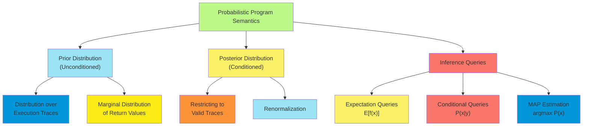

**Language Design Dimensions:**

Probabilistic programming languages vary along several dimensions:

1. **Host Language Integration**:
    - Standalone languages (Church, Anglican)
    - Language extensions (Stan, BUGS)
    - Library implementations (PyMC, Edward, Pyro)
2. **Model Expressiveness**:
    - First-order languages: fixed set of random variables
    - Higher-order languages: dynamic creation of random variables
    - Universal languages: Turing-complete, can express any computable distribution
3. **Distribution Representations**:
    - Explicit density functions
    - Sampling procedures
    - Implicit distributions (e.g., via neural networks)
4. **Type Systems**:
    - Dynamic typing with runtime checking
    - Static typing with guaranteed properties
    - Dependent types capturing distribution constraints

**Common Syntactic Patterns:**

Different PPLs adopt various syntactic conventions:

1. **Distribution Assignment**:

    ```
    // BUGS/JAGS style
    x ~ normal(mu, sigma)

    // Stan style
    x = normal_rng(mu, sigma)

    // Python PPL style
    x = pyro.sample("x", dist.Normal(mu, sigma))
    ```

2. **Conditioning Syntax**:

    ```
    // Hard constraint
    observe(x == 5)

    // Soft constraint (log likelihood)
    factor(log_normal_pdf(x, mu, sigma))

    // Conditioning via distribution
    y ~ normal(x, 0.1) // y is observed
    ```

3. **Inference Specification**:

    ```
    // Explicit inference call
    posterior = infer(target_vars, observations, method="MCMC")

    // Implicit conditioning
    run_conditioned(model, observations)

    // Query-based inference
    expectation(function(x) x^2, posterior)
    ```

**Semantic Challenges in Probabilistic Programs:**

Several semantic issues arise in probabilistic programming:

1. **Measure-Theoretic Foundations**:
    - Ensuring well-defined distributions for arbitrary programs
    - Handling continuous, discrete, and mixed random variables
    - Defining semantics for recursive probabilistic programs
2. **Stochastic Control Flow**:
    - Variables used in control flow whose values are uncertain
    - Paths through the program become probabilistic
    - Multiple execution traces may produce the same return value
3. **Conditioning Semantics**:
    - Zero-probability observations in continuous domains
    - Soft vs. hard constraints
    - Rejection sampling vs. importance sampling interpretation
4. **Non-Termination**:
    - Programs with positive probability of non-termination
    - Defining distributions over potentially infinite traces
    - Semantic meaning of inference with non-terminating programs

**Implementation Techniques:**

Implementing the semantics of probabilistic programs requires:

1. **Trace Generation**:
    - Forward execution with random variable sampling
    - Recording values and probabilities at sample sites
    - Handling conditioning statements during execution
2. **Trace Manipulation**:
    - Score computation for complete traces
    - Trace reuse for efficient inference
    - Local changes to traces for MCMC
3. **Distribution Representation**:
    - Analytical form when available
    - Approximate representation through samples
    - Hybrid analytical/sample-based representation

The syntax and semantics of probabilistic programs provide a formal foundation for understanding how programs define
distributions and how inference can be performed on these distributions. This framework bridges programming languages
and probability theory, enabling rigorous reasoning about uncertainty within computational models.

##### Improving Models with Markov Processes

Markov processes provide powerful extensions to probabilistic programs for modeling dynamic systems that evolve over
time or space. Incorporating Markov processes into probabilistic programming enables more accurate modeling of
sequential data, state transitions, and temporal dependencies.

**Types of Markov Processes in Probabilistic Programs:**

1. **Markov Chains**:
    - Discrete state space with probabilistic transitions
    - Each state depends only on the previous state
    - Useful for modeling sequences with limited memory
2. **Hidden Markov Models (HMMs)**:
    - Latent state sequence with observations
    - States follow Markov dynamics
    - Observations depend only on current state
    - Models sequences with hidden structure
3. **Markov Jump Processes**:
    - Continuous-time processes with discrete states
    - State transitions occur at random times
    - Models events with variable time intervals
4. **Continuous-State Markov Processes**:
    - State space is continuous (e.g., position, velocity)
    - Evolution follows stochastic differential equations
    - Models physical systems with random perturbations

**Incorporating Markov Processes in Probabilistic Programs:**

Markov processes can be embedded in probabilistic programs through recursive or iterative structures:

```python
def markov_chain(length, initial_state, transition_matrix):
    states = [0] * length
    states[0] = sample("state_0", categorical(initial_state))

    for t in range(1, length):
        # Next state depends only on previous state
        states[t] = sample(f"state_{t}",
                           categorical(transition_matrix[states[t-1]]))

    return states

def hidden_markov_model(length, initial_state, transition_matrix, emission_matrix):
    # Generate hidden state sequence
    states = markov_chain(length, initial_state, transition_matrix)

    # Generate observations from states
    observations = [0] * length
    for t in range(length):
        observations[t] = sample(f"obs_{t}",
                                categorical(emission_matrix[states[t]]))

    return {"states": states, "observations": observations}
```

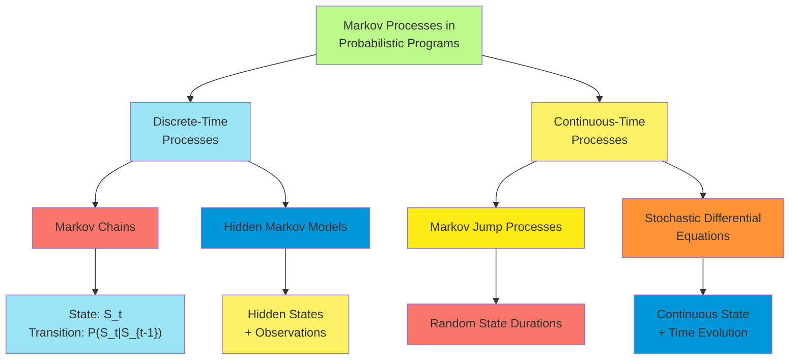

**Benefits of Markov Processes in Probabilistic Modeling:**

1. **Efficient Representation of Temporal Dependencies**:
    - Compact encoding of sequential dependence
    - Memory requirements independent of sequence length
    - Natural representation of many real-world processes
2. **Structural Prior Knowledge**:
    - Incorporates domain knowledge about sequential dependence
    - Restricts model to plausible sequential patterns
    - Improves sample efficiency and generalization
3. **Computational Advantages**:
    - Specialized inference algorithms available (forward-backward, Viterbi)
    - Dynamic programming for efficient marginal computation
    - Analytical solutions for certain Markov processes
4. **Interpretable Model Structure**:
    - Clear semantics of state transitions
    - Identifiable components (transition matrix, emission probabilities)
    - Visualizable as state diagrams or trajectories

**Example: Text Analysis with HMMs:**

Consider a part-of-speech tagging model implemented as a probabilistic program:

```python
def pos_tagging_model(sentence):
    # Model parameters
    num_pos_tags = 10  # E.g., Noun, Verb, Adjective, etc.
    vocabulary_size = 10000

    # Prior for transition matrix (tag to tag)
    transition_prior = dirichlet([1.0] * num_pos_tags)
    transition_matrix = [0] * num_pos_tags
    for i in range(num_pos_tags):
        transition_matrix[i] = sample(f"trans_{i}", transition_prior)

    # Prior for emission matrix (tag to word)
    emission_prior = dirichlet([0.1] * vocabulary_size)
    emission_matrix = [0] * num_pos_tags
    for i in range(num_pos_tags):
        emission_matrix[i] = sample(f"emit_{i}", emission_prior)

    # Initial state distribution
    initial_dist = sample("initial", dirichlet([1.0] * num_pos_tags))

    # Generate the tag sequence (states) and words (observations)
    length = len(sentence)
    tags = [0] * length

    # Initial tag
    tags[0] = sample("tag_0", categorical(initial_dist))

    # Generate subsequent tags using Markov property
    for t in range(1, length):
        tags[t] = sample(f"tag_{t}", categorical(transition_matrix[tags[t-1]]))

    # Generate words based on tags
    for t in range(length):
        # Condition on observed word
        observe(categorical(emission_matrix[tags[t]]), sentence[t])

    return tags
```

When conditioned on an observed sentence, inference on this model yields the posterior distribution over POS tag
sequences, effectively performing probabilistic tagging.

**Advanced Markov Process Extensions:**

1. Higher-Order Markov Models

    :

    - State depends on multiple previous states
    - Captures longer-range dependencies
    - Example: N-gram language models as (N-1)-order Markov models

```python
def higher_order_markov(length, n, initial_states, transition_tensor):
    states = [0] * length

    # Initialize first n-1 states
    for i in range(n-1):
        states[i] = sample(f"state_{i}", categorical(initial_states[i]))

    # Generate remaining states based on previous n-1 states
    for t in range(n-1, length):
        context = tuple(states[t-(n-1):t])
        states[t] = sample(f"state_{t}",
                          categorical(transition_tensor[context]))

    return states
```

1. **Variable-Length Markov Models**:
    - Context length depends on specific history patterns
    - More efficient than fixed higher-order models
    - Implemented via context trees or suffix trees
2. **Input-Output HMMs**:
    - Transitions depend on external input sequence
    - Models systems with both autonomous dynamics and external influences
    - Useful for control systems and interactive processes

```python
def input_output_hmm(inputs, initial_state, transition_matrix, emission_matrix):
    length = len(inputs)
    states = [0] * length
    observations = [0] * length

    states[0] = sample("state_0", categorical(initial_state))

    for t in range(1, length):
        # Transition depends on previous state and current input
        states[t] = sample(f"state_{t}",
                          categorical(transition_matrix[states[t-1]][inputs[t]]))

        # Observation depends on current state
        observations[t] = sample(f"obs_{t}",
                                categorical(emission_matrix[states[t]]))

    return {"states": states, "observations": observations}
```

1. Non-Homogeneous Markov Processes

    :

    - Transition probabilities change over time
    - Models systems with evolving dynamics
    - Useful for non-stationary phenomena

```python
def non_homogeneous_markov(length, initial_state, transition_tensors):
    states = [0] * length
    states[0] = sample("state_0", categorical(initial_state))

    for t in range(1, length):
        # Transition matrix depends on time t
        states[t] = sample(f"state_{t}",
                          categorical(transition_tensors[t][states[t-1]]))

    return states
```

**Inference Challenges with Markov Processes:**

1. **State Space Explosion**:
    - Number of possible state sequences grows exponentially with length
    - Requires efficient algorithms that avoid explicit enumeration
2. **Parameter Learning**:
    - Estimating transition and emission probabilities
    - Often requires EM algorithm or Bayesian inference
    - May face identifiability issues
3. **Model Selection**:
    - Determining appropriate number of states
    - Selecting between different Markov architectures
    - Balancing model complexity with data fit

**Specialized Inference Algorithms:**

Several inference techniques are particularly effective for Markov processes:

1. **Forward-Backward Algorithm (HMMs)**:
    - Efficient computation of marginal state probabilities
    - Uses dynamic programming to avoid exponential complexity
    - Suitable for smoothing and filtering queries
2. **Viterbi Algorithm**:
    - Finds most likely state sequence given observations
    - Also uses dynamic programming for efficiency
    - Key to many sequence labeling applications
3. **Particle Filtering**:
    - Sequential Monte Carlo for online state estimation
    - Maintains a population of particles representing states
    - Particularly useful for complex observation models
4. **Reversible Jump MCMC**:
    - Samples from posterior over models with different numbers of states
    - Enables Bayesian model selection
    - Handles uncertainty in model structure

Markov processes significantly enhance probabilistic programming by providing principled ways to model sequential
dependencies and temporal evolution, leading to more accurate and efficient representations of many real-world
phenomena. Their incorporation into probabilistic programs combines the expressive power of programming languages with
the statistical strength of established sequential modeling techniques.

##### Inference in Generative Programs

Inference in generative programs involves computing posterior distributions or estimates based on observed data. This
represents the inverse problem of the generation process—reasoning backwards from observations to the latent variables
and parameters that could have produced them.

**The Inference Problem:**

Given a generative program that defines:

- A prior distribution over latent variables and parameters
- A likelihood function relating these to observable data
- Observed data values

The inference task is to compute:

- Posterior distributions over latent variables
- Point estimates of parameters
- Predictive distributions for new observations

**Key Inference Targets in Generative Programs:**

1. **Posterior Sampling**:
    - Generate samples from $P(\text{latent variables} | \text{observed data})$
    - Represents the distribution of possible explanations for observations
2. **Maximum A Posteriori (MAP) Estimation**:
    - Find $\arg\max_{\theta} P(\theta | \text{observed data})$
    - The most likely parameter values given the observations
3. **Posterior Predictive Inference**:
    - Compute $P(\text{new data} | \text{observed data})$
    - Predictions that account for parameter uncertainty
4. **Marginal Likelihood Estimation**:
    - Calculate $P(\text{observed data})$ integrating over all parameters
    - Used for model comparison and selection

**Challenges Specific to Generative Programs:**

1. **Stochastic Control Flow**:
    - Program execution paths may depend on random choices
    - Different executions may involve different random variables
    - Requires inference methods that can handle variable-dimension spaces
2. **Rejection Constraints**:
    - Programs may contain hard constraints (reject executions that violate them)
    - Creates discontinuities in the probability space
    - Potentially infinite rejection rates for certain parameter values
3. **Non-Standard Distributions**:
    - Programs can define distributions without closed-form densities
    - May only be expressible through sampling procedures
    - Requires likelihood-free inference approaches
4. **Computational Efficiency**:
    - Naive methods may require re-executing the program many times
    - Potentially high cost for complex generative processes
    - Need for amortized or approximate inference

**Inference Algorithms for Generative Programs:**

1. Rejection Sampling

    :

    - Generate complete executions of the program
    - Keep only those consistent with observations
    - Simple but inefficient for low-probability observations

```python
def rejection_inference(generative_program, observations, num_samples=1000):
    accepted_samples = []
    while len(accepted_samples) < num_samples:
        # Generate complete trace by running the program
        trace = execute(generative_program)

        # Check if generated outputs match observations
        if matches_observations(trace, observations):
            accepted_samples.append(trace)

    return accepted_samples
```

1. Importance Sampling

    :

    - Generate samples from a proposal distribution
    - Weight samples by likelihood ratio
    - More efficient than rejection sampling but sensitive to proposal quality

```python
def importance_sampling(generative_program, observations, num_samples=1000):
    samples = []
    weights = []

    for _ in range(num_samples):
        # Generate trace from proposal distribution
        trace, proposal_prob = sample_from_proposal(generative_program)

        # Calculate target probability
        target_prob = probability(trace, generative_program, observations)

        # Compute importance weight
        weight = target_prob / proposal_prob

        samples.append(trace)
        weights.append(weight)

    return samples, weights
```

1. Markov Chain Monte Carlo (MCMC)

    :

    - Construct a Markov chain that converges to the posterior
    - Propose local modifications to program traces
    - Metropolis-Hastings algorithm for accept/reject decisions

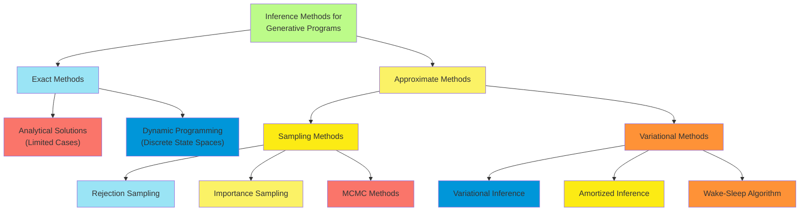

1. **Particle MCMC**:
    - Combines sequential Monte Carlo with MCMC
    - Particularly effective for state-space models
    - Handles high-dimensional state spaces efficiently
2. **Hamiltonian Monte Carlo**:
    - Uses gradient information for efficient proposals
    - Effective for continuous parameters
    - Requires differentiable generative programs
3. **Variational Inference**:
    - Approximates posterior with a simpler distribution
    - Minimizes KL divergence between approximate and true posterior
    - Often more scalable than sampling methods

```python
def variational_inference(generative_program, observations, variational_family):
    # Initialize variational parameters
    var_params = initialize_parameters(variational_family)

    # Optimization loop
    for iteration in range(max_iterations):
        # Sample from variational distribution
        samples = sample_from_variational(variational_family, var_params)

        # Compute ELBO (Evidence Lower BOund)
        elbo = compute_elbo(samples, generative_program, observations,
                            variational_family, var_params)

        # Update variational parameters to maximize ELBO
        var_params = update_parameters(var_params, elbo_gradient)

    return variational_family, var_params
```

1. Amortized Inference

    :

    - Train neural networks to predict posterior distributions
    - Upfront training cost but fast inference for new data
    - Enables real-time inference in complex models

**Specialized Inference for Program Structures:**

Different program structures benefit from specialized inference techniques:

1. **Sequential Models**:
    - Forward-backward algorithm for HMMs
    - Particle filtering for state-space models
    - Leverages Markovian structure for efficiency
2. **Hierarchical Models**:
    - Gibbs sampling with collapsed variables
    - Nested variational inference
    - Exploits conditional independence in hierarchical structure
3. **Mixture Models**:
    - Expectation-Maximization algorithm
    - Split-merge MCMC moves
    - Specialized handling of discrete mixture indicators
4. **Differentiable Programs**:
    - Gradient-based optimization
    - Automatic differentiation through program execution
    - Enables efficient parameter estimation

**Inference Compilation and Meta-Programming:**

Advanced techniques leverage compilation and meta-programming concepts:

1. **Trace-Based Inference**:
    - Analyze program execution traces
    - Optimize proposal distributions based on trace structure
    - Cache intermediate results for reuse
2. **Symbolic Inference**:
    - Analyze program structure symbolically
    - Derive specialized inference algorithms automatically
    - Optimize inference based on program analysis
3. **Program Transformations**:
    - Automatically transform programs for more efficient inference
    - Convert between equivalent representations
    - Apply algebraic simplifications to likelihood functions

**Evaluating Inference Quality:**

Several metrics assess the quality of inference results:

1. **Convergence Diagnostics**:
    - Gelman-Rubin statistic for MCMC convergence
    - Effective sample size for sampling methods
    - ELBO convergence for variational methods
2. **Posterior Predictive Checks**:
    - Generate new data from inferred parameters
    - Compare statistics with original observations
    - Assess model adequacy and inference quality
3. **Calibration Metrics**:
    - Accuracy of uncertainty quantification
    - Coverage of credible intervals
    - Calibration curves for predicted probabilities

Inference in generative programs remains an active research area, with ongoing developments in scalable algorithms,
automated inference, and specialized techniques for different model classes. The integration of modern machine learning
approaches with traditional statistical inference methods continues to expand the practical applicability of generative
probabilistic programming to increasingly complex domains.
