# C-16 | S-4: Making Complex Decisions

1. Sequential Decision Problems
    - Markov Decision Processes (MDPs)
    - Transition Models and Reward Functions
    - Utilities over Time and Discount Factors
    - Optimal Policies and State Utilities
    - Representing MDPs with Dynamic Decision Networks
2. Algorithms for MDPs
    - Value Iteration
    - Policy Iteration
    - Linear Programming Approaches
    - Online Algorithms for MDPs
    - Monte Carlo Tree Search for MDPs
3. Bandit Problems
    - The n-Armed Bandit Setting
    - The Bernoulli Bandit
    - Computing the Gittins Index
    - Exploration vs. Exploitation
    - Approximately Optimal Bandit Policies
4. Partially Observable MDPs
    - Definition of POMDPs
    - Belief States and Updates
    - Converting POMDPs to Belief-State MDPs
    - The Value of Information in POMDPs
    - Applications of POMDPs
5. Algorithms for Solving POMDPs
    - Value Iteration for POMDPs
    - Policy Loss and Convergence
    - Online Algorithms for POMDPs
    - Monte Carlo Planning for POMDPs
    - Partially Observable Monte Carlo Planning (POMCP)

#### Sequential Decision Problems

##### Markov Decision Processes (MDPs)

Sequential decision problems involve making a series of decisions over time, where each decision affects both immediate
rewards and future opportunities. Markov Decision Processes (MDPs) provide a formal framework for modeling and solving
these problems.

The fundamental characteristic of an MDP is the Markov property: the future depends only on the current state, not on
the history of how that state was reached. This property significantly simplifies the representation and solution of
sequential decision problems.

An MDP is defined by the following components:

1. **State Space (S)**: The set of all possible situations or configurations the agent might encounter. States can be
   discrete (finite or countably infinite) or continuous.
2. **Action Space (A)**: The set of possible actions the agent can take in each state. The available actions may depend
   on the current state, denoted as A(s).
3. **Transition Model (T)**: Specifies the probability of transitioning from one state to another when taking a specific
   action. Formally, T(s, a, s') = P(s' | s, a), which is the probability of reaching state s' when taking action a in
   state s.
4. **Reward Function (R)**: Defines the immediate reward received after taking action a in state s and transitioning to
   state s'. Often simplified to R(s, a) or even R(s) when the reward depends only on the state.

The agent's objective in an MDP is to find a policy π that maximizes the expected cumulative reward over time. A policy
π maps each state to an action: π(s) = a, telling the agent which action to take in each possible state.

MDPs differ from simpler decision models in several important ways:

1. **Sequential Nature**: Decisions are made repeatedly over time, not just once.
2. **State Evolution**: The state changes based on both the current state and the action taken.
3. **Delayed Consequences**: Actions affect not just immediate rewards but also future states and opportunities.
4. **Uncertainty**: Transitions between states are generally probabilistic rather than deterministic.

Example: Consider a robot navigating a grid world with some cells containing obstacles, some containing rewards, and
some containing penalties. The states are the possible positions of the robot, the actions are movements (up, down,
left, right), the transitions capture the probability of successfully moving in the intended direction (with some chance
of slipping), and the rewards correspond to the values of different positions.

MDPs can model a wide range of problems including:

- Robot navigation and control
- Resource management (inventory, portfolio optimization)
- Healthcare treatment planning
- Game playing strategies
- Maintenance and repair scheduling

The power of the MDP framework lies in its ability to handle sequential decision-making under uncertainty while
maintaining mathematical tractability through the Markov property.

##### Transition Models and Reward Functions

The transition model and reward function are central components of an MDP, defining how the environment evolves and what
outcomes the agent values.

**Transition Model**

The transition model T(s, a, s') specifies the probability of reaching state s' when the agent takes action a in state
s. This model captures the dynamics of the environment, including any uncertainty in the outcomes of actions.

Properties of the transition model:

1. **Probabilistic Nature**: For each state-action pair (s, a), T defines a probability distribution over next states.
2. **Markov Property**: The probability of transitioning to s' depends only on the current state s and action a, not on
   the history of previous states and actions.
3. **Complete Specification**: For any state s and action a, the sum of transition probabilities to all possible next
   states equals 1: ∑s' T(s, a, s') = 1.

Transition models can be represented in various ways:

- **Tabular Form**: A table listing probabilities for each (s, a, s') combination, practical for small, discrete state
  spaces.
- **Factored Form**: The state is represented as a set of variables, and the transition model specifies how each
  variable evolves, often using dynamic Bayesian networks.
- **Continuous Functions**: For continuous state spaces, transitions might be defined by probability density functions
  or stochastic differential equations.

Example: In a robot navigation problem, the transition model might specify that when the robot attempts to move north,
it successfully moves north with probability 0.8, stays in place with probability 0.1, and moves east or west with
probability 0.05 each due to control errors.

**Reward Function**

The reward function R defines the immediate reward the agent receives when taking action a in state s and transitioning
to state s'. It quantifies the desirability of different outcomes and guides the agent's behavior toward achieving its
goals.

Common forms of the reward function:

1. **State-Based**: R(s) - Reward depends only on the current state.
2. **State-Action Based**: R(s, a) - Reward depends on the current state and the action taken.
3. **State-Action-State Based**: R(s, a, s') - Reward depends on the current state, the action taken, and the resulting
   state.

Properties of reward functions:

1. **Immediate Nature**: Rewards represent immediate feedback, not long-term value.
2. **Scale and Range**: Rewards can be positive (rewards) or negative (costs or penalties) and can have any numerical
   scale.
3. **Sparsity**: In many problems, most state-action combinations yield zero reward, with non-zero rewards occurring
   only in specific situations.

Designing an effective reward function is crucial and often challenging. Issues to consider include:

1. **Reward Sparsity**: If rewards are too sparse (occur rarely), learning becomes difficult as the agent receives
   little feedback.
2. **Reward Magnitude**: The relative magnitudes of different rewards affect the agent's behavior and priorities.
3. **Reward Shaping**: Sometimes intermediate rewards are added to guide learning, though this must be done carefully to
   avoid suboptimal behavior.
4. **Alignment**: The reward function must align with the true objectives of the task to avoid unintended consequences.

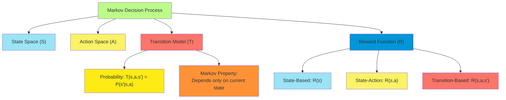

Together, the transition model and reward function define the environment within which the agent operates. The
transition model tells the agent how its actions affect the world, while the reward function tells the agent what
outcomes are desirable. Both components must be accurately specified to solve an MDP effectively.

##### Utilities over Time and Discount Factors

When making sequential decisions, an agent must consider not just immediate rewards but the cumulative rewards over
time. This requires defining how to aggregate rewards across multiple time steps to form a overall utility measure.

**Utility Models for Sequential Decisions**

Several approaches exist for defining the utility of a sequence of rewards:

1. **Finite-Horizon Undiscounted Utility**: U([r₀, r₁, ..., rₙ]) = r₀ + r₁ + ... + rₙ

    This is simply the sum of rewards over a fixed, finite number of steps. It's appropriate when the decision problem
    has a natural termination point.

2. **Infinite-Horizon Undiscounted Utility**: U([r₀, r₁, r₂, ...]) = r₀ + r₁ + r₂ + ...

    This is the sum of all rewards over an infinite sequence. Without discounting, this sum may be infinite for any
    reasonable policy, making it difficult to compare policies meaningfully.

3. **Infinite-Horizon Discounted Utility**: U([r₀, r₁, r₂, ...]) = r₀ + γr₁ + γ²r₂ + ... = Σₜ γᵗrₜ

    Where γ (gamma) is the discount factor, 0 ≤ γ < 1. This approach gives less weight to rewards received in the
    distant future.

**The Discount Factor (γ)**

The discount factor γ is a value between 0 and 1 that determines how much the agent values future rewards compared to
immediate ones. It serves several important purposes:

1. **Mathematical Convergence**: With γ < 1, the infinite sum converges to a finite value even for infinite horizons,
   allowing meaningful comparison of policies.
2. **Preference for Earlier Rewards**: Discounting captures the intuition that earlier rewards are generally more
   valuable than later ones, due to factors like:
    - Uncertainty about the future
    - Time preference (immediate gratification)
    - Opportunity costs of delayed rewards
3. **Computational Tractability**: Discounting simplifies the mathematics of solving MDPs and ensures the existence of
   stationary optimal policies.

The choice of discount factor significantly impacts the agent's behavior:

- γ close to 0: Highly myopic behavior, focused almost exclusively on immediate rewards
- γ close to 1: Far-sighted behavior, willing to sacrifice substantial immediate rewards for greater future returns

Example: Consider a robot that receives a reward of 1 for reaching a goal. With γ = 0.9, the value of reaching the goal
in 1 step is 0.9, in 2 steps is 0.81, in 10 steps is about 0.35, and in 100 steps is essentially 0.

**Average Reward Formulation**

An alternative to discounted utilities is the average reward criterion:

U([r₀, r₁, r₂, ...]) = lim(n→∞) (1/n) Σₜ₌₀ⁿ rₜ

This measures the average reward per time step over the long run. It's particularly useful for problems where the agent
operates continuously without a natural termination point, such as:

- Production systems that run indefinitely
- Continuous control tasks
- Ongoing resource management

The average reward formulation avoids the need to choose a discount factor but presents its own computational challenges
and may not distinguish between policies that differ only in their transient behavior.

**Relationship to Bellman Equations**

The utility formulation directly impacts the Bellman equations used to solve MDPs:

For discounted infinite horizon: U*(s) = max_a [R(s,a) + γ Σ_s' T(s,a,s') U*(s')]

For average reward: U*(s) = max_a [R(s,a) - ρ + Σ_s' T(s,a,s') U*(s')]

Where ρ is the average reward per time step under the optimal policy.

The choice of utility model and discount factor is an important modeling decision that should reflect the nature of the
problem and the agent's true objectives. While discounted utility with an appropriate γ is the most common formulation
due to its mathematical properties and intuitive interpretation, the right approach depends on the specific application
context.

##### Optimal Policies and State Utilities

The central problem in an MDP is finding an optimal policy—a mapping from states to actions that maximizes the agent's
expected utility over time. This section explores the relationship between policies, state utilities, and the
characterization of optimal solutions.

**Policies**

A policy π is a function that maps states to actions: π(s) = a. It tells the agent which action to take in each possible
state.

Policies can be:

1. **Deterministic**: Specifying exactly one action for each state.
2. **Stochastic**: Specifying a probability distribution over actions for each state.

Given a policy π and starting from state s, the agent will follow a trajectory of states and receive a sequence of
rewards. Due to the probabilistic nature of transitions, many different trajectories are possible, each with its own
probability.

**State Utilities Under a Policy**

The utility of a state s under policy π, denoted Uᵗ(s), is the expected sum of discounted rewards when starting in state
s and following policy π thereafter:

Uᵗ(s) = E[r₀ + γr₁ + γ²r₂ + ... | s₀ = s, π]

This can be expressed recursively as:

Uᵗ(s) = R(s,π(s)) + γ Σ_s' T(s,π(s),s') Uᵗ(s')

This recursive formulation captures the idea that the utility of a state equals the immediate reward plus the discounted
expected utility of the next state.

**Optimal Policy**

An optimal policy π\* is one that maximizes the expected utility for all states:

π*(s) = arg max_a [R(s,a) + γ Σ_s' T(s,a,s') U*(s')]

Where U\*(s) is the optimal state utility—the expected utility when following the optimal policy from state s.

**Properties of Optimal Policies**

1. **Existence**: For any MDP with bounded rewards and γ < 1, there exists at least one optimal policy.

2. **Stationary**: The optimal action depends only on the current state, not on time or history.

3. **Deterministic**: Although stochastic policies are possible, there always exists an optimal policy that is
   deterministic.

4. **Bellman Optimality**: The optimal policy satisfies the Bellman optimality equation:

    U*(s) = max_a [R(s,a) + γ Σ_s' T(s,a,s') U*(s')]

    This equation states that the utility of a state under the optimal policy equals the expected utility of taking the
    best action in that state.

**Value Functions and Q-Values**

Two important functions characterize optimal solutions:

1. **Value Function (V)**: V*(s) = U*(s), the expected utility of starting in state s and following the optimal policy.
2. **Action-Value Function (Q)**: Q*(s,a) = R(s,a) + γ Σ_s' T(s,a,s') V*(s'), the expected utility of taking action a in
   state s and then following the optimal policy.

Using Q-values, the optimal policy can be expressed simply as:

π*(s) = arg max_a Q*(s,a)

**Relationship Between Optimal Policies and Optimal Values**

There is a fundamental duality between optimal policies and optimal state utilities:

- If we know the optimal policy π*, we can compute the optimal state utilities U*.
- If we know the optimal state utilities U*, we can derive the optimal policy π*.

This relationship is the basis for value-based solution methods like value iteration and policy iteration.

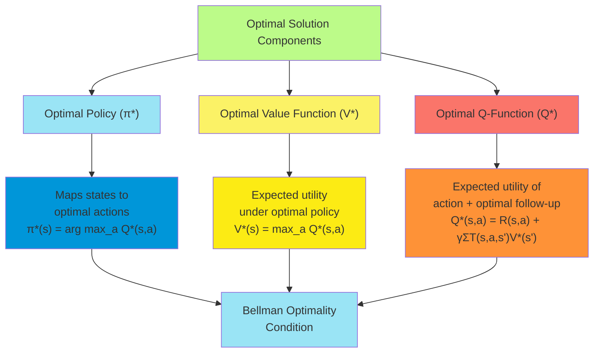

**Structure of Optimal Policies**

Optimal policies often have interpretable structure that reflects the underlying problem:

1. **Threshold Policies**: In many control problems, optimal actions change when state variables cross certain
   thresholds.
2. **Bang-Bang Control**: In some systems, optimal policies alternate between extreme actions rather than using
   intermediate values.
3. **State Aggregation**: States with similar optimal actions can be grouped together, revealing inherent structure in
   the problem.

Understanding the optimal policy and state utilities provides not just a solution for decision-making but also insights
into the structure of the problem itself. The mathematical relationship between policies and utilities forms the
foundation for algorithms that solve MDPs efficiently.

##### Representing MDPs with Dynamic Decision Networks

Dynamic Decision Networks (DDNs) provide a graphical representation of Markov Decision Processes, extending the
influence diagram framework to sequential decision problems. They offer a compact and intuitive way to visualize and
specify the structure of MDPs, particularly for complex problems with factored state spaces.

**Structure of Dynamic Decision Networks**

A Dynamic Decision Network represents an MDP through a sequence of time slices, where each slice contains:

1. **State Variables**: Random variables representing components of the state at a particular time.
2. **Action Nodes**: Decision nodes representing the agent's actions at each time step.
3. **Reward Nodes**: Utility nodes representing the immediate reward at each time step.
4. **Transition Links**: Arcs connecting variables across time slices, representing the state transition dynamics.

The network explicitly shows:

- Which state variables directly influence others
- Which state variables the reward depends on
- How actions affect state transitions
- Conditional independence relationships among state variables

**Advantages of DDN Representation**

1. **Factored State Representation**: Rather than treating the state as a monolithic entity, DDNs decompose it into
   multiple variables, each with its own dynamics.
2. **Compact Specification**: For problems with many state variables, the DDN can be exponentially more compact than
   explicit state-based representations if there are local dependencies.
3. **Structural Knowledge Exploitation**: The graphical structure makes explicit which variables directly influence
   others, allowing solution algorithms to exploit this locality.
4. **Intuitive Visualization**: The network provides a visual representation that helps in understanding and
   communicating the problem structure.

**Example: Robot Navigation DDN**

Consider a robot navigation problem where the state includes:

- Position (X, Y coordinates)
- Battery level
- Whether sensors are functioning properly

A DDN representation would show:

- How movement actions affect position variables
- How movement and sensor usage affect battery level
- How battery level affects sensor functionality
- How position and sensor status affect reward

**Formal Relationship to MDPs**

A DDN implicitly defines an MDP where:

1. **State Space**: The cross product of the domains of all state variables.
2. **Action Space**: The set of possible values for the action nodes.
3. **Transition Model**: Encoded by the conditional probability tables (CPTs) of the state variables at time t+1 given
   their parents at time t.
4. **Reward Function**: Encoded by the CPTs of the reward nodes.

The factored representation can be exponentially more compact:

- A problem with n binary state variables has 2^n distinct states
- If each variable depends on at most k other variables, the DDN needs only n·2^k parameters to specify transitions

**Solving MDPs with DDN Structure**

The DDN structure can be exploited in solution algorithms:

1. **Structured Value Iteration**: Operates on factored representations of value functions rather than enumerating all
   states.
2. **Factored Policy Iteration**: Exploits independence in policy evaluation and improvement steps.
3. **Decision-Theoretic Regression**: Backs up value functions through the structure of the DDN.
4. **Symbolic Dynamic Programming**: Uses algebraic representations of value functions and operations.

**Temporal Extension: Infinite-Horizon DDNs**

For infinite-horizon problems, the DDN uses a compact representation with:

1. A "template" time slice representing the repeating structure
2. Transition links showing how variables at time t+1 depend on variables at time t
3. The same action and reward structure at each time slice

This represents the stationarity assumption in infinite-horizon MDPs—the dynamics and rewards don't change over time.

**Practical Considerations**

When building DDN representations:

1. **Granularity**: Choose the right level of detail for state variables based on the problem requirements.
2. **Independence**: Identify and exploit conditional independence to keep the model compact.
3. **Parameterization**: Consider parameterized representations of CPTs when there are regularities in the dynamics.
4. **Time Scale**: Select an appropriate time scale for discretization of continuous-time problems.

Dynamic Decision Networks provide a powerful language for representing complex MDPs, particularly those with factored
state spaces and local dependencies. By making the structure of the problem explicit, they facilitate both human
understanding and computational efficiency in solving sequential decision problems.

#### Algorithms for MDPs

##### Value Iteration

Value Iteration is a fundamental algorithm for solving Markov Decision Processes. It iteratively computes the optimal
value function by applying the Bellman optimality equation until convergence, after which the optimal policy can be
derived directly.

**Core Principle**

Value Iteration is based on the Bellman optimality equation:

U*(s) = max_a [R(s,a) + γ Σ_s' T(s,a,s') U*(s')]

The algorithm works by starting with an arbitrary value function U₀ and repeatedly applying the Bellman update to
improve the estimate until convergence:

Uₖ₊₁(s) = max_a [R(s,a) + γ Σ_s' T(s,a,s') Uₖ(s')]

**Algorithm Steps**

1. **Initialization**: Set U₀(s) to arbitrary values for all states (often U₀(s) = 0).

2. **Iteration**: For k = 0, 1, 2, ..., compute:

    Uₖ₊₁(s) = max_a [R(s,a) + γ Σ_s' T(s,a,s') Uₖ(s')]

    for all states s.

3. **Termination**: Stop when the maximum change in utility for any state is below a threshold ε:

    max_s |Uₖ₊₁(s) - Uₖ(s)| < ε

4. **Policy Extraction**: After convergence, extract the optimal policy:

    π*(s) = arg max_a [R(s,a) + γ Σ_s' T(s,a,s') U*(s')]

**Pseudocode**

```
function VALUE-ITERATION(S, A, T, R, γ, ε) returns a policy
    inputs: S, set of states
            A, set of actions
            T, transition model T(s,a,s')
            R, reward function R(s,a)
            γ, discount factor
            ε, maximum error allowed

    initialize U(s) = 0 for all s
    repeat
        U' ← U
        δ ← 0
        for each state s do
            U(s) ← max_a [R(s,a) + γ Σ_s' T(s,a,s') U'(s')]
            δ ← max(δ, |U(s) - U'(s)|)
        if δ < ε(1-γ)/γ then
            break

    π(s) ← arg max_a [R(s,a) + γ Σ_s' T(s,a,s') U(s')] for all s
    return π
```

**Theoretical Properties**

1. **Convergence**: Value Iteration is guaranteed to converge to the optimal value function U\* for any initial values
   U₀, as long as γ < 1 (for infinite-horizon problems).
2. **Convergence Rate**: Value Iteration converges linearly, with error reducing by approximately a factor of γ in each
   iteration.
3. **Early Termination**: The algorithm can be terminated when the maximum change is less than ε(1-γ)/γ, and the
   resulting policy will be within ε of the optimal policy's value.
4. **Bellman Backup Operator**: The update can be viewed as applying the Bellman backup operator T, where T(U)(s) =
   max_a [R(s,a) + γ Σ_s' T(s,a,s') U(s')]. This operator is a contraction mapping with contraction factor γ.

**Computational Considerations**

1. **Space Complexity**: O(|S|) to store the value function.
2. **Time Complexity**: O(|S|²|A|) per iteration for explicit transition models, where |S| is the number of states and
   |A| is the number of actions.
3. **Implementation Optimizations**:
    - Prioritized sweeping: Update states in an order that focuses on those with the largest expected changes.
    - State abstraction: Group similar states together to reduce the effective state space size.
    - Asynchronous updates: Update states one at a time, always using the most recent values.

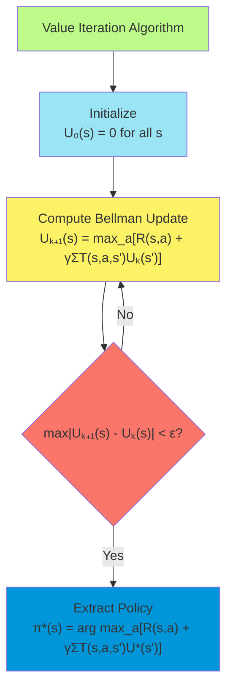

**Practical Applications**

Value Iteration is widely used for solving MDPs in various domains:

1. **Robotics**: Planning motion and actions for robots in uncertain environments.
2. **Resource Management**: Optimizing allocation of resources over time.
3. **Game Playing**: Computing optimal strategies in stochastic games.
4. **Recommendation Systems**: Sequential recommendation of items to users.

**Limitations**

Despite its theoretical guarantees, Value Iteration has limitations:

1. **Curse of Dimensionality**: Becomes impractical for large state spaces due to the exponential growth in the number
   of states with the number of state variables.
2. **Model Requirement**: Requires a complete model of transition probabilities and rewards, which may not be available
   in many real-world problems.
3. **Convergence Time**: May require many iterations to converge in problems with long planning horizons or discount
   factors close to 1.

Value Iteration is a fundamental algorithm for solving MDPs that provides a clear connection between theory and
computation. Its simplicity and guarantees make it a standard baseline for more advanced methods, while extensions and
approximations of Value Iteration form the basis for many modern reinforcement learning algorithms.

##### Policy Iteration

Policy Iteration is a powerful algorithm for solving Markov Decision Processes that alternates between policy evaluation
(computing the utility of states under the current policy) and policy improvement (updating the policy based on the
computed utilities). It often converges more quickly than Value Iteration, especially for problems where finding the
optimal policy is easier than computing the exact optimal value function.

**Core Principle**

Policy Iteration leverages the fact that for any policy π, we can compute its exact value function Uᵗ, and then derive a
potentially better policy π' by acting greedily with respect to Uᵗ. By alternating between these steps, the algorithm
converges to the optimal policy in a finite number of iterations for finite state and action spaces.

**Algorithm Steps**

1. **Initialization**: Start with an arbitrary policy π₀.

2. **Policy Evaluation**: Compute the utility of each state under the current policy πₖ by solving the linear system of
   equations:

    Uᵗᵏ(s) = R(s,πₖ(s)) + γ Σ_s' T(s,πₖ(s),s') Uᵗᵏ(s')

    for all states s.

3. **Policy Improvement**: Derive a new policy πₖ₊₁ by acting greedily with respect to Uᵗᵏ:

    πₖ₊₁(s) = arg max_a [R(s,a) + γ Σ_s' T(s,a,s') Uᵗᵏ(s')]

    for all states s.

4. **Termination**: If πₖ₊₁ = πₖ (the policy is unchanged), then terminate and return πₖ as the optimal policy.

**Pseudocode**

```
function POLICY-ITERATION(S, A, T, R, γ) returns a policy
    inputs: S, set of states
            A, set of actions
            T, transition model T(s,a,s')
            R, reward function R(s,a)
            γ, discount factor

    initialize π(s) arbitrarily for all s
    repeat
        # Policy Evaluation
        solve the linear equations:
        U(s) = R(s,π(s)) + γ Σ_s' T(s,π(s),s') U(s') for all s

        # Policy Improvement
        unchanged ← true
        for each state s do
            a' ← arg max_a [R(s,a) + γ Σ_s' T(s,a,s') U(s')]
            if a' ≠ π(s) then
                π(s) ← a'
                unchanged ← false

        if unchanged then
            return π
```

**Policy Evaluation Methods**

The policy evaluation step can be implemented in several ways:

1. **Direct Matrix Solution**: For small problems, solve the system of linear equations directly:

    (I - γPᵗ)U = Rᵗ

    where Pᵗ is the transition matrix under policy π and Rᵗ is the reward vector.

2. **Iterative Methods**: For larger problems, use iterative approaches:

    a) **Value Iteration-like Updates**:

    Repeat until convergence: Uₖ₊₁(s) = R(s,π(s)) + γ Σ_s' T(s,π(s),s') Uₖ(s')

    b) **Jacobi Method**: Update all states based on previous values.

    c) **Gauss-Seidel Method**: Update states in sequence, using the most recent values.

3. **Approximate Methods**: For very large state spaces, use function approximation to represent the value function.

**Theoretical Properties**

1. **Monotonic Improvement**: Each policy πₖ₊₁ is guaranteed to be at least as good as πₖ (and strictly better unless πₖ
   is already optimal).
2. **Finite Convergence**: For finite state and action spaces, Policy Iteration converges to the optimal policy in a
   finite number of iterations—at most |S|^|A| iterations in the worst case, but typically much fewer in practice.
3. **Optimality Guarantee**: The algorithm converges to the optimal policy for discounted infinite-horizon MDPs.

**Modified Policy Iteration**

A practical variant called Modified Policy Iteration combines elements of both Policy Iteration and Value Iteration:

1. Instead of computing the exact value function in the policy evaluation step, perform only a limited number of
   approximate iterations.
2. This reduces the computational cost per policy improvement step while preserving the overall convergence properties.
3. The algorithm interpolates between Value Iteration (when performing just one approximate evaluation iteration) and
   full Policy Iteration (when evaluating to convergence).

**Computational Considerations**

1. **Space Complexity**: O(|S|) to store the value function and policy.
2. **Time Complexity**:
    - Policy Evaluation: O(|S|³) for direct solution of linear equations, or O(|S|²) per iteration for iterative
      methods.
    - Policy Improvement: O(|S|²|A|) to consider all actions for all states.
    - Overall: O(|S|³ × number of policy changes).
3. **Comparison to Value Iteration**:
    - Policy Iteration often requires fewer iterations to converge.
    - Each iteration of Policy Iteration is generally more expensive due to the policy evaluation step.
    - Policy Iteration can be more efficient for problems where the optimal policy is easier to find than the exact
      optimal value function.

I'll continue with the Policy Iteration section and complete the notes.

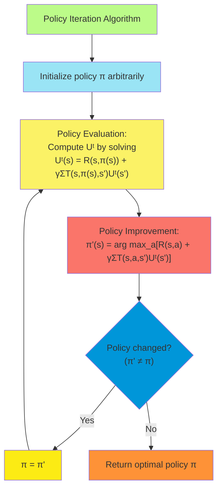

**Practical Applications**

Policy Iteration is widely used in various domains:

1. **Economic Models**: Determining optimal investment strategies and resource allocation policies.
2. **Network Routing**: Computing optimal packet forwarding policies in communication networks.
3. **Healthcare**: Developing treatment policies for chronic diseases.
4. **Maintenance Scheduling**: Determining optimal equipment inspection and repair policies.

**Limitations**

Despite its strengths, Policy Iteration has limitations:

1. **Computational Cost**: The exact policy evaluation step can be expensive for large state spaces.
2. **Model Requirement**: Like Value Iteration, it requires a complete model of transition probabilities and rewards.
3. **State Space Size**: Becomes impractical for very large state spaces without function approximation.

Policy Iteration represents a powerful approach to solving MDPs by focusing on policies rather than value functions
directly. Its guarantee of finite convergence and often faster practical performance make it a valuable alternative to
Value Iteration, particularly for problems where good policies are easier to find than precise value functions.

##### Linear Programming Approaches

Linear Programming (LP) provides an alternative approach to solving Markov Decision Processes by formulating the problem
as a constrained optimization problem. This approach has theoretical and practical advantages in certain settings,
particularly for finding exact solutions and handling specific constraints.

**Linear Programming Formulation**

The optimal value function for an MDP can be characterized as the solution to the following linear program:

Minimize: Σs α(s)U(s)

Subject to: U(s) ≥ R(s,a) + γ Σs' T(s,a,s')U(s') for all states s and actions a

Where α(s) > 0 are positive weights that can be interpreted as the probability of starting in each state s.

The constraints enforce the Bellman optimality equation as inequalities, and the objective function minimizes a weighted
sum of the state utilities. The solution to this LP gives the optimal value function U*, from which the optimal policy
π* can be derived.

**Theoretical Foundations**

The LP formulation has strong theoretical foundations:

1. **Equivalence**: The solution to the LP gives exactly the optimal value function for the MDP.
2. **Constraint Interpretation**: Each constraint U(s) ≥ R(s,a) + γ Σs' T(s,a,s')U(s') ensures that the utility of state
   s is at least as great as the utility of taking action a in s and then following the optimal policy.
3. **Minimization Objective**: The minimization forces the constraints to be tight for at least one action in each
   state—specifically, the optimal action.
4. **Weight Choice**: While any positive weights α(s) will yield the correct U\*, the choice can affect computational
   efficiency. Common choices include uniform weights or steady-state probabilities.

**Solving the LP Problem**

Several methods can solve the LP formulation:

1. **Simplex Method**: The classical approach to solving LPs, which moves along vertices of the constraint polytope.
2. **Interior Point Methods**: More modern approaches that traverse the interior of the feasible region.
3. **Specialized MDP Solvers**: Algorithms tailored to the specific structure of the MDP LP formulation.

**Dual Formulation**

The dual of the MDP linear program has an interesting interpretation:

Maximize: Σs,a x(s,a)R(s,a)

Subject to:

- Σa x(s,a) - γ Σs',a T(s',a,s)x(s',a) = α(s) for all states s
- x(s,a) ≥ 0 for all states s and actions a

Where x(s,a) can be interpreted as the expected discounted number of times action a is taken in state s, starting with
distribution α.

The dual formulation is often more efficient to solve when the number of states is much larger than the number of
actions.

**Advantages of the LP Approach**

1. **Exact Solution**: LP provides an exact solution without iterative approximation.
2. **Efficient Algorithms**: Modern LP solvers are highly optimized and can efficiently handle large problems.
3. **Constraint Handling**: The LP framework naturally accommodates additional constraints on the policy or value
   function.
4. **Alternative Objective Functions**: Can be adapted to optimize different criteria beyond expected discounted reward.
5. **Sensitivity Analysis**: LP solvers provide sensitivity information about how the solution would change with small
   changes in the problem parameters.

**Extensions and Variations**

Several extensions to the basic LP formulation have been developed:

1. **Constrained MDPs**: Adding constraints on expected cumulative rewards of different types:

    Σs,a x(s,a)Rk(s,a) ≥ Ck for multiple constraint types k

2. **Average Reward Formulation**: Adapting the LP for the average reward criterion instead of discounted rewards.

3. **Factored LP Formulations**: Exploiting factored MDP structure to create more compact LP representations.

4. **Approximate LP**: For large state spaces, using function approximation to create a tractable approximate LP.

**Computational Considerations**

1. **Scaling**: The basic LP formulation has |S| variables and |S|×|A| constraints, which can be large for complex
   problems.
2. **Sparsity**: Transition matrices are often sparse, which LP solvers can exploit for efficiency.
3. **Numerical Stability**: LP solvers have sophisticated numerical methods to maintain stability even for problems with
   widely varying coefficients.

**Comparing LP to Value and Policy Iteration**

LP vs. Value Iteration:

- LP finds the exact solution directly, while Value Iteration converges asymptotically
- LP can be faster when high precision is required
- Value Iteration is often simpler to implement and more memory-efficient

LP vs. Policy Iteration:

- Both provide exact solutions
- LP doesn't require explicit policy evaluation steps
- Policy Iteration can be more efficient for problems with many more states than actions

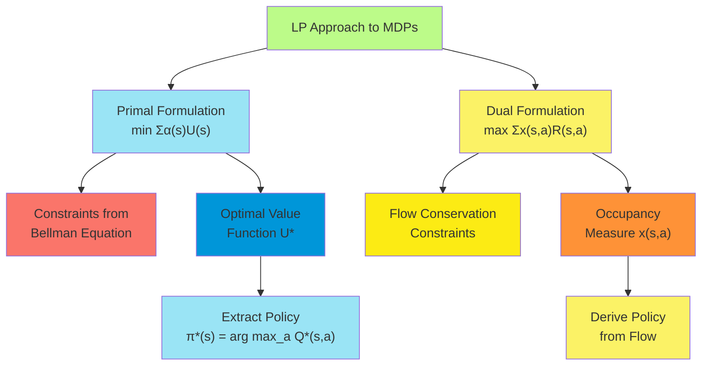

**Applications of LP for MDPs**

LP approaches are particularly valuable in:

1. **Resource Allocation**: Problems with explicit resource constraints.
2. **Risk-Sensitive Control**: Optimizing criteria beyond expected value.
3. **Network Design**: Problems with flow conservation constraints.
4. **Multi-Objective MDPs**: Balancing multiple competing objectives.

Linear Programming provides a powerful and flexible approach to solving MDPs, especially when exact solutions are
required or when the problem includes additional constraints beyond the basic MDP formulation. While it may not always
be the most efficient solution method for standard MDPs, its ability to handle extensions and provide sensitivity
information makes it an important tool in the MDP solving toolkit.

##### Online Algorithms for MDPs

Online algorithms for MDPs make decisions in real-time without precomputing a complete policy for all possible states.
These methods are particularly valuable when the state space is too large for offline computation, when the model
parameters are uncertain, or when computational resources are limited.

**Key Characteristics of Online MDP Algorithms**

1. **Real-time Decision Making**: Compute actions only for the current state, not the entire state space.
2. **Limited Horizon Planning**: Consider only a limited number of steps into the future.
3. **Computational Efficiency**: Produce good actions with bounded computation time.
4. **Adaptation**: Can adapt to changing environments or refine models based on experience.

**Types of Online Algorithms**

Several approaches to online MDP solving exist:

1. **Heuristic Search**

Heuristic search algorithms selectively explore the state space from the current state:

- **Real-time Dynamic Programming (RTDP)**:
    - Updates value estimates only for states encountered during actual or simulated trajectories
    - Focuses computation on relevant parts of the state space
    - Maintains a value function that converges to optimal in the limit
- **LAO\*** (an extension of the A\* search algorithm to MDPs):
    - Incorporates heuristic guidance to focus search on promising paths
    - Expands the search graph incrementally
    - Particularly effective for problems with well-defined goal states

1. **Forward Search**

Forward search algorithms explore the consequences of actions from the current state:

- **Sparse Sampling**:
    - Samples a small number of next states for each action
    - Builds a shallow search tree to estimate action values
    - Provides statistical guarantees with sufficient samples
- **Forward Search Sparse Sampling (FSSS)**:
    - Improves efficiency by adaptively focusing sampling on more promising paths
    - Uses upper and lower bounds to prune the search tree
    - Balances exploration and exploitation during tree expansion

1. **Simulation-Based Methods**

These methods use repeated simulations to estimate action values:

- **Monte Carlo Tree Search (MCTS)**:
    - Builds a search tree incrementally through simulation
    - Balances exploration and exploitation using techniques like UCB (Upper Confidence Bound)
    - Popularized by success in games like Go, chess, and poker
- **Sparse UCT (Upper Confidence Trees)**:
    - Combines the UCB exploration strategy with sparse sampling
    - Asymptotically optimal as the number of simulations increases
    - Works well for problems with large branching factors

**The General Online Planning Framework**

Most online algorithms follow this general approach:

1. **Initial State**: Start with the current state s.
2. **Expansion**: Build a limited lookahead tree or graph from s.
3. **Evaluation**: Estimate the value of leaf nodes using a heuristic or rollout policy.
4. **Backup**: Propagate values up the tree to the root (current state).
5. **Action Selection**: Choose the action with the highest estimated value.
6. **Execution**: Execute the chosen action, observe the next state, and repeat.

**Online Modifications of Value Iteration and Policy Iteration**

Classic algorithms can be adapted for online use:

- **Real-time Value Iteration**:
    - Perform a limited number of Bellman updates focused around the current state
    - Update values in reverse order of visitation along simulated trajectories
    - Use the updated value function to select actions
- **Limited Lookahead Policy Iteration**:
    - Perform policy evaluation and improvement only for states reachable within a limited horizon
    - Extend the horizon based on available computation time
    - Return to full policy iteration when more computation is available

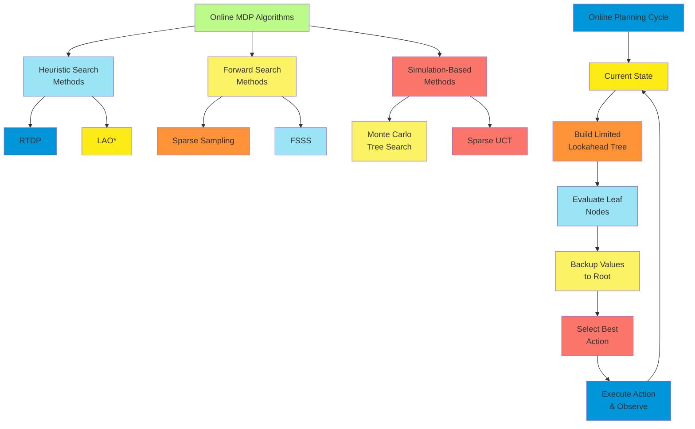

**Theoretical Guarantees**

Online algorithms offer various theoretical guarantees:

1. **Performance Bounds**: Many algorithms provide bounds on the suboptimality of the selected actions.
2. **Anytime Properties**: Generate increasingly better solutions with more computation time.
3. **PAC (Probably Approximately Correct) Guarantees**: Provide actions that are ε-optimal with high probability.
4. **Asymptotic Optimality**: Converge to optimal solutions in the limit of infinite computation.

**Balancing Computation and Action Quality**

A key challenge in online algorithms is the meta-decision of how much computation to perform before acting:

1. **Fixed Computation Budget**: Allocate a predetermined amount of computation per decision.
2. **Adaptive Computation**: Compute until a desired confidence level in action quality is reached.
3. **Meta-Reasoning**: Explicitly reason about the value of additional computation versus acting now.
4. **Real-time Constraints**: Ensure decisions are made within hard or soft time limits.

**Applications of Online MDP Algorithms**

Online algorithms are particularly valuable in:

1. **Robotics**: Making decisions in complex, uncertain environments with real-time constraints.
2. **Game Playing**: Selecting moves in games with large state spaces like Go, chess, and poker.
3. **Autonomous Vehicles**: Navigating in dynamic traffic environments.
4. **Healthcare**: Adapting treatment plans based on patient responses.
5. **Resource Management**: Allocating resources adaptively based on current conditions.

**Considerations for Implementation**

When implementing online MDP algorithms:

1. **State Representation**: Use efficient data structures for state representation and lookup.
2. **Generative Model**: Implement an efficient simulator for sampling next states and rewards.
3. **Heuristic Design**: Develop informative heuristics to guide the search effectively.
4. **Computational Efficiency**: Optimize the most frequently executed operations.
5. **Evaluation Metrics**: Monitor not just decision quality but also computational demands.

Online algorithms for MDPs represent a practical approach to sequential decision-making in complex environments, trading
off comprehensive optimality for computational efficiency and flexibility. Their success in domains like game playing
and robotics demonstrates their effectiveness in real-world applications.

##### Monte Carlo Tree Search for MDPs

Monte Carlo Tree Search (MCTS) is a powerful online planning algorithm for solving MDPs that combines tree search with
random sampling. It has achieved remarkable success in domains with large state spaces and complex dynamics, most
notably in games like Go and chess.

**Core Principles**

MCTS incrementally builds a search tree through repeated simulations, focusing computational resources on promising
areas of the search space. It effectively balances exploration of uncertain actions with exploitation of known good
actions, leading to increasingly better decision-making with more computation time.

The key insight of MCTS is that accurate value estimates for a state can be obtained by averaging the outcomes of many
simulations starting from that state, without requiring a complete model of the environment.

**The MCTS Algorithm**

MCTS operates through four main phases, repeated for many iterations:

1. **Selection**: Starting from the root node (current state), traverse the existing tree by selecting actions according
   to a tree policy until reaching a leaf node.
2. **Expansion**: Unless the leaf node represents a terminal state, expand the tree by adding one or more child nodes
   representing possible next states.
3. **Simulation**: From the newly added node, perform a random simulation (rollout) to a terminal state or a fixed depth
   using a default policy.
4. **Backpropagation**: Update the statistics (value estimates and visit counts) for all nodes along the path from the
   expanded node back to the root.

After many iterations, the algorithm selects the action at the root with the highest estimated value or visit count.

**UCT (Upper Confidence Bounds for Trees)**

The most popular variant of MCTS is UCT, which uses the UCB1 (Upper Confidence Bound) formula to balance exploration and
exploitation during the selection phase:

UCT selects the action a at state s that maximizes:

Q(s,a) + c × √(ln(N(s)) / N(s,a))

Where:

- Q(s,a) is the estimated value of taking action a in state s
- N(s) is the number of times state s has been visited
- N(s,a) is the number of times action a has been taken in state s
- c is an exploration parameter that controls the trade-off between exploration and exploitation

**Pseudocode**

```
function MCTS(s₀) returns an action
    create root node v₀ with state s₀
    while computational budget not exhausted do
        v_l ← TREE-POLICY(v₀)
        Δ ← DEFAULT-POLICY(STATE(v_l))
        BACKUP(v_l, Δ)
    return arg max_a N(v₀,a)  // return action with highest visit count

function TREE-POLICY(v) returns a node
    while v is not a terminal node do
        if v not fully expanded then
            return EXPAND(v)
        else
            v ← BEST-CHILD(v, c_explore)
    return v

function EXPAND(v) returns a node
    a ← an untried action from A(STATE(v))
    s' ← SAMPLE-NEXT-STATE(STATE(v), a)
    add a new child v' to v with STATE(v') = s' and ACTION(v') = a
    return v'

function BEST-CHILD(v, c) returns a node
    return arg max_{v' ∈ children of v} [Q(v')/N(v') + c×√(2×ln(N(v))/N(v'))]

function DEFAULT-POLICY(s) returns a reward
    while s is not a terminal state and depth limit not reached do
        a ← SELECT-RANDOM-ACTION(A(s))
        s ← SAMPLE-NEXT-STATE(s, a)
    return EVALUATE(s)

function BACKUP(v, Δ) returns nothing
    while v is not null do
        N(v) ← N(v) + 1
        Q(v) ← Q(v) + (Δ - Q(v))/N(v)
        v ← PARENT(v)
```

**Adaptations for MDPs**

While MCTS was originally developed for deterministic games, several adaptations make it effective for MDPs:

1. **Handling Stochasticity**:
    - Sample multiple transitions for the same action to better estimate expected outcomes
    - Use double progressive widening to limit branching in continuous or highly stochastic environments
2. **Reward Discounting**:
    - Incorporate the discount factor γ when calculating cumulative rewards in simulations
    - Apply discount-aware backup rules to correctly value delayed rewards
3. **Value Function Approximation**:
    - Replace random rollouts with learned value function approximators
    - Use neural networks or other function approximators to guide tree expansion
4. **State Abstractions**:
    - Group similar states together to reduce the effective size of the state space
    - Use domain-specific features to measure state similarity

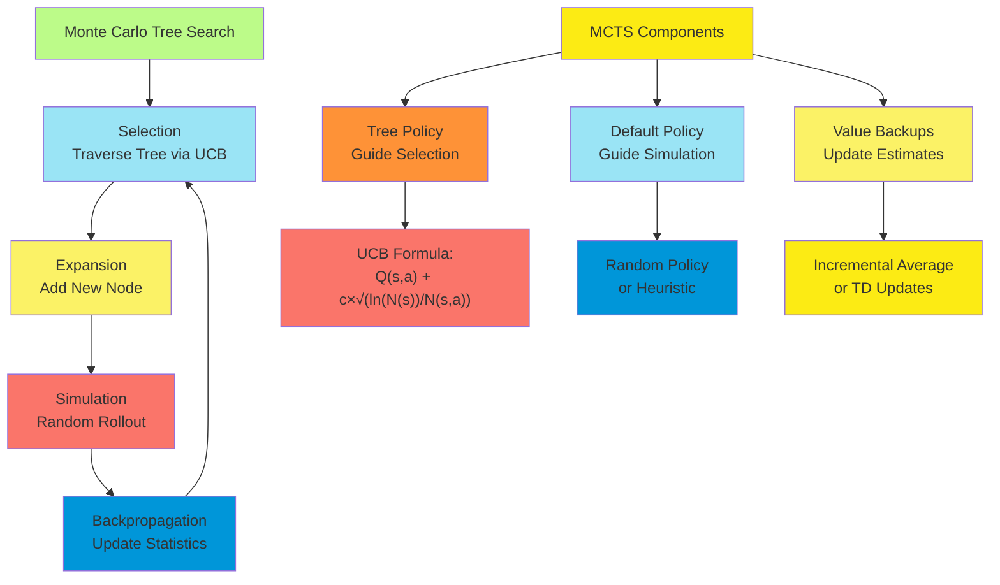

**Theoretical Properties**

MCTS/UCT offers several theoretical guarantees:

1. **Asymptotic Optimality**: UCT converges to the optimal solution given enough time and memory.
2. **Regret Bounds**: The regret (difference between optimal and actual rewards) of UCT grows logarithmically with the
   number of simulations.
3. **Anytime Behavior**: MCTS can return a decision at any time, with solution quality improving with more computation.
4. **Partial Observability**: Can be extended to partially observable MDPs (POMDPs) through belief state
   representations.

**Advanced MCTS Enhancements**

Several enhancements improve MCTS performance:

1. **Rapid Action Value Estimation (RAVE)**:
    - Uses the All-Moves-As-First (AMAF) heuristic to share information between related states
    - Particularly effective in games where the value of an action is somewhat position-independent
2. **Predictor-MCTS**:
    - Incorporates a learned model to predict action outcomes
    - Focuses simulation on more promising trajectories
3. **Information Set MCTS**:
    - Extends MCTS to imperfect information problems
    - Samples determinizations of the unknown information
4. **Hierarchical MCTS**:
    - Uses multiple levels of abstraction
    - Plans at different time scales simultaneously

**Applications of MCTS to MDPs**

MCTS has been successfully applied to various MDP domains:

1. **Game Playing**: Chess, Go, poker, and other games with large state spaces.
2. **Robotics**: Motion planning in continuous spaces with complex dynamics.
3. **Scheduling and Resource Allocation**: Optimizing resource usage over time with uncertainties.
4. **Healthcare**: Treatment planning with uncertain patient responses.
5. **Autonomous Driving**: Navigating complex traffic scenarios with multiple agents.

**Practical Implementation Considerations**

When implementing MCTS for MDPs:

1. **Simulation Efficiency**: The performance of MCTS depends critically on running many simulations, so optimizing
   simulation speed is crucial.
2. **Exploration Parameter Tuning**: The value of c in the UCB formula significantly affects performance and may need
   domain-specific tuning.
3. **Early Termination**: Strategies for terminating simulations before reaching terminal states can improve efficiency.
4. **Parallelization**: MCTS can be effectively parallelized to leverage multiple cores or distributed computing.
5. **Memory Management**: For large state spaces, efficient node representation and garbage collection become important.

MCTS represents one of the most significant advances in planning algorithms for MDPs in recent years, combining the
strengths of tree search, Monte Carlo sampling, and bandit algorithms into a powerful and flexible approach suitable for
complex sequential decision problems.

#### Bandit Problems

##### The n-Armed Bandit Setting

The n-armed bandit problem is a foundational model in sequential decision-making under uncertainty, capturing the
fundamental exploration-exploitation tradeoff. It provides a simplified setting compared to full MDPs while still
presenting a core challenge in decision theory and reinforcement learning.

**Problem Definition**

In the n-armed bandit problem:

1. An agent faces n different actions (or "arms," by analogy with slot machines).
2. Each arm i, when pulled, yields a reward drawn from a probability distribution specific to that arm.
3. The reward distributions are initially unknown to the agent.
4. The agent's goal is to maximize its cumulative reward over some time horizon.

Unlike full MDPs, bandit problems have no state transitions—the underlying environment remains stationary, and actions
don't affect future states. The only effect of an action is the immediate reward it produces.

**Formal Framework**

Mathematically, an n-armed bandit problem consists of:

1. A set of arms/actions A = {1, 2, ..., n}
2. A set of reward distributions {R₁, R₂, ..., Rₙ}, where Rᵢ is the distribution of rewards for arm i
3. At each time step t:
    - The agent selects an arm aₜ ∈ A
    - The environment generates a reward rₜ ~ Rₐₜ
    - The agent updates its knowledge based on the observed reward

The agent's objective is to maximize the expected sum of rewards over T time steps: E[∑ᵗ⁼¹ᵀ rₜ]

Alternatively, the objective can be framed as minimizing regret—the difference between the reward the agent could have
obtained by always pulling the optimal arm and the reward it actually obtained: Regret = T·μ\* - E[∑ᵗ⁼¹ᵀ rₜ]

Where μ\* is the expected reward of the optimal arm.

**Key Challenges**

The fundamental challenge in bandit problems is the exploration-exploitation tradeoff:

1. **Exploration**: Trying different arms to gather information about their reward distributions.
2. **Exploitation**: Selecting the arm that currently appears best based on observed rewards.

Too much exploration wastes opportunities for high rewards, while too much exploitation may lead to suboptimal choices
if better arms haven't been adequately explored.

**Types of Bandit Problems**

Several variations of the basic bandit problem exist:

1. **Stochastic Bandits**: The reward for each arm follows a fixed (but unknown) probability distribution.
2. **Adversarial Bandits**: The rewards are chosen by an adversary, potentially in response to the agent's actions.
3. **Contextual Bandits**: Before each action, the agent observes a context vector that provides information about the
   current reward distributions.
4. **Non-stationary Bandits**: The reward distributions change over time.
5. **Continuous-armed Bandits**: The set of arms is infinite, such as when selecting a real-valued parameter.

**Relationship to MDPs**

The bandit problem can be viewed as a special case of an MDP where:

- There is only one state (or the state doesn't change)
- Actions yield immediate rewards but don't affect future states
- The goal is to maximize cumulative reward, not just find a single best action

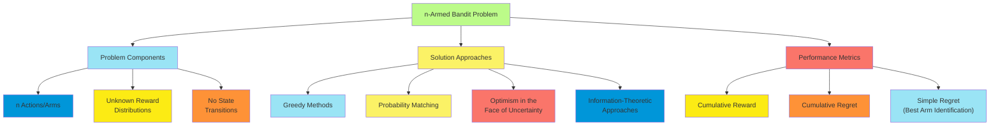

**Solution Approaches**

Several approaches have been developed for bandit problems:

1. **ε-greedy**: With probability ε, explore by selecting a random arm; with probability 1-ε, exploit by selecting the
   arm with the highest estimated mean reward.
2. **Softmax/Boltzmann Exploration**: Select arms with probability proportional to their exponentially weighted
   estimated values: P(a) ∝ exp(Q(a)/τ) where τ is a temperature parameter controlling exploration.
3. **Upper Confidence Bound (UCB)**: Select the arm that maximizes an upper bound on potential performance: UCB₁: aₜ =
   arg max_i [Q̂ᵢ + c·√(log(t)/Nᵢ)] where Q̂ᵢ is the estimated value of arm i, Nᵢ is the number of times arm i was
   selected, and c is an exploration parameter.
4. **Thompson Sampling**: Maintain a probability distribution over the possible values of each arm, and sample from
   these distributions to make decisions.
5. **Gittins Indices**: For specific bandit problems, calculate indices that encapsulate the long-term value of
   selecting each arm.

**Applications of Bandit Algorithms**

Bandit algorithms are widely applied in scenarios where exploration-exploitation tradeoffs arise:

1. **Online Advertising**: Selecting which ads to show to maximize click-through rates.
2. **Clinical Trials**: Allocating patients to treatments to maximize effectiveness while gathering information.
3. **Recommendation Systems**: Suggesting content to users based on their preferences.
4. **Network Routing**: Selecting communication paths with low congestion.
5. **Hyperparameter Optimization**: Tuning algorithm parameters to maximize performance.

The n-armed bandit setting provides a clean theoretical framework for understanding and addressing the
exploration-exploitation dilemma, with practical applications in numerous domains where decisions must be made with
limited information and feedback.

##### The Bernoulli Bandit

The Bernoulli bandit is a specialized version of the n-armed bandit problem where each arm yields binary
rewards—typically 0 or 1—according to a Bernoulli distribution. This model is particularly important due to its
simplicity, mathematical tractability, and direct applicability to many real-world scenarios.

**Mathematical Formulation**

In a Bernoulli bandit:

1. Each arm i has an unknown success probability μᵢ ∈ [0, 1]
2. When arm i is pulled, it yields a reward of 1 with probability μᵢ and 0 with probability 1-μᵢ
3. The rewards are independent across arms and time steps
4. The agent's goal is to maximize the expected number of successes (rewards of 1)

The optimal policy would always select the arm with the highest success probability μ\*, but this information is not
known in advance and must be learned through experience.

**Bayesian Model for Bernoulli Bandits**

A Bayesian approach to Bernoulli bandits maintains a probability distribution over the possible values of each arm's
success probability:

1. **Prior Distribution**: For each arm i, maintain a Beta distribution Beta(αᵢ, βᵢ) representing beliefs about μᵢ
    - Initially, these might be uniform priors: Beta(1, 1)
    - αᵢ represents the (prior) number of successes + 1
    - βᵢ represents the (prior) number of failures + 1
2. **Posterior Update**: After pulling arm i and observing reward r (0 or 1):

    - If r = 1 (success): αᵢ ← αᵢ + 1
    - If r = 0 (failure): βᵢ ← βᵢ + 1
    - The posterior distribution becomes Beta(αᵢ, βᵢ)

3. **Decision Making**: Use the current distributions to select arms based on criteria such as:

    - Expected value: $E[\mu_i] = \alpha_i/(\alpha_i+\beta_i)$

    - Upper confidence bound: Using a high quantile of the Beta distribution

    - Thompson sampling: Drawing a random sample from each arm's Beta distribution and selecting the arm with the
      highest sampled value

The Beta distribution is the conjugate prior for the Bernoulli distribution, making Bayesian updates particularly
elegant. The mean of the Beta distribution, $\alpha_i/(\alpha_i+\beta_i)$, represents the expected success probability
based on observed data, while the variance, $\alpha_i\beta_i/((\alpha_i+\beta_i)^2(\alpha_i+\beta_i+1))$, captures the
uncertainty about this estimate.

**Frequentist Approaches for Bernoulli Bandits**

From a frequentist perspective, several approaches are widely used:

1. **UCB1 Algorithm**: Select the arm that maximizes:

    $\hat{\mu}_i + \sqrt{\frac{2\ln{t}}{n_i}}$

    Where $\hat{\mu}_i$ is the empirical mean reward for arm $i$, $n_i$ is the number of times arm $i$ has been pulled,
    and $t$ is the total number of pulls so far.

2. **KL-UCB**: An improvement on UCB1 that uses Kullback-Leibler divergence to create tighter confidence bounds for
   Bernoulli distributions:

    $\text{arg}\max_i \sup{\mu : d(\hat{\mu}_i, \mu) \leq \frac{\ln{t} + c\ln{\ln{t}}}{n_i}}$

    Where $d(p,q)$ is the KL-divergence between Bernoulli distributions with parameters $p$ and $q$.

**Theoretical Analysis of Bernoulli Bandits**

For Bernoulli bandits, theoretical analysis often focuses on:

1. **Regret Bounds**: The expected regret after $T$ rounds is bounded by:

    $R(T) \leq C\sum_{i: \mu_i < \mu^*} \frac{\ln{T}}{\Delta_i}$

    Where $\Delta_i = \mu^* - \mu_i$ is the suboptimality gap, and $C$ is a constant depending on the algorithm.

2. **Instance-Dependent vs. Instance-Independent Bounds**:

    - Instance-dependent bounds depend on the specific $\Delta_i$ values
    - Instance-independent bounds apply universally, typically scaling as $O(\sqrt{nT})$

3. **Lower Bounds**: Lai and Robbins established that any algorithm with sublinear regret must pull each suboptimal arm
   at least $\Omega(\ln{T}/\Delta_i)$ times in expectation.

**Applications of Bernoulli Bandits**

Bernoulli bandits model many real-world scenarios with binary outcomes:

1. **Clinical trials**: Testing whether treatments succeed or fail
2. **Ad placement**: Modeling whether users click or don't click
3. **Website A/B testing**: Comparing conversion rates between versions
4. **Quality control**: Testing whether items pass or fail inspection
5. **Network routing**: Modeling packet delivery success or failure

The Bernoulli bandit, despite its simplicity, captures the essential challenge of learning from binary feedback while
balancing exploration and exploitation, making it both theoretically insightful and practically valuable.

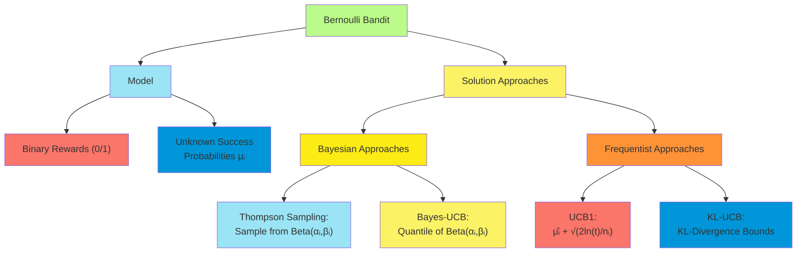

##### Computing the Gittins Index

The Gittins index provides an optimal solution to a class of bandit problems under specific conditions. It transforms
the complex exploration-exploitation problem into a simpler form where the optimal decision is to always select the arm
with the highest index value. Named after John Gittins who developed it in the 1970s, this approach separates the
problem's complexity from the decision rule's simplicity.

**Definition and Principle**

The Gittins index for an arm represents the "fair charge" or opportunity cost that would make an agent indifferent
between:

1. Pulling that arm exclusively and receiving its rewards (minus the charge)
2. Moving to an alternative opportunity

Formally, the Gittins index $v(\mathbf{s})$ for an arm in state $\mathbf{s}$ is defined as:

$v(\mathbf{s}) = \sup_{\tau > 0} \frac{E[\sum_{t=0}^{\tau-1} \gamma^t R_t | \mathbf{s}*0 = \mathbf{s}]}{E[\sum*{t=0}^{\tau-1} \gamma^t | \mathbf{s}_0 = \mathbf{s}]}$

Where:

- $\tau$ is a stopping time (when to stop pulling this arm)
- $\gamma$ is the discount factor
- $R_t$ is the reward at time $t$
- $\mathbf{s}_0$ is the initial state

**Conditions for Optimality**

The Gittins index policy is optimal under the following conditions:

1. Arms are independent (pulling one arm doesn't affect the state of others)
2. Only one arm can be pulled at each time step
3. The problem has an infinite horizon with geometric discounting
4. The state of non-pulled arms remains frozen

Under these conditions, the Gittins index theorem states that the optimal policy is to always select the arm with the
highest Gittins index.

**Computation Methods**

Computing the Gittins index exactly is challenging. Several approaches have been developed:

1. **Dynamic Programming**:
    - Formulate the problem as an optimal stopping problem
    - Use backward induction to compute the value for different stopping times
    - The computational complexity grows with the size of the state space
2. **Calibration Method**:
    - Compare the arm to a standard bandit with known index
    - Find the reward level that makes the decision-maker indifferent
    - More efficient for specific families of reward distributions
3. **Approximation Methods**:
    - Closed-form approximations for specific distributions
    - For Bernoulli bandits with Beta priors, approximations include:
      $v(\alpha, \beta) \approx \frac{\alpha}{\alpha+\beta} + \kappa \sqrt{\frac{\alpha\beta}{(\alpha+\beta)^2(\alpha+\beta+1)}}$
      where $\kappa$ depends on the discount factor
4. **Simulation-Based Methods**:
    - Monte Carlo simulation to estimate the expected rewards
    - Restart algorithms that approximate the index by simulating different stopping times

**Gittins Index for Common Bandit Models**

1. **Bernoulli Bandit with Beta Prior**:
    - State represented by parameters $(\alpha, \beta)$ of Beta distribution
    - Index depends on both expected value $\frac{\alpha}{\alpha+\beta}$ and uncertainty
    - Higher indices for arms with same mean but higher variance (more potential upside)
2. **Normal Distribution with Unknown Mean**:
    - State represented by current estimate of mean and precision
    - Index increases with mean and uncertainty about the mean
    - Closed-form approximations exist for specific prior distributions
3. **Exponential Family Models**:
    - Gittins indices for rewards from exponential family distributions
    - Computations exploit sufficient statistics and conjugate priors

**Practical Implementation and Tables**

Due to computational complexity, pre-computed tables of Gittins indices are often used:

1. For discrete state spaces, indices can be computed offline and stored
2. For continuous state spaces, function approximation or interpolation techniques can be used
3. The tables depend on the discount factor and distribution family
4. Modern approaches use numerical optimization to compute indices efficiently

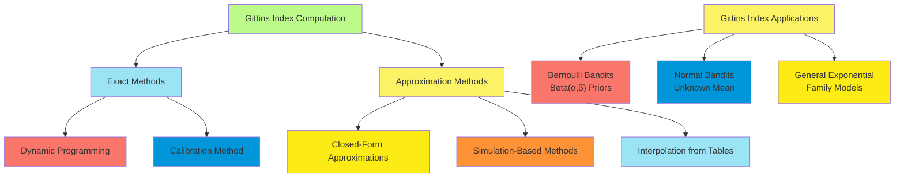

**Extensions and Limitations**

While powerful, the Gittins index has limitations:

1. The optimality breaks down if arms are not independent
2. Computation becomes intractable for complex state spaces
3. Extensions to non-stationary bandits are challenging
4. Adapting to contextual bandits requires significant modifications

Despite these limitations, the Gittins index provides valuable insights into optimal exploration-exploitation tradeoffs
and forms the theoretical foundation for many practical bandit algorithms.

**Whittle Index**

Peter Whittle extended the Gittins index to "restless bandits" where the state of non-played arms can also evolve. The
Whittle index is a heuristic approach that approximates the optimal solution by considering the problem as a Lagrangian
relaxation.

The Gittins index represents one of the most elegant theoretical results in sequential decision theory, providing a
decomposition of a complex multi-armed problem into separate single-armed problems, each characterized by its index
value.

##### Exploration vs. Exploitation

The exploration-exploitation tradeoff represents the central challenge in bandit problems and appears in various forms
across sequential decision-making. This fundamental dilemma asks: should an agent exploit current knowledge to maximize
immediate reward, or explore to gather information that might lead to better rewards in the future?

**Formal Framework for the Tradeoff**

The exploration-exploitation dilemma can be formalized in several ways:

1. **Value of Information (VoI)**:
    - Exploration can be viewed as purchasing information at the cost of potentially suboptimal immediate rewards
    - The value of exploration is the expected improvement in future decisions, discounted appropriately
    - Optimal exploration performs actions where VoI exceeds the immediate opportunity cost
2. **Posterior Sampling**:
    - Thompson sampling offers a Bayesian perspective where exploration emerges naturally
    - By sampling from posterior distributions, the agent implicitly balances exploration and exploitation
    - Actions are selected with probability proportional to their probability of being optimal
3. **Optimism in the Face of Uncertainty (OFU)**:
    - Upper Confidence Bound (UCB) algorithms embody this principle
    - By acting according to optimistic estimates, exploration is directed toward potentially valuable arms
    - The degree of optimism is calibrated to ensure sufficient exploration

**Theoretical Insights**

Several theoretical perspectives illuminate the exploration-exploitation tradeoff:

1. **Information-Theoretic Bounds**:
    - Mutual information between actions and unknown parameters quantifies the information gain from exploration
    - Information-directed sampling explicitly balances expected regret against information gain
    - Information theory provides fundamental limits on how quickly uncertainty can be reduced
2. **Bayesian Decision Theory**:
    - The optimal policy maximizes expected total reward considering all possible parameter values
    - Gittins indices provide optimal solutions for specific classes of bandits
    - Bayes-adaptive MDPs formalize the general problem of optimal learning and exploitation
3. **Regret Analysis**:
    - Asymptotic lower bounds (e.g., Lai-Robbins bound) quantify the minimum exploration required
    - Any algorithm with sublinear regret must explore each suboptimal arm at least logarithmically often
    - Optimal algorithms match these lower bounds up to constant factors

**Practical Approaches to Balancing Exploration and Exploitation**

Several practical strategies address the exploration-exploitation tradeoff:

1. **Explicit Exploration Strategies**:
    - $\epsilon$-greedy: With probability $\epsilon$, explore randomly; otherwise exploit
    - Boltzmann exploration: Sample actions with probability proportional to $e^{Q(a)/\tau}$
    - Count-based exploration: Incentivize visiting states with low visit counts
2. **Uncertainty-Based Approaches**:
    - Maintain confidence intervals or credible intervals for action values
    - Select actions based on upper bounds of these intervals (UCB-style)
    - Explore actions with high uncertainty in their value estimates
3. **Ensemble Methods**:
    - Maintain multiple models or value estimates
    - Disagreement among models indicates uncertainty, guiding exploration
    - Bootstrap sampling provides a computationally efficient approximation
4. **Optimistic Initialization**:
    - Initialize value estimates optimistically
    - This encourages initial exploration without explicit exploration mechanisms
    - The effect diminishes as more data is collected

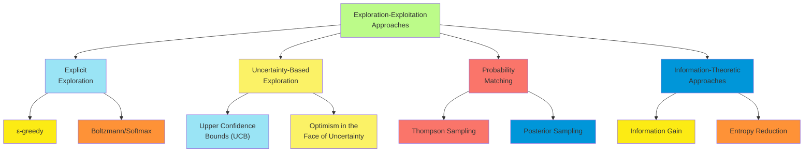

**Contextual Exploration**

In contextual bandits and MDPs, exploration strategies must account for context information:

1. **Linear Contextual Bandits**:
    - LinUCB maintains uncertainty estimates for linear reward functions
    - Thompson sampling samples from the posterior distribution of model parameters
    - Confidence bounds incorporate both parameter uncertainty and contextual features
2. **Deep Exploration**:
    - In complex environments, naive exploration strategies may fail
    - Randomized value functions encode uncertainty through randomly perturbed value estimates
    - Bootstrapped DQN maintains multiple value function heads trained on different data subsets
3. **Intrinsic Motivation**:
    - Curiosity-driven exploration rewards the agent for visiting novel or surprising states
    - Prediction error can serve as an exploration bonus
    - Random network distillation measures novelty via prediction error of a fixed random network

**Practical Considerations**

Several practical considerations affect exploration strategy choice:

1. **Time Horizon**:
    - Short horizons favor exploitation over exploration
    - The value of exploration depends on how many future decisions will benefit
    - Exploration should decrease over time in finite-horizon problems
2. **Risk Sensitivity**:
    - Risk-averse agents may explore less to avoid potential negative outcomes
    - Risk-seeking agents might explore more, valuing the chance of discovering high rewards
    - Quantile-based approaches can incorporate risk preferences into exploration
3. **Prior Knowledge**:
    - Informative priors can reduce the need for exploration
    - Domain expertise can guide exploration toward promising regions
    - Transfer learning can leverage experience from related tasks

The exploration-exploitation tradeoff represents a fundamental challenge that spans disciplines including computer
science, economics, and neuroscience. It captures the universal tension between learning and earning, between gathering
information and using it effectively. The theoretical frameworks and practical algorithms developed to address this
tradeoff form the foundation of modern sequential decision-making under uncertainty.

##### Approximately Optimal Bandit Policies

While the Gittins index provides an optimal solution for specific bandit problems, practical constraints often
necessitate the use of approximately optimal policies. These approaches balance computational efficiency with
performance guarantees, offering near-optimal solutions across a wide range of bandit settings.

**Upper Confidence Bound (UCB) Algorithms**

UCB algorithms implement the "optimism in the face of uncertainty" principle by selecting arms based on upper bounds of
their potential values:

1. **UCB1**:
    - Selects arm $a_t = \arg\max_i \left[ \hat{\mu}_i + \sqrt{\frac{2\ln t}{n_i}} \right]$
    - Achieves logarithmic regret that matches the Lai-Robbins lower bound asymptotically
    - Simple to implement with minimal computational overhead
2. **UCB-V**:
    - Incorporates empirical variance estimates:
      $a_t = \arg\max_i \left[ \hat{\mu}_i + \sqrt{\frac{2\hat{\sigma}_i^2\ln t}{n_i}} + \frac{3\ln t}{n_i} \right]$
    - More efficient for arms with varying reward variances
    - Adapts exploration based on observed variability
3. **KL-UCB**:
    - Uses Kullback-Leibler divergence for tighter confidence bounds
    - For Bernoulli rewards: $a_t = \arg\max_i \sup{q : D_{KL}(\hat{\mu}_i, q) \leq \frac{\ln t + c\ln\ln t}{n_i}}$
    - Achieves the information-theoretic lower bound for specific reward distributions
4. **Contextual UCB (LinUCB)**:
    - Extends UCB to linear contextual bandits
    - Maintains confidence ellipsoids in the parameter space
    - Selects actions with highest upper confidence bound on expected reward given context

**Bayesian and Probability Matching Approaches**

These methods explicitly represent uncertainty through probability distributions:

1. **Thompson Sampling**:
    - Sample parameter values from posterior distribution for each arm
    - Select the arm with highest sampled value
    - Achieves asymptotically optimal regret with appropriate priors
    - Naturally extends to complex models including context and structure
2. **Bayes-UCB**:
    - Uses quantiles of posterior distributions instead of frequentist confidence bounds
    - For arm $i$ at time $t$: $Q_i(1-1/t, t-1)$ (the $1-1/t$ quantile of posterior)
    - Combines Bayesian modeling with UCB-style selection
    - Particularly effective for Bernoulli bandits
3. **Information-Directed Sampling (IDS)**:
    - Explicitly balances expected regret against information gain
    - Selects actions to minimize the ratio of squared expected regret to information gain
    - Particularly effective in structured problems where information from one arm affects beliefs about others
4. **Gittins Index Approximations**:
    - Closed-form approximations to the optimal Gittins index
    - Index formulas calibrated to match exact values
    - Computationally efficient while preserving theoretical properties

**Simple Heuristic Approaches**

Simpler heuristics often perform well in practice:

1. **$\epsilon$-greedy**:
    - With probability $\epsilon$, explore randomly
    - With probability $1-\epsilon$, exploit the best-known arm
    - Often uses decreasing $\epsilon$ schedule: $\epsilon_t = \min(1, \frac{c}{d+t})$
    - Simple to implement and surprisingly effective
2. **Boltzmann Exploration**:
    - Select arm $i$ with probability proportional to $e^{\hat{\mu}_i/\tau}$
    - Temperature parameter $\tau$ controls exploration (high $\tau$ means more exploration)
    - Decreasing temperature schedule focuses increasingly on better arms
3. **Successive Elimination**:
    - Maintain a set of potentially optimal arms
    - Eliminate arms when their upper confidence bound falls below another arm's lower bound
    - Efficient for best-arm identification problems

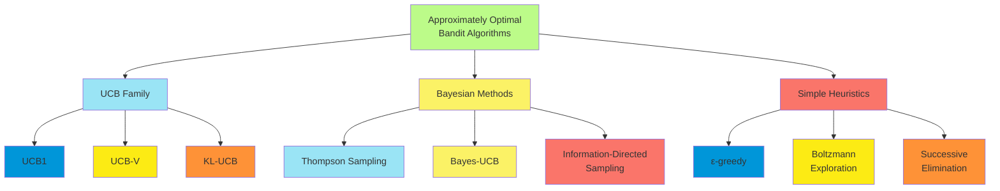

**Regret Guarantees**

Different algorithms offer different theoretical guarantees:

1. **Problem-Dependent Bounds**:
    - Regret bounded by $O(\sum_{i:\Delta_i>0} \frac{\ln T}{\Delta_i})$ where $\Delta_i = \mu^* - \mu_i$
    - Optimal algorithms achieve the Lai-Robbins lower bound with matching constant factors
    - Performance depends on the specific problem instance (the gaps $\Delta_i$)
2. **Problem-Independent Bounds**:
    - Worst-case regret bounded by $O(\sqrt{nT})$ or $O(\sqrt{nT\ln n})$
    - Apply regardless of the specific reward distributions
    - Relevant when gaps might be very small or unknown
3. **Finite-Time vs. Asymptotic**:
    - Finite-time bounds hold for any time horizon T
    - Asymptotic bounds characterize long-term behavior as T approaches infinity
    - Practical algorithms aim for good finite-time performance with optimal asymptotic behavior

**Considerations for Algorithm Selection**

Factors influencing algorithm choice include:

1. **Prior Information**:
    - With informative priors, Bayesian methods often excel
    - Without prior knowledge, UCB algorithms provide robust performance
    - Domain-specific structure can inform algorithm choice and customization
2. **Computational Constraints**:
    - Simple heuristics like $\epsilon$-greedy require minimal computation
    - Thompson sampling with complex posterior distributions can be computationally intensive
    - UCB algorithms typically offer a good balance of performance and computational efficiency
3. **Problem Structure**:
    - For independent arms, standard bandit algorithms work well
    - With correlations between arms, methods that leverage this structure (like GP-UCB) are more efficient
    - Contextual information requires specialized approaches like LinUCB or contextual Thompson sampling
4. **Performance Metrics**:
    - For minimizing cumulative regret, UCB and Thompson sampling excel
    - For best-arm identification, successive elimination or UCB-E are more appropriate
    - For fixed exploration budget problems, information-directed approaches often perform best

Approximately optimal bandit policies provide practical solutions to complex exploration-exploitation problems. While
they may not achieve the theoretical optimality of the Gittins index, their computational efficiency, flexibility, and
strong theoretical guarantees make them the methods of choice in most real-world applications. The diversity of
approaches allows practitioners to select algorithms that best match their specific problem characteristics and
constraints.

#### Partially Observable MDPs

##### Definition of POMDPs

Partially Observable Markov Decision Processes (POMDPs) extend MDPs to settings where the agent cannot directly observe
the true state of the environment. This framework addresses the reality that in many real-world problems, sensors are
limited, observations are noisy, and hidden variables affect the system dynamics.

**Formal Definition**

A POMDP is defined by a tuple $(S, A, O, T, Z, R, \gamma)$ where:

1. **State Space (S)**: The set of all possible states of the environment, which are not directly observable by the
   agent.
2. **Action Space (A)**: The set of actions the agent can take.
3. **Observation Space (O)**: The set of possible observations the agent can perceive.
4. **Transition Function (T)**: $T(s, a, s') = P(s' | s, a)$, the probability of transitioning to state $s'$ when taking
   action $a$ in state $s$.
5. **Observation Function (Z)**: $Z(s', a, o) = P(o | s', a)$, the probability of observing $o$ when action $a$ has led
   to state $s'$.
6. **Reward Function (R)**: $R(s, a)$, the immediate reward received for taking action $a$ in state $s$.
7. **Discount Factor ($\gamma$)**: A value between 0 and 1 that determines how much future rewards are discounted.

The key distinction from MDPs is that in POMDPs, the agent doesn't observe the state $s$ directly, but instead receives
observations $o$ that provide partial information about the state.

**POMDP Dynamics**

The POMDP operates as follows:

1. The environment begins in some initial state $s_0$
2. At each time step $t$:
    - The agent selects an action $a_t$
    - The environment transitions to a new state $s_{t+1}$ according to $T(s_t, a_t, s_{t+1})$
    - The agent receives an observation $o_{t+1}$ according to $Z(s_{t+1}, a_t, o_{t+1})$
    - The agent receives a reward $r_t = R(s_t, a_t)$

Since the agent cannot observe the true state, it must maintain a belief about possible states based on the history of
actions and observations.

**Key Challenges in POMDPs**

POMDPs introduce several fundamental challenges beyond standard MDPs:

1. **Perceptual Aliasing**: Different states may generate the same observation, making them indistinguishable based
   solely on current perception.
2. **History Dependence**: Optimal actions may depend on the entire history of observations and actions, not just the
   current observation.
3. **Exploration-Exploitation-Information Gathering**: The agent must balance traditional exploration-exploitation with
   actively gathering information to reduce state uncertainty.
4. **Computational Complexity**: Solving POMDPs exactly is PSPACE-complete, significantly harder than solving MDPs.

**Examples of POMDP Applications**

POMDPs model many real-world sequential decision problems:

1. **Robotics**: A robot with noisy sensors navigating an environment with hidden obstacles.
2. **Healthcare**: Medical diagnosis and treatment where patient's true condition is not fully observable.
3. **Maintenance**: Machine maintenance when internal wear or damage cannot be directly observed.
4. **Assistive Technology**: Adaptive interfaces that must infer user intent from limited interactions.
5. **Autonomous Driving**: Navigating with limited sensor information and uncertainty about other drivers' intentions.

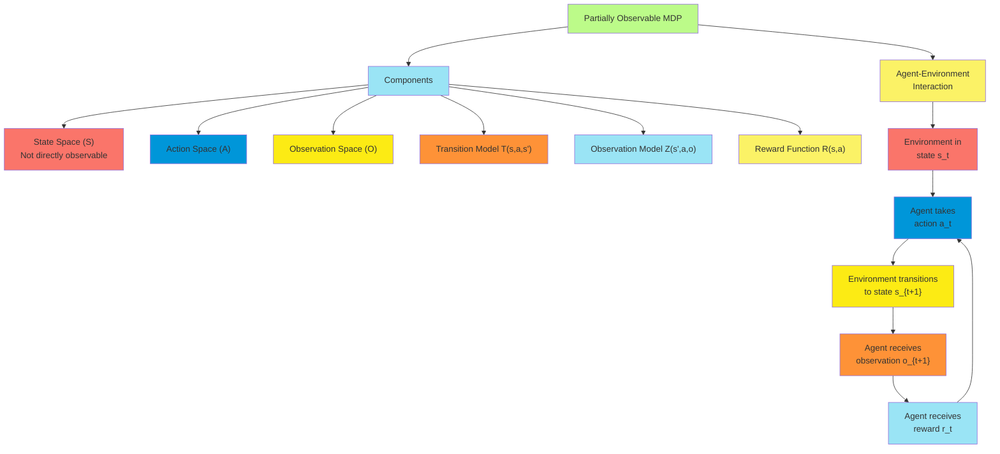

**Variations and Extensions**

Several variations of the basic POMDP model exist:

1. **Mixed Observability MDPs (MOMDPs)**: Some state variables are fully observable, while others are partially
   observable.
2. **Factored POMDPs**: The state space, observation space, and dynamics are represented in factored form.
3. **Continuous POMDPs**: State, action, and observation spaces are continuous rather than discrete.
4. **Decentralized POMDPs (Dec-POMDPs)**: Multiple agents each with their own partial observations must coordinate.
5. **Predictive State Representations (PSRs)**: Alternative representation focusing on predictions of future
   observations.

**Relationship to Other Models**

POMDPs generalize or relate to several other decision models:

1. **MDPs**: POMDPs reduce to MDPs when the observation function allows perfect state identification.
2. **Hidden Markov Models (HMMs)**: POMDPs extend HMMs by adding actions and rewards.
3. **Bayes-Adaptive MDPs**: Learning an unknown MDP model can be formulated as a POMDP.
4. **Reinforcement Learning with Partial Observability**: RL in partially observable environments implicitly addresses
   POMDPs.

POMDPs provide a powerful mathematical framework for decision-making under uncertainty with partial observability. While
their computational complexity makes exact solutions challenging, they accurately model many real-world scenarios where
agents must act based on limited information.

##### Belief States and Updates

In POMDPs, since the agent cannot directly observe the true state, it must reason about the possible states it might be
in. This is formalized through the concept of belief states—probability distributions over states that capture the
agent's uncertainty about the true environment state.

**Belief State Definition**

A belief state $b$ is a probability distribution over all possible states:

- $b(s)$ is the probability that the environment is in state $s$
- $\sum_{s \in S} b(s) = 1$ (belief states are proper probability distributions)
- The set of all possible belief states is denoted as $\mathcal{B}$, which is an $(|S|-1)$-dimensional simplex

The belief state summarizes all the information available to the agent from the history of actions and observations.

**Markov Property of Belief States**

While the observation sequence in a POMDP doesn't satisfy the Markov property, the belief state does. This is a crucial
property: the current belief state captures all relevant information from the history of actions and observations,
making it a sufficient statistic for optimal decision-making.

Formally, if $b_t$ is the belief state at time $t$, then:

$P(s_{t+1} | b_t, a_t, o_{t+1}, b_{t+1}) = P(s_{t+1} | b_{t+1})$

This means that once we update to $b_{t+1}$, the previous belief $b_t$ and the action-observation pair $(a_t, o_{t+1})$
provide no additional information about the next state.

**Belief State Update (Bayes Filter)**

When the agent takes action $a$ in belief state $b$ and receives observation $o$, the new belief state $b'$ is computed
using Bayes' rule:

$b'(s') = P(s' | b, a, o) = \frac{P(o | s', a) \sum_s P(s' | s, a)b(s)}{P(o | b, a)}$

Breaking this down:

1. $P(o | s', a)$ is the observation probability given by the observation model $Z(s', a, o)$
2. $\sum_s P(s' | s, a)b(s)$ is the predicted probability of being in state $s'$ after action $a$
3. $P(o | b, a) = \sum_{s'} P(o | s', a) \sum_s P(s' | s, a)b(s)$ is a normalizing constant

This update can be written more compactly as:

$b'(s') = \frac{Z(s', a, o) \sum_{s \in S} T(s, a, s')b(s)}{\sum_{s' \in S} Z(s', a, o) \sum_{s \in S} T(s, a, s')b(s)}$

The belief update process can be viewed as a two-step procedure:

1. **Prediction Step**: Compute the predicted belief after taking action $a$:

    $\hat{b}(s') = \sum_{s \in S} T(s, a, s')b(s)$

2. **Correction Step**: Incorporate the new observation $o$:

    $b'(s') = \eta \cdot Z(s', a, o) \cdot \hat{b}(s')$

    where $\eta$ is a normalizing constant that ensures $\sum_{s'} b'(s') = 1$

**Computational Considerations**

The belief update operation has computational complexity $O(|S|^2)$ for discrete state spaces, as it involves summing
over all states for each new state. This can become prohibitive for large state spaces, leading to several approaches
for more efficient belief updates:

1. **Factored Representations**: When states consist of multiple variables with conditional independence, the belief can
   be represented as a product of marginals or a Bayesian network, allowing more efficient updates.
2. **Parametric Representations**: Representing beliefs using parameterized distributions (e.g., Gaussians for
   continuous states) can significantly reduce computational complexity.
3. **Particle Filters**: Approximate beliefs using a finite set of weighted samples (particles), updating weights and
   resampling based on observations.
4. **Sparsity Exploitation**: In many problems, beliefs are sparse (most states have zero probability), allowing for
   more efficient representations and updates.

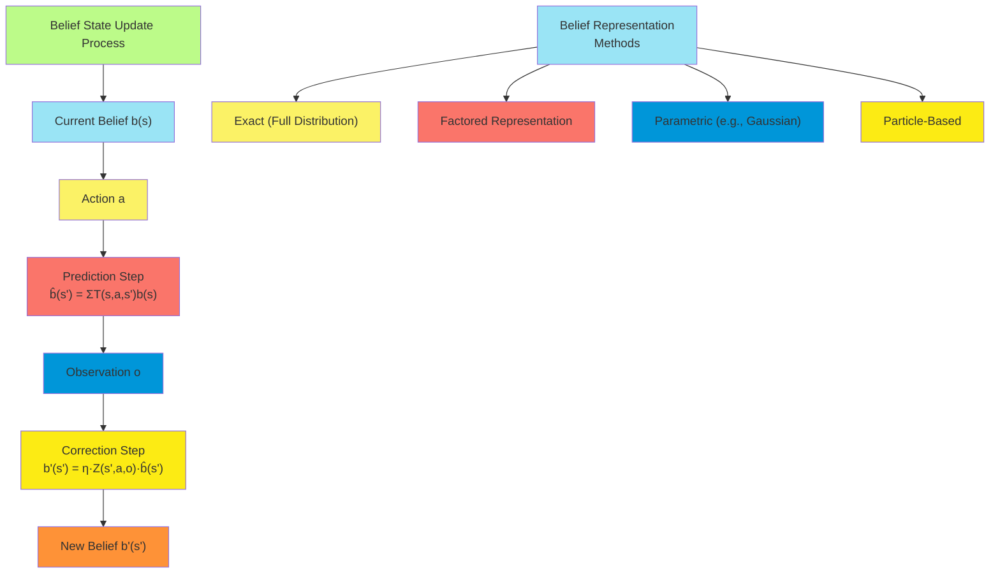

**Information Gathering and Active Perception**

The belief update process highlights an important aspect of POMDPs: actions can serve both to maximize immediate reward
and to gather information. This leads to strategies for active perception:

1. **Information-Gathering Actions**: Some actions may yield little immediate reward but provide valuable information by
   disambiguating states.
2. **Belief Entropy Reduction**: Actions can be evaluated partly based on how much they're expected to reduce
   uncertainty (entropy) in the belief state.
3. **Information Value**: The expected value of perfect information (EVPI) quantifies how much the agent would benefit
   from knowing the true state.

**Special Cases and Insights**

Several special cases provide insights into belief dynamics:

1. **Deterministic Transitions and Observations**: If both transitions and observations are deterministic, belief states
   are degenerate distributions (single states have probability 1).
2. **No Observations**: Without observations, belief states evolve purely based on the transition model, eventually
   converging to the stationary distribution of the Markov chain (if one exists).
3. **Perfect Observations**: With perfect state observability, the belief state is always concentrated on a single
   state, reducing the POMDP to an MDP.
4. **Mixed Observability**: When some state components are fully observable and others aren't, the belief state
   factorizes, simplifying updates.

Belief states and their updates form the foundation of POMDP theory and algorithms. By transforming the partially
observable problem into a fully observable one over belief space, they enable principled approaches to decision-making
under partial observability, albeit at the cost of increased computational complexity.

##### Converting POMDPs to Belief-State MDPs

A key insight in POMDP theory is that a POMDP can be converted into a fully observable MDP over the space of belief
states. This transformation, while elegant theoretically, leads to an infinite-dimensional state space that presents
significant computational challenges.

**The Belief-State MDP**

The belief-state MDP, also called the information-state MDP, is defined as:

- **States**: Belief states $b \in \mathcal{B}$ (probability distributions over POMDP states)
- **Actions**: Same actions $A$ as in the original POMDP
- **Transition Function**: $\tau(b, a, b')$ = probability of reaching belief $b'$ after taking action $a$ in belief $b$
- **Reward Function**: Expected immediate reward $\rho(b, a) = \sum_{s \in S} R(s, a)b(s)$
- **Discount Factor**: Same $\gamma$ as in the original POMDP

**Properties of the Belief-State Transition Function**

The belief-state transition function has several important properties:

1. **Deterministic Given Observation**: For any action $a$ and observation $o$, there is a deterministic mapping from
   belief $b$ to the next belief $b'$ through the Bayes filter update.
2. **Stochastic Due to Observations**: The observation $o$ is stochastic, making the overall belief transition
   stochastic.
3. **Finite Support**: Despite the infinite belief space, from any belief $b$ and action $a$, there are at most $|O|$
   possible next beliefs, corresponding to the possible observations.

Formally, the belief transition probability is:

$\tau(b, a, b') = \sum_{o \in O} P(o|b,a) \cdot \mathbb{I}[b' = \text{update}(b,a,o)]$

where $\mathbb{I}[\cdot]$ is the indicator function, and $\text{update}(b,a,o)$ is the belief after applying the Bayes
filter update.

**Value Function for the Belief-State MDP**

The value function for the belief-state MDP satisfies the Bellman equation:

$V^*(b) = \max_{a \in A} \left[ \rho(b, a) + \gamma \sum_{b' \in \mathcal{B}} \tau(b, a, b') V^*(b') \right]$

This can be rewritten in terms of observations:

$V^*(b) = \max_{a \in A} \left[ \sum_{s \in S} R(s, a)b(s) + \gamma \sum_{o \in O} P(o|b,a) V^*(\text{update}(b,a,o)) \right]$

The optimal policy maps each belief state to an action:

$\pi^*(b) = \arg\max_{a \in A} \left[ \rho(b, a) + \gamma \sum_{b' \in \mathcal{B}} \tau(b, a, b') V^*(b') \right]$

**Piecewise Linearity and Convexity (PWLC)**

A fundamental property of the optimal value function for POMDPs is that it is piecewise linear and convex (PWLC) in the
belief space:

$V^*(b) = \max_{\alpha \in \Gamma} \sum_{s \in S} \alpha(s) b(s) = \max_{\alpha \in \Gamma} \alpha \cdot b$

where:

- $\Gamma$ is a finite set of vectors (often called $\alpha$-vectors)
- Each $\alpha$-vector corresponds to a specific action and defines a linear function over the belief space
- For any belief $b$, the optimal value is given by the maximum of these linear functions

This PWLC property enables exact representation of the value function with a finite set of vectors, despite the infinite
belief space.

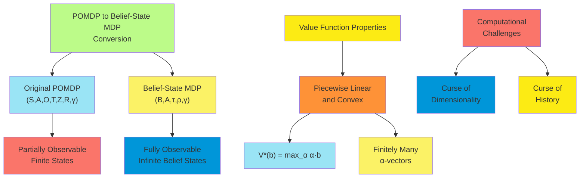

**Theoretical Implications**

The conversion to a belief-state MDP has several important theoretical implications:

1. **Optimal Policies**: The belief-state MDP perspective proves that optimal POMDP policies depend only on the current
   belief state, not the entire history.
2. **Finite-Memory Controllers**: Despite the infinite belief space, optimal or near-optimal policies can often be
   represented using finite-state controllers.
3. **Existence of Solution**: For discounted infinite-horizon POMDPs, an optimal policy always exists, though it may
   require an infinite number of $\alpha$-vectors to represent exactly.
4. **Complexity**: The problem of finding an optimal policy for a finite-horizon POMDP is PSPACE-complete, significantly
   harder than solving MDPs.

**Computational Challenges**

The belief-state MDP formulation faces two main computational challenges:

1. **Curse of Dimensionality**: The belief space is continuous and high-dimensional ($(|S|-1)$-dimensional), making
   grid-based approaches impractical for all but the smallest problems.
2. **Curse of History**: The number of possible action-observation histories grows exponentially with the horizon,
   making naive enumeration approaches intractable.

To address these challenges, algorithms for solving POMDPs typically exploit the PWLC property of the value function and
employ various approximation techniques.

**Practical Approaches**

Several approaches leverage the belief-state MDP formulation while addressing its computational challenges:

1. **Value Iteration with Alpha-Vectors**: Extend value iteration to operate directly on sets of $\alpha$-vectors rather
   than enumerating beliefs.
2. **Point-Based Methods**: Approximate the value function by considering only a finite subset of reachable belief
   points.
3. **Policy-Based Methods**: Search directly in policy space using parameterized controllers or policy gradient methods.
4. **Online Planning**: Compute actions only for the current belief through forward search or Monte Carlo techniques.

Converting POMDPs to belief-state MDPs provides a theoretical foundation for understanding and solving POMDPs. While the
resulting infinite-dimensional MDP presents significant computational challenges, this formulation has inspired numerous
algorithmic approaches that make POMDP solutions practical for real-world problems.

##### The Value of Information in POMDPs

In POMDPs, actions serve dual purposes: they directly influence rewards and state transitions, and they generate
observations that reduce uncertainty about the environment's state. The value of information (VoI) framework provides a
principled way to quantify and balance these aspects, helping agents decide when to gather information and when to
exploit current knowledge.

**Defining Value of Information**

The value of information in a POMDP context represents how much an agent would benefit from additional information about
the state. Formally:

1. **Expected Value of Perfect Information (EVPI)**:
    - The difference between expected utility with perfect information and the expected utility under uncertainty
    - $\text{EVPI}(b) = \sum_{s \in S} b(s) \max_a Q(s, a) - \max_a \sum_{s \in S} b(s) Q(s, a)$
    - Where $Q(s, a)$ is the action-value function for the underlying MDP
2. **Expected Value of Sample Information (EVSI)**:
    - The expected increase in utility from a specific information-gathering action
    - $\text{EVSI}(b, a_{\text{info}}) = \sum_{o} P(o|b,a_{\text{info}}) \max_{a'} Q(b_o, a') - \max_a Q(b, a)$
    - Where $b_o$ is the updated belief after observing $o$
3. **Myopic Value of Information**:
    - Considers only immediate benefits of information, not long-term effects
    - Used as an approximation when full EVPI/EVSI calculations are intractable

**Information Gathering vs. Exploitation**

POMDP agents must balance three types of actions:

1. **Exploitation Actions**: Maximize immediate reward based on current belief
2. **Information-Gathering Actions**: Primarily reduce uncertainty with little immediate reward
3. **Dual-Purpose Actions**: Both provide information and reasonable rewards

The optimal choice depends on:

- Horizon length (longer horizons favor information gathering)
- Current uncertainty (higher uncertainty increases information value)
- Reward structure (larger reward disparities increase information value)
- Observation informativeness (more informative observations increase information value)

**Principled Approaches to Information Valuation**

Several formal approaches quantify information value in POMDPs:

1. **Bellman Equations with Explicit Information Terms**:
    - Decompose the value function into immediate reward and information gain
    - $V(b) = \max_a \left[ \rho(b, a) + \gamma \sum_o P(o|b,a) V(b_o) \right]$
    - The term $\sum_o P(o|b,a) V(b_o) - V(\hat{b})$ captures the expected value of information, where $\hat{b}$ is the
      predicted belief without observation
2. **Information-Theoretic Measures**:
    - Entropy reduction: $H(b) - \sum_o P(o|b,a) H(b_o)$
    - KL divergence: $\sum_o P(o|b,a) D_{\text{KL}}(b_o || \hat{b})$
    - These measures quantify the expected reduction in uncertainty
3. **Model-Based Active Learning**:
    - Value actions based on how much they reduce uncertainty about model parameters
    - Particularly relevant in Bayes-Adaptive POMDPs where the agent is learning the model

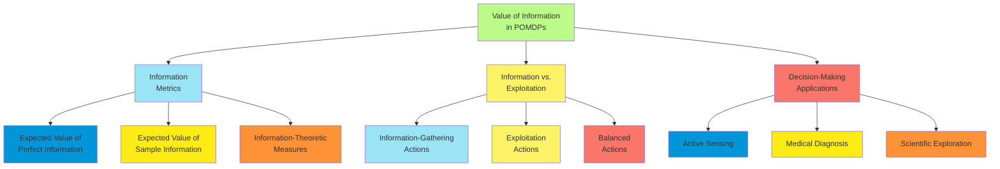

**Computational Methods for Information-Aware Planning**

Several algorithms explicitly incorporate information value:

1. **Information-Directed Sampling**:
    - Select actions to minimize the ratio of expected regret squared to expected information gain
    - Balances immediate performance with learning
2. **$\rho$POMDP (Risk-Sensitive POMDP)**:
    - Augments the reward function with an explicit information-gathering term
    - $R'(b, a) = R(b, a) + \lambda \cdot \text{InfoGain}(b, a)$
    - Parameter $\lambda$ controls the trade-off between reward and information
3. **Information-Theoretic Control**:
    - Uses mutual information between states and observations as an intrinsic reward
    - Can be viewed as maximizing empowerment—the agent's control over its future sensory inputs
4. **Curiosity-Driven Exploration**:
    - Rewards the agent for actions that lead to surprising observations
    - Prediction error serves as a proxy for information gain

**Applications of Information Value in POMDPs**

The concept of information value is particularly important in:

1. **Active Sensing**:
    - Robotic systems that must decide where to point sensors
    - Camera view selection in multi-camera systems
    - Sensor scheduling under resource constraints
2. **Medical Decision Making**:
    - Test selection in diagnosis (which tests to run and when)
    - Treatment planning with uncertain patient state
    - Adaptive clinical trials
3. **Scientific Exploration**:
    - Experiment design to efficiently reduce hypothesis space
    - Autonomous exploration robots (e.g., Mars rovers)
    - Environmental monitoring with mobile sensors
4. **Human-Machine Interaction**:
    - Intelligent tutoring systems that probe student knowledge
    - Question asking in dialog systems
    - Preference elicitation in recommendation systems

**Theoretical Insights**

Several theoretical results guide information-aware POMDP planning:

1. **Information Never Hurts**: The value function is convex in the belief space, implying that more informative belief
   states (those with lower entropy) have higher value.
2. **Bounded Value of Information**: For any belief state, there exists an upper bound on how much perfect information
   can improve decision-making.
3. **Submodularity**: Information gain often exhibits diminishing returns, leading to efficient greedy
   information-gathering strategies.
4. **Exploration Bonus Decay**: The value of information generally decreases as the agent accumulates experience,
   leading to naturally decreasing exploration over time.

The value of information provides a principled framework for addressing one of the key challenges in POMDPs: balancing
between actions that provide immediate rewards and those that provide information for better future decisions. By
quantifying information explicitly, agents can make rational decisions about when to explore and when to exploit,
leading to more efficient and effective behavior in partially observable environments.

##### Applications of POMDPs

POMDPs provide a powerful framework for decision-making under uncertainty and partial observability. Their ability to
model complex real-world scenarios has led to successful applications across diverse domains. This section explores key
application areas, highlighting how POMDPs address domain-specific challenges.

**Robotics and Autonomous Systems**

POMDPs have become fundamental in robotics due to inherent sensor limitations and environmental uncertainty:

1. **Robot Navigation**:
    - Mobile robots use POMDPs to navigate with noisy sensors and imperfect maps
    - Belief states represent position uncertainty
    - Actions include movement and active sensing
    - SLAM (Simultaneous Localization and Mapping) can be formalized as a POMDP
2. **Manipulation and Grasping**:
    - Object properties (weight, friction) may be partially observable
    - POMDP policies can incorporate tactile feedback to reduce uncertainty
    - Actions include information-gathering touches and task-directed manipulations
3. **Human-Robot Interaction**:
    - POMDPs model uncertainty about human intentions and preferences
    - Observations include direct communication and behavioral cues
    - Adaptive interaction based on evolving beliefs about human needs
4. **Autonomous Vehicles**:
    - Uncertainty about pedestrian intentions and other drivers' behaviors
    - Partial observability due to occlusions and sensor limitations
    - POMDP frameworks guide decisions about lane changes, intersections, and merging

**Healthcare**

Medical decision-making involves inherent uncertainty about patient state and treatment effects:

1. **Clinical Decision Support**:
    - Patient's true health state is partially observable through symptoms and tests
    - POMDP policies balance information gathering (tests) with treatment actions
    - Observations include test results, vital signs, and patient-reported outcomes
2. **Treatment Planning**:
    - Sequential treatment decisions under uncertainty about disease progression
    - Cancer treatment planning (radiation therapy, chemotherapy sequencing)
    - HIV therapy optimization with partial observability of viral resistance
3. **Screening and Monitoring**:
    - Optimal scheduling of medical tests and screenings
    - Trading off cost of screening against early detection benefits
    - Personalized schedules based on individual risk factors and history
4. **Assistive Technologies**:
    - POMDP-based systems for cognitive assistance
    - Adapting prompts and help based on inferred cognitive state
    - Smart prosthetics that adapt to user intent and environmental conditions

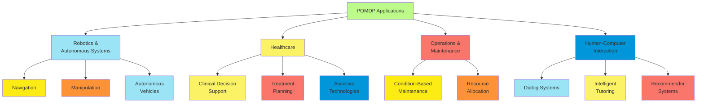

**Operations and Maintenance**

POMDPs excel in maintenance planning where system deterioration is not directly observable:

1. **Condition-Based Maintenance**:
    - Infer hidden component conditions from observable indicators
    - Balance maintenance costs against failure risks
    - Observations include sensor readings, inspection results, and performance metrics
2. **Infrastructure Management**:
    - Bridge and road maintenance with partially observable deterioration
    - Dam safety management with uncertain structural integrity
    - Power grid reliability with incomplete information about component states
3. **Resource Allocation**:
    - Managing natural resources with partially observable population dynamics
    - Fisheries management with uncertain stock levels
    - Water resource allocation with uncertain future supply
4. **Supply Chain Management**:
    - Inventory management with uncertain demand and supply disruptions
    - POMDP policies adapt ordering based on observed demand patterns
    - Multi-echelon supply chains with partial visibility across tiers

**Human-Computer Interaction**

User modeling and adaptive interfaces benefit from the POMDP framework:

1. **Dialog Systems**:
    - Uncertainty about user goals and preferences
    - Observations include explicit statements and implicit signals
    - POMDP policies balance clarification questions with task progress
2. **Intelligent Tutoring Systems**:
    - Student knowledge as partially observable state
    - Observations include question responses and interaction patterns
    - Adaptive instruction based on inferred knowledge state
3. **Recommender Systems**:
    - User preferences as hidden state
    - Observations include explicit ratings and implicit behavior
    - POMDP frameworks guide exploration-exploitation in recommendations
4. **Accessibility Technologies**:
    - Adapting interfaces for users with impairments
    - Uncertainty about specific user capabilities and needs
    - Policies that balance assistance with user autonomy

**Security and Surveillance**

Security applications involve inherent uncertainty about adversary states and intentions:

1. **Patrolling and Monitoring**:
    - Partially observable adversary locations and behaviors
    - POMDP frameworks for patrol routing and sensor placement
    - Balancing deterrence with detection probability
2. **Cyber Security**:
    - System security state not directly observable
    - Observations include network traffic and system logs
    - Adaptive defense policies based on inferred attack state
3. **Counter-Terrorism and Law Enforcement**:
    - Intelligence gathering and intervention planning
    - Uncertainty about network structure and adversary plans
    - Policies that balance information gathering with interdiction

**Scientific Discovery and Exploration**

POMDPs guide efficient information gathering in scientific contexts:

1. **Experiment Design**:
    - Sequential experiment selection to discriminate between hypotheses
    - Partially observable underlying scientific truth
    - Maximizing information gain within resource constraints
2. **Environmental Monitoring**:
    - Mobile sensors for pollution tracking or wildlife monitoring
    - Adaptive sampling strategies based on current belief state
    - POMDP policies that balance spatial coverage with focused investigation
3. **Space Exploration**:
    - Autonomous Mars rovers and other space missions
    - Limited sensing capabilities in extreme environments
    - Balancing scientific discovery with operational constraints

**Implementation Challenges and Solutions**

Real-world POMDP applications face several common challenges:

1. **Model Specification**:
    - Transition and observation models often difficult to specify precisely
    - Solutions include learning from data and robust POMDP formulations
    - Expert knowledge incorporation through structured model building
2. **Computational Scalability**:
    - Real-world state spaces often very large
    - Hierarchical decomposition of complex problems
    - Online approximate algorithms for real-time decision-making
3. **Model Uncertainty**:
    - Parameters of POMDP models are themselves uncertain
    - Bayes-Adaptive POMDPs address both state and model uncertainty
    - Robust POMDPs handle worst-case parameter uncertainty

POMDPs have transitioned from theoretical constructs to practical tools for complex real-world decision problems. Their
ability to handle both state uncertainty and partial observability makes them uniquely suited to many contemporary
challenges in artificial intelligence and automated decision-making.

#### Algorithms for Solving POMDPs

##### Value Iteration for POMDPs

Value iteration for POMDPs extends the MDP value iteration algorithm to the belief space, exploiting the piecewise
linear and convex (PWLC) property of the optimal value function. While theoretically elegant, exact POMDP value
iteration faces significant computational challenges that have spurred numerous approximation techniques.

**Exact Value Iteration**

The exact value iteration algorithm for POMDPs operates on sets of $\alpha$-vectors that represent the value function:

1. **Representation**: At each iteration $n$, the value function $V_n$ is represented by a finite set of
   $\alpha$-vectors $\Gamma_n = {\alpha_1, \alpha_2, ..., \alpha_k}$, where:

    $V_n(b) = \max_{\alpha \in \Gamma_n} \sum_{s \in S} \alpha(s) b(s) = \max_{\alpha \in \Gamma_n} \alpha \cdot b$

2. **Value Backup**: For a specific belief point $b$, the backup operation computes:

    $V_{n+1}(b) = \max_{a \in A} \left[ \sum_{s \in S} R(s, a)b(s) + \gamma \sum_{o \in O} P(o|b,a) V_n(\text{update}(b,a,o)) \right]$

3. **Vector Generation**: Rather than computing the value function for all beliefs, the algorithm generates new
   $\alpha$-vectors that define $V_{n+1}$.

The key algorithmic challenge is generating the minimal set of $\alpha$-vectors that exactly represent the value
function after each backup.

**Vector Generation Algorithms**

Several algorithms have been developed for vector generation:

1. **Exhaustive Enumeration**:
    - Generates all possible $\alpha$-vectors from combinations of previous vectors and observations
    - Extremely inefficient as it creates $|A| \cdot |\Gamma_n|^{|O|}$ vectors
    - Requires pruning to remove dominated vectors
2. **Witness Points Method**:
    - Identifies belief points where different vectors are optimal
    - Uses linear programming to find "witness points" that prove a vector's necessity
    - More efficient than exhaustive enumeration but still scales poorly
3. **Incremental Pruning**:
    - Performs pruning operations incrementally during vector generation
    - Exploits the structure of the backup operator to reduce computational complexity
    - Substantially more efficient than the witness algorithm
4. **Point-Based Value Iteration**:
    - Restricts backup operations to a finite set of belief points
    - Dramatically reduces computational complexity while maintaining good approximation
    - Various strategies for selecting representative belief points (e.g., PBVI, HSVI, SARSOP)

**The Backup Operation**

The backup operation for a specific belief point $b$ and action $a$ involves:

1. Compute $\alpha$-vectors for each possible observation:

    $\alpha_{a,o}(s) = \gamma \sum_{s' \in S} T(s, a, s') Z(s', a, o) \alpha'(s')$

    where $\alpha'$ is the vector that maximizes $\alpha' \cdot b_{a,o}$ (the updated belief after action $a$ and
    observation $o$).

2. Combine these observation-specific vectors into an action-specific vector:

    $\alpha_a(s) = R(s, a) + \sum_{o \in O} \alpha_{a,o}(s)$

3. The final backed-up vector for belief $b$ is the action-specific vector that maximizes value:

    $\alpha_{\text{backup}}(s) = \alpha_{a^*}(s)$ where $a^* = \arg\max_a \alpha_a \cdot b$

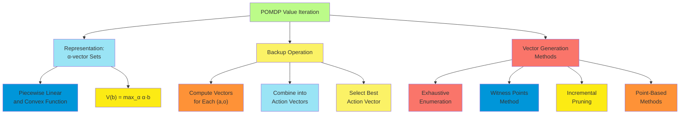

**Convergence and Complexity**

Exact value iteration for POMDPs has important theoretical properties:

1. **Convergence**: The algorithm converges to the optimal value function as the number of iterations increases.
2. **Finite $\alpha$-vectors for Finite Horizon**: For a finite-horizon problem, the optimal value function can be
   represented exactly with a finite number of $\alpha$-vectors.
3. **Infinite $\alpha$-vectors for Infinite Horizon**: For infinite-horizon problems, the optimal value function may
   require an infinite number of $\alpha$-vectors for exact representation, necessitating approximation.
4. **Computational Complexity**: The number of $\alpha$-vectors can grow exponentially with the planning horizon, making
   exact algorithms intractable for all but the smallest problems.

**Point-Based Value Iteration**

Point-based methods represent a major breakthrough in practical POMDP solving:

1. **Core Idea**: Perform backups only at selected belief points rather than over the entire belief space.
2. **Belief Point Selection**: Choose a set of representative points that cover the reachable belief space.
3. **Value Update**: Perform standard backup operations at each belief point, keeping only vectors that are optimal for
   at least one point.
4. **Guarantees**: With sufficient belief points, the approximation can be arbitrarily close to the optimal value
   function.

Key point-based algorithms include:

1. **PBVI (Point-Based Value Iteration)**:
    - Maintains a fixed set of belief points
    - Expands the set periodically to improve coverage
    - Relatively simple implementation with good performance
2. **HSVI (Heuristic Search Value Iteration)**:
    - Uses heuristic search to identify relevant belief points
    - Maintains upper and lower bounds on the value function
    - Selectively explores parts of the belief space with high uncertainty
3. **SARSOP (Successive Approximations of the Reachable Space under Optimal Policies)**:
    - Focuses sampling on belief points reachable under optimal policies
    - Uses sophisticated sampling strategies to improve efficiency
    - Achieves state-of-the-art performance on many benchmark problems

**Practical Considerations**

When implementing value iteration for POMDPs:

1. **Initialization**: Starting with an informative lower bound (e.g., from a simpler MDP solution) can accelerate
   convergence.
2. **Vector Pruning**: Regular pruning of dominated vectors is essential for computational efficiency.
3. **Numerical Stability**: Careful implementation of belief updates and vector operations is needed to avoid numerical
   issues.
4. **Factored Representations**: For structured problems, factored representations of states, observations, and
   $\alpha$-vectors can significantly improve scalability.

Value iteration for POMDPs provides a principled approach to computing optimal or near-optimal policies. While exact
algorithms face severe computational challenges, point-based methods and other approximation techniques have made POMDP
solutions practical for many real-world problems.

##### Policy Loss and Convergence

Understanding the approximation quality and convergence behavior of POMDP algorithms is essential for deploying them in
practical applications. This section examines the theoretical foundations of policy loss bounds and convergence
properties, offering insights into algorithm performance and reliability.

**Measuring Policy Loss**

Policy loss quantifies the difference between an approximate policy's performance and the optimal policy's performance:

1. **Value-Based Loss**: For a policy $\pi$ and the optimal policy $\pi^*$:

    $L(\pi) = \sup_{b \in \mathcal{B}} [V^*(b) - V^\pi(b)]$

    This measures the maximum possible loss across all belief states.

2. **Expected Loss**: Often more practical, measuring loss with respect to a distribution over initial beliefs:

    $L_D(\pi) = \mathbb{E}_{b \sim D} [V^*(b) - V^\pi(b)]$

3. **Discounted Future Loss**: For infinite-horizon problems:

    $L_\gamma(\pi, b_0) = \sum_{t=0}^{\infty} \gamma^t \mathbb{E}[R(s_t, \pi^*(b_t)) - R(s_t, \pi(b_t))]$

    Where expectations are taken over state distributions induced by the policies.

**Theoretical Bounds on Approximation Quality**

For approximate POMDP algorithms, several theoretical results bound the policy loss:

1. **Value Function Approximation**: If $\hat{V}$ approximates $V^*$ with error $\epsilon$:

    $|\hat{V} - V^*|*\infty \leq \epsilon \Rightarrow L(\pi*{\hat{V}}) \leq \frac{2\epsilon}{1-\gamma}$

    Where $\pi_{\hat{V}}$ is the greedy policy with respect to $\hat{V}$.

2. **Point-Based Approximations**: For point-based methods with belief set $\mathcal{B}'$:

    $L(\pi) \leq \frac{2\gamma\epsilon_{\mathcal{B}'}}{(1-\gamma)^2}$

    Where $\epsilon_{\mathcal{B}'}$ is the maximum distance from any reachable belief to the closest point in
    $\mathcal{B}'$.

3. **Finite-State Controllers**: For n-state controllers:

    $L(\pi_n) \leq \frac{2\gamma}{1-\gamma} \min_{\pi \in \Pi_n} |V^{\pi} - V^*|_\infty$

    Where $\Pi_n$ is the set of all n-state controllers.

**Convergence Properties**

Different POMDP algorithm classes exhibit different convergence behaviors:

1. **Exact Value Iteration**:
    - Converges to the optimal value function at a linear rate
    - $|V_{n} - V^*|_\infty \leq \gamma^n |V_0 - V^*|_\infty$
    - Requires exponentially increasing computational resources with horizon
2. **Point-Based Methods**:
    - Converge to a bounded approximation of the optimal value function
    - Approximation quality depends on density and distribution of belief points
    - HSVI and SARSOP offer formal bounds on convergence rate to near-optimal policies
3. **Policy-Based Methods**:
    - Typically offer local convergence guarantees
    - May get trapped in local optima
    - Convergence rate depends on policy parameterization and optimization technique

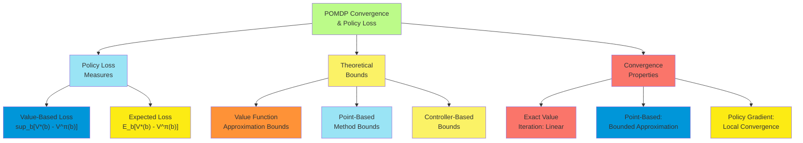

**Error Propagation**

Understanding how errors propagate in POMDP algorithms is crucial:

1. **Bellman Error Propagation**:
    - Single-step approximation errors compound through Bellman backups
    - The discount factor $\gamma$ determines how quickly past errors decay
    - For value iteration: $|T^n V_0 - V^*|_\infty \leq \frac{\gamma^n}{1-\gamma} \max_b |T V_0(b) - V_0(b)|$
2. **Belief State Error Propagation**:
    - Errors in belief state estimation compound with decision errors
    - Approximations in belief updates introduce additional policy degradation
    - Robustness to belief errors depends on value function smoothness
3. **Model Error Sensitivity**:
    - Errors in transition, observation, or reward models propagate to policy quality
    - POMDPs can be particularly sensitive to observation model errors
    - Robust POMDP formulations explicitly account for model uncertainty

**Anytime Properties**

Many modern POMDP algorithms offer anytime properties—the ability to return progressively better policies given more
computation time:

1. **Lower and Upper Bounds**:
    - Algorithms like HSVI and SARSOP maintain bounds on the optimal value
    - Bounds tighten with more computation, offering quality guarantees at any point
2. **Policy Improvement Guarantees**:
    - Most policy iteration methods guarantee monotonic improvement
    - Even approximate policy iteration methods often demonstrate empirical improvement
3. **Online Performance Profiles**:
    - Policy quality typically improves rapidly at first, then levels off
    - Diminishing returns suggest practical stopping criteria for computation

**Empirical Convergence Analysis**

Empirical analysis reveals important practical aspects of convergence:

1. **Problem Characteristics Affecting Convergence**:
    - State space size and structure
    - Observation informativeness
    - Discount factor (values closer to 1 slow convergence)
    - Reward structure (sparse rewards can slow convergence)
2. **Algorithm-Specific Behaviors**:
    - Value-based methods often show steady convergence
    - Policy-based methods may display more erratic improvement patterns
    - Online methods show rapid initial improvement for the current belief
3. **Computational Resource Scaling**:
    - Memory requirements often become bottlenecks before computation time
    - Solution quality vs. computation time exhibits power-law relationship in many cases
    - Problem-specific characteristics heavily influence scaling behaviors

Understanding policy loss bounds and convergence properties helps in selecting appropriate algorithms for specific POMDP
problems and in setting realistic expectations about solution quality and computational requirements. These theoretical
foundations also guide the development of new algorithms that offer better performance guarantees or more favorable
scaling properties.

##### Online Algorithms for POMDPs

Online POMDP algorithms compute actions in real-time for the current belief state, rather than pre-computing a policy
for all possible beliefs. This approach trades off comprehensive policy computation for focused, timely decision-making,
making it suitable for large POMDPs where offline solutions are intractable.

**Key Principles of Online POMDP Algorithms**

Online algorithms share several fundamental principles:

1. **Current Belief Focus**: Compute actions only for the current belief state, not the entire belief space.
2. **Lookahead Search**: Explore the consequences of actions and observations to a limited depth.
3. **Anytime Computation**: Produce increasingly better actions as more computation time is available.
4. **Receding Horizon**: Execute one action, observe the result, update the belief, and replan.
5. **Approximate Evaluation**: Use heuristics or approximate models to evaluate belief states beyond the search horizon.

**Forward Search in Belief Space**

Forward search algorithms explore the belief space starting from the current belief:

1. **Branch-and-Bound Pruning**:
    - Maintain upper and lower bounds on value function
    - Prune branches that cannot improve the current best action
    - Examples: RTDP-BEL, AEMS
2. **Sparse Sampling**:
    - Sample a subset of possible observations at each level
    - Reduce branching factor while maintaining statistical guarantees
    - Examples: POMCP, DESPOT
3. **Monte Carlo Tree Search (MCTS)**:
    - Build a search tree incrementally through simulation
    - Focus computational effort on promising action sequences
    - Balance exploration and exploitation using UCB-like formulas
    - Example: POMCP (Partially Observable Monte Carlo Planning)

**POMCP (Partially Observable Monte Carlo Planning)**

POMCP is a particularly effective online algorithm that combines MCTS with particle-based belief representation:

1. **Belief Representation**: Maintain a set of state particles approximating the current belief.

2. **Tree Construction**: Build a search tree where nodes represent histories (action-observation sequences).

3. Simulation Strategy

    :

    - Selection: Traverse the tree using UCB to balance exploration and exploitation
    - Expansion: Add a new node to the tree
    - Simulation: Perform a random rollout to estimate value
    - Backpropagation: Update value estimates along the path

4. **Particle Reinvigoration**: Add new particles to maintain diversity in the belief representation.

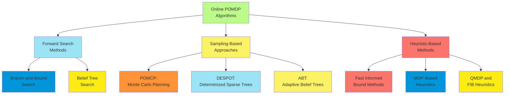

**Belief Tree Search**

Belief tree search algorithms explicitly construct and search trees where:

1. **Nodes**: Represent belief states

2. **Edges**: Represent action-observation pairs

3. Expansion Strategy

    : Methods differ in how they expand the tree:

    - AEMS (Anytime Error Minimization Search): Expands nodes that most reduce value function error
    - FRTDP (Focused Real-Time Dynamic Programming): Focuses on high-probability belief trajectories
    - DESPOT (Determinized Sparse Partially Observable Tree): Uses scenarios to manage uncertainty

**Heuristics for Leaf Node Evaluation**

Online algorithms typically use heuristics to evaluate belief states at the search frontier:

1. **QMDP**: Assumes full observability after the current step

    $V_{\text{QMDP}}(b) = \max_a \sum_s b(s) Q_{\text{MDP}}(s, a)$

    Fast to compute but ignores the value of information

2. **FIB (Fast Informed Bound)**: Improved upper bound that partially accounts for partial observability

    Uses a set of alpha vectors derived from the MDP solution

3. **PBVI-Based Heuristics**: Offline point-based approximations used as heuristics

    Pre-compute approximate value function using PBVI and use it during online search

4. **Rollout Policies**: Simulate random or heuristic policies to estimate leaf node values

    $V_{\text{rollout}}(b) = \mathbb{E}[\sum_{t=0}^H \gamma^t r_t | b_0 = b, \pi_{\text{rollout}}]$

**Belief Representation and Update**

Efficient belief representation and update are critical for online algorithms:

1. **Exact Belief Updates**: Maintain full probability distributions
    - Suitable for small state spaces
    - Computationally expensive for large problems
2. **Particle Filters**: Approximate beliefs using weighted state samples
    - Update by propagating particles through the transition and observation models
    - Challenge: Particle depletion when observations are unlikely
3. **Gaussian Approximations**: Represent beliefs using Gaussian distributions
    - Efficient for continuous state spaces
    - Limited to unimodal belief distributions
4. **Factored Representations**: Exploit state independence to represent beliefs compactly
    - Dynamic Bayesian Networks for structured state spaces
    - Exponentially more efficient for factored problems

**Theoretical Properties**

Online POMDP algorithms offer various theoretical guarantees:

1. **Asymptotic Optimality**: Many algorithms converge to optimal actions given infinite computation
    - POMCP is asymptotically optimal as the number of simulations grows
    - DESPOT provides bounded approximation with high probability
2. **Regret Bounds**: Quantify how quickly algorithms approach optimal performance
    - Typically scale as $O(\sqrt{T})$ where T is the number of simulations
    - Tighter bounds possible with problem-specific assumptions
3. **Sample Complexity**: Number of simulations needed to ensure ε-optimal actions
    - Typically exponential in planning horizon
    - Can be significantly reduced with effective heuristics and pruning

**Practical Considerations**

When implementing online POMDP algorithms:

1. **Real-Time Constraints**: Allocate computation time based on decision urgency
    - More time for critical decisions
    - Anytime algorithms can be interrupted when decisions must be made
2. **Meta-Reasoning**: Decide how to allocate computational resources
    - When to stop planning and execute an action
    - Which parts of the belief tree to explore more deeply
3. **Model Learning**: Adapt the POMDP model based on experience
    - Update transition and observation models online
    - Bayes-Adaptive POMDPs formalize the learning problem
4. **Reuse of Computation**: Maintain and update search trees across steps
    - Prune irrelevant branches after actions and observations
    - POMCP naturally supports tree reuse through its incremental construction

Online POMDP algorithms have dramatically extended the practical applicability of POMDPs to larger problems. By focusing
computation on the current belief and relevant futures, these methods deliver good decisions within practical time
constraints, even for problems far beyond the reach of offline approaches.

##### Monte Carlo Planning for POMDPs

Monte Carlo planning methods have emerged as a powerful approach for solving POMDPs, combining statistical sampling with
tree search to handle large, complex problems that defeat traditional approaches. These methods scale to significantly
larger problems by avoiding explicit representation of the entire belief space and focusing computational effort on
statistically relevant scenarios.

**Monte Carlo Sampling in POMDPs**

Monte Carlo methods use randomized sampling to estimate values and belief states:

1. **State Sampling**: Represent beliefs using sets of sampled states rather than full distributions
    - $b \approx {s_1, s_2, ..., s_N}$ where each $s_i$ is drawn according to $b(s)$
    - Sample count determines approximation accuracy
2. **Forward Simulation**: Estimate action values by simulating forward from current belief
    - Sample transitions: $s' \sim T(s, a, \cdot)$
    - Sample observations: $o \sim Z(s', a, \cdot)$
    - Accumulate discounted rewards along simulated trajectories
3. **Belief Update via Importance Sampling**: Update particle representations after observations
    - Assign weights based on observation likelihood: $w_i \propto Z(s_i', a, o)$
    - Resample particles according to weights
    - Apply rejuvenation techniques to maintain diversity

**Monte Carlo Tree Search for POMDPs**

MCTS adapts to the POMDP setting by searching in the space of histories (action-observation sequences):

1. **Tree Structure**:
    - Nodes represent either beliefs or histories (action-observation sequences)
    - Edges represent actions or observations
    - Node values estimate expected future reward from that history
2. **Key MCTS Phases**:
    - Selection: Choose actions and observations to traverse down the tree
    - Expansion: Add new nodes to the tree
    - Simulation: Perform random rollouts to estimate values
    - Backpropagation: Update node statistics based on simulation results
3. **Exploration-Exploitation Balance**:
    - UCB formula balances exploration with exploitation:
      $a^* = \arg\max_a [Q(h, a) + c \sqrt{\frac{\ln N(h)}{N(h,a)}}]$
    - Progressively focuses on promising actions as more simulations are performed
    - Exploration parameter c controls trade-off

```mermaid
flowchart TD
    A["Monte Carlo Planning<br>for POMDPs"] --> B["Core MC<br>Techniques"]
    A --> C["MCTS<br>Algorithms"]
    A --> D["Implementation<br>Enhancements"]

    B --> E["Particle-Based<br>Belief Representation"]
    B --> F["Forward<br>Simulation"]
    B --> G["Importance<br>Sampling"]

    C --> H["POMCP"]
    C --> I["DESPOT"]
    C --> J["ABT"]

    D --> K["Particle<br>Reinvigoration"]
    D --> L["Root Sampling<br>Techniques"]
    D --> M["Rollout<br>Policy Learning"]

    style A fill:#BCFB89
    style B fill:#9AE4F5
    style C fill:#FBF266
    style D fill:#FA756A
    style E fill:#0096D9
    style F fill:#FCEB14
    style G fill:#FE9237
    style H fill:#9AE4F5
    style I fill:#FBF266
    style J fill:#FA756A
    style K fill:#0096D9
    style L fill:#FCEB14
    style M fill:#FE9237
```

**POMCP (Partially Observable Monte Carlo Planning)**

POMCP is a landmark algorithm combining particle filtering with MCTS:

1. **Algorithm Overview**:
    - Represent current belief using particle filter
    - Build search tree with histories as nodes
    - Perform UCT-based tree search with particle-based simulations
    - Update belief based on real action-observation pairs
2. **Key Innovations**:
    - Root sampling: Sample states only at the root, then forward-simulate
    - History-based policy: Map histories to actions rather than beliefs to actions
    - Integrated belief update: Particle filter naturally maintained through sampling
    - Progressive widening: Handle large/continuous observation spaces
3. **Performance Characteristics**:
    - Asymptotically optimal given sufficient simulations
    - Scales to significantly larger problems than exact methods
    - Effectiveness depends on simulation count and rollout policy quality

**DESPOT (Determinized Sparse Partially Observable Tree)**

DESPOT improves on POMCP with tighter performance bounds:

1. **Scenario-Based Search**:
    - Use a fixed set of "scenarios" (random number streams)
    - Each scenario determinizes the stochastic process
    - Search a determinized sparse belief tree
2. **Dual Bounds**:
    - Maintain upper and lower bounds for pruning
    - Focus computation on promising branches
    - Provable bound on policy loss
3. **Regularization**:
    - Explicitly balance tree size and approximation quality
    - Regularized objective: max\_{π} [V^π - λ|π|]
    - Parameter λ controls complexity-performance trade-off

**Advanced Monte Carlo Techniques**

Several advanced techniques improve Monte Carlo planning performance:

1. **Double Progressive Widening**:
    - Manage continuous action and observation spaces
    - Gradually increase branching factor with more simulations
    - Ensures appropriate exploration while maintaining tractability
2. **Particle Reinvigoration**:
    - Address particle depletion in rare observation scenarios
    - Add artificially perturbed particles after resampling
    - Mix model-based particles with prior samples
3. **Adaptive Belief Trees (ABT)**:
    - Incrementally build and refine a policy over multiple planning cycles
    - Reuse previous computations when replanning
    - Dynamically adapt tree structure as beliefs evolve
4. **Importance Sampling for Rare Events**:
    - Biased sampling to explore critical rare events
    - Reweight samples to maintain statistical validity
    - Particularly valuable in safety-critical applications

**Rollout Policies and Value Heuristics**

The choice of rollout policy and value estimation significantly impacts performance:

1. **Random Rollouts**:
    - Simplest approach: choose actions uniformly at random
    - Unbiased but high variance
    - Requires many simulations for accurate estimates
2. **Heuristic Rollouts**:
    - Use domain knowledge to guide simulations
    - Reduced variance leads to faster convergence
    - Risk of bias if heuristic is misleading
3. **Learned Rollout Policies**:
    - Train policies offline using reinforcement learning
    - Adapt rollout policies online based on simulation results
    - Neural network policies can capture complex patterns
4. **Bootstrapped Value Estimates**:
    - Replace full rollouts with learned value function approximations
    - Particularly effective for problems with long horizons
    - Can combine with shorter rollouts for balance

**Practical Implementation Considerations**

Successfully implementing Monte Carlo POMDP planning requires attention to several practical issues:

1. **Computational Efficiency**:
    - Optimize most frequent operations (state transitions, observation probabilities)
    - Vectorize operations for particle sets when possible
    - Implement efficient tree structure with appropriate caching
2. **Determinization Techniques**:
    - How random streams are generated affects solution quality
    - Stratified sampling can improve coverage of the uncertainty space
    - Consider domain-specific ways to determinize uncertainty
3. **Observation Handling**:
    - Continuous or high-dimensional observations require special treatment
    - Observation clustering or discretization
    - Distance metrics for comparing similar observations
4. **Belief Reconstruction**:
    - Particle filters may suffer from depletion in long sequences
    - Consider periodic full belief reconstruction
    - Hybrid approaches combining particles with parametric approximations

Monte Carlo planning methods have revolutionized POMDP solving, making previously intractable problems solvable in
practical timeframes. Their ability to focus computation on relevant parts of the belief space, handle large state
spaces, and provide anytime performance makes them particularly well-suited to real-world applications with complex
uncertainty structures.

##### Partially Observable Monte Carlo Planning (POMCP)

Partially Observable Monte Carlo Planning (POMCP) represents a landmark algorithm in POMDP solving, combining the
statistical efficiency of Monte Carlo tree search with particle-based belief representation. Since its introduction by
Silver and Veness in 2010, POMCP has become one of the most widely used online POMDP solvers due to its scalability,
conceptual simplicity, and strong empirical performance.

**Algorithm Foundation and Structure**

POMCP builds on several key ideas:

1. **Unified Framework**: Integrates belief state estimation and planning in a single Monte Carlo framework
2. **History-Based Policy**: Operates directly on histories (sequences of actions and observations) rather than beliefs
3. **Particle Filter Beliefs**: Represents beliefs using unweighted state particles
4. **UCT Search**: Adapts the Upper Confidence Bounds for Trees (UCT) algorithm to partially observable settings

The algorithm consists of two interlinked components:

- A MCTS planner that determines actions based on simulated episodes
- A particle filter that maintains and updates the belief state

**Core Algorithm**

The POMCP algorithm proceeds as follows:

1. **Initialization**:
    - Create a tree with a single node representing the empty history h₀
    - Generate N particles representing the initial belief state
2. **Action Selection Phase**:
    - Given current history h and particle set B(h):
    - Perform K simulations, each starting by sampling a state s ~ B(h)
    - For each simulation, traverse the existing tree using UCT, then perform a rollout
    - Select action a\* with highest estimated value after simulations
3. **Execution and Belief Update**:
    - Execute selected action a\* in the environment
    - Receive observation o from the environment
    - Update history: h' = hao
    - Update belief state by advancing particles through the model and resampling based on observation likelihood

**UCT Tree Search Component**

Within each simulation, POMCP uses UCT to balance exploration and exploitation:

1. **Tree Policy (within existing tree)**:
    - At history h, select action a that maximizes: $a = \arg\max_a [Q(h,a) + c\sqrt{\frac{\log N(h)}{N(h,a)}}]$
    - Where Q(h,a) is the estimated value, N(h) is the visit count for history h, and N(h,a) is the visit count for
      action a after history h
    - The parameter c controls exploration (typically c = β·R_max where R_max is the maximum reward)
2. **Expansion**:
    - After reaching a leaf node or a node with unvisited action-observation pairs, add a new node to the tree
3. **Rollout**:
    - From the new node, simulate to the end of the episode or to a fixed depth using a default policy
    - The default policy can be random or a simple heuristic
4. **Backpropagation**:
    - Update value estimates and visit counts for all nodes traversed during the simulation

**Particle Filter Implementation**

The particle filter component handles belief updates efficiently:

1. **State Sampling**:
    - Each simulation begins by sampling a state from the current particle set
    - This "root sampling" approach avoids explicit belief state tracking during simulations
2. **Particle Propagation**:
    - After executing action a and receiving observation o:
    - For each particle s in B(h):
        - Sample next state s' ~ T(s,a,·)
        - Accept s' into B(hao) with probability proportional to Z(s',a,o)
3. **Particle Reinvigoration**:
    - Address particle depletion by adding artificial diversity
    - When particles become too few, inject new particles with small random perturbations
    - More sophisticated approaches use domain knowledge or model-based generation

```mermaid
flowchart TD
    A["POMCP Algorithm"] --> B["Initialize<br>Tree & Particle Set"]
    B --> C["Simulate K Episodes<br>from Current Belief"]
    C --> D["Select Best Action<br>Based on Simulations"]
    D --> E["Execute Action &<br>Observe Result"]
    E --> F["Update History<br>& Particle Filter"]
    F --> C

    G["POMCP Simulation"] --> H["Tree Policy<br>(UCT Selection)"]
    H --> I["Expansion<br>(New Node)"]
    I --> J["Rollout<br>(Default Policy)"]
    J --> K["Backpropagation<br>(Update Statistics)"]

    L["Particle Filter<br>Belief Update"] --> M["Advance Particles<br>Through Model"]
    M --> N["Filter Based on<br>Observation Likelihood"]
    N --> O["Reinvigorate<br>if Necessary"]

    style A fill:#BCFB89
    style B fill:#9AE4F5
    style C fill:#FBF266
    style D fill:#FA756A
    style E fill:#0096D9
    style F fill:#FCEB14
    style G fill:#FE9237
    style H fill:#9AE4F5
    style I fill:#FBF266
    style J fill:#FA756A
    style K fill:#0096D9
    style L fill:#FCEB14
    style M fill:#FE9237
    style N fill:#9AE4F5
    style O fill:#FBF266
```

**Theoretical Properties**

POMCP offers several important theoretical guarantees:

1. **Asymptotic Convergence**: Given sufficient simulations, POMCP converges to the optimal policy
2. **Computational Complexity**: Each simulation has complexity O(D) where D is the simulation depth
3. **Space Complexity**: O(KD) where K is the number of simulations—significantly better than full belief-state
   algorithms
4. **Convergence Rate**: Error decreases at rate O(1/√K) with the number of simulations K
5. **Consistency**: Particle filter belief approximation converges to the true belief as particle count increases

**Extensions and Enhancements**

Several extensions improve POMCP's performance in specific settings:

1. **Factored POMCP**:
    - Exploits state factorization for more efficient simulation
    - Decomposes state into variables with conditional independence
    - Improves scaling for structured problems
2. **PO-UCT with Double Progressive Widening**:
    - Handles continuous action and observation spaces
    - Controls branching factor growth as function of visit count
    - Ensures sufficient exploration while maintaining tractability
3. **POMCPOW (POMCP with Observation Widening)**:
    - Specially designed for continuous observation spaces
    - Incrementally adds observations to the tree based on similarity metrics
    - More efficient than naive discretization approaches
4. **Belief-Based POMCP**:
    - Maintains parametric belief representations alongside particles
    - Enables more sophisticated rollout policies
    - Combines statistical efficiency of particles with representational power of parametric models

**Application-Specific Adaptations**

POMCP has been adapted to various application domains with specific requirements:

1. **Robotics Applications**:
    - Continuous state/action/observation spaces require specialized sampling strategies
    - Real-time constraints necessitate careful simulation budgeting
    - Domain-specific rollout policies improve performance
2. **Multi-Agent Extensions**:
    - Recursive reasoning about other agents' beliefs and policies
    - Sampling-based approximation of nested beliefs
    - Scalable approach to partial observability in multi-agent settings
3. **Long-Horizon Planning**:
    - Macro-actions reduce effective planning horizon
    - Hierarchical extensions consider planning at multiple time scales
    - Learned value function approximations replace deep rollouts

**Practical Implementation Considerations**

Several practical considerations affect POMCP's real-world performance:

1. **Simulation Budget Allocation**:
    - Adaptive allocation based on decision uncertainty
    - More simulations for critical decisions or high ambiguity
    - Real-time considerations may limit available simulations
2. **Rollout Policy Design**:
    - Domain-specific heuristics significantly improve performance
    - Learned rollout policies can capture complex dynamics
    - Mixing multiple rollout strategies balances exploration and exploitation
3. **Particle Filter Tuning**:
    - Particle count trades off accuracy vs. computation
    - Reinvigoration strategies critical for avoiding particle depletion
    - Approximate belief updates when exact simulation is expensive
4. **Tree Reuse**:
    - Between planning iterations, reuse relevant subtrees
    - Prune branches inconsistent with observations
    - Retain statistics to warm-start new planning cycles

POMCP represents a major breakthrough in POMDP solving, combining the statistical efficiency of Monte Carlo methods with
the exploration-exploitation balance of UCT. Its ability to handle large state spaces and focus computation on relevant
scenarios has made it the foundation for numerous subsequent algorithms and a standard approach for challenging
real-world POMDP problems.

#### Summary

In this chapter, we've explored the rich landscape of making complex decisions under uncertainty, focusing on sequential
decision problems where actions affect both immediate rewards and future possibilities. We began with Markov Decision
Processes (MDPs), which provide a formal framework for modeling decision problems where the current state fully captures
all relevant information. We then progressed to scenarios with partial observability, where agents must make decisions
without complete state information.

##### Key Concepts and Methods

1. **Sequential Decision Problems**
    - **Markov Decision Processes (MDPs)**: The formal framework combining states, actions, transition probabilities,
      and rewards
    - **Utilities over Time**: How to evaluate reward sequences using discounting
    - **Optimal Policies**: Mappings from states to actions that maximize expected utility
    - **Dynamic Decision Networks**: Graphical representations of MDPs that expose problem structure
2. **Algorithms for MDPs**
    - **Value Iteration**: Iteratively computing state utilities until convergence
    - **Policy Iteration**: Alternating between policy evaluation and improvement
    - **Linear Programming**: Formulating the MDP as a constrained optimization problem
    - **Online Algorithms**: Making real-time decisions without precomputing complete policies
    - **Monte Carlo Tree Search**: Using statistical sampling to explore the decision tree
3. **Bandit Problems**
    - **The n-Armed Bandit**: A simplified setting capturing the exploration-exploitation tradeoff
    - **The Bernoulli Bandit**: Bandits with binary rewards following Bernoulli distributions
    - **Gittins Index**: An optimal solution approach for specific bandit formulations
    - **Exploration vs. Exploitation**: Fundamental tradeoff between gathering information and using it
    - **Approximately Optimal Policies**: Practical algorithms with strong performance guarantees
4. **Partially Observable MDPs (POMDPs)**
    - **Belief States**: Probability distributions over states representing the agent's knowledge
    - **Belief Updates**: How to revise beliefs based on actions and observations
    - **Belief-State MDPs**: Converting POMDPs to fully observable MDPs over belief space
    - **Value of Information**: Quantifying the benefit of reducing uncertainty
    - **Real-World Applications**: From robotics to healthcare to maintenance planning
5. **Algorithms for Solving POMDPs**
    - **Value Iteration**: Extended to operate over belief space using α-vectors
    - **Policy Loss and Convergence**: Theoretical bounds on approximation quality
    - **Online Algorithms**: Computing actions for the current belief without solving the entire problem
    - **Monte Carlo Planning**: Using statistical sampling to navigate the belief space
    - **POMCP**: A landmark algorithm combining particle filtering with Monte Carlo tree search

##### Theoretical Insights

Throughout the chapter, several important theoretical insights emerged:

1. The **Markov property** allows complex temporal problems to be represented compactly, enabling efficient solutions
   despite the sequential nature of decisions.
2. For MDPs, an **optimal policy always exists** that is both stationary (time-independent) and deterministic
   (non-random).
3. The **piecewise linear and convex** (PWLC) structure of POMDP value functions enables exact representation with a
   finite set of vectors, despite the infinite belief space.
4. The **exploration-exploitation tradeoff** is fundamental to sequential decision-making under uncertainty, requiring
   principled approaches to balance immediate rewards with information gathering.
5. **Belief states** serve as sufficient statistics in POMDPs, converting a partially observable problem into a fully
   observable one over belief space.

##### Practical Applications

The frameworks and algorithms discussed have found applications in numerous domains:

1. **Robotics**: Navigation, manipulation, and human-robot interaction
2. **Healthcare**: Treatment planning, medical diagnosis, and screening optimization
3. **Resource Management**: Inventory control, fisheries management, and infrastructure maintenance
4. **Human-Computer Interaction**: Dialog systems, intelligent tutoring, and assistive technologies
5. **Security and Surveillance**: Patrol planning, intrusion detection, and cyber security

##### Computational Challenges

Despite theoretical elegance, these methods face significant computational challenges:

1. **Curse of Dimensionality**: State spaces grow exponentially with the number of state variables
2. **Curse of History**: In POMDPs, possible action-observation histories grow exponentially with horizon
3. **Model Specification**: Accurately defining transition and observation probabilities is often difficult
4. **Scalability-Quality Tradeoff**: More sophisticated algorithms provide better policies but at greater computational
   cost

##### Future Directions

The field continues to advance along several fronts:

1. **Deep Reinforcement Learning for POMDPs**: Using neural networks to approximate value functions and policies
2. **Model Learning**: Learning transition and observation models from data
3. **Robust and Risk-Sensitive Planning**: Addressing model uncertainty and risk preferences
4. **Multi-Agent POMDPs**: Extending to settings with multiple decision-makers under partial observability
5. **Continuous State and Action Spaces**: Developing efficient algorithms for continuous domains

The frameworks and algorithms presented in this chapter provide principled approaches to sequential decision-making
under uncertainty. By formalizing the interplay between states, actions, observations, and rewards, they enable the
development of intelligent agents capable of making effective decisions in complex, uncertain environments. While
computational challenges remain, the continuing advances in algorithms and computing power are steadily expanding the
range of problems that can be addressed with these methods.
