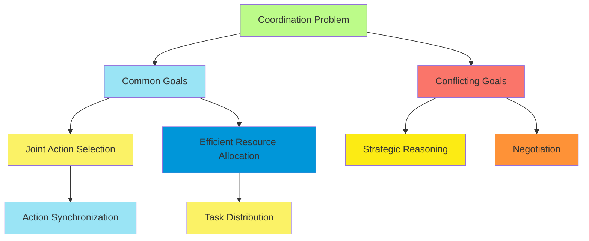
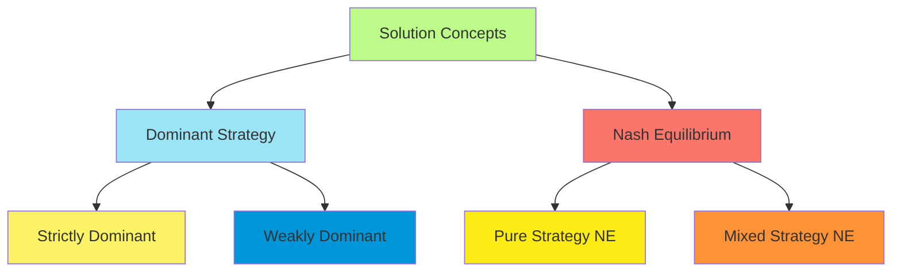
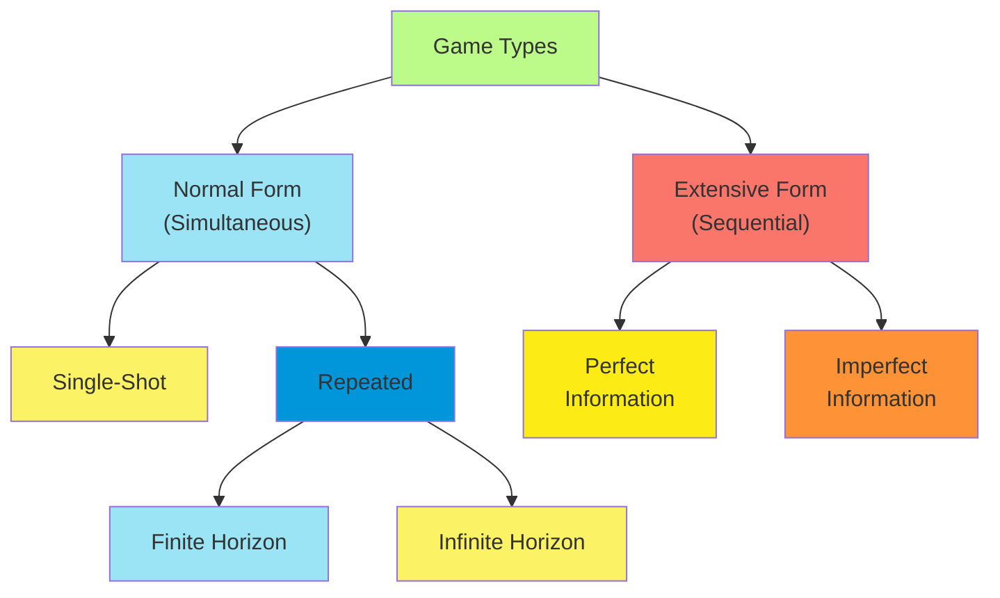
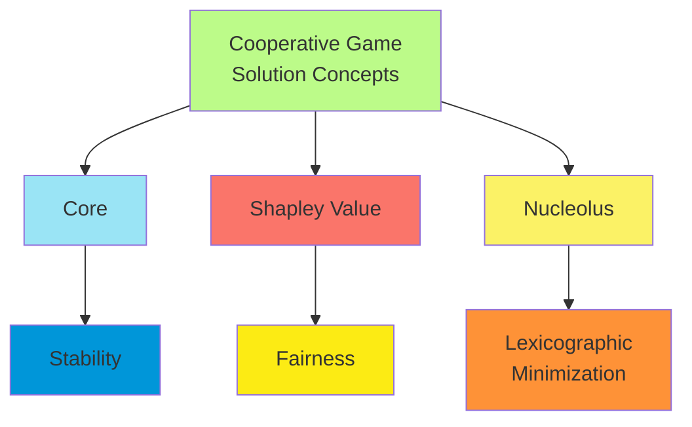
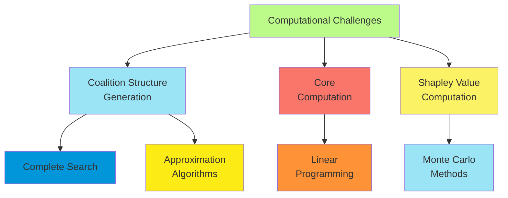
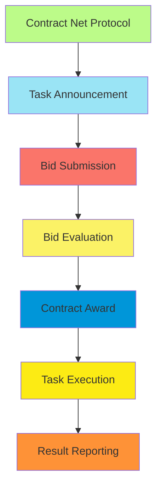
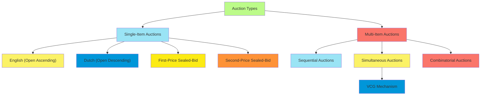
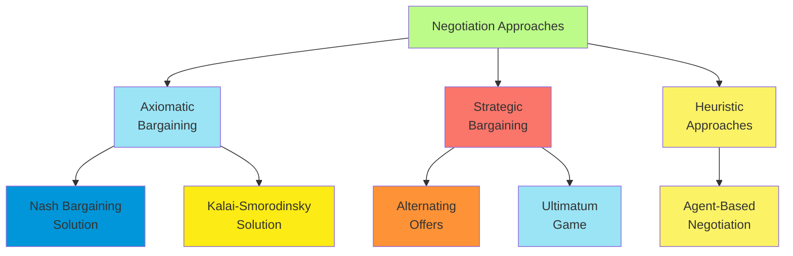
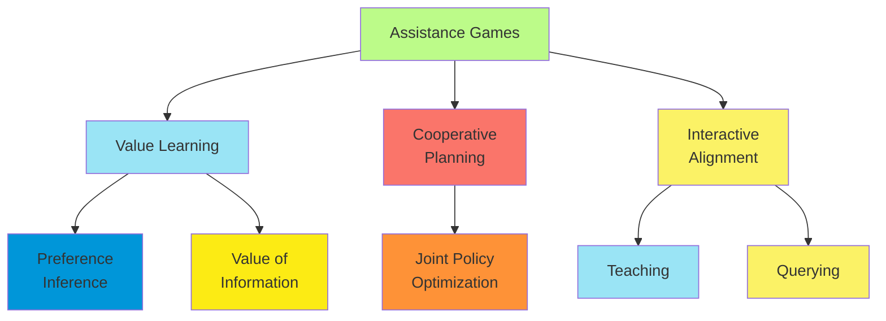
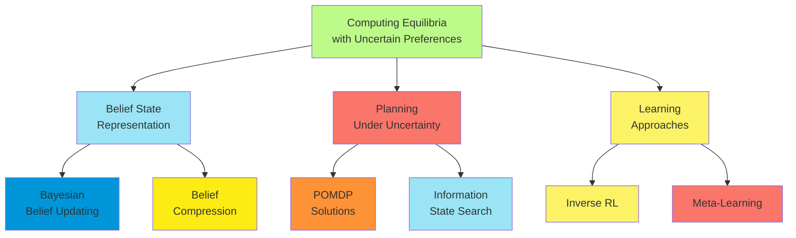

# C-17 | S-4: Multiagent Decision Making

1. Properties of Multiagent Environments
    - One Decision Maker vs. Multiple Decision Makers
    - Coordination Problems and Common Goals
    - Multieffector Planning and Multibody Planning
    - Decentralized and Distributed Planning
    - Incentive Alignment in Multiagent Systems
2. Non-Cooperative Game Theory
    - Games with a Single Move: Normal Form Games
    - Dominant Strategies and Nash Equilibrium
    - Social Welfare and Pareto Optimality
    - Computing Equilibria
    - Repeated Games and Sequential Games
3. Cooperative Game Theory
    - Coalition Structures and Outcomes
    - The Core and Shapley Value
    - Stability and Fairness Concepts
    - Computation in Cooperative Games
    - Marginal Contribution Networks
4. Making Collective Decisions
    - Allocating Tasks with the Contract Net
    - Auctions for Resource Allocation
    - Voting Systems and Social Choice
    - Bargaining and Negotiation
    - Mechanism Design for Multiagent Systems
5. Uncertain Payoffs and Assistance Games
    - Preference Uncertainty in Games
    - Assistance Games and Human-AI Alignment
    - The Paperclip Game
    - Deference to Humans
    - Computing Equilibria with Uncertain Preferences

#### Properties of Multiagent Environments

##### One Decision Maker vs. Multiple Decision Makers

The transition from single-agent to multiagent decision-making represents a fundamental shift in complexity. With a
single decision maker, the agent optimizes its actions against a passive environment. In multiagent settings, each agent
must account for other agents' reasoning and potential actions.

The mathematical formulation illustrates this distinction:

**Single-agent MDP**: A Markov Decision Process defined by the tuple $\langle S, A, T, R, \gamma \rangle$ where:

- $S$ is the set of states
- $A$ is the set of actions
- $T: S \times A \times S \rightarrow [0,1]$ is the transition function
- $R: S \times A \rightarrow \mathbb{R}$ is the reward function
- $\gamma \in [0,1)$ is the discount factor

**Multi-agent extension**: In a multiagent setting with $n$ agents, we extend this to:

- Joint action space: $A = A_1 \times A_2 \times ... \times A_n$
- Transition function: $T: S \times A_1 \times A_2 \times ... \times A_n \times S \rightarrow [0,1]$
- Individual reward functions: $R_i: S \times A_1 \times A_2 \times ... \times A_n \rightarrow \mathbb{R}$ for each
  agent $i$

This extension introduces strategic dependencies between agents, as each agent's outcomes depend on others' actions.

##### Coordination Problems and Common Goals

Coordination problems arise when multiple agents must align their actions to achieve a desirable joint outcome. These
problems often involve:

1. **Synchronization**: Agents must act in concert temporally
2. **Task allocation**: Distributing responsibilities efficiently
3. **Resource allocation**: Determining which agents receive which resources
4. **Communication constraints**: Limited ability to share information

When agents share common goals, coordination becomes primarily a matter of efficient joint action selection. However,
even with perfectly aligned objectives, coordination remains challenging due to:

- **Exponential action space**: The joint action space grows exponentially with the number of agents
- **Partial observability**: Each agent has a limited view of the environment
- **Communication costs**: Sharing information may be expensive or limited
- **Execution uncertainty**: Actions may not have deterministic outcomes

##### Multieffector Planning and Multibody Planning

Multieffector planning involves a single agent controlling multiple actuators or "effectors," while multibody planning
involves multiple distinct agents, each with their own decision-making apparatus.

**Multieffector Planning**:

- Central controller coordinates multiple effectors
- Complete knowledge of all effectors' capabilities and states
- Optimization can occur globally
- Examples: Robot with multiple arms, traffic control system

**Multibody Planning**:

- Independent decision-makers with potentially different objectives
- Limited knowledge of other agents' capabilities and states
- Optimization occurs locally with consideration of others' actions
- Examples: Autonomous vehicles navigating shared roads, trading agents in a marketplace

The key distinction lies in the centralization of control. Multieffector planning maintains a unified decision-making
process, while multibody planning distributes decision-making among autonomous entities.

##### Decentralized and Distributed Planning

Decentralized planning frameworks address scenarios where multiple agents must coordinate without full communication or
centralized control:

**Decentralized Planning**:

- Agents make individual decisions based on local information
- No central controller dictates actions
- Often modeled as Dec-POMDPs (Decentralized Partially Observable Markov Decision Processes)
- Formal model: $\langle S, A, T, R, \Omega, O, h, n \rangle$ where:
    - $S$ is the state space
    - $A = \times_{i=1}^{n} A_i$ is the joint action space
    - $T$ is the transition function
    - $R$ is the shared reward function
    - $\Omega = \times_{i=1}^{n} \Omega_i$ is the joint observation space
    - $O$ is the observation function
    - $h$ is the horizon
    - $n$ is the number of agents

**Distributed Planning**:

- Computation of plans is distributed among agents
- May involve decomposition of a larger problem
- Communication protocols enable coordination
- Can be employed in both centralized and decentralized execution frameworks

These approaches are particularly relevant when:

1. Communication bandwidth is limited
2. Agents are physically distributed
3. Privacy concerns limit information sharing
4. Robustness to failure is required

The computational complexity of optimal decentralized planning is NEXP-complete, significantly harder than the
PSPACE-complete complexity of centralized planning under uncertainty.

##### Incentive Alignment in Multiagent Systems

Incentive alignment addresses how to structure rewards to encourage agents to act in ways that benefit the system as a
whole:

**Challenges**:

1. **Self-interest**: Agents may prioritize individual utility over collective outcomes
2. **Information asymmetry**: Agents may have private information others cannot verify
3. **Commitment problems**: Agents may renege on agreements when beneficial
4. **Externalities**: Actions may affect other agents without compensation

**Approaches to Incentive Alignment**:

1. **Mechanism design**: Creating rules that make revealing true preferences and acting for the common good the dominant
   strategy
2. **Reward shaping**: Modifying reward functions to align individual incentives with global objectives
3. **Reputation systems**: Creating persistent consequences for agent behavior
4. **Side payments**: Transfers between agents to compensate for externalities

Mathematically, perfect incentive alignment seeks to create individual reward functions $R_i$ such that:
$\arg\max_{\pi_i} \mathbb{E}[R_i | \pi_i, \pi_{-i}] = \arg\max_{\pi_i} \mathbb{E}[R_{global} | \pi_i, \pi_{-i}]$

Where $\pi_i$ is agent $i$'s policy, $\pi_{-i}$ represents all other agents' policies, and $R_{global}$ is the global
objective.

#### Non-Cooperative Game Theory

##### Games with a Single Move: Normal Form Games

Normal form games (also called strategic form games) provide a mathematical framework for analyzing strategic
interactions among rational agents making simultaneous decisions:

**Formal Definition**: A normal form game is represented by a tuple $\langle N, A, u \rangle$ where:

- $N = {1, 2, ..., n}$ is the set of players
- $A = A_1 \times A_2 \times ... \times A_n$ is the joint action space
- $u = (u_1, u_2, ..., u_n)$ where $u_i: A \rightarrow \mathbb{R}$ is the utility function for player $i$

For a two-player game with finite action sets, the game can be represented as a bi-matrix:

$$\begin{pmatrix} (u_1(a_1, b_1), u_2(a_1, b_1)) & (u_1(a_1, b_2), u_2(a_1, b_2)) & \cdots \ (u_1(a_2, b_1), u_2(a_2, b_1)) & (u_1(a_2, b_2), u_2(a_2, b_2)) & \cdots \ \vdots & \vdots & \ddots \end{pmatrix}$$

Where $a_i \in A_1$ and $b_j \in A_2$ are actions for players 1 and 2 respectively.

**Classic Examples**:

1. **Prisoner's Dilemma**:

    |               | Cooperate | Defect   |
    | ------------- | --------- | -------- |
    | **Cooperate** | (-1, -1)  | (-3, 0)  |
    | **Defect**    | (0, -3)   | (-2, -2) |

2. **Coordination Game**:

    |           | Left   | Right  |
    | --------- | ------ | ------ |
    | **Left**  | (1, 1) | (0, 0) |
    | **Right** | (0, 0) | (1, 1) |

3. **Battle of the Sexes**:

    |              | Opera  | Football |
    | ------------ | ------ | -------- |
    | **Opera**    | (2, 1) | (0, 0)   |
    | **Football** | (0, 0) | (1, 2)   |

Normal form games capture the strategic essence of many multiagent interactions but are limited by their static,
one-shot nature.

##### Dominant Strategies and Nash Equilibrium

**Dominant Strategies**: A strategy $a_i^*$ is strictly dominant for player $i$ if:
$u_i(a_i^*, a_{-i}) > u_i(a_i, a_{-i})$ for all $a_i \neq a_i^*$ and all $a_{-i} \in A_{-i}$

A strategy $a_i^*$ is weakly dominant if: $u_i(a_i^*, a_{-i}) \geq u_i(a_i, a_{-i})$ for all $a_i \neq a_i^*$ and all
$a_{-i} \in A_{-i}$

With at least one strict inequality.

**Nash Equilibrium**: A strategy profile $a^* = (a_1^*, a_2^*, ..., a_n^*)$ is a Nash equilibrium if:
$u_i(a_i^*, a_{-i}^*) \geq u_i(a_i, a_{-i}^*)$ for all $a_i \in A_i$ and all $i \in N$

In other words, no player can improve their payoff by unilaterally changing their strategy.

**Properties of Nash Equilibria**:

1. Every finite game has at least one Nash equilibrium if mixed strategies are allowed (Nash, 1950)
2. Nash equilibria are not necessarily optimal for any individual player
3. Multiple Nash equilibria may exist in a game
4. Nash equilibria may be Pareto dominated by non-equilibrium outcomes

##### Social Welfare and Pareto Optimality

Social welfare and Pareto optimality provide normative frameworks for evaluating outcomes in multiagent systems:

**Social Welfare**: The aggregate welfare across all agents, often defined as: $SW(a) = \sum_{i=1}^{n} u_i(a)$

Alternative formulations include:

- **Egalitarian**: $SW_{egal}(a) = \min_i u_i(a)$
- **Nash product**: $SW_{Nash}(a) = \prod_{i=1}^{n} u_i(a)$
- **Leximin**: Maximize the minimum utility, then the second minimum, and so on

**Pareto Optimality**: An outcome $a$ is Pareto optimal if there is no alternative outcome $a'$ such that:

1. $u_i(a') \geq u_i(a)$ for all $i \in N$, and
2. $u_j(a') > u_j(a)$ for at least one $j \in N$

In other words, no agent can be made better off without making some other agent worse off.

**The Price of Anarchy**: Measures the efficiency loss due to selfish behavior: $PoA = \frac{SW(a^{OPT})}{SW(a^{NE})}$

Where $a^{OPT}$ is the social welfare-maximizing outcome and $a^{NE}$ is the worst Nash equilibrium.

**The Price of Stability**: Measures the efficiency loss between the best Nash equilibrium and the social optimum:
$PoS = \frac{SW(a^{OPT})}{SW(a^{NE*})}$

Where $a^{NE*}$ is the best Nash equilibrium.

These concepts help evaluate the societal impact of strategic interactions and can guide mechanism design to improve
outcomes.

##### Computing Equilibria

Computing Nash equilibria is a significant computational challenge:

**Two-Player Zero-Sum Games**: For zero-sum games (where $u_1(a) + u_2(a) = 0$ for all $a \in A$), Nash equilibria can
be efficiently computed using linear programming:

$\max_{x} \min_{j} \sum_{i} x_i A_{ij}$ subject to:

- $\sum_{i} x_i = 1$
- $x_i \geq 0$ for all $i$

Where $x$ is player 1's mixed strategy and $A$ is the payoff matrix.

**General-Sum Games**: Computing Nash equilibria in general-sum games is substantially harder:

1. **Lemke-Howson Algorithm**: Works for 2-player games but has exponential worst-case complexity
2. **Support Enumeration**: Enumerate possible supports of mixed strategies
3. **Global Newton Method**: Iterative approach for finding approximate equilibria

The complexity of finding a Nash equilibrium in general-sum games is PPAD-complete, which is believed to be
computationally intractable.

**Approximation Methods**:

1. **Fictitious Play**: Agents iteratively best-respond to the empirical frequency of others' actions
2. **Regret Minimization**: Minimize regret over sequences of play
3. **Evolutionary Game Theory**: Population-based approaches

For large games, these approximation methods often provide practical solutions despite theoretical limitations.

##### Repeated Games and Sequential Games

**Repeated Games**: Games where players interact multiple times in the same strategic situation:

1. **Finitely Repeated Games**:
    - Players interact for a known number of rounds
    - Backward induction can be applied
    - If the stage game has a unique Nash equilibrium, the repeated game's subgame perfect equilibrium involves playing
      the stage game's Nash equilibrium in every round
2. **Infinitely Repeated Games**:
    - Players interact indefinitely
    - Future payoffs are typically discounted: $U_i = \sum_{t=0}^{\infty} \delta^t u_i(a^t)$
    - The Folk Theorem states that any individually rational payoff can be sustained as an equilibrium if $\delta$ is
      sufficiently high
    - Enables cooperation in games like the Prisoner's Dilemma through strategies like Tit-for-Tat

**Sequential Games**: Games where players move in sequence rather than simultaneously:

1. **Extensive Form Games**:
    - Represented as a game tree
    - Formal definition: $\langle N, A, H, Z, \chi, \rho, \sigma, u \rangle$ where:
        - $N$ is the set of players
        - $A$ is the set of actions
        - $H$ is the set of non-terminal histories
        - $Z$ is the set of terminal histories
        - $\chi: H \rightarrow 2^A$ gives the actions available after history $h$
        - $\rho: H \rightarrow N$ determines which player moves after history $h$
        - $\sigma$ is the information partition
        - $u: Z \rightarrow \mathbb{R}^n$ gives the payoffs for each terminal history
2. **Solution Concepts**:
    - **Subgame Perfect Equilibrium**: A strategy profile that induces a Nash equilibrium in every subgame
    - **Perfect Bayesian Equilibrium**: Extends subgame perfection to games with imperfect information
3. **Computational Methods**:
    - **Backward Induction**: Solve the game by working backward from terminal nodes
    - **Strategic Form Conversion**: Convert to normal form and find Nash equilibria

#### Cooperative Game Theory

##### Coalition Structures and Outcomes

Cooperative game theory focuses on how agents can form coalitions to achieve mutually beneficial outcomes:

**Characteristic Function Form**: A cooperative game is defined by a pair $(N, v)$ where:

- $N = {1, 2, ..., n}$ is the set of players
- $v: 2^N \rightarrow \mathbb{R}$ is the characteristic function that assigns a value to each coalition

For any coalition $S \subseteq N$, $v(S)$ represents the maximum value that coalition $S$ can achieve on its own.

**Coalition Structures**: A coalition structure $\mathcal{CS}$ is a partition of $N$ into disjoint coalitions:
$\mathcal{CS} = {S_1, S_2, ..., S_k}$ where $\cup_{i=1}^{k} S_i = N$ and $S_i \cap S_j = \emptyset$ for $i \neq j$

The value of a coalition structure is: $v(\mathcal{CS}) = \sum_{S \in \mathcal{CS}} v(S)$

**Properties of Coalition Games**:

1. Superadditivity

    : $v(S \cup T) \geq v(S) + v(T)$ for all disjoint $S, T \subset N$

    - In superadditive games, the grand coalition $N$ is always optimal

2. Subadditivity

    : $v(S \cup T) \leq v(S) + v(T)$ for all disjoint $S, T \subset N$

    - In subadditive games, smaller coalitions may be preferable

3. Convexity

    : $v(S \cup {i}) - v(S) \leq v(T \cup {i}) - v(T)$ for all $S \subset T \subset N \setminus {i}$

    - In convex games, the marginal contribution of an agent increases with coalition size

**Outcomes**: An outcome in a cooperative game consists of:

1. A coalition structure $\mathcal{CS}$
2. A payoff vector $x = (x_1, x_2, ..., x_n)$ specifying how the value is distributed

The payoff vector must satisfy:

- **Efficiency**: $\sum_{i \in S} x_i = v(S)$ for all $S \in \mathcal{CS}$
- **Individual Rationality**: $x_i \geq v({i})$ for all $i \in N$

##### The Core and Shapley Value

The core and Shapley value are two fundamental solution concepts in cooperative game theory:

**The Core**: The core is the set of payoff vectors that cannot be improved upon by any coalition:

$\text{Core}(N, v) = {x \in \mathbb{R}^n | \sum_{i \in N} x_i = v(N) \text{ and } \sum_{i \in S} x_i \geq v(S) \text{ for all } S \subset N}$

Properties of the core:

1. The core may be empty
2. If non-empty, the core may contain multiple allocations
3. Core allocations are:
    - Efficient: $\sum_{i \in N} x_i = v(N)$
    - Coalitionally rational: $\sum_{i \in S} x_i \geq v(S)$ for all $S \subset N$

**The Shapley Value**: The Shapley value provides a unique allocation that satisfies certain axioms of fairness:

$\phi_i(v) = \sum_{S \subseteq N \setminus {i}} \frac{|S|!(n-|S|-1)!}{n!} [v(S \cup {i}) - v(S)]$

The Shapley value represents the expected marginal contribution of player $i$ when joining coalitions in random order.

Properties of the Shapley value:

1. **Efficiency**: $\sum_{i \in N} \phi_i(v) = v(N)$
2. **Symmetry**: If $v(S \cup {i}) = v(S \cup {j})$ for all $S \subseteq N \setminus {i,j}$, then
   $\phi_i(v) = \phi_j(v)$
3. **Dummy Player**: If $v(S \cup {i}) = v(S) + v({i})$ for all $S \subseteq N \setminus {i}$, then $\phi_i(v) = v({i})$
4. **Additivity**: For any two games $(N, v)$ and $(N, w)$, $\phi_i(v + w) = \phi_i(v) + \phi_i(w)$

##### Stability and Fairness Concepts

**Stability Concepts**:

1. **The Core**:
    - Based on coalitional deviations
    - May be empty
    - When non-empty, provides strong stability
2. **ε-Core**:
    - Relaxes core constraints by allowing small deviations
    - $\text{ε-Core}(N, v) = {x \in \mathbb{R}^n | \sum_{i \in N} x_i = v(N) \text{ and } \sum_{i \in S} x_i \geq v(S) - \epsilon \text{ for all } S \subset N}$
    - Guaranteed to be non-empty for sufficiently large $\epsilon$
3. **Least Core**:
    - The smallest $\epsilon$ for which the $\epsilon$-core is non-empty
    - Always exists but can be computationally challenging to find
4. **Kernel**:
    - Based on bilateral negotiations between players
    - Always non-empty for superadditive games

**Fairness Concepts**:

1. **Shapley Value**:
    - Balances marginal contributions across all possible coalition formations
    - Unique allocation satisfying efficiency, symmetry, dummy player, and additivity axioms
2. **Nucleolus**:
    - Lexicographically minimizes the maximum dissatisfaction of any coalition
    - Always exists and is unique for typical games
    - Always in the core if the core is non-empty
3. **Egalitarian Solutions**:
    - Equal division of the surplus: $x_i = v({i}) + \frac{v(N) - \sum_{j \in N} v({j})}{n}$
    - Prioritizes equality over other considerations

The tension between stability and fairness is a central theme in cooperative game theory. Stable solutions prevent
coalitions from breaking away but may not be fair, while fair solutions might not be stable.

##### Computation in Cooperative Games

Computing solutions in cooperative games presents significant challenges:

**Computational Complexity**:

1. **Coalition Structure Generation**:
    - Finding the optimal coalition structure is NP-hard
    - Requires examining up to $B_n$ (Bell number) partitions of $N$
    - Approximation algorithms exist but have limited guarantees
2. **Core Membership**:
    - Checking if an allocation is in the core requires verifying exponentially many constraints
    - Checking if the core is non-empty is NP-hard for general games
3. **Shapley Value Computation**:
    - Direct computation requires summing over all $2^{n-1}$ subsets
    - Polynomial-time algorithms exist for special cases (e.g., weighted voting games)
    - Monte Carlo approximation methods can be effective for large games

**Algorithmic Approaches**:

1. **Dynamic Programming**:
    - For coalition structure generation when additional structure exists
    - Can solve optimally for moderate-sized problems
2. **Linear Programming**:
    - For core-related computations
    - $\min \epsilon$ subject to $\sum_{i \in S} x_i \geq v(S) - \epsilon$ for all $S \subset N$ and
      $\sum_{i \in N} x_i = v(N)$
3. **Sampling Approaches**:
    - Monte Carlo methods for Shapley value approximation
    - Random sampling of coalition structures
4. **Branch and Bound**:
    - For coalition structure generation
    - Prunes the search space based on bounds on coalition values

##### Marginal Contribution Networks

Marginal Contribution Networks (MCNs) provide a compact representation for cooperative games:

**Formal Definition**: An MCN is defined by:

- A set of players $N$
- A set of rules $\mathcal{R} = {(P_1, v_1), (P_2, v_2), ..., (P_k, v_k)}$
- Each rule $(P_j, v_j)$ consists of a pattern $P_j \subseteq N$ and a value $v_j \in \mathbb{R}$

The characteristic function is defined as: $v(S) = \sum_{j: P_j \subseteq S} v_j$

**Properties of MCNs**:

1. **Compactness**: Can represent some games with exponentially fewer parameters

2. **Expressiveness**: Can represent any cooperative game, though not always compactly

3. Computational advantages

    : Enable more efficient algorithms for:

    - Coalition structure generation
    - Core-related computations
    - Shapley value computation

**Extensions**:

1. **Read-once MCNs**: Each player appears in at most one pattern
2. **Synergy Coalition Groups**: Similar representation focusing on positive synergies
3. **MC-nets with logical constraints**: Extend patterns with logical operations

MCNs exemplify the power of structured representations in making cooperative game theory computationally tractable for
practical applications.

#### Making Collective Decisions

##### Allocating Tasks with the Contract Net

The Contract Net Protocol is a task allocation mechanism where agents negotiate directly:

**Protocol Steps**:

1. **Task Announcement**: A manager agent broadcasts a task announcement specifying requirements
2. **Bid Submission**: Potential contractor agents evaluate the task and submit bids
3. **Bid Evaluation**: The manager evaluates received bids
4. **Contract Award**: The manager selects one or more contractors and notifies them
5. **Execution and Reporting**: Contractors perform tasks and report results

**Formal Model**:

- Set of agents $N = {1, 2, ..., n}$
- Set of tasks $T = {t_1, t_2, ..., t_m}$
- Cost function $c_i(t_j)$ representing agent $i$'s cost for task $t_j$
- Valuation function $v_i(t_j)$ representing agent $i$'s value for task $t_j$

**Properties**:

1. **Decentralized**: No central authority dictates allocations
2. **Flexible**: Supports dynamic task allocation in open systems
3. **Efficient**: Tasks tend to be allocated to agents who can perform them at lowest cost
4. **Limited optimality**: May not achieve global optimality in all settings

**Extensions**:

1. **Leveled Commitment**: Allows agents to decommit by paying a penalty
2. **Concurrent Contract Net**: Handles multiple simultaneous negotiations
3. **Hierarchical Contract Net**: Enables contractors to subcontract tasks

##### Auctions for Resource Allocation

Auctions provide structured mechanisms for resource allocation:

**Common Auction Types**:

1. **English Auction**:
    - Ascending-price auction
    - Price increases until only one bidder remains
    - Strategy: Bid up to your true valuation
    - Outcome: Efficient allocation (highest-value bidder wins)
2. **Dutch Auction**:
    - Descending-price auction
    - Price decreases until a bidder accepts
    - Strategy: Bid below your true valuation based on beliefs about others
    - Outcome: May not be efficient
3. **First-Price Sealed-Bid**:
    - One-time sealed bids
    - Highest bidder wins and pays their bid
    - Strategy: Bid below your true valuation
    - Outcome: May not be efficient
4. **Second-Price Sealed-Bid (Vickrey)**:
    - One-time sealed bids
    - Highest bidder wins but pays the second-highest bid
    - Strategy: Bid your true valuation (dominant strategy)
    - Outcome: Efficient allocation

**Multiunit Auctions**:

1. **Vickrey-Clarke-Groves (VCG) Mechanism**:
    - Generalizes second-price auctions to multiple items
    - Strategy-proof: Bidding true valuations is a dominant strategy
    - Allocates items efficiently
    - Each winner pays the social cost their presence imposes on others
2. **Combinatorial Auctions**:
    - Allow bids on bundles of items
    - Capture complementarities and substitutabilities
    - Allocation problem is NP-hard
    - Various approximation approaches exist

##### Auctions for Resource Allocation

**Properties of Auctions**:

1. **Revenue Equivalence**: Under certain conditions (risk-neutrality, independent private values, symmetric bidders),
   different auction formats yield the same expected revenue
2. **Incentive Compatibility**: An auction is incentive compatible if truthful bidding is a dominant strategy
    - Second-price and VCG auctions are incentive compatible
    - First-price and Dutch auctions are not
3. **Efficiency**: An auction is efficient if items are allocated to bidders who value them most
    - Second-price and VCG auctions are efficient
    - First-price and Dutch auctions may not be

**Strategic Bidding**: In non-incentive-compatible auctions, bidders must reason about others' valuations:

$b_i^* = v_i - \frac{\int_{0}^{v_i} F(v)^{n-1} dv}{F(v_i)^{n-1}}$

Where $b_i^*$ is the optimal bid, $v_i$ is the true valuation, $F$ is the cumulative distribution function of
valuations, and $n$ is the number of bidders.

**Applications in Multiagent Systems**:

1. **Spectrum allocation**: Governments use auctions to allocate radio spectrum
2. **Cloud computing resources**: Dynamic allocation of computational resources
3. **Ad placement**: Online advertising slots allocated via continuous auctions
4. **Transportation logistics**: Freight carriers bid for shipping contracts

##### Voting Systems and Social Choice

Voting systems provide mechanisms for groups to make collective decisions:

**Common Voting Rules**:

1. **Plurality**: Each voter casts one vote; candidate with most votes wins
    - Simple but vulnerable to strategic voting
    - May elect a candidate opposed by a majority
2. **Borda Count**: Voters rank candidates; points assigned based on rank
    - If there are $m$ candidates, rank $i$ receives $m-i$ points
    - Aggregates preferences more fully than plurality
3. **Instant Runoff (IRV)**: Candidates with fewest first-preference votes are eliminated sequentially
    - Requires full preference rankings
    - Ensures winner has some form of majority support
4. **Approval Voting**: Voters approve any number of candidates; most approvals wins
    - Simple to implement and understand
    - Encourages sincere voting
5. **Condorcet Method**: Selects candidate who would win all pairwise elections
    - May not exist (Condorcet paradox)
    - When it exists, represents a strong form of majority preference

**Social Choice Axioms**:

1. **Unrestricted Domain**: Voting rule must work for all possible preference profiles
2. **Non-Dictatorship**: No single voter's preferences should determine the outcome
3. **Pareto Efficiency**: If all voters prefer $a$ to $b$, $b$ should not be selected
4. **Independence of Irrelevant Alternatives (IIA)**: Relative ranking of $a$ and $b$ should only depend on preferences
   between $a$ and $b$

**Arrow's Impossibility Theorem**: No voting system can simultaneously satisfy Unrestricted Domain, Non-Dictatorship,
Pareto Efficiency, and IIA.

**Gibbard-Satterthwaite Theorem**: Any non-dictatorial voting rule for three or more candidates is susceptible to
strategic voting.

**Computational Aspects**:

1. **Winner Determination**: For some voting rules (e.g., Kemeny), determining the winner is NP-hard
2. **Strategic Voting**: Computing optimal strategic votes can be computationally complex
3. **Manipulation**: For some voting rules, determining if manipulation is possible is NP-hard

##### Bargaining and Negotiation

Bargaining and negotiation involve agents reaching agreements through iterative offers and counteroffers:

**Axiomatic Bargaining**:

1. **Nash Bargaining Solution**:
    - Maximizes the product of utilities: $\max_{x \in F} (u_1(x) - d_1)(u_2(x) - d_2)$
    - Where $F$ is the feasible set and $d_i$ is agent $i$'s disagreement point
    - Satisfies Pareto optimality, symmetry, scale invariance, and independence of irrelevant alternatives
2. **Kalai-Smorodinsky Solution**:
    - Maintains the ratio of maximum gains:
      $\frac{u_1(x) - d_1}{u_1^{max} - d_1} = \frac{u_2(x) - d_2}{u_2^{max} - d_2}$
    - Satisfies Pareto optimality, symmetry, scale invariance, and monotonicity

**Strategic Bargaining**:

1. **Rubinstein Bargaining Model**:
    - Alternating offers with time discounting
    - Unique subgame perfect equilibrium with immediate agreement
    - As discount factor approaches 1, allocation approaches equal split
2. **Ultimatum Game**:
    - One-shot offer with accept/reject choice
    - Game-theoretic prediction: minimal offers are accepted
    - Empirical observation: fairness considerations matter

**Negotiation Protocols**:

1. **Monotonic Concession Protocol**:
    - Agents make increasingly generous offers
    - Terminates when an offer is accepted or no further concessions
    - May not reach agreement even when possible
2. **One-Shot Negotiation**:
    - Single simultaneous proposal exchange
    - Agreement if offers are compatible
    - Requires careful strategy to balance optimism and realism
3. **Argumentation-Based Negotiation**:
    - Agents exchange arguments along with offers
    - Can modify preferences through persuasion
    - More flexible but computationally complex

##### Mechanism Design for Multiagent Systems

Mechanism design addresses how to create rules that induce desirable outcomes when agents act strategically:

**Formal Framework**:

- Set of agents $N = {1, 2, ..., n}$
- Set of possible outcomes $O$
- Private information (types) $\Theta_i$ for each agent $i$
- Utility functions $u_i: O \times \Theta_i \rightarrow \mathbb{R}$
- Social choice function $f: \Theta_1 \times \Theta_2 \times ... \times \Theta_n \rightarrow O$

**Desirable Properties**:

1. **Incentive Compatibility**:
    - Truthful reporting is a dominant strategy
    - Direct mechanism: $u_i(g(\theta_i, \theta_{-i}), \theta_i) \geq u_i(g(\theta'*i, \theta*{-i}), \theta_i)$ for all
      $\theta'_i$
    - Where $g$ is the outcome function of the mechanism
2. **Individual Rationality**:
    - Participation yields non-negative utility
    - $u_i(g(\theta_i, \theta_{-i}), \theta_i) \geq u_i(\text{non-participation}, \theta_i)$
3. **Budget Balance**:
    - No net transfers in or out of the system
    - $\sum_{i \in N} t_i = 0$ where $t_i$ is the payment by agent $i$
4. **Allocative Efficiency**:
    - Maximizes social welfare
    - $g(\theta) \in \arg\max_{o \in O} \sum_{i \in N} u_i(o, \theta_i)$

**Key Mechanisms**:

1. **Vickrey-Clarke-Groves (VCG)**:
    - Generalizes second-price auction to multiple items and agents
    - Strategy-proof: truthful bidding is a dominant strategy
    - Achieves allocative efficiency
    - Each agent pays the social cost their presence imposes
2. **d'AGVA Mechanism**:
    - Achieves truth-telling in Bayesian Nash equilibrium
    - Budget balanced
    - Requires common prior belief
3. **AGV Mechanism (Expected Externality Mechanism)**:
    - Budget balanced in expectation
    - Truth-telling is Bayesian incentive compatible
    - Requires common knowledge of type distributions

**Impossibility Results**:

1. **Myerson-Satterthwaite Theorem**:
    - No mechanism can simultaneously achieve incentive compatibility, individual rationality, budget balance, and
      efficiency for bilateral trade with private values
2. **Green-Laffont Theorem**:
    - No strategy-proof mechanism can always choose the efficient outcome and be budget balanced

**Applications in AI**:

1. **Resource allocation**: Distributing computational resources
2. **Task assignment**: Allocating tasks in teams of agents
3. **Information elicitation**: Incentivizing accurate reporting
4. **Preference aggregation**: Making collective decisions

#### Uncertain Payoffs and Assistance Games

##### Preference Uncertainty in Games

Traditional game theory assumes perfect knowledge of preferences, but in reality, agents often have uncertainty about
others' utilities:

**Bayesian Games**:

- Each agent has a private type $\theta_i \in \Theta_i$
- Joint type distribution $p(\theta_1, \theta_2, ..., \theta_n)$
- Utility functions $u_i(a_1, a_2, ..., a_n, \theta_i)$
- Strategies map types to actions: $s_i: \Theta_i \rightarrow A_i$

**Bayesian Nash Equilibrium**: A strategy profile $(s_1^*, s_2^*, ..., s_n^*)$ is a Bayesian Nash equilibrium if:

$s_i^*(\theta_i) \in \arg\max_{a_i \in A_i} \mathbb{E}\*{\theta\*{-i}|\theta_i}[u_i(a_i, s_{-i}^*(\theta_{-i}), \theta_i)]$

For all $i \in N$ and all $\theta_i \in \Theta_i$.

**Preference Learning**:

- Agents may observe others' actions to infer preferences
- May lead to strategic behavior to influence beliefs
- Dynamic models capture belief evolution over time

**Robust Game Theory**:

- Considers worst-case outcomes over possible preferences
- Minimax regret minimizes maximum disappointment
- Set-based uncertainty models capture ambiguity

**Applications**:

1. **Human-AI interaction**: AI systems must infer human preferences
2. **Recommendation systems**: Learning preferences from observed choices
3. **Opponent modeling**: Adapting strategies based on inferred preferences
4. **Negotiation**: Making offers under uncertainty about reservation values

##### Assistance Games and Human-AI Alignment

Assistance games (previously called cooperative inverse reinforcement learning) model interactions between humans and AI
systems:

**Formal Model**:

- Human has a reward function $r_H: S \times A_H \times A_{AI} \rightarrow \mathbb{R}$
- AI does not know $r_H$ but has a prior $P(r_H)$
- Both human and AI take actions that affect the world
- AI's goal is to maximize human utility

**Game Structure**:

- Sequential game with partial observability
- Human actions reveal information about $r_H$
- AI must balance exploration (learning preferences) and exploitation (optimizing for current belief)

**Key Challenges**:

1. **Value Inference**: Learning human preferences from limited observations
2. **Assistance Under Uncertainty**: Taking actions despite uncertainty about human values
3. **Value Alignment**: Ensuring AI objectives match human intentions
4. **Reward Hacking**: Avoiding behaviors that optimize proxy metrics rather than true preferences

**Solution Concepts**:

- Assistance equilibrium: Human acts optimally for their true reward; AI acts optimally given its belief
- Optimal value of information: AI may take actions primarily to learn human preferences

##### The Paperclip Game

The Paperclip Game illustrates fundamental challenges in value alignment:

**Game Setup**:

- Human has a reward function: $r(x, y) = w_x \cdot x + w_y \cdot y$
- $x$ represents paperclips, $y$ represents staples
- Human's true weights: $w_x = 0.3, w_y = 0.7$
- AI has uncertainty about weights: $P(w_x, w_y)$

**Game Play**:

1. Human chooses allocation $(x_1, y_1)$
2. AI updates belief about weights based on human choice
3. AI chooses final allocation $(x_2, y_2)$
4. Both receive reward $r(x_1 + x_2, y_1 + y_2)$

**Key Insights**:

1. **Strategic Human Behavior**: Human may choose suboptimal initial allocation to better communicate preferences
2. **Value of Information**: AI's uncertainty about human preferences creates information value in human actions
3. **Assistance Equilibrium**: Both players optimize for human reward, but with different information

**Extensions**:

1. **Multi-step interactions**: More opportunities for learning and assistance
2. **Partial observability**: Hidden aspects of state or preferences
3. **Function approximation**: Learning complex reward functions
4. **Multiple humans**: Aggregating potentially conflicting preferences

The Paperclip Game, though simple, captures essential dynamics of human-AI cooperation under preference uncertainty.

##### Deference to Humans

Deference to humans addresses when AI systems should seek human input or cede control:

**Optimal Stopping Problem**:

- AI must decide when to act autonomously vs. defer to humans
- Balances immediate performance against value of human input
- Formalized as a partially observable MDP with information states

**Value of Human Input**:
$VOI(s, b) = \mathbb{E}*{a_H \sim P(a_H|s,b)}[V(s, update(b, a_H))] - \max*{a_{AI}} \mathbb{E}*{s' \sim T(s'|s,a*{AI})}[V(s', b)]$

Where $b$ is the belief over human preferences, $a_H$ is the human action, and $V$ is the value function.

**Deference Strategies**:

1. **Uncertainty-based**: Defer when uncertainty about human preferences is high
2. **Risk-based**: Defer when potential negative outcomes are severe
3. **Novelty-based**: Defer in unfamiliar situations
4. **Human-initiated**: Allow humans to override AI decisions

**Challenges**:

1. **Human Cognitive Load**: Too frequent deferral burdens humans
2. **Mixed-Initiative Interaction**: Smoothly transitioning control between human and AI
3. **Meta-Preferences**: Learning when humans want to be consulted
4. **Explanation**: Communicating why deferral occurred

**Applications**:

1. **Autonomous vehicles**: Determining when to request driver intervention
2. **Medical decision support**: Deferring critical diagnostic decisions to physicians
3. **Content moderation**: Escalating ambiguous cases to human moderators
4. **Personal assistants**: Learning when to ask for clarification

##### Computing Equilibria with Uncertain Preferences

Computing equilibria in games with preference uncertainty introduces additional complexity:

**Computational Approaches**:

1. **Bayesian Inference for Preferences**:
    - Maximum likelihood estimation: $\hat{\theta} = \arg\max_{\theta} P(a_1, a_2, ..., a_t | \theta)$
    - Bayesian updating: $P(\theta | a_1, a_2, ..., a_t) \propto P(a_1, a_2, ..., a_t | \theta) P(\theta)$
    - Approximate inference: MCMC, variational methods for complex preference models
2. **Dynamic Programming for Assistance Games**:
    - State representation: $S \times B$ where $B$ is belief space
    - Bellman equation: $V(s, b) = \max_a \mathbb{E}_{s',o}[R(s, a) + \gamma V(s', update(b, o))]$
    - Curse of dimensionality: Belief space is continuous and high-dimensional
3. **Sampling-Based Planning**:
    - Monte Carlo Tree Search with belief states
    - Partially Observable Monte Carlo Planning (POMCP)
    - Progressive widening for continuous action spaces

**Approximation Methods**:

1. **Point-Based Value Iteration**:
    - Maintains value function only at sampled belief points
    - Updates based on reachable beliefs
2. **Policy Gradient Methods**:
    - Parameterized policies: $\pi_\theta(a|s,b)$
    - Gradient ascent: $\theta_{t+1} = \theta_t + \alpha \nabla_\theta J(\pi_\theta)$
    - Works with function approximation for complex belief spaces
3. **Deep Reinforcement Learning**:
    - Neural networks to represent value functions and policies
    - Experience replay to handle non-stationarity
    - Meta-learning to adapt to different human preferences

The computational challenges of assistance games and games with uncertain preferences remain active research areas, with
significant implications for the development of aligned AI systems that can effectively collaborate with humans.
