# C-18 | S-4: Probabilistic Reasoning Systems

1. Knowledge Engineering for Bayesian Networks
    - Identifying Variables and Values
    - Determining Network Structure
    - Eliciting Probabilities
    - Sensitivity Analysis
    - Knowledge Engineering Tools
2. Temporal Reasoning Systems
    - Dynamic Probabilistic Models
    - Reasoning with Time and Uncertainty
    - Filtering and Prediction Algorithms
    - Applications in Robotics and Finance
    - Hybrid Approaches for Complex Domains
3. Decision Support Systems
    - Medical Diagnosis Systems
    - Financial Decision Support
    - Environmental Monitoring
    - Explainable Recommendations
    - Risk Assessment and Management
4. Inference Systems at Scale
    - Distributed Inference Algorithms
    - Approximate Methods for Large Networks
    - Real-time Inference Systems
    - Combining Logical and Probabilistic Reasoning
    - Applications in Large-Scale Monitoring
5. Learning in Probabilistic Systems
    - Parameter Estimation from Data
    - Structure Learning Algorithms
    - Transfer Learning in Probabilistic Models
    - Online Learning in Dynamic Environments
    - Evaluation of Learned Probabilistic Systems

#### Knowledge Engineering for Bayesian Networks

##### Identifying Variables and Values

Bayesian networks represent probabilistic relationships among variables in complex domains. The first step in
constructing these networks involves carefully identifying relevant variables and their possible values.

When identifying variables, the knowledge engineer must address several crucial considerations:

**Variable Selection Criteria**:

- **Relevance**: Variables must directly influence the query variables or contribute to their explanation
- **Observability**: Preference for variables whose values can be observed in practice
- **Granularity**: Determining the appropriate level of detail for each variable
- **Minimal sufficiency**: Including only variables that provide non-redundant information

For each selected variable, possible values must be defined through:

- **Discretization** of continuous variables, balancing precision with computational tractability
- **State space definition** for categorical variables, ensuring states are mutually exclusive and collectively
  exhaustive
- **Temporal resolution** for time-varying variables, determining appropriate temporal granularity

The variable identification process typically involves iterative refinement through discussions with domain experts,
examination of available data, and consideration of practical constraints. A mature Bayesian network often emerges after
multiple revisions as the knowledge engineer develops deeper understanding of the domain.

For example, in a medical diagnosis network for heart disease, variables might include:

- **Patient characteristics**: Age (discretized into ranges), Sex (binary), Family history (binary)
- **Symptoms**: Chest pain (categorical: typical, atypical, non-anginal, asymptomatic), Fatigue (ordinal scale)
- **Test results**: Blood pressure (discretized ranges), Cholesterol level (discretized ranges)
- **Disease states**: Coronary artery disease (binary or graded severity)

The choice and definition of these variables significantly impact the network's predictive accuracy and practical
utility.

##### Determining Network Structure

The structure of a Bayesian network, represented as a directed acyclic graph (DAG), encodes conditional independence
relationships among variables.

**Approaches to Structure Determination**:

1. **Expert-driven approaches**:
    - Direct elicitation of causal relationships from domain experts
    - Incremental refinement through interviews and validation sessions
    - Incorporation of established causal mechanisms from scientific literature
2. **Data-driven approaches**:
    - Constraint-based methods that identify independence relationships in data
    - Score-based methods that evaluate candidate structures against data
    - Hybrid methods combining both approaches
3. **Knowledge-based approaches**:
    - Transformation of existing knowledge representations (e.g., decision trees, rule bases)
    - Development based on ontologies or conceptual models
    - Integration of multiple knowledge sources

The DAG structure must satisfy important properties:

- **Acyclicity**: No variable can influence itself through a directed path
- **d-separation**: The graph structure must accurately represent all conditional independence relationships
- **Causal sufficiency**: All common causes of included variables should be represented

**Structural Patterns and Their Interpretation**:

1. **Serial connections** (A→B→C): Information flows unless B is observed
2. **Diverging connections** (A←B→C): Information flows unless B is observed
3. **Converging connections** (A→B←C): Information flows only if B or its descendants are observed

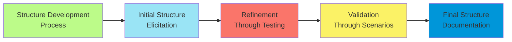

The structure determination phase often requires balancing competing concerns:

- **Complexity vs. tractability**: More complex structures may better represent reality but increase computational
  demands
- **Specificity vs. generalizability**: Highly domain-specific structures may not generalize to new cases
- **Interpretability vs. predictive power**: Simpler structures are easier to explain but may sacrifice accuracy

The final network structure should be documented with explanations of the semantic meaning of links, providing not just
the mathematical representation but also the domain reasoning behind the structural choices.

##### Eliciting Probabilities

After establishing the network structure, the next step is quantifying the probabilistic relationships through
conditional probability tables (CPTs) or distributions.

**Probability Elicitation Methods**:

1. **Direct numerical assessment**:
    - Experts provide exact numerical probabilities
    - Often challenging due to cognitive biases and numerical precision requirements
    - Most accurate for simple binary relationships
2. **Indirect elicitation techniques**:
    - **Visual methods**: Probability wheels, scales, or sliders
    - **Verbal-numerical mappings**: Converting qualitative assessments to probabilities
    - **Betting scenarios**: Framing probabilities in terms of acceptable wagers
    - **Pairwise comparisons**: Ranking relative likelihoods of outcomes
3. **Parameter estimation from data**:
    - Maximum likelihood estimation
    - Bayesian estimation with prior knowledge
    - Expectation-Maximization algorithm for incomplete data

**Challenges in Probability Elicitation**:

1. **Cognitive biases**:
    - Availability heuristic: Overestimating the probability of memorable events
    - Anchoring: Initial estimates unduly influence final assessments
    - Overconfidence: Experts provide overly narrow confidence intervals
2. **Combinatorial explosion**:
    - For a node with $n$ binary parents, $2^n$ probability values must be specified
    - Methods to address this include:
        - **Canonical models**: Noisy-OR, noisy-AND for binary variables
        - **Continuous models**: Linear Gaussian models for continuous variables
        - **Independence of causal influence (ICI)** models
        - **Context-specific independence**: Specifying identical probabilities for different parent configurations
3. **Consistency maintenance**:
    - Ensuring probabilistic assessments satisfy coherence constraints
    - Detecting and resolving inconsistencies across multiple experts
    - Reconciling elicited probabilities with observed data

A systematic elicitation process typically involves:

1. Training experts on probability concepts
2. Using multiple elicitation techniques for cross-validation
3. Iterative refinement based on feedback and consistency checking
4. Documentation of assumptions and confidence levels

For example, in medical diagnosis networks, probability elicitation might involve asking physicians questions like:

- "Given a 65-year-old male patient with diabetes, what is the probability they will develop coronary artery disease
  within 5 years?"
- "How would this probability change if the patient also has hypertension?"

The quality of these probability assessments directly impacts the network's predictive accuracy and decision-making
utility.

##### Sensitivity Analysis

Sensitivity analysis is crucial for understanding how variations in network parameters affect inference results, thereby
guiding refinement efforts and establishing confidence in the model.

**Types of Sensitivity Analysis**:

1. **One-way sensitivity analysis**:
    - Varies a single parameter while keeping others constant
    - Identifies which parameters most strongly influence outputs
    - Often visualized through tornado diagrams
2. **Multi-way sensitivity analysis**:
    - Varies multiple parameters simultaneously
    - Examines interaction effects between parameters
    - May reveal threshold effects or non-linear relationships
3. **Extreme case analysis**:
    - Sets parameters to extreme but plausible values
    - Tests model robustness under worst-case scenarios
    - Identifies potential failure modes

**Sensitivity Metrics**:

1. **Entropy reduction**: Measures information gain from parameter specification
2. **Value of information**: Quantifies how parameter precision affects decision utility
3. **Posterior probability ranges**: Shows how output probabilities vary with parameter changes
4. **Expected value sensitivity**: For decision networks, measures impact on expected utility

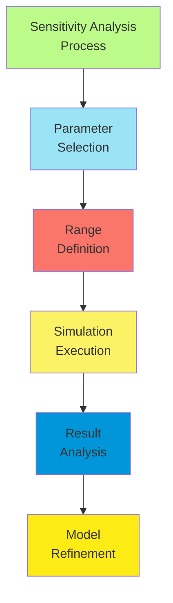

**Applications of Sensitivity Analysis**:

1. **Model refinement**:
    - Identifying parameters requiring more precise estimation
    - Prioritizing elicitation or data collection efforts
    - Simplifying network structure where appropriate
2. **Validation**:
    - Testing consistency with domain knowledge
    - Detecting modeling errors or conceptual misunderstandings
    - Building confidence in model behavior
3. **Decision robustness**:
    - Determining if decisions change under parameter variation
    - Establishing confidence intervals for outputs
    - Identifying when additional information is needed before acting

Sophisticated sensitivity analysis tools provide:

- Automated parameter sweeping across specified ranges
- Visualization of input-output relationships
- Computation of minimal parameter changes needed to alter decisions
- Integration with model documentation to highlight critical parameters

Through systematic sensitivity analysis, knowledge engineers can develop robust Bayesian networks that produce reliable
inferences even in the presence of parameter uncertainty.

##### Knowledge Engineering Tools

Specialized software tools support the development, validation, and deployment of Bayesian networks.

**Development Environments**:

1. **General-purpose Bayesian network tools**:
    - **GeNIe/SMILE**: Graphical environment with comprehensive modeling capabilities
    - **Hugin**: Commercial package with strong inference algorithms
    - **Netica**: User-friendly interface with support for decision networks
    - **BayesiaLab**: Advanced visualization and data integration features
2. **Programming libraries**:
    - **PyMC3/PyMC4**: Python libraries for probabilistic programming
    - **pgmpy**: Python library for probabilistic graphical models
    - **BUGS/JAGS/Stan**: Languages for Bayesian statistical modeling
    - **bnlearn**: R package for learning Bayesian network structure
3. **Domain-specific tools**:
    - Medical diagnosis systems with specialized ontologies
    - Financial risk assessment platforms
    - Environmental monitoring frameworks

**Key Features of Modern Tools**:

1. **Graphical model construction**:
    - Intuitive interfaces for structure specification
    - Visual probability distribution editors
    - Template mechanisms for repeated structures
2. **Inference capabilities**:
    - Multiple inference algorithms (exact and approximate)
    - Performance optimization for large-scale networks
    - Specialized inference modes (MAP, MPE, expected utility)
3. **Learning support**:
    - Parameter estimation from data
    - Structure learning algorithms
    - Integration with database systems
4. **Validation and testing**:
    - Automated sensitivity analysis
    - Cross-validation mechanisms
    - Scenario-based testing
5. **Documentation and sharing**:
    - Export formats for publication and interchange
    - Annotation capabilities for knowledge capture
    - Collaborative editing features
6. **Deployment options**:
    - API integration with existing systems
    - Web-based interfaces
    - Mobile deployment
    - Real-time inference capabilities

The choice of appropriate tools depends on factors such as:

- Size and complexity of the network
- Available expertise and training resources
- Performance requirements
- Integration with existing systems
- Budget constraints

Most knowledge engineering projects employ multiple tools across the development lifecycle:

- Rapid prototyping in user-friendly environments
- Refinement and testing in specialized tools
- Deployment through programming libraries or enterprise platforms

Advanced tools also support hybrid models combining Bayesian networks with other formalisms such as influence diagrams,
Markov decision processes, or rule-based systems.

#### Temporal Reasoning Systems

##### Dynamic Probabilistic Models

Dynamic probabilistic models extend Bayesian networks to reason about systems that evolve over time, capturing temporal
dependencies and enabling predictions of future states.

**Key Temporal Modeling Frameworks**:

1. **Dynamic Bayesian Networks (DBNs)**:
    - Represent the state of a system at multiple time slices
    - Model temporal evolution through transition probabilities
    - First-order Markov assumption: Future state depends only on current state
    - Structured representation allows efficient inference over many time steps
2. **Hidden Markov Models (HMMs)**:
    - Special case of DBNs with single hidden state variable
    - Observation variables depend only on current state
    - Widely used for sequence modeling (speech, text, biological sequences)
3. **Kalman Filters**:
    - Linear dynamic systems with Gaussian noise
    - Efficient closed-form updates for continuous variables
    - Extended and Unscented variants for non-linear dynamics
4. **Particle Filters**:
    - Sample-based representation of belief state
    - Applicable to non-linear, non-Gaussian systems
    - Adaptive sampling strategies for efficient inference

**Structural Components**:

1. **Prior network**: Represents initial state distribution $P(X_0)$
2. **Transition network**: Defines how states evolve $P(X_t|X_{t-1})$
3. **Observation network**: Models evidence at each time step $P(E_t|X_t)$
4. **Persistent structure**: Time-invariant relationships within each slice

Mathematical formulation of a DBN typically involves:

- State variables $X_t = {X_t^1, X_t^2, ..., X_t^n}$ at time $t$
- Transition model $P(X_t|X_{t-1}) = \prod_i P(X_t^i|Pa(X_t^i))$
- Observation model $P(E_t|X_t) = \prod_j P(E_t^j|Pa(E_t^j))$
- Joint distribution $P(X_{0:T}, E_{1:T}) = P(X_0)\prod_{t=1}^T P(X_t|X_{t-1})P(E_t|X_t)$

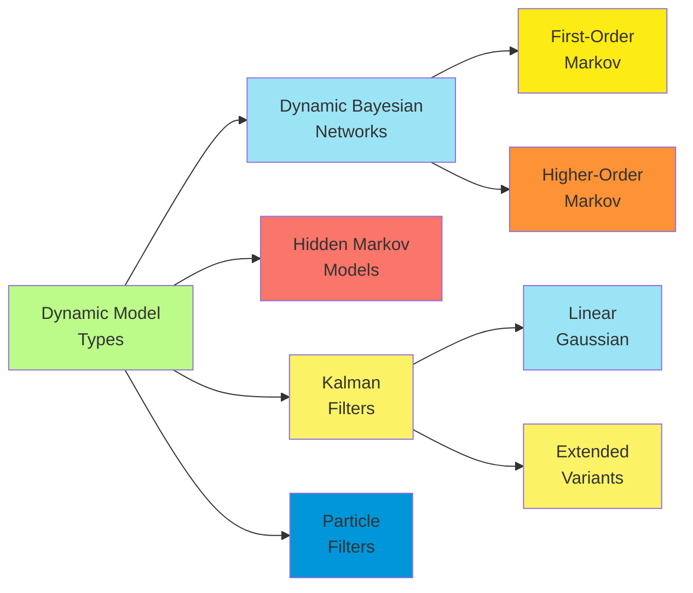

**Advanced Modeling Techniques**:

1. **Variable duration models**:
    - Semi-Markov models where state durations have explicit distributions
    - Enables modeling of processes with variable time steps
2. **Hierarchical temporal models**:
    - Multiple temporal scales represented simultaneously
    - Abstract states persist while detailed states evolve rapidly
3. **Coupled temporal models**:
    - Multiple interacting processes with different dynamics
    - Synchronization points where processes influence each other

Dynamic probabilistic models provide a principled framework for reasoning about complex temporal processes, supporting
applications ranging from robot localization to financial forecasting and disease progression modeling.

##### Reasoning with Time and Uncertainty

Probabilistic temporal reasoning systems address fundamental queries that combine uncertainty with temporal dynamics.

**Core Temporal Reasoning Tasks**:

1. **Filtering**: Estimating the current state given all observations up to the present
    - $P(X_t|e_{1:t})$
    - Applications: Real-time monitoring, tracking, state estimation
2. **Prediction**: Estimating future states given current evidence
    - $P(X_{t+k}|e_{1:t})$ for $k > 0$
    - Applications: Forecasting, planning, risk assessment
3. **Smoothing**: Refining past state estimates given all observations
    - $P(X_k|e_{1:t})$ for $0 \leq k < t$
    - Applications: Post-hoc analysis, data cleaning, anomaly detection
4. **Most likely explanation**: Finding the most probable sequence of states
    - $\arg\max_{x_{1:t}} P(x_{1:t}|e_{1:t})$
    - Applications: Speech recognition, activity recognition, fault diagnosis

**Temporal Patterns and Queries**:

1. **Point queries**: Probability of specific events at particular times
    - "What is the probability the patient will develop complications tomorrow?"
2. **Interval queries**: Probability of conditions holding over time periods
    - "What is the probability the system will remain stable for the next 8 hours?"
3. **Ordering queries**: Probability of temporal ordering between events
    - "What is the probability that symptom A will precede symptom B?"
4. **Duration queries**: Distributions over time intervals
    - "How long will the recovery phase likely last?"

**Representation of Time**:

1. **Discrete time**: System evolves in fixed time steps
    - Simplifies modeling but may require fine granularity
    - Standard approach in most Dynamic Bayesian Networks
2. **Continuous time**: Events can occur at any moment
    - More natural for many domains
    - Implemented through Continuous Time Bayesian Networks (CTBNs)
    - Mathematical foundation in continuous-time Markov processes
3. **Hybrid approaches**: Combining discrete and continuous representations
    - Event-driven transitions between discrete time slices
    - Variable time step sizes based on system dynamics

The integration of probabilistic reasoning with temporal representation enables sophisticated analyses that account for
both aleatory uncertainty (inherent randomness) and epistemic uncertainty (incomplete knowledge) as they evolve over
time.

##### Filtering and Prediction Algorithms

Efficient algorithms for filtering, prediction, and smoothing are essential for practical temporal reasoning in
probabilistic systems.

**Exact Inference Algorithms**:

1. **Forward algorithm (Filtering)**:
    - Recursively updates belief state as new evidence arrives
    - For HMMs: $\alpha_t(i) = P(X_t = i, e_{1:t}) = P(e_t|X_t = i) \sum_j \alpha_{t-1}(j) P(X_t = i|X_{t-1} = j)$
    - For general DBNs: Variable elimination within and between time slices
    - Time complexity typically linear in sequence length, exponential in state space size
2. **Forward-Backward algorithm (Smoothing)**:
    - Combines forward pass (filtering) with backward pass
    - Backward recursion:
      $\beta_t(i) = P(e_{t+1:T}|X_t = i) = \sum_j P(X_{t+1} = j|X_t = i) P(e_{t+1}|X_{t+1} = j) \beta_{t+1}(j)$
    - Smoothed estimate: $P(X_t = i|e_{1:T}) \propto \alpha_t(i) \beta_t(i)$
3. **Viterbi algorithm (Most likely sequence)**:
    - Dynamic programming approach to find optimal state sequence
    - Maintains maximum probability path to each state
    - Backtracks to reconstruct full sequence
4. **Junction tree algorithm**:
    - Generalizes exact inference to arbitrary DBN structures
    - Creates clustered representation for efficient message passing
    - Becomes intractable for complex models over many time steps

**Approximate Inference Algorithms**:

1. **Particle filtering**:
    - Represents belief state as weighted sample set
    - Prediction step: Sample next states from transition model
    - Update step: Reweight particles based on observation likelihood
    - Resampling: Replace unlikely particles with copies of likely ones
    - Advantages: Handles non-linear, non-Gaussian models; anytime algorithm
2. **Kalman filtering**:
    - Exact for linear Gaussian systems
    - Prediction step: Linear transformation of Gaussian
    - Update step: Bayesian update with Gaussian likelihood
    - Extended Kalman Filter (EKF): Local linearization for non-linear models
    - Unscented Kalman Filter (UKF): Sigma points for better non-linear approximation
3. **Rao-Blackwellized particle filtering**:
    - Hybrid approach using particles for some variables, exact inference for others
    - Exploits conditional independence to reduce sampling dimension
    - Significantly improves efficiency for structured state spaces

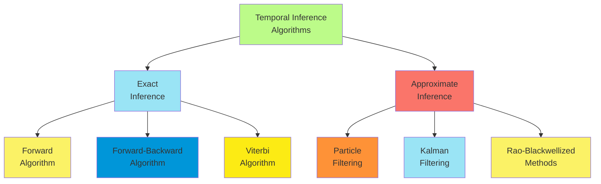

**Performance Optimization Techniques**:

1. **Factored representations**: Exploiting conditional independence in state representation
2. **Beam search**: Maintaining only most probable states in approximate Viterbi
3. **Adaptive particle counts**: Allocating more particles to complex situations
4. **Rao-Blackwellization**: Analytical integration where possible
5. **Parallel implementation**: Distributing computation across cores or machines

Selecting the appropriate algorithm depends on model characteristics (linearity, Gaussianity), state space size,
accuracy requirements, and computational constraints. Hybrid approaches often provide the best balance between accuracy
and efficiency for complex real-world applications.

##### Applications in Robotics and Finance

Temporal probabilistic reasoning systems find extensive applications in domains requiring decision-making under
uncertainty over time.

**Robotics Applications**:

1. **Simultaneous Localization and Mapping (SLAM)**:
    - Robot builds map of environment while tracking its position
    - Particle filters or extended Kalman filters model joint distribution over position and map
    - Loop closure detection through probabilistic inference
    - Handles sensor noise and motion uncertainty
2. **Motion planning under uncertainty**:
    - Partially Observable Markov Decision Processes (POMDPs) for planning
    - Belief space planning considers uncertainty in current and future states
    - Active sensing strategies to reduce uncertainty
    - Risk-aware trajectory generation
3. **Human-robot interaction**:
    - Modeling human intent and preferences over time
    - Inferring goals from observed actions
    - Adapting robot behavior based on predicted human actions
    - Learning interaction patterns through experience
4. **Fault detection and diagnosis**:
    - Monitoring system health through probabilistic models
    - Early warning of component failures
    - Distinguishing between multiple potential fault causes
    - Predicting remaining useful life of components

**Financial Applications**:

1. **Asset price modeling**:
    - Stochastic processes for price evolution
    - Hidden Markov Models for regime detection (bull/bear markets)
    - Particle filters for tracking time-varying parameters
    - Integration of multiple information sources with different timescales
2. **Risk management**:
    - Value at Risk (VaR) estimation through temporal simulation
    - Stress testing with probabilistic scenarios
    - Credit risk modeling incorporating temporal dependencies
    - Early warning systems for market instability
3. **Algorithmic trading**:
    - State estimation for market conditions
    - Adaptation to changing volatility regimes
    - Optimal execution with temporal price impact models
    - Detection of profitable trading opportunities
4. **Portfolio optimization**:
    - Dynamic asset allocation based on market state
    - Incorporating uncertainty in return predictions
    - Multi-period optimization with transaction costs
    - Adaptive strategies responding to market conditions

**Implementation Considerations**:

1. **Real-time constraints**:
    - Robotics: Millisecond-level response requirements
    - Finance: Microsecond trading decisions, overnight risk calculations
    - Approximate algorithms with guaranteed response times
    - Hardware acceleration (GPUs, FPGAs) for inference
2. **Data integration**:
    - Multiple sensor modalities in robotics
    - Diverse market data sources in finance
    - Handling different sampling rates and reliability
    - Online adaptation to changing data characteristics
3. **Model adaptation**:
    - Environment changes in robotics (weather, lighting, terrain)
    - Regime shifts in financial markets
    - Detecting when models require recalibration
    - Online learning of model parameters

These applications demonstrate how temporal probabilistic reasoning provides a principled framework for complex
decision-making under uncertainty in dynamic environments.

##### Hybrid Approaches for Complex Domains

Complex real-world domains often require hybrid approaches that combine multiple reasoning paradigms to address diverse
aspects of temporal reasoning under uncertainty.

**Integration of Multiple Model Types**:

1. **Switching state-space models**:
    - Discrete switching variable selects between different dynamic regimes
    - Each regime has its own continuous dynamics
    - Applications: Maneuvering target tracking, financial market regimes
2. **Hierarchical temporal models**:
    - Abstract states at higher levels persist longer than detailed states
    - Higher levels provide context for lower-level inference
    - Applications: Activity recognition, complex process monitoring
3. **Coupled temporal processes**:
    - Multiple interacting temporal processes with different time scales
    - Synchronization points where processes influence each other
    - Applications: Cyber-physical systems, multi-agent coordination

**Hybrid Reasoning Paradigms**:

1. **Probabilistic-logical integration**:
    - Probabilistic relational models extend over time
    - First-order logic defines structural constraints
    - Markov Logic Networks with temporal predicates
    - Applications: Activity interpretation, process verification
2. **Symbolic-numeric reasoning**:
    - Qualitative temporal reasoning for structural relationships
    - Quantitative probabilistic inference for uncertainty
    - Integration through constraint propagation
    - Applications: Plan recognition, medical monitoring
3. **Model-based and data-driven approaches**:
    - Physics-based models provide structural knowledge
    - Machine learning adapts parameters from data
    - Bayesian framework unifies prior knowledge with observed evidence
    - Applications: Environmental modeling, industrial process control

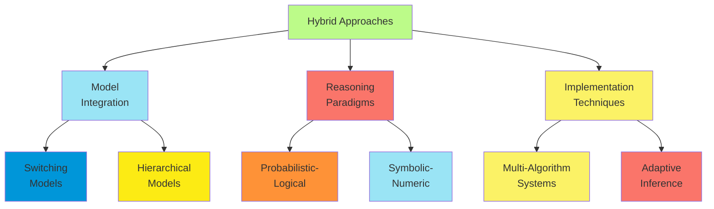

**Implementation Techniques**:

1. **Multi-algorithm inference systems**:
    - Different algorithms for different model components
    - Meta-reasoning to select appropriate algorithms
    - Message passing interfaces between components
    - Resource allocation based on computational demands
2. **Adaptive inference strategies**:
    - Switching between exact and approximate methods
    - Adjusting accuracy based on available time
    - Focusing computational resources on critical variables
    - Exploiting context-specific independence
3. **Online model adaptation**:
    - Structure learning from streaming data
    - Parameter adaptation in non-stationary environments
    - Detection of model inadequacy
    - Graceful degradation under unexpected conditions

**Challenges in Hybrid Approaches**:

1. **Theoretical foundations**:
    - Ensuring coherent semantics across different formalisms
    - Convergence properties of hybrid inference algorithms
    - Uncertainty representation across paradigms
2. **Computational complexity**:
    - Managing exponential growth in state spaces
    - Efficient inference across heterogeneous model components
    - Real-time performance with limited resources
3. **Knowledge engineering**:
    - Increased model complexity and parameter specification
    - Validation of hybrid models
    - Explaining reasoning across multiple paradigms

Despite these challenges, hybrid approaches offer the most promising path toward temporal reasoning systems that can
handle the complexity, uncertainty, and dynamism of real-world applications while maintaining computational
tractability.

#### Decision Support Systems

##### Medical Diagnosis Systems

Probabilistic reasoning systems have been particularly successful in medical diagnosis, where reasoning under
uncertainty is fundamental to clinical practice.

**Key Architectures for Medical Diagnosis**:

1. **Diagnostic Bayesian networks**:
    - Variables: Diseases, symptoms, test results, risk factors
    - Structure: Disease → Symptom causal relationships
    - Inference: Posterior disease probabilities given evidence
    - Examples: PATHFINDER (lymph node pathology), HEPAR II (liver disorders)
2. **Dynamic disease models**:
    - Temporal progression of diseases through stages
    - Treatment effects on disease trajectories
    - Monitoring protocols for disease management
    - Examples: Diabetes management systems, cancer progression models
3. **Treatment decision models**:
    - Influence diagrams extending Bayesian networks with decisions and utilities
    - Comparison of treatment alternatives
    - Value of information analysis for test selection
    - Examples: Treatment selection in oncology, antibiotic choice in infections

**Knowledge Acquisition for Medical Systems**:

1. **Expert knowledge integration**:
    - Structured elicitation from medical specialists
    - Incorporation of clinical guidelines
    - Literature-based evidence integration
    - Consensus processes for conflicting opinions
2. **Learning from clinical data**:
    - Electronic health records for parameter estimation
    - Clinical trial results for treatment effects
    - Longitudinal studies for disease progression
    - Integration of genomic data for personalization
3. **Model validation**:
    - Retrospective validation on historical cases
    - Prospective evaluation in clinical settings
    - Comparison with expert consensus
    - Sensitivity analysis for parameter uncertainty

**Clinical Integration Considerations**:

1. **Workflow integration**:
    - Embedding in electronic health record systems
    - Mobile applications for point-of-care use
    - Integration with ordering systems
    - Automated data acquisition from monitoring systems
2. **Explanation capabilities**:
    - Visualization of reasoning paths
    - Evidence-based justification of recommendations
    - Uncertainty communication appropriate for clinicians
    - Comparative explanations for treatment options
3. **Regulatory and ethical aspects**:
    - Validation requirements for clinical use
    - Liability considerations for automated recommendations
    - Transparency of reasoning process
    - Handling of edge cases and system limitations

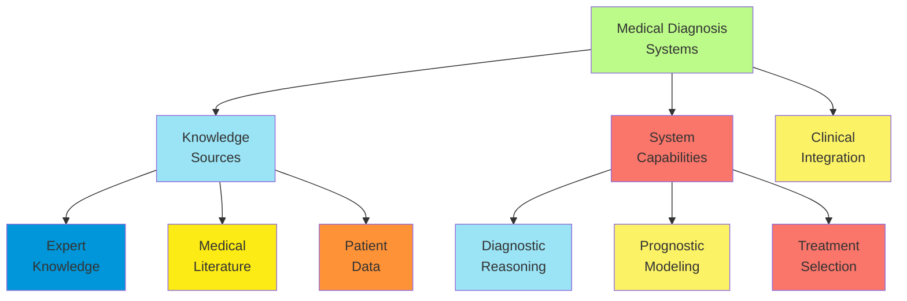

**Notable Medical Diagnostic Systems**:

1. **DXplain**:
    - Developed at Massachusetts General Hospital
    - Covers over 2,400 diseases and 5,000 clinical findings
    - Provides disease probabilities and educational content
2. **QMR (Quick Medical Reference)**:
    - Evolved from INTERNIST-1 system
    - Probabilistic reasoning over internal medicine domain
    - Bidirectional inference (diagnosis from symptoms, expected findings from diagnoses)
3. **Watson for Oncology**:
    - Combines probabilistic reasoning with natural language processing
    - Trained on cancer treatment protocols and literature
    - Provides evidence-based treatment recommendations
4. **Diagnostic decision support in radiology**:
    - Computer-aided detection/diagnosis (CAD) systems
    - Probabilistic classification of imaging findings
    - Integration of clinical information with image analysis

The most successful medical diagnostic systems combine the strengths of probabilistic reasoning with domain-specific
knowledge, providing decision support that complements rather than replaces clinical expertise while handling the
inherent uncertainty in medical decision-making.

##### Financial Decision Support

Financial domains involve complex decision-making under uncertainty with significant consequences, making them prime
candidates for probabilistic reasoning systems.

**Key Applications in Finance**:

1. **Investment decision support**:
    - Portfolio optimization under uncertainty
    - Asset allocation based on risk preferences
    - Scenario analysis for investment strategies
    - Value of information for research prioritization
2. **Risk assessment and management**:
    - Credit scoring and default prediction
    - Market risk evaluation through probabilistic simulation
    - Operational risk modeling
    - Stress testing and scenario generation
3. **Fraud detection systems**:

    - Anomaly detection in transaction patterns
    - Behavioral models of legitimate vs. fraudulent activity
    - Real-time risk scoring of activities
    - Adaptive models responding to new fraud patterns

4. **Algorithmic trading**:

    - Execution strategy optimization under uncertainty

    - Adaptation to changing market conditions

    - Risk-aware order placement and timing

**Modeling Approaches in Financial Systems**:

1. **Bayesian network models**:
    - Causal models of economic factors
    - Integration of fundamental and technical indicators
    - Expert knowledge combined with market data
    - Scenario generation through forward simulation
2. **Temporal models**:
    - Hidden Markov Models for regime detection
    - Stochastic volatility models through particle filtering
    - Dynamic term structure models for interest rates
    - Multi-timescale models combining short and long-term factors
3. **Decision-theoretic frameworks**:
    - Influence diagrams for structured decision analysis
    - Partially Observable Markov Decision Processes for sequential decisions
    - Utility theory for risk preference incorporation
    - Multi-criteria decision making with probabilistic inputs

**Data Integration Challenges**:

1. **Heterogeneous data sources**:
    - Market data at multiple frequencies
    - Fundamental company information
    - Macroeconomic indicators
    - Alternative data (satellite imagery, social media, etc.)
2. **Quality and reliability issues**:
    - Missing data and reporting delays
    - Survivorship bias in historical datasets
    - Selection bias in reported figures
    - Managing outliers and data errors
3. **Real-time processing requirements**:
    - Millisecond-level decision making in trading
    - Continuous model updating with streaming data
    - Efficient approximation algorithms
    - Distributed processing architectures

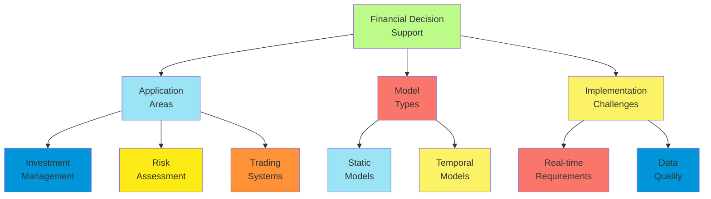

**Notable Financial Systems**:

1. **Portfolio Management Systems**:
    - BlackRock's Aladdin: Risk management and portfolio construction
    - Goldman Sachs' SIGMA-X: Dark pool trading with probabilistic matching
    - JP Morgan's LOXM: ML-based execution optimization
2. **Risk Management Platforms**:
    - RiskMetrics: Probabilistic models for market and credit risk
    - Moody's Analytics: Credit risk assessment with Bayesian models
    - SAS Risk Management: Enterprise risk modeling and simulation
3. **Trading Decision Support**:
    - Renaissance Technologies: Statistical models for quantitative trading
    - Two Sigma: Bayesian approaches to algorithmic trading
    - AQR Capital: Factor-based models with probabilistic components

Financial decision support systems must balance theoretical soundness with practical constraints, incorporating both
domain expertise and data-driven insights while handling the fundamental uncertainty inherent in financial markets.

##### Environmental Monitoring

Environmental monitoring systems employ probabilistic reasoning to track, predict, and manage complex environmental
processes with significant uncertainty.

**Core Applications**:

1. **Pollution monitoring and prediction**:
    - Air quality forecasting with uncertainty quantification
    - Source attribution for contamination events
    - Exposure risk assessment for populations
    - Optimization of sensor placement and sampling strategies
2. **Climate and weather prediction**:
    - Ensemble forecasting with probabilistic interpretation
    - Downscaling from global to local predictions
    - Extreme event prediction and early warning
    - Climate change impact assessment with uncertainty bounds
3. **Ecological system monitoring**:
    - Species distribution and population dynamics
    - Biodiversity assessment with incomplete sampling
    - Invasive species spread prediction
    - Ecosystem health indicators with confidence intervals
4. **Natural disaster management**:
    - Flood risk modeling and warning systems
    - Wildfire spread prediction and resource allocation
    - Earthquake aftershock forecasting
    - Hurricane path and intensity prediction

**Modeling Approaches**:

1. **Spatio-temporal Bayesian models**:
    - Integration of spatial and temporal correlations
    - Hierarchical models for multi-scale phenomena
    - Gaussian processes for continuous spatial fields
    - Point process models for discrete events
2. **Process-based probabilistic models**:
    - Physical models with uncertain parameters
    - Bayesian calibration to observational data
    - Uncertainty propagation through simulation
    - Multi-model ensembles with Bayesian model averaging
3. **Hybrid knowledge-data systems**:
    - Scientific knowledge encoded in model structure
    - Machine learning for parameter estimation
    - Causal modeling of environmental processes
    - Integration of heterogeneous data sources

**Implementation Challenges**:

1. **Sensor network integration**:
    - Heterogeneous sensors with varying reliability
    - Communication constraints in remote deployments
    - Adaptive sampling strategies
    - Fault detection and data quality assurance
2. **Computational demands**:
    - High-dimensional state spaces
    - Complex spatial relationships
    - Long time horizons for prediction
    - Real-time requirements for early warning
3. **Decision support interfaces**:
    - Uncertainty visualization for non-experts
    - Risk communication for public audiences
    - Integration with emergency management systems
    - Support for regulatory compliance

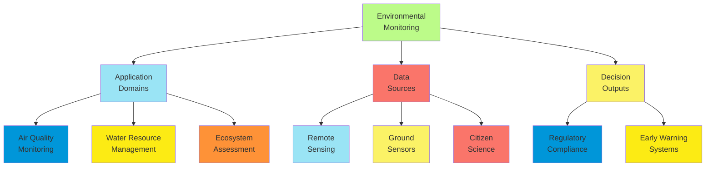

**Notable Environmental Systems**:

1. **Air quality management**:
    - EPA's CMAQ (Community Multiscale Air Quality) with uncertainty analysis
    - Urban air quality networks with Bayesian sensor fusion
    - Personal exposure assessment systems
2. **Water resource management**:
    - Flood prediction systems with ensemble forecasting
    - Groundwater contamination tracking
    - Drought monitoring and prediction platforms
3. **Climate analytics**:
    - IPCC ensemble climate projections
    - Climate impact assessment tools
    - Urban heat island monitoring networks

Environmental monitoring systems demonstrate how probabilistic reasoning can handle the complex, uncertain, and
spatially distributed nature of environmental processes, providing actionable information for policy makers, emergency
managers, and the public.

##### Explainable Recommendations

As probabilistic systems increasingly drive recommendations and decisions, explainability has become a critical
requirement for user trust and system adoption.

**Explanation Challenges in Probabilistic Systems**:

1. **Complexity of reasoning**:
    - High-dimensional joint probability distributions
    - Chains of uncertain inferences
    - Integration of multiple knowledge sources
    - Temporal reasoning over sequences of observations
2. **User diversity**:
    - Different levels of technical sophistication
    - Varying domain knowledge
    - Different explanation needs and preferences
    - Cultural and linguistic considerations
3. **Trade-offs in explanation design**:
    - Completeness vs. comprehensibility
    - Precision vs. accessibility
    - Detail vs. overview
    - Deterministic appearance vs. uncertainty communication

**Explanation Approaches**:

1. **Structural explanations**:
    - Visualization of network structure and dependencies
    - Highlighting active causal pathways
    - Comparative explanations showing alternative scenarios
    - Decision boundary visualization
2. **Evidence-based explanations**:
    - Contribution of each evidence item to conclusions
    - Most influential factors in a decision
    - Confidence assessment for recommendations
    - Contrary evidence acknowledgment
3. **Example-based explanations**:
    - Similar cases with known outcomes
    - Counterfactual examples ("what would change the recommendation")
    - Prototype examples representing typical cases
    - Boundary cases illustrating decision thresholds
4. **Interactive explanations**:
    - User-guided exploration of reasoning
    - What-if analysis with parameter adjustment
    - Drill-down from summary to detailed explanations
    - Tailored explanations based on user questions

**Implementation Techniques**:

1. **Explanation generation algorithms**:
    - Most relevant evidence selection
    - Natural language generation for explanations
    - Visualization of probabilistic reasoning
    - Abstraction methods for complex models
2. **User modeling for explanations**:
    - Adaptation to user expertise
    - Learning user explanation preferences
    - Progressive disclosure of complexity
    - Context-sensitive explanation selection
3. **Evaluation methodologies**:
    - User satisfaction measurements
    - Task performance with explanations
    - Trust calibration assessment
    - Cognitive load evaluation

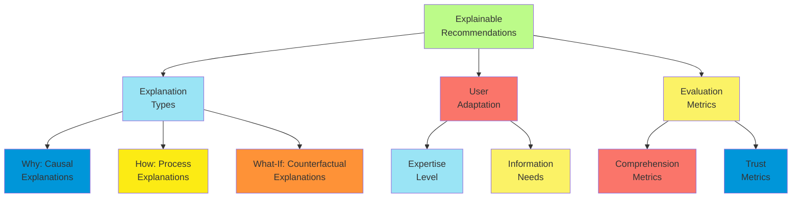

**Application-Specific Approaches**:

1. **Medical decision support**:
    - Evidence-based explanations citing literature
    - Visualization of disease probabilities
    - Treatment comparison with outcome probabilities
    - Personalized risk communication
2. **Financial recommendations**:
    - Risk-return tradeoff visualization
    - Historical performance of similar recommendations
    - Stress testing results for proposed strategies
    - Regulatory compliance justification
3. **Consumer recommendations**:
    - Feature importance in product suggestions
    - Collaborative filtering explanations ("users like you")
    - Preference-based justifications
    - Diversity explanations for recommendation sets

Effective explanation systems treat explanation not as an afterthought but as a fundamental design consideration,
developing probabilistic reasoning systems that are inherently interpretable and capable of generating appropriate
explanations for their reasoning and recommendations.

##### Risk Assessment and Management

Probabilistic reasoning systems excel at risk assessment and management across domains by quantifying uncertainties,
modeling complex dependencies, and supporting decision-making under uncertainty.

**Risk Assessment Framework**:

1. **Risk identification**:
    - Comprehensive modeling of potential risk factors
    - Causal networks capturing risk propagation paths
    - Emergent risk detection through pattern analysis
    - Expert knowledge integration for rare events
2. **Risk quantification**:
    - Probabilistic assessment of event likelihoods
    - Impact modeling with uncertainty
    - Joint probability estimation for correlated risks
    - Tail risk assessment for extreme events
3. **Risk evaluation**:
    - Expected loss calculation
    - Risk appetite and tolerance incorporation
    - Comparative risk assessment across alternatives
    - Multi-criteria risk evaluation frameworks
4. **Risk treatment**:
    - Strategy evaluation for risk reduction
    - Cost-benefit analysis of mitigation measures
    - Residual risk quantification
    - Monitoring strategy optimization

**Modeling Approaches**:

1. **Bayesian network models**:
    - Explicit representation of causal risk factors
    - Dependency modeling between risks
    - Evidence integration from multiple sources
    - Scenario generation through forward simulation
2. **Monte Carlo simulation**:
    - Sampling-based risk assessment
    - Complex system modeling with uncertain parameters
    - Historical data integration with domain knowledge
    - Multi-period simulation of risk evolution
3. **Extreme value theory**:
    - Statistical modeling of tail risks
    - Rare event simulation techniques
    - Copula methods for dependency modeling
    - Stress testing through extreme scenarios

**Application Domains**:

1. **Financial risk management**:
    - Market risk: Value-at-Risk and Expected Shortfall
    - Credit risk: Default prediction and portfolio assessment
    - Operational risk: Process failure and fraud detection
    - Systemic risk: Contagion and correlation modeling
2. **Industrial safety and reliability**:
    - Fault Tree Analysis with probabilistic parameters
    - Reliability modeling of complex systems
    - Predictive maintenance scheduling
    - Safety assessment for critical infrastructure
3. **Public health and environmental risk**:
    - Disease outbreak prediction and management
    - Environmental contamination risk assessment
    - Natural disaster impact modeling
    - Public health intervention planning
4. **Cybersecurity risk**:
    - Vulnerability assessment and prioritization
    - Attack path analysis and prevention
    - Intrusion detection with false positive management
    - Impact assessment for security incidents

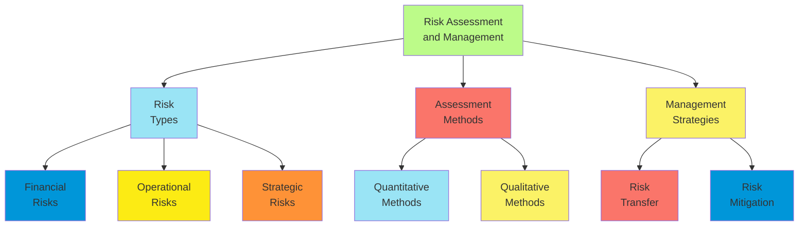

**Implementation Considerations**:

1. **Decision support interfaces**:
    - Risk dashboards with uncertainty visualization
    - Scenario analysis tools for what-if exploration
    - Early warning indicators with confidence levels
    - Drill-down capabilities for risk investigation
2. **Organizational integration**:
    - Workflow integration with business processes
    - Role-specific risk views and reports
    - Alignment with risk governance frameworks
    - Regulatory compliance documentation
3. **Continuous improvement**:
    - Performance tracking of risk assessments
    - Backtesting of probabilistic predictions
    - Model refinement based on actual outcomes
    - Emerging risk incorporation

Probabilistic reasoning provides a principled foundation for risk assessment and management, enabling organizations to
move beyond heuristic approaches to systematic, quantitative risk management that acknowledges and appropriately handles
uncertainty.

#### Inference Systems at Scale

##### Distributed Inference Algorithms

As probabilistic models grow in size and complexity, distributed inference algorithms become essential for scalable
reasoning under uncertainty.

**Distributed Inference Paradigms**:

1. **Decomposition-based approaches**:
    - Model partitioning across computational nodes
    - Message passing between subgraphs
    - Junction tree decomposition for exact inference
    - Bounded inference with limited communication
2. **Parallel sampling algorithms**:
    - Distributed Markov Chain Monte Carlo (MCMC)
    - Parallel particle filtering
    - Ensemble methods with aggregation
    - Asynchronous Gibbs sampling
3. **Map-Reduce frameworks**:
    - Batch processing of inference tasks
    - Scalable parameter learning
    - Distributed evidence propagation
    - Parallelization of independent queries

**Algorithm Categories**:

1. **Exact distributed inference**:
    - Distributed variable elimination
    - Parallel junction tree algorithms
    - MapReduce belief propagation
    - Distributed compilation to arithmetic circuits
2. **Approximate distributed inference**:
    - Distributed particle filtering
    - Parallel MCMC with occasional synchronization
    - Stochastic variational inference
    - Distributed expectation propagation
3. **Hybrid approaches**:
    - Exact inference for critical subgraphs
    - Approximate methods for less critical components
    - Dynamic resource allocation based on query importance
    - Adaptive precision based on computational constraints

**Implementation Technologies**:

1. **Cluster computing frameworks**:
    - Apache Spark for batch inference
    - Ray for distributed machine learning
    - MPI for high-performance computing applications
    - Custom frameworks for specialized inference tasks
2. **Resource management**:
    - Load balancing across heterogeneous nodes
    - Memory management for large models
    - Communication optimization to reduce network traffic
    - Fault tolerance through replication or checkpointing
3. **Hardware acceleration**:
    - GPU acceleration for parallel sampling
    - FPGA implementation for specialized inference
    - Tensor processing units for matrix operations
    - Hybrid CPU/GPU/FPGA architectures

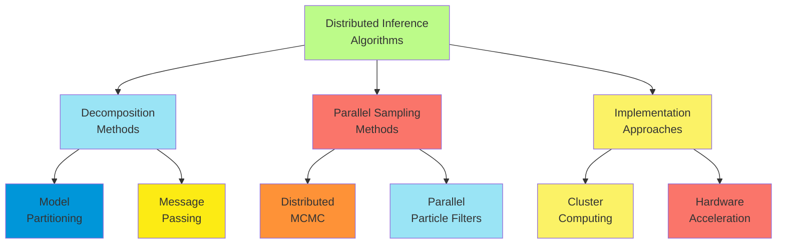

**Performance Considerations**:

1. **Scalability analysis**:
    - Strong scaling: Performance with fixed problem size
    - Weak scaling: Performance with increasing problem size
    - Communication overhead assessment
    - Memory footprint optimization
2. **Accuracy-performance tradeoffs**:
    - Error bounds for approximate methods
    - Convergence guarantees with limited iterations
    - Precision adaptation based on query importance
    - Resource allocation based on accuracy requirements
3. **Real-time constraints**:
    - Anytime algorithms with quality guarantees
    - Progressive refinement of results
    - Deadline-aware computation
    - Quality of service management

Distributed inference algorithms enable probabilistic reasoning at scales previously unattainable, supporting
applications such as social network analysis, internet-scale recommendation systems, and planetary-scale environmental
monitoring.

##### Approximate Methods for Large Networks

When exact inference becomes computationally intractable in large probabilistic networks, approximate methods provide
practical alternatives with controllable accuracy-computation tradeoffs.

**Sampling-Based Methods**:

1. **Markov Chain Monte Carlo (MCMC)**:
    - Gibbs sampling: Iterative conditional sampling of variables
    - Metropolis-Hastings: Proposal-based sampling with acceptance criterion
    - Hamiltonian Monte Carlo: Physics-inspired exploration of distribution
    - Applications: Complex Bayesian models, hierarchical structures
2. **Importance sampling**:
    - Samples from proposal distribution, weighted by importance ratio
    - Adaptive importance sampling adjusts proposal distribution
    - Sequential importance sampling for dynamic models
    - Applications: Rare event simulation, fault diagnosis
3. **Particle filtering**:
    - Sequential Monte Carlo for temporal models
    - Particle representation of belief state
    - Resampling to focus on high-probability regions
    - Applications: Object tracking, financial time series

**Variational Methods**:

1. **Mean field approximation**:
    - Factorizes joint distribution into independent components
    - Iterative optimization of approximation quality
    - Closed-form updates for many model classes
    - Applications: Topic models, large-scale classification
2. **Structured variational approximations**:
    - Preserves some dependency structure
    - Tree-structured or nested mean field approximations
    - More accurate than full mean field
    - Applications: Speech recognition, image understanding
3. **Stochastic variational inference**:
    - Scales to massive datasets through stochastic optimization
    - Mini-batch updates of variational parameters
    - Online learning capability
    - Applications: Document classification, recommendation systems

**Deterministic Approximations**:

1. **Loopy belief propagation**:
    - Applies message passing in graphs with cycles
    - May not converge but often works well in practice
    - Damping and scheduling techniques improve stability
    - Applications: Error-correcting codes, image processing
2. **Expectation propagation**:
    - Approximates local factors with exponential family distributions
    - Moment matching between approximate and true distributions
    - Iterative refinement of approximation
    - Applications: Gaussian process models, generalized linear models
3. **Approximate inference compilation**:
    - Amortized inference through neural networks
    - Trained to directly map evidence to approximate posteriors
    - Fast inference at runtime
    - Applications: Scientific simulators, perception systems

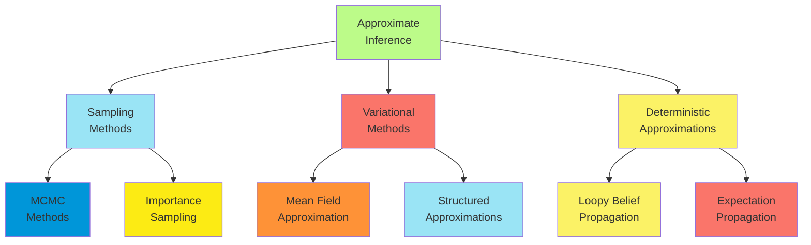

**Method Selection Criteria**:

1. **Model characteristics**:
    - Network topology (sparse vs. dense)
    - Variable types (discrete, continuous, mixed)
    - Parameter distributions (conjugate vs. non-conjugate)
    - Inference queries (marginals, MAP, expectations)
2. **Performance requirements**:
    - Accuracy needs (bounds, guarantees)
    - Computational constraints (time, memory)
    - Adaptation capability (changing evidence)
    - Explainability considerations
3. **Implementation factors**:
    - Parallelization potential
    - Hardware compatibility
    - Integration with existing systems
    - Development and maintenance costs

Approximate inference methods have enabled probabilistic reasoning in domains previously considered intractable,
balancing theoretical soundness with practical efficiency while providing principled approaches to managing the
accuracy-computation tradeoff.

##### Real-time Inference Systems

Real-time probabilistic inference systems must deliver timely results under strict time constraints while maintaining
appropriate accuracy for decision-making.

**Real-time Inference Requirements**:

1. **Temporal constraints**:
    - Hard deadlines: Results must be available by specific times
    - Soft deadlines: Value of results decreases after deadlines
    - Period constraints: Regular update intervals
    - Aperiodic triggers: Event-driven inference needs
2. **Resource limitations**:
    - Processing power constraints (embedded systems)
    - Memory limitations
    - Energy budgets (mobile devices)
    - Communication bandwidth restrictions
3. **Quality of service**:
    - Accuracy requirements for different queries
    - Confidence level specifications
    - Consistency between related inferences
    - Degradation policies when constraints cannot be met

**Inference Algorithm Adaptations**:

1. **Anytime algorithms**:
    - Provide valid results at any interruption point
    - Monotonically improving quality with computation time
    - Quality estimation during execution
    - Resource-aware computation scheduling
2. **Incremental inference**:
    - Efficient updates when evidence changes incrementally
    - Reuse of previous computation results
    - Focused propagation of changes
    - Delta maintenance in complex models
3. **Approximate inference with bounds**:
    - Error-bounded approximations
    - Confidence interval guarantees
    - Principled relaxation of precision
    - Quality-aware resource allocation

**System Architecture Components**:

1. **Preprocessing and compilation**:
    - Offline model compilation for efficient runtime inference
    - Pre-computing junction trees or elimination orders
    - Scenario-based preparation for anticipated queries
    - Learning acceleration structures from historical patterns
2. **Meta-reasoning components**:
    - Real-time scheduling of inference tasks
    - Algorithm selection based on query characteristics
    - Precision adaptation based on available time
    - Load shedding under extreme resource constraints
3. **Hardware optimization**:
    - Specialized processors for probabilistic operations
    - FPGA implementations of common inference patterns
    - GPU acceleration for parallel operations
    - Memory hierarchy optimization

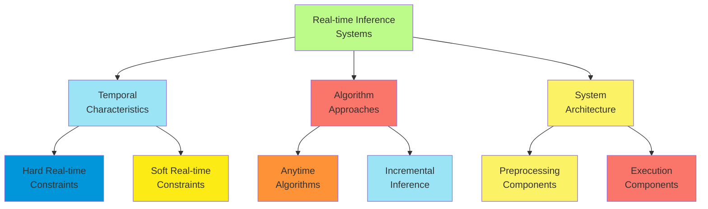

**Application Examples**:

1. **Autonomous vehicle perception**:
    - Real-time object tracking and classification
    - Sensor fusion under timing constraints
    - Risk assessment for decision making
    - Degradation strategies under computational load
2. **Financial trading systems**:
    - Millisecond-level market state inference
    - Real-time risk assessment
    - Adaptive precision based on market volatility
    - Execution strategy optimization
3. **Medical monitoring**:
    - Patient state estimation from continuous sensors
    - Alarm generation with bounded false positive rates
    - Trend analysis within response time requirements
    - Resource-aware sensor data integration
4. **Industrial control systems**:
    - Process state monitoring with safety guarantees
    - Fault detection and diagnosis in real time
    - Predictive maintenance scheduling
    - Control parameter adaptation

Real-time inference systems represent a critical frontier in probabilistic reasoning, enabling deployment in domains
where timely decision-making under uncertainty can have significant safety, financial, or operational implications.

##### Combining Logical and Probabilistic Reasoning

The integration of logical and probabilistic reasoning creates powerful hybrid systems that can represent complex
knowledge structures while handling uncertainty.

**Representation Frameworks**:

1. **Markov Logic Networks (MLNs)**:
    - First-order logic formulas with weights
    - Formula weights determine strength of constraints
    - Ground network creates Markov Random Field
    - Inference via MCMC or belief propagation
2. **Probabilistic Logic Programming**:
    - PRISM, ProbLog, BLOG extend logic programming
    - Distribution semantics for uncertain facts and rules
    - Support for recursive definitions
    - Inference through weighted model counting
3. **Bayesian Logic (BLOG)**:
    - Open universe probability models
    - Identity uncertainty and unknown objects
    - Generative model for world structures
    - Inference via MCMC methods
4. **Probabilistic Soft Logic (PSL)**:
    - Soft logic with continuous truth values
    - Efficient inference through convex optimization
    - Scalable to large-scale relational data
    - Applications in social network analysis, information extraction

**Inference Approaches**:

1. **Lifted inference**:
    - Exploiting symmetries in relational models
    - Operating on groups of indistinguishable objects
    - Avoiding grounding of complete networks
    - Exponential speedups for some model classes
2. **Knowledge compilation**:
    - Converting logical forms to circuit representations
    - Arithmetic circuits for efficient inference
    - Sentential decision diagrams (SDDs)
    - One-time compilation, repeated efficient inference
3. **Hybrid algorithms**:
    - Logical deduction for deterministic components
    - Probabilistic inference for uncertain elements
    - Constraint propagation to reduce search space
    - Logical filtering of samples in MCMC

**Application Domains**:

1. **Natural language understanding**:
    - Semantic parsing with uncertainty
    - Information extraction with logical constraints
    - Knowledge base completion
    - Question answering with probabilistic reasoning
2. **Computer vision and scene understanding**:
    - Object recognition with relational constraints
    - Activity recognition with temporal logic
    - Image interpretation with spatial relationships
    - Multi-modal reasoning (text and images)
3. **Scientific discovery**:
    - Hypothesis generation and testing
    - Causal discovery with background knowledge
    - Experimental design optimization
    - Literature-based discovery

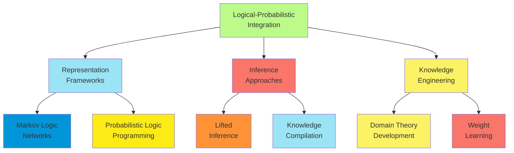

**Challenges and Ongoing Research**:

1. **Scalability issues**:
    - Combinatorial explosion in relational domains
    - Efficient inference with complex logical constraints
    - Handling large rule sets with many variables
    - Optimizing for sparse activations of rules
2. **Knowledge acquisition**:
    - Learning logical structures from data
    - Weight optimization for logical formulas
    - Combining expert knowledge with statistical learning
    - Transfer learning across domains
3. **Theoretical foundations**:
    - Semantics for open-world reasoning
    - Connections to classical logic and probability theory
    - Complexity analysis of hybrid inference
    - Convergence guarantees for approximate methods

The integration of logical and probabilistic reasoning represents a significant step toward AI systems that combine the
representational power of symbolic approaches with the uncertainty-handling capabilities of probabilistic methods.

##### Applications in Large-Scale Monitoring

Large-scale monitoring applications leverage probabilistic reasoning to detect patterns, anomalies, and trends across
distributed systems with significant uncertainty.

**Application Domains**:

1. **Network monitoring**:
    - Intrusion detection across enterprise networks
    - Performance anomaly detection
    - Root cause analysis for failures
    - Traffic pattern analysis and prediction
2. **Environmental monitoring**:
    - Pollution tracking across sensor networks
    - Weather pattern monitoring and prediction
    - Ecosystem health assessment
    - Natural disaster early warning systems
3. **Infrastructure monitoring**:
    - Power grid stability assessment
    - Transportation network status tracking
    - Water distribution system monitoring
    - Building management systems
4. **Public health surveillance**:
    - Disease outbreak detection
    - Syndromic surveillance
    - Drug safety monitoring
    - Healthcare resource utilization tracking

**System Architecture Components**:

1. **Distributed sensing layer**:
    - Heterogeneous sensor networks
    - Data quality assessment
    - Local preprocessing and filtering
    - Edge computing for initial analysis
2. **Data integration middleware**:
    - Temporal alignment of observations
    - Spatial interpolation for missing data
    - Multi-modal data fusion
    - Uncertainty representation in integrated data
3. **Inference engine**:

    - Hierarchical model structure
    - Distributed inference algorithms
    - Adaptive computation allocation
    - Real-time and batch processing modes

4. **Decision support interface**:

    - Alert generation with confidence levels

    - Visualization of system state and uncertainties

    - Explanation of detected anomalies

    - Decision recommendations with risk assessment

**Modeling Approaches**:

1. **Hierarchical Bayesian models**:
    - Multi-level structure matching organizational or physical hierarchy
    - Parameter sharing across related components
    - Global patterns with local variations
    - Computational decomposition for scalability
2. **Spatio-temporal models**:
    - Gaussian processes for continuous spatial fields
    - Point process models for discrete events
    - Multi-resolution approaches for efficiency
    - Boundary modeling for administrative divisions
3. **Anomaly detection frameworks**:
    - Probabilistic definitions of normal behavior
    - Statistical significance of deviations
    - Accounting for multiple hypothesis testing
    - Learning normal patterns from historical data

**Implementation Challenges**:

1. **Scale and performance**:
    - Millions to billions of monitoring points
    - Continuous data streams requiring real-time processing
    - Historical data analysis for pattern learning
    - Efficient storage of probabilistic state information
2. **Reliability and robustness**:
    - Fault tolerance in distributed components
    - Degraded mode operation during partial failures
    - Consistency of distributed inference
    - Recovery from communication interruptions
3. **Adaptivity requirements**:
    - Evolving normal patterns over time
    - Detection of novel anomaly types
    - Incorporation of user feedback
    - Adjustment to changing monitoring priorities

**Notable Systems**:

1. **BayesDB (MIT)**:
    - Probabilistic database for large-scale data analysis
    - SQL-like interface for probabilistic queries
    - Automated model discovery and selection
    - Applications in environmental and scientific data analysis
2. **Prometheus with probabilistic extensions**:
    - Time-series monitoring platform
    - Statistical anomaly detection
    - Probabilistic alerting with confidence levels
    - Scalable architecture for enterprise deployment
3. **NASA's ICARUS system**:
    - Aviation safety monitoring
    - Bayesian anomaly detection in flight data
    - Precursor identification for safety incidents
    - Integration of heterogeneous data sources
4. **Google's Monarch monitoring**:
    - Global-scale time series database
    - Probabilistic alerting framework
    - Distributed inference for service health
    - Automatic anomaly detection

Large-scale monitoring systems demonstrate how probabilistic reasoning can be deployed at scale to provide actionable
insights from vast, heterogeneous, and uncertain data sources, supporting critical infrastructure management, public
health, and environmental protection.

#### Learning in Probabilistic Systems

##### Parameter Estimation from Data

Parameter estimation is the process of determining probabilistic model parameters from observed data, enabling systems
to adapt to specific domains and improve with experience.

**Estimation Frameworks**:

1. **Maximum Likelihood Estimation (MLE)**:
    - Selects parameters maximizing the probability of observed data
    - For Bayesian networks: $\hat{\theta} = \argmax_{\theta} P(D|\theta)$
    - Closed-form solutions for many standard distributions
    - May overfit with limited data
2. **Bayesian Parameter Estimation**:
    - Computes posterior distribution over parameters: $P(\theta|D) \propto P(D|\theta)P(\theta)$
    - Incorporates prior knowledge through $P(\theta)$
    - Results in distribution rather than point estimate
    - Naturally handles uncertainty in parameter values
3. **Maximum a Posteriori (MAP) Estimation**:
    - Selects most probable parameter values given data and prior:
      $\hat{\theta} = \argmax_{\theta} P(D|\theta)P(\theta)$
    - Compromise between MLE and full Bayesian approach
    - Reduces overfitting through regularization effect of prior
    - Often computationally simpler than full Bayesian inference

**Estimation Algorithms**:

1. **For complete data**:
    - Direct counting for discrete variables
    - Sufficient statistics for exponential family distributions
    - Closed-form updates for conjugate models
    - Efficient implementations for large datasets
2. **For incomplete data**:
    - Expectation Maximization (EM) algorithm
        - E-step: Compute expected sufficient statistics
        - M-step: Update parameters using these expectations
        - Guaranteed convergence to local optimum
    - Data augmentation methods
    - Monte Carlo methods for complex models
3. **Online learning approaches**:
    - Incremental parameter updates with new data
    - Stochastic approximation methods
    - Forgetting mechanisms for non-stationary environments
    - Bounded memory requirements for streaming data

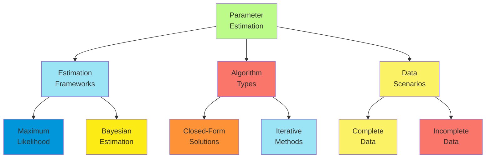

**Practical Considerations**:

1. **Prior selection**:
    - Informative priors from domain knowledge
    - Weakly informative priors for regularization
    - Non-informative priors when prior knowledge is limited
    - Hierarchical priors for grouped parameters
2. **Computational efficiency**:
    - Exploiting model structure for efficient updates
    - Parallel implementation for large datasets
    - Approximate methods for complex models
    - Trade-offs between accuracy and speed
3. **Evaluation and validation**:
    - Cross-validation for predictive performance
    - Posterior predictive checks
    - Sensitivity analysis to prior specifications
    - Calibration assessment for probability estimates

Parameter estimation transforms generic probabilistic models into domain-specific reasoning systems that reflect
patterns in observed data while incorporating prior knowledge and maintaining principled uncertainty representation.

##### Structure Learning Algorithms

Structure learning algorithms discover the graph structure of probabilistic models from data, identifying dependencies
between variables without requiring complete expert specification.

**Approaches to Structure Learning**:

1. **Constraint-based methods**:
    - Test conditional independence relationships in data
    - Build graph consistent with observed independencies
    - Algorithm examples: PC, FCI, MMPC
    - Strengths: Can identify causal structure under assumptions
2. **Score-based methods**:
    - Define scoring function for candidate structures
    - Search for structure maximizing the score
    - Common scores: BIC, AIC, Bayesian score (BDe)
    - Strengths: Flexible optimization objective
3. **Hybrid methods**:
    - Constraint-based algorithms for skeleton identification
    - Score-based optimization for orientation and refinement
    - Examples: MMHC, Hybrid HPC
    - Strengths: Combines advantages of both approaches

**Search Strategies**:

1. **Exact search methods**:
    - Dynamic programming for optimal structures
    - Branch and bound algorithms
    - Integer programming formulations
    - Limited to small networks due to computational complexity
2. **Local search methods**:
    - Greedy hill-climbing with random restarts
    - Tabu search with forbidden operations
    - Simulated annealing for escaping local optima
    - Genetic algorithms for population-based search
3. **Constraint optimization**:
    - Formulate as constraint satisfaction problem
    - Apply constraint propagation techniques
    - Use specialized solvers for structure constraints
    - Efficiently prune large portions of search space

**Handling Learning Challenges**:

1. **Limited data**:
    - Bayesian approaches with structure priors
    - Regularization to prevent overfitting
    - Ensemble methods over multiple structures
    - Knowledge-guided learning with constraints
2. **Hidden variables**:
    - Structural EM for simultaneous structure and parameter learning
    - Latent variable introduction methods
    - Model selection for hidden variable cardinality
    - Causal discovery with latent confounders
3. **Non-stationarity**:
    - Change point detection for structure shifts
    - Online structure adaptation
    - Time-varying graph structures
    - Forgetting mechanisms for historical data

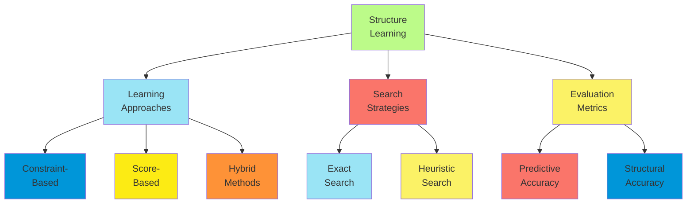

**Special Structure Types**:

1. **Causal discovery**:
    - Methods: PC, FCI, LiNGAM, NOTEARS
    - Requires additional assumptions (e.g., causal sufficiency)
    - Identifies direction of causality beyond mere association
    - Applications: Scientific discovery, policy analysis
2. **Dynamic Bayesian Network structure**:
    - Learning temporal dependencies
    - Constraints for temporal causality
    - Stationarity assumptions
    - Applications: Time series analysis, process monitoring
3. **Hierarchical structures**:
    - Learning at multiple abstraction levels
    - Module discovery in complex systems
    - Nested latent variable structures
    - Applications: Biological pathways, organizational modeling

Structure learning enables discovery of complex dependency patterns from data, reducing reliance on complete expert
specification while potentially revealing unexpected relationships. The learned structures provide interpretable models
of domains that support both prediction and understanding.

##### Transfer Learning in Probabilistic Models

Transfer learning enables leveraging knowledge from source domains to improve learning and inference in target domains,
particularly valuable when target domain data is limited.

**Transfer Learning Paradigms**:

1. **Parameter transfer**:
    - Share parameters between related variables across domains
    - Use source domain posteriors as priors for target domain
    - Hierarchical models with domain-specific and shared parameters
    - Applications: Adapting medical models across populations
2. **Structure transfer**:
    - Transfer graph structure between domains
    - Adapt local structures while preserving global patterns
    - Identify and transfer subgraphs representing reusable knowledge
    - Applications: Sensor network modeling across environments
3. **Feature-based transfer**:
    - Learn domain-invariant features or sufficient statistics
    - Map variables between domains with different representations
    - Abstraction to transferable higher-level concepts
    - Applications: Cross-domain recommendation systems
4. **Instance transfer**:
    - Reweight source domain instances for target relevance
    - Importance sampling from source to target distribution
    - Active selection of transferable instances
    - Applications: Sentiment analysis across product categories

**Transfer Mechanisms**:

1. **Bayesian transfer learning**:
    - Hierarchical Bayesian models with shared hyperpriors
    - Mixture models for multiple source domains
    - Nonparametric Bayesian methods for flexible transfer
    - Explicit modeling of domain shifts
2. **Knowledge-based transfer**:
    - Expert-guided mapping between domains
    - Transfer of qualitative constraints or relationships
    - Causal knowledge preservation across domains
    - Integration of domain theories with data-driven learning
3. **Meta-learning approaches**:
    - Learning to learn across multiple domains
    - Few-shot adaptation to new domains
    - Model-agnostic meta-learning for probabilistic models
    - Meta-priors for rapid adaptation

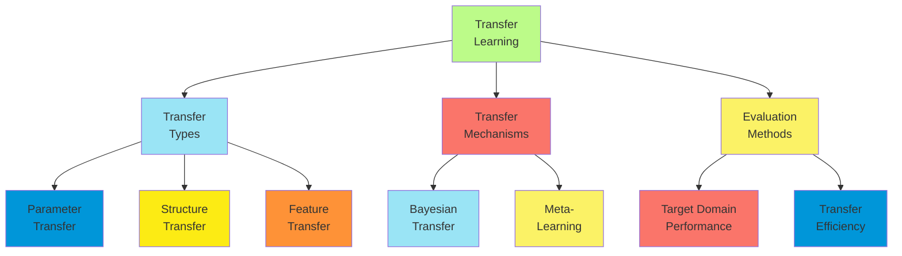

**Challenges and Solutions**:

1. **Negative transfer**:
    - Detection of inappropriate transfer
    - Selective transfer of beneficial knowledge
    - Robustness to domain differences
    - Reversible transfer mechanisms
2. **Domain shift quantification**:
    - Measuring distributional differences between domains
    - Explicit modeling of domain divergence
    - Adaptation mechanisms proportional to shift magnitude
    - Continuous monitoring of domain relationships
3. **Scalability with multiple sources**:
    - Efficient integration of knowledge from many domains
    - Source domain selection and weighting
    - Distributed transfer learning algorithms
    - Incremental adaptation with new source domains

**Application Examples**:

1. **Medical diagnosis across populations**:
    - Transfer from data-rich to data-poor demographics
    - Adaptation of disease models to new geographic regions
    - Personalization from population-level models
    - Knowledge transfer across related medical conditions
2. **Environmental modeling**:
    - Transfer between geographic locations
    - Adaptation across different sensor configurations
    - Knowledge sharing between related environmental processes
    - Temporal transfer for seasonal patterns
3. **Financial modeling**:
    - Cross-market prediction models
    - Transfer across asset classes
    - Adaptation to regime changes
    - Risk model transfer between institutions

Transfer learning significantly improves the data efficiency of probabilistic models and enables application in domains
with limited labeled data by leveraging knowledge from related tasks, resulting in faster learning and better
performance.

##### Online Learning in Dynamic Environments

Online learning enables probabilistic systems to continuously adapt to changing environments, incorporating new data
sequentially without complete retraining.

**Online Learning Scenarios**:

1. **Data stream processing**:
    - Observations arrive sequentially over time
    - Limited or no storage of historical data
    - Real-time update requirements
    - Applications: Sensor networks, clickstream analysis
2. **Non-stationary environments**:
    - Underlying distributions change over time
    - Concept drift detection and adaptation
    - Balancing stability and plasticity
    - Applications: User preference modeling, financial markets
3. **Incremental deployment**:
    - Initial deployment with limited data
    - Progressive improvement with experience
    - Continuous validation and refinement
    - Applications: Recommender systems, intelligent assistants

**Online Learning Approaches**:

1. **Bayesian sequential updating**:
    - Prior distribution + new data → updated posterior
    - Conjugate models for efficient updates
    - Particle filtering for complex models
    - Variational methods for approximate posterior tracking
2. **Online EM algorithms**:
    - Incremental update of sufficient statistics
    - Stochastic approximation for parameter convergence
    - Mini-batch processing for efficiency
    - Adaptive learning rates for changing environments
3. **Sliding window methods**:
    - Focus on recent observations
    - Fixed or adaptive window sizes
    - Exponential forgetting of older data
    - Explicit models of temporal relevance
4. **Change detection integrations**:
    - Explicit monitoring for distribution shifts
    - Model reset or adaptation upon change detection
    - Multiple model tracking for regime switching
    - Different adaptation rates for different parameters

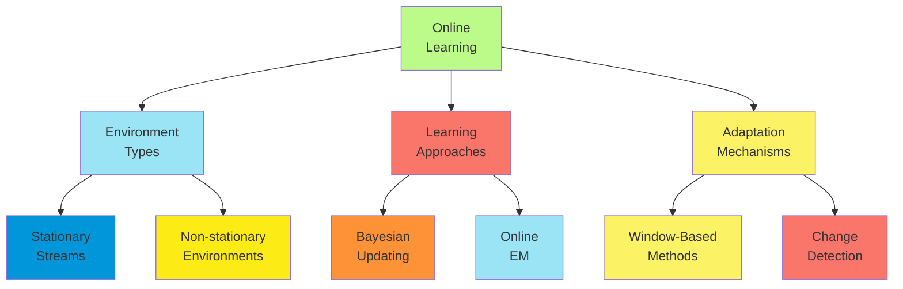

**Algorithm Design Considerations**:

1. **Memory efficiency**:
    - Sufficient statistic representations
    - Forgetting mechanisms for bounded memory
    - Sparse representations for high-dimensional spaces
    - Incremental computation of model components
2. **Computational efficiency**:
    - Constant-time updates independent of data history
    - Amortized analysis for occasional restructuring
    - Approximate methods with guaranteed error bounds
    - Anytime algorithms for time-constrained updates
3. **Robustness requirements**:
    - Handling of outliers and noise
    - Recovery from concept drift
    - Graceful degradation under resource constraints
    - Consistency under irregular observation patterns

**Advanced Techniques**:

1. **Online structure adaptation**:
    - Incremental structure search
    - Dynamic addition/removal of variables
    - Continuous model selection
    - Adaptive complexity based on data characteristics
2. **Meta-learning for adaptation**:
    - Learning optimal adaptation rates
    - Automatic selection of window sizes
    - Self-tuning algorithms
    - Learning when to reset vs. when to adapt
3. **Distributed online learning**:
    - Parallel update of model components
    - Consensus algorithms for distributed systems
    - Asynchronous updating with consistency guarantees
    - Communication-efficient protocols

Online learning enables probabilistic systems to remain accurate and relevant in dynamic environments, adapting to
changing patterns while maintaining principled uncertainty representation and avoiding catastrophic forgetting of useful
historical knowledge.

##### Evaluation of Learned Probabilistic Systems

Rigorous evaluation frameworks are essential for assessing the quality, reliability, and utility of learned
probabilistic systems.

**Evaluation Dimensions**:

1. **Predictive accuracy**:
    - Log-likelihood on test data
    - Calibration of probability estimates
    - Classification/regression error metrics
    - Specialized metrics for structured prediction
2. **Structural accuracy**:
    - Recovery of true dependencies (for synthetic data)
    - Comparison with expert-designed structures
    - Stability of learned structures across data samples
    - Causal accuracy for interventional predictions
3. **Inference quality**:
    - Accuracy of posterior marginals
    - Efficiency of inference algorithms
    - Convergence properties
    - Performance under resource constraints
4. **Decision quality**:
    - Expected utility of decisions based on inferences
    - Regret analysis compared to optimal decisions
    - Robustness to model misspecification
    - Value of information metrics

**Evaluation Methodologies**:

1. **Cross-validation approaches**:
    - K-fold for parameter stability assessment
    - Temporal cross-validation for time series
    - Stratified sampling for imbalanced data
    - Leave-one-out for small datasets
2. **Simulation-based evaluation**:
    - Known ground truth generation
    - Controlled parameter settings
    - Systematic variation of data characteristics
    - Sensitivity analysis to assumptions
3. **Comparative evaluation**:
    - Benchmark datasets with established results
    - Comparison with alternative modeling approaches
    - Ablation studies isolating contribution of components
    - Analysis of performance-complexity tradeoffs

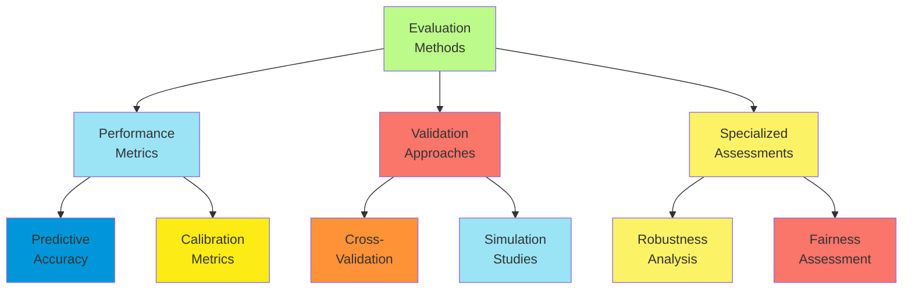

**Advanced Evaluation Concerns**:

1. **Robustness assessment**:
    - Performance under distribution shift
    - Sensitivity to hyperparameters
    - Resilience to adversarial examples
    - Graceful degradation with missing data
2. **Fairness and bias evaluation**:
    - Group fairness across protected attributes
    - Individual fairness for similar cases
    - Counterfactual fairness analysis
    - Bias in learned structures and parameters
3. **Explanation quality**:
    - Faithfulness of explanations to model behavior
    - Comprehensibility to target users
    - Consistency across similar instances
    - Completeness of causal accounts

**Practical Implementation**:

1. **Evaluation pipelines**:
    - Automated testing frameworks
    - Continuous evaluation during development
    - Standardized metrics and protocols
    - Version control for models and evaluations
2. **Monitoring in deployment**:
    - Performance drift detection
    - Distribution shift alerts
    - Model health indicators
    - A/B testing for updates
3. **Documentation standards**:
    - Model cards describing limitations
    - Datasheets for training datasets
    - Intended use specification
    - Performance characteristics under different conditions

Rigorous evaluation frameworks ensure that learned probabilistic systems meet their intended purposes, with
well-characterized performance and limitations, enabling appropriate application and ongoing improvement in real-world
settings.
