# C-19 | S-4: Advanced Topics in Uncertainty

1. Decision Theory and Ethics
    - Fairness in Decision Making
    - Handling Value Uncertainty
    - Ethical Considerations in Utility Design
    - Group Decision Making
    - Accountability in Automated Decisions
2. Computational Complexity of Reasoning
    - Tractable and Intractable Inference Problems
    - Hardness Results for Probabilistic Inference
    - Complexity Classes for Decision Problems
    - Approximation Guarantees
    - Practical Performance vs. Theoretical Bounds
3. Multi-agent Reasoning under Uncertainty
    - Distributed Belief Updates
    - Reasoning about Other Agents' Beliefs
    - Strategic Information Revelation
    - Collaborative Filtering and Decision Making
    - Applications in Autonomous Systems
4. Non-standard Models of Uncertainty
    - Dempster-Shafer Theory
    - Possibility Theory
    - Imprecise Probabilities
    - Quantum Probabilities
    - Applications of Alternative Uncertainty Models
5. Cognitive Models of Reasoning
    - Human Reasoning Under Uncertainty
    - Biases and Heuristics
    - Psychological Models of Decision Making
    - Computational Models of Human Judgment
    - Implications for AI System Design

#### Decision Theory and Ethics

##### Fairness in Decision Making

Decision making under uncertainty involves not only accuracy and utility maximization but also fundamental
considerations of fairness. Probabilistic reasoning systems can inadvertently perpetuate or amplify societal biases when
their outputs impact individuals or groups differentially.

Several formal definitions of fairness have emerged to address these concerns:

**Group Fairness Metrics**:

- **Demographic Parity**: Requires that decisions be independent of protected attributes (e.g., race, gender).
  Mathematically, for decision D and protected attribute A: P(D=1|A=a) = P(D=1|A=b) for all values a, b.
- **Equalized Odds**: Requires equal true positive and false positive rates across protected groups. For decision D,
  outcome Y, and protected attribute A: P(D=1|Y=y,A=a) = P(D=1|Y=y,A=b) for all y, a, b.
- **Predictive Parity**: Requires equal positive predictive values across groups. P(Y=1|D=1,A=a) = P(Y=1|D=1,A=b).

**Individual Fairness Concepts**:

- **Similar Treatment**: Similar individuals should receive similar decisions.
- **Counterfactual Fairness**: A decision is fair if it would be the same in a counterfactual world where the
  individual's protected attributes were different.
- **Fairness Through Awareness**: Explicitly accounts for protected attributes to ensure fair outcomes.

The implementation of fairness in probabilistic systems introduces several technical challenges:

1. **Impossibility Theorems**: Multiple fairness criteria cannot be simultaneously satisfied except in degenerate cases.
2. **Fairness-Accuracy Trade-offs**: Enforcing fairness constraints often reduces predictive accuracy.
3. **Long-term Impact**: Short-term fairness measures may have unexpected long-term consequences.
4. **Data Biases**: Historical data often contains societal biases that models might learn and perpetuate.

Approaches to implementing fairness in probabilistic decision systems include:

- **Pre-processing**: Transforming training data to remove biases before model training.
- **In-processing**: Modifying learning algorithms to incorporate fairness constraints.
- **Post-processing**: Adjusting model outputs to satisfy fairness criteria.
- **Causal Modeling**: Using causal inference to identify and mitigate sources of unfairness.

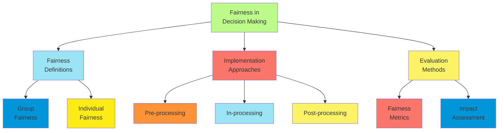

Real-world applications require careful consideration of the specific fairness criteria relevant to the domain. For
example, in criminal justice, equalizing false positive rates across groups may be critical, while in lending, ensuring
similar approval rates for qualified applicants across groups might be prioritized.

The field continues to evolve as researchers develop more nuanced fairness definitions and techniques to balance
competing ethical considerations within the framework of probabilistic decision making.

##### Handling Value Uncertainty

Value uncertainty refers to uncertainty about the appropriate utility function to apply when making decisions. Unlike
traditional uncertainty about states of the world, value uncertainty concerns our incomplete knowledge about what
outcomes should be preferred.

**Sources of Value Uncertainty**:

1. **Preference Elicitation Challenges**:
    - Inconsistent human preferences
    - Context-dependence of utilities
    - Difficulty articulating complex values
    - Strategic misrepresentation of preferences
2. **Moral Uncertainty**:
    - Uncertainty about which ethical framework to apply
    - Competing moral principles with different implications
    - Weighing consequentialist vs. deontological considerations
    - Cultural and contextual variation in values
3. **Multiple Stakeholders**:
    - Different stakeholders with conflicting values
    - Aggregation challenges for group utilities
    - Power imbalances in preference representation
    - Intertemporal considerations between present and future stakeholders

**Approaches to Handling Value Uncertainty**:

1. **Robust Decision Making**:
    - Maximin approach: Maximize the minimum utility across possible value functions
    - Minimax regret: Minimize the maximum regret relative to optimal decisions
    - Satisficing: Find decisions that meet minimal thresholds across all value functions
    - Robust optimization with bounded value uncertainty
2. **Meta-Normative Frameworks**:
    - Expected moral value: Probability-weighted average across moral theories
    - Moral hedging: Balancing decisions across different value systems
    - Maximizing expected choice-worthiness across theories
    - Variance normalization for incomparable value scales
3. **Value Learning**:
    - Inverse reinforcement learning from human decisions
    - Active preference elicitation with uncertainty reduction
    - Cooperative inverse reinforcement learning (CIRL)
    - Multi-agent value alignment through interaction
4. **Value of Value Information**:
    - Quantifying the decision value of reducing value uncertainty
    - Optimal allocation of resources to preference elicitation
    - Sequential value refinement strategies
    - Interactive preference specification

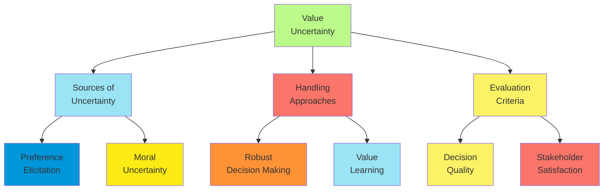

**Practical Implementations**:

1. **Healthcare Decision Support**:
    - Incorporating patient values in treatment recommendations
    - Balancing quality of life vs. survival time
    - Addressing diversity in cultural values around end-of-life care
    - Managing uncertainty in surrogate decision-maker preferences
2. **AI Alignment**:
    - Building AI systems robust to misspecified utility functions
    - Learning complex human values from demonstrations
    - Corrigibility: Allowing for future value corrections
    - Managing the exploration-exploitation tradeoff in value learning
3. **Public Policy Analysis**:
    - Multiple stakeholder value representation
    - Robust policy design under contested values
    - Procedural fairness in value elicitation
    - Transparency in value aggregation methods

The challenge of value uncertainty remains one of the most profound issues in decision theory, particularly as AI
systems gain greater autonomy and impact on human welfare. Addressing it requires integration of technical approaches
with philosophical insights about the nature of value, preferences, and ethical principles.

##### Ethical Considerations in Utility Design

The design of utility functions for decision-making systems embeds ethical choices that profoundly influence system
behavior and outcomes. As probabilistic systems increasingly drive consequential decisions, careful utility design
becomes an ethical imperative.

**Foundational Issues in Utility Design**:

1. **Ethical Frameworks and Utility**:
    - Consequentialist approaches: Mapping outcomes to utility values
    - Deontological constraints: Incorporating rights and duties as constraints
    - Virtue ethics: Designing utilities that promote virtuous agent behavior
    - Pluralist approaches: Balancing multiple ethical considerations
2. **Value Commensurability**:
    - The challenge of measuring diverse values on common scales
    - Lexicographic preferences: Some values infinitely outweigh others
    - Rights violations as lexical constraints
    - Bounded utility functions to prevent infinite value trade-offs
3. **Interpersonal Utility Comparisons**:
    - The philosophical challenge of comparing utility across individuals
    - Welfarist approaches: Focus on well-being measures
    - Capability approaches: Focus on expanding human capabilities
    - Distributional concerns: Prioritizing less advantaged individuals

**Practical Design Challenges**:

1. **Proxies and Surrogates**:
    - The inevitable gap between true values and measurable proxies
    - Goodhart's Law: When a measure becomes a target, it ceases to be a good measure
    - Gaming and specification gaming in reinforcement learning
    - Designing robust proxies resistant to manipulation
2. **Temporal Aspects**:
    - Discounting future utilities and intergenerational justice
    - Hyperbolic vs. exponential discounting
    - Non-stationary preferences over time
    - Planning horizons and terminal value estimates
3. **Uncertainty in Outcomes**:
    - Risk aversion in utility design
    - Ambiguity aversion for deeply uncertain outcomes
    - Precautionary principles for irreversible harms
    - Prioritizing robustness over expected utility maximization

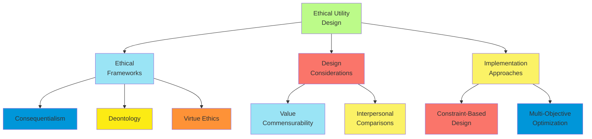

**Implementation Approaches**:

1. **Constrained Optimization**:
    - Hard constraints on prohibited actions
    - Safe reinforcement learning with boundary conditions
    - Barrier functions to prevent unsafe states
    - Regularization terms to discourage unethical behavior
2. **Multi-Objective Approaches**:
    - Maintaining separate objectives without forced aggregation
    - Pareto-optimal solution identification
    - Interactive exploration of trade-off surfaces
    - Preference articulation during decision process
3. **Participatory Design**:
    - Stakeholder involvement in utility function design
    - Democratizing the specification of values
    - Procedural fairness in value elicitation
    - Deliberative approaches to value conflicts

**Application Examples**:

1. **Healthcare Resource Allocation**:
    - Quality-Adjusted Life Years (QALYs) and their ethical implications
    - Disability weights and ableist assumptions
    - Age weighting and age discrimination concerns
    - Rare disease treatments and rule of rescue considerations
2. **Autonomous Vehicle Decision Making**:
    - Trolley problem scenarios and implicit value judgments
    - Balancing passenger vs. pedestrian safety
    - Responsibility attribution for harm
    - Transparency requirements for embedded ethics
3. **Content Recommendation Systems**:
    - Short-term engagement vs. long-term user welfare
    - Filter bubbles and exposure diversity
    - Addiction potential and compulsive usage patterns
    - Individual vs. societal impacts of information flow

Ethical utility design requires ongoing dialogue between technical experts, ethicists, stakeholders, and the broader
public. It represents a critical frontier where technical implementation meets profound questions of value and social
impact.

##### Group Decision Making

Group decision making under uncertainty introduces distinct challenges beyond individual decision making, particularly
when group members have different beliefs, values, or risk preferences.

**Theoretical Frameworks**:

1. **Social Choice Theory**:
    - Arrow's Impossibility Theorem: No voting system can simultaneously satisfy all reasonable fairness criteria
    - Condorcet Paradox: Cyclical group preferences despite transitive individual preferences
    - Voting paradoxes and manipulation vulnerabilities
    - Implications for belief and preference aggregation
2. **Bayesian Group Decision Making**:
    - Pooling individual probability distributions
    - Linear opinion pools: weighted averages of individual probabilities
    - Logarithmic opinion pools: weighted geometric means of probabilities
    - Supra-Bayesian approaches: treating others' beliefs as evidence
3. **Game-Theoretic Approaches**:
    - Strategic reporting of beliefs and preferences
    - Mechanism design for truthful revelation
    - Nash equilibria in group deliberation
    - Reputation effects in repeated decision settings

**Aggregation Mechanisms**:

1. **Belief Aggregation**:
    - Challenges in combining probabilistic beliefs
    - The "wisdom of crowds" effect for independent judgments
    - Correlation and herding in group beliefs
    - Expert weighting and calibration approaches
2. **Preference Aggregation**:
    - Voting systems: plurality, approval, Borda count, etc.
    - Social welfare functions
    - Fair division algorithms
    - Pareto efficiency and other optimality criteria
3. **Hybrid Systems**:
    - Deliberative polling
    - Delphi method and structured expert elicitation
    - Prediction markets for belief aggregation
    - Participatory value specification

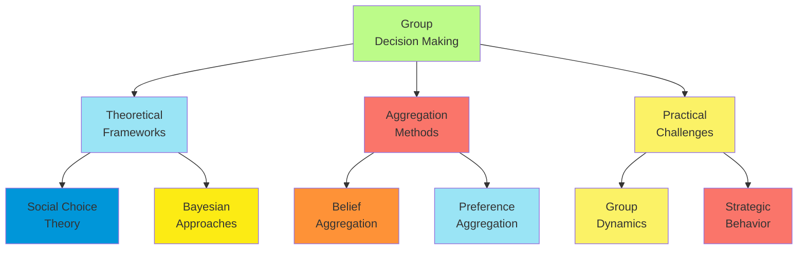

**Practical Challenges**:

1. **Group Dynamics**:
    - Information cascades and groupthink
    - Status and power differentials in deliberation
    - Hidden profiles problem: Unique information not shared
    - Polarization in group discussion
2. **Procedural Considerations**:
    - Agenda setting and framing effects
    - Deliberation structures and facilitation
    - Time constraints and decision quality
    - Documentation and justification requirements
3. **Implementation in AI Systems**:
    - Multi-stakeholder input for autonomous systems
    - Representing diverse human values in AI objectives
    - Transparent aggregation mechanisms
    - Accountability for group-influenced decisions

**Application Domains**:

1. **Organizational Decision Making**:
    - Corporate boards and management teams
    - Expert panels for complex assessments
    - Cross-functional teams with diverse expertise
    - Balancing individual autonomy with organizational coherence
2. **Public Policy**:
    - Citizen juries and deliberative democracy
    - Expert advisory committees
    - Multi-stakeholder consultation processes
    - Balancing technical expertise with democratic values
3. **Multi-agent AI Systems**:
    - Collaborative robots with human teams
    - Distributed autonomous systems
    - Mixed human-AI decision making
    - Value alignment across multiple agents

Group decision making under uncertainty remains a fundamentally challenging problem at the intersection of decision
theory, social choice, psychology, and ethics. Effective approaches typically combine formal methods with attention to
process design and group dynamics, recognizing that both the outcome and the process itself have ethical dimensions.

##### Accountability in Automated Decisions

As automated decision systems increasingly impact consequential domains, establishing meaningful accountability becomes
essential for ethical deployment and public trust.

**Conceptual Foundations**:

1. **Dimensions of Accountability**:
    - Answerability: Obligation to explain and justify decisions
    - Enforcement: Ability to impose sanctions for improper decisions
    - Retrospection: After-the-fact evaluation of decisions
    - Prevention: Systems to ensure proper operation
2. **Accountability Relationships**:
    - System developers accountable to users and affected parties
    - Organizations accountable to regulators and the public
    - Decision subjects' recourse mechanisms
    - Third-party auditing and oversight
3. **Ethical Principles**:
    - Responsibility attribution in human-AI systems
    - Liability frameworks for autonomous decisions
    - Autonomy and consent of affected individuals
    - Balancing innovation with protection from harm

**Technical Approaches**:

1. **Explainability and Interpretability**:
    - Local explanations: Why was this specific decision made?
    - Global explanations: How does the system generally work?
    - Counterfactual explanations: What would change the decision?
    - Trade-offs between model performance and interpretability
2. **Audit Trails and Logging**:
    - Immutable records of decisions and their basis
    - Provenance tracking for data and models
    - Input-output behavior documentation
    - Decision process reconstruction
3. **Formal Verification**:
    - Mathematical guarantees on system properties
    - Bounds on decision behavior
    - Verification of safety constraints
    - Runtime monitoring and validation

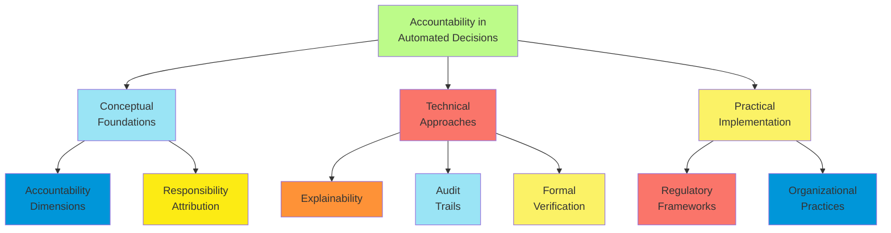

**Practical Implementation**:

1. **Regulatory Approaches**:
    - Right to explanation laws (e.g., GDPR Article 22)
    - Algorithmic impact assessments
    - Sectoral regulations (finance, healthcare)
    - Standards and certification processes
2. **Organizational Practices**:
    - Internal review boards for AI systems
    - Documentation requirements and accountability tools
    - Clear responsibility assignment
    - Incident response procedures
3. **Sociotechnical Systems**:
    - Human oversight of automated decisions
    - Appeal mechanisms for affected individuals
    - Stakeholder participation in system design
    - Ongoing monitoring and impact assessment

**Challenges and Tensions**:

1. **Technical Limitations**:
    - Explainability challenges in complex systems
    - Uncertainty quantification in predictions
    - Emergent behaviors in adaptive systems
    - Trade-offs between performance and accountability
2. **Responsibility Gaps**:
    - Diffusion of responsibility across complex systems
    - Unclear attribution in human-AI collaborative decisions
    - International jurisdiction challenges
    - Collective action problems in industry standards
3. **Balancing Concerns**:
    - Innovation vs. precaution
    - Transparency vs. intellectual property
    - Accountability vs. efficiency
    - Standardization vs. context-sensitivity

**Application Examples**:

1. **Financial Services**:
    - Credit scoring and loan approval systems
    - Trading algorithms and market stability
    - Insurance pricing and risk assessment
    - Regulatory requirements for model governance
2. **Public Sector**:
    - Benefit determination systems
    - Criminal justice risk assessments
    - Child welfare screening tools
    - Public health resource allocation
3. **Healthcare**:
    - Clinical decision support systems
    - Automated diagnosis tools
    - Treatment recommendation systems
    - Research subject protection

Effective accountability in automated decision systems requires integration of technical, organizational, and regulatory
approaches, recognizing that no single mechanism is sufficient. As systems grow more complex and consequential,
accountability frameworks must evolve to ensure that automated decisions remain aligned with human values and subject to
appropriate oversight.

#### Computational Complexity of Reasoning

##### Tractable and Intractable Inference Problems

Understanding the computational complexity of probabilistic inference is crucial for developing practical reasoning
systems. The distinction between tractable and intractable problems shapes algorithm design and application scope.

**Foundations of Tractability**:

1. **Complexity Measures**:
    - Time complexity: Operations required as function of input size
    - Space complexity: Memory required for computation
    - Query complexity: Number of queries to oracles
    - Communication complexity: Information exchange requirements
2. **Tractability Definitions**:
    - Polynomial-time solvability (P class)
    - Fixed-parameter tractability
    - Average-case vs. worst-case complexity
    - Approximation schemes with bounded error
3. **Problem Parameterizations**:
    - Network structure parameters (treewidth, pathwidth)
    - Evidence characteristics (number of observations)
    - Query type (marginal, MAP, MPE)
    - Model restrictions (determinism, sparsity)

**Tractable Model Classes**:

1. **Tree-Structured Models**:
    - Bayesian networks with tree topology
    - Variable elimination in linear time
    - Message passing with linear complexity
    - Closed-form solutions for certain distributions
2. **Bounded-Treewidth Models**:
    - Junction tree algorithm with complexity exponential in treewidth
    - Tree decompositions of graphical models
    - Practical efficiency for low-treewidth models
    - Applications in natural language, vision, bioinformatics
3. **Special-Purpose Models**:
    - Naive Bayes: Linear complexity in variables
    - Hidden Markov Models: Linear in sequence length
    - Gaussian graphical models with specific structures
    - Sum-product networks and arithmetic circuits

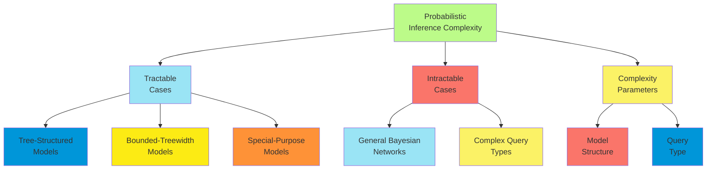

**Intractable Cases**:

1. **General Bayesian Networks**:
    - Exact inference is #P-hard (harder than NP-complete)
    - Exponential complexity in worst case
    - Hardness persists even with restrictions
    - Practical limits on network size for exact methods
2. **Complex Query Types**:
    - MAP inference is NP-hard
    - Computing multiple explanations
    - Reasoning about counterfactuals
    - Non-myopic value of information
3. **High-Dimensional Models**:
    - Models with many variables
    - Dense dependency structures
    - Continuous variables with complex distributions
    - Hybrid discrete-continuous models

**Engineering Approaches**:

1. **Algorithm Selection**:
    - Exact methods for tractable subproblems
    - Approximate methods for intractable components
    - Hybrid algorithms exploiting problem structure
    - Anytime algorithms with quality guarantees
2. **Model Simplification**:
    - Structure approximation to reduce complexity
    - Variable elimination or abstraction
    - Independence assumptions introduction
    - Discretization of continuous variables
3. **Computational Resources**:
    - Parallel computation for independent subproblems
    - Hardware acceleration (GPUs, specialized processors)
    - Memory-time tradeoffs through caching
    - Distributed inference across multiple machines

Understanding the boundary between tractable and intractable inference problems enables system designers to make
informed choices about model complexity, algorithm selection, and computational resource allocation. This knowledge is
essential for building practical systems that can reason effectively under uncertainty in real-world applications.

##### Hardness Results for Probabilistic Inference

Fundamental hardness results establish the theoretical limits of efficient probabilistic inference, providing a
framework for understanding when approximate methods are necessary and guiding the development of tractable model
classes.

**Core Hardness Results**:

1. **Bayesian Network Inference**:
    - Computing exact posterior marginals is #P-hard
    - \#P is the counting analogue of NP, representing problems that count the number of solutions
    - The hardness persists even for networks with bounded in-degree
    - Even approximate inference is NP-hard for general networks
2. **MAP and MPE Inference**:
    - Finding the Most Probable Explanation (MPE) is NP-hard
    - Maximum a Posteriori (MAP) inference with hidden variables is NPPP-hard
    - Approximating MAP within a constant factor is also NP-hard
    - Computing the k-best explanations has exponential complexity in k
3. **Structural Sources of Hardness**:
    - Inference complexity exponential in network treewidth
    - Computing optimal elimination orderings is NP-hard
    - Learning optimal Bayesian network structure is NP-hard
    - Even with known structure, parameter learning can be NP-hard with hidden variables

**Specific Hard Cases**:

1. **Inference Patterns**:
    - Explaining away (converging connections)
    - Long dependency chains
    - Deterministic or near-deterministic relationships
    - Inference with unlikely evidence
2. **Model Types**:
    - Temporal models with long sequences
    - Relational models with many objects
    - Hybrid discrete-continuous models
    - Models with complex structural uncertainty
3. **Query Classes**:
    - Multi-modal posterior distributions
    - Sensitivity analysis queries
    - Explanation generation queries
    - Decision-theoretic queries (e.g., EVPI)

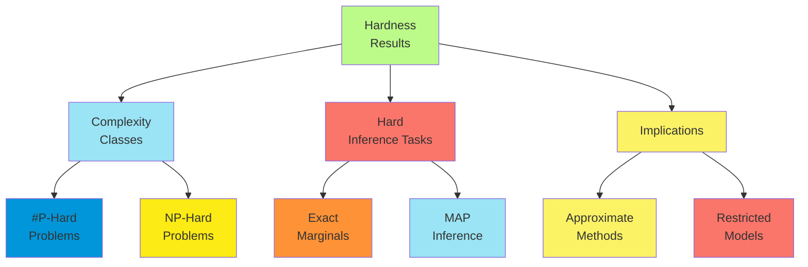

**Implications of Hardness**:

1. **Necessity of Approximation**:
    - No exact algorithm can be efficient for all problems
    - Trade-offs between accuracy and computational cost
    - Principled approximation methods with error bounds
    - Anytime algorithms that improve with computation time
2. **Model Design Principles**:
    - Prefer low-treewidth structures when possible
    - Exploit conditional independence
    - Consider tractable model classes
    - Balance expressiveness with computational feasibility
3. **Algorithm Design Strategies**:
    - Leverage problem-specific structure
    - Develop specialized algorithms for common patterns
    - Identify tractable special cases
    - Create hierarchical approximations

**Connections to Other Fields**:

1. **Satisfiability and Constraint Satisfaction**:
    - Weighted model counting (#SAT) equivalent to Bayesian inference
    - Constraint optimization techniques applicable to MAP
    - Shared hardness results and approximation techniques
    - Knowledge compilation approaches from both fields
2. **Computational Learning Theory**:
    - Hardness of learning optimal models
    - Sample complexity in relation to model complexity
    - PAC-learning frameworks for probabilistic models
    - Informational and computational bounds
3. **Information Theory**:
    - Inference as computing partition functions
    - Connections to entropy maximization
    - Variational principles for approximation
    - Coding theory connections for efficient representation

These hardness results do not simply identify limitations but provide a theoretical foundation for understanding when
and why certain methods work, guiding the development of practical approaches for probabilistic reasoning in complex
domains.

##### Complexity Classes for Decision Problems

Probabilistic reasoning encompasses a rich hierarchy of computational problems with varying complexity, extending beyond
the traditional P and NP classes to capture the nuances of reasoning under uncertainty.

**Fundamental Complexity Classes**:

1. **P and NP**:
    - P: Problems solvable in polynomial time
    - NP: Problems verifiable in polynomial time
    - NP-Complete: Hardest problems in NP
    - Relationship to decision variants of inference problems
2. **Counting Complexity**:
    - \#P: Counting versions of NP problems
    - \#P-Complete: Hardest counting problems
    - Relationship to computing probabilities and expectations
    - PP: Probabilistic Polynomial time (deciding if majority of solutions satisfy condition)
3. **Function Problems**:
    - FP: Function problems solvable in polynomial time
    - FNP: Function problems with solutions verifiable in polynomial time
    - FPRAS: Fully Polynomial Randomized Approximation Scheme
    - Relation to computing probabilistic queries

**Specialized Complexity Classes**:

1. **Beyond NP**:
    - NPPP: NP with PP oracle (e.g., MAP queries)
    - PSPACE: Problems solvable with polynomial space
    - Polynomial Hierarchy: Stratification of complexity beyond NP
    - BPP: Bounded-error Probabilistic Polynomial time
2. **Parameterized Complexity**:
    - FPT: Fixed-Parameter Tractable (efficient when parameter is fixed)
    - W Hierarchy: Stratification of parameterized problems
    - Treewidth as key parameter for graphical models
    - Kernelization techniques for preprocessing
3. **Approximation Classes**:
    - APX: Problems approximable within constant factor
    - PTAS: Polynomial-Time Approximation Scheme
    - Inapproximability results for inference problems
    - Randomized approximation schemes

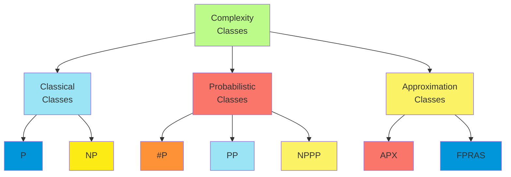

**Decision Problems in Probabilistic Reasoning**:

1. **Inference-Related Decisions**:

    - D-PR: Is P(X=x|e) > r? (in PP)
    - D-MAP: Is there an assignment to variables with probability > r? (NP-hard)
    - D-ME: Does the most probable explanation have probability > r? (NP-complete)
    - D-VE: Is there a variable elimination ordering of width ≤ k? (NP-complete)

2. **Learning-Related Decisions**:

    - D-MLE: Is there a parameter setting with likelihood > L? (NP-hard for hidden variables)
    - D-Structure: Is there a network structure with score > s? (NP-hard)

    - D-Equivalence: Are two Bayesian networks equivalent? (in P)

    - D-Independence: Are variables X and Y conditionally independent given Z? (in P for known structure)

3. **Planning and Decision-Related Problems**:

    - D-Policy: Does there exist a policy with expected utility > u? (PSPACE-complete for POMDPs)

    - D-VOI: Is the value of perfect information for variable X > v? (NPPP-complete)

    - D-Decision: Is action a optimal given evidence e? (PP-hard)

    - D-Sensitivity: Is the optimal decision sensitive to parameter θ? (in NPPP)

**Complexity Relationships and Reductions**:

1. **Reductions Between Problems**:
    - Inference problems to counting satisfiability (#SAT)
    - MAP inference to weighted MAX-SAT
    - Parameter learning to maximum likelihood in mixture models
    - Decision-making to threshold versions of inference
2. **Complexity Hierarchies**:
    - P ⊆ NP ⊆ PP ⊆ NPPP ⊆ PSPACE
    - Probabilistic reasoning spans multiple levels
    - Evidence for strict separation between classes
    - Implications for inherent hardness of problems
3. **Cross-Domain Connections**:
    - Probabilistic planning and verification
    - Stochastic constraint satisfaction
    - Probabilistic databases and query evaluation
    - Quantum computation and inference

**Implications for Algorithm Design**:

1. **Complexity-Based Algorithm Selection**:
    - Exact algorithms for problems in P
    - Approximation algorithms for NP-hard problems
    - Randomized algorithms for PP problems
    - Heuristic approaches for problems high in hierarchy
2. **Problem Reformulation**:
    - Transforming to problems with better approximation guarantees
    - Relaxations with tractable complexity
    - Decomposition into simpler subproblems
    - Preprocessing to reduce problem size
3. **Hybrid Approaches**:
    - Exact methods for tractable subproblems
    - Approximation methods for intractable components
    - Problem-specific decompositions
    - Knowledge compilation to transform representation

Understanding the complexity class of a decision problem provides fundamental insights into the computational resources
required, the appropriateness of approximation, and the potential for tractable special cases—all essential
considerations for designing practical probabilistic reasoning systems.

##### Approximation Guarantees

Approximation guarantees provide theoretical foundations for understanding the quality of approximate inference methods,
offering bounds on error and resource requirements.

**Types of Approximation Guarantees**:

1. **Absolute Error Bounds**:
    - |P̂(X) - P(X)| ≤ ε for some small ε > 0
    - Guarantees maximum deviation from true probability
    - Often difficult to achieve for general inference
    - More feasible for restricted model classes
2. **Relative Error Bounds**:
    - (1-ε)P(X) ≤ P̂(X) ≤ (1+ε)P(X)
    - Proportional accuracy regardless of probability magnitude
    - Crucial for rare events with small probabilities
    - Basis for Fully Polynomial Randomized Approximation Schemes (FPRAS)
3. **Probabilistic Guarantees**:
    - Pr(|P̂(X) - P(X)| ≤ ε) ≥ 1-δ
    - Bounds hold with specified confidence 1-δ
    - Monte Carlo methods typically provide such guarantees
    - Sample complexity often depends on log(1/δ)
4. **Convergence Rates**:
    - Error bounds as function of computational resources
    - Asymptotic convergence properties (e.g., O(1/√n) for basic Monte Carlo)
    - Conditions for exponential vs. polynomial convergence
    - Relationship to mixing times for MCMC methods

**Methods with Guarantees**:

1. **Randomized Approximation Algorithms**:
    - Monte Carlo sampling with Hoeffding/Chernoff bounds
    - Importance sampling with variance-based guarantees
    - Markov Chain Monte Carlo with mixing time analysis
    - Sequential Monte Carlo with effective sample size bounds
2. **Deterministic Approximation**:
    - Loopy belief propagation with convergence conditions
    - Variational methods with bounds on KL-divergence
    - Mini-bucket elimination with bounded error
    - Cut-set conditioning with complexity-accuracy tradeoffs
3. **Knowledge Compilation Approaches**:
    - Arithmetic circuits with size-accuracy guarantees
    - Bounded-treewidth approximations
    - Approximate inference by compilation
    - Anytime evaluation with progressive refinement

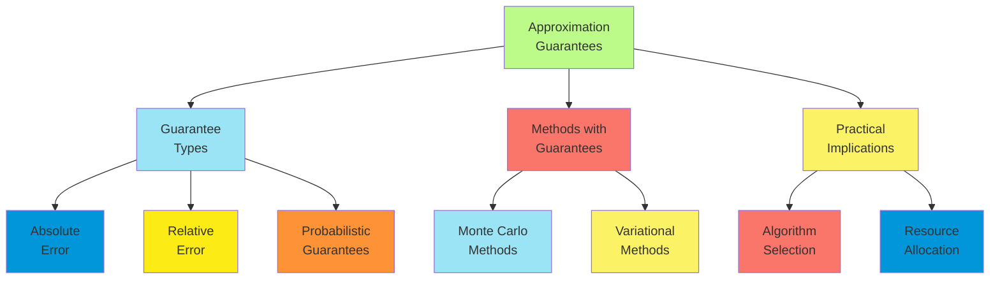

**Hardness of Approximation**:

1. **Inapproximability Results**:
    - Problems that cannot be approximated within certain factors
    - Connections to PCP theorem and hardness amplification
    - Hardness of approximating MAP in general networks
    - Trade-offs between approximation quality and runtime
2. **Approximation Hierarchies**:
    - PTAS: Polynomial-Time Approximation Scheme
    - FPTAS: Fully Polynomial-Time Approximation Scheme
    - APX-hard problems without PTAS unless P=NP
    - Positioning of probabilistic inference problems
3. **Problem-Specific Limitations**:
    - "Rough" energy landscapes hampering sampling
    - Phase transitions in approximability
    - Deterministic relationships creating near-zero probabilities
    - Multi-modal posterior distributions

**Practical Considerations**:

1. **Guarantee Selection**:
    - Application-appropriate error metrics
    - Risk tolerance in decision-critical applications
    - Computational budget constraints
    - Verification and validation requirements
2. **Algorithm Portfolio Approaches**:
    - Multiple algorithms with complementary guarantees
    - Problem features determining algorithm selection
    - Hybrid methods combining strengths of different approaches
    - Ensemble methods for robust estimation
3. **Adaptive Computation**:
    - Anytime algorithms with progressive guarantees
    - Error estimation during computation
    - Adaptive resource allocation
    - Termination criteria based on guarantee thresholds

Approximation guarantees bridge theoretical complexity results and practical algorithm design, providing principled
frameworks for developing inference methods with predictable behavior and understood limitations. They enable system
designers to make informed trade-offs between computational resources and inference quality based on application
requirements.

##### Practical Performance vs. Theoretical Bounds

While theoretical complexity analysis and approximation guarantees provide fundamental insights into probabilistic
reasoning problems, practical performance often diverges significantly from worst-case theoretical bounds.

**Sources of Divergence**:

1. **Worst-Case vs. Average-Case**:
    - Theoretical bounds typically address worst-case scenarios
    - Real-world problems often exhibit more benign structure
    - Random problem instances may be easier than adversarial ones
    - Typical-case complexity can be much lower than worst-case
2. **Problem Structure**:
    - Many practical problems have hidden structure not captured by general complexity results
    - Nearly decomposable systems with weak cross-component interactions
    - Sparsity in dependencies or parameters
    - Concentration of probability mass in small regions of state space
3. **Algorithm Behavior**:
    - Theoretical analysis often makes pessimistic assumptions
    - Heuristics may perform well despite lack of guarantees
    - Early termination on solved instances
    - Amortized efficiency across related problems

**Empirical Performance Patterns**:

1. **Exact Inference Methods**:
    - Variable elimination often works for networks with hundreds of variables despite exponential worst-case
    - Junction tree algorithm practical for low to moderate treewidth (≤ 20)
    - Structure-specific optimizations dramatically improve performance
    - Caching and reuse of computations for similar queries
2. **Approximate Methods**:
    - MCMC methods converge faster on many practical problems than mixing time bounds suggest
    - Variational methods often produce accurate approximations despite lack of error guarantees
    - Loopy belief propagation frequently converges when theory predicts it might not
    - Adaptive importance sampling can achieve high accuracy with modest samples
3. **Learning Algorithms**:
    - Structure learning heuristics find good networks despite NP-hard optimization
    - EM algorithm often converges quickly despite theoretical concerns
    - Stochastic gradient methods work well with minimal tuning
    - Transfer learning effective despite theoretical challenges

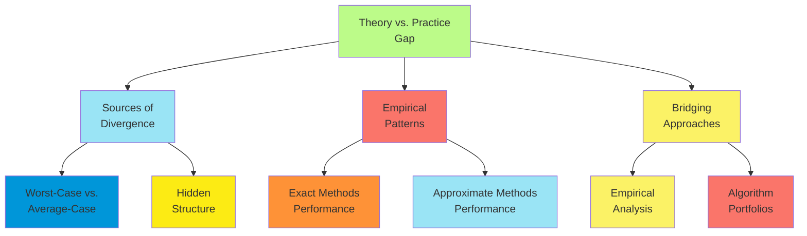

**Bridging Theory and Practice**:

1. **Beyond Worst-Case Analysis**:
    - Smoothed analysis of algorithms
    - Instance-specific complexity measures
    - Parameterized complexity with practical parameters
    - Distribution-specific analysis
2. **Empirical Complexity Analysis**:
    - Phase transition studies
    - Algorithm scaling on benchmark datasets
    - Statistical models of algorithm performance
    - Prediction of runtime based on problem features
3. **Algorithm Selection and Configuration**:
    - Machine learning for algorithm selection
    - Per-instance algorithm configuration
    - Portfolio approaches with performance models
    - Online adaptation of algorithmic strategies

**Application Implications**:

1. **Engineering Approaches**:
    - Try exact methods before resorting to approximation
    - Leverage domain-specific structure in algorithm design
    - Use theoretical results as guides rather than strict limitations
    - Maintain algorithm portfolios for diverse problems
2. **Performance Prediction**:
    - Develop runtime prediction models for resource allocation
    - Provide confidence estimates for approximate answers
    - Early detection of difficult problem instances
    - Adaptive computation based on problem characteristics
3. **Benchmark Development**:
    - Representative problem distributions
    - Graduated difficulty in benchmark suites
    - Capture of real-world structural properties
    - Metrics beyond worst-case performance

The gap between theoretical bounds and practical performance highlights the importance of empirical algorithm analysis
and problem-specific optimizations. While complexity theory and approximation guarantees provide essential foundations,
practical system design requires complementary engineering approaches that leverage problem structure and empirical
performance patterns to achieve efficient probabilistic reasoning in real-world applications.

#### Multi-agent Reasoning under Uncertainty

##### Distributed Belief Updates

Distributed belief updating addresses how multiple agents with individual observations and computational capabilities
can collaboratively reason about uncertain states of the world.

**Frameworks for Distributed Belief Updating**:

1. **Decentralized Estimation**:
    - Each agent maintains local belief state
    - Exchange of information between agents
    - Fusion of beliefs from multiple sources
    - Applications in sensor networks, multi-robot systems
2. **Multi-agent Belief Revision**:
    - Individual belief bases with revision operators
    - Communication protocols for belief exchange
    - Consistency maintenance across agents
    - Handling contradictory information
3. **Team Decision Theory**:
    - Common prior assumption
    - Local observations generating different posteriors
    - Communication constraints on belief alignment
    - Coordination with partial information sharing

**Algorithmic Approaches**:

1. **Consensus Algorithms**:
    - Iterative averaging of probability distributions
    - Convergence to common posterior under conditions
    - Weighted consensus based on confidence or expertise
    - Robust consensus with adversarial agents
2. **Distributed Inference in Graphical Models**:
    - Junction tree algorithms with distributed cliques
    - Message passing across agent boundaries
    - Asynchronous belief propagation
    - Distributed MCMC sampling
3. **Sequential Updating Protocols**:
    - Bayesian updating with sequentially shared observations
    - Order effects in belief propagation
    - Information cascades and groupthink prevention
    - Social influence measurement and management

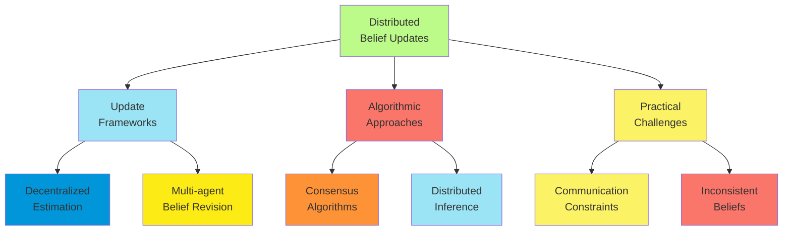

**Theoretical Considerations**:

1. **Consistency and Coherence**:
    - Conditions for convergence to common beliefs
    - Impossibility results under communication constraints
    - Agreement theorems and their limitations
    - Impact of network topology on belief convergence
2. **Information Theory Perspective**:
    - Optimal information sharing strategies
    - Rate-distortion trade-offs in belief communication
    - Information value of different communication patterns
    - Entropy reduction through collaborative inference
3. **Computational Complexity**:
    - Communication complexity of belief alignment
    - Computational trade-offs in distributed vs. centralized inference
    - Scalability with number of agents
    - Approximation strategies under resource constraints

**Application Domains**:

1. **Distributed Sensing Systems**:
    - Environmental monitoring networks
    - Multi-robot state estimation
    - Collaborative target tracking
    - Distributed event detection
2. **Team Decision Making**:
    - Military command and control
    - Emergency response coordination
    - Collaborative scientific discovery
    - Distributed medical diagnosis
3. **Social and Economic Systems**:
    - Prediction markets and belief aggregation
    - Social learning in networks
    - Distributed hypothesis testing
    - Collaborative filtering and recommendation

Distributed belief updating provides frameworks for understanding and designing systems where multiple agents must
reason collectively under uncertainty, balancing individual observations with shared information to achieve more
accurate beliefs than possible in isolation.

##### Reasoning about Other Agents' Beliefs

Reasoning about other agents' beliefs—often called theory of mind or epistemic reasoning—involves modeling and inferring
the mental states, including beliefs, knowledge, and uncertainties, of other agents.

**Formal Frameworks**:

1. **Epistemic Logic**:
    - Modal operators for knowledge and belief (e.g., K₁φ: "Agent 1 knows φ")
    - Possible worlds semantics for knowledge representation
    - Axioms for reasoning about knowledge (e.g., K₁φ → φ)
    - Multi-agent extensions with nested beliefs (K₁K₂φ: "Agent 1 knows that Agent 2 knows φ")
2. **Probabilistic Models**:
    - Bayesian models of agents' beliefs
    - Hierarchical models for nested beliefs
    - Interactive POMDPs for decision-making with belief reasoning
    - Cognitive hierarchy models with bounded reasoning depth
3. **Game-Theoretic Approaches**:
    - Type spaces representing belief hierarchies
    - Bayesian games with uncertainty about others' utilities
    - Epistemic game theory foundations
    - Level-k and cognitive hierarchy models

**Computational Approaches**:

1. **Explicit Belief Representation**:
    - Maintaining explicit models of others' beliefs
    - Updating based on observations of behavior
    - Handling recursive belief structures
    - Approximate representations for computational tractability
2. **Belief Inference from Behavior**:
    - Inverse planning to infer beliefs from actions
    - Bayesian theory of mind models
    - Learning belief update functions from data
    - Recognition of intention and goal inference
3. **Bounded Rationality Models**:
    - Limited depth of recursive reasoning
    - Sampling-based approximations for nested beliefs
    - Cognitive architectures with belief reasoning
    - Behavioral models calibrated to human data

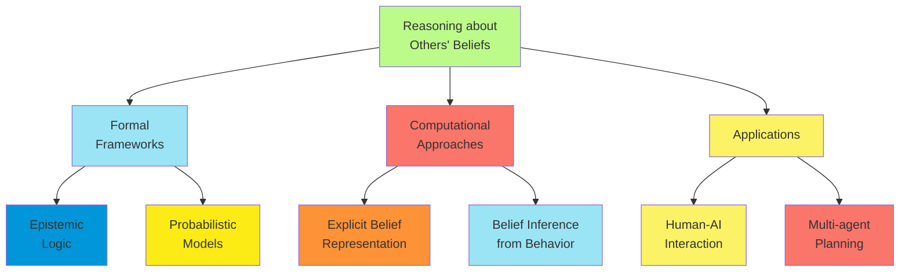

**Theoretical Challenges**:

1. **Infinite Belief Hierarchies**:
    - Theoretical need for infinite nesting of beliefs
    - Computational representations of infinite structures
    - Practical bounds on reasoning depth
    - Common knowledge as limit of shared beliefs
2. **Belief Dynamics**:
    - Updating nested beliefs based on observations
    - Public vs. private belief updates
    - Belief revision in multi-agent contexts
    - Modeling others' belief update processes
3. **Computational Complexity**:
    - PSPACE-hardness of multi-agent epistemic reasoning
    - Exponential growth with reasoning depth
    - Approximation strategies for tractable inference
    - Trade-offs between accuracy and computational cost

**Application Areas**:

1. **Human-AI Interaction**:
    - Theory of mind for assistive AI systems
    - Modeling user knowledge and uncertainties
    - Explanation generation based on user beliefs
    - Inferring user intentions from partial observations
2. **Multi-agent Planning and Coordination**:
    - Decentralized POMDPs with belief reasoning
    - Coordination through implicit communication
    - Anticipating others' actions based on their beliefs
    - Team planning with partial observability
3. **Security and Deception**:
    - Deception through manipulation of others' beliefs
    - Security games with belief modeling
    - Detection of misinformation and misleading behavior
    - Privacy preservation through belief management

The ability to reason about other agents' beliefs represents a fundamental capability for sophisticated multi-agent
systems, enabling coordination, cooperation, competition, and meaningful human-AI interaction in environments
characterized by uncertainty and partial observability.

##### Strategic Information Revelation

Strategic information revelation addresses how agents strategically choose what information to share with others,
balancing individual goals with collective outcomes in settings where beliefs drive decisions.

**Game-Theoretic Foundations**:

1. **Signaling Games**:
    - Informed agent chooses message to send
    - Receiving agent updates beliefs and takes action
    - Equilibrium concepts: separating, pooling, semi-pooling
    - Credibility and incentive compatibility of signals
2. **Cheap Talk**:
    - Costless communication with potential misalignment
    - Crawford-Sobel model of strategic information transmission
    - Babbling equilibria and information loss
    - Conditions for informative communication
3. **Bayesian Persuasion**:
    - Commitment to information revelation policy
    - Sender designs signal structure to influence receiver
    - Optimal information design
    - Value of commitment in strategic settings

**Strategic Considerations**:

1. **Value of Information**:
    - Private value of maintaining information asymmetry
    - Social value of information sharing
    - Strategic value of selective revelation
    - Opportunity costs of revelation
2. **Trust and Reputation**:
    - Credibility of communicated information
    - Reputation building through honest revelation
    - Strategic misrepresentation and its costs
    - Trust models in repeated interactions
3. **Competitive vs. Cooperative Settings**:
    - Full revelation in perfectly aligned settings
    - Strategic withholding with competing interests
    - Partial revelation with partial alignment
    - Coalition formation through information sharing

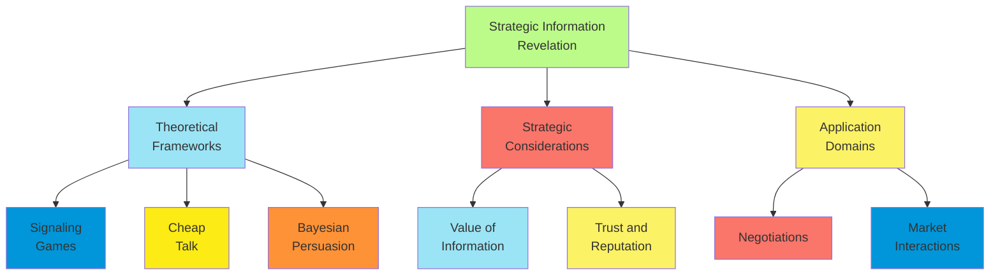

**Computational Models**:

1. **Optimal Information Design**:
    - Computing optimal revelation policies
    - Concavification methods from Bayesian persuasion
    - Multi-receiver information design
    - Sequential information revelation
2. **Strategic Reasoning Algorithms**:
    - Computing Bayesian Nash equilibria in revelation games
    - Learning revelation strategies from experience
    - Opponent modeling for adaptive revelation
    - Bounded rationality models of strategic communication
3. **Information Measures**:
    - Quantifying revealed information
    - Information-theoretic metrics of strategic value
    - Partial revelation measures
    - Belief impact assessment

**Application Domains**:

1. **Negotiations and Bargaining**:
    - Strategic revelation of reservation prices
    - Signaling commitment through information sharing
    - Establishing common ground through selective disclosure
    - Building trust through credible revelation
2. **Security and Privacy**:
    - Strategic obfuscation of private information
    - Security games with information asymmetry
    - Privacy-preserving information sharing
    - Deception and counter-deception
3. **Market Interactions**:
    - Signaling quality through warranties or pricing
    - Voluntary disclosure in financial markets
    - Advertising as information revelation
    - Market design with strategic information
4. **Human-AI Interaction**:
    - Strategic explanation generation
    - Building appropriate trust through information sharing
    - Adaptive information revelation based on user state
    - Ethical considerations in AI information sharing

Strategic information revelation lies at the intersection of game theory, information economics, and multi-agent
systems, providing frameworks for understanding how information flows in strategic settings and how to design systems
that balance individual incentives with collective information needs.

##### Collaborative Filtering and Decision Making

Collaborative filtering and decision making leverage the collective knowledge and experience of multiple agents to
improve individual beliefs and decisions, particularly in environments with limited individual information.

**Collaborative Filtering Foundations**:

1. **Preference Aggregation Models**:
    - User-based collaborative filtering
    - Item-based similarity approaches
    - Matrix factorization techniques
    - Probabilistic models of preferences
2. **Multi-agent Learning Frameworks**:
    - Experience sharing across agents
    - Transfer learning between similar tasks
    - Federated learning with distributed data
    - Multi-task reinforcement learning
3. **Trust and Reputation Systems**:
    - Models of agent reliability
    - Expertise assessment frameworks
    - Reputation dynamics and evolution
    - Trust-aware information aggregation

**Decision-Making Approaches**:

1. **Group Decision-Making**:
    - Aggregation of individual judgments
    - Voting mechanisms for discrete choices
    - Opinion pooling for probabilistic beliefs
    - Delphi methods and structured elicitation
2. **Peer-Based Decision Support**:
    - Case-based reasoning from similar agents
    - Analogical transfer from related experiences
    - Advisory systems based on peer outcomes
    - Social learning and imitation strategies
3. **Decentralized Coordination**:
    - Consensus algorithms for joint decisions
    - Market-based allocation mechanisms
    - Contract networks and task distribution
    - Emergent coordination through local interactions

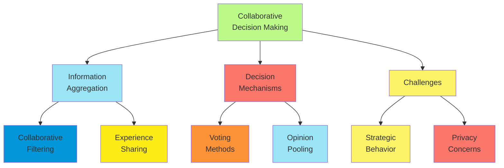

**Theoretical Considerations**:

1. **Diversity and Complementarity**:
    - Value of diverse perspectives
    - Conditions for wisdom of crowds
    - Exploration-exploitation in collective learning
    - Optimal team composition and diversity measures
2. **Information Cascades and Herding**:
    - Sequential decision-making with social observation
    - Informational vs. reputational herding
    - Conditions for efficient information aggregation
    - Preventing negative cascade effects
3. **Strategic Information Revelation**:
    - Incentives for truthful reporting
    - Mechanism design for honest feedback
    - Strategic filtering of shared experiences
    - Market-based approaches to information valuation

**Application Domains**:

1. **Recommendation Systems**:
    - E-commerce product recommendations
    - Content filtering in media platforms
    - Social recommendation for services
    - Personalized education and learning
2. **Crowdsourcing**:
    - Distributed problem-solving
    - Crowd wisdom for estimation
    - Quality control in crowdsourced data
    - Incentive mechanisms for participation
3. **Multi-agent Robotics**:
    - Collaborative exploration
    - Shared mapping and localization
    - Distributed task allocation
    - Experience sharing across robot teams
4. **Social Learning Platforms**:
    - Knowledge sharing networks
    - Expertise location systems
    - Peer learning environments
    - Professional communities of practice

Collaborative filtering and decision making provide powerful frameworks for leveraging collective intelligence and
shared experiences to improve individual and group outcomes. These approaches are particularly valuable in domains
characterized by sparse individual information, complex decision spaces, and complementary agent expertise.

##### Applications in Autonomous Systems

Multi-agent reasoning under uncertainty enables sophisticated coordination and collaboration in autonomous systems,
driving advances in robotics, transportation, and distributed infrastructure management.

**Autonomous Vehicles and Transportation**:

1. **Collaborative Perception**:
    - Sensor fusion across multiple vehicles
    - Shared maps and environmental models
    - Cooperative localization with reduced uncertainty
    - Distributed object detection and tracking
2. **Coordinated Navigation**:
    - Negotiation of intersection crossing
    - Cooperative lane changing and merging
    - Platoon formation and maintenance
    - Traffic flow optimization through communication
3. **Fleet Management**:
    - Distributed task allocation for service vehicles
    - Predictive repositioning based on demand models
    - Resource sharing under uncertainty
    - Real-time adaptation to changing conditions

**Multi-Robot Systems**:

1. **Distributed Exploration**:
    - Coordination of search efforts
    - Collaborative mapping of unknown environments
    - Information-theoretic exploration strategies
    - Adaptive task allocation based on discoveries
2. **Cooperative Manipulation**:
    - Shared models of manipulated objects
    - Uncertainty-aware grasp and motion planning
    - Force distribution across multiple manipulators
    - Failure detection and recovery coordination
3. **Swarm Systems**:
    - Emergent behavior from local interactions
    - Decentralized decision making with limited communication
    - Robust operation despite individual failures
    - Scalable coordination mechanisms

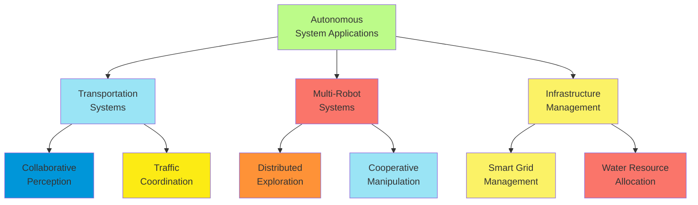

**Distributed Infrastructure Management**:

1. **Smart Energy Grids**:
    - Distributed generation and load forecasting
    - Coordinated demand response
    - Microgrid coordination under uncertainty
    - Resilient operation during disruptions
2. **Water Management Systems**:
    - Collaborative sensing of water quality and flow
    - Distributed decision making for resource allocation
    - Cooperative response to contamination events
    - Adaptive management under climate uncertainty
3. **Communication Networks**:
    - Dynamic spectrum allocation
    - Distributed routing under uncertain demand
    - Cooperative caching with content prediction
    - Resilient operation with partial node failures

**Implementation Approaches**:

1. **Decentralized Decision Architectures**:
    - Peer-to-peer coordination protocols
    - Hierarchical decision structures
    - Market-based resource allocation
    - Hybrid centralized-decentralized approaches
2. **Communication Frameworks**:
    - Belief sharing protocols with bandwidth constraints
    - Event-triggered communication
    - Prioritized information exchange
    - Resilience to communication disruptions
3. **Learning and Adaptation**:
    - Multi-agent reinforcement learning
    - Distributed online learning algorithms
    - Transfer learning across similar agents
    - Collective adaptation to environmental changes

**Challenges and Solutions**:

1. **Scalability**:
    - Hierarchical coordination structures
    - Locality-sensitive algorithms
    - Approximate belief sharing
    - Event-based coordination
2. **Robustness**:
    - Fault-tolerant protocols
    - Graceful degradation with agent failures
    - Operation with partial information
    - Diversity-based resilience
3. **Integration with Human Systems**:
    - Transparent operation for human understanding
    - Predictable behavior for human trust
    - Mixed-initiative control sharing
    - Ethical decision making in human environments

Multi-agent reasoning under uncertainty enables autonomous systems to operate effectively in complex, dynamic
environments by leveraging collective sensing, distributed computation, and coordinated action to achieve robustness and
performance beyond the capabilities of isolated agents.

#### Non-standard Models of Uncertainty

##### Dempster-Shafer Theory

Dempster-Shafer theory (DST), also known as evidence theory or the theory of belief functions, provides a framework for
reasoning under uncertainty that generalizes probability theory to handle incomplete knowledge and partial evidence.

**Foundational Concepts**:

1. **Basic Probability Assignment (BPA)**:

    - Function m: 2^Θ → [0,1] mapping from the power set of the frame of discernment Θ to [0,1]
    - m(∅) = 0
    - Σ\_{A⊆Θ} m(A) = 1
    - m(A) represents evidence supporting exactly set A, not necessarily its subsets

2. **Belief and Plausibility Functions**:

    - Belief function: Bel(A) = Σ\_{B⊆A} m(B)
        - Lower bound on probability of A
        - Amount of evidence specifically supporting A
    - Plausibility function: Pl(A) = 1 - Bel(Ā) = Σ\_{B∩A≠∅} m(B)
        - Upper bound on probability of A
        - Amount of evidence not contradicting A
    - Uncertainty interval: [Bel(A), Pl(A)]

    1. **Dempster's Rule of Combination**:
        - Combines independent pieces of evidence
        - For two mass functions m₁ and m₂: (m₁ ⊕ m₂)(C) = K⁻¹ Σ\_{A∩B=C} m₁(A)m₂(B)
        - Where K = 1 - Σ\_{A∩B=∅} m₁(A)m₂(B) is a normalization factor
        - Handles conflict between evidence sources

**Theoretical Advantages**:

1. **Representation of Ignorance and Partial Knowledge**:
    - Explicit modeling of ignorance through m(Θ)
    - Distinction between uncertainty and ignorance
    - No forced assignment of probabilities without evidence
    - Representation of non-specific evidence
2. **Generalization of Probability Theory**:
    - Bayesian probability as special case (when all mass on singletons)
    - More expressive belief representation
    - Natural handling of set-valued observations
    - Compatibility with classical probability when evidence warrants
3. **Decision Theory Extensions**:
    - Decisions based on belief-plausibility intervals
    - Non-additive decision criteria
    - Robust decision making with ambiguity
    - Upper/lower expected utility

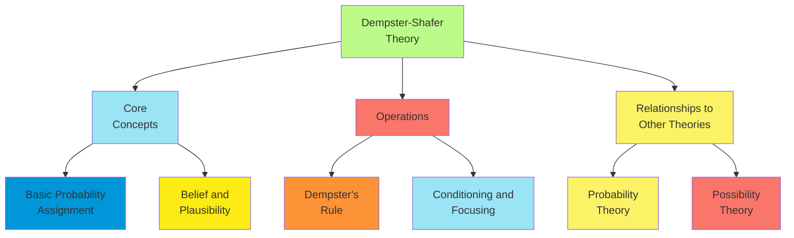

**Computational Approaches**:

1. **Efficient Implementations**:
    - Fast Möbius transformations for belief computation
    - Monte Carlo approximations for large frames
    - Focused combinations for specific queries
    - Exploiting structure in evidence combination
2. **Approximate Reasoning**:
    - Hierarchical evidence structures
    - Coarsening and refinement operations
    - Summarization of belief functions
    - Dimensionality reduction techniques
3. **Special Cases and Simplifications**:
    - Consonant belief functions (nested focal elements)
    - Simple support functions
    - Separable belief functions
    - Parametric families of belief functions

**Application Domains**:

1. **Sensor Fusion**:
    - Combining readings from heterogeneous sensors
    - Handling sensor reliability and conflicts
    - Target identification and classification
    - Environmental monitoring with partial detections
2. **Classification and Pattern Recognition**:
    - Evidential k-nearest neighbors
    - Belief function classifiers
    - Classifier fusion with conflicting outputs
    - Handling missing or uncertain features
3. **Risk Analysis and Decision Support**:
    - Multi-criteria decision making
    - Reliability assessment with incomplete information
    - Engineering safety analysis
    - Medical diagnosis with partial evidence

**Limitations and Challenges**:

1. **Computational Complexity**:
    - Exponential complexity in frame size
    - Large number of focal elements
    - Costly combination operations
    - Scalability challenges for large problems
2. **Theoretical Debates**:
    - Dempster's rule behavior under high conflict
    - Alternative combination rules
    - Relationship to imprecise probability
    - Conditioning and updating semantics
3. **Practical Issues**:
    - Elicitation of basic probability assignments
    - Calibration and validation
    - Integration with existing systems
    - Interpretability of results

Dempster-Shafer theory provides a flexible framework for reasoning under uncertainty, particularly valuable in contexts
with incomplete, ambiguous, or conflicting evidence. Its ability to represent partial ignorance and distinguish between
different types of uncertainty offers advantages in applications where forcing precise probabilities would be artificial
or misleading.

##### Possibility Theory

Possibility theory provides an alternative framework for handling uncertainty, focusing on the representation of
imprecise or incomplete information through possibility distributions rather than probability distributions.

**Fundamental Concepts**:

1. **Possibility Distribution**:
    - Function π: Ω → [0,1] mapping from universe of discourse to [0,1]
    - max\_{x∈Ω} π(x) = 1 (normalization)
    - π(x) represents the degree to which x is possible
    - Models epistemic uncertainty (state of knowledge) rather than aleatory uncertainty (random variation)
2. **Possibility and Necessity Measures**:
    - Possibility measure: Π(A) = max\_{x∈A} π(x)
        - Degree to which event A is possible
        - Dual to necessity: Π(A) = 1 - N(Ā)
    - Necessity measure: N(A) = 1 - Π(Ā) = min\_{x∉A} (1 - π(x))
        - Degree to which event A is certain
        - N(A) > 0 implies Π(A) = 1
3. **Comparative Semantics**:
    - Ordinal structure of possibilities
    - Relative possibility more fundamental than numeric values
    - Comparative expressions of uncertainty
    - Qualitative possibility theory as foundation

**Theoretical Properties**:

1. **Relation to Fuzzy Set Theory**:
    - Possibility distribution as membership function
    - Fuzzy set operations corresponding to possibility/necessity
    - Linguistic variables and fuzzy descriptions
    - Gradual properties and their possibility
2. **Difference from Probability**:
    - Non-additivity: max(Π(A), Π(Ā)) = 1 and min(Π(A), Π(Ā)) ≥ 0
    - Consistency vs. additivity for managing uncertainty
    - Different handling of ignorance
    - Encoding of preference and uncertainty
3. **Connection to Other Theories**:
    - Consonant belief functions in Dempster-Shafer theory
    - Upper/lower probabilities interpretation
    - Relationship to modal logic
    - Rough set theory connections

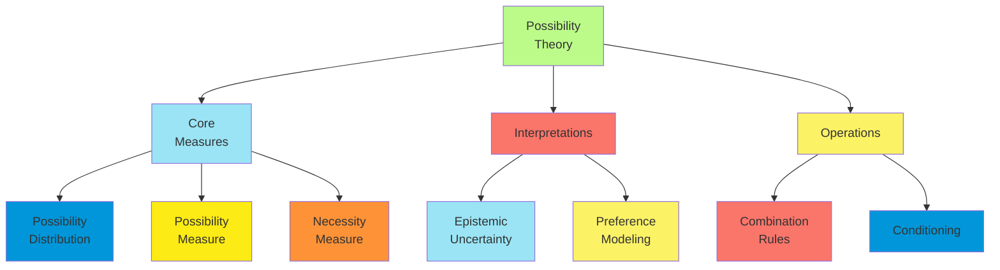

**Uncertainty Calculus**:

1. **Combination Rules**:
    - Minimum-based conjunction for joint possibility
    - Maximum-based disjunction
    - Product-based fusion for independent sources
    - Weighted combination for reliability differences
2. **Conditioning and Updating**:
    - Possibilistic conditioning: π(x|A) = π(x) if x ∈ A, 0 otherwise (then normalized)
    - Different conditioning rules for specific semantics
    - Revision vs. focusing interpretations
    - Sequential updating with new information
3. **Transformation Between Frameworks**:
    - Probability to possibility transformations
    - Possibility to probability principles
    - Consistency principles for conversion
    - Information preservation in transformations

**Application Areas**:

1. **Knowledge Representation**:
    - Representation of linguistic uncertainty
    - Expert knowledge with imprecision
    - Default reasoning systems
    - Preference representation
2. **Decision Making**:
    - Qualitative decision theory
    - Multi-criteria decision analysis
    - Decision making under severe uncertainty
    - Possibilistic utility theory
3. **Control Systems**:
    - Fuzzy control systems
    - Qualitative reasoning about physical systems
    - Robustness to imprecision
    - Supervisory control with partial information
4. **Information Retrieval and Data Analysis**:
    - Flexible querying of databases
    - Similarity-based retrieval
    - Classification with imprecise data
    - Pattern recognition with partial matching

**Advantages and Limitations**:

1. **Advantages**:
    - Natural representation of linguistic uncertainty
    - Computationally efficient for many operations
    - No need for precise numerical assessments
    - Compatibility with qualitative human reasoning
2. **Limitations**:
    - Less developed statistical foundation
    - Challenges in parameter elicitation
    - Interpretation of numerical degrees
    - Sensitivity to problem formulation
3. **Open Research Areas**:
    - Inference algorithms for complex models
    - Learning possibility distributions from data
    - Hybrid possibilistic-probabilistic frameworks
    - Formal semantics in specific domains

Possibility theory offers a distinctive approach to uncertainty that is particularly suited for modeling linguistic
imprecision, incomplete knowledge, and preference structures. Its qualitative nature and computational simplicity make
it attractive for applications where probability theory might require unjustified precision or impose excessive
computational demands.

##### Imprecise Probabilities

Imprecise probability theory extends classical probability by allowing for partial specification of probabilities,
representing uncertainty about probabilities themselves and avoiding forced precision when information is limited.

**Core Frameworks**:

1. **Sets of Probability Measures**:
    - Credal sets: Convex sets of probability distributions
    - Lower and upper probabilities: P(A) ≤ P(A) ≤ P̄(A)
    - Interval probabilities: [p₁, p₂] for events
    - Representation of ambiguity and epistemic uncertainty
2. **Lower Previsions (Expectations)**:
    - Functions assigning lower expected values to gambles
    - Coherence conditions for rational assessment
    - Natural extension from partial assessments
    - Behavioral interpretation through betting scenarios
3. **Probability Boxes (p-boxes)**:
    - Bounds on cumulative distribution functions
    - F(x) ≤ F(x) ≤ F̄(x) for all x
    - Capturing distribution uncertainty
    - Efficient representation for special cases

**Theoretical Foundations**:

1. **Coherence and Consistency**:
    - Avoiding sure loss in betting scenarios
    - Coherent lower/upper probabilities
    - Williams coherence and Walley coherence
    - Extensions of partial assessments
2. **Decision Theory**:
    - Maximality criterion for decisions
    - E-admissibility for action selection
    - Interval expected utility
    - Uncertainty aversion principles
3. **Information and Entropy**:
    - Imprecise information measures
    - Maximum entropy principles with constraints
    - Minimum relative entropy updates
    - Uncertainty about uncertainty quantification

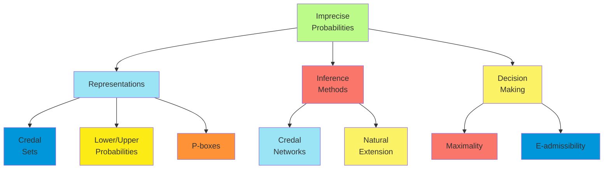

**Inference Methods**:

1. **Credal Networks**:
    - Graphical models with sets of probability distributions
    - Efficient inference for special structures
    - Separation properties and d-separation
    - Methods for computing lower/upper probabilities
2. **Robust Bayesian Analysis**:
    - Classes of prior distributions
    - Sensitivity analysis for Bayesian inference
    - Bounds on posterior probabilities
    - Global robustness measures
3. **Probability Logic**:
    - Logic of probable reasoning with intervals
    - Consequence relations under partial knowledge
    - Consistency enforcement in knowledge bases
    - Propagation of logical and probabilistic constraints

**Learning Methods**:

1. **Partial Identification**:
    - Identifying credal sets from limited data
    - Bounds on parameters instead of point estimates
    - Non-parametric predictive inference
    - Confidence regions as credal sets
2. **Imprecise Probability Models**:
    - Imprecise Dirichlet model (IDM)
    - Near-ignorance priors
    - Likelihood-based imprecise methods
    - Neighborhood models around precise estimates
3. **Predictive Approaches**:
    - Interval-valued predictions
    - Confidence-based predictive models
    - Conformal prediction with imprecise probabilities
    - Reliable classification with partial knowledge

**Application Domains**:

1. **Risk and Reliability Analysis**:
    - Engineering risk assessment with limited data
    - Safety-critical systems evaluation
    - Environmental risk with knowledge gaps
    - Reliability bounds for complex systems
2. **Classification with Limited Data**:
    - Imprecise classification methods
    - Partial identification of optimal classifiers
    - Credal classification with rejection option
    - Reliability measures for predictions
3. **Decision Support**:
    - Policy decisions under severe uncertainty
    - Medical diagnosis with ambiguous evidence
    - Resources allocation with incomplete information
    - Climate change response under deep uncertainty

**Advantages and Challenges**:

1. **Advantages**:
    - Avoiding false precision in knowledge representation
    - Transparent handling of information quality
    - Robust conclusions under limited information
    - Compatibility with qualitative expert judgments
2. **Computational Challenges**:
    - Exponential complexity of general inference
    - Representation of complex credal sets
    - Optimization over sets of distributions
    - Decision-making complexity
3. **Practical Challenges**:
    - Elicitation of imprecise assessments
    - Communication of imprecise results
    - Integration with existing systems
    - Balancing expressiveness with usability

Imprecise probability theory provides a rigorous framework for handling uncertainty about probabilities themselves,
offering more faithful representations of limited or conflicting information without forcing artificial precision. This
approach is particularly valuable for high-stakes decisions where acknowledging ignorance may be preferable to assuming
unjustified precision.

##### Quantum Probabilities

Quantum probability theory extends classical probability theory by incorporating the non-commutative algebraic structure
of quantum mechanics, providing a framework for modeling contexts where classical probability assumptions are violated.

**Foundational Concepts**:

1. **Quantum States and Events**:
    - States as density operators on Hilbert space
    - Events as projectors (or more generally, effects)
    - Probability via trace rule: P(E|ρ) = Tr(ρE)
    - Pure states as special case: P(E|ψ) = ⟨ψ|E|ψ⟩
2. **Non-Classical Properties**:
    - Superposition of states
    - Quantum interference effects
    - Incompatible observables (non-commuting operators)
    - Entanglement between systems
3. **Quantum Operations**:
    - Measurements as quantum channels
    - Unitary evolution of closed systems
    - Completely positive maps for open systems
    - Quantum instruments combining measurement and evolution

**Theoretical Framework**:

1. **Quantum Logic**:
    - Non-Boolean lattice of projections
    - Violation of distributive law
    - Orthomodular structure
    - Sequential and simultaneous testability
2. **Quantum Information Theory**:
    - Von Neumann entropy of quantum states
    - Quantum relative entropy
    - Quantum channels and capacity
    - Entanglement measures
3. **Quantum Decision Theory**:
    - Quantum utilities and expected values
    - Order effects in preferences
    - Contextuality in decision making
    - Violation of sure-thing principle

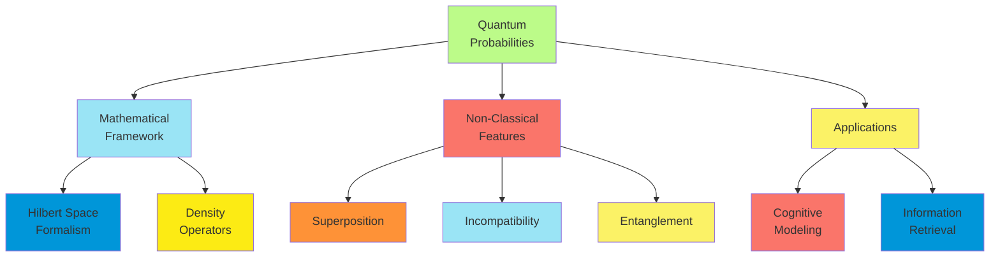

**Applications Beyond Physics**:

1. **Cognitive Science**:
    - Order effects in judgment and decision making
    - Violation of Kolmogorov axioms in human probability judgment
    - Quantum-like models of concept combination
    - Context-dependent preference reversals
2. **Information Retrieval and NLP**:
    - Quantum language models
    - Non-separability in document representation
    - Contextual meaning in text analysis
    - Interference effects in relevance judgments
3. **Decision Science**:
    - Disjunction effects in decision making
    - Conjunction fallacies in probability assessment
    - Ambiguity aversion in economic choices
    - Quantum game theory for strategic interactions
4. **Artificial Intelligence**:
    - Quantum-inspired neural networks
    - Quantum probability in knowledge representation
    - Contextual reasoning systems
    - Quantum-enhanced machine learning

**Computational Approaches**:

1. **Quantum-Inspired Classical Algorithms**:
    - Using quantum mathematical structure without quantum hardware
    - Density matrix representations on classical computers
    - Efficient approximations for low-dimensional Hilbert spaces
    - Tensor network methods for quantum-like models
2. **Quantum Computing Implementations**:
    - True quantum probability computations on quantum hardware
    - Quantum amplitude estimation
    - Quantum state tomography
    - Quantum sampling approaches
3. **Hybrid Quantum-Classical Models**:
    - Classical approximations with quantum corrections
    - Identifying quantum-necessary components
    - Decomposition into classical and quantum parts
    - Pragmatic partially-quantum approaches

**Controversies and Limitations**:

1. **Theoretical Debates**:
    - Necessity of full quantum formalism vs. simpler extensions
    - Hidden variable explanations for quantum-like effects
    - Markov vs. quantum models for temporal effects
    - Physical interpretation of non-physical applications
2. **Practical Challenges**:
    - Parameter estimation for quantum models
    - Model complexity and overfitting concerns
    - Computational tractability limitations
    - Interpretability of quantum parameters
3. **Ongoing Research**:
    - Testable predictions differentiating quantum from classical models
    - Minimal quantum models for specific phenomena
    - Unification with other uncertainty frameworks
    - Foundation of quantum advantage in cognitive modeling

Quantum probability theory offers a sophisticated mathematical framework for modeling uncertainty phenomena that violate
classical probability assumptions, particularly those involving contextuality, incompatible measurements, and order
effects. While originally developed for quantum physics, these models have found increasing application in cognitive
science, decision theory, and information processing, where classical probability models face systematic challenges.

##### Applications of Alternative Uncertainty Models

Alternative uncertainty models find applications across diverse domains where classical probability theory faces
limitations in representing ignorance, ambiguity, conflict, or context-dependence.

**Knowledge Representation and AI**:

1. **Expert Systems**:
    - DS-theory for conflicting expert opinions
    - Possibility theory for linguistic knowledge representation
    - Imprecise probabilities for partial knowledge
    - Quantum-like models for contextual reasoning
2. **Knowledge Integration**:
    - Combination of heterogeneous knowledge sources
    - Management of conflicting information
    - Preservation of ignorance in knowledge bases
    - Multi-agent belief fusion
3. **Explainable AI**:
    - Representing uncertainty in explanations
    - Communicating ambiguity and ignorance
    - Transparent uncertainty handling
    - Qualitative explanations of uncertainty

**Machine Learning Extensions**:

1. **Robust Learning Methods**:
    - Credal classification with rejection option
    - DS-theory for classifier fusion
    - Possibilistic clustering algorithms
    - Quantum-inspired neural networks
2. **Learning with Limited Data**:
    - Imprecise probability models for small samples
    - Credal networks from sparse data
    - Possibilistic regression for outlier handling
    - Evidential deep learning with uncertainty quantification
3. **Transfer and Meta-Learning**:
    - Knowledge transfer with belief functions
    - Imprecise priors for domain adaptation
    - Possibilistic similarity measures
    - Quantum-inspired representation learning

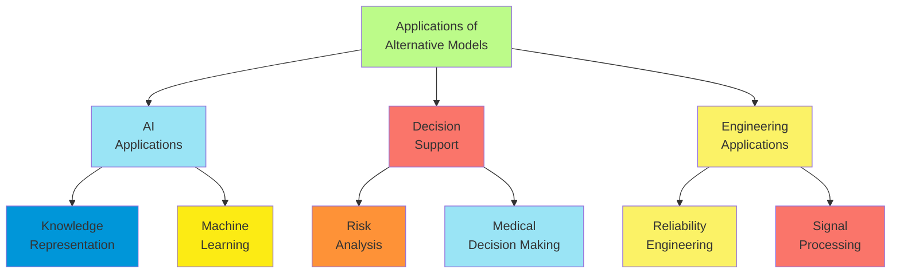

**Decision Support Systems**:

1. **Risk Analysis**:
    - DS-theory for multisource risk assessment
    - Imprecise probabilities for deep uncertainty
    - P-boxes for distribution uncertainty
    - Possibilistic risk measures
2. **Medical Decision Making**:
    - Evidential reasoning for diagnosis
    - Imprecise utilities for treatment selection
    - Possibilistic patient preferences
    - Managing conflict in medical evidence
3. **Environmental Decision Making**:
    - Climate uncertainty with imprecise probabilities
    - Evidential environmental impact assessment
    - Scenario planning with possibility theory
    - Robust decision making under severe uncertainty

**Engineering Applications**:

1. **Signal and Image Processing**:
    - Evidential data fusion for sensor networks
    - Imprecise filtering algorithms
    - Possibilistic pattern recognition
    - Quantum-inspired information retrieval
2. **Fault Diagnosis and Reliability**:
    - DS-theory for component failure diagnosis
    - Imprecise reliability models
    - Possibility theory for qualitative troubleshooting
    - Evidential maintenance decision support
3. **Autonomous Systems**:
    - Credal perception for robotics
    - Evidential simultaneous localization and mapping
    - Possibilistic planning under uncertainty
    - Robust control with credal uncertainty

**Comparative Advantages by Domain**:

1. **Dempster-Shafer Theory Strengths**:
    - Sensor fusion with reliability differences
    - Combining contradictory sources
    - Classification with partial evidence
    - Target identification problems
2. **Possibility Theory Strengths**:
    - Linguistic uncertainty representation
    - Qualitative preference modeling
    - Default reasoning systems
    - Compatibility with fuzzy control
3. **Imprecise Probability Strengths**:
    - Small sample statistical inference
    - Robust Bayesian analysis
    - Severe uncertainty in risk assessment
    - Transparent ignorance representation
4. **Quantum Probability Strengths**:
    - Order effects in judgment
    - Context-dependent preferences
    - Semantic analysis in NLP
    - Modeling violations of classical probability axioms

**Implementation Considerations**:

1. **Computational Efficiency**:
    - Specialized algorithms for particular frameworks
    - Approximate methods for large-scale problems
    - Hardware acceleration opportunities
    - Tradeoffs between expressiveness and tractability
2. **Usability Aspects**:
    - Uncertainty visualization techniques
    - Elicitation interfaces for different frameworks
    - Explanation generation for non-standard uncertainties
    - Result interpretation guidance
3. **Integration Challenges**:
    - Hybrid reasoning systems
    - Interfaces with classical probability models
    - Progressive refinement approaches
    - Pragmatic combinations of multiple frameworks

Alternative uncertainty models offer distinctive capabilities that complement classical probability theory, addressing
scenarios where precise probability assignments are unjustified, impossible, or inappropriate. The selection of an
appropriate framework depends on the specific characteristics of the domain, the quality and nature of available
information, and the requirements of the application.

#### Cognitive Models of Reasoning

##### Human Reasoning Under Uncertainty

Understanding how humans reason under uncertainty provides insights for both cognitive science and artificial
intelligence, revealing systematic patterns that differ from classical normative models.

**Descriptive Models of Human Probabilistic Reasoning**:

1. **Heuristics and Biases Approach**:
    - Availability heuristic: Judging probability by ease of recall
    - Representativeness heuristic: Judging by similarity to prototypes
    - Anchoring and adjustment: Starting from initial values
    - Systematic deviations from Bayesian reasoning
2. **Dual-Process Theories**:
    - System 1: Fast, intuitive, automatic judgments
    - System 2: Slow, deliberative, analytical reasoning
    - Interplay between intuitive and analytical processes
    - Resource limitations in uncertainty processing
3. **Ecological Rationality**:
    - Adaptive heuristics for specific environments
    - Natural frequency representations
    - Fast and frugal decision trees
    - Recognition-based inference

**Key Phenomena in Human Probabilistic Judgment**:

1. **Base Rate Neglect**:
    - Underweighting of prior probabilities
    - Focus on case-specific evidence
    - Conjunction fallacy (judging A&B more likely than A alone)
    - Insensitivity to sample size
2. **Probability Distortion**:
    - Overweighting of small probabilities
    - Underweighting of large probabilities
    - Certainty effect near probability extremes
    - Non-linear probability weighting functions
3. **Framing and Context Effects**:
    - Different judgments from equivalent presentations
    - Reference point dependency
    - Preference reversals with problem framing
    - Context-dependent probability assessments

```mermaid
flowchart TD
    A["Human Reasoning<br>Under Uncertainty"] --> B["Theoretical<br>Models"]
    A --> C["Systematic<br>Phenomena"]
    A --> D["Representation<br>Formats"]
    B --> E["Heuristics and<br>Biases"]
    B --> F["Dual Process<br>Theories"]
    C --> G["Base Rate<br>Neglect"]
    C --> H["Probability<br>Distortion"]
    D --> I["Natural<br>Frequencies"]
    D --> J["Visual<br>Representations"]

    style A fill:#BCFB89
    style B fill:#9AE4F5
    style C fill:#FA756A
    style D fill:#FBF266
    style E fill:#0096D9
    style F fill:#FCEB14
    style G fill:#FE9237
    style H fill:#9AE4F5
    style I fill:#FBF266
    style J fill:#FA756A
```

**Representation Formats and Reasoning**:

1. **Natural Frequencies**:
    - Facilitating Bayesian reasoning through frequency formats
    - Evolution-adapted representations of uncertainty
    - Reducing cognitive load in probabilistic inference
    - Applications in risk communication
2. **Visual Representations**:
    - Icon arrays and frequency grids
    - Tree diagrams for sequential events
    - Euler diagrams for set relations
    - Interactive visualizations for exploration
3. **Verbal Expressions**:
    - Linguistic uncertainty expressions
    - Variability in interpretation of probability terms
    - Cultural and individual differences
    - Calibration of verbal probability expressions

**Individual and Group Differences**:

1. **Expertise Effects**:
    - Domain experts vs. novices
    - Statistical training impacts
    - Metacognitive awareness of biases
    - Professional norms and probabilistic reasoning
2. **Cultural and Developmental Factors**:
    - Cross-cultural variations in uncertainty handling
    - Development of probabilistic reasoning in children
    - Educational approaches to probability
    - Linguistic effects on uncertainty concepts
3. **Cognitive Capacity Factors**:
    - Working memory constraints
    - Numeracy and graph literacy
    - Cognitive reflection and analytical thinking
    - Cognitive load effects on reasoning quality

**Applications to Human-AI Interaction**:

1. **Risk Communication**:
    - Effective presentation of uncertainty
    - Tailoring formats to audience capabilities
    - Avoiding misinterpretation of probabilities
    - Building appropriate trust in probabilistic information
2. **Decision Support**:
    - Complementing human reasoning strengths
    - Addressing systematic biases
    - Format selection for comprehension
    - Interactive exploration of uncertainty
3. **Explanation Design**:
    - Aligning with human mental models
    - Calibrating confidence communication
    - Personalized uncertainty presentation
    - Building accurate metaknowledge

Understanding human reasoning under uncertainty reveals both the capabilities and limitations of intuitive probabilistic
thinking. This knowledge provides essential insights for designing AI systems that effectively communicate uncertainty,
complement human reasoning processes, and support better decision-making under uncertainty.

##### Biases and Heuristics

Human reasoning under uncertainty employs various cognitive shortcuts (heuristics) that, while often efficient, can lead
to systematic errors (biases). Understanding these patterns is crucial for designing systems that work effectively with
human cognition.

**Key Judgment Heuristics**:

1. **Availability Heuristic**:
    - Judging probability by ease of recall or imagination
    - Leads to overestimation of vivid or recent events
    - Media exposure influencing risk perception
    - Applications in risk communication and decision support
2. **Representativeness Heuristic**:
    - Judging probability by similarity to prototypes
    - Leads to conjunction fallacy and base-rate neglect
    - Insensitivity to prior probabilities and sample size
    - Implications for diagnostic reasoning and categorization
3. **Anchoring and Adjustment**:
    - Starting from initial values and adjusting insufficiently
    - Initial estimates strongly influence final judgments
    - Impacts numerical probability assessments
    - Relevance for elicitation methods and negotiation
4. **Affect Heuristic**:
    - Judgments influenced by emotional associations
    - Risk and benefit judgments inversely related
    - Emotions as information for probability assessment
    - Implications for risk communication

**Key Probabilistic Reasoning Biases**:

1. **Base Rate Neglect**:
    - Underutilization of prior probabilities
    - Focus on case-specific information
    - Implications for medical diagnosis and profiling
    - Debiasing through frequency formats
2. **Conjunction Fallacy**:
    - Judging conjunction (A&B) more likely than constituent (A)
    - Violation of probability laws
    - Influenced by representativeness and narrative coherence
    - Implications for scenario planning and forecasting
3. **Confirmation Bias**:
    - Seeking and weighting evidence supporting prior beliefs
    - Insufficient belief revision with contradictory evidence
    - Polarization of opinions with ambiguous evidence
    - Challenges for evidence evaluation systems

```mermaid
flowchart TD
    A["Biases and<br>Heuristics"] --> B["Judgment<br>Heuristics"]
    A --> C["Probabilistic<br>Biases"]
    A --> D["Debiasing<br>Strategies"]
    B --> E["Availability"]
    B --> F["Representativeness"]
    B --> G["Anchoring"]
    C --> H["Base Rate<br>Neglect"]
    C --> I["Conjunction<br>Fallacy"]
    C --> J["Overconfidence"]
    D --> K["Format<br>Changes"]
    D --> L["Training<br>Interventions"]

    style A fill:#BCFB89
    style B fill:#9AE4F5
    style C fill:#FA756A
    style D fill:#FBF266
    style E fill:#0096D9
    style F fill:#FCEB14
    style G fill:#FE9237
    style H fill:#9AE4F5
    style I fill:#FBF266
    style J fill:#FA756A
    style K fill:#0096D9
    style L fill:#FCEB14
```

1. **Overconfidence**:
    - Excessive certainty in judgments
    - Calibration curves showing systematic overconfidence
    - Affects both frequency and probability judgments
    - Critical in expert elicitation and decision making
2. **Probability Weighting Biases**:
    - Overweighting small probabilities
    - Underweighting moderate to large probabilities
    - Certainty effect near probability extremes
    - Implications for risk perception and insurance decisions
3. **Sample Size Insensitivity**:
    - Insufficient appreciation of sample size on reliability
    - "Law of small numbers" - expecting representativeness in small samples
    - Affects data interpretation and experiment design
    - Important for statistical reasoning support

**Debiasing Approaches**:

1. **Representation Formats**:
    - Natural frequencies for Bayesian reasoning
    - Visual aids like icon arrays
    - Tree diagrams for Bayesian updating
    - Experience-based formats over description-based formats
2. **Training Interventions**:
    - Statistical education approaches
    - Calibration training for confidence
    - Consider-the-opposite techniques
    - Metacognitive awareness development
3. **Procedural Interventions**:
    - Structured elicitation protocols
    - Delphi methods for group judgments
    - Pre-commitment to evaluation criteria
    - Devil's advocate approaches
4. **Technology-Assisted Debiasing**:
    - Decision support systems highlighting neglected factors
    - Interactive visualizations of probability spaces
    - Automated checks for consistency
    - Adaptive interfaces based on user's biases

**Applications and Implications**:

1. **Decision Support System Design**:
    - Complementing human weaknesses
    - Presenting information to reduce bias
    - Interface design accounting for heuristics
    - Adaptive debiasing based on user characteristics
2. **Risk Communication**:
    - Selecting formats to counteract biases
    - Framing effects in risk presentation
    - Building appropriate trust in probabilistic information
    - Tailoring to audience capabilities
3. **Expert Elicitation**:
    - Structured protocols accounting for biases
    - Calibration training for experts
    - Combining multiple experts to reduce individual biases
    - Feedback mechanisms for learning
4. **AI System Interaction**:
    - Understanding when humans will trust or distrust AI judgments
    - Designing explanations accounting for human biases
    - Selecting when to intervene with debiasing
    - Joint human-AI decision making leveraging complementary strengths

Understanding biases and heuristics provides essential insights for designing systems that work effectively with human
cognitive processes. Rather than simply viewing these patterns as errors to be eliminated, sophisticated approaches
recognize their ecological validity in certain contexts while developing targeted interventions for situations where
they lead to suboptimal decisions.

##### Psychological Models of Decision Making

Psychological models of decision making under uncertainty capture how humans integrate beliefs, preferences, and
contextual factors when choosing among alternatives.

**Expected Utility Theory and Violations**:

1. **Classical Expected Utility**:
    - Normative model: maximize expected utility
    - Axioms: completeness, transitivity, independence, continuity
    - Utility as representation of preferences
    - Subjective probability for beliefs
2. **Allais Paradox**:
    - Violations of independence axiom
    - Certainty effect in choices
    - Risk attitudes dependent on certainty
    - Implications for preference modeling
3. **Ellsberg Paradox**:
    - Ambiguity aversion
    - Preference for known over unknown probabilities
    - Distinction between risk and uncertainty
    - Challenges for subjective expected utility

**Descriptive Decision Models**:

1. **Prospect Theory**:
    - Reference-dependent evaluation
    - Value function: concave for gains, convex for losses
    - Loss aversion: losses loom larger than gains
    - Probability weighting function: inverse S-shaped
2. **Cumulative Prospect Theory**:
    - Rank-dependent probability weighting
    - Accommodating complex gambles
    - Different weighting for gains vs. losses
    - Explaining fourfold pattern of risk attitudes
3. **Regret Theory**:
    - Anticipated regret influencing decisions
    - Comparative evaluation of outcomes
    - Violation of transitivity
    - Applications in risky choice domains

```mermaid
flowchart TD
    A["Psychological<br>Decision Models"] --> B["Normative<br>Models"]
    A --> C["Descriptive<br>Models"]
    A --> D["Process<br>Models"]
    B --> E["Expected<br>Utility"]
    B --> F["Subjective<br>Expected Utility"]
    C --> G["Prospect<br>Theory"]
    C --> H["Regret<br>Theory"]
    D --> I["Decision Field<br>Theory"]
    D --> J["Dual Process<br>Models"]

    style A fill:#BCFB89
    style B fill:#9AE4F5
    style C fill:#FA756A
    style D fill:#FBF266
    style E fill:#0096D9
    style F fill:#FCEB14
    style G fill:#FE9237
    style H fill:#9AE4F5
    style I fill:#FBF266
    style J fill:#FA756A
```

**Decision Process Models**:

1. **Decision Field Theory**:
    - Dynamic stochastic process of preference development
    - Attention switching between attributes
    - Threshold-based choice commitment
    - Time pressure effects on decision quality
2. **Query Theory**:
    - Sequential retrieval of arguments for options
    - Order effects in argument generation
    - Memory processes influencing preference construction
    - Applications in preference reversals
3. **Drift Diffusion Models**:
    - Evidence accumulation to decision boundaries
    - Response time predictions
    - Speed-accuracy tradeoffs
    - Neural mechanisms of decision making
4. **Recognition-Primed Decision Making**:
    - Expert pattern recognition
    - Situation assessment and mental simulation
    - Limited deliberative comparison
    - Applications in naturalistic decision settings

**Bounded Rationality Approaches**:

1. **Satisficing**:
    - Search for good-enough alternatives
    - Aspiration level adjustment
    - Stopping rules for information search
    - Ecological rationality perspective
2. **Fast and Frugal Heuristics**:
    - Simple decision rules for specific environments
    - Take-the-best and recognition heuristics
    - Less-is-more effects in prediction
    - Adaptive toolbox perspective
3. **Resource-Rational Analysis**:
    - Optimal resource allocation for decisions
    - Bounded optimality under computational constraints
    - Rational metareasoning about deliberation
    - Bridging normative and descriptive approaches

**Applications to AI and Decision Support**:

1. **Preference Elicitation**:
    - Accounting for reference points
    - Methods robust to framing effects
    - Adaptive questioning based on decision models
    - Consistency checking across elicitation methods
2. **Choice Architecture**:
    - Default option design
    - Information presentation to support better decisions
    - Debiasing through environment design
    - Libertarian paternalism approaches
3. **Decision Support Systems**:
    - Complementing human decision weaknesses
    - Adapting to individual decision styles
    - Preference learning from choices
    - Explanation design aligned with decision processes
4. **Human-AI Decision Collaboration**:
    - Division of decision labor based on strengths
    - Adaptive interfaces reflecting decision phase
    - Trust calibration through process transparency
    - Joint decision optimization accounting for human models

Psychological models of decision making provide essential insights for designing AI systems that effectively support,
complement, or mimic human decision processes. Understanding how humans actually make decisions, rather than simply how
they should decide, enables the development of technologies that work with rather than against natural decision
processes.

##### Computational Models of Human Judgment

Computational models formalize human judgment under uncertainty as algorithmic processes, creating testable theories
that can be implemented in cognitive systems and artificial intelligence.

**Bayesian Models of Cognition**:

1. **Rational Process Models**:
    - Bayesian inference as normative foundation
    - Resource-bounded approximations
    - Sampling-based inference models
    - Optimality under constraints
2. **Hierarchical Bayesian Models**:
    - Structured knowledge representation
    - Learning at multiple levels of abstraction
    - Inductive biases through hierarchical priors
    - Explaining rapid learning and generalization
3. **Probabilistic Programs**:
    - Structured generative models
    - Causal reasoning capabilities
    - Hypothesis space as program space
    - Flexibility in knowledge representation

**Heuristic Models**:

1. **Fast and Frugal Trees**:
    - Sequential decision rules
    - Limited information search
    - Lexicographic decision procedures
    - Ecological rationality
2. **ACT-R and Production Systems**:
    - Production rules with utilities
    - Learning mechanisms for rule selection
    - Architectural constraints on processing
    - Unified cognitive architecture
3. **Exemplar Models**:
    - Instance-based learning
    - Similarity-based judgment
    - Memory retrieval processes
    - ALCOVE and GCM implementations

```mermaid
flowchart TD
    A["Computational<br>Judgment Models"] --> B["Bayesian<br>Models"]
    A --> C["Heuristic<br>Models"]
    A --> D["Neural<br>Models"]
    B --> E["Hierarchical<br>Bayesian"]
    B --> F["Sampling<br>Approaches"]
    C --> G["Fast and<br>Frugal"]
    C --> H["Production<br>Systems"]
    D --> I["Connectionist<br>Networks"]
    D --> J["Deep Learning<br>Approaches"]

    style A fill:#BCFB89
    style B fill:#9AE4F5
    style C fill:#FA756A
    style D fill:#FBF266
    style E fill:#0096D9
    style F fill:#FCEB14
    style G fill:#FE9237
    style H fill:#9AE4F5
    style I fill:#FBF266
    style J fill:#FA756A
```

**Neural and Connectionist Models**:

1. **Parallel Constraint Satisfaction**:
    - Activation spreading through networks
    - Constraint satisfaction dynamics
    - Emergent coherence in judgment
    - Applications to impression formation and causal reasoning
2. **Deep Learning Approaches**:
    - Neural networks learning from experience
    - Distributed representations of concepts
    - End-to-end modeling of judgment processes
    - Scaling to complex naturalistic domains
3. **Drift Diffusion Neural Implementations**:
    - Neural implementations of evidence accumulation
    - Response time predictions
    - Neural correlates of decision variables
    - Linking computational and neural levels

**Quantum Cognition Models**:

1. **Quantum Probability Theory**:
    - Non-classical probability rules
    - Superposition of judgment states
    - Interference effects in reasoning
    - Order effects in sequential judgments
2. **Hilbert Space Representations**:
    - Mental states as vectors in Hilbert space
    - Incompatible questions as non-commuting operators
    - Contextuality in human judgment
    - Violations of classical probability axioms
3. **Quantum Decision Theory**:
    - Explaining conjunction and disjunction fallacies
    - Preference reversals and framing effects
    - Context-dependent preferences
    - Violations of sure-thing principle

**Model Evaluation Approaches**:

1. **Quantitative Model Comparison**:
    - Parameter estimation methods
    - Cross-validation techniques
    - Information criteria (AIC, BIC)
    - Bayesian model comparison
2. **Qualitative Pattern Prediction**:
    - Signature effects predicted by models
    - Critical tests between competing explanations
    - Novel predictions for empirical testing
    - Generalization to new domains
3. **Process Tracing Methods**:
    - Eye-tracking data
    - Mouse-tracking trajectories
    - Verbal protocols
    - Response time distributions

**Applications to AI and Cognitive Systems**:

1. **Cognitive Architectures**:
    - Integrated systems for human-like reasoning
    - Constraining AI with human cognitive limitations
    - Modeling interaction between reasoning components
    - SOAR, ACT-R, and neural-symbolic systems
2. **Human-AI Collaboration**:
    - Predicting human judgments
    - Complementing human weaknesses
    - Calibrating trust through transparent models
    - Mixed-initiative systems with shared mental models
3. **Cognitive Tutoring Systems**:
    - Student modeling based on cognitive theories
    - Error diagnosis from computational models
    - Adaptive instruction based on learning trajectories
    - Metacognitive support for judgment improvement
4. **Explanation Generation**:
    - Explanations aligned with human mental models
    - Process-based vs. outcome-based explanations
    - Adapting explanations to cognitive capacities
    - Building appropriate mental models in users

Computational models of human judgment provide rigorous, testable frameworks for understanding how people reason under
uncertainty. Beyond their value for cognitive science, these models inform the development of AI systems that can
effectively collaborate with humans, predict their judgments, and provide meaningful support for decision-making under
uncertainty.

##### Implications for AI System Design

Understanding human cognition under uncertainty has profound implications for designing AI systems that effectively
complement human capabilities, communicate appropriately, and integrate into human decision processes.

**Interface Design Principles**:

1. **Uncertainty Visualization**:
    - Formats matching human cognitive processing
    - Calibrated to human probability perception
    - Interactive exploration of uncertainty
    - Adaptive displays for different users and contexts
2. **Information Presentation**:
    - Natural frequency formats for improved comprehension
    - Reference point selection for outcome framing
    - Progressive disclosure of complexity
    - Comparative presentation facilitating judgment
3. **Cognitive Load Management**:
    - Offloading computational aspects of reasoning
    - Preserving attention for value-based decisions
    - Chunking information appropriately
    - Working memory constraints in information design

**Decision Support Approaches**:

1. **Complementary Strengths Integration**:
    - AI handling statistical computation
    - Humans providing values and contextual knowledge
    - Hybrid decision processes leveraging both
    - Adaptive allocation based on comparative advantage
2. **Debiasing through Design**:
    - Highlighting neglected information
    - Countering availability with representative data
    - Structured processes addressing confirmation bias
    - Calibration feedback for confidence
3. **Preference Elicitation Methods**:
    - Robust to framing and elicitation effects
    - Indirect preference learning from choices
    - Consistency checking across methods
    - Meta-preference consideration

```mermaid
flowchart TD
    A["AI Design<br>Implications"] --> B["Interface<br>Design"]
    A --> C["Decision<br>Support"]
    A --> D["Trust<br>Management"]
    B --> E["Uncertainty<br>Visualization"]
    B --> F["Cognitive Load<br>Management"]
    C --> G["Debiasing<br>Approaches"]
    C --> H["Preference<br>Elicitation"]
    D --> I["Appropriate<br>Trust"]
    D --> J["Explanation<br>Design"]

    style A fill:#BCFB89
    style B fill:#9AE4F5
    style C fill:#FA756A
    style D fill:#FBF266
    style E fill:#0096D9
    style F fill:#FCEB14
    style G fill:#FE9237
    style H fill:#9AE4F5
    style I fill:#FBF266
    style J fill:#FA756A
```

**Trust Calibration Mechanisms**:

1. **Appropriate Trust Development**:
    - Transparency aligned with human mental models
    - Uncertainty communication calibrated to confidence
    - Progressive trust building through experience
    - Prevention of automation bias and over-reliance
2. **Explanation Design**:
    - Process-based explanations of reasoning
    - Counterfactual explanations for understanding
    - Explanations targeting specific mental models
    - Adaptive detail based on user expertise
3. **Error Communication**:
    - Honest communication of limitations
    - Setting appropriate expectations
    - Graceful failure modes
    - Joint human-AI error recovery

**Cognitive Compatibility Approaches**:

1. **Mental Model Alignment**:
    - Developing shared understanding between human and AI
    - Explicit modeling of user beliefs and knowledge
    - Interface design supporting accurate mental models
    - Detecting and correcting misalignments
2. **Process Compatibility**:
    - Matching AI processes to human reasoning patterns
    - Sequential information revelation matching attention
    - Supporting natural information search strategies
    - Adapting to individual cognitive styles
3. **Value Alignment**:
    - Eliciting and respecting human values
    - Transparency about value trade-offs
    - Preference learning from choices and feedback
    - Supporting value reflection and refinement

**Application Domain Adaptations**:

1. **Medical Decision Support**:
    - Natural frequencies for diagnostic information
    - Visual risk communication for patients
    - Supporting physicians' pattern recognition
    - Highlighting neglected diagnostic alternatives
2. **Financial Decision Systems**:
    - Framing-resistant presentation of options
    - Risk communication calibrated to perception
    - Countering present bias in long-term planning
    - Supporting trade-off analysis and sensitivity testing
3. **Security and Intelligence Analysis**:
    - Structured analytical techniques countering biases
    - Explicit treatment of source reliability
    - Support for hypothesis generation and testing
    - Collaborative human-AI analysis processes
4. **Educational Technology**:
    - Developing intuitive understanding of uncertainty
    - Interactive exploration of probabilistic concepts
    - Metacognitive support for reasoning
    - Adaptive tutoring based on cognitive models

AI systems designed with awareness of human cognitive patterns can provide more effective support for reasoning under
uncertainty. Rather than assuming idealized rationality or attempting to eliminate human judgment, cognitive-inspired AI
design creates systems that complement human strengths, compensate for limitations, and integrate successfully into
human decision processes.
