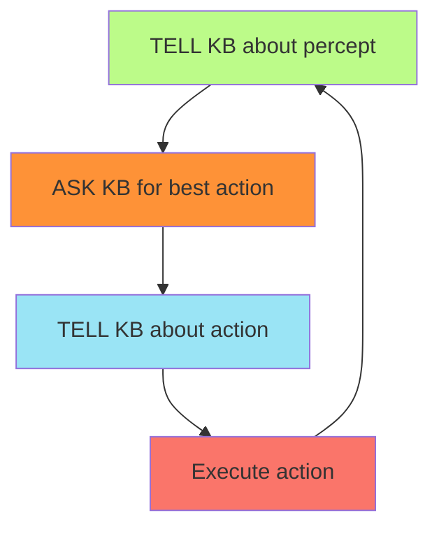
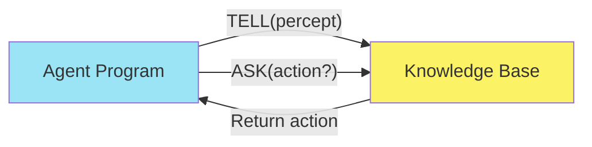
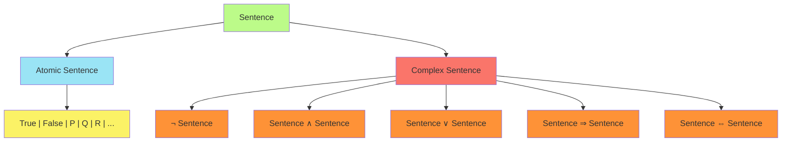
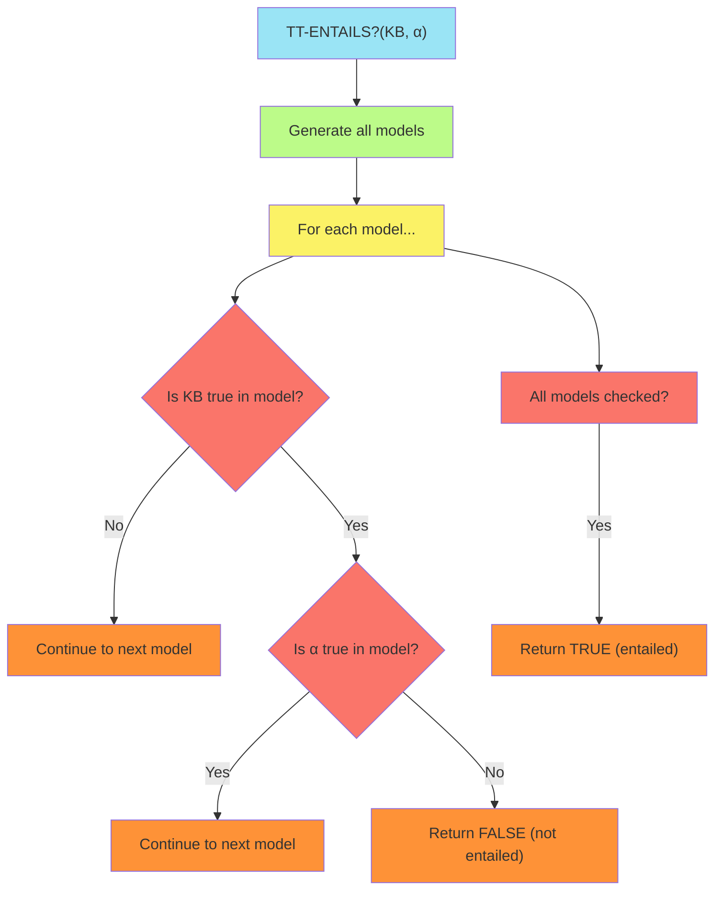
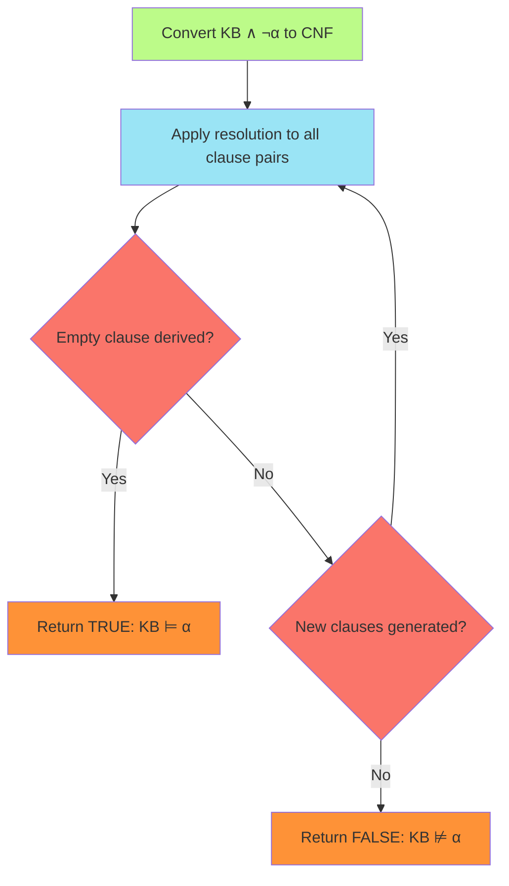
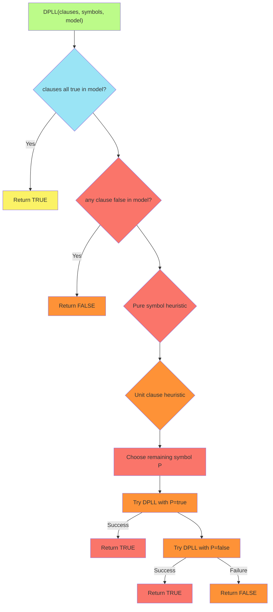
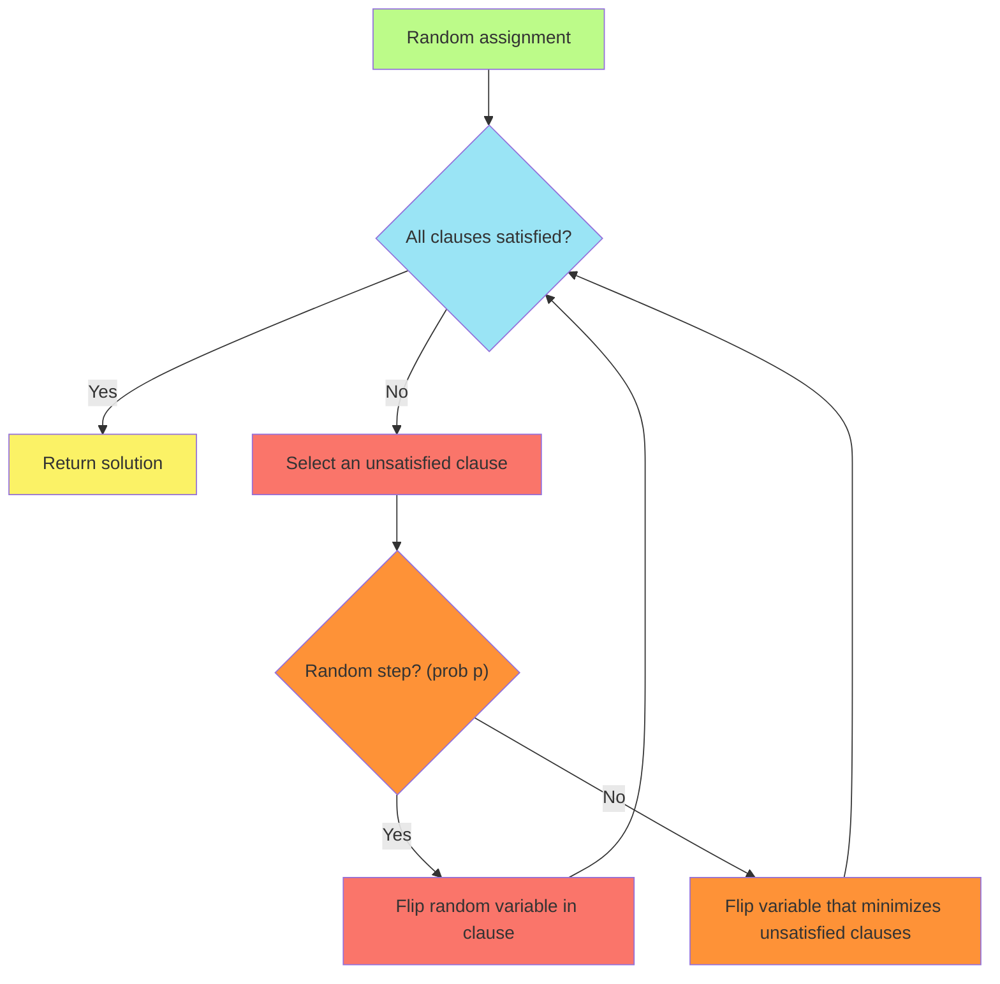
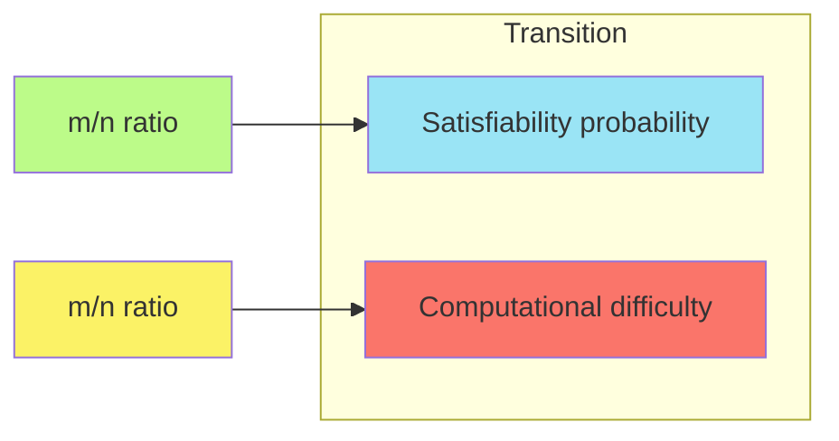

# C-7 | S-3: Logical Agents and Propositional Logic

1. Knowledge-Based Agents
    - The Knowledge-Based Agent Architecture
    - TELL and ASK Interface
    - The Wumpus World Environment as a Test Case
    - Knowledge Engineering for Agent Design
2. Propositional Logic Fundamentals
    - Syntax and Semantics of Propositional Logic
    - Truth Tables and Logical Connectives
    - Equivalence, Validity, and Satisfiability
    - Entailment and Logical Consequence
3. Inference in Propositional Logic
    - Model Checking and Truth Tables
    - Proof-Based Inference Methods
    - The Resolution Rule and Resolution Proofs
    - Completeness of Resolution
4. Efficient Propositional Inference
    - The DPLL Algorithm
    - Heuristics for SAT Solving
    - Local Search for Satisfiability
    - The Threshold Phenomenon in Random SAT

## Knowledge-Based Agents

Knowledge-based agents distinguish themselves from simpler reflex agents by maintaining an internal representation of
their environment - a knowledge base (KB) - and using logical inference to decide what actions to take. This approach
allows them to function effectively in complex, partially observable environments.

#### The Knowledge-Based Agent Architecture

The core of a knowledge-based agent is its knowledge base, which contains sentences in a knowledge representation
language. The agent's operation follows a simple cycle:

This architecture includes:

##### Knowledge Base (KB)

The KB contains facts about the world represented in a formal language. It consists of:

- **Axioms**: Background knowledge built into the KB initially
- **Percept sentences**: Facts learned from observations
- **Action records**: History of actions taken by the agent

##### Inference Engine

The system that derives new information from the existing KB using logical rules.

##### Interface Functions

- **TELL**: Adds new sentences to the KB
- **ASK**: Queries the KB and returns answers based on what the KB entails

The fundamental advantage of knowledge-based agents is their flexibility. Unlike reflex agents, they can be updated with
new knowledge without requiring changes to the underlying code.

#### TELL and ASK Interface

The TELL and ASK operations form the core interface between the KB and the agent program:

- **TELL(KB, sentence)**: Adds the given sentence to the knowledge base
- **ASK(KB, query)**: Returns a substitution that makes the query true, or FALSE if none exists

These operations maintain a division between the knowledge (what the agent knows) and the reasoning (how it uses that
knowledge).

#### The Wumpus World Environment as a Test Case

The Wumpus World serves as an instructive example for knowledge-based agents. It consists of:

- A cave with rooms arranged in a grid
- A terrible wumpus monster that eats anyone entering its room
- Pits that trap the unwary explorer
- A heap of gold to be found

The agent can detect:

- Stench (adjacent to wumpus)
- Breeze (adjacent to pit)
- Glitter (in the same room as gold)
- Bump (when hitting a wall)
- Scream (when the wumpus is killed)

The agent moves through the cave, gathering information and updating its KB, with the goal of finding the gold and
avoiding danger.

##### Example Knowledge in the Wumpus World:

- "There is no pit in [1,1]": ¬P₁,₁
- "A square is breezy if and only if there is a pit in a neighboring square": B₁,₁ ⇔ (P₁,₂ ∨ P₂,₁)
- "The first square has no breeze": ¬B₁,₁
- "The second square has a breeze": B₂,₁

From these facts, a knowledge-based agent can deduce there is no pit in [1,2], demonstrating logical inference.

#### Knowledge Engineering for Agent Design

Knowledge engineering is the process of:

1. Identifying what knowledge is required
2. Formulating that knowledge in the representation language
3. Testing and refining the knowledge base

This process creates a general-purpose KB that can answer a variety of queries. The challenge lies in capturing the
right level of knowledge - too detailed and the system becomes unwieldy; too abstract and it becomes useless.

Knowledge-based agents gain flexibility from the declarative nature of their knowledge (separate from the inference
process) and their ability to learn by accepting new facts into the KB.

## Propositional Logic Fundamentals

Propositional logic provides a formal foundation for representing and reasoning about facts. While limited compared to
more expressive logics, it demonstrates the basic principles of logical representation and inference.

#### Syntax and Semantics of Propositional Logic

##### Syntax

Propositional logic consists of:

- **Proposition symbols**: P, Q, R, etc. (atomic statements that can be true or false)
- **Logical connectives**: ¬ (not), ∧ (and), ∨ (or), ⇒ (implies), ⇔ (if and only if)
- **Parentheses**: Used to group expressions

A well-formed formula can be:

- A single proposition symbol (e.g., P)
- A negation of a formula (e.g., ¬P)
- Two formulas connected by a binary connective (e.g., P ∧ Q)

##### Semantics

The semantics of propositional logic defines the meaning of formulas:

- A **model** is an assignment of true/false values to proposition symbols
- Given a model, we can determine the truth value of any sentence using rules for the logical connectives
- A sentence is **satisfied** by a model if it evaluates to true in that model
- A sentence is **valid** if true in all models (tautology)
- A sentence is **satisfiable** if true in at least one model
- A sentence is **unsatisfiable** if false in all models (contradiction)

#### Truth Tables and Logical Connectives

Truth tables define the semantics of logical connectives by showing their output for every possible input combination:

| P   | Q   | ¬P  | P ∧ Q | P ∨ Q | P ⇒ Q | P ⇔ Q |
| --- | --- | --- | ----- | ----- | ----- | ----- |
| F   | F   | T   | F     | F     | T     | T     |
| F   | T   | T   | F     | T     | T     | F     |
| T   | F   | F   | F     | T     | F     | F     |
| T   | T   | F   | T     | T     | T     | T     |

Key points about connectives:

- **Negation (¬)**: Flips the truth value
- **Conjunction (∧)**: True only when both inputs are true
- **Disjunction (∨)**: True when at least one input is true
- **Implication (⇒)**: False only when antecedent is true and consequent is false
- **Biconditional (⇔)**: True when both sides have the same truth value

Implication deserves special attention as its semantics can be counterintuitive:

- "P ⇒ Q" means "if P then Q"
- It's false only when P is true and Q is false
- It's true when P is false, regardless of Q (vacuously true)
- Example: "If it's raining, the ground is wet" is false only when it's raining but the ground isn't wet

#### Equivalence, Validity, and Satisfiability

##### Logical Equivalence

Two sentences are logically equivalent (α ≡ β) if they have the same truth value in all models.

Important equivalences include:

- **Double negation**: ¬(¬α) ≡ α
- **Commutativity**: (α ∧ β) ≡ (β ∧ α); (α ∨ β) ≡ (β ∨ α)
- **De Morgan's laws**: ¬(α ∧ β) ≡ (¬α ∨ ¬β); ¬(α ∨ β) ≡ (¬α ∧ ¬β)
- **Implication**: (α ⇒ β) ≡ (¬α ∨ β)
- **Contraposition**: (α ⇒ β) ≡ (¬β ⇒ ¬α)
- **Biconditional**: (α ⇔ β) ≡ ((α ⇒ β) ∧ (β ⇒ α))

##### Validity and Satisfiability

- A sentence is **valid** (a tautology) if it's true in all models (e.g., P ∨ ¬P)
- A sentence is **satisfiable** if it's true in at least one model
- A sentence is **unsatisfiable** (a contradiction) if it's false in all models (e.g., P ∧ ¬P)

These concepts are related:

- α is valid iff ¬α is unsatisfiable
- α is satisfiable iff ¬α is not valid

#### Entailment and Logical Consequence

Entailment (⊨) is a fundamental relationship in logic:

- α ⊨ β means "α entails β" or "β follows logically from α"
- Formally: α ⊨ β if and only if every model that satisfies α also satisfies β
- Alternatively: α ⊨ β if and only if the sentence (α ⇒ β) is valid

Important properties of entailment:

- **Deduction theorem**: α ⊨ β if and only if the sentence (α ⇒ β) is valid
- **Proof by contradiction**: α ⊨ β if and only if (α ∧ ¬β) is unsatisfiable

Entailment defines what conclusions can be validly drawn from a set of premises. The fundamental goal of logical
inference is to determine whether KB ⊨ α, that is, whether sentence α follows from the knowledge base KB.

## Inference in Propositional Logic

Inference is the process of deriving new sentences from existing ones. An inference procedure must be both:

- **Sound**: It derives only sentences that are entailed (no false conclusions)
- **Complete**: It can derive any sentence that is entailed (no missed truths)

#### Model Checking and Truth Tables

The most straightforward method of inference is model checking:

1. Enumerate all possible models
2. Check if the query is true in every model where the KB is true

For n proposition symbols, there are 2ⁿ possible models, making this approach exponential in complexity. However, it is
simple to implement and guaranteed to terminate.

Example: To determine if P₁,₁ ⇒ (P₁,₂ ∨ P₂,₁) and ¬P₁,₁ entail ¬P₁,₂, we check all possible truth assignments to the
propositions.

#### Proof-Based Inference Methods

Instead of checking models, we can apply inference rules to derive new sentences directly from the KB. Key inference
rules include:

- **Modus Ponens**: From α ⇒ β and α, infer β
- **And-Elimination**: From α ∧ β, infer α (or infer β)
- **And-Introduction**: From α and β, infer α ∧ β
- **Or-Introduction**: From α, infer α ∨ β (for any β)
- **Unit Resolution**: From α ∨ β and ¬α, infer β

A proof is a sequence of sentences, each derived from previous sentences using inference rules, ending with the goal
sentence.

Advantages of proof-based inference:

- Can be more efficient than model checking for large KBs
- Provides an explanation of why the conclusion follows
- May allow us to prove properties of infinite domains

#### The Resolution Rule and Resolution Proofs

Resolution is a powerful inference rule that forms the basis of many automated reasoning systems:

From (α ∨ β) and (¬α ∨ γ), infer (β ∨ γ)

For propositional logic, resolution works with clauses (disjunctions of literals). The general resolution rule is:

From (ℓ₁ ∨ ... ∨ ℓₖ) and (m₁ ∨ ... ∨ mₙ), where ℓᵢ and mⱼ are complementary literals, infer: (ℓ₁ ∨ ... ∨ ℓᵢ₋₁ ∨ ℓᵢ₊₁ ∨
... ∨ ℓₖ ∨ m₁ ∨ ... ∨ mⱼ₋₁ ∨ mⱼ₊₁ ∨ ... ∨ mₙ)

To use resolution for inference:

1. Convert KB and the negation of the query to Conjunctive Normal Form (CNF)
2. Apply resolution repeatedly to derive new clauses
3. If the empty clause is derived, the original query is entailed by the KB

Example resolution proof for the Wumpus World (simplified):

1. ¬P₁,₁ (no pit in [1,1])
2. B₁,₁ ⇔ (P₁,₂ ∨ P₂,₁) (breeze iff adjacent pit)
3. ¬B₁,₁ (no breeze in [1,1])

Converting to CNF and applying resolution:

- From 2: (¬B₁,₁ ∨ P₁,₂ ∨ P₂,₁) and (B₁,₁ ∨ ¬P₁,₂) and (B₁,₁ ∨ ¬P₂,₁)
- From 3 and (B₁,₁ ∨ ¬P₁,₂): ¬P₁,₂
- From 3 and (B₁,₁ ∨ ¬P₂,₁): ¬P₂,₁

So we've proven there's no pit in [1,2] or [2,1].

#### Completeness of Resolution

A key theoretical result is that resolution is refutation-complete. This means:

If a set of clauses is unsatisfiable, then the resolution closure (the set of all clauses derivable by resolution)
contains the empty clause.

In other words, if KB ⊨ α, then applying resolution to KB ∧ ¬α will eventually derive a contradiction (the empty
clause).

This completeness guarantees that resolution can determine the truth of any entailment in propositional logic, though it
might take exponential time in the worst case.

## Efficient Propositional Inference

While truth tables and resolution are theoretically complete, practical inference systems need efficiency. Modern
approaches include search-based methods and local optimization techniques.

#### The DPLL Algorithm

The Davis-Putnam-Logemann-Loveland (DPLL) algorithm is a backtracking search algorithm for determining satisfiability:

DPLL improves upon basic backtracking with:

##### Early Termination

- Stops when a clause is definitely satisfied or violated

##### Pure Symbol Heuristic

- A pure symbol (appears always positive or always negative) can always be assigned to make its literals true

##### Unit Clause Heuristic

- A unit clause (single literal) forces an assignment to satisfy it
- Leads to unit propagation – a cascade of forced assignments

Modern DPLL-based solvers incorporate additional techniques:

- Intelligent backtracking
- Clause learning
- Variable ordering heuristics
- Random restarts

These improvements allow DPLL to solve problems with thousands of variables.

#### Heuristics for SAT Solving

Efficient SAT solvers rely on heuristics for variable selection:

##### Variable Selection Heuristics

- **Most Constrained Variable**: Choose variables that appear in the most clauses
- **Most Constraining Variable**: Choose variables that appear in the shortest clauses
- **Dynamic Largest Individual Sum (DLIS)**: Choose the literal that appears most frequently

##### Value Selection Heuristics

- Try the value that satisfies the most clauses first

Modern SAT solvers like CHAFF, MiniSat, and Glucose use sophisticated heuristics like:

- **Variable State Independent Decaying Sum (VSIDS)**: Favor variables in recently derived conflict clauses
- **Phase saving**: Remember the last value tried for each variable

These heuristics dramatically reduce the effective branching factor, making previously intractable problems solvable.

#### Local Search for Satisfiability

Local search algorithms start with a complete assignment and iteratively improve it:

##### WALKSAT Algorithm

1. Start with a random assignment to all variables
2. While there are unsatisfied clauses:
    - Pick an unsatisfied clause C
    - With probability p, flip a random variable in C
    - Otherwise, flip the variable in C that minimizes the number of clauses made unsatisfied

Local search has advantages:

- Often finds solutions quickly for satisfiable problems
- Uses minimal memory
- Can handle very large problems

Disadvantages:

- Incomplete (cannot prove unsatisfiability)
- May get stuck in local minima

Advanced techniques include:

- Simulated annealing
- Tabu search
- Restarts with different random seeds

#### The Threshold Phenomenon in Random SAT

An interesting empirical observation is the **phase transition** in random SAT problems:

- For a random SAT problem with n variables and m clauses:
    - When the clause-to-variable ratio m/n is low, problems are usually satisfiable
    - When the ratio is high, problems are usually unsatisfiable
    - At a critical threshold ratio (around 4.3 for 3-SAT), there's a sharp transition

The hardest problems tend to be near this threshold:

- Below the threshold, many solutions exist and are easy to find
- Above the threshold, contradictions are abundant and easy to detect
- At the threshold, problems require the most computational effort

This phenomenon has theoretical importance and practical implications for algorithm testing and benchmark generation.

The SAT problem's transition from easy-satisfiable to easy-unsatisfiable with a narrow hard region in between parallels
similar phenomena in statistical physics and provides insights into computational complexity.
