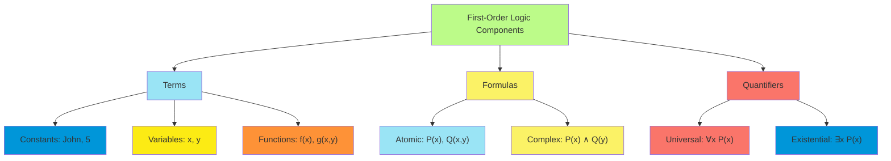
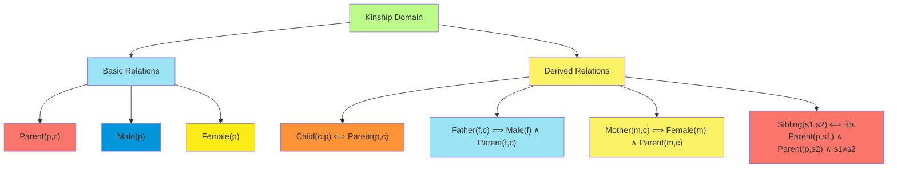
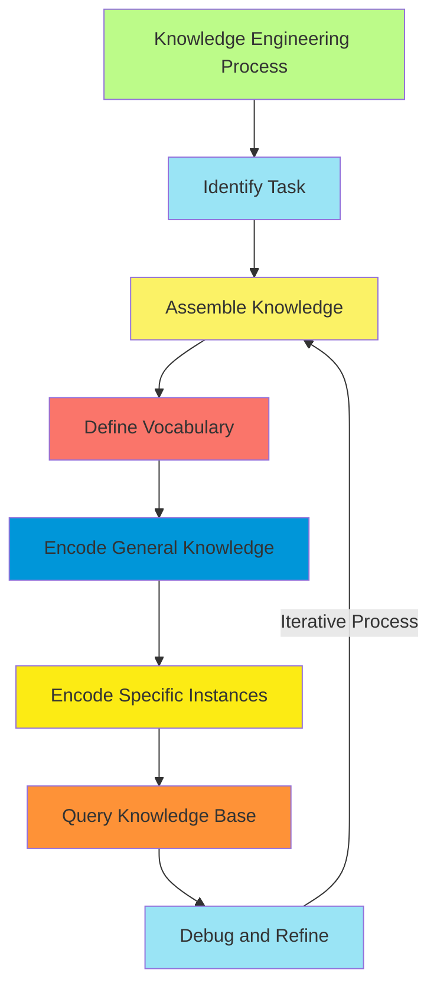

# C-8 | S-3: First-Order Logic

1. Beyond Propositional Logic
    - Limitations of Propositional Representations
    - Syntax and Semantics of First-Order Logic
    - Terms, Predicates, and Quantifiers
    - Models for First-Order Logic
2. Representing Knowledge in First-Order Logic
    - Assertions and Queries in First-Order Logic
    - The Kinship Domain Example
    - Numbers, Sets, and Lists
    - The Wumpus World in First-Order Logic
3. Equality and Functions in FOL
    - Identity and Substitution
    - Functions and Functional Terms
    - Extending FOL with Equality
    - Unique Names and Domain Closure
4. Knowledge Engineering in First-Order Logic
    - The Process of Knowledge Engineering
    - Representing the Electronic Circuits Domain
    - Organizing Knowledge with Classes and Instances
    - Testing and Debugging Knowledge Bases

#### Beyond Propositional Logic

##### Limitations of Propositional Representations

Propositional logic, while powerful for certain domains, exhibits fundamental limitations when attempting to represent
complex domains with multiple entities and relationships. These constraints manifest in several ways:

1. **Lack of Expressiveness**: Propositional logic cannot directly express general statements about collections of
   objects. For instance, the assertion "all humans are mortal" requires enumeration of individual propositions for each
   human entity.
2. **Inability to Represent Relationships**: Relationships between objects cannot be directly expressed. The statement
   "John is taller than Mary" necessitates a single proposition $TallerThan(John, Mary)$ without revealing the
   underlying relational structure.
3. **Combinatorial Explosion**: As the number of objects increases, the number of required propositions grows
   exponentially, leading to unwieldy knowledge bases.

Consider the Wumpus World example: To represent "there is a pit in [1,3] or [2,2]" in propositional logic, we must use
the disjunction $P_{1,3} \vee P_{2,2}$. However, to express "there is a pit in at least one of the squares adjacent to
[1,1]", we need the lengthy proposition $P_{1,2} \vee P_{2,1}$. This approach becomes prohibitively complex as the
domain expands.

##### Syntax and Semantics of First-Order Logic

First-order logic (FOL) extends propositional logic by introducing quantifiers, variables, predicates, and functions.
This richer syntactic framework enables the representation of complex domains with multiple objects and relationships.

The syntactic elements of FOL include:

1. **Constants**: Symbols representing specific objects (e.g., $John$, $5$, $Paris$)
2. **Variables**: Symbols that can refer to different objects (e.g., $x$, $y$, $z$)
3. **Predicates**: Symbols representing relations or properties (e.g., $Tall(x)$, $Greater(x,y)$)
4. **Functions**: Symbols representing mappings between objects (e.g., $father(John)$, $bestFriend(x)$)
5. **Connectives**: Logical operators from propositional logic ($\neg$, $\wedge$, $\vee$, $\Rightarrow$,
   $\Leftrightarrow$)
6. **Quantifiers**: Universal ($\forall$) and Existential ($\exists$)

The semantics of FOL are defined with respect to an interpretation that specifies:

- A non-empty domain of discourse $D$ (the set of objects under consideration)
- A mapping from constants to elements in $D$
- A mapping from function symbols to functions on $D$
- A mapping from predicate symbols to relations on $D$

##### Terms, Predicates, and Quantifiers

**Terms** in FOL represent objects and can be:

- Constants (e.g., $John$, $7$)
- Variables (e.g., $x$, $y$)
- Functions applied to other terms (e.g., $father(John)$, $plus(x,5)$)

**Predicates** represent properties of objects or relationships between objects. A predicate applied to terms creates an
**atomic formula** (e.g., $Tall(John)$, $Loves(John, Mary)$).

**Quantifiers** allow statements about collections of objects:

1. **Universal Quantifier** ($\forall$): Represents "for all" statements
    - $\forall x \ P(x)$ means "for all objects $x$, $P(x)$ is true"
    - Example: $\forall x \ (Human(x) \Rightarrow Mortal(x))$ (All humans are mortal)
2. **Existential Quantifier** ($\exists$): Represents "there exists" statements
    - $\exists x \ P(x)$ means "there exists at least one object $x$ such that $P(x)$ is true"
    - Example: $\exists x \ (Cat(x) \wedge Owns(John, x))$ (John owns at least one cat)

The **scope** of a quantifier is the formula to which it applies. Variables may be **bound** (within the scope of a
quantifier) or **free** (not bound by any quantifier).



##### Models for First-Order Logic

A model in FOL consists of:

1. **Domain** ($D$): A non-empty set of objects
2. **Interpretation Function** ($I$): Maps constants, functions, and predicates to elements, functions, and relations in
   the domain

Formally, for a model $M = \langle D, I \rangle$:

- $I(c)$ is an element of $D$ for each constant $c$
- $I(f)$ is a function $D^n \rightarrow D$ for each $n$-ary function symbol $f$
- $I(P)$ is a relation $D^n \rightarrow {true, false}$ for each $n$-ary predicate symbol $P$

The truth value of a formula $\phi$ in model $M$ is determined recursively:

- For atomic formulas: $P(t_1, ..., t_n)$ is true iff $(I(t_1), ..., I(t_n)) \in I(P)$
- For complex formulas with connectives: Apply the same rules as in propositional logic
- For quantified formulas:
    - $\forall x \ \phi$ is true iff $\phi[x/d]$ is true for all $d \in D$
    - $\exists x \ \phi$ is true iff $\phi[x/d]$ is true for at least one $d \in D$

where $\phi[x/d]$ represents the substitution of $d$ for $x$ in $\phi$.

A formula is **satisfiable** if there exists a model in which it is true, **valid** if it is true in all models, and
**unsatisfiable** if it is false in all models.

#### Representing Knowledge in First-Order Logic

##### Assertions and Queries in First-Order Logic

Knowledge representation in FOL involves two primary operations:

1. **Assertions**: Adding knowledge to the knowledge base (KB)
    - Facts about specific objects: $King(Richard)$, $Brother(Richard, John)$
    - General knowledge: $\forall x \ (King(x) \Rightarrow Person(x))$
2. **Queries**: Extracting knowledge from the KB
    - Asking if a formula $\alpha$ follows from the KB: $KB \models \alpha$
    - Types of queries:
        - Propositional queries: $King(John)$?
        - Existential queries: $\exists x \ Brother(Richard, x)$?
        - Functional queries: $\exists x \ Brother(Richard, x) \wedge x = ?$

In a knowledge-based agent, the process involves:

1. **TELL**: Adding assertions to the KB
2. **ASK**: Querying the KB to determine actions

For instance, in the Wumpus World, we might assert:

```bash
TELL(KB, "There is no pit in [1,1]"): ¬Pit(1,1)
TELL(KB, "A square is breezy if and only if a neighboring square has a pit"):
∀x,y (Breezy(x,y) ⟺ ∃x',y' (Neighbor(x,y,x',y') ∧ Pit(x',y')))
```

And then query:

```
ASK(KB, "Is there a pit in [1,2]?"): Pit(1,2)?
```

##### The Kinship Domain Example

The kinship domain provides an illustrative example of knowledge representation in FOL:

```bash
∀x,y Child(x,y) ⟺ Parent(y,x)
∀x,y Father(x,y) ⟺ Male(x) ∧ Parent(x,y)
∀x,y Mother(x,y) ⟺ Female(x) ∧ Parent(x,y)
∀x,y,z Parent(x,y) ∧ Parent(x,z) ∧ Male(y) ∧ Female(z) ⟹ Husband(y,z) ∧ Wife(z,y)
∀x,y,z Parent(x,y) ∧ Parent(z,y) ∧ x≠z ⟹ Spouse(x,z)
∀x,y,z Parent(x,y) ∧ Parent(x,z) ∧ y≠z ⟹ Sibling(y,z)
∀x,y Uncle(x,y) ⟺ Male(x) ∧ ∃z (Sibling(x,z) ∧ Parent(z,y))
```

This representation captures the complex relationships in a family structure with relatively few axioms, demonstrating
the expressiveness of FOL.



##### Numbers, Sets, and Lists

FOL can represent mathematical objects and structures:

**Numbers**:

- Natural numbers via the successor function: $Zero()$, $S(n)$
- Axioms for arithmetic: $\forall n \ \neg(S(n) = Zero())$, $\forall m,n \ (S(m) = S(n) \Rightarrow m = n)$
- Addition: $\forall m \ (Plus(Zero(), m) = m)$, $\forall m,n \ (Plus(S(n), m) = S(Plus(n, m)))$

**Sets**:

- Membership: $x \in s$
- Empty set: $\forall x \ \neg(x \in EmptySet)$
- Subset: $\forall s,t \ (Subset(s,t) \Leftrightarrow \forall x \ (x \in s \Rightarrow x \in t))$
- Set operations: $Union(s,t)$, $Intersection(s,t)$, $Complement(s)$

**Lists**:

- Empty list: $Empty$
- Cons operation: $Cons(x, l)$ adds element $x$ to the front of list $l$
- First element: $First(Cons(x, l)) = x$
- Rest of the list: $Rest(Cons(x, l)) = l$

##### The Wumpus World in First-Order Logic

The Wumpus World can be elegantly represented in FOL:

1. **Perception Rules**:

    ```
    ∀s,a,t Adjacent(s,a) ∧ Pit(a) ⟺ Breeze(s)
    ∀s,a,t Adjacent(s,a) ∧ Wumpus(a,t) ∧ Alive(Wumpus,t) ⟺ Stench(s,t)
    ```

2. **Effect Axioms**:

    ```
    ∀a,t Shoot(a,t) ∧ Facing(a,Wumpus,t) ∧ Alive(Wumpus,t) ⟹ ¬Alive(Wumpus,t+1)
    ∀a,t Shoot(a,t) ⟹ ¬HaveArrow(t+1)
    ```

3. **Frame Axioms**:

    ```
    ∀p,t Pit(p,t) ⟺ Pit(p,t+1)
    ∀x,y,t At(x,y,t) ∧ ¬∃a MoveAction(a,t) ⟹ At(x,y,t+1)
    ```

4. **Agent Knowledge**:

    ```
    At(Agent,1,1,0)
    ¬Pit(1,1)
    HaveArrow(0)
    ```

This FOL representation allows the agent to reason about the environment, make inferences about pit and Wumpus
locations, and plan actions accordingly.

#### Equality and Functions in FOL

##### Identity and Substitution

The equality predicate ($=$) in FOL represents identity between terms. It has special properties:

1. **Reflexivity**: $\forall x \ (x = x)$
2. **Symmetry**: $\forall x,y \ (x = y \Rightarrow y = x)$
3. **Transitivity**: $\forall x,y,z \ (x = y \wedge y = z \Rightarrow x = z)$

These properties define an **equivalence relation**.

Additionally, equality satisfies the **substitution principle**:

$\forall x,y \ (x = y \Rightarrow (\alpha[x/t] \Leftrightarrow \alpha[y/t]))$

This means if $x$ and $y$ are equal, then one can substitute $y$ for $x$ in any formula without changing its truth
value.

##### Functions and Functional Terms

Functions in FOL map objects to objects. They can be used to:

1. **Represent derived attributes**: $height(John)$, $father(Mary)$
2. **Express complex objects**: $location(Robot, time)$
3. **Define operations**: $plus(2, 3)$, $multiply(x, y)$

Functional terms can be nested: $father(father(John))$ represents John's paternal grandfather.

Functions can have specialized properties:

- **Total**: Defined for all domain elements
- **Partial**: Defined for only some domain elements
- **Injective**: Different inputs yield different outputs
- **Surjective**: All possible outputs are achievable
- **Bijective**: Both injective and surjective

##### Extending FOL with Equality

Equality enhances FOL's expressiveness:

1. **Unique identifiers**: $\forall x \ (President(x, USA, 2022) \Leftrightarrow x = JoeBiden)$
2. **Counting**: $\exists x \ (P(x) \wedge \forall y \ (P(y) \Rightarrow y = x))$ means "exactly one object satisfies
   $P$"
3. **Function definition**:
   $\forall x \ father(x) = y \Leftrightarrow Male(y) \wedge Parent(y,x) \wedge \forall z \ (Male(z) \wedge Parent(z,x) \Rightarrow z = y)$

A significant extension is **Cardinality Restrictions**:

$\exists_{=n} x \ P(x)$ means "exactly $n$ distinct objects satisfy $P$" $\exists_{\geq n} x \ P(x)$ means "at least $n$
distinct objects satisfy $P$" $\exists_{\leq n} x \ P(x)$ means "at most $n$ distinct objects satisfy $P$"

These can be expressed in standard FOL but require cumbersome formulations.

##### Unique Names and Domain Closure

Two important assumptions often used in knowledge bases:

1. **Unique Names Assumption (UNA)**: Different constants refer to different objects
    - $\forall x,y \ (x \neq y \Rightarrow f(x) \neq f(y))$ (function preserves distinctness)
    - $Richard \neq John$ (different constants denote different individuals)
2. **Domain Closure Assumption (DCA)**: All objects in the domain are named by constants
    - $\forall x \ (x = Richard \vee x = John \vee x = Robin \vee \ldots)$
    - Restricts models to consider only the named individuals

UNA and DCA together create a **closed-world assumption**, limiting reasoning to explicitly named entities.

#### Knowledge Engineering in First-Order Logic

##### The Process of Knowledge Engineering

Knowledge engineering involves systematically capturing domain knowledge in a formal representation. The process
includes:

1. **Identifying the task**: Determine the purpose of the knowledge base
2. **Assembling relevant knowledge**: Gather domain expertise
3. **Deciding on vocabulary**: Choose predicates, functions, and constants
4. **Encoding general knowledge**: Formulate axioms about the domain
5. **Encoding specific instances**: Represent particular scenarios
6. **Querying the knowledge base**: Pose questions to extract information
7. **Debugging the knowledge base**: Test and refine the representation

Effective knowledge engineering requires balancing expressiveness with computational efficiency. More expressive
representations may enable more powerful reasoning but at the cost of increased computational complexity.



##### Representing the Electronic Circuits Domain

The electronic circuits domain illustrates the application of FOL to a technical field:

**Basic Predicates and Functions**:

- $Connected(p1, p2)$: Terminals $p1$ and $p2$ are directly connected
- $Type(x, type)$: Component $x$ is of type $type$
- $Terminal(x, i, p)$: Terminal $p$ is the $i$th terminal of component $x$

**Component Types**:

- $AND$, $OR$, $XOR$, $NOT$: Logic gates
- $NAND$, $NOR$: Combination gates

**Connectivity Axioms**:

```
∀p,q Connected(p,q) ⟺ Connected(q,p)  // Symmetry
∀p,q,r Connected(p,q) ∧ Connected(q,r) ⟹ Connected(p,r)  // Transitivity
```

**Behavior Axioms**:

```
∀x,p1,p2 Type(x,AND) ∧ Terminal(x,1,p1) ∧ Terminal(x,2,p2) ∧ Terminal(x,3,p3) ⟹
  [Signal(p3) ⟺ Signal(p1) ∧ Signal(p2)]
```

This representation enables automated reasoning about circuit behavior, fault diagnosis, and design verification.

##### Organizing Knowledge with Classes and Instances

Complex domains benefit from hierarchical organization using classes and instances:

**Classes and Subclasses**:

- $ISA(C1, C2)$: Class $C1$ is a subclass of class $C2$
- $\forall x \ ISA(C1, C2) \wedge ISA(x, C1) \Rightarrow ISA(x, C2)$ (Transitivity)

**Class Membership**:

- $ISA(obj, class)$: Object $obj$ is an instance of class $class$
- $\forall x,c,p \ ISA(x, c) \wedge PropertyFor(c, p) \Rightarrow Property(x, p)$ (Inheritance)

**Properties and Inheritance**:

- $PropertyFor(class, property)$: Property applies to class
- $Property(obj, property)$: Object has property

**Example**:

```
ISA(Mammal, Animal)
ISA(Human, Mammal)
PropertyFor(Mammal, Warm-blooded)
ISA(John, Human)
```

From these axioms, we can infer $Property(John, Warm-blooded)$.

##### Testing and Debugging Knowledge Bases

Developing robust knowledge bases requires systematic testing:

1. **Verification**: Ensuring the KB represents the intended meaning
    - Check for logical consistency
    - Test with simple examples
    - Verify entailed conclusions
2. **Debugging Techniques**:
    - **Minimal unsatisfiable sets**: Identify smallest sets of contradictory axioms
    - **Independence**: Check that axioms don't logically follow from others
    - **Subsumption**: Identify redundant axioms
3. **Practical Strategies**:
    - Start with simple, core axioms and add complexity incrementally
    - Test with diverse examples
    - Use automated theorem provers and model checkers
    - Maintain documentation of design decisions and assumptions
4. **Common Pitfalls**:
    - Insufficient axiomatization (under-constrained)
    - Excessive axiomatization (over-constrained)
    - Unintended models
    - Unintended non-models

Effective knowledge engineering is an iterative process, requiring continuous refinement based on testing and feedback.
