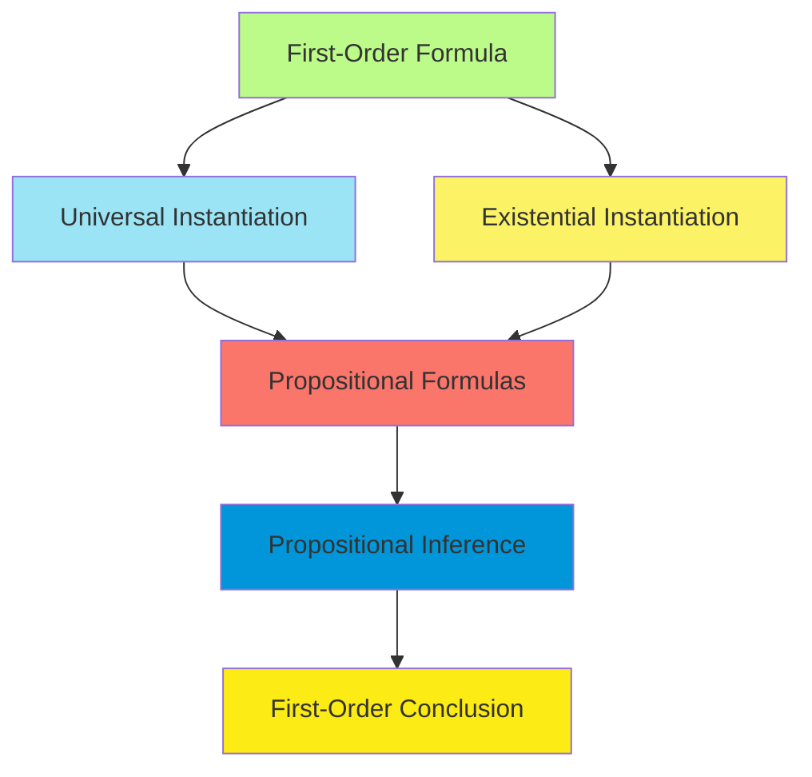
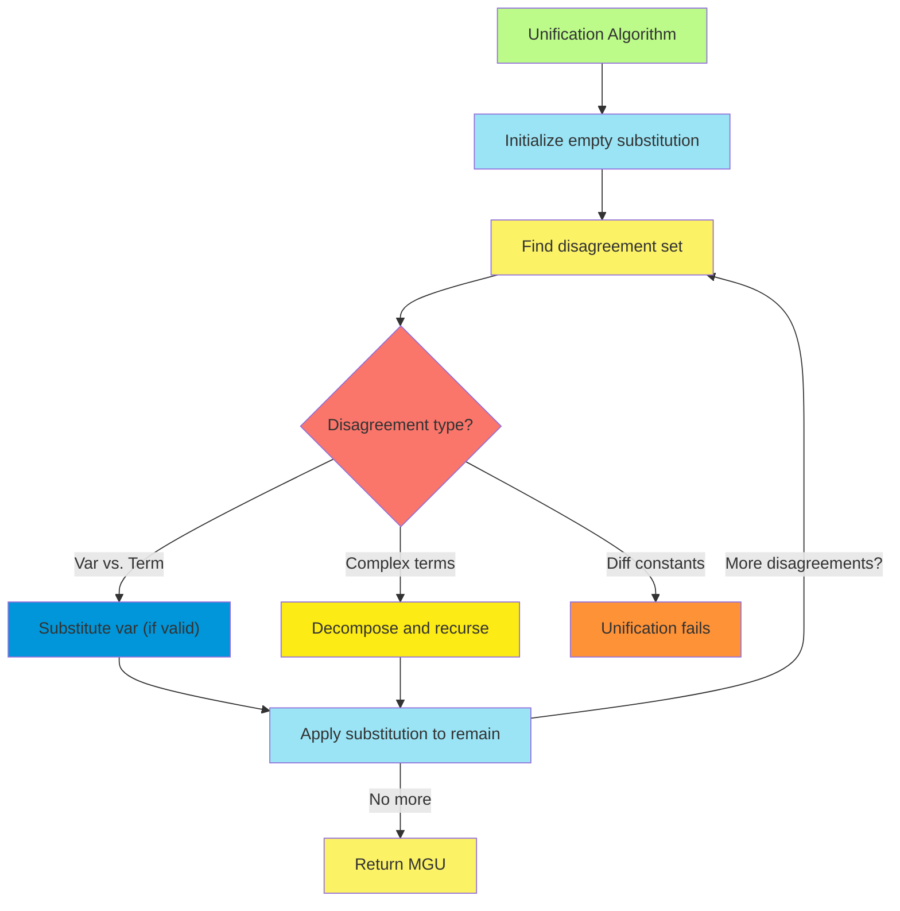
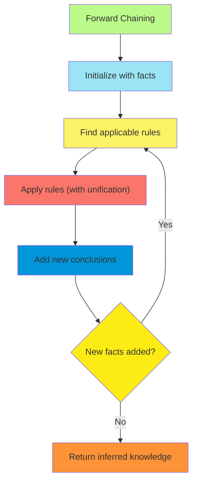
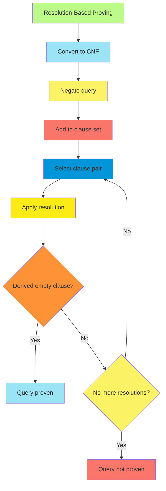

# C-9 | S-3: Inference in First-Order Logic

1. Propositional vs. First-Order Inference
    - Universal and Existential Instantiation
    - Reduction to Propositional Inference
    - Herbrand's Theorem
    - Semidecidability of First-Order Logic
2. Unification and Lifting
    - The Unification Algorithm
    - Most General Unifiers
    - Efficient Storage and Retrieval of Facts
    - Lifting Propositional Inference Rules
3. Forward and Backward Chaining
    - First-Order Definite Clauses
    - Forward Chaining Algorithms and Optimizations
    - Backward Chaining and Goal-Directed Inference
    - Logic Programming with Prolog
4. Resolution-Based Theorem Proving
    - Conjunctive Normal Form for First-Order Logic
    - First-Order Resolution
    - Strategies for Resolution-Based Inference
    - Handling Equality in Resolution

#### Propositional vs. First-Order Inference

##### Universal and Existential Instantiation

First-order logic (FOL) inference extends propositional inference by incorporating mechanisms for handling quantified
variables. Two fundamental inference rules facilitate this extension:

**Universal Instantiation (UI):** The universal instantiation rule allows us to infer specific instances from
universally quantified statements. Formally:

$\frac{\forall x , \alpha[x]}{\alpha[x/g]}$

Where $\alpha[x/g]$ represents the substitution of term $g$ for variable $x$ in formula $\alpha$. The term $g$ must be a
ground term (containing no variables) that is substitutable for $x$ in $\alpha$.

Example: From $\forall x , Human(x) \Rightarrow Mortal(x)$, we can infer $Human(Socrates) \Rightarrow Mortal(Socrates)$
by substituting $Socrates$ for $x$.

**Existential Instantiation (EI):** Existential instantiation replaces an existentially quantified variable with a new
constant symbol not appearing elsewhere in the knowledge base:

$\frac{\exists x , \alpha[x]}{\alpha[x/c]}$

Where $c$ is a new constant symbol. This process is known as Skolemization.

Example: From $\exists x , Crown(x) \wedge OnHead(x, King)$, we can infer $Crown(C1) \wedge OnHead(C1, King)$ where $C1$
is a new constant.

The crucial distinction between these instantiation rules:

- UI permits substitution with any ground term
- EI requires substitution with a new constant not appearing elsewhere

##### Reduction to Propositional Inference

A key approach to first-order inference involves reducing to propositional logic through instantiation:

1. **Propositionalization**: Replace all variables in first-order formulas with specific ground terms
2. **Apply propositional inference**: Use resolution, truth tables, or other propositional methods
3. **Combine results**: Integrate the propositional inferences to derive first-order conclusions

The primary challenge lies in determining which ground terms to use for instantiation. For knowledge bases with $n$
constants and function symbols, the potential number of ground terms is infinite due to function composition (e.g.,
$f(a)$, $f(f(a))$, $f(f(f(a)))$, etc.).

##### Herbrand's Theorem

Herbrand's theorem provides a theoretical foundation for propositionalizing first-order logic:

**Theorem**: If a set of first-order sentences $S$ is unsatisfiable, then there exists a finite set of ground instances
of clauses in $S$ that is also unsatisfiable.

Key implications:

1. If a knowledge base entails a formula, a proof can be constructed using only ground instances
2. The search for proofs can be limited to ground instances, though the set might be very large

The **Herbrand universe** for a set of sentences $S$ is the set of all ground terms constructible from:

- Constants appearing in $S$ (if none, add a constant symbol)
- Function symbols appearing in $S$

The **Herbrand base** is the set of all ground atomic formulas constructible from:

- Predicate symbols in $S$
- Terms in the Herbrand universe

A **Herbrand interpretation** assigns a truth value to each element of the Herbrand base.

##### Semidecidability of First-Order Logic

Unlike propositional logic, first-order logic is only semidecidable:

1. **Decidability**: If $KB \models \alpha$, a complete procedure will eventually verify this
2. **Semidecidability**: If $KB \models \alpha$, a procedure will eventually verify this; but if
   $KB \not\models \alpha$, the procedure may run forever

This limitation arises because:

- The Herbrand universe is potentially infinite with function symbols
- No algorithm can determine in finite time whether an arbitrary first-order formula is valid
- First-order logic lacks the finite model property of propositional logic

Church's theorem (1936) and Turing's results establish that first-order logical entailment is undecidable in general.
This has profound implications for automated reasoning in FOL.

#### Unification and Lifting

##### The Unification Algorithm

Unification serves as the cornerstone of efficient first-order inference by determining when two predicates or terms can
be made identical through variable substitution.

**Definition**: A substitution $\theta$ unifies two expressions $p$ and $q$ if $p\theta = q\theta$ (where $p\theta$
represents the result of applying substitution $\theta$ to expression $p$).

The unification algorithm:

1. Initialize substitution $\theta = {}$ (empty substitution)
2. For each pair of corresponding terms in the expressions: a. If both are constants, they must be identical b. If one
   is a variable, substitute it with the other term (if consistent) c. If both are complex expressions, recursively
   unify their components
3. If any step fails, unification fails; otherwise, return the unified substitution $\theta$

For example:

- $Knows(John, x)$ and $Knows(y, Mother(y))$ unify with $\theta = {x/Mother(John), y/John}$
- $Knows(John, x)$ and $Knows(y, Mother(z))$ unify with $\theta = {x/Mother(z), y/John}$
- $Knows(John, x)$ and $Knows(x, Elizabeth)$ do not unify (inconsistent binding for $x$)

##### Most General Unifiers

A **most general unifier (MGU)** is a substitution that:

1. Successfully unifies the expressions
2. Imposes the minimal constraints necessary for unification

Formally, $\mu$ is an MGU for expressions $p$ and $q$ if:

- $\mu$ unifies $p$ and $q$
- For any other unifier $\theta$, there exists a substitution $\lambda$ such that $\theta = \mu\lambda$

The MGU theorem states that if two expressions can be unified, there exists a unique MGU (up to variable renaming).

Computing the MGU:

1. Initialize the substitution as empty: $\theta = {}$
2. Decompose the expressions recursively
3. Apply variable elimination for each variable binding
4. Check for circularity (occur check)

Example: The MGU of $P(x, f(y))$ and $P(g(z), w)$ is ${x/g(z), w/f(y)}$

##### Efficient Storage and Retrieval of Facts

Practical first-order inference systems must efficiently manage large knowledge bases. Key techniques include:

**Indexing Methods**:

1. **Predicate Indexing**: Organize facts by predicate symbol
2. **Constant Indexing**: Create indexes based on constants appearing in arguments
3. **Path Indexing**: Index terms based on their structural paths
4. **Discrimination Trees**: Hierarchical structures for term matching

**Subsumption Checking**: Detecting when one clause is more general than another to eliminate redundancy.

Example:

- $P(x, y)$ subsumes $P(A, B)$
- $P(x) \vee Q(y)$ subsumes $P(A) \vee Q(B) \vee R(C)$

**Term Sharing**: Representing terms with identical structure only once in memory (using directed acyclic graphs).

These optimizations can reduce the computational complexity from exponential to polynomial for many practical inference
tasks.

##### Lifting Propositional Inference Rules

"Lifting" refers to extending propositional inference rules to handle first-order formulas directly, avoiding excessive
instantiation.

**Lifted Modus Ponens**: $\frac{\alpha_1 \Rightarrow \beta_1, \alpha_2}{\beta_2\theta}$

Where $\theta$ is the MGU of $\alpha_1$ and $\alpha_2$, and $\beta_2$ is $\beta_1$ with substitution $\theta$ applied.

Example:

- Premises: $\forall x , Knows(John, x) \Rightarrow Likes(John, x)$ and $Knows(John, Jane)$
- Unify $Knows(John, x)$ with $Knows(John, Jane)$ giving $\theta = {x/Jane}$
- Conclude: $Likes(John, Jane)$

**Lifted AND-Introduction**:
$\frac{\alpha_1, \alpha_2, ..., \alpha_n}{\alpha_1 \wedge \alpha_2 \wedge ... \wedge \alpha_n}$

With variables unified consistently across all premises.

By lifting inference rules, we can derive conclusions directly from quantified premises without explicitly generating
all ground instances, significantly improving efficiency.

#### Forward and Backward Chaining

##### First-Order Definite Clauses

First-order definite clauses are an important subset of FOL formulas that allow efficient inference algorithms:

**Definition**: A first-order definite clause is a disjunction of literals with exactly one positive literal,
expressible as an implication: $\neg P_1 \vee \neg P_2 \vee ... \vee \neg P_n \vee Q$ or equivalently:
$P_1 \wedge P_2 \wedge ... \wedge P_n \Rightarrow Q$

Key properties:

1. All variables are implicitly universally quantified
2. The single positive literal acts as the conclusion
3. The negative literals form the conjunction of premises

Example: $\forall x,y,z , Parent(x,y) \wedge Parent(y,z) \Rightarrow Grandparent(x,z)$

A first-order definite clause knowledge base (Horn KB) consists of:

- **Facts**: Unit clauses with no premises (e.g., $Parent(John, Mary)$)
- **Rules**: Implications with at least one premise

The restricted form of definite clauses enables more efficient inference procedures compared to full FOL.

##### Forward Chaining Algorithms and Optimizations

Forward chaining applies rules to derive new facts from existing ones, repeating until no new facts can be derived:

**Basic Algorithm**:

1. Start with known facts in working memory
2. Find all rules whose premises match facts (using unification)
3. Add the instantiated conclusions to working memory
4. Repeat until no new facts can be derived

**Optimizations**:

1. **Pattern matching networks**: Efficient matching of facts against rule premises
    - Rete algorithm: Shares common pattern matching across rules
    - TREAT algorithm: Optimizes joins between matched patterns
2. **Incremental forward chaining**: Update only affected derivations when new facts arrive
3. **Dependency-directed backtracking**: Track which facts are derived from which others

Time complexity: $O(n^k)$ where $n$ is the number of constants and $k$ is the maximum number of variables in any rule.

##### Backward Chaining and Goal-Directed Inference

Backward chaining starts with a query and works backward to find supporting facts:

**Basic Algorithm**:

1. Start with the goal query
2. Find rules whose conclusion unifies with the goal
3. Add the premises of matching rules as subgoals
4. Recursively prove all subgoals
5. If any proof path succeeds, the original goal is proven

**Implementation Considerations**:

1. **Depth-first vs. breadth-first search**: Trading memory usage for completeness
2. **Tabling (memoization)**: Storing results of previously proven subgoals
3. **Loop detection**: Preventing infinite recursion on cyclic rule dependencies

The key advantage of backward chaining is its goal-directed nature, focusing only on relevant rules and facts rather
than deriving all possible consequences.

Example Trace:

- Goal: $Grandparent(John, ?x)$
- Rule: $Parent(x,y) \wedge Parent(y,z) \Rightarrow Grandparent(x,z)$
- Subgoals: $Parent(John, ?y)$ and $Parent(?y, ?x)$
- Facts: $Parent(John, Mary)$, $Parent(Mary, Steve)$
- Solution: $?y = Mary$, $?x = Steve$, yielding $Grandparent(John, Steve)$

##### Logic Programming with Prolog

Prolog implements backward chaining on first-order definite clauses:

**Prolog Syntax**:

- Facts: `parent(john, mary).`
- Rules: `grandparent(X, Z) :- parent(X, Y), parent(Y, Z).`
- Queries: `?- grandparent(john, Who).`

**Core Features**:

1. **Unification**: Automatic pattern matching for variables
2. **Backtracking**: Exhaustive exploration of solution space
3. **Depth-first search**: Left-to-right, top-to-bottom rule evaluation
4. **Closed-world assumption**: What cannot be proven is assumed false

**Limitations and Extensions**:

1. **Negation as failure**: `not(P)` succeeds if `P` fails
2. **Cut operator (!)**: Prevents backtracking to explore alternatives
3. **Extra-logical features**: I/O, assertions, retractions

Prolog provides a practical implementation of first-order logic inference for many applications, but its semantics
differ from pure FOL in significant ways, particularly in its handling of negation and the closed-world assumption.

#### Resolution-Based Theorem Proving

##### Conjunctive Normal Form for First-Order Logic

Resolution operates on formulas in conjunctive normal form (CNF). Converting FOL to CNF involves:

1. **Eliminate implications**: Replace $\alpha \Rightarrow \beta$ with $\neg \alpha \vee \beta$

2. Move negation inward

    :

    - $\neg(\neg \alpha)$ becomes $\alpha$
    - $\neg(\alpha \wedge \beta)$ becomes $\neg\alpha \vee \neg\beta$
    - $\neg(\alpha \vee \beta)$ becomes $\neg\alpha \wedge \neg\beta$
    - $\neg(\forall x , \alpha)$ becomes $\exists x , \neg\alpha$
    - $\neg(\exists x , \alpha)$ becomes $\forall x , \neg\alpha$

3. **Standardize variables**: Ensure each quantifier uses a unique variable

4. Skolemize existential variables

    :

    - $\exists x , P(x)$ becomes $P(c)$ where $c$ is a new constant
    - $\forall y , \exists x , P(x,y)$ becomes $\forall y , P(f(y),y)$ where $f$ is a new function

5. **Drop universal quantifiers**: All remaining variables are implicitly universally quantified

6. **Distribute OR over AND**: $(A \vee (B \wedge C))$ becomes $(A \vee B) \wedge (A \vee C)$

Example: $\forall x , [\exists y , P(x,y)] \Rightarrow [\exists z , Q(x,z)]$ converts to:
$\neg P(x,f(x)) \vee Q(x,g(x))$

where $f$ and $g$ are Skolem functions.

##### First-Order Resolution

Resolution extends the propositional resolution rule to handle first-order formulas:

$\frac{l_1 \vee ... \vee l_i \vee ... \vee l_k, \quad m_1 \vee ... \vee m_j \vee ... \vee m_n}{(l_1 \vee ... \vee l_{i-1} \vee l_{i+1} \vee ... \vee l_k \vee m_1 \vee ... \vee m_{j-1} \vee m_{j+1} \vee ... \vee m_n)\theta}$

Where $\theta$ is the MGU of complementary literals $l_i$ and $\neg m_j$.

The resolution process:

1. Convert all formulas to CNF
2. Negate the query and add it to the knowledge base
3. Apply resolution repeatedly to derive new clauses
4. If the empty clause (contradiction) is derived, the original query is proven

Completeness: If a set of clauses is unsatisfiable, resolution will eventually derive the empty clause.

##### Strategies for Resolution-Based Inference

Pure resolution can be inefficient due to combinatorial explosion. Several strategies improve performance:

1. **Unit preference**: Prefer resolutions involving unit clauses (single literals)
2. **Set of support**: Only resolve clauses when at least one is from the query or its descendants
3. **Input resolution**: At least one parent must be an input clause (original KB or query)
4. **Linear resolution**: Each resolution step involves the previous resolvent
5. **Ordered resolution**: Only resolve on maximal literals in each clause
6. **Paramodulation**: Special inference rule for equality reasoning

**Subsumption elimination**: Remove clauses that are more specific versions of existing clauses.

Example: $P(x)$ subsumes $P(A) \vee Q(B)$ because any model satisfying the latter must satisfy the former.

These strategies preserve completeness while significantly reducing the search space.

##### Handling Equality in Resolution

Equality presents special challenges in resolution theorem proving:

**Naive Approach**: Axiomatize equality properties

- Reflexivity: $\forall x , (x = x)$
- Symmetry: $\forall x,y , (x = y \Rightarrow y = x)$
- Transitivity: $\forall x,y,z , (x = y \wedge y = z \Rightarrow x = z)$
- Substitution: $\forall x,y , (x = y \Rightarrow f(x) = f(y))$

This approach is inefficient as it generates many unnecessary clauses.

**Efficient Approaches**:

1. **Paramodulation**: A specialized inference rule
   $\frac{l_1 \vee ... \vee l_i \vee ... \vee l_k, \quad t_1 = t_2 \vee D}{(l_1 \vee ... \vee l_i[t_2/t_1] \vee ... \vee l_k \vee D)\theta}$

    Where $\theta$ is the MGU of term $t_1$ and a subterm in literal $l_i$.

2. **Demodulation**: Simplify terms using equalities as rewrite rules

    - Convert $s = t$ to a rewrite rule $s \rightarrow t$ (if $s$ is more complex)
    - Apply rules to simplify expressions

3. **E-unification**: Unification modulo equality theory

    - Consider terms equal if they can be proven equal under equality axioms
    - More powerful but computationally expensive

These techniques enable efficient reasoning in domains where equality is essential, such as mathematics, formal
verification, and abstract algebra.
